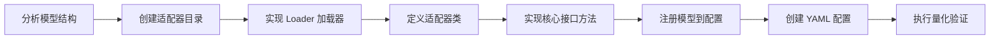

# DiT 模型接入量化流程指南

## 1. 适用范围

本文档面向需要将**新的多模态生成模型**（DiT，Diffusion Transformer）接入 msModelSlim 量化流程的开发人员，介绍从创建模型适配器、实现组件接口、注册模型到执行量化验证的完整接入流程。

**适用对象**：负责新 DiT 模型接入的模型开发或量化工程师。

**适用场景**：

- 目标多模态生成模型不在支持矩阵中，需要新增 `model_type` 并打通量化链路；
- 已有 `model_type` 需要扩展新的量化模式（如从 W8A8 MXFP8 扩展至 W4A4 MXFP4）。

**不适用场景**：

- 模型已在支持矩阵中且目标量化模式已验证：请直接按《[DiT 量化使用指南](usage_diffusion_transformer_quantization.md)》执行，无需编写适配器；
- 多模态理解 / 纯语言模型的接入：见《[VLM 模型接入量化流程指南](../vlm/integration_guide_vision_transformer_quantization.md)》与《[LLM 模型接入量化流程指南](../llm/integration_guide_large_language_model_quantization.md)》。

> 本文档只讲「接入新模型的开发流程」。基础接口概念与模型适配器设计，请先阅读《[多模态生成模型接入指南](../../model/integrating_multimodal_generation_model.md)》。

## 2. 流程关系与前置条件

**上级流程**：先阅读《[多模态生成模型接入指南](../../model/integrating_multimodal_generation_model.md)》，理解接口与模型适配器的基本概念后，再进入本接入流程。

**前置条件**：

- msModelSlim 已安装，可执行 `msmodelslim --help`
- 目标 DiT 浮点权重已下载到本地，其官方推理仓库可安装并加入 `PYTHONPATH`
- 浮点去噪推理管线可正常运行（接入前先确认能跑通官方推理示例）
- 已明确目标量化场景（如 W8A8 MXFP8 静态），并知晓其 YAML 配置协议（`apiversion: multimodal_sd_modelslim_v1`）

**后续操作**：接入并验证通过后，进入《[DiT 量化使用指南](usage_diffusion_transformer_quantization.md)》调整量化参数，或进入正式量化部署。

## 3. 输入和交付件

| 类型 | 名称 | 来源或保存位置 | 格式或约束 | 验收方式 |
| --- | --- | --- | --- | --- |
| 输入 | 浮点 DiT 权重目录 | 本地路径（从 ModelScope / HuggingFace 下载） | 含模型权重文件及配置文件 | 可被官方推理管线加载 |
| 输入 | 官方推理仓库 | 本地路径，加入 `PYTHONPATH` | 可执行浮点去噪推理 | 官方推理示例可正常运行 |
| 交付件 | 模型适配器代码 | `msmodelslim/model/{model_name}/` | Python 源码，含 loader、model_adapter 等 | 代码审查通过 |
| 交付件 | 模型注册配置 | `config/config.ini` | `[ModelAdapter]`、`[ModelAdapterEntryPoints]` 等段落 | key 一致，`msmodelslim` 可通过 `--model_type` 创建适配器 |
| 交付件 | 量化配置 | `lab_practice/{model_name}/` | YAML 格式（`apiversion: multimodal_sd_modelslim_v1`） | 配置校验通过 |
| 交付件 | 量化权重目录 | `--save_path` 指定路径 | MindIE-SD 格式，多专家含各专家子目录 | 推理冒烟通过 |

## 4. 流程总览



## 5. 操作步骤

以下以 W8A8 MXFP8 静态量化场景（简称“场景示例”）为例，给出接入新 DiT 模型的通用步骤。其余量化场景（W4A4 MXFP4、纯动态等）接入流程一致，仅 YAML 配置不同，参数选择参考《[DiT 量化使用指南](usage_diffusion_transformer_quantization.md)》。

### 步骤 1：分析模型结构，确定适配策略

**目标**：分析目标 DiT 模型的结构特点，确定多模态生成量化的接入策略。

**操作**：

1. **分析模型架构**：查阅目标模型的官方实现，确定其结构组成——主干 Transformer 的 Attention Block 类名、辅助模块（VAE、Text Encoder）构成、以及是单网络还是多专家结构。
2. **确定加载策略**：DiT 模型通常依赖官方推理仓库（通过推理管线加载），需确认该仓库可正常执行浮点推理，并了解其参数体系（分辨率、帧数、步数、任务类型等）。
3. **确定量化对象**：量化主要针对主干 Transformer 的 Attention Block，辅助模块（VAE、Text Encoder）通常不量化。
4. **确定编排路径**：新接入模型实现 `MultimodalPipelineInterface`（重构路径）；若需兼容既有主仓适配器行为，可保留 `LegacyMultimodalPipelineInterface`。

**分析要点**：

- 主干 Transformer 的 Attention Block 类名与 `forward` 签名
- 是否多专家结构（双专家需分别量化，`init_model` 返回各专家子模型字典）
- 推理管线支持的生成任务类型（文生图/图生图/文生视频/图生视频等）

**输出**：模型结构分析文档，确定适配策略

### 步骤 2：创建模型适配器目录与文件

**目标**：创建模型适配器目录结构，包含必要的文件。

**操作**：

在 `msmodelslim/model/` 下创建模型目录，目录名建议与模型系列名一致：

```text
msmodelslim/model/{model_name}/
├── __init__.py          # 导出适配器类，可为空
├── model_adapter.py     # 主适配器文件
├── loader.py            # 加载器文件
├── base_model_adapter.py    # （可选）多专家模型的基础适配器
├── expert_sub_adapter.py    # （可选）专家子适配器
├── constants.py         # （可选）常量定义（默认尺寸、示例 prompt 等）
└── {task}/              # （可选）按生成任务拆分
    ├── __init__.py
    ├── model_adapter.py
    └── loader.py
```

> 文件是否必需取决于目标模型的实际结构：单网络 DiT 通常只需 `model_adapter.py` 与 `loader.py`；双专家模型需增加 `base_model_adapter.py`、`expert_sub_adapter.py`；多任务（如文生视频/图生视频）模型可按任务拆分子目录。

**输出**：模型适配器目录结构创建完成

### 步骤 3：实现 Loader 加载器

**目标**：实现加载器类，注册适配器类的导入路径。

**操作**：

加载器继承 `BaseModelAdapterLoader`，只需指定适配器类的完整导入路径：

```python
# msmodelslim/model/{model_name}/loader.py
from msmodelslim.model.plugin_factory.base_loader import BaseModelAdapterLoader


class {ModelName}AdapterLoader(BaseModelAdapterLoader):
    ADAPTER_CLASS_PATH = "msmodelslim.model.{model_name}.model_adapter:{ModelName}ModelAdapter"
```

**输出**：加载器文件创建完成

### 步骤 4：定义适配器类，继承所需接口

**目标**：定义模型适配器主类，继承基础适配器和多模态生成量化接口。

**操作**：

适配器类继承规则：

- **必须继承** `BaseModelAdapter`（不继承 `TransformersModel`，DiT 模型依赖官方推理管线加载）和 `MultimodalPipelineInterface`（或 `LegacyMultimodalPipelineInterface`）
- **可选继承**：根据量化算法需求，实现 `OnlineQuaRotInterface`、`FA3QuantAdapterInterface`、`IterSmoothInterface` 等

```python
from msmodelslim.model.base import BaseModelAdapter
from msmodelslim.model.interface_hub import (
    ModelInfoInterface,
    OnlineQuaRotInterface,
    FA3QuantAdapterInterface,
    IterSmoothInterface,
)
from msmodelslim.core.quant_service.multimodal_sd_v1.pipeline_interface import (
    MultimodalPipelineInterface,
)
from msmodelslim.utils.logging import logger_setter


@logger_setter("msmodelslim.model.{model_name}")
class {ModelName}ModelAdapter(
    BaseModelAdapter,                    # 必须：DiT 依赖官方推理管线加载，不使用 TransformersModel
    ModelInfoInterface,                  # 必须：模型信息
    MultimodalPipelineInterface,         # 必须：多模态生成 pipeline（重构路径）
    FA3QuantAdapterInterface,            # 可选：FA3 激活量化
    OnlineQuaRotInterface,               # 可选：在线 QuaRot
    IterSmoothInterface,                 # 可选：异常值抑制
):
    def __init__(self, model_type: str, model_path: Path, trust_remote_code: bool = False):
        super().__init__(model_type, model_path, trust_remote_code)
        self.pipeline = None
        self.transformer = None
        self.model_args = None
        self._get_default_model_args()
```

> 若需兼容 Legacy 编排路径，可改为继承 `LegacyMultimodalPipelineInterface`（实现 `set_model_args`、`load_pipeline`、`run_calib_inference`、`apply_quantization`）。新接入模型优先使用 `MultimodalPipelineInterface`。

**输出**：适配器类骨架定义完成

### 步骤 5：实现核心接口方法

**目标**：实现适配器的核心接口方法，使模型可被量化框架调度。

**操作**：

#### 5.1 `get_inference_config_class`——定义推理配置类

DiT 的推理参数（分辨率、帧数、步数、任务类型等）需由适配器校验并桥接到官方推理仓库。定义 Pydantic 配置类并返回其类对象：

```python
class {ModelName}InferenceConfig(BaseModel):
    model_config = ConfigDict(extra="forbid")
    size: Optional[str] = "1280*720"       # 分辨率，与原推理仓支持列表一致
    frame_num: Optional[int] = 81          # 帧数（视频类任务）
    sample_steps: Optional[int] = 40       # 去噪步数
    # ... 其余与原推理仓 CLI 可对齐的字段

def get_inference_config_class(self):
    return self.{ModelName}InferenceConfig
```

#### 5.2 `configure_runtime`——桥接推理参数到官方推理仓库

将已校验的 `inference_config` 转为官方推理仓库的 `model_args`。核心是构造最小 argv、合并 YAML 配置与量化固定覆盖项，再通过临时改写 `sys.argv` 调用原仓的 `parse_args`：

```python
def configure_runtime(self, inference_config: {ModelName}InferenceConfig) -> None:
    override = inference_config.model_dump(exclude_none=True)
    allowed_attrs = self._allowed_{model_name}_config_keys()   # 懒探测原仓合法字段
    # ... 非法字段校验（SchemaValidateError）
    argv = self._build_default_quant_cli()                     # 满足原仓校验的最小 CLI
    argv.extend(self._namespace_to_argv(override))             # dict -> argv
    argv.extend(self._namespace_to_argv(self._fixed_quant_runtime_overrides()))
    self.model_args = self._parse_args_from_{model_name}(argv) # 临时改写 sys.argv 调用原仓 parse_args
```

#### 5.3 `handle_dataset`——处理校准数据集

统一将输入数据集转换为 `List[VlmCalibSample]` 并完成场景校验（如文生视频禁图、图生视频强制带图等），dump 前仅做校验，不执行模型 forward：

```python
def handle_dataset(
    self,
    dataset: Any,
    device: DeviceType = DeviceType.NPU,
) -> List[VlmCalibSample]:
    if dataset is None:
        return []
    if isinstance(dataset, VlmCalibSample):
        return self.validate_calib_samples([dataset])
    return self.validate_calib_samples(list(dataset))
```

#### 5.4 `init_model`——初始化需要量化的子模型

加载推理管线（`_load_pipeline`），并按专家结构返回需要量化的子模型字典。单网络返回 `{'': self.transformer}`，双专家返回各专家子模型：

```python
def init_model(self, device: DeviceType = DeviceType.NPU) -> Dict[str, nn.Module]:
    self._load_pipeline()
    # 多专家结构返回各专家子模型；单网络返回 {'': self.transformer}
    return {
        'low_noise_model': self.low_noise_model,
        'high_noise_model': self.high_noise_model,
    }
```

> `init_model` 返回的每个 expert 必须在 `calib_data` 中有对应 key；量化服务对每个专家循环量化，**不支持**仅量化部分专家。

#### 5.5 `prepare_calib_data` / `inference_dump_calib_data`——校准数据 dump

DiT 量化不是直接用外部校准数据集，而是先运行**完整浮点去噪推理管线**，把各层激活 dump 为 pth 文件作为校准数据。`enable_dump` 为 true 时执行浮点推理生成缓存，否则加载已有 pth：

```python
def prepare_calib_data(self, models, dump_config, save_path, dataset, inference_config):
    # 按 expert_name 构造 calib_data_<task>_<expert>.pth 路径；
    # enable_dump 时调用 inference_dump_calib_data 生成缓存，否则加载已有 pth
    ...

def inference_dump_calib_data(self, dataset=None, inference_config=None):
    stream = torch.npu.Stream()
    for sample in tqdm(dataset, desc="Dump calib data by float model inference"):
        seed = self._runtime_value(inference_config, "base_seed")
        torch.manual_seed(seed)
        torch.npu.manual_seed_all(seed)
        self._generate_video(sample.text, sample.image, inference_config)  # 场景差异逻辑
        stream.synchronize()
```

#### 5.6 `quantization_context`——量化上下文

提供量化时的 `autocast` / `no_grad` / 模块 device 切换等上下文：

```python
@contextmanager
def quantization_context(self):
    # 双专家同时进入 autocast + no_sync 上下文
    with amp.autocast(dtype=self.model_args.param_dtype), torch.no_grad(), ExitStack() as stack:
        for m in (self.low_noise_model, self.high_noise_model):
            if m is not None:
                stack.enter_context(getattr(m, "no_sync", nullcontext)())
        yield
```

#### 5.7 `generate_model_visit` / `generate_model_forward`——逐块访问与前向

DiT 无标准 Decoder Layer 概念，通过类名关键字（如 `attentionblock`）定位 Attention Block，按 LayerWise 语义逐块访问；前向通过 hook 获取第一个 Block 的输入后逐块传递：

```python
def generate_model_visit(self, model: torch.nn.Module, transformer_blocks=None):
    return generated_decoder_layer_visit_func_with_keyword(
        model, keyword="attentionblock"  # 关键字须与目标模型 Block 类名匹配
    )

def generate_model_forward(self, model, inputs):
    # 1. 获取所有 Attention Block
    transformer_blocks = [
        (name, module) for name, module in model.named_modules()
        if "attentionblock" in module.__class__.__name__.lower()
    ]

    # 2. 通过 hook 获取第一个 Block 的输入
    first_block_input = None

    def break_hook(module, hook_args, hook_kwargs):
        nonlocal first_block_input
        first_block_input = (hook_args, hook_kwargs)
        raise TransformersForwardBreak()

    hooks = [transformer_blocks[0][1].register_forward_pre_hook(
        break_hook, with_kwargs=True
    )]

    try:
        model(*inputs) if isinstance(inputs, (list, tuple)) else model(inputs)
    except TransformersForwardBreak:
        pass
    finally:
        for hook in hooks:
            hook.remove()

    # 3. 逐块前向传播
    current_inputs = first_block_input
    for name, block in transformer_blocks:
        args, kwargs = current_inputs
        outputs = yield ProcessRequest(name, block, args, kwargs)
        current_inputs = ((outputs,), current_inputs[1])
```

#### 5.8 `enable_kv_cache`——控制 KVCache

逐块量化时通常禁用 KVCache 以减少显存占用。实现该方法即可在 LayerWiseRunner 调度时按需开启/关闭模型内部缓存。DiT 模型通常不维护自回归 KVCache，但接入 `MultimodalPipelineInterface` 的基类契约要求实现该方法（默认 `pass`）：

```python
def enable_kv_cache(self, model: nn.Module, need_kv_cache: bool) -> None:
    # DiT 无自回归缓存；按需开启/关闭模块内部 cache 即可，默认 pass
    pass
```

> 多专家模型需在专家子适配器中显式转发到主适配器实现（如 `Wan2_2ExpertSubAdapter.enable_kv_cache`），以确保 LayerWiseRunner 按专家调度时正确生效。

#### 5.9 可选：实现量化扩展接口

DiT 适配器可按需继承以下可选接口，启用对应量化算法。多专家模型还需保证专家子适配器**显式继承**相同接口（见 5.10）。

**Online QuaRot（在线 QuaRot）/ FA3（FA3 激活量化）**：实现 `get_online_rotation_configs`（为 Attention 的 Q/K 注册 `q_rot`/`k_rot`）和 `inject_fa3_placeholders`（注入 `fa3_q/k/v` 占位并包裹 Attention 的 forward）。

**IterSmooth（异常值抑制）**：继承 `IterSmoothInterface` 并实现 `get_adapter_config_for_subgraph`，对每个 Attention Block 定义 Norm-Linear、OV、Cross-Attention Q/KV 等子图的融合映射。DiT 的子图结构与 LLM/VLM 不同——同时存在 Self-Attention 与 Cross-Attention，且 Cross-Attention 的 Q 与 K/V 来源不同需分开统计 smooth scale：

```python
from msmodelslim.model.interface_hub import IterSmoothInterface

class {ModelName}ModelAdapter(
    BaseModelAdapter,
    ModelInfoInterface,
    MultimodalPipelineInterface,
    IterSmoothInterface,
):
    def get_adapter_config_for_subgraph(self, num_layers) -> List[AdapterConfig]:
        adapter_config = []
        for layer_idx in range(num_layers):
            # Self-Attention：input_layernorm -> QKV
            self_attn_qkv = MappingConfig(targets=[
                f"blocks.{layer_idx}.self_attn.q",
                f"blocks.{layer_idx}.self_attn.k",
                f"blocks.{layer_idx}.self_attn.v",
            ])
            # Cross-Attention：Q 与 K/V 来源不同，分别建立映射
            cross_attn_q = MappingConfig(targets=[f"blocks.{layer_idx}.cross_attn.q"])
            cross_attn_kv = MappingConfig(targets=[
                f"blocks.{layer_idx}.cross_attn.k",
                f"blocks.{layer_idx}.cross_attn.v",
            ])
            # O 层（self / cross）
            o_self = MappingConfig(targets=[f"blocks.{layer_idx}.self_attn.o"])
            o_cross = MappingConfig(targets=[f"blocks.{layer_idx}.cross_attn.o"])
            adapter_config.extend([
                AdapterConfig(subgraph_type="norm-linear", mapping=self_attn_qkv),
                AdapterConfig(subgraph_type="norm-linear", mapping=cross_attn_q),
                AdapterConfig(subgraph_type="norm-linear", mapping=cross_attn_kv),
                AdapterConfig(subgraph_type="norm-linear", mapping=o_self),
                AdapterConfig(subgraph_type="norm-linear", mapping=o_cross),
            ])
        return adapter_config
```

> DiT 的 Norm-Linear 子图一般不需要 Up-Down / OV 融合（与 LLM/VLM 的 FFN 结构差异），是否扩展需结合目标模型实际 Attention Block 结构。模块路径（`blocks.{i}.self_attn.q` 等）仅为示意，须替换为目标模型的真实子模块路径。

#### 5.10 多专家模型：专家子适配器显式继承须知

多专家 DiT 模型（双专家如 Wan2.2）的 `LayerWiseRunner` 通过 `isinstance(adapter, OnlineQuaRotInterface)` 等判断是否启用扩展算法，**仅靠主适配器继承 + `__getattr__` 代理不足以触发**。专家子适配器必须显式继承所有主适配器继承的扩展接口（如 `OnlineQuaRotInterface`、`FA3QuantAdapterInterface`、`IterSmoothInterface`），并在子适配器内将各方法显式转发到主适配器：

```python
class {ModelName}ExpertSubAdapter(
    BaseModelAdapter,
    OnlineQuaRotInterface,        # 显式继承，缺一不可
    FA3QuantAdapterInterface,     # 显式继承，缺一不可
    IterSmoothInterface,          # 显式继承，缺一不可
):
    def __init__(self, parent, expert_name):
        self._parent = parent
        self.expert_name = expert_name
        self._module = None

    def bind_module(self, module):
        self._module = module

    def __getattr__(self, item):
        # 仅作为兜底代理；扩展接口方法必须显式实现
        return getattr(self._parent, item)

    def get_online_rotation_configs(self, model=None):
        target = model if model is not None else self._module
        return self._parent.get_online_rotation_configs(target)

    def inject_fa3_placeholders(self, root_name, root_module, should_inject):
        self._parent.inject_fa3_placeholders(root_name, root_module, should_inject)

    def get_adapter_config_for_subgraph(self):
        return self._parent.get_adapter_config_for_subgraph(self._module.num_layers)

    def enable_kv_cache(self, model, need_kv_cache):
        self._parent.enable_kv_cache(model, need_kv_cache)
```

**输出**：适配器接口方法实现完成

**通过条件**：推理配置类、`configure_runtime`、`handle_dataset`、`init_model`、校准 dump、`quantization_context`、逐块访问与前向、`enable_kv_cache` 均已实现；多专家模型的每个 expert 在 `calib_data` 中均有对应 key，且专家子适配器**显式继承**所有扩展接口。

### 步骤 6：注册模型到配置

**目标**：在 `config/config.ini` 中注册模型名称和适配器入口点。

**操作**：

在 `config/config.ini` 中添加两项配置。多模态生成建议**按场景拆分为独立 `model_type`**（与适配器子类的场景一一对应），不要通过 YAML 的 `task` 字段切换场景：

```ini
[ModelAdapter]
# 在 [ModelAdapter] 部分添加模型名称映射
{model_name} = {ModelName1}, {ModelName2}
{model_name}_t2v = {ModelName}-T2V-{Size}
{model_name}_i2v = {ModelName}-I2V-{Size}

[ModelAdapterEntryPoints]
# 在 [ModelAdapterEntryPoints] 部分添加适配器入口
{model_name} = msmodelslim.model.{model_name}.loader:{ModelName}AdapterLoader
{model_name}_t2v = msmodelslim.model.{model_name}.t2v.loader:{ModelName}T2VAdapterLoader
{model_name}_i2v = msmodelslim.model.{model_name}.i2v.loader:{ModelName}I2VAdapterLoader
```

> 注意 `ModelAdapter` 与 `ModelAdapterEntryPoints` 中的 key 需要保持一致，否则配置不生效。多专家模型的 `init_model` 专家 key 与量化服务使用的专家名需保持一致。

**输出**：模型注册完成

### 步骤 7：创建 YAML 量化配置文件

**目标**：在 `lab_practice/` 下创建对应的量化配置文件。

**操作**：

在 `lab_practice/{model_name}/` 下创建 YAML 文件，使用 `apiversion: multimodal_sd_modelslim_v1`，需配置推理参数与校准 dump。以下为 W8A8 MXFP8 静态量化示例：

```yaml
# lab_practice/{model_name}/{model_name}_{quant_type}_{task}.yaml
apiversion: multimodal_sd_modelslim_v1
spec:
  runner: layer_wise              # DiT 仅支持单卡逐层量化
  process:
    - type: "linear_quant"
      qconfig:
        act:
          scope: "per_block"
          dtype: "mxfp8"
          symmetric: True
          method: "minmax"
        weight:
          scope: "per_block"
          dtype: "mxfp8"
          symmetric: True
          method: "mse_round"
      include:
        - "*"
    # 可选：叠加 online_quarot / fa3_quant 提升注意力精度
    # - type: "online_quarot"
    #   include:
    #     - "*.self_attn.*"
    # - type: "fa3_quant"
    #   qconfig:
    #     dtype: "fp8_e4m3"
    #     scope: "per_token"
    #     symmetric: True
    #     method: "minmax"
    #   include:
    #     - "*self_attn"

  dataset: {model_name}_{task}      # 与受支持的 task 类型一致

  save:
    - type: "mindie_format_saver"   # 仅支持 MindIE-SD 格式落盘

  multimodal_sd_config:
    dump_config:
      enable_dump: true             # 量化前运行浮点推理管线生成校准数据
      capture_mode: "args"
      dump_data_dir: ""             # 为空时回退到 save_path
    inference_config:
      size: "1280*720"
      frame_num: 81
      sample_steps: 40
      task: "{task}-{size}"         # 与 model_type 对应的场景
```

> 与 LLM/VLM 不同，DiT 量化不是直接用外部校准数据集，而是先运行完整浮点去噪推理管线，把各层激活 dump 为 pth 文件作为校准数据。`inference_config` 决定这趟浮点推理的分辨率、帧数、步数，因此既要与目标模型适配、也要能代表真实部署场景。各配置项含义与选择参考《[DiT 量化使用指南](usage_diffusion_transformer_quantization.md#步骤-3选择并调整参数)》。

**双专家按专家差异化量化（`per_expert`）**：多专家模型（如 Wan2.2 双专家）默认所有专家共用 `spec.process` 处理器链。如需按专家差异化量化（例如仅对 `high_noise_model` 叠加 `online_quarot`），可在 `spec.per_expert` 中按专家名**整链覆盖** `process`（是覆盖而非字段级 merge；未在 `per_expert` 中列出的专家仍回退使用 `process`）：

```yaml
spec:
  process:
    - type: "linear_quant"          # 默认链：low_noise_model 等未覆盖专家使用
      qconfig:
        act: { scope: "per_block", dtype: "mxfp8", symmetric: True, method: "minmax" }
        weight: { scope: "per_block", dtype: "mxfp8", symmetric: True, method: "mse_round" }
      include: ["*"]

  per_expert:                        # 可选：按专家名整链覆盖 process
    high_noise_model:                # 与 init_model / get_expert_adapter 返回的专家名一致
      - type: "linear_quant"
        qconfig:
          act: { scope: "per_block", dtype: "mxfp8", symmetric: True, method: "minmax" }
          weight: { scope: "per_block", dtype: "mxfp8", symmetric: True, method: "mse_round" }
        include: ["*"]
      - type: "online_quarot"        # 仅 high_noise_model 叠加在线旋转
        include: ["*.self_attn.*"]
```

> `per_expert` 的 key 必须与 `init_model` 返回的 expert key（如 `low_noise_model` / `high_noise_model`）以及 `get_expert_adapter` 中各专家名完全一致，否则该专家回退到 `process` 且无告警。单网络 DiT 无需配置，直接使用 `process`。

**输出**：量化配置文件创建完成

### 步骤 8：执行量化验证

**目标**：使用量化命令验证模型适配器工作正常。

**操作**：

```bash
msmodelslim quant \
  --model_path ${MODEL_PATH} \
  --save_path ${SAVE_PATH} \
  --device npu \
  --model_type ${MODEL_TYPE} \
  --config ${CONFIG_PATH} \
  --trust_remote_code true
```

**验证要点**：

1. 推理管线加载正常，无 ImportError
2. 浮点推理生成校准数据正常
3. Attention Block 逐块量化和前向传播无报错
4. 多专家模型各专家子目录均有完整权重
5. 量化权重可被 MindIE-SD 加载

**输出**：量化验证通过

**通过条件**：推理管线加载、校准 dump、逐块量化、多专家保存均无报错，且量化权重可被 MindIE-SD 加载。

## 6. 验收条件

- 适配器代码可被 `msmodelslim` 通过 `--model_type` 匹配并创建；
- 使用步骤 7 的 YAML 配置执行 `msmodelslim quant` 成功，各专家子目录权重完整；
- 量化产物可被 MindIE-SD 加载（可选：推理冒烟通过）。

## 7. 异常处置

| 现象 | 处理方向 |
| --- | --- |
| 推理管线加载失败 | 确认官方推理仓库已安装并加入 `PYTHONPATH`；确认 `wan`、`mindiesd` 等依赖可正常导入 |
| 配置报错 `illegal config attributes` | `inference_config` 中写了原推理仓不支持的字段。确认字段名与 CLI 参数对应，使用 `_allowed_*_config_keys()` 探测合法字段 |
| 浮点推理失败 | 检查 `inference_config` 参数是否正确（size、frame_num、sample_steps、task 等）；确认 task 与模型类型匹配 |
| 校准数据缺失 | 检查 `enable_dump` 是否为 True，`dump_data_dir` 是否有写入权限；确认多专家模型的每个专家均有对应的 `calib_data` key |
| 显存不足（OOM） | 降低分辨率（`size`）或减少推理步数（`sample_steps`）；减少校准样本数量；确认指定 NPU 未被其他任务占用 |
| MindIE-SD 加载失败 | 确认使用 `mindie_format_saver` 保存权重；确认多专家模型各专家子目录权重完整 |

## 8. 接口文档列表

| 接口或能力 | 简述 | 链接 |
| --- | --- | --- |
| 通用接入指南 | 基础接口概念与多模态生成模型适配器设计 | 《[多模态生成模型接入指南](../../model/integrating_multimodal_generation_model.md)》 |
| Interface Hub | 量化机制与算法组件对模型的接口定义汇总 | 《[Interface Hub](https://gitcode.com/Ascend/msmodelslim/blob/master/msmodelslim/model/interface_hub.py)》 |
| Pipeline 接口 | 多模态生成量化服务的编排接口定义 | 《[pipeline_interface.py](https://gitcode.com/Ascend/msmodelslim/blob/master/msmodelslim/core/quant_service/multimodal_sd_v1/pipeline_interface.py)》、[legacy_pipeline_interface.py](https://gitcode.com/Ascend/msmodelslim/blob/master/msmodelslim/core/quant_service/multimodal_sd_v1/legacy_pipeline_interface.py) |
| 量化流程 | DiT 量化流程与配置参数含义 | 《[DiT 量化使用指南](usage_diffusion_transformer_quantization.md)》 |
| IterSmooth 适配 | 异常值抑制算法的模型适配接口（`get_adapter_config_for_subgraph`） | 《[Iterative Smooth 适配](../../quantization_algorithms/iterative_smooth/term_iterative_smooth.md)》 |
| Online QuaRot 适配 | 在线 QuaRot 算法的模型适配接口（`get_online_rotation_configs`） | 《[QuaRot 适配](../../quantization_algorithms/quarot/term_quarot.md)》 |
| FA3 适配 | FA3 激活量化的模型适配接口（`inject_fa3_placeholders`） | 《[FA3 适配](../../quantization_algorithms/fa3_quant/term_fa3_quant.md)》 |

## 9. 安全说明

- `trust_remote_code` 默认保持 `False`；仅当浮点仓库必须执行自定义代码且来源可信、可审计时开启。
- 校准数据、dump 缓存与量化产物按业务权限管控，勿将含业务数据的校准集或日志提交到公开渠道。
