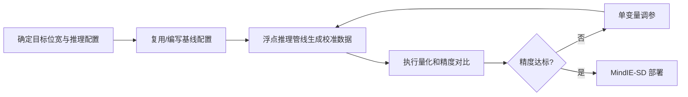

# Diffusion Transformer（DiT）量化使用指南

## 1. 适用范围

本指南面向首次对 Diffusion Transformer 架构的多模态生成模型（如 FLUX.1、HunyuanVideo、Wan2.2、Qwen-Image-Edit 等）执行[训练后量化（PTQ）](../term_ptq.md)的用户。**重点不是展开完整执行命令，而是给出可上手的推荐配置，并说明每个配置项的含义（原理）以及何时需要调整、怎么选。**

适用场景：

- 文生图模型（FLUX.1、SD3）的 W8A8 MXFP8 量化
- 文生视频模型（HunyuanVideo、Wan2.2）的量化部署
- 图像编辑模型（Qwen-Image-Edit）的量化部署

模型是否支持、命令行怎么写不在此展开：支持矩阵见[《大模型支持矩阵》](../../model/README.md)，完整执行命令见[《一键量化完整指南》](../../../user_guide/usage_one_click_quantization.md)。

## 2. 输入和交付件

| 类型 | 名称 | 来源或保存位置 | 格式或约束 | 验收方式 |
| --- | --- | --- | --- | --- |
| 输入 | 浮点 DiT 权重目录 | 模型下载或本地路径 | 含模型权重文件及配置文件 | 可被推理管线加载 |
| 输入 | 推理配置 | YAML 中 `multimodal_sd_config.inference_config` | 含 size/frame_num/sample_steps/task 等 | 与 model_type 匹配 |
| 输入 | 校准样本 | `dataset` 字段指定 | 由适配器 `handle_dataset` 处理 | 至少包含 1 条样本 |
| 交付件 | 量化权重目录 | `--save_path` 指定路径 | MindIE-SD 格式，多专家含各专家子目录 | 推理冒烟通过 |

## 3. 流程总览

入门时建议先用一组**稳定推荐配置**建立基线，再围绕影响最大的参数做单变量调整。



## 4. 操作步骤

### 步骤 1：确认目标与约束

**操作**：先固定三件事——目标量化格式/位宽（DiT 主要面向 W8A8 MXFP8 / W4A4 MXFP4）、推理配置参数（resolution/steps/task，决定校准数据的生成）、可用设备数。DiT 量化**仅支持单卡 `LAYER_WISE`**，不支持分布式 DP 与 `MODEL_WISE`，量化过程受单卡显存限制。目标模型已有 `lab_practice/` 下已验证配方时，**优先复用该配方**，再参考下文理解每个参数为什么这样选。

### 步骤 2：建立推荐基线

**操作**：下面给出 DiT 最常用的 W8A8 MXFP8 推荐基线。如果目标模型已有 `lab_practice` 配方，直接使用已验证配方；没有配方时从这里的推荐起点开始。

```yaml
apiversion: multimodal_sd_modelslim_v1
spec:
  runner: layer_wise              # DiT 仅支持单卡逐层量化
  process:
    - type: linear_quant
      qconfig:
        act:
          dtype: mxfp8            # MX 格式，面向昇腾 NPU
          scope: per_block
          symmetric: true
          method: minmax
        weight:
          dtype: mxfp8
          scope: per_block
          symmetric: true
          method: mse_round       # 权重用 MSE 估计，精度更好
      include: ["*"]
  save:
    - type: mindie_format_saver   # 仅支持 MindIE-SD 格式落盘
  dataset: <task>_t2v             # 与受支持的 task 类型一致
  multimodal_sd_config:
    dump_config:
      enable_dump: true           # 量化前运行浮点推理管线生成校准数据
      capture_mode: "args"
      dump_data_dir: ""           # 为空时回退到 save_path
    inference_config:
      size: "1280*720"
      frame_num: 81
      sample_steps: 40
      task: "t2v-A14B"
```

> 与 LLM/VLM 不同，DiT 量化不是直接用外部校准数据集，而是先运行**完整浮点去噪推理管线**，把各层的激活 dump 为 pth 文件作为校准数据。`multimodal_sd_config.inference_config` 决定了这趟浮点推理的分辨率、帧数、步数，因此既要与目标模型适配、也要能代表真实部署场景。

**参考配置示例**（已有 `lab_practice` 配方时优先复用）：

| 模型 | 量化方案 | 配置路径 |
|------|---------|---------|
| HunyuanVideo | W8A8 MXFP8 | `lab_practice/hunyuan_video/hunyuan_video_w8a8f8_mxfp.yaml` |
| Wan2.2 T2V | W8A8 MXFP8 | `lab_practice/wan2_2/wan2_2_w8a8f8_mxfp_t2v.yaml` |
| Wan2.2 T2V | W4A4 MXFP4 | `lab_practice/wan2_2/wan2_2_w4a4f4_mxfp_t2v.yaml` |
| Wan2.2 I2V | W8A8 MXFP8 | `lab_practice/wan2_2/wan2_2_w8a8f8_mxfp_i2v.yaml` |
| FLUX.1 | W8A8 MXFP8 | `lab_practice/flux1/flux1_w8a8f8_mxfp.yaml` |
| Qwen-Image-Edit | W8A8 MXFP8 | `lab_practice/qwen_image_edit/qwen-image-edit-w8a8f8-mxfp.yaml` |
| Wan2.1 | W8A8 dynamic | `lab_practice/wan2_1/wan2_1_w8a8_dynamic.yaml` |

### 步骤 3：选择并调整参数

**操作**：参数选择按三个层次理解：先确认 `dtype/scope/symmetric/method` 组合是否被工具支持；其次确定 `include/exclude`、`per_expert` 等作用范围；最后再调整会改变精度与开销的数值参数。以下列出 DiT 特有或差异较大的配置项，线性层量化通用参数（`qconfig` 各字段）的选择逻辑与 LLM 量化一致，详见 [LLM 量化使用指南](../llm/usage_large_language_model_quantization.md#步骤-3选择并调整参数)。

| 配置项 | 含义（原理） | 推荐配置 | 选择与调整建议 |
| --- | --- | --- | --- |
| `runner` | 流水线执行方式。DiT 量化**仅支持单卡 `layer_wise`**：不支持分布式 DP（校准数据按专家 dump、无法跨卡），也不支持 `model_wise`。 | 固定 `layer_wise`（默认）。 | 无需调整。因为无法多卡并行，量化超大模型前先确认单卡显存能放下一层权重。 |
| `process`（线性层 MXFP8 量化） | 核心处理器链。DiT 线性层采用 `linear_quant` + MXFP8 **per_block** 量化（权重与激活均按固定块分组独立统计缩放因子），可叠加 `online_quarot`（在线 QuaRot 旋转）与 `fa3_quant`（FA3 激活量化）提升注意力精度；无 KV cache 量化环节。 | W8A8 基线：`linear_quant`（mxfp8/per_block）+ 可选 `online_quarot` + `fa3_quant`。 | 入门先只配 `linear_quant`；精度不足时参考 `lab_practice/wan2_2` 的链顺序叠加 `online_quarot`（仅自注意力层）和 `fa3_quant`。每次只加一个处理器。 |
| `linear_quant.qconfig.dtype` | 量化数据类型。DiT 面向昇腾 NPU，权重与激活均使用 MX 格式：`mxfp8`（W8A8）或 `mxfp4`（W4A4）。 | W8A8 用 `mxfp8`；追求更高压缩、部署框架支持时用 `mxfp4`。 | 对齐目标部署框架（MindIE-SD）支持列表。低比特需要配合 `online_quarot` 旋转抑制离群值。 |
| `linear_quant.qconfig.scope` | 量化粒度。DiT 固定使用 `per_block`（MX 格式的块粒度，典型 32 个元素一块），权重与激活一致。 | 固定 `per_block`。 | 与 LLM 的 `per_channel`/`per_token` 不同，MX 格式采用 block 粒度统计缩放因子，块内数值分布更均匀、硬件实现更高效；一般无需调整。 |
| `per_expert` | 按专家覆盖处理器链。多专家模型（如 Wan2.2 的 low_noise/high_noise 两个专家）每个专家可配置**独立的处理器链**；某专家在此出现则整链替换，否则回退到 `process`。 | 默认 `null`（所有专家共用 `process`）。 | 当不同专家的数值敏感度差异明显（如 low_noise 专家精度差）时，可为该专家单独配置更保守的量化链。整链替换而非字段级合并，配置前先确认专家名。 |
| `multimodal_sd_config.dump_config.enable_dump` | 是否在量化前对模型做浮点 dump（导出 pth 校准数据）。DiT 通过运行完整浮点去噪管线生成校准数据，`false` 时跳过浮点推理——**仅适用于纯动态量化场景**（如 Wan2.1 dynamic，无需激活统计）。 | W8A8 静态量化用 `true`（默认）；纯动态量化用 `false` 可显著缩短耗时。 | 若浮点推理失败或校准数据缺失，先检查此项是否与量化方案匹配；静态量化必须为 `true`。 |
| `multimodal_sd_config.dump_config.dump_data_dir` | 浮点 dump 数据的输出目录；为空时回退到 `save_path`。 | 默认 `""`（回退 save_path）。 | 一般不需要调整；如需与其他任务共享校准数据，可指定独立目录。 |
| `multimodal_sd_config.inference_config` | 浮点推理管线参数（size/frame_num/sample_steps/task 等），经模型适配器的 InferenceConfig 类校验。它决定了校准数据覆盖的分辨率、帧数与去噪步数，也影响 Timestep 覆盖度——去噪过程中不同步长的激活分布不同，量化参数需对其自适应。 | 与部署场景一致（如 `size: "1280*720"`、`sample_steps: 40`）。 | 与 `model_type`/task 严格匹配；floating 推理失败时优先检查此项。sample_steps 覆盖的去噪步长越多，校准越充分，但耗时越长。 |
| `save` | 落盘格式。DiT 量化结果**仅支持 MindIE-SD 格式**（`mindie_format_saver`），面向昇腾 NPU 推理栈。 | 固定 `mindie_format_saver`。 | 多专家模型输出目录含 `low_noise_model/`、`high_noise_model/` 等子目录，验证时按专家核对。 |
| `dataset` | 校准样本配置。由模型适配器 `handle_dataset` 处理，多专家模型按专家名分别 dump 为 pth 文件。 | 与 task 类型匹配的校准样本名。 | 校准样本要覆盖主要的生成任务类型（如 t2v/i2v）。更换数据集后应重新走完整浮点推理与量化。 |

### 参数组合与选择顺序

1. **先锁定部署目标与支持组合**：确定最终位宽/数值格式（`mxfp8`/`mxfp4`）与推理配置，再确认 `dtype + scope + symmetric + method` 组合被工具支持。
2. **再固定作用范围**：使用已有模型配方时，先复用其 `include/exclude`、`per_expert` 与处理器链；没有配方时先建立覆盖范围明确的基线。
3. **最后只调一个旋钮**：位宽、粒度、处理器链、推理参数一次只改一项，保持同一校准条件。若某次调整没有稳定收益，回到上一个基线。

### 步骤 4：根据结果收敛参数方案

**操作**：调参时先记录一份完整基线（推理配置、校准样本、量化范围、关键参数、生成质量指标），每轮只改一个变量并与基线比较。

- **先跑推荐基线，再调单变量。** DiT 校准依赖浮点推理，每次改参都会重新 dump，成本较高，更要避免同时改多项。
- **精度不足先加旋转/平滑，再考虑降精度配置。** `online_quarot` 对低比特（W4A4）帮助明显；若只有部分层敏感，优先通过 `exclude` 或 `per_expert` 局部回退。
- **最终以模型实践配置和部署能力为准。** 目标模型已有 `lab_practice` 配方时，应优先复用已验证组合。

## 5. 术语

| 术语 | 简述 | 链接 |
| --- | --- | --- |
| DiT 量化 | Diffusion Transformer 多模态生成模型训练后量化 | [DiT 量化词条](./term_diffusion_transformer_quantization.md) |
| PTQ | 训练后量化 | [PTQ 词条](../term_ptq.md) |

## 6. 接口文档列表

| 接口或能力 | 简述 | 链接 |
| --- | --- | --- |
| `msmodelslim quant` | 一键量化 CLI 入口与完整命令说明 | [一键量化完整指南](../../../user_guide/usage_one_click_quantization.md) |
| multimodal_sd_modelslim_v1 配置说明 | `runner`/`process`/`per_expert`/`save`/`dataset`/`multimodal_sd_config` 等任务级配置的字段类型、默认值与完整约束 | [multimodal_sd_modelslim_v1 配置说明](../../../api_reference/config/task/multimodal_sd_modelslim_v1.md) |
| linear_quant 配置说明 | `linear_quant` 处理器及其 `qconfig` 各字段的完整取值说明 | [linear_quant 配置说明](../../../api_reference/config/processor/linear_quant.md) |
| 多模态生成模型接入 | DiT 模型接入与适配器开发 | [多模态生成模型接入](../../model/integrating_multimodal_generation_model.md) |

> **高阶功能**：如需深度探索 prepare 阶段、敏感层分析、混合精度、`online_quarot`/`fa3_quant` 等高级处理器组合，可查阅 [api_reference/config/task 高阶配置文档](https://gitcode.com/Ascend/msmodelslim/blob/master/docs/zh/api_reference/config/task)。入门阶段无需使用这些能力。
