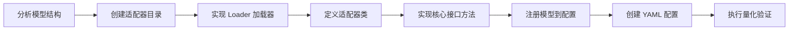

# LLM 模型接入量化流程指南

## 1. 适用范围

本文档面向需要将**新的 Decoder-only 大语言模型**（LLM）接入 msModelSlim 量化流程的开发人员，介绍从创建模型适配器、实现组件接口、注册模型到执行量化验证的完整接入流程。

**适用对象**：负责新 LLM 模型接入的模型开发或量化工程师。

**适用场景**：

- 目标 LLM 不在支持矩阵中，需要新增 `model_type` 并打通量化链路；
- 已有 `model_type` 需要扩展新的量化模式（如从 W8A8 动态扩展至 W4A16）。

**不适用场景**：

- 模型已在支持矩阵中且目标量化模式已验证：请直接按《[LLM 量化使用指南](usage_large_language_model_quantization.md)》执行，无需编写适配器；
- 多模态模型（VLM / DiT）的接入：见《[VLM 模型接入量化流程指南](../vlm/integration_guide_vision_transformer_quantization.md)》与《[DiT 模型接入量化流程指南](../dit/integration_guide_diffusion_transformer_quantization.md)》。

> 本文档只讲「接入新模型的开发流程」。基础接口概念与模型适配器设计，请先阅读《[LLM 大模型接入指南](../../model/integrating_models.md)》。

## 2. 流程关系与前置条件

**上级流程**：先阅读《[LLM 大模型接入指南](../../model/integrating_models.md)》，理解接口与模型适配器的基本概念后，再进入本接入流程。

**前置条件**：

- msModelSlim 已安装，可执行 `msmodelslim --help`
- 目标 LLM 浮点权重已下载到本地（HuggingFace 格式），可被目标 Transformers 版本加载
- 校准数据已准备（文本校准集，如 `mix_calib.jsonl`）
- 已明确目标量化场景（如 W8A8 动态），并知晓其 YAML 配置协议（`apiversion: modelslim_v1`）

**后续操作**：接入并验证通过后，进入《[LLM 量化使用指南](usage_large_language_model_quantization.md)》调整量化参数，或进入正式量化部署。

## 3. 输入和交付件

| 类型 | 名称 | 来源或保存位置 | 格式或约束 | 验收方式 |
| --- | --- | --- | --- | --- |
| 输入 | 浮点 LLM 权重目录 | 本地路径（从 ModelScope / HuggingFace 下载） | HuggingFace 格式，含 `config.json` 及权重分片 | 可被目标 Transformers 版本加载 |
| 输入 | 校准数据集 | 本地路径 | 文本校准数据（如 `mix_calib.jsonl`） | 至少 128 条样本，可被 `handle_dataset` 解析 |
| 交付件 | 模型适配器代码 | `msmodelslim/model/{model_name}/` | Python 源码，含 loader、model_adapter 等 | 代码审查通过 |
| 交付件 | 模型注册配置 | `config/config.ini` | `[ModelAdapter]`、`[ModelAdapterEntryPoints]` 等段落 | key 一致，`msmodelslim` 可通过 `--model_type` 创建适配器 |
| 交付件 | 量化配置 | `lab_practice/{model_name}/` | YAML 格式（`apiversion: modelslim_v1`） | 配置校验通过 |
| 交付件 | 量化权重目录 | `--save_path` 指定路径 | 含 `quant_model_description.json` 及权重分片 | 推理冒烟通过 |

## 4. 流程总览



## 5. 操作步骤

以下以 W8A8 动态量化场景（简称“场景示例”）为例，给出接入新 LLM 的通用步骤。其余量化场景（W4A16、W8A8 静态等）接入流程一致，仅 YAML 配置不同，参数选择参考《[LLM 量化使用指南](usage_large_language_model_quantization.md)》。

### 步骤 1：分析模型结构，确定适配策略

**目标**：分析目标模型的结构特点，确定量化接入策略。

**操作**：

1. **分析模型架构**：查阅目标模型的官方实现，了解其结构组成。Decoder-only LLM 通常由 Embedding、多个 Decoder Layer、Norm 和 LM Head 组成。
2. **确定加载策略**：确认模型是否支持 `from_pretrained` 加载。若支持，可直接使用 `TransformersModel` 基类；若不支持，需自定义模型定义。
3. **确定量化策略**：根据模型规模和推理场景，确定是否需要逐层量化（Layer-wise）、是否包含 MTP / MoE 等特殊结构，以及权重是否需要反量化。

**分析要点**：

- Decoder Layer 结构：Attention 和 FFN 的子模块命名
- 特殊结构：MTP（Multi-Token Prediction）、MoE（Mixture of Experts）、压缩注意力等
- 权重格式：FP8 权重是否需要反量化

**输出**：模型结构分析文档，确定适配策略

### 步骤 2：创建模型适配器目录与文件

**目标**：创建模型适配器目录结构，包含必要的文件。

**操作**：

在 `msmodelslim/model/` 下创建模型目录，目录名建议与模型系列名一致：

```text
msmodelslim/model/{model_name}/
├── __init__.py          # 导出适配器类，可为空
├── model_adapter.py     # 主适配器文件
├── loader.py            # 加载器文件
├── model.py             # （可选）自定义模型定义
├── mtp_quant_module.py  # （可选）MTP 量化支持
└── convert_fp8_to_bf16.py  # （可选）FP8 权重转换
```

> 文件是否必需取决于目标模型的实际结构：基于 Transformers 标准库的模型通常只需 `model_adapter.py` 与 `loader.py`；自定义模型定义、MTP 支持、FP8 转换等按需添加。

**输出**：模型适配器目录结构创建完成

### 步骤 3：实现 Loader 加载器

**目标**：实现加载器类，注册适配器类的导入路径。

**操作**：

加载器继承 `BaseModelAdapterLoader`，只需指定适配器类的完整导入路径：

```python
# msmodelslim/model/{model_name}/loader.py
from msmodelslim.model.plugin_factory.base_loader import BaseModelAdapterLoader


class {ModelName}AdapterLoader(BaseModelAdapterLoader):
    ADAPTER_CLASS_PATH = "msmodelslim.model.{model_name}.model_adapter:{ModelName}ModelAdapter"
```

**输出**：加载器文件创建完成

### 步骤 4：定义适配器类，继承所需接口

**目标**：定义模型适配器主类，继承基础适配器和所需组件接口。

**操作**：

适配器类继承规则：

- **必须继承** `BaseModelAdapter`（或其子类如 `TransformersModel`）和 `ModelSlimPipelineInterfaceV1`
- **可选继承**：根据量化算法需求，实现 `IterSmoothInterface`、`FlexSmoothQuantInterface`、`QuaRotInterface` 等

```python
from msmodelslim.model.common.transformers import TransformersModel
from msmodelslim.model.interface_hub import (
    ModelSlimPipelineInterfaceV1,
    IterSmoothInterface,
    FlexSmoothQuantInterface,
    QuaRotInterface,
)
from msmodelslim.utils.logging import logger_setter


@logger_setter("msmodelslim.model.{model_name}")
class {ModelName}ModelAdapter(
    TransformersModel,               # 继承自 BaseModelAdapter，基于 Transformers 模型通用特性简化接口实现
    ModelSlimPipelineInterfaceV1,    # 必需：量化调度支持
    IterSmoothInterface,             # 可选：异常值抑制
    FlexSmoothQuantInterface,        # 可选：Flex Smooth
    QuaRotInterface,                 # 可选：QuaRot 旋转
):
    ...
```

> 若目标模型为自定义实现（无法直接使用 `TransformersModel`），需继承 `BaseModelAdapter` 并自行实现 config 加载、权重获取等底层逻辑。

**输出**：适配器类骨架定义完成

### 步骤 5：实现核心接口方法

**目标**：实现适配器的核心接口方法，使模型可被量化框架调度。

**操作**：

#### 5.1 `handle_dataset`——处理校准数据集

将校准数据转换为模型可接受的输入格式。对于标准 Transformers 模型，可直接使用基类提供的 `_get_tokenized_data`：

```python
def handle_dataset(self, dataset: Any, device: DeviceType = DeviceType.NPU) -> List[Any]:
    return self._get_tokenized_data(dataset, device)
```

#### 5.2 `init_model`——初始化模型

**关键策略**：仅加载第一层 Decoder Layer，其余层在后续按需加载，以节省显存。

```python
def init_model(self, device: DeviceType = DeviceType.NPU) -> nn.Module:
    # 1. 保存原始层数，临时设置为 1
    origin = self.config.num_hidden_layers
    self.config.num_hidden_layers = 1

    # 2. 加载模型（仅第一层 Decoder Layer）
    with torch.device("cpu"):
        model = Transformer(self.config)

    # 3. 恢复原始层数
    self.config.num_hidden_layers = origin

    # 4. 加载完整权重
    state_dict = get_state_dict(self.model_path, model)
    # 若为 FP8 权重，需反量化
    auto_dequant_state_dict("", state_dict, str(self.model_path))
    model.load_state_dict(state_dict)
    model.eval()

    return model
```

#### 5.3 `generate_model_visit`——生成模型访问序列

按模型结构的拓扑顺序，依次 yield 每个需要量化的模块：

```python
def generate_model_visit(self, model: nn.Module) -> Generator[ProcessRequest, Any, None]:
    return generated_decoder_layer_visit_func(
        model, transformer_blocks=self.generate_decoder_layer(model)
    )
```

#### 5.4 `generate_decoder_layer`——按需加载 Decoder Layer

实现逐层加载逻辑，按索引从 safetensors 权重文件中加载：

```python
def generate_decoder_layer(self, model: nn.Module):
    for idx in range(self.config.num_hidden_layers):
        layer_prefix = f"layers.{idx}"
        decoder = self.load_decoder_if_not_exist(model, layer_prefix=layer_prefix, idx=idx)
        yield layer_prefix, decoder

def load_decoder_if_not_exist(self, model, layer_prefix, idx):
    # 检查是否已加载
    try:
        decoder = model.get_submodule(layer_prefix)
        return decoder
    except AttributeError:
        pass

    # 按需创建并加载
    with patch.object(nn.Linear, 'reset_parameters', lambda _self: None):
        module_list = model.layers
        template_module = module_list[0]
        decoder = template_module.__class__(layer_id=idx, args=self.config)

        state_dict = get_state_dict(self.model_path, decoder, prefix=layer_prefix)
        decoder.load_state_dict(state_dict)
        decoder.eval()
        module_list.append(decoder)

    return decoder
```

#### 5.5 `generate_model_forward`——生成模型前向传播序列

实现逐层前向传播，通过 hook 机制获取第一层输入后逐层传递：

```python
def generate_model_forward(self, model: nn.Module, inputs: Any) -> Generator[ProcessRequest, Any, None]:
    # 1. 通过 hook 获取第一层输入
    first_block_input = None

    def break_hook(module, hook_args, hook_kwargs):
        nonlocal first_block_input
        first_block_input = (hook_args, hook_kwargs)
        raise TransformersForwardBreak()

    remove_handler = model.layers[0].register_forward_pre_hook(
        break_hook, with_kwargs=True, prepend=True
    )

    try:
        model(inputs[0] if isinstance(inputs, list) else inputs)
    except TransformersForwardBreak:
        pass
    finally:
        remove_handler.remove()

    # 2. 逐层前向传播
    args, kwargs = first_block_input
    for name, block in self.generate_decoder_layer(model):
        h = yield ProcessRequest(name, block, args, kwargs)
        args = (h, *args[1:])
```

#### 5.6 `enable_kv_cache`——控制 KVCache

实现是否启用 KVCache 的控制，可在逐层前向时禁用缓存以减少显存占用。基于 Transformers 的模型可直接使用基类默认实现：

```python
def enable_kv_cache(self, model: nn.Module, need_kv_cache: bool) -> None:
    # 描述是否禁用 KVCache，可减少显存
    return self._enable_kv_cache(model, need_kv_cache)  # TransformersModel 默认实现
```

#### 5.7 可选：实现异常值抑制接口

若需要支持 IterSmooth / FlexSmoothQuant 等异常值抑制算法，需实现 `get_adapter_config_for_subgraph`，定义 Norm-Linear、Up-Down 等子图的融合映射关系：

```python
def get_adapter_config_for_subgraph(self) -> List[AdapterConfig]:
    adapter_config = []
    for layer_idx in range(self.config.num_hidden_layers):
        # Norm-Linear 融合
        input_norm_mapping = MappingConfig(
            source=f"layers.{layer_idx}.attn_norm",
            targets=[f"layers.{layer_idx}.attn.wq", f"layers.{layer_idx}.attn.wk", f"layers.{layer_idx}.attn.wv"],
        )
        adapter_config.append(AdapterConfig(
            subgraph_type="norm-linear", mapping=input_norm_mapping
        ))

        # Up-Down 融合（FFN）
        up_down_mapping = MappingConfig(
            source=f"layers.{layer_idx}.ffn.w3",
            targets=[f"layers.{layer_idx}.ffn.w2"],
        )
        adapter_config.append(AdapterConfig(
            subgraph_type="up-down", mapping=up_down_mapping
        ))
    return adapter_config
```

> 融合映射中的模块名（`attn_norm`、`attn.wq`、`ffn.w3` 等）仅为示意，需替换为目标模型的真实子模块路径。

#### 5.8 可选：支持自动调优与敏感层分析

使用《[自动调优使用说明](../../../user_guide/usage_auto_precision_tuning.md)》且策略需**自动生成回退候选**时（`standing_high` 始终；`binary_fallback` 在未配置非空 `rollback_candidates` 时；`standing_high_with_experience` 委托 Standing High 执行），模型适配器须实现 **`ModelSlimPipelineInterfaceV1`**：

```python
from msmodelslim.model.interface_hub import ModelSlimPipelineInterfaceV1
```

该接口与 CLI **`msmodelslim analyze`** 及 `PipelineAnalysisService` 的模型协议相同，需实现 `init_model`、`handle_dataset`、`generate_model_visit`、`generate_model_forward` 等方法。调优策略内由 `PipelineAnalysisService` 调用上述方法，**不会在策略侧预先 `load_model`**。

| 调优策略 | 敏感层分析 | 额外接口 |
|----------|------------|----------|
| `standing_high` | 始终自动运行 | 无 |
| `binary_fallback` | 配置了非空 `rollback_candidates` 时跳过 | 无 |
| `standing_high_with_experience` | 委托 Standing High | **`StandingHighWithExperienceInterface`**（`load_model`，离群值抑制能力探测）；**`ModelSlimPipelineInterfaceV1` 须单独继承** |

详见《[自动调优使用说明](../../../user_guide/usage_auto_precision_tuning.md)》及各策略算法文档。

**输出**：适配器接口方法实现完成

**通过条件**：`handle_dataset`、`init_model`、`generate_model_visit`、`generate_decoder_layer`、`generate_model_forward`、`enable_kv_cache` 均已实现；逐层加载与 hook 捕获首层输入的关键策略生效。

### 步骤 6：注册模型到配置

**目标**：在 `config/config.ini` 中注册模型名称和适配器入口点。

**操作**：

在 `config/config.ini` 中添加两项配置：

```ini
[ModelAdapter]
# 在 [ModelAdapter] 部分添加模型名称映射
{model_name} = {ModelName1}, {ModelName2}

[ModelAdapterEntryPoints]
# 在 [ModelAdapterEntryPoints] 部分添加适配器入口
{model_name} = msmodelslim.model.{model_name}.loader:{ModelName}AdapterLoader

[ModelAdapterDependencies]
# 可选：指定 Transformers 版本依赖
{model_name} = {"transformers": "==x.x.x"}
```

> 注意 `ModelAdapter` 与 `ModelAdapterEntryPoints` 中的 key 需要保持一致，否则配置不生效。

**输出**：模型注册完成

### 步骤 7：创建 YAML 量化配置文件

**目标**：在 `lab_practice/` 下创建对应的量化配置文件。

**操作**：

在 `lab_practice/{model_name}/` 下创建 YAML 文件，定义量化方案。以下为 W8A8 动态量化示例：

```yaml
# lab_practice/{model_name}/{model_name}_{quant_type}.yaml
apiversion: modelslim_v1
spec:
  process:
    - type: "linear_quant"
      qconfig:
        act:
          scope: "per_token"
          dtype: "int8"
          symmetric: True
          method: "minmax"
        weight:
          scope: "per_channel"
          dtype: "int8"
          symmetric: True
          method: "minmax"
      include:
        - "*"
      exclude:
        - "*gate*"             # 排除 router 等特殊层
        - "*down_proj*"        # 可选：回退 down_proj 层以提升精度（W8A8 动态常见做法）

  dataset: mix_calib.jsonl
  save:
    - type: "ascendv1_saver"
      part_file_size: 4
```

> 各配置项含义与选择参考《[LLM 量化使用指南](usage_large_language_model_quantization.md#步骤-3选择并调整参数)》。

**输出**：量化配置文件创建完成

### 步骤 8：执行量化验证

**目标**：使用量化命令验证模型适配器工作正常。

**操作**：

```bash
msmodelslim quant \
  --model_path ${MODEL_PATH} \
  --save_path ${SAVE_PATH} \
  --device npu \
  --model_type ${MODEL_TYPE} \
  --config ${CONFIG_PATH} \
  --trust_remote_code false
```

**验证要点**：

1. 模型加载正常，无 ImportError
2. 校准数据集加载成功
3. 逐层量化和前向传播无报错
4. 量化权重正常保存，输出目录包含 `quant_model_description.json`

**输出**：量化验证通过

**通过条件**：模型加载、校准、量化、保存均无报错，且输出目录包含 `quant_model_description.json`。

## 6. 验收条件

- 适配器代码可被 `msmodelslim` 通过 `--model_type` 匹配并创建；
- 使用步骤 7 的 YAML 配置执行 `msmodelslim quant` 成功，输出目录包含 `quant_model_description.json`；
- 量化产物冒烟推理通过（可选）。

## 7. 异常处置

| 现象 | 处理方向 |
| --- | --- |
| 模型加载失败 | 检查 `config.ini` 中 ModelAdapter 与 ModelAdapterEntryPoints 的 key 是否一致；若不一致，配置不生效 |
| 显存不足（OOM） | 确认 `init_model` 中 `num_hidden_layers` 临时设置为 1；确认 `generate_decoder_layer` 实现了按需加载而非全量加载；确认指定 NPU 未被其他任务占用 |
| 权重加载错误 | 若模型使用 FP8 权重，需在加载后调用反量化函数；检查 `get_state_dict` 的 prefix 是否与权重文件中的 key 一致 |
| 校准数据格式错误 | 确认 `handle_dataset` 返回的数据格式与模型的 forward 签名匹配 |

## 8. 接口文档列表

| 接口或能力 | 简述 | 链接 |
| --- | --- | --- |
| Interface Hub | 量化机制与算法组件对模型的接口定义汇总 | 《[Interface Hub](https://gitcode.com/Ascend/msmodelslim/blob/master/msmodelslim/model/interface_hub.py)》 |
| 通用接入指南 | 基础接口概念与模型适配器设计 | 《[LLM 大模型接入指南](../../model/integrating_models.md)》 |
| 量化流程 | LLM 量化流程与配置参数含义 | 《[LLM 量化使用指南](usage_large_language_model_quantization.md)》 |
| 自动调优 | `msmodelslim analyze` 自动回退候选与策略说明 | 《[自动调优使用说明](../../../user_guide/usage_auto_precision_tuning.md)》 |

## 9. 安全说明

- `trust_remote_code` 默认保持 `False`；仅当浮点仓库必须执行自定义代码且来源可信、可审计时开启。
- 校准数据与量化产物按业务权限管控，勿将含业务数据的校准集提交到公开渠道。
