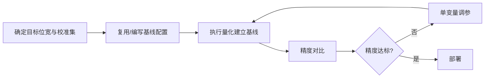

# 大语言模型（LLM）量化使用指南

## 1. 适用范围

本指南面向首次对 Decoder-only 架构大语言模型（如 LLaMA、Qwen、GLM、DeepSeek 等）执行[训练后量化（PTQ）](../term_ptq.md)的用户。**重点不是展开完整执行命令，而是给出可上手的推荐配置，并说明每个配置项的含义（原理）以及何时需要调整、怎么选。**

适用场景：

- 将浮点 LLM 量化为 W8A8 / W4A16 等低比特格式并部署
- 为在线推理服务准备量化权重

模型是否支持、命令行怎么写不在此展开：支持矩阵见[《大模型支持矩阵》](../../model/README.md)，完整执行命令见[《一键量化完整指南》](../../../user_guide/usage_one_click_quantization.md)。

## 2. 输入和交付件

| 类型 | 名称 | 来源或保存位置 | 格式或约束 | 验收方式 |
| --- | --- | --- | --- | --- |
| 输入 | 浮点模型权重目录 | 模型下载或本地路径 | HuggingFace 格式，含 `config.json` 及 `*.safetensors` | 可被目标 Transformers 版本加载 |
| 输入 | 校准数据集 | 工具默认 `lab_calib/` 或用户指定 | JSONL 格式，每条含文本 prompt，建议 128~512 条 | 可被本地量化流程正常读取 |
| 交付件 | 量化权重目录 | `--save_path` 指定路径 | 含 `quant_model_description.json` 及 `*.safetensors` | 推理冒烟通过 |

## 3. 流程总览

入门时建议先用一组**稳定推荐配置**建立基线，再围绕影响最大的参数做单变量调整。



## 4. 操作步骤

### 步骤 1：确认目标与约束

**操作**：先固定三件事——目标量化格式/位宽（决定 `qconfig`）、部署推理框架（决定 `save` 格式）、可用设备数（决定 `runner`）。目标模型已有 `lab_practice/` 下已验证配方时，**优先复用该配方**，再参考下文理解每个参数为什么这样选。

### 步骤 2：建立推荐基线

**操作**：下面给出两类最常见量化方案的推荐基线。如果目标模型已有 `lab_practice` 配方，直接使用已验证配方；没有配方时从这里的推荐起点开始。

**方案 A：W8A8 静态量化（推荐首选，精度与性能均衡）**

```yaml
apiversion: modelslim_v1
spec:
  runner: auto                    # 单卡 layer_wise，多卡 dp_layer_wise
  process:
    - type: linear_quant
      qconfig:
        act:
          dtype: int8
          scope: per_token        # 动态激活量化，精度好；若目标框架仅支持 per_tensor 再改
          symmetric: true
          method: minmax
        weight:
          dtype: int8
          scope: per_channel
          symmetric: true
          method: minmax
      include: ["*"]
  save:
    - type: ascendv1_saver        # 按部署框架选择，见 save 说明
  dataset: mix_calib.jsonl
```

**方案 B：W4A16 权重量化（显存敏感场景）**

```yaml
apiversion: modelslim_v1
spec:
  runner: auto
  process:
    - type: linear_quant
      qconfig:
        act:
          dtype: float            # 激活不量化
        weight:
          dtype: int4
          scope: per_group
          symmetric: true
          method: minmax
      include: ["*"]
  save:
    - type: ascendv1_saver
  dataset: mix_calib.jsonl
```

> 推荐起点并不表示所有模型都必须用该组合，而是优先选择仓库默认值、已验证实践或较稳健的中间取值，以降低第一次使用时同时遇到精度和兼容性问题的概率。若基线精度、显存或吞吐不满足目标，再按步骤 3 逐项调整。

### 步骤 3：选择并调整参数

**操作**：参数选择按三个层次理解：先确认 `dtype/scope/symmetric/method` 组合是否被工具支持（不是任意可调）；其次确定 `include/exclude` 等作用范围；最后再调整会改变精度与开销的数值参数。是否需要调整某个参数，**先跑基线看端到端精度，再决定动哪一项**。

| 配置项 | 含义（原理） | 推荐配置 | 选择与调整建议 |
| --- | --- | --- | --- |
| `runner` | 流水线执行方式：`layer_wise` 逐层量化（显存占用最小）、`dp_layer_wise` 数据并行逐层（多卡加速）、`model_wise` 整模型一次量化（显存占用高）、`auto` 按设备数自动选（单卡 `layer_wise`、多卡 `dp_layer_wise`）。原理上逐层方式通过"加载一层-量化-卸载"控制显存峰值，因此可量化单卡放不下的超大模型。 | `auto`（默认）。 | 单卡直接 `auto`；多卡想提速显式写 `dp_layer_wise`。只有模型很小、想追求速度且显存充足时才考虑 `model_wise`。 |
| `process` | 量化处理器链，按顺序执行。每个元素由 `type` 分派，最核心的是 `linear_quant`（线性层量化），可配合 `smooth_quant`（平滑离群值）、`awq`、`quarot` 等预处理/后处理算法提升低比特精度。 | 入门只用 `linear_quant`；低比特（W4A16 以下）精度不足时再叠加离群值抑制处理器。 | 不要一上来就堆处理器链。先用 `linear_quant` 建立基线，精度不达标再按需引入平滑/旋转类处理器，每次只加一个。 |
| `linear_quant.qconfig.act.dtype` | 激活量化数据类型：`int8` 表示激活也量化（W8A8 全量化）、`float` 表示激活不量化（W4A16 仅权重量化）。激活量化是推理加速的关键，但也叠加了激活统计误差。 | W8A8 用 `int8`；只追求省显存用 `float`（W4A16）。 | 若 W8A8 静态量化精度波动大，可先尝试激活改 `per_token` 或改用动态量化，而非直接放弃激活量化。 |
| `linear_quant.qconfig.act.scope` | 激活量化的计算粒度：`per_tensor` 整层一个 scale（实现简单、硬件友好）、`per_token` 按每个 token 独立 scale（更能适配离群 token，精度更好但开销略高）。 | W8A8 推荐 `per_token`（精度优先）；目标硬件只支持 `per_tensor` 时再降级。 | 精度敏感场景选 `per_token`；性能/硬件约束场景选 `per_tensor`。 |
| `linear_quant.qconfig.weight.dtype` | 权重量化数据类型：`int8`（W8 权重，压缩 2 倍）、`int4`（W4 权重，压缩 4 倍）、`mxfp8`/`mxfp4`（MX 格式，面向昇腾 NPU）。比特越低压缩越大，精度风险也越高。 | 首选 `int8`；显存紧张或部署框架支持时用 `int4`。 | 量化格式先对齐目标部署框架支持列表，再谈精度。 |
| `linear_quant.qconfig.weight.scope` | 权重量化粒度：`per_channel` 按输出通道独立 scale（精度好）、`per_group` 按固定分组独立 scale（如每组 128 值，INT4 常用，精度更好但需硬件支持）。 | W8 用 `per_channel`；W4 用 `per_group`（推荐 group_size 128）。 | 组越小精度越好、开销越大。group_size 一般取 32/64/128 等 2 的幂，已有实践配方时优先复用其取值。 |
| `linear_quant.qconfig.symmetric` | 是否对称量化。对称量化只保存 scale（实现简单、普遍支持）；非对称额外保存 zero_point，对分布有偏移的张量精度更好。 | 默认 `true`（对称），无特殊精度问题不建议改。 | 仅当对称量化出现系统性精度损失、且目标硬件支持非对称时才尝试 `false`。 |
| `linear_quant.qconfig.method` | 量化参数（scale/zero_point）估计算法：`minmax` 按极值定 scale（简单、快）、`mse_round` 按最小化量化误差搜索（精度更好、耗时略增）、`histogram` 按分布直方图（鲁棒）。 | 入门 `minmax`；W4 低比特或精度敏感时用 `mse_round`。 | `minmax` 对离群值敏感，若异常 token 拖低精度，再换 `histogram` 或先做离群值平滑。 |
| `include` / `exclude` | 量化作用范围：`include` 声明哪些模块参与量化，`exclude` 声明哪些模块排除（优先级更高，如某些数值敏感层保留浮点）。 | 默认 `include: ["*"]`、`exclude: []`（全量化）。 | 精度调优时优先用 `exclude` 回退少数敏感层（如首尾层、norm 相关层），这通常比整体升位宽更划算；`exclude` 的模块会被绕过量化、保留原浮点权重。 |
| `save` | 落盘格式：`ascendv1_saver`（昇腾 NPU 推理）、`compressed_tensors`/`mindie_format_saver`（HuggingFace / MindIE 生态）。 | 与目标推理框架一致，昇腾场景用 `ascendv1_saver`。 | save 格式需与部署框架严格匹配，配错会导致权重无法加载。 |
| `dataset` | 校准数据集名称（`lab_calib/` 下的文件名）或绝对路径，用于统计激活分布与估计量化参数。JSONL 格式。 | 工具默认 `mix_calib.jsonl`；业务分布特殊时换成与真实输入同分布的数据。 | 校准集要能代表真实输入分布（长上下文、代码、多轮对话等各有侧重）。更换数据集后应重新量化，不能把一种分布上学到的参数直接迁移。 |

### 参数组合与选择顺序

1. **先锁定部署目标与支持组合**：先确定最终位宽/数值格式，再确认当前工具版本实际支持对应 `dtype + scope + symmetric + method` 组合，不要为了追求某个参数值而越过支持约束。
2. **再固定作用范围**：使用模型已有 `lab_practice` 配方时，先复用其 `include/exclude` 与处理器链；没有配方时先建立覆盖范围明确的基线。
3. **最后一次只调一个旋钮**：位宽、粒度、方法、作用范围一次只改一项，保持同一校准集和评测集。若某次调整没有稳定收益，回到上一个基线。

### 步骤 4：根据结果收敛参数方案

**操作**：调参时先记录一份完整基线（数据集、量化范围、关键参数、端到端指标），每轮只改一个变量并与基线比较。

- **先跑推荐基线，再调单变量。** 不要同时修改位宽、粒度、算法参数和层范围。
- **优先回退局部，而不是整体提高精度。** 若只有少数层敏感，优先通过 `exclude` 或混合精度保留这些层，通常比整体升位宽更划算。
- **最终以模型实践配置和部署能力为准。** 目标模型已有 `lab_practice` 配方时，应优先复用已验证组合。

## 5. 术语

| 术语 | 简述 | 链接 |
| --- | --- | --- |
| LLM 量化 | Decoder-only 大语言模型训练后量化 | [LLM 量化词条](./term_large_language_model_quantization.md) |
| PTQ | 训练后量化 | [PTQ 词条](../term_ptq.md) |

## 6. 接口文档列表

| 接口或能力 | 简述 | 链接 |
| --- | --- | --- |
| `msmodelslim quant` | 一键量化 CLI 入口与完整命令说明 | [一键量化完整指南](../../../user_guide/usage_one_click_quantization.md) |
| modelslim_v1 配置说明 | `runner`/`process`/`save`/`dataset` 等任务级配置的字段类型、默认值与完整约束 | [modelslim_v1 配置说明](../../../api_reference/config/task/modelslim_v1.md) |
| linear_quant 配置说明 | `linear_quant` 处理器及其 `qconfig` 各字段的完整取值说明 | [linear_quant 配置说明](../../../api_reference/config/processor/linear_quant.md) |

> **高阶功能**：如需深度探索 prepare 阶段、敏感层分析、自动调优、混合精度、GPTQ/AWQ/QuaRot 等高级处理器组合，可查阅 [api_reference/config/task 高阶配置文档](https://gitcode.com/Ascend/msmodelslim/blob/master/docs/zh/api_reference/config/task)。入门阶段无需使用这些能力。
