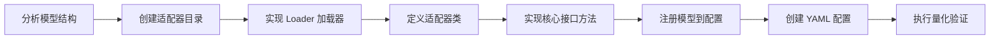

# VLM 模型接入量化流程指南

## 1. 适用范围

本文档面向需要将**新的多模态视觉语言模型**（VLM）接入 msModelSlim 量化流程的开发人员，介绍从创建模型适配器、实现组件接口、注册模型到执行量化验证的完整接入流程。

**适用对象**：负责新 VLM 模型接入的模型开发或量化工程师。

**适用场景**：

- 目标多模态理解模型不在支持矩阵中，需要新增 `model_type` 并打通量化链路；
- 已有 `model_type` 需要扩展新的量化模式（如从 W8A8 动态扩展至 MoE 混合量化）。

**不适用场景**：

- 模型已在支持矩阵中且目标量化模式已验证：请直接按《[VLM 量化使用指南](usage_vision_transformer_quantization.md)》执行，无需编写适配器；
- 多模态生成 / 纯语言模型的接入：见《[DiT 模型接入量化流程指南](../dit/integration_guide_diffusion_transformer_quantization.md)》与《[LLM 模型接入量化流程指南](../llm/integration_guide_large_language_model_quantization.md)》。

> 本文档只讲「接入新模型的开发流程」。基础接口概念与模型适配器设计，请先阅读《[多模态理解模型接入指南](../../model/integrating_multimodal_understanding_model.md)》。

## 2. 流程关系与前置条件

**上级流程**：先阅读《[多模态理解模型接入指南](../../model/integrating_multimodal_understanding_model.md)》，理解接口与模型适配器的基本概念后，再进入本接入流程。

**前置条件**：

- msModelSlim 已安装，可执行 `msmodelslim --help`
- 目标 VLM 浮点权重已下载到本地（HuggingFace 格式），可被目标 Transformers 版本加载
- 多模态校准数据已准备（校准图像目录或 `index.jsonl` 索引）
- 已明确目标量化场景（如 W8A8 静态），并知晓其 YAML 配置协议（`apiversion: multimodal_vlm_modelslim_v1`）

**后续操作**：接入并验证通过后，进入《[VLM 量化使用指南](usage_vision_transformer_quantization.md)》调整量化参数，或进入正式量化部署。

## 3. 输入和交付件

| 类型 | 名称 | 来源或保存位置 | 格式或约束 | 验收方式 |
| --- | --- | --- | --- | --- |
| 输入 | 浮点 VLM 权重目录 | 本地路径（从 ModelScope / HuggingFace 下载） | HuggingFace 格式，含 `config.json` 及权重分片 | 可被目标 Transformers 版本加载 |
| 输入 | 多模态校准数据集 | 本地路径 | 校准图像目录 + `index.jsonl`，或图像目录 + `default_text` | 至少 128 张图像，可被 `handle_dataset` 解析 |
| 交付件 | 模型适配器代码 | `msmodelslim/model/{model_name}/` | Python 源码，含 loader、model_adapter 等 | 代码审查通过 |
| 交付件 | 模型注册配置 | `config/config.ini` | `[ModelAdapter]`、`[ModelAdapterEntryPoints]` 等段落 | key 一致，`msmodelslim` 可通过 `--model_type` 创建适配器 |
| 交付件 | 量化配置 | `lab_practice/{model_name}/` | YAML 格式（`apiversion: multimodal_vlm_modelslim_v1`） | 配置校验通过 |
| 交付件 | 量化权重目录 | `--save_path` 指定路径 | 含 `quant_model_description.json` 及权重分片 | 推理冒烟通过 |

## 4. 流程总览



## 5. 操作步骤

以下以 W8A8 静态量化场景（简称“场景示例”）为例，给出接入新 VLM 的通用步骤。其余量化场景（W8A8 动态、MoE 混合量化等）接入流程一致，仅 YAML 配置不同，参数选择参考《[VLM 量化使用指南](usage_vision_transformer_quantization.md)》。

### 步骤 1：分析模型结构，确定适配策略

**目标**：分析目标 VLM 的结构特点，确定多模态量化的接入策略。

**操作**：

1. **分析模型架构**：查阅目标模型的官方实现，确定其结构组成——视觉编码器、视觉特征投影、语言模型三个部分的子模块命名与数据流。
2. **确定加载策略**：VLM 通常采用「视觉部分全量加载 + 语言部分逐层加载」，但不同模型可根据实际情况选择不同策略，例如视觉部分需要更细粒度控制时也可采用逐层方案。
3. **确定特殊结构**：确认模型是否包含 MoE 层（是否需要 3D 融合权重转换）、DeepStack（是否需要在特定层注入视觉特征）、MTP（是否支持）等。
4. **确定预处理方式**：确认模型官方推理示例使用 `AutoProcessor` 还是 `AutoTokenizer` 进行多模态预处理，以及其特有的 messages 形式。

**分析要点**：

- 视觉编码器、视觉特征投影、语言模型的子模块命名
- 视觉特征融合的具体实现（`masked_scatter`、DeepStack 注入等）
- 是否包含 MoE / MTP 等特殊结构

**输出**：模型结构分析文档，确定适配策略

### 步骤 2：创建模型适配器目录与文件

**目标**：创建模型适配器目录结构，包含必要的文件。

**操作**：

在 `msmodelslim/model/` 下创建模型目录，目录名建议与模型系列名一致：

```text
msmodelslim/model/{model_name}/
├── __init__.py          # 导出适配器类，可为空
├── model_adapter.py     # 主适配器文件（继承 VLMBaseModelAdapter）
├── loader.py            # 加载器文件
├── moe_utils.py         # （可选）MoE 融合权重转换工具
└── modeling_custom.py   # （可选）自定义模型定义（如 MTP 预测器）
```

> 文件是否必需取决于目标模型的实际结构：常规模型通常只需 `model_adapter.py` 与 `loader.py`；MoE 架构需增加 `moe_utils.py`；含 MTP 等自定义结构时需增加自定义模型定义文件。

**输出**：模型适配器目录结构创建完成

### 步骤 3：实现 Loader 加载器

**目标**：实现加载器类，注册适配器类的导入路径。

**操作**：

加载器继承 `BaseModelAdapterLoader`，只需指定适配器类的完整导入路径：

```python
# msmodelslim/model/{model_name}/loader.py
from msmodelslim.model.plugin_factory.base_loader import BaseModelAdapterLoader


class {ModelName}AdapterLoader(BaseModelAdapterLoader):
    ADAPTER_CLASS_PATH = "msmodelslim.model.{model_name}.model_adapter:{ModelName}ModelAdapter"
```

**输出**：加载器文件创建完成

### 步骤 4：定义适配器类，继承所需接口

**目标**：定义模型适配器主类，继承 VLM 基础适配器和量化调度接口。

**操作**：

适配器类继承规则：

- **必须继承** `VLMBaseModelAdapter`（提供 `_load_config`、`_collect_inputs_to_device` 等多模态通用能力）和 `ModelSlimPipelineInterfaceV1`
- **可选继承**：根据量化算法需求，实现 `IterSmoothInterface`、`FlexSmoothQuantInterface`、`QuaRotInterface` 等

```python
from msmodelslim.model.common.vlm_base import VLMBaseModelAdapter
from msmodelslim.model.interface_hub import (
    ModelSlimPipelineInterfaceV1,
    IterSmoothInterface,
    FlexSmoothQuantInterface,
    QuaRotInterface,
)
from msmodelslim.utils.logging import logger_setter


@logger_setter("msmodelslim.model.{model_name}")
class {ModelName}ModelAdapter(
    VLMBaseModelAdapter,             # 必须：提供多模态通用能力
    ModelSlimPipelineInterfaceV1,    # 必需：量化调度支持
    IterSmoothInterface,             # 可选：异常值抑制
    FlexSmoothQuantInterface,        # 可选：Flex Smooth
    QuaRotInterface,                 # 可选：QuaRot 旋转
):
    def __init__(self, model_type: str, model_path: Path, trust_remote_code: bool = False):
        self._processor = None
        self._tokenizer = None
        super().__init__(model_type, model_path, trust_remote_code)
```

> 若目标模型为自定义实现（无法直接使用 `VLMBaseModelAdapter`），需继承 `BaseModelAdapter` 并自行实现 config 加载、多模态数据收集等底层逻辑。

**输出**：适配器类骨架定义完成

### 步骤 5：实现核心接口方法

**目标**：实现适配器的核心接口方法，使模型可被量化框架调度。

**操作**：

#### 5.1 `handle_dataset`——处理多模态校准数据

VLM 的校准数据包含图像和文本，使用 `VlmCalibSample` 统一数据格式（`image` + `text`）。主流模型使用 `AutoProcessor` 预处理，部分模型（如 InternVL 系列）使用 `AutoTokenizer`，需参考模型官方推理示例确定：

```python
def handle_dataset(self, dataset: Any, device: DeviceType = DeviceType.NPU) -> List[Any]:
    from transformers import AutoProcessor

    # 1. 加载 Processor
    self._processor = AutoProcessor.from_pretrained(
        self.model_path, trust_remote_code=self.trust_remote_code, local_files_only=True
    )

    # 2. 逐样本处理，构建多模态 messages 格式
    processed_data = []
    for item in dataset:
        messages = [{
            "role": "user",
            "content": [
                {"type": "image", "image": str(item.image)},
                {"type": "text", "text": item.text},
            ]
        }]

        inputs = self._processor.apply_chat_template(
            messages, tokenize=True, add_generation_prompt=True,
            return_dict=True, return_tensors="pt"
        )

        # 3. 批量移动 tensor 到目标设备
        # keys/defaults 需参考目标模型的 forward 签名（参考 transformers 中目标模型的
        # forward 参数完整列表，常见字段如下）
        processed_item = self._collect_inputs_to_device(
            inputs, device,
            keys=['input_ids', 'attention_mask', 'position_ids',
                  'past_key_values', 'inputs_embeds', 'labels',
                  'pixel_values', 'pixel_values_videos',
                  'image_grid_thw', 'video_grid_thw',
                  'cache_position', 'logits_to_keep'],
            defaults={'logits_to_keep': 0}
        )
        processed_data.append(processed_item)

    return processed_data
```

#### 5.2 `init_model`——初始化 VLM 模型

**关键策略**：视觉编码器全量加载（包含所有 blocks、mergers 等），语言模型仅加载第一层，其余层按需加载以节省显存：

```python
def init_model(self, device: DeviceType = DeviceType.NPU) -> nn.Module:
    # 1. 保存原始语言层数，临时设置为 1
    self.config.use_cache = False
    origin_layers = self.config.text_config.num_hidden_layers
    self.config.text_config.num_hidden_layers = 1

    # 2. 加载模型（视觉全量 + 语言仅第一层）
    model = {ModelClass}.from_pretrained(
        self.model_path,
        config=self.config,
        trust_remote_code=self.trust_remote_code,
        torch_dtype="auto",
        local_files_only=True,
        device_map="cpu",
        attn_implementation='eager'
    ).eval()

    # 3. 恢复原始层数，加载完整权重
    self.config.text_config.num_hidden_layers = origin_layers
    self.config.text_config._attn_implementation = 'eager'
    state_dict = self._get_state_dict(model)
    model.load_state_dict(state_dict)

    # 4. 若首层为 MoE 层，执行 3D 权重转换
    if self._is_moe_layer(0):
        self._convert_single_moe_layer(model.model.language_model.layers[0], 0)

    return model
```

#### 5.3 `generate_model_visit`——生成模型访问序列

VLM 的访问顺序非常重要，必须与前向传播顺序一致：先视觉编码器（整体），再逐层语言 Decoder：

```python
def generate_model_visit(self, model: nn.Module) -> Generator[ProcessRequest, Any, None]:
    # 1. 视觉编码器作为整体处理
    yield ProcessRequest(name="model.visual", module=model.model.visual, args=(), kwargs={})

    # 2. 语言模型逐层处理
    yield from generated_decoder_layer_visit_func(
        model, transformer_blocks=self.generate_decoder_layer(model)
    )
```

#### 5.4 `generate_decoder_layer`——按需加载语言 Decoder Layer

```python
def generate_decoder_layer(self, model: nn.Module) -> Generator[Tuple[str, nn.Module], None, None]:
    num_layers = self.config.text_config.num_hidden_layers
    for layer_idx in range(num_layers):
        name = f"model.language_model.layers.{layer_idx}"
        layer = self._load_decoder_if_not_exist(model, name, layer_idx)
        yield name, layer

    # 若支持 MTP
    if self._has_mtp():
        mtp_layer = self._load_mtp_if_not_loaded(model)
        yield "mtp", mtp_layer

def _load_decoder_if_not_exist(self, model, name, idx):
    # 检查该层是否已实际加载（不在 meta device 上）
    try:
        decoder = model.get_submodule(name)
        try:
            _ = decoder.input_layernorm.weight.device
            return decoder
        except RuntimeError:
            pass  # 在 meta device 上，需要加载
    except AttributeError:
        pass  # 层不存在，需要创建并加载

    with patch.object(nn.Linear, 'reset_parameters', lambda _self: None):
        # 创建 Decoder Layer 结构并加载权重
        module_list = model.model.language_model.layers
        template_module = module_list[0]
        decoder = template_module.__class__(config=self.config.text_config, layer_idx=idx)

        state_dict = self._get_state_dict(decoder, prefix=name)
        decoder.load_state_dict(state_dict)
        decoder.eval()

        if len(module_list) <= idx:
            module_list.append(decoder)
        else:
            module_list[idx] = decoder

    # 若为 MoE 层，转换 3D 融合权重为标准 Linear
    if self._is_moe_layer(idx):
        self._convert_single_moe_layer(decoder, idx)

    return decoder
```

#### 5.5 `generate_model_forward`——生成多模态前向传播序列

VLM 前向传播分三个阶段：视觉编码器前向 → 视觉特征融合 → 语言模型逐层前向。必须充分了解原始模型文件中的前向定义，确保融合逻辑一致：

```python
def generate_model_forward(self, model: nn.Module, inputs: Any) -> Generator[ProcessRequest, Any, None]:
    # 1. 提取校准样本
    sample = inputs[0] if isinstance(inputs, list) else inputs

    # ========== 阶段 1：视觉编码器全量前向 ==========
    pixel_values = sample['pixel_values']
    image_grid_thw = sample['image_grid_thw']

    with torch.no_grad():
        vision_outputs = yield ProcessRequest(
            name="model.visual",
            module=model.model.visual,
            args=(pixel_values, image_grid_thw),
            kwargs={}
        )
    image_embeds = vision_outputs['pooler_output']

    # ========== 阶段 2：视觉特征融合 ==========
    # 具体实现逻辑参考原模型定义（如 masked_scatter 替换 <image> 占位、DeepStack 跨层注入等）
    input_ids = sample['input_ids']
    attention_mask = sample['attention_mask']
    inputs_embeds = model.model.language_model.embed_tokens(input_ids)
    # ...
    # 构建 position_ids / attention_mask / cache_position / position_embeddings

    # ========== 阶段 3：语言模型逐层前向 ==========
    hidden_states = inputs_embeds
    for name, layer in self.generate_decoder_layer(model):
        with torch.no_grad():
            hidden_states = yield ProcessRequest(
                name=name, module=layer, args=(hidden_states,),
                kwargs={
                    'attention_mask': attention_mask,
                    'position_ids': position_ids,
                    'cache_position': cache_position,
                    'position_embeddings': position_embeddings,
                    'past_key_values': None,
                    'use_cache': False,
                },
            )
        # DeepStack 注入（若该层需要）
        # ...
```

#### 5.6 可选：实现异常值抑制 / 旋转算法接口

若需要支持异常值抑制或旋转类算法，需按对应接口补充实现：

**IterSmooth（迭代平滑）**：继承 `IterSmoothInterface`，实现 `get_adapter_config_for_subgraph`，对每个文本解码层定义 Norm-Linear、OV、Up-Down 等子图的融合映射：

```python
from msmodelslim.model.interface_hub import IterSmoothInterface

class {ModelName}ModelAdapter(
    VLMBaseModelAdapter,
    ModelSlimPipelineInterfaceV1,
    IterSmoothInterface,
):
    def get_adapter_config_for_subgraph(self) -> List[AdapterConfig]:
        adapter_config = []
        for layer_idx in range(self.config.text_config.num_hidden_layers):
            # Norm-Linear：input_layernorm -> QKV
            norm_linear_mapping = MappingConfig(
                source=f"model.language_model.layers.{layer_idx}.input_layernorm",
                targets=[f"model.language_model.layers.{layer_idx}.self_attn.{qkv}"
                         for qkv in ("q_proj", "k_proj", "v_proj")],
            )
            # OV：V -> O
            ov_mapping = MappingConfig(
                source=f"model.language_model.layers.{layer_idx}.self_attn.v_proj",
                targets=[f"model.language_model.layers.{layer_idx}.self_attn.o_proj"],
            )
            adapter_config.extend([
                AdapterConfig(subgraph_type="norm-linear", mapping=norm_linear_mapping),
                AdapterConfig(subgraph_type="ov", mapping=ov_mapping, extra_config={}),
            ])
        return adapter_config
```

详见《[Iterative Smooth 适配](../../quantization_algorithms/iterative_smooth/term_iterative_smooth.md)》。

**QuaRot（旋转）**：继承 `QuaRotInterface`，实现以下三个方法：

```python
from msmodelslim.model.interface_hub import QuaRotInterface

class {ModelName}ModelAdapter(
    VLMBaseModelAdapter,
    ModelSlimPipelineInterfaceV1,
    QuaRotInterface,
):
    def get_ln_fuse_map(self) -> Tuple[Dict[str, List[str]], Dict[str, List[str]]]:
        """返回 LayerNorm 与 Linear 的融合映射（Attention / FFN 两条路径）"""
        ...

    def get_bake_names(self) -> Tuple[List[str], List[str]]:
        """返回需要 mean 融合的 Linear 层名列表"""
        ...

    def get_rotate_map(self, block_size: int) -> Tuple[List[RotatePair], List[RotatePair]]:
        """返回左旋 / 右旋 RotatePair 配置"""
        ...
```

详见《[QuaRot 适配](../../quantization_algorithms/quarot/term_quarot.md)》。注意：旋转类适配仅作用于语言模型部分，视觉编码器无需纳入。

#### 5.7 可选：MoE 3D 权重转换

若模型使用 3D 融合权重存储 MoE 专家（如 `gate_up_proj` 形状为 `[num_experts, 2 * inter_dim, dim]`），需在加载后转换为标准 `nn.Linear` 层，否则量化框架无法逐层处理：

```python
# moe_utils.py
def convert_experts_to_mlp(original_moe_module, config):
    """将 3D 融合 MoE 权重转换为标准 MLP 层"""
    # 1. 解析原始 MoE 模块结构
    # 2. 将 gate_up_proj 拆分为 gate_proj 和 up_proj
    # 3. 将 down_proj 从 3D 权重中提取
    # 4. 返回转换后的标准 MLP 模块
    ...
```

> 3D 权重的 shape 与拆分逻辑需与原始模型定义严格一致，实现时参考模型官方实现中 MoE 层（如 SparseMoeBlock）的定义进行等价替换。

**输出**：适配器接口方法实现完成

**通过条件**：`handle_dataset`、`init_model`、`generate_model_visit`、`generate_decoder_layer`、`generate_model_forward` 均已实现；视觉部分全量加载 + 语言部分逐层加载的关键策略生效，MoE 权重转换（如适用）已接通。

### 步骤 6：注册模型到配置

**目标**：在 `config/config.ini` 中注册模型名称和适配器入口点。

**操作**：

在 `config/config.ini` 中添加配置：

```ini
[ModelAdapter]
# 在 [ModelAdapter] 部分添加模型名称映射
{model_name} = {ModelName1}, {ModelName2}

[ModelAdapterEntryPoints]
# 在 [ModelAdapterEntryPoints] 部分添加适配器入口
{model_name} = msmodelslim.model.{model_name}.loader:{ModelName}AdapterLoader

[ModelAdapterDependencies]
# 可选：指定 Transformers 版本依赖
{model_name} = {"transformers": "==x.x.x"}
```

> 注意 `ModelAdapter` 与 `ModelAdapterEntryPoints` 中的 key 需要保持一致，否则配置不生效。

**输出**：模型注册完成

### 步骤 7：创建 YAML 量化配置文件

**目标**：在 `lab_practice/` 下创建对应的量化配置文件。

**操作**：

在 `lab_practice/{model_name}/` 下创建 YAML 文件，使用 `apiversion: multimodal_vlm_modelslim_v1`，需指定多模态校准数据集。以下为 W8A8 静态量化示例：

```yaml
# lab_practice/{model_name}/{model_name}_{quant_type}.yaml
apiversion: multimodal_vlm_modelslim_v1
spec:
  process:
    - type: "linear_quant"
      qconfig:
        act:
          scope: "per_tensor"
          dtype: "int8"
          symmetric: false
          method: "minmax"
        weight:
          scope: "per_channel"
          dtype: "int8"
          symmetric: true
          method: "minmax"
      include:
        - "*"
      exclude:
        - "*merger*"            # 视觉特征投影层排除量化
        - "*linear_fc2"
        - "*deepstack_merger_list*"
        - "*mlp.gate"           # MoE router 排除量化
  save:
    - type: "ascendv1_saver"
      part_file_size: 4
  dataset: "calibImages"        # 校准图像目录
  default_text: "Describe this image in detail."
```

> Visual 组件排除（`exclude` 中的 `*merger*`、`*linear_fc2` 等）是 VLM 量化区别于纯 LLM 量化的关键，具体排除哪些层取决于模型架构。

**MoE 混合量化**：MoE 架构模型（如 Qwen3-VL-MoE）推荐「密集层静态量化 + 专家层动态量化」的两段式配置，通过多个 `linear_quant` + include/exclude 组合实现：

```yaml
spec:
  process:
    # 段 1：全局 W8A8 静态量化，排除专家层与视觉特征层
    - type: "linear_quant"
      qconfig:
        act: { scope: "per_tensor", dtype: "int8", symmetric: false, method: "minmax" }
        weight: { scope: "per_channel", dtype: "int8", symmetric: true, method: "minmax" }
      include: ["*"]
      exclude:
        - "*experts*"           # 专家层留给段 2 动态量化
        - "*linear_fc2"
        - "*merger*"
        - "*deepstack_merger_list*"
        - "*mlp.gate"
    # 段 2：专家层 W8A8 动态量化
    - type: "linear_quant"
      qconfig:
        act: { scope: "per_token", dtype: "int8", symmetric: true, method: "minmax" }
        weight: { scope: "per_channel", dtype: "int8", symmetric: true, method: "minmax" }
      include: ["*experts*"]
      exclude:
        - "*linear_fc2"
        - "*merger*"
        - "*deepstack_merger_list*"
        - "*mlp.gate"
```

> `dataset` 校准数据支持三种方式：`index.json` / `index.jsonl` 索引文件（每条含图像路径与文本）、纯图像目录（自动配 `default_text`）、图像目录 + 单个 json/jsonl（目录内批量提供默认文本）。详见《[一键量化使用说明](../../../user_guide/usage_quick_quantization.md#dataset---校准数据路径配置)》。

**输出**：量化配置文件创建完成

### 步骤 8：执行量化验证

**目标**：使用量化命令验证模型适配器工作正常。

**操作**：

```bash
msmodelslim quant \
  --model_path ${MODEL_PATH} \
  --save_path ${SAVE_PATH} \
  --device npu \
  --model_type ${MODEL_TYPE} \
  --config ${CONFIG_PATH} \
  --trust_remote_code true
```

**验证要点**：

1. 视觉编码器加载正常，无显存溢出
2. 多模态校准数据加载和预处理正常
3. 视觉特征融合正常（`masked_scatter` 等操作）
4. 语言模型逐层量化和前向传播无报错
5. 量化权重正常保存，输出目录包含 `quant_model_description.json`

**输出**：量化验证通过

**通过条件**：视觉加载、多模态校准、特征融合、逐层量化、保存均无报错，且输出目录包含 `quant_model_description.json`。

## 6. 验收条件

- 适配器代码可被 `msmodelslim` 通过 `--model_type` 匹配并创建；
- 使用步骤 7 的 YAML 配置执行 `msmodelslim quant` 成功，输出目录包含 `quant_model_description.json`；
- 量化产物冒烟推理通过（可选）。

## 7. 异常处置

| 现象 | 处理方向 |
| --- | --- |
| 视觉编码器显存不足（OOM） | 降低校准图像分辨率，或减少校准图像数量；考虑使用多卡 DP 模式（`--device npu --device_id 0 1`）；确认指定 NPU 未被其他任务占用 |
| Processor 加载失败 | 确认模型路径中包含 `preprocessor_config.json` 或类似的配置文件；对于不使用 Processor 的模型（如 InternVL 系列），需使用 tokenizer 手动预处理 |
| 视觉特征融合失败 | 检查图像占位 token id 是否正确；确认 `masked_scatter` 的维度匹配；对于 DeepStack 等特殊结构，需在特定层后注入视觉特征 |
| MoE 权重转换错误 | 确认 3D 权重的 shape 和拆分逻辑与原始模型定义一致；检查 `moe_utils.py` 中的转换实现 |
| 校准数据格式错误（InvalidDatasetError） | 检查数据格式是否符合 `VlmCalibSample` 要求；确保图片路径可访问、格式正确（.jpg/.png/.jpeg） |

## 8. 接口文档列表

| 接口或能力 | 简述 | 链接 |
| --- | --- | --- |
| 通用接入指南 | 基础接口概念与多模态理解模型适配器设计 | 《[多模态理解模型接入指南](../../model/integrating_multimodal_understanding_model.md)》 |
| Interface Hub | 量化机制与算法组件对模型的接口定义汇总 | 《[Interface Hub](https://gitcode.com/Ascend/msmodelslim/blob/master/msmodelslim/model/interface_hub.py)》 |
| 校准数据加载 | VLM 校准数据的数据结构与加载方式 | 《[VLM Dataset Loader](https://gitcode.com/Ascend/msmodelslim/blob/master/msmodelslim/infra/dataset_loader/vlm_dataset_loader.py)》 |
| 量化流程 | VLM 量化流程与配置参数含义 | 《[VLM 量化使用指南](usage_vision_transformer_quantization.md)》 |
| IterSmooth 适配 | 迭代平滑算法的模型适配接口 | 《[Iterative Smooth 适配](../../quantization_algorithms/iterative_smooth/term_iterative_smooth.md)》 |
| QuaRot 适配 | 旋转算法的模型适配接口 | 《[QuaRot 适配](../../quantization_algorithms/quarot/term_quarot.md)》 |

## 9. 安全说明

- `trust_remote_code` 默认保持 `False`；仅当浮点仓库必须执行自定义代码且来源可信、可审计时开启。
- 校准图像、校准数据与量化产物按业务权限管控，勿将含业务数据的校准集提交到公开渠道。
