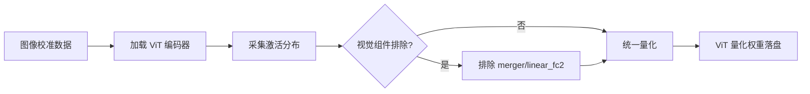

# 视觉 Transformer（ViT）量化术语百科词条

> **词条类别**：[量化基础概念](../README.md)
> **英文名称**：Vision Transformer Quantization
> **英文缩写**：ViT Quantization
> **应用领域**：视觉编码器推理加速、多模态模型压缩
> **msModelSlim 实现**：`msmodelslim/core/quant_service/multimodal_vlm_v1/`

---

## 1. 概述

视觉 Transformer（ViT）量化是指对视觉 Transformer 编码器进行[训练后量化（PTQ）](../README.md)的过程，将视觉编码器的权重和激活值从浮点表示映射到低比特整数或低精度浮点格式。ViT 量化通常作为[VLM 量化](./term_vision_transformer_quantization.md)或[DiT 量化](../dit/term_diffusion_transformer_quantization.md)的子流程出现，负责降低视觉编码环节的显存占用与计算开销。ViT 量化的核心挑战在于：视觉特征投影层（如 merger、linear_fc2）对量化误差敏感，且视觉编码器需整体加载，显存压力高于纯文本模型的逐层量化。

---

## 2. 背景与动机

视觉 Transformer 是 VLM 模型中负责图像编码的核心组件，其参数量可达数十亿，是 VLM 显存占用中的重要组成部分。以 Qwen3-VL 为例，其视觉编码器包含约 675M 参数，且需要一次性全部加载到显存中，无法像文本解码器那样逐层按需加载。通过量化将 ViT 权重从 FP16 压缩至 INT8 可减少约2倍视觉编码器存储，有效降低多模态推理的整体显存开销。此外，ViT 的激活值分布与文本解码器存在显著差异，需要针对视觉模态做专门的量化策略适配。

---

## 3. 原理

### 3.1 核心思想

ViT 量化的核心思想是利用图像校准数据统计视觉编码器的激活分布，确定缩放因子与零点，将浮点张量映射到低比特表示。其关键路径包括：

- **图像校准**：使用图像数据（而非文本）统计视觉编码器各层的激活值分布，捕捉视觉模态的数值特征。
- **全量加载**：ViT 编码器整体一次性加载到显存中，作为整体模块参与量化处理，而非逐层加载。
- **视觉组件排除**：视觉特征投影层（如 `merger*`、`linear_fc2`、`deepstack_merger_list*`）对量化误差敏感，通常从量化范围中排除，以保持视觉特征的精度。
- **旋转对齐**：在采用 QuaRot 旋转量化时，视觉输出投影层需做左旋转（$W_{\text{new}} = R^T W_{\text{old}}$），使视觉特征进入与文本嵌入相同的旋转空间。

### 3.2 数学描述

ViT 量化的数学基础与标准均匀量化一致：

$$ \hat{x} = \text{round}\left(\frac{x}{\Delta}\right) + z $$

其中：

- $x$：原始浮点值
- $\hat{x}$：量化后的整数值
- $\Delta$：缩放因子，$\Delta = \frac{x_{\text{max}} - x_{\text{min}}}{2^{b} - 1}$
- $z$：零点偏移
- $b$：量化比特数

与文本解码器不同的是，ViT 使用独立的量化参数（$\Delta_{\text{vision}}, z_{\text{vision}}$），其统计分布基于图像校准数据而非文本数据。此外，在 QuaRot 旋转量化中，视觉输出投影层需满足以下等价变换：

$$ \text{VisualOutput}(x) \cdot R = \text{VisualOutput}_{\text{rotated}}(x) $$

其中 $R$ 为 Hadamard 旋转矩阵。视觉输出投影层权重 $W$ 变换为 $W_{\text{new}} = R^T W$（左旋转），使得视觉特征 $y = x \cdot W_{\text{new}}^T = x \cdot W^T \cdot R$ 进入旋转后的残差流空间。

### 3.3 关键性质

- **全量加载**：ViT 编码器需一次性整体加载到显存，无法像文本解码器那样逐层按需加载，显存占用较高。
- **视觉组件排除**：视觉特征投影层（merger、linear_fc2、deepstack_merger）排除在量化之外，以保持视觉特征精度。
- **异构分布**：ViT 的激活值分布与文本解码器存在显著差异，需独立统计量化参数。
- **左旋转对齐**：QuaRot 量化中视觉输出投影层需左旋转（$R^T W$），以对齐到文本嵌入的旋转空间。
- **图像校准依赖**：量化效果依赖图像校准数据的质量，纯文本数据无法统计视觉模态的分布特征。

---

## 4. 流程示意

> 详细算法步骤与代码级解析，请参阅 [《VLM 多模态理解模型接入》](../../model/integrating_multimodal_understanding_model.md)。



---

## 5. 在 msModelSlim 中的实现

> 关于该能力在 msModelSlim 中的完整实现细节与代码架构解析，请参阅 [《VLM 多模态理解模型接入》](../../model/integrating_multimodal_understanding_model.md)。

### 5.1 实现位置

ViT 量化在 msModelSlim 中作为 VLM 量化服务的一部分实现，位于 `msmodelslim/core/quant_service/multimodal_vlm_v1/` 目录，对应 `apiversion: multimodal_vlm_modelslim_v1`。各 VLM 模型适配器（如 `msmodelslim/model/qwen3_vl/`、`msmodelslim/model/glm4_6v/`、`msmodelslim/model/qwen2_5_vl/`）中均包含 ViT 编码器的量化处理逻辑，包括视觉组的 `generate_model_visit` 和 `generate_model_forward` 实现。

### 5.2 处理流程

- 加载图像校准数据（`VlmCalibSample`，含图像路径与文本 prompt）。
- 初始化模型时，ViT 编码器全量加载到显存（`init_model` 中一次性加载）。
- 在 `generate_model_visit` 中，ViT 编码器作为第一个被访问的模块（`model.visual`），整体参与处理器链处理。
- 在 `generate_model_forward` 中，ViT 编码器前向传播生成图像特征，随后与文本嵌入融合。
- 配置中通过 `exclude` 字段排除视觉组件（如 `*merger*`、`*linear_fc2`）的量化。
- 若启用 QuaRot，在 `pre_run` 阶段对视觉输出投影层执行左旋转。

### 5.3 配置示例

以下为最小可用的 YAML 配置片段（以 Qwen3-VL W8A8 为例）。各字段的详细含义与取值范围，请参阅[《量化配置协议详解》](../../../user_guide/usage_quick_quantization.md#54-multimodal_vlm_modelslim_v1-配置详解)。

```yaml
apiversion: multimodal_vlm_modelslim_v1
spec:
  process:
    - type: "linear_quant"
      qconfig:
        act:
          scope: "per_tensor"
          dtype: "int8"
        weight:
          scope: "per_channel"
          dtype: "int8"
      include:
        - "*"
      exclude:
        - "*linear_fc2"
        - "*merger*"
  dataset: "calibImages"
  default_text: "Describe this image in detail."
```

---

## 6. 适用场景与限制

### 6.1 适用场景

- **VLM 模型量化**：作为多模态理解模型量化的一部分，对视觉编码器执行量化以降低显存占用。
- **视觉特征提取加速**：对独立部署的视觉编码器进行量化，加速图像特征提取流程。
- **多模态模型边缘部署**：在资源受限设备上运行量化后的视觉编码器，适配轻量级多模态推理。

### 6.2 使用限制

- **显存占用较高**：ViT 编码器需整体加载，无法逐层量化，显存开销高于文本解码器。
- **视觉组件精度敏感**：视觉特征投影层（merger、linear_fc2）对量化误差敏感，需排除量化，压缩比受限。
- **校准数据依赖图像**：ViT 量化依赖图像校准数据，无法使用纯文本数据统计激活分布。
- **视觉-语言耦合**：ViT 量化通常与文本解码器量化耦合进行，独立量化视觉编码器的场景较少。

---

## 7. 关联流程

- [《VLM 量化使用指南》](./usage_vision_transformer_quantization.md)：VLM 量化完整流程，其中 ViT 量化作为视觉编码器子流程。
- [《VLM 新模型接入案例》](./integration_guide_vision_transformer_quantization.md)：将新 VLM 模型接入量化流程，包含 ViT 编码器的适配说明。
- [《一键量化完整指南》](../../../user_guide/usage_quick_quantization.md)：涵盖 VLM 与多模态模型的一键量化流程，默认集成 ViT 量化。

---

## 8. 关联词条

- [VLM 量化](./term_vision_transformer_quantization.md)：上位概念，ViT 量化是 VLM 量化中视觉编码器环节的具体实现。
- [LLM 量化](../llm/term_large_language_model_quantization.md)：对比概念，文本解码器采用逐层量化，与 ViT 全量加载策略不同。
- [DiT 量化](../dit/term_diffusion_transformer_quantization.md)：同类概念，DiT 模型中的视觉编码部分同样涉及视觉 Transformer 量化。
- [PTQ](../README.md)：上位概念，ViT 量化属于训练后量化的具体应用之一。

---

## 9. 参考资料

1. [《VLM 多模态理解模型接入》](../../model/integrating_multimodal_understanding_model.md)：VLM 模型接入与量化架构说明，含 ViT 编码器量化细节。
2. [《msModelSlim 一键量化完整指南》](../../../user_guide/usage_quick_quantization.md)：一键量化总体流程。
3. Dosovitskiy A, et al. "An Image is Worth 16x16 Words: Transformers for Image Recognition at Scale." ICLR 2021. https://arxiv.org/abs/2010.11929
4. Xiao G, et al. "SmoothQuant: Accurate and Efficient Post-Training Quantization for Large Language Models." arXiv:2211.10438, 2022. https://arxiv.org/abs/2211.10438
