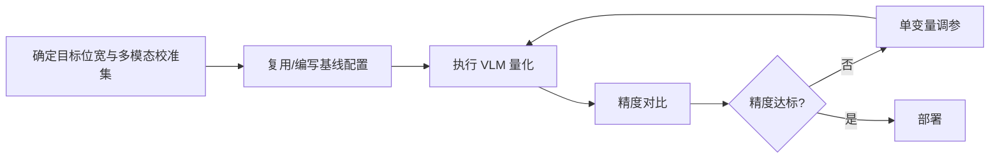

# 视觉语言模型（VLM）量化使用指南

## 1. 适用范围

本指南面向首次对多模态视觉语言模型（如 Qwen3-VL、GLM-4.6V、InternVL3.5 等）执行[训练后量化（PTQ）](../term_ptq.md)的用户。**重点不是展开完整执行命令，而是给出可上手的推荐配置，并说明每个配置项的含义（原理）以及何时需要调整、怎么选。**

适用场景：

- 将浮点 VLM 量化为 W8A8 等低比特格式并部署
- 对 MoE 架构 VLM 执行混合量化（dense 层静态 + expert 层动态）
- 为多模态在线推理服务准备量化权重

模型是否支持、命令行怎么写不在此展开：支持矩阵见[《大模型支持矩阵》](../../model/README.md)，完整执行命令见[《一键量化完整指南》](../../../user_guide/usage_one_click_quantization.md)。

## 2. 输入和交付件

| 类型 | 名称 | 来源或保存位置 | 格式或约束 | 验收方式 |
| --- | --- | --- | --- | --- |
| 输入 | 浮点 VLM 权重目录 | 模型下载或本地路径 | HuggingFace 格式，含 `config.json` 及 `*.safetensors` | 可被目标 Transformers 版本加载 |
| 输入 | 多模态校准数据集 | 工具默认 `lab_calib/calibImages/` 或用户指定 | 图像目录 / index.jsonl，含图像路径与文本 prompt | 至少包含 128 张校准图像 |
| 输入 | 默认文本 prompt | YAML 配置 `default_text` 字段 | 非空字符串 | 与校准图像语义匹配 |
| 交付件 | 量化权重目录 | `--save_path` 指定路径 | 含 `quant_model_description.json` 及 `*.safetensors` | 推理冒烟通过 |

## 3. 流程总览

入门时建议先用一组**稳定推荐配置**建立基线，再围绕影响最大的参数做单变量调整。



## 4. 操作步骤

### 步骤 1：确认目标与约束

**操作**：先固定三件事——目标量化格式/位宽（决定 `qconfig`）、部署推理框架（决定 `save` 格式）、可用设备数（决定 `runner`）。VLM 量化**不支持** `MODEL_WISE` runner，仅支持 `LAYER_WISE` 与 `DP_LAYER_WISE`。目标模型已有 `lab_practice/` 下已验证配方时，**优先复用该配方**，再参考下文理解每个参数为什么这样选。

### 步骤 2：建立推荐基线

**操作**：下面给出 VLM 最常用的 W8A8 推荐基线。如果目标模型已有 `lab_practice` 配方，直接使用已验证配方；没有配方时从这里的推荐起点开始。

```yaml
apiversion: multimodal_vlm_modelslim_v1
spec:
  runner: auto                    # 单卡 layer_wise，多卡 dp_layer_wise
  process:
    - type: linear_quant
      qconfig:
        act:
          dtype: int8
          scope: per_tensor       # VLM 视觉模态激活分布稳定，per_tensor 即可满足精度
          symmetric: false
          method: minmax
        weight:
          dtype: int8
          scope: per_channel
          symmetric: true
          method: minmax
      include: ["*"]
      exclude:
        - "*merger*"              # 视觉特征投影层排除量化
        - "*linear_fc2"
        - "*deepstack_merger_list*"
  save:
    - type: ascendv1_saver
  dataset: calibImages
  default_text: "Describe this image in detail."
```

> Visual 组件排除（`exclude` 中的 `*merger*`、`*linear_fc2` 等）是 VLM 量化区别于纯 LLM 量化的关键。这些投影层对视觉特征精度敏感，排除量化可以大幅降低精度损失。具体排除哪些层取决于模型架构，建议优先复用 `lab_practice` 中已验证的排除列表。

**参考配置示例**（已有 `lab_practice` 配方时优先复用）：

| 模型 | 量化方案 | 配置路径 |
|------|---------|---------|
| Qwen3-VL-32B | W8A8 | `lab_practice/qwen3_vl/qwen3_vl_w8a8.yaml` |
| Qwen3-VL-MoE | W8A8 hybrid | `lab_practice/qwen3_vl_moe/qwen3_vl_moe_w8a8.yaml` |
| Qwen2.5-VL | W8A8 MXFP8 | `lab_practice/qwen2_5_vl/qwen2.5-vl-*-w8a8-mxfp.yaml` |
| GLM-4.6V | W8A8 hybrid | `lab_practice/glm4_6v/glm4_6v_w8a8.yaml` |
| InternVL3.5 | W8A8 | `lab_practice/internvl3_5/internvl_w8a8.yaml` |

### 步骤 3：选择并调整参数

**操作**：参数选择按三个层次理解：先确认 `dtype/scope/symmetric/method` 组合是否被工具支持；其次确定 `include/exclude` 等作用范围；最后再调整会改变精度与开销的数值参数。VLM 量化与 LLM 量化共享大部分参数（`runner`、`process`、`linear_quant.qconfig` 等），详细说明见 [LLM 量化使用指南](../llm/usage_large_language_model_quantization.md#步骤-3选择并调整参数)，以下仅列出 VLM 特有或差异较大的配置项。

| 配置项 | 含义（原理） | 推荐配置 | 选择与调整建议 |
| --- | --- | --- | --- |
| `runner` | 流水线执行方式。VLM 量化中视觉编码器需**整体加载**到显存（无法逐层），因此显存消耗高于纯 LLM 量化，大模型建议使用多卡 `dp_layer_wise`。**不支持** `model_wise`。 | `auto`（默认）。单卡 `layer_wise`，多卡 `dp_layer_wise`。 | 显存不足时优先增加 NPU 卡数，而不是尝试 `model_wise`（不支持）。多卡时框架自动使用 `dp_layer_wise` 加速。 |
| `exclude`（视觉组件排除） | 将视觉特征投影层（如 `*merger*`、`*linear_fc2`、`*deepstack_merger_list*`）从量化范围中排除，保持浮点精度。这些层负责将图像 patch 特征映射到文本嵌入空间，量化误差会直接破坏视觉语义对齐。 | 优先复用 `lab_practice` 中已验证的排除列表；常见模式：`*merger*`、`*linear_fc2`、`*deepstack_merger_list*`。 | 精度调优时，若视觉质量下降明显，优先检查排除列表是否遗漏了敏感投影层。反之，若排除列表过大导致压缩率低，可尝试逐步缩小排除范围，每次只排除一个层模式。 |
| `dataset` | 校准数据集名称或路径。VLM 量化需使用**多模态校准数据**（图像 + 文本 prompt），而非纯文本，才能统计视觉模态的激活分布。 | `calibImages`（工具默认提供 COCO 校准图像）。 | 如果业务图像分布特殊（如医疗影像、卫星图），应替换为与真实输入同分布的数据。校准图像数量建议 128~512 张。 |
| `default_text` | 图像校准数据缺省文本 prompt 时的默认输入。当校准数据只包含图像路径、没有文本 prompt 时，使用此默认文本作为语言解码器的输入。 | `"Describe this image in detail."`（默认）。 | 应与业务场景匹配：Caption 任务用描述性 prompt，VQA 任务用问答式 prompt。更换 `default_text` 会影响量化参数的统计分布，更换后应重新量化。 |
| `process`（VLM 特有处理器链） | VLM 量化中，除 `linear_quant` 外，常配合 `quarot`（离线旋转对齐）和 `iter_smooth`（迭代平滑）等处理器提升量化精度。旋转对齐使视觉特征进入与文本嵌入相同的旋转空间，平滑处理可抑制离群值。 | 入门只用 `linear_quant` + 视觉组件 `exclude`；精度不足时再叠加 `quarot` + `iter_smooth`。 | 参考 `lab_practice/qwen3_vl/qwen3_vl_w8a8.yaml` 的处理器链顺序：`quarot` → `iter_smooth` → `linear_quant`。不要一上来就堆处理器，先建立基线。 |

> 其余参数（`linear_quant.qconfig` 中的 `act.dtype`/`scope`、`weight.dtype`/`scope`、`symmetric`、`method`、`include`/`exclude` 通用模式、`save` 等）的选择逻辑与 LLM 量化一致，详见 [LLM 量化使用指南](../llm/usage_large_language_model_quantization.md#步骤-3选择并调整参数)。

### 参数组合与选择顺序

1. **先锁定部署目标与支持组合**：确定最终位宽/数值格式，VLM 量化不支持 `model_wise` runner，多卡时自动使用 `dp_layer_wise`。
2. **再固定视觉组件排除列表**：视觉投影层排除是 VLM 量化的核心，优先复用 `lab_practice` 中已验证的排除模式。
3. **最后只调一个旋钮**：位宽、粒度、排除范围、处理器链一次只改一项，保持同一校准集和评测集。

### 步骤 4：根据结果收敛参数方案

**操作**：调参时先记录一份完整基线（数据集、量化范围、关键参数、端到端指标），每轮只改一个变量并与基线比较。

- **先跑推荐基线，再调单变量。** 不要同时修改位宽、粒度、排除范围和处理器链。
- **视觉精度优先排查排除列表。** 若生成结果视觉质量下降，优先检查 `exclude` 是否遗漏了视觉敏感层，这通常比整体升位宽更划算。
- **最终以模型实践配置和部署能力为准。** 目标模型已有 `lab_practice` 配方时，应优先复用已验证组合。

## 5. 术语

| 术语 | 简述 | 链接 |
| --- | --- | --- |
| VLM 量化 | 多模态视觉语言模型训练后量化 | [VLM 量化词条](./term_vision_transformer_quantization.md) |
| PTQ | 训练后量化 | [PTQ 词条](../term_ptq.md) |

## 6. 接口文档列表

| 接口或能力 | 简述 | 链接 |
| --- | --- | --- |
| `msmodelslim quant` | 一键量化 CLI 入口与完整命令说明 | [一键量化完整指南](../../../user_guide/usage_one_click_quantization.md) |
| multimodal_vlm_modelslim_v1 配置说明 | `runner`/`process`/`save`/`dataset`/`default_text` 等任务级配置的字段类型、默认值与完整约束 | [multimodal_vlm_modelslim_v1 配置说明](../../../api_reference/config/task/multimodal_vlm_modelslim_v1.md) |
| linear_quant 配置说明 | `linear_quant` 处理器及其 `qconfig` 各字段的完整取值说明 | [linear_quant 配置说明](../../../api_reference/config/processor/linear_quant.md) |

> **高阶功能**：如需深度探索 prepare 阶段、敏感层分析、混合精度、QuaRot 旋转对齐等高级处理器组合，可查阅 [api_reference/config/task 高阶配置文档](https://gitcode.com/Ascend/msmodelslim/blob/master/docs/zh/api_reference/config/task)。入门阶段无需使用这些能力。
