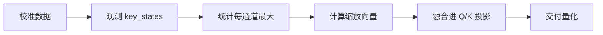

# KV Smooth 缓存平滑算法词条

> **词条类别**：离群值抑制算法
> **英文名称**：KV Smooth
> **应用领域**：KV Cache 压缩、大语言模型量化压缩
> **msModelSlim 实现**：`msmodelslim/processor/kv_smooth/`

---

## 1. 概述

KV Smooth 是一种针对 KV Cache 量化的离群值抑制算法。在 KV Cache 量化中，Key 的少量离群值会显著抬高量化尺度，导致大部分通道有效比特不足、注意力打分退化。KV Smooth 通过把缩放系数融合进 RoPE 之前的 Q/K 投影或归一化权重，在不改变注意力打分 $QK^T$ 的前提下压缩 K 的动态范围，使其更易量化。其核心特征是：保持注意力分数不变、仅量化写入缓存的 `key_states`、融合点位于 RoPE 之前，为 [KVCache Quant](../kvcache_quant/term_kvcache_quant.md) 提供离群值抑制。

---

## 2. 词条介绍

KV Cache 量化以降低长序列推理的显存占用为目标，但 Key 张量中的离群值会拉大量化尺度，使多数通道的量化精度严重下降。由于推理时只量化写入 KV Cache 的 `key_states` 而不量化 `query_states`，因此可以将离群值从 `key_states` 迁移到 `query_states`，在保持注意力打分不变的前提下获得更稳健的 KV Cache 量化。

---

## 3. 原理

### 1. 核心思想

KV Smooth 的核心思想是“缩放迁移”：把缩放系数 $s$ 融合进 RoPE 之前的 Q/K 投影或归一化权重，令 $K' = K / s$、$Q' = Q \times s$，从而有 $Q'K'^T = QK^T$，注意力分数保持不变，而 K 的动态范围被压缩。RoPE 将通道成对旋转，算法先在配对通道间取最大值，再恢复到配对结构进行缩放。

### 2. 数学描述

设缩放向量为 $s$，RoPE 之前的 K、Q 分支输出为 $K$、$Q$，则平滑后的值为：

$$
K' = \frac{K}{s}, \quad Q' = Q \times s
$$

注意力打分保持不变：

$$
Q'K'^T = Q \times s \cdot \left(\frac{K}{s}\right)^T = QK^T
$$

- $K$：写入 KV Cache 前的 key 状态（`key_states`）
- $Q$：query 状态（`query_states`）
- $s$：逐通道缩放向量，由观测到的 $|key\_states|$ 最大值计算

平滑统计以每层每通道的绝对值最大值为基准，缩放向量按融合方式重写 RoPE 之前的模块权重（及可选 `bias`）。

### 3. 关键性质

- **注意力分数不变**：缩放迁移保证 $QK^T$ 不变，不改变注意力打分。
- **离群值迁移**：离群值从 `key_states` 迁移到 `query_states`，而推理时不量化 `query_states`，不引入额外误差。
- **RoPE 配对处理**：利用 RoPE 通道成对旋转的性质，在配对通道间取最大后恢复。
- **融合点灵活**：支持 `state-rope-linear` 与 `state-rope-norm` 两类融合通路。
- **平滑强度可调**：通过 `smooth_factor` 控制平滑激进程度。

---

## 4. 流程示意

> 以下为本算法在 msModelSlim 中的简化流程概览。



---

## 5. 在 msModelSlim 中的实现

### 1. 实现位置

算法在 `msmodelslim/processor/kv_smooth/` 目录下实现，通过 `type: "kv_smooth"` 处理器使用。

### 2. 处理流程

- **观察阶段**（`preprocess`）：注入观察器封装 `past_key_values`，在注意力模块调用 `Cache.update()` 时捕获 `key_states`，在维度 `[batch, seq]` 上聚合 min/max。
- **平滑阶段**（`postprocess`）：根据统计到的 $|key\_states|$ 最大值计算缩放向量，按融合方式重写 RoPE 之前的 `weight`（及可选 `bias`），平滑 `key_states` 并放大 `query_states`。

### 3. 配置示例

> 以下为最小可用的 YAML 配置片段。各字段的详细含义如下表所示。

```yaml
spec:
  process:
    - type: "kv_smooth"
      smooth_factor: 1.0
      include: ["*"]
      exclude: ["model.layers.0.self_attn"]
```

**字段说明**：

| 字段名 | 作用 | 说明 |
| --- | --- | --- |
| type | 处理器类型标识 | 固定为 `"kv_smooth"`。 |
| smooth_factor | 平滑激进程度 | 大于 0 的浮点数，越大平滑越激进，默认 `1.0`。 |
| include | 包含的层 | 字符串列表，支持通配符匹配，默认为 `["*"]`。 |
| exclude | 排除的层 | 字符串列表，支持通配符匹配，默认为空，优先级高于 `include`。 |

### 4. 模型适配接口

模型适配需实现 `KVSmoothFusedInterface` 接口，提供以下方法：

- `get_kvsmooth_fused_subgraph()`：返回 `KVSmoothFusedUnit` 列表。
- `get_head_dim()`
- `get_num_key_value_groups()`
- `get_num_key_value_heads()`

参考实现：`msmodelslim/model/qwen3/model_adapter.py`。

---

## 6. 适用场景与限制

### 1. 适用场景

- KV Cache 量化（如 [KVCache Quant](../kvcache_quant/term_kvcache_quant.md)）前需要抑制 Key 离群值、提升缓存量化精度的场景。
- 长序列推理场景下，需要压缩 KV Cache 动态范围以降低显存占用的场景。

### 2. 使用限制

- 注意力前向必须接受并使用 `past_key_values` 或 `past_key_value`，否则无法观测缩放尺度。
- 目前仅支持 `Linear/Norm → RoPE → KVCache` 两类通路的融合。
- 基于 RoPE 成对通道规约的假设，非 RoPE 结构需谨慎评估。
- 基于仅量化 KV Cache 的 `key_states`/`value_states`、不量化 `query_states` 的假设。

---

## 7. 关联流程

- 《[一键量化 (V1)](../../../user_guide/usage_quick_quantization.md)》：默认集成本算法作为 KV Cache 量化的前置离群值抑制步骤。
- 《[量化精度调优指南](../../../user_guide/process_quantization_precision_tuning.md)》：精度不达标时可考虑启用本算法。

---

## 8. 关联词条

- [KVCache Quant](../kvcache_quant/term_kvcache_quant.md)：配套术语，本算法为 KV Cache 量化提供离群值抑制。
- [SmoothQuant](../smooth_quant/term_smooth_quant.md)：同类算法，同属缩放类离群值抑制，但面向激活与权重而非 KV Cache。
- [QuaRot](../quarot/term_quarot.md)：对比算法，采用正交旋转而非缩放抑制离群值。
- [FA3 Quant](../fa3_quant/term_fa3_quant.md)：配套术语，同样关注长序列下注意力激活的量化。

---

## 9. 参考资料

1. 《KV Smooth 使用指南》([./usage_kv_smooth.md](./usage_kv_smooth.md))
