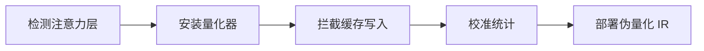

# KVCache Quant 缓存量化算法词条

> **词条类别**：量化算法
> **英文名称**：KVCache Quant
> **英文缩写**：KV Quant
> **应用领域**：KV Cache 压缩、长序列推理加速
> **msModelSlim 实现**：`msmodelslim/processor/quant/attention.py`

---

## 1. 概述

KVCache Quant 是一种针对 KV Cache 的量化算法。它对写入 KV Cache 的 `key_states` 和 `value_states` 进行 INT8 量化，在保持生成质量的前提下显著降低缓存内存占用（FP16→INT8 理论可减少约 50% 的 cache 内存）。其核心特征是：在 `DynamicCache.update()` 调用时拦截 Key/Value 状态、按隐藏层维度 per_channel 计算量化参数、与 Transformers 标准缓存机制兼容，通常配合 [线性量化](../linear_quant/term_linear_quant.md) 实现全量化方案。

---

## 2. 词条介绍

在大模型推理中，KV Cache 存储的 Key/Value 状态占用大量显存，并随序列长度线性增长，成为长序列推理的瓶颈。对写入 KV Cache 的状态进行量化，可以在保持生成质量的前提下显著降低缓存内存占用，提升长序列推理效率。

---

## 3. 原理

### 1. 核心思想

KVCache Quant 的核心思想是“在缓存写入路径上插入量化”：在注意力模块调用 `DynamicCache.update()` 写入 Key/Value 状态时，拦截并应用量化校准。量化按隐藏层维度（per_channel）计算量化参数，平衡精度与效率，量化后的缓存状态以伪量化 IR 部署。

### 2. 数学描述

对缓存状态 $X$（shape 为 $(B, H, S, D)$），先转置并重塑为量化器输入格式，应用伪量化：

$$
X_{\text{transposed}} = X^{\top}_{(B,H,S,D) \rightarrow (B,S,H,D)}
$$

$$
X_{\text{reshaped}} = \operatorname{reshape}(X_{\text{transposed}}, (-1, H \times D))
$$

$$
X_{q\_dq} = \operatorname{fake\_quantize}(X_{\text{reshaped}}, q\_param)
$$

- $B$：batch 大小
- $H$：注意力头数量
- $S$：序列长度
- $D$：head 维度
- $q\_param$：per_channel 量化参数（scale/offset）

### 3. 关键性质

- **缓存路径量化**：在 `DynamicCache.update()` 时拦截 Key/Value 状态，不影响查询与注意力权重。
- **per_channel 量化**：按隐藏层维度计算量化参数，平衡精度与效率。
- **内存压缩**：FP16→INT8 理论可减少约 50% 的 cache 内存占用。
- **兼容性好**：与 Transformers 标准 `DynamicCache` 兼容，无需修改上层推理逻辑。
- **增量校准**：支持动态序列长度变化的增量式校准。

---

## 4. 流程示意

> 以下为本算法在 msModelSlim 中的简化流程概览。



---

## 5. 在 msModelSlim 中的实现

### 1. 实现位置

算法在 `msmodelslim/processor/quant/attention.py` 中实现，核心组件包括 `DynamicCacheQuantizer`（校准阶段量化器）与 `FakeQuantDynamicCache`（部署阶段伪量化 IR），通过 `type: "dynamic_cache"` 处理器使用。

### 2. 处理流程

- **检测阶段**（`pre_run`）：自动检测模型中的注意力层（基于模块类名称模式匹配 `*self_attn*`），为每个注意力层创建 `DynamicCacheQuantizer` 并安装触发钩子。
- **校准阶段**（`run`）：通过钩子机制在 `DynamicCache.update()` 调用时拦截 Key/Value 状态，进行伪量化并收集统计信息。
- **伪量化部署阶段**（`postprocess`）：将量化器转换为推理优化的 `FakeQuantDynamicCache` IR。

### 3. 配置示例

> 以下为最小可用的 YAML 配置片段。各字段的详细含义如下表所示。

```yaml
spec:
  process:
    - type: "dynamic_cache"
      qconfig:
        scope: "per_channel"
        dtype: "int8"
        symmetric: True
        method: "minmax"
      include: ["*"]
      exclude: ["model.layers.0.self_attn"]
```

**字段说明**：

| 字段名 | 作用 | 说明 |
| --- | --- | --- |
| type | 处理器类型标识 | 固定为 `"dynamic_cache"`。 |
| qconfig | 缓存量化配置 | 包含 `scope`、`dtype`、`symmetric`、`method` 等字段。 |
| scope | 量化粒度 | 仅支持 `"per_channel"`，按隐藏层维度计算量化参数。 |
| dtype | 量化数据类型 | 仅支持 `"int8"`。 |
| symmetric | 对称量化开关 | 布尔值，默认 `true`。 |
| method | 量化方法 | 仅支持 `"minmax"`。 |
| include | 包含的注意力层 | 字符串列表，支持通配符匹配。 |
| exclude | 排除的注意力层 | 字符串列表，支持通配符匹配，优先级高于 `include`。 |

### 4. 模型适配接口

模型适配要求：

- 注意力模块 `forward` 接受 `DynamicCache` 对象并调用 `cache.update()`（需正确传递 `layer_idx`）。
- 自定义缓存需实现 `update(key_states, value_states, layer_idx)` 接口。

---

## 6. 适用场景与限制

### 1. 适用场景

- 长序列推理场景下需要降低 KV Cache 显存占用的场景。
- 与 [线性量化](../linear_quant/term_linear_quant.md) 配合实现全量化方案，提升长序列推理效率。

### 2. 使用限制

- 注意力模块 `forward` 函数必须接受一个 `DynamicCache` 对象并调用 `cache.update()`。
- 当前仅支持 INT8 量化，仅对 KV Cache 状态量化。
- 伪量化阶段仍需原精度内存，真实内存节省需要底层算子支持。
- 基于模块类名称模式匹配（`*self_attn*`），自定义命名需要适配。

---

## 7. 关联流程

- 《[一键量化 (V1)](../../../user_guide/usage_quick_quantization.md)》：可集成 KVCache Quant 作为缓存量化步骤。
- 《[量化精度调优指南](../../../user_guide/process_quantization_precision_tuning.md)》：精度不达标时可调整缓存量化配置。

---

## 8. 关联词条

- [线性量化](../linear_quant/term_linear_quant.md)：配套术语，KVCache Quant 通常与线性量化配合实现全量化方案。
- [KV Smooth](../kv_smooth/term_kv_smooth.md)：配套术语，本算法可配合 KV Smooth 抑制 Key 离群值。
- [FA3 Quant](../fa3_quant/term_fa3_quant.md)：配套术语，同属长序列推理的缓存/激活量化方案。
- [MinMax](../minmax/term_minmax.md)：应用对象，缓存量化使用 MinMax 方法计算量化参数。

---

## 9. 参考资料

1. 《KVCache Quant 使用指南》([./usage_kvcache_quant.md](./usage_kvcache_quant.md))
