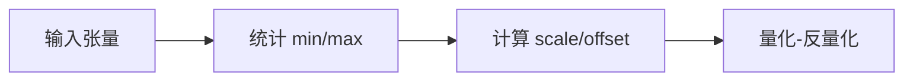

# MinMax 最小最大值量化算法词条

> **词条类别**：量化算法
> **英文名称**：MinMax
> **英文缩写**：MinMax
> **应用领域**：深度学习模型压缩、大语言模型量化
> **msModelSlim 实现**：`msmodelslim/core/quantizer/impl/minmax.py`

---

## 1. 概述

MinMax 是一种最基础且最常用的量化算法。它通过统计张量（权重或激活值）中的最小值和最大值来确定量化范围，从而计算量化缩放因子（scale）和偏移量（offset）。其核心特征是：简单高效、计算开销极低、适用面广，是大多数常规量化场景的首选，也是 [线性量化](../linear_quant/term_linear_quant.md) 中最基础的量化方法。

---

## 2. 词条介绍

量化需要确定浮点数值到整数的映射范围。MinMax 观察到，用张量的实际最小/最大值作为量化边界，可以完整覆盖数据分布，且计算代价极低，适合作为基础量化方法。不过其对离群值敏感，当张量中存在极端离群值时，量化范围会被拉大、正常数值精度下降。

---

## 3. 原理

### 1. 核心思想

MinMax 的核心思想是“以极值定范围”：统计张量中的最小值和最大值作为量化边界，据此计算缩放因子与零点，将浮点数值线性映射到目标整数范围（如 INT8 的 $[-128, 127]$ 或 FP8 的表示范围）。

### 2. 数学描述

先确定范围：

$$
V_{\min} = \min(X), \quad V_{\max} = \max(X)
$$

缩放因子 $S$：

$$
S = \frac{V_{\max} - V_{\min}}{Q_{\max} - Q_{\min}} \quad (\text{非对称})
$$

$$
S = \frac{\max(|V_{\min}|, |V_{\max}|)}{Q_{\max}} \quad (\text{对称})
$$

零点 $Z$：

$$
Z = Q_{\min} - \operatorname{round}\left(\frac{V_{\min}}{S}\right) \quad (\text{非对称})
$$

$$
Z = 0 \quad (\text{对称})
$$

- $X$：待量化张量（权重或激活值）
- $V_{\min}$、$V_{\max}$：张量的最小值与最大值
- $S$：缩放因子
- $Z$：零点偏移
- $Q_{\min}$、$Q_{\max}$：目标数据类型数值范围（如 INT8 对称量化的 $Q_{\max}=127$）

### 3. 关键性质

- **简单高效**：仅需统计极值，计算开销极低。
- **线性映射**：浮点范围线性映射到整数范围，易于硬件实现。
- **对称与非对称**：支持对称（$Z=0$）与非对称（$Z$ 可调整）两种模式。
- **对离群值敏感**：极端离群值会拉大量化范围，导致正常数值精度下降。

---

## 4. 流程示意

> 以下为本算法在 msModelSlim 中的简化流程概览。



---

## 5. 在 msModelSlim 中的实现

### 1. 实现位置

算法在 `msmodelslim/core/quantizer/impl/minmax.py` 中实现，作为 `linear_quant` 处理器的激活值或权重量化方法（`method: "minmax"`）使用。

### 2. 处理流程

MinMax 作为 `linear_quant` 处理器 `qconfig.act` 或 `qconfig.weight` 中的量化方法使用。量化器统计张量极值，按 `scope`（`per_tensor`/`per_token`/`per_channel`/`per_group` 等）粒度计算 scale 与 offset，执行量化-反量化。

### 3. 配置示例

> 以下为最小可用的 YAML 配置片段。各字段的详细含义如下表所示。

```yaml
spec:
  process:
    - type: "linear_quant"
      qconfig:
        act:
          scope: "per_tensor"
          dtype: "int8"
          symmetric: false
          method: "minmax"
        weight:
          scope: "per_channel"
          dtype: "int8"
          symmetric: true
          method: "minmax"
```

**字段说明**：

| 字段名 | 作用 | 说明 |
| --- | --- | --- |
| qconfig.act.method | 激活值量化方法 | 固定为 `"minmax"`，指定激活值使用 MinMax 算法。 |
| qconfig.weight.method | 权重量化方法 | 固定为 `"minmax"`，指定权重使用 MinMax 算法。 |

---

## 6. 适用场景与限制

### 1. 适用场景

- 基础量化场景，INT8 等常规位宽的首选量化方法。
- 对计算开销敏感、需要快速完成量化的场景。

### 2. 使用限制

- 对离群值非常敏感，低比特（如 INT8、INT4）下精度下降明显。
- 存在极端离群值时，建议配合 [SmoothQuant](../smooth_quant/term_smooth_quant.md) 等离群值抑制算法，或使用 [SSZ](../ssz/term_ssz.md) 等更高级的量化算法。

---

## 7. 关联流程

- 《[一键量化 (V1)](../../../user_guide/usage_quick_quantization.md)》：默认集成 MinMax 作为基础量化方法。
- 《[量化精度调优指南](../../../user_guide/process_quantization_precision_tuning.md)》：精度不达标时可调整 MinMax 配置或换用其他量化算法。

---

## 8. 关联词条

- [线性量化](../linear_quant/term_linear_quant.md)：应用对象，MinMax 是线性量化的基础量化方法。
- [Histogram](../histogram_activation_quantization/term_histogram_activation_quantization.md)：对比算法，通过直方图截断过滤离群值，精度通常优于 MinMax。
- [SSZ](../ssz/term_ssz.md)：对比算法，通过迭代搜索优化量化参数，适用于低比特权重量化。
- [SmoothQuant](../smooth_quant/term_smooth_quant.md)：配套术语，可配合抑制离群值以提升 MinMax 精度。

---

## 9. 参考资料

1. Jacob B et al. Quantization and Training of Neural Networks for Efficient Integer-Arithmetic-Only Inference. CVPR 2018. https://arxiv.org/abs/1712.05877
2. 《MinMax 使用指南》([./usage_minmax.md](./usage_minmax.md))
