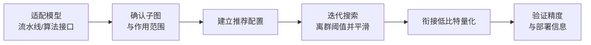

# OASQ 离群感知平滑量化算法使用指南

## 1. 适用范围

本指南面向需要使用 [OASQ 离群感知平滑量化算法](./term_oasq.md) 的用户。OASQ（Outlier-Aware Smooth Quantization）作为离群值抑制算法，通常写在量化 YAML 的 `spec.process` 中，作为后续线性量化等步骤之前的预处理。

适用场景：

- 已确定后续量化目标（如 W8A8 / W4A8），需要在配置中增加 OASQ 抑制激活通道离群；
- 激活分布存在显著离群通道，需要迭代搜索离群阈值并平滑激活分布。

不适用场景：

- 目标模型结构无法提供可融合子图且默认 hook 探测也不适用；
- 当前只需一次标定量化、无需离群抑制。

模型是否在官方预验证列表中请参考[《大模型支持矩阵》](../../model/README.md)；如需快速了解 CLI 基础用法可参阅[《一键量化完整指南》](../../../user_guide/usage_one_click_quantization.md)。

## 2. 输入和交付件

| 类型 | 名称 | 来源或保存位置 | 格式或约束 | 验收方式 |
| --- | --- | --- | --- | --- |
| 输入 | 浮点模型权重目录 | 模型下载或本地路径 | HuggingFace 格式，含 `config.json` 及 `*.safetensors` 分片 | 可被目标 Transformers 版本正常加载 |
| 输入 | 模型适配器 | 用户适配代码，通过 `--model_type` 调用 | 实现 `PipelineInterface` 及 `OASQInterface` 专用接口 | 能被调度器（Runner）与处理器（Processor）正常驱动 |
| 输入 | 校准数据集 | 工具内置 `lab_calib/` 或用户自定义路径 | JSONL 或 JSON 格式文本 Prompt，推荐 50 条 | 可被适配器 `handle_dataset` 成功编码为前向张量 |
| 输入 | 量化配置文件 | 本地 YAML 文件 | 符合 `modelslim_v1` 协议规范 | 通过模式校验（Schema Validation） |
| 交付件 | 量化权重目录 | `--save_path` 指定路径 | 含 `quant_model_description.json` 及 `*.safetensors` 分片 | 导出完整且推理冒烟测试通过 |

## 3. 流程总览

OASQ 的整体使用流程如下：



各阶段的关键细节如下：

- **适配模型流水线/算法接口**：适配器需实现 `PipelineInterface` 基础流水线接口，并实现 `OASQInterface` 提供可融合子图拓扑，是后续所有平滑步骤的前提。
- **确认子图与作用范围**：确定需要启用的 `enable_subgraph_type`（如 `norm-linear`、`ov`），并确认适配器返回的子图能覆盖这些类型；未实现接口时会回退默认 hook 自动探测，复杂结构可能匹配不准。
- **建立推荐配置**：以默认参数写入 `spec.process` 中的 OASQ 配置，作为后续调参的对照起点。
- **迭代搜索离群阈值并平滑**：按 `max_iters` 迭代搜索离群阈值，对 `norm-linear`、`linear-linear`、`ov`、`up-down` 等子图做离群感知平滑。
- **衔接低比特量化**：OASQ 放在真正量化处理器之前，衔接 `linear_quant` / `trainable_linear_quant` 等低比特量化步骤。
- **验证精度与部署信息**：对比无 OASQ 与含 OASQ 的端到端精度，确认保留当前配置或继续微调。

## 4. 操作步骤

### 步骤 1：适配模型流水线与算法接口

**目标**：量化工具不能直接操作任意结构的模型，它要求每个模型先套一层“适配器”，把模型的各种操作翻译成框架能统一调用的标准方法。本步骤即确认并完成这层适配器与 OASQ 专用接口。**模型适配必须先完成，才能执行 OASQ 算法。**

**操作**：模型适配代码需实现以下接口，相关接口均由 `msmodelslim.model.interface_hub` 汇总导出：

1. **`PipelineInterface`**（`ModelSlimPipelineInterfaceV1`）：基础流水线接口，负责模型加载（`init_model`）、数据预处理（`handle_dataset`）、逐层遍历（`generate_model_visit`）、逐层前向（`generate_model_forward`）等。
2. **`OASQInterface`**（位于 `msmodelslim.processor.anti_outlier.oasq.interface`）：OASQ 专用接口。

```python
from abc import ABC, abstractmethod
from typing import List
from msmodelslim.core.graph.adapter_types import AdapterConfig

class OASQInterface(ABC):
    @abstractmethod
    def get_adapter_config_for_subgraph(self) -> List[AdapterConfig]:
        """返回待平滑的子图拓扑配置，描述 Norm 与后续 Linear 之间的连接关系。"""
        ...
```

- **`get_adapter_config_for_subgraph`**：返回覆盖目标结构的 `List[AdapterConfig]`，用于描述可融合子图拓扑；未实现时会回退默认 hook 自动探测，复杂结构可能匹配不准。
- 若修改了适配器代码，需在仓库根目录重新执行 `bash install.sh` 使适配生效。

对于基于 HuggingFace Transformers 实现的标准开源 LLM，建议通过组合继承快速构建适配器：

```python
from msmodelslim.model.interface_hub import (
    IModel,
    ModelInfoInterface,
    ModelSlimPipelineInterfaceV1 as PipelineInterface,
    # ---- OASQ 算法适配接口（本步骤重点）----
    OASQInterface,  # 算法适配：get_adapter_config_for_subgraph 返回 norm-linear/ov 等子图映射拓扑
)

class MyModelAdapter(TransformersModel, ModelInfoInterface, PipelineInterface, OASQInterface):
    def get_adapter_config_for_subgraph(self):
        # 返回模型各层的 norm-linear / ov 等映射拓扑
        ...
```

之后量化命令中通过 `--model_type MyModelAdapter` 引用该适配器。

如需开发新模型适配代码，请参考[《LLM 模型接入量化流程指南》](../../ptq/llm/integration_guide_large_language_model_quantization.md)。

**输出**：已在框架中注册可用的模型适配器（通过 `--model_type` 调用）。

### 步骤 2：建立推荐配置

**操作**：

下面配置用于建立**第一版可比较基线**。如果目标模型已有 `lab_practice` 配方且含 OASQ，优先复用该片段。

```yaml
spec:
  process:
    - type: "oasq"
      # 入门建议不显式设置 max_iters，使用实现默认值（当前为 8）。
      symmetric: true
      enable_subgraph_type:
        - "norm-linear"
        - "linear-linear"
        - "ov"
        - "up-down"
      include: ["*"]
      exclude: []
    # 其后接 linear_quant / trainable_linear_quant 等量化步骤
```

将 OASQ 放在真正量化处理器**之前**。`symmetric` 应与后续权重/激活量化的对称性假设一致。

**输出**：一份可复现的推荐配置，后续所有参数调整均以此为比较对象。

### 步骤 3：选择并调整参数

**操作**：

每轮只调一个变量，并保持同一校准集和后续量化配置。

| 配置项 | 含义（原理） | 推荐配置 | 选择与调整建议 |
| --- | --- | --- | --- |
| `type` | 处理器标识，固定 `oasq`。 | 固定。 | 不调。 |
| `max_iters` | 离群阈值搜索的最大迭代次数；不设置时用实现默认（当前 `8`），显式设置须 >0。 | 省略，用默认。 | 日志显示迭代耗尽且离群比例难落入目标区间时，再小幅增大。 |
| `symmetric` | 是否按对称假设收集统计；非对称时 `norm-linear` 可启用 shift，其他子图会关闭 shift。 | `true`。 | 仅当后续量化明确非对称且主要依赖 `norm-linear` 时设 `false`。 |
| `enable_subgraph_type` | 应用 OASQ 的子图类型列表。 | 默认四类；有实践配方则沿用。 | 某类结构无效或不兼容时单独去掉该类，不要用 `max_iters` 补偿。 |
| `include` / `exclude` | 模块名通配白名单 / 黑名单；`exclude` 优先。 | `include: ["*"]`，`exclude: []`。 | 局部敏感或不兼容层用 `exclude` 回退；改范围后需重新跑量化对比。 |

调整顺序建议：先固定 `symmetric` 与子图类型，再改 `include`/`exclude`，最后才动 `max_iters`。每次只改一项，并保持后续量化配置与校准集不变。

**输出**：一份完成单变量调整的算法参数方案，关键字段均有明确的选择依据和调整方向。

### 步骤 4：编写量化配置并执行命令

**目标**：整合上述步骤生成完整的 YAML 量化配置文件，并通过 CLI 启动量化流程。

#### 完整示例：OASQ + W8A8 动态量化

##### 配置文件：`oasq_w8a8.yaml`

```yaml
apiversion: modelslim_v1
spec:
  runner: auto                    # 单卡自动使用 layer_wise，多卡自动使用 dp_layer_wise
  process:
    - type: oasq                  # 离群感知平滑预处理
      symmetric: true
      enable_subgraph_type:
        - "norm-linear"
        - "linear-linear"
        - "ov"
        - "up-down"
      include: ["*"]
      exclude: []
    - type: linear_quant          # 衔接低比特量化
      qconfig:
        act:
          dtype: int8
          scope: per_token        # 动态激活量化，精度表现好
          symmetric: true
          method: minmax
        weight:
          dtype: int8
          scope: per_channel
          symmetric: true
          method: minmax
      include: ["*"]
  save:
    - type: ascendv1_saver        # 昇腾推理标准保存格式
  dataset: mix_calib.jsonl        # 内置混合校准集
```

##### 执行命令（单卡量化）

```bash
msmodelslim quant \
  --model_path <浮点模型目录> \
  --save_path <量化权重输出目录> \
  --model_type <模型适配器名称> \
  --config ./oasq_w8a8.yaml \
  --device npu \
  --device_id 0
```

**输出**：在指定的 `--save_path` 目录下生成完整的量化权重文件与描述文件。

## 5. 术语

| 术语 | 简述 | 链接 |
| --- | --- | --- |
| OASQ 离群感知平滑量化算法 | 说明该算法的定义、核心原理、关键性质、适用场景与限制。 | [《OASQ 离群感知平滑量化算法 量化术语百科词条》](./term_oasq.md) |

## 6. 相关文档

| 接口或文档 | 简述 | 链接 |
| --- | --- | --- |
| `PipelineInterface` | 模型流水线适配接口（数据预处理、模型加载、模块遍历）。 | [《LLM 量化使用指南·步骤 1》](../../ptq/llm/usage_large_language_model_quantization.md) |
| `OASQInterface` | OASQ 算法模型适配接口，由 `msmodelslim.model.interface_hub` 汇总导出。 | [接口汇总模块](../../../../../msmodelslim/model/interface_hub.py) |
| oasq 配置说明 | 字段类型、默认值、合法取值与完整配置约束。 | [《oasq 配置说明》](../../../api_reference/config/processor/oasq.md) |
| modelslim_v1 配置说明 | 需要继续探索 runner、prior、save、dataset 等任务级高级配置时查阅。 | [《modelslim_v1 配置说明》](../../../api_reference/config/task/modelslim_v1.md) |
| 权重量化使用指南 | 用户指南：量化命令参数与完整使用说明。 | [《权重量化使用指南》](https://gitcode.com/Ascend/msmodelslim/blob/master/docs/zh/user_guide/usage_weight_quantization.md) |
