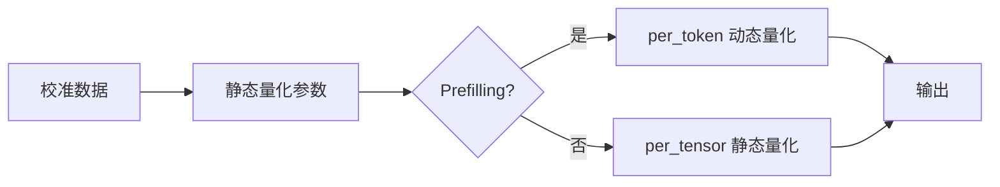

# PDMIX 阶段间混合量化算法词条

> **词条类别**：量化算法
> **英文名称**：PDMIX
> **英文缩写**：PDMIX
> **应用领域**：大语言模型量化压缩、推理加速
> **msModelSlim 实现**：`msmodelslim/core/quantizer/impl/minmax.py`、`msmodelslim/ir/w8a8_pdmix.py`

---

## 1. 概述

PDMIX（Prefill-Decode Mix）是一种激活值阶段间混合量化算法。它在 Prefilling 阶段使用 W8A8 动态量化（`per_token`）减少输入上下文的量化信息损失，在 Decoding 阶段使用 W8A8 静态量化（`per_tensor`）获取输出时的量化性能收益。其核心特征是：阶段自适应切换量化粒度、回退少量层即可控制精度损失、仅需存储一份量化权重，是 [线性量化](../linear_quant/term_linear_quant.md) 中激活值量化的一种方法。

---

## 2. 词条介绍

传统 W8A8 静态量化采用静态的激活量化参数，在长上下文或分布漂移场景中易产生较大量化误差，需要回退大量层才能控制精度损失，却因此损失性能收益。PDMIX 观察到，Prefilling 阶段对精度敏感、Decoding 阶段对性能敏感，因此按阶段分别采用动态与静态量化，用少量回退即可平衡精度与性能。

---

## 3. 原理

### 1. 核心思想

PDMIX 的核心思想是“阶段自适应激活量化”：权重量化保持不变，激活量化在 Prefilling 阶段采用 `per_token` 动态量化（token 级颗粒度在线计算量化参数），在 Decoding 阶段采用 `per_tensor` 静态量化（离线计算量化参数、降低推理时延）。由于阶段间权重量化方式保持一致，只需存储一份量化权重。

### 2. 数学描述

设激活值为 $X$，Prefilling 阶段采用 per-token 动态量化：

$$
Q_{\text{prefill}} = \operatorname{clamp}\left(\operatorname{round}\left(\frac{X}{S_{\text{token}}}\right) + Z_{\text{token}}, \; Q_{\min}, Q_{\max}\right)
$$

Decoding 阶段采用 per-tensor 静态量化：

$$
Q_{\text{decode}} = \operatorname{clamp}\left(\operatorname{round}\left(\frac{X}{S_{\text{tensor}}}\right) + Z_{\text{tensor}}, \; Q_{\min}, Q_{\max}\right)
$$

- $X$：激活值
- $S_{\text{token}}$：per-token 动态缩放因子（Prefilling 在线计算）
- $Z_{\text{token}}$：per-token 动态零点
- $S_{\text{tensor}}$：per-tensor 静态缩放因子（离线计算）
- $Z_{\text{tensor}}$：per-tensor 静态零点
- $Q_{\min}$、$Q_{\max}$：量化数值范围（INT8 的 $[-128, 127]$）

整体上，PDMIX 等价于一种“Prefilling 动态、Decoding 静态”的分段量化方案，权重量化与 `per_channel` 结合。

### 3. 关键性质

- **阶段自适应**：Prefilling 用 `per_token`、Decoding 用 `per_tensor`，兼顾精度与性能。
- **单份权重**：阶段间权重量化方式一致，仅需存储一份量化权重。
- **回退代价低**：相比静态量化，回退少量层即可控制精度损失。
- **推理加速**：Decoding 阶段静态量化减少量化参数计算操作，提高吞吐量。

---

## 4. 流程示意

> 以下为本算法在 msModelSlim 中的简化流程概览。



---

## 5. 在 msModelSlim 中的实现

### 1. 实现位置

量化校准在 `msmodelslim/core/quantizer/impl/minmax.py` 的 `ActPDMixMinmax` 中实现，量化模式 IR 在 `msmodelslim/ir/w8a8_pdmix.py` 的 `W8A8PDMixFakeQuantLinear` 中实现，相关常量在 `msmodelslim/ir/const.py` 中定义（`int8_pd_mix_asym`）。

### 2. 处理流程

PDMIX 作为 `linear_quant` 处理器的激活值量化方法使用，通过 `qconfig.act.scope: "pd_mix"` 启用。Prefilling 阶段由 `ActPDMixMinmax` 使用 per-token 动态量化参数，Decoding 阶段切换为 per-tensor 静态量化参数，由 `W8A8PDMixFakeQuantLinear` IR 承载。

### 3. 配置示例

> 以下为最小可用的 YAML 配置片段。各字段的详细含义如下表所示。

```yaml
spec:
  process:
    - type: "linear_quant"
      qconfig:
        act:
          scope: "pd_mix"
          dtype: "int8"
          symmetric: false
          method: "minmax"
        weight:
          scope: "per_channel"
          dtype: "int8"
          symmetric: true
          method: "minmax"
```

**字段说明**：

| 字段名 | 作用 | 说明 |
| --- | --- | --- |
| qconfig.act.scope | 激活量化范围 | 固定为 `"pd_mix"`（prefilling 用 `per_token`，decoding 用 `per_tensor`）。 |
| qconfig.act.dtype | 激活量化数据类型 | 仅支持 `"int8"`。 |
| qconfig.act.symmetric | 激活是否对称量化 | `false`（PDMIX 量化总体为非对称）。 |
| qconfig.act.method | 激活量化方法 | 仅支持 `"minmax"`。 |
| qconfig.weight.scope | 权重量化范围 | 仅支持 `"per_channel"`。 |
| qconfig.weight.dtype | 权重量化数据类型 | 仅支持 `"int8"`。 |
| qconfig.weight.symmetric | 权重是否对称量化 | 仅支持 `true`。 |
| qconfig.weight.method | 权重量化方法 | `"minmax"`。 |

---

## 6. 适用场景与限制

### 1. 适用场景

- 长上下文或分布漂移场景下，静态量化精度损失大、需要回退大量层的场景。
- 生成式模型推理加速场景，希望在控制精度损失的同时获取静态量化的性能收益。

### 2. 使用限制

- 当前仅支持 MindIE 推理部署。
- 仅支持 W8A8 PDMIX 一种量化模式（激活 INT8 动态/静态混合，权重 per_channel INT8）。
- 除了 `qconfig.weight.method` 可调整外，其他配置组合均未有对应实现。

---

## 7. 关联流程

- 《[一键量化 (V1)](../../../user_guide/usage_quick_quantization.md)》：可集成 PDMIX 作为激活值混合量化步骤。
- 《[量化精度调优指南](../../../user_guide/process_quantization_precision_tuning.md)》：静态量化精度损失大时可尝试替换为 PDMIX。

---

## 8. 关联词条

- [线性量化](../linear_quant/term_linear_quant.md)：上位概念，PDMIX 是线性量化中激活值量化的一种方法。
- [MinMax](../minmax/term_minmax.md)：应用对象，PDMIX 的量化参数基于 MinMax 算法计算。
- [KVCache Quant](../kvcache_quant/term_kvcache_quant.md)：配套术语，同属生成式模型推理优化方案。

---

## 9. 参考资料

1. 《PDMIX 使用指南》([./usage_pdmix.md](./usage_pdmix.md))
