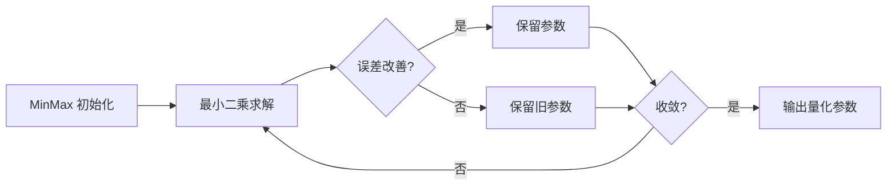

# SSZ 权重量化算法词条

> **词条类别**：量化算法
> **英文名称**：SSZ
> **英文缩写**：SSZ
> **应用领域**：大语言模型量化压缩、低比特权重量化
> **msModelSlim 实现**：`msmodelslim/core/quantizer/impl/ssz.py`

---

## 1. 概述

SSZ（Smooth Scale Zero）是一种低比特权重量化算法。它通过迭代搜索最优的缩放因子（scale）和偏移量（offset）来最小化量化误差，在权重分布不均匀的场景下提升量化精度。其核心特征是：迭代优化、最小二乘法求解、贪心更新、收敛判断，专为 INT4 等低比特权重量化设计，作为 [线性量化](../linear_quant/term_linear_quant.md) 的权重量化方法使用。

---

## 2. 词条介绍

传统量化方法（如 [MinMax](../minmax/term_minmax.md)）在权重分布不均匀时，量化误差较大，影响模型精度。SSZ 观察到，通过对 scale 和 offset 进行迭代搜索，可以在权重分布不均匀时找到更优的量化参数，从而显著降低量化误差。

---

## 3. 原理

### 1. 核心思想

SSZ 的核心思想是“迭代搜索最优量化参数”：先用 MinMax 观察器初始化 scale 和 offset，然后通过最小二乘法计算当前最优的 scale 和 offset，比较新旧参数的量化误差、只保留能改善误差的参数，重复迭代直到收敛或达到最大迭代次数。

### 2. 数学描述

对称量化时 offset 固定为 0，只优化 scale；非对称量化时同时优化 scale 和 offset。以最小化量化误差为目标：

$$
\text{MSE} = \frac{1}{n} \sum_{i=1}^{n} (w_i - \hat{w}_i)^2
$$

- $\text{MSE}$：量化前后权重的均方误差
- $w_i$：原始权重
- $\hat{w}_i$：量化-反量化后的权重
- $n$：权重元素个数

收敛判断条件：

$$
\frac{|\text{best\_mse} - \text{current\_mse}|}{\text{best\_mse}} < \text{threshold} \quad \text{或} \quad |\text{best\_mse} - \text{current\_mse}| < \text{threshold}
$$

- $\text{best\_mse}$：历史最优均方误差
- $\text{current\_mse}$：当前均方误差
- $\text{threshold}$：收敛阈值（默认 $10^{-10}$）

所有通道都满足收敛条件时提前退出。

### 3. 关键性质

- **迭代优化**：通过多次迭代逐步优化量化参数。
- **最小二乘求解**：使用最小二乘法计算当前最优的 scale 和 offset。
- **贪心更新**：只保留能改善量化误差的参数。
- **收敛判断**：通过相对和绝对误差变化判断收敛。
- **低比特友好**：专为 INT4 等低比特权重量化设计。

---

## 4. 流程示意

> 以下为本算法在 msModelSlim 中的简化流程概览。



---

## 5. 在 msModelSlim 中的实现

### 1. 实现位置

算法在 `msmodelslim/core/quantizer/impl/ssz.py` 中实现，核心函数为 `ssz_calculate_qparam`，作为 `linear_quant` 处理器的权重量化方法（`method: "ssz"`）使用。

### 2. 处理流程

- **初始化阶段**：使用 MinMax 观察器计算权重的统计信息（min/max 值），基于统计信息计算初始的 scale 和 offset。
- **迭代优化阶段**：对称量化时 offset 固定为 0、只优化 scale；非对称量化时同时优化 scale 和 offset。使用最小二乘法计算最优参数，贪心更新只保留改善误差的参数。
- **收敛判断**：所有通道满足相对/绝对误差变化阈值时提前退出。

### 3. 配置示例

> 以下为最小可用的 YAML 配置片段。各字段的详细含义如下表所示。

```yaml
spec:
  process:
    - type: "linear_quant"
      qconfig:
        weight:
          scope: "per_channel"
          dtype: "int8"
          symmetric: true
          method: "ssz"
```

**字段说明**：

| 字段名 | 作用 | 说明 |
| --- | --- | --- |
| scope | 量化范围 | 仅支持 `"per_channel"`。 |
| dtype | 量化数据类型 | `"int8"` 或 `"int4"`。 |
| symmetric | 是否对称量化 | `true` 为对称，`false` 为非对称。 |
| method | 量化方法 | 固定为 `"ssz"`。 |

---

## 6. 适用场景与限制

### 1. 适用场景

- 对精度要求较高、权重分布不均匀的线性层量化场景。
- INT4 等低比特权重量化场景。

### 2. 使用限制

- 目前支持 int8 和 int4 场景的 per_channel 对称量化。
- int4 场景的 per_channel 非对称量化暂不支持（后续支持）。
- per_tensor 和 per_group 量化粒度暂不支持。
- 权重必须是 2D 张量。

---

## 7. 关联流程

- 《[一键量化 (V1)](../../../user_guide/usage_quick_quantization.md)》：可集成 SSZ 作为低比特权重量化步骤。
- 《[量化精度调优指南](../../../user_guide/process_quantization_precision_tuning.md)》：精度不达标时可考虑使用 SSZ 提升精度。

---

## 8. 关联词条

- [线性量化](../linear_quant/term_linear_quant.md)：应用对象，SSZ 作为线性量化的权重量化方法使用。
- [MinMax](../minmax/term_minmax.md)：前置术语，SSZ 使用 MinMax 观察器初始化量化参数。
- [GPTQ](../gptq/term_gptq.md)：同类算法，同为高精度权重量化优化算法。
- [Flex AWQ SSZ](../flex_awq_ssz/term_flex_awq_ssz.md)：配套术语，Flex AWQ SSZ 的权重配置通常使用 SSZ 方法。

---

## 9. 参考资料

1. 《SSZ 使用指南》([./usage_ssz.md](./usage_ssz.md))
