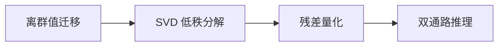

# SVDQuant 低秩残差量化算法词条

> **词条类别**：量化算法
> **英文名称**：SVDQuant
> **英文缩写**：SVDQuant
> **首次提出**：Li et al., NeurIPS 2024
> **应用领域**：扩散模型量化、低比特量化精度优化
> **msModelSlim 实现**：`msmodelslim/processor/svd_residual/`

---

## 1. 概述

SVDQuant 是一种针对扩散模型的后训练量化技术，通过三阶段流水线——离群值迁移、低秩分解、残差量化——将权重和激活中的离群值吸收到低秩分量中，从而缓解量化难度并提升模型性能。在 msModelSlim 中，SVDQuant 体现为 `离群值抑制 → svd_res → linear_quant` 三阶段量化流水线，核心特征是：SVD 低秩分解提取主体结构、残差主通路低比特量化、低秩旁路高精度运行，其中残差量化通过 [线性量化](../linear_quant/term_linear_quant.md) 实现。

---

## 2. 词条介绍

扩散模型的激活中存在显著的离群值，少数通道的极大值会压缩其余通道的量化精度，直接量化会导致精度严重下降。SVDQuant 观察到，将离群值先迁移到权重后，权重中的离群值呈现低秩结构，恰好适合 SVD 低秩分解提取。这种“迁移 → 分解”的配合是 SVDQuant 的核心创新：离群值先被迁移到权重，再被低秩分支吸收，从而同时解决激活和权重的量化难题。

---

## 3. 原理

### 1. 核心思想

SVDQuant 的核心思想是“三阶段协同量化”：先通过离群值抑制（如 Iterative Smooth）将激活离群值迁移到权重，再对迁移后的权重进行 SVD 低秩分解，将主体结构提取为低秩分量（高精度保留），残差部分更适合量化；最后对残差权重进行低比特量化，低秩分支以高精度运行。

### 2. 数学描述

阶段一（离群值迁移）的数学等价变换：

$$
Y = XW + b = (X \cdot \operatorname{diag}(s)^{-1}) \cdot (\operatorname{diag}(s) \cdot W) + b
$$

其中缩放因子 $s$ 由激活和权重的统计信息联合计算：

$$
s = \frac{A_{\text{scale}}^{\alpha}}{W_{\text{scale}}^{1-\alpha}}, \quad s \geq s_{\min}
$$

- $X$：激活矩阵
- $W$：权重矩阵
- $s$：逐通道缩放因子
- $A_{\text{scale}}$：激活值每通道的绝对最大值
- $W_{\text{scale}}$：权重每列的最大值
- $\alpha$：平衡参数，控制迁移强度

阶段二（低秩分解）：对迁移后的权重 $W$ 执行 SVD 分解：

$$
W \approx (U \cdot S) \cdot V^\top, \quad R = W - (U \cdot S) \cdot V^\top
$$

- $U$：左奇异向量，形状 $[\text{out\_dim}, \text{rank}]$
- $S$：奇异值，形状 $[\text{rank}]$
- $V$：右奇异向量，形状 $[\text{in\_dim}, \text{rank}]$
- $R$：残差权重

阶段三（残差量化）：推理时双通路计算：

$$
\text{out} = Q(X \cdot \operatorname{diag}(s)^{-1}) \cdot Q(R) + (X \cdot \operatorname{diag}(s)^{-1} \cdot V) \cdot (U \cdot S)^\top \approx XW + b
$$

- $Q(\cdot)$：量化操作

### 3. 关键性质

- **三阶段协同**：离群值迁移、低秩分解、残差量化三者协作，数学上保持输出近似等价。
- **低秩旁路**：低秩分量以高精度（如 FP16）运行，残差主通路低比特量化。
- **数学等价性**：双通路输出之和等价于使用原始权重 $W$ 的线性变换。
- **data-free 分解**：`svd_res` 为 data-free 算法，计算开销较低。

---

## 4. 流程示意

> 以下为本算法在 msModelSlim 中的简化流程概览。



---

## 5. 在 msModelSlim 中的实现

### 1. 实现位置

SVDQuant 的三阶段流水线由三个 Processor 依次协作完成：`iter_smooth`（离群值迁移）、`svd_res`（低秩残差分解，`msmodelslim/processor/svd_residual/processor.py`）、`linear_quant`（残差量化）。

### 2. 处理流程

1. **离群值迁移**：基于校准数据收集激活统计信息，计算缩放因子，将激活离群值迁移到权重中。
2. **低秩残差分解**（`svd_res`）：将权重转换为 float32 保证数值稳定性，执行 `torch.svd_lowrank` 分解，将权重替换为残差 $R$，低秩分量 $V^\top$ 与 $U \cdot S$ 以参数形式保留，通过 Hook IR 将层包装为 `SVDResidualWrapper`。
3. **残差量化**（`linear_quant`）：对残差权重和激活进行低比特量化。

### 3. 配置示例

> 以下为最小可用的 YAML 配置片段。各字段的详细含义如下表所示。

```yaml
spec:
  process:
    - type: "iter_smooth"
      alpha: 0.25
      include: ["*"]
      exclude: ["*blocks.0.*"]
    - type: "svd_res"
      rank: 32
      include: ["*"]
      exclude: ["*blocks.0.*"]
    - type: "linear_quant"
      qconfig:
        act:
          scope: "per_block"
          dtype: "mxfp4"
          symmetric: True
          method: "minmax"
        weight:
          scope: "per_block"
          dtype: "mxfp4"
          symmetric: True
          method: "minmax"
      include: ["*"]
      exclude: ["*blocks.0.*"]
```

**字段说明**：

| 字段名 | 作用 | 说明 |
| --- | --- | --- |
| iter_smooth.alpha | 离群值迁移强度 | 平衡参数，控制离群值迁移强度。 |
| svd_res.type | 处理器类型标识 | 固定为 `"svd_res"`。 |
| svd_res.rank | 低秩分解的秩 | 大于 0 的整数，控制近似的秩，默认 `32`，受算子实现限制建议不超过 `128`。 |
| svd_res.include | 包含的层 | 字符串列表，支持通配符匹配。 |
| svd_res.exclude | 排除的层 | 字符串列表，支持通配符匹配。 |
| linear_quant | 残差量化配置 | 对残差权重与激活进行低比特量化，如 `per_block` 的 `mxfp4`。 |

### 4. 模型适配接口

模型适配要求目标层为标准 `torch.nn.Linear`，且可通过 `model.named_modules()` 获取模块名。

---

## 6. 适用场景与限制

### 1. 适用场景

- W4A4 等极低比特量化场景，尤其适用于扩散模型。
- 模型激活中存在显著离群值、且离群值在权重中呈现低秩结构的场景。

### 2. 使用限制

- 目标层必须为标准 `torch.nn.Linear`，且可通过 `model.named_modules()` 获取模块名。
- 三个阶段的 `include`/`exclude` 应保持一致，确保同一组 Linear 层依次经历三阶段处理。
- `rank` 受算子实现限制，建议不超过 128。

---

## 7. 关联流程

- 《[一键量化 (V1)](../../../user_guide/usage_quick_quantization.md)》：可集成 SVDQuant 作为低比特量化方案。
- 《[量化精度调优指南](../../../user_guide/process_quantization_precision_tuning.md)》：精度不达标时可调整 `rank` 与 `alpha`。

---

## 8. 关联词条

- [Iterative Smooth](../iterative_smooth/term_iterative_smooth.md)：前置术语，SVDQuant 使用其完成离群值迁移。
- [线性量化](../linear_quant/term_linear_quant.md)：配套术语，SVDQuant 使用其完成残差量化。
- [SmoothQuant](../smooth_quant/term_smooth_quant.md)：同类算法，同属离群值抑制算法族。
- [浮点稀疏](../float_sparse/term_float_sparse.md)：对比算法，同为面向高压缩率的模型压缩方案。

---

## 9. 参考资料

1. Li M et al. SVDQuant: Absorbing Outliers by Low-Rank Components for 4-Bit Diffusion Models. NeurIPS 2024. https://arxiv.org/abs/2411.05007
2. 《SVDQuant 使用指南》([./usage_svdquant.md](./usage_svdquant.md))
