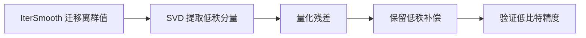

# SVDQuant 参数配置流程指南

## 1. 适用范围

SVDQuant 低秩残差量化方案。SVDQuant 通过 `iter_smooth → svd_res → linear_quant` 三阶段流水线，对扩散模型等场景进行低比特量化。

本指南面向首次配置 SVDQuant 的用户，重点不是展开完整执行命令，而是说明推荐配置为什么适合作为起点、哪些参数真正需要调，以及出现精度或资源问题时应优先改哪一项。这类算法通常直接影响量化尺度、舍入方式、量化粒度或低比特表示，因此参数选择会同时影响精度、压缩率以及部署兼容性。第一次使用时建议先固定目标位宽、校准集和评测方式，只采用本指南给出的推荐起点；确认基线稳定后，再围绕真正影响算法行为的参数逐项调整。

如果目标模型已经有完整且已验证的量化配方，应优先复用该配方；若当前算法与目标模型结构、数值格式或部署后端不兼容，不应通过增大搜索强度或扩大作用范围来绕过支持约束。

## 2. 输入和交付件

| 类型 | 名称 | 来源或保存位置 | 格式或约束 | 验收方式 |
| --- | --- | --- | --- | --- |
| 输入 | 目标模型与量化目标 | 待量化模型及部署/评测方案 | 明确目标数值格式或位宽、作用模块、精度/性能目标以及部署约束 | 能说明为什么选择本算法以及它在整体量化方案中的位置 |
| 输入 | 配置约束与实践基线 | 本算法配置说明、目标模型已有 `lab_practice` 配方（如有） | 字段名、支持组合、作用范围和模型适配与当前版本一致 | 推荐起点能够追溯到当前配置定义或已验证实践 |
| 输入 | 校准数据（算法需要时） | 任务 `dataset`、校准集或模型实践配方 | 数据应能代表真实输入分布；多阶段算法尽量保持各阶段数据分布一致 | 能被当前量化流程正常读取，并覆盖主要输入形态 |
| 交付件 | SVDQuant 参数配置方案 | 用户量化 YAML 或任务配置 | 参数取值合法、作用范围明确；关键参数说明选择依据 | 可作为后续量化流程的算法配置输入，并可复现本指南中的基线选择 |

## 3. 流程总览

入门时建议先用一组稳定配置建立基线，再围绕影响最大的参数做单变量调整。下面的流程强调“先选参数、再看效果”，不展开量化命令本身。



实际使用时建议把流程理解为“建立基线—观察结果—单变量调整—再次验证”的闭环。流程图中的前几个节点用于固定量化对象、统计信息或初始参数，后几个节点用于应用算法并检查结果；如果效果不理想，应优先回到最近一次修改的参数，而不是同时更换位宽、粒度、作用范围和算法强度。这样可以明确每次变化的因果关系，也便于把有效配置沉淀为后续模型配方。

## 4. 操作步骤

### 步骤 1：确认目标与约束

**操作**：先固定目标模型、最终量化格式/位宽、作用对象和评测基线，再确认当前版本支持的参数组合。目标模型已有 `lab_practice` 配方时，优先把该配方作为实践基线；没有模型专用配方时，再使用本指南给出的通用推荐起点。若算法依赖校准统计或优化数据，还应在调参前固定代表性数据，避免把数据分布变化误判为参数收益。

**输出**：一份明确的配置目标：目标位宽/格式、处理范围、校准条件、评测基线和部署约束。

### 步骤 2：建立推荐基线

**操作**：

下面配置用于建立**第一版可比较基线**。如果目标模型已有 `lab_practice` 配方，优先使用已验证配方，再参考本节理解每个参数为什么这样选。

```yaml
spec:
  process:
    # 阶段一：离群值迁移
    - type: "iter_smooth"
      alpha: 0.25
      include: ["*"]
      exclude: ["*blocks.0.*"]

    # 阶段二：低秩残差分解
    - type: "svd_res"
      rank: 32
      include: ["*"]
      exclude: ["*blocks.0.*"]

    # 阶段三：残差量化（W4A4 MXFP4）
    - type: "linear_quant"
      qconfig:
        act:
          scope: "per_block"
          dtype: "mxfp4"
          symmetric: True
          method: "minmax"
        weight:
          scope: "per_block"
          dtype: "mxfp4"
          symmetric: True
          method: "minmax"
      include: ["*"]
      exclude: ["*blocks.0.*"]
```

上面的推荐值用于建立第一版可复现基线，其中最值得关注的配置包括 `iter_smooth.alpha`, `svd_res.type`, `svd_res.rank`, `svd_res.include`。推荐值并不表示所有模型都只能使用该组合，而是优先选择仓库默认值、已验证实践或较稳健的中间取值，以降低第一次使用时同时遇到精度和兼容性问题的概率。如果目标模型已经有 `lab_practice` 配方，应优先复用该配方；只有在基线精度、显存或吞吐不满足目标时，再按照下一节的参数说明逐项调整。

**输出**：一份可复现的推荐基线配置，后续所有参数调整均以此为比较对象。

### 步骤 3：选择并调整参数

**操作**：

参数选择建议按三个层次理解：首先确认 `dtype/scope/method` 等**算法支持约束**，这类字段不是任意可调；其次确定 `include/exclude`、子图类型等**作用范围**；最后再调整会改变误差与开销的数值参数。下面的推荐值区分了代码默认值、仓库 `lab_practice` 中已验证的实践值和适合首次使用的推荐起点。如果目标模型已有实践配置，优先沿用实践配置，再根据本节说明做单变量调整。

| 配置项 | 含义（原理） | 推荐配置 | 选择与调整建议 |
| --- | --- | --- | --- |
| `iter_smooth.alpha` | 第一阶段先迁移离群值，降低后续低秩残差和低比特主干的数值压力。当前文档扩散模型示例使用 `0.25`，比通用 IterSmooth 默认 0.9 更保守，避免过度把激活困难迁到权重。 | 先沿用模型示例 `0.25`；其他模型优先使用其已验证配方。 | 残差仍被少数离群主导时再调平滑；如果低秩分支需要承担过多信息或权重侧误差上升，减弱平滑。不要同时改 alpha 和 rank，否则难判断收益来源。 |
| `svd_res.type` | 第二阶段处理器标识，固定 `svd_res`。 | 固定。 | 不作为调参。 |
| `svd_res.rank` | 低秩残差分支的秩，默认 `32`。rank 越大，低秩分支可保留更多难量化结构，但会增加额外参数/计算；rank 太小则更多信息落回低比特残差。 | 从 `32` 开始。 | 当残差量化已固定但任务精度不足，并且分析显示低秩分解仍能解释主要误差时增加；资源约束更重要且 32 有裕量时再降低。建议按 32→更高/更低的离散候选比较，而不是连续细调。 |
| `svd_res.include/exclude` | 决定哪些层生成低秩残差分支。它应与第一阶段平滑和第三阶段 residual quant 的层范围协调，否则某些层只经过流水线的一部分。 | 三阶段尽量使用一致的主范围和例外层；示例都排除首个 block。 | 若某层不适合低秩补偿，应在相关阶段一致地排除。范围不一致会让精度变化难以解释，也可能形成未预期的数据路径。 |
| `linear_quant` | 第三阶段对主干/残差按目标低比特格式量化。示例使用 MXFP4 per-block MinMax；它决定最终位宽和部署格式。 | 先固定目标部署 qconfig，再调 rank。 | 如果精度不足，优先增加 rank/调整层范围来判断是否是低秩容量问题；最后才提高残差位宽。直接先提位宽会掩盖 SVD 分解是否有效。 |

### 参数组合与选择顺序

1. **先锁定部署目标与支持组合**：先确定最终位宽/数值格式，再确认当前量化器实际注册了对应的 `dtype + scope + symmetric + method` 组合；不要为了追求某个参数值而越过支持约束。
2. **再固定作用范围**：使用已有模型配方时，先复用其 `include/exclude` 或子图类型；没有配方时先建立覆盖范围明确的基线，确认算法确实作用到了预期模块。
3. **最后只调一个主要旋钮**：数值搜索步数、平滑强度、分组大小等一次只改一项，并保持同一校准集和评测集。若调整后没有稳定收益，回到上一个基线，而不是继续叠加多个变化。

SVDQuant 推荐严格按 **范围一致性 → 固定最终 residual qconfig → 调 rank → 最后微调平滑 alpha** 的顺序。三阶段同时变化会让误差来源无法归因。

**输出**：一份完成单变量调整的算法参数方案，关键字段均有明确的选择依据和调整方向。

### 步骤 4：根据结果收敛参数方案

**操作**：

调参时建议先记录一份完整基线，包括使用的数据集、量化范围、关键参数和端到端指标。每轮只改变一个变量，并把变化结果与基线直接比较；如果某项调整带来收益，再继续小步搜索其邻近取值。对于只有少数层或模块异常的情况，优先采用局部排除、局部回退或混合精度，而不是直接提高全模型精度配置，这通常更容易保留压缩和性能收益。

- 三个阶段的 `include/exclude` 必须一致。若精度不够，先增大 `rank`，再考虑调整平滑强度；避免只改残差量化而破坏三阶段协同。
- **先跑推荐基线，再调单变量。** 不要同时修改位宽、粒度、算法参数和层范围，否则很难判断精度变化来自哪一项。
- **优先回退局部，而不是整体提高精度。** 如果只有少数层敏感，优先通过 `exclude` 或混合策略保留高精度，通常比整体升位宽更划算。
- **最终以模型实践配置和部署能力为准。** 入门推荐用于建立稳定起点；目标模型已有 `lab_practice` 配方时，应优先复用已验证组合。

**输出**：一份可进入后续量化流程的最终参数方案，并保留相对于推荐基线的调整记录。

## 5. 术语

| 术语 | 简述 | 链接 |
| --- | --- | --- |
| SVDQuant 低秩残差量化算法 | 说明该算法的定义、核心原理、关键性质、适用场景与限制。 | 《[SVDQuant 低秩残差量化算法 量化术语百科词条](./term_svdquant.md)》 |

## 6. 接口文档列表

| 接口或能力 | 简述 | 链接 |
| --- | --- | --- |
| svd_res 配置说明 | 字段类型、默认值、合法取值与完整配置约束。 | 《[svd_res 配置说明](../../../api_reference/config/processor/svd_res.md)》 |
| iter_smooth 配置说明 | 三阶段流水线中的其他处理器参数。 | 《[iter_smooth 配置说明](../../../api_reference/config/processor/iter_smooth.md)》 |
| modelslim_v1 配置说明 | 需要继续探索 runner、prior、save、dataset 等任务级高级配置时查阅。 | 《[modelslim_v1 配置说明](../../../api_reference/config/task/modelslim_v1.md)》 |
