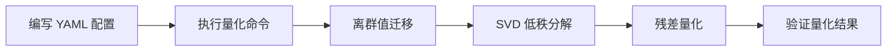

# SVDQuant 使用指南

## 1. 适用范围

本流程适用于在 msModelSlim 中配置和使用 SVDQuant 低秩残差量化方案。SVDQuant 通过 `iter_smooth → svd_res → linear_quant` 三阶段流水线，对扩散模型等场景进行低比特量化。

适用角色：算法工程师、模型部署工程师

适用场景：

- W4A4 等极低比特量化场景，尤其适用于扩散模型。
- 模型激活中存在显著离群值、且离群值在权重中呈现低秩结构的场景。

不适用场景：

- 非标准 `torch.nn.Linear` 的目标层。

## 2. 流程关系与前置条件

**上级流程**：模型适配与验证通过后，确定量化方案阶段。

**前置条件**：

- 已安装兼容版本的 msModelSlim 工具（详见《[msModelSlim 工具安装指南](../../../install_guide/install_guide.md)》）。
- 已确认目标模型的线性层为标准 `torch.nn.Linear`。
- 已准备好校准数据集，用于离群值迁移阶段收集激活统计信息。

**后续操作**：量化流程执行 → 精度验证 → 部署上线或进入调优。

## 3. 输入和交付件

| 类型 | 名称 | 来源或保存位置 | 格式或约束 | 验收方式 |
| --- | --- | --- | --- | --- |
| 输入 | 浮点模型权重目录 | 模型下载或本地路径 | HuggingFace 格式，含 `config.json` 及 `*.safetensors` | 可被目标 Transformers 版本加载 |
| 输入 | 校准数据集 | 工具默认或用户指定 | JSONL 格式，每条含文本 prompt | 可被工具加载并完成前向推理 |
| 输入 | 量化 YAML 配置文件 | 用户编写 | 符合 msModelSlim YAML 规范，含 `iter_smooth`、`svd_res`、`linear_quant` 配置 | 可通过工具 `--config_path` 参数加载 |
| 交付件 | 量化权重目录 | `--save_path` 指定路径 | 含 `quant_model_description.json` 及 `*.safetensors`，已应用 SVD 残差量化 | 推理冒烟通过 |

## 4. 流程总览



## 5. 操作步骤

### 步骤 1：编写 YAML 配置文件

**目标**：编写包含 SVDQuant 三阶段流水线配置的 YAML 文件。

**操作**：

1. 在 `spec.process` 下配置 `iter_smooth` 处理器（离群值迁移），配置 `alpha` 与 `include`/`exclude`。
2. 配置 `svd_res` 处理器（低秩残差分解），配置 `rank` 与 `include`/`exclude`。
3. 配置 `linear_quant` 处理器（残差量化），配置 `qconfig`。
4. 确保三个阶段的 `include`/`exclude` 保持一致。

YAML 配置示例（以 Wan2.2 T2V W4A4 量化为例）：

```yaml
spec:
  process:
    # 阶段一：离群值迁移
    - type: "iter_smooth"
      alpha: 0.25
      include: ["*"]
      exclude: ["*blocks.0.*"]

    # 阶段二：低秩残差分解
    - type: "svd_res"
      rank: 32
      include: ["*"]
      exclude: ["*blocks.0.*"]

    # 阶段三：残差量化（W4A4 MXFP4）
    - type: "linear_quant"
      qconfig:
        act:
          scope: "per_block"
          dtype: "mxfp4"
          symmetric: True
          method: "minmax"
        weight:
          scope: "per_block"
          dtype: "mxfp4"
          symmetric: True
          method: "minmax"
      include: ["*"]
      exclude: ["*blocks.0.*"]
```

YAML 配置字段详解如下：

| 字段名 | 作用 | 说明 |
| --- | --- | --- |
| iter_smooth.alpha | 离群值迁移强度 | 平衡参数，控制离群值迁移强度。 |
| svd_res.type | 处理器类型标识 | 固定为 `"svd_res"`。 |
| svd_res.rank | 低秩分解的秩 | 大于 0 的整数，控制近似的秩，默认 `32`，受算子实现限制建议不超过 `128`。 |
| svd_res.include | 包含的层 | 字符串列表，支持通配符匹配。 |
| svd_res.exclude | 排除的层 | 字符串列表，支持通配符匹配。 |
| linear_quant | 残差量化配置 | 对残差权重与激活进行低比特量化，如 `per_block` 的 `mxfp4`。 |

**输出**：YAML 配置文件 `${CONFIG_PATH}`。

### 步骤 2：执行量化命令

**目标**：使用上一步编写的 YAML 配置文件启动量化流程。

**操作**：

```bash
msmodelslim quant \
  --model_path ${MODEL_PATH} \
  --save_path ${SAVE_PATH} \
  --device npu \
  --model_type ${MODEL_TYPE} \
  --config_path ${CONFIG_PATH} \
  --trust_remote_code True
```

参数说明：

| 参数 | 必选 | 说明 |
| --- | --- | --- |
| `model_path` | 是 | 浮点模型权重路径 |
| `save_path` | 是 | 量化权重保存路径 |
| `device` | 否 | 量化设备，默认 `npu` |
| `model_type` | 是 | 模型名称，与支持矩阵一致 |
| `config_path` | 是 | 步骤 1 编写的 YAML 配置路径 |
| `trust_remote_code` | 否 | 是否信任远程代码，默认 `False` |

执行流程说明：

1. 工具加载 YAML 配置，解析三阶段流水线。
2. `iter_smooth` 收集激活统计并将离群值迁移到权重。
3. `svd_res` 对权重执行 SVD 低秩分解，将权重替换为残差并保留低秩分量。
4. `linear_quant` 对残差权重进行低比特量化，随后保存量化权重。

**输出**：量化权重目录 `${SAVE_PATH}`，包含量化描述文件与权重分片。

### 步骤 3：验证量化结果

**目标**：确认量化权重文件完整且可加载。

**操作**：

1. 检查输出目录是否包含 `quant_model_description.json` 文件。
2. 检查目标 `Linear` 层是否多出了 `svd_lowrank_l1`/`svd_lowrank_l2` 参数。
3. 使用推理框架加载量化权重进行冒烟测试。

**输出**：量化权重验证通过。

## 6. 验收条件

- 量化权重目录包含 `quant_model_description.json` 及所有必需的 `*.safetensors` 分片文件。
- 日志无层匹配告警。
- 量化后模型推理精度符合业务要求。

## 7. 异常处置

- **rank 选择不当**：较大的 `rank` 拟合更好但开销更大，较小的 `rank` 压缩更强但残差保留更多未捕获信息；可按 8、16、32、64 等经验值选取。
- **alpha 与 rank 不协调**：较大的 `alpha` 使更多离群值进入权重，可能需要较大的 `rank` 来充分吸收低秩成分。
- **确认被分解的层**：查看日志中未匹配模式的告警，或检查目标 `Linear` 层是否多出 `svd_lowrank_l1`/`svd_lowrank_l2` 参数。

## 8. 术语

| 术语 | 简述 | 链接 |
| --- | --- | --- |
| SVDQuant | 离群值迁移 + SVD 低秩分解 + 残差量化的方案 | [SVDQuant 词条](./term_svdquant.md) |
| 低秩分解 | 将权重分解为低秩分量与残差的 SVD 操作 | [SVDQuant 词条](./term_svdquant.md) |
| rank | 低秩分解的秩，控制近似精度 | [SVDQuant 词条](./term_svdquant.md) |

## 9. 接口文档列表

| 接口或能力 | 简述 | 链接 |
| --- | --- | --- |
| `svd_res` 处理器 | 用于执行低秩残差分解的 Processor 配置 | [SVDQuant 词条](./term_svdquant.md) |
| `iter_smooth` 处理器 | 离群值迁移处理器 | [Iterative Smooth 词条](../iterative_smooth/term_iterative_smooth.md) |
| `linear_quant` 处理器 | 残差量化处理器 | [线性量化词条](../linear_quant/term_linear_quant.md) |
