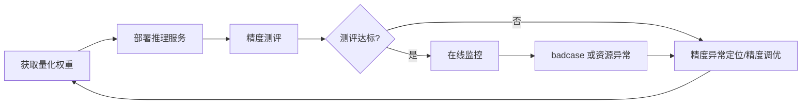

<!-- waiver: CE-05 原因：按团队链接规范，引用文档标题时书名号置于链接外（《[XX](…)》），链接锚文本内不使用书名号 -->
# 主流模型量化部署流程指南

## 1. 适用范围

本流程面向需要对主流模型进行**推理加速**的用户，将**量化 → 部署 → 精度测评 → 在线监控**串成完整业务流：获取量化权重后，在昇腾推理引擎上部署上线，完成精度测评并建立在线监控，取得推理加速收益。

适用于以下场景：

- 目标模型已收录于《[大模型支持矩阵](../knowledge_base/model/README.md)》；
- 目标模型被所选推理框架支持：vLLM-Ascend 支持范围见《[vLLM-Ascend 支持模型列表](https://docs.vllm.ai/projects/ascend/zh-cn/latest/user_guide/support_matrix/supported_models.html)》，SGLang 支持范围见《[SGLang 支持模型列表](https://docs.sglang.io/docs/supported-models)》；
- 目标推理框架为 vLLM、SGLang 或 MindIE-Motor，目标硬件为昇腾 NPU；

以下情况**不适用**本流程：

- 模型未收录支持矩阵或未验证：请先参考《[新模型权重量化流程](./process_new_model_quantization_tuning.md)》，完成模型适配后，再执行本指南；

## 2. 流程关系与前置条件

**上级流程**：无。本流程是量化、部署、测评、在线监控等功能的直接入口，将各功能串联为完整业务流。

**前置条件**：

- 已准备目标推理框架环境（vLLM / SGLang / MindIE-Motor），NPU 卡可用（`npu-smi info` 状态正常）；

**后续操作**：测评发现精度异常时，进入《[量化推理精度异常定位流程指南](process_quantization_accuracy_anomaly_locating.md)》定位异常位点；精度不达标时，进入《[量化精度调优指南](process_quantization_precision_tuning.md)》调优后重新量化并再次部署。

## 3. 输入和交付件

| 类型 | 名称 | 来源或保存位置 | 格式或约束 | 验收方式 |
| --- | --- | --- | --- | --- |
| 输入 | 量化权重目录 | 《[一键量化使用指南](usage_one_click_quantization.md)》产物 或 Eco-Tech 发布权重 | 含模型配置、权重分片及类别所需附属文件（如 tokenizer、config 等） | 文件齐全；若官方提供校验值或版本号，与本地一致 |
| 输入 | 测评数据集 | AISBench 数据集或业务评测集 | 与浮点基线测评时一致的数据集与采样配置 | 浮点模型可复现基线精度 |
| 交付件 | 在线推理服务 | 部署环境 | 服务地址（host:port）与模型名对外可用，可响应推理请求 | 健康检查与推理请求返回正常 |
| 交付件 | 测评报告 | 测评产物保存目录 | 含精度指标（对比浮点基线） | 精度达标阈值达成，报告可归档 |

## 4. 流程总览

本流程端到端分为四个阶段：获取量化权重、部署推理服务、精度测评、在线监控。

## 5. 操作步骤

### 步骤1：获取并校验量化权重

**目标**：获得完整、可信、与推理引擎兼容的量化权重目录。

**操作**：

1. **获取权重**，二选一：
   - **自行量化**：按《[一键量化使用指南](usage_one_click_quantization.md)》量化浮点模型（直接使用其 `${SAVE_PATH}`）；
   - **获取已发布权重**：在 [Eco-Tech 组织](https://www.modelscope.cn/organization/Eco-Tech) 上获取官方发布的量化权重。
2. **校验权重**：确认文件齐全（含所选导出格式约定的描述文件与全部权重分片，如 AscendV1 的 `quant_model_description.json`、compressed-tensors 的 `config.json`（含 `quantization_config` 字段））；若官方提供校验值或版本号，与本地一致。关键文件缺失时不得部署。
3. **确认版本兼容**：核实量化权重（含所选导出格式的元数据记录的格式版本）与目标推理引擎版本兼容，格式说明见《[量化格式支持矩阵](../knowledge_base/quantization_format/README.md)》。

**输出**：通过校验的量化权重目录。

**审计记录**：权重目录路径、权重来源与发布版本号。

### 步骤2：部署推理服务

**目标**：将量化权重以服务化方式在昇腾 NPU 上启动，对外提供推理接口。

**操作**：

1. **准备运行环境**：进入目标推理框架的运行环境（如官方镜像容器），确认 NPU 可见。量化阶段与推理阶段对 transformers 的版本要求可能不同，部署前需将推理环境的 transformers 调整为推理引擎要求的版本（可能升级或降级）。
2. **拉起推理框架服务**：使用目标推理框架拉起推理服务，加载量化权重并对外提供推理接口。各框架的部署方式参见官方文档：
   - 《[vLLM-Ascend 文档](https://docs.vllm.ai/projects/vllm-ascend-cn/zh-cn/latest/quick_start.html)》
   - 《[SGLang 文档](https://docs.sglang.io/docs/get-started/quickstart)》
   - 《[MindIE-Motor 官方文档](https://mindie-motor.readthedocs.io/zh-cn/latest/user_guide/quick_start/#镜像准备)》
3. **健康检查**：确认服务日志显示部署成功。
4. **预热请求验证**：发送一条预热请求验证服务可响应。首次请求可能较慢或返回乱码，属正常现象，需预热后丢弃结果。

**输出**：推理服务已启动并可响应推理请求，服务地址 `http://<host>:<port>` 与模型名。

**通过条件**：服务日志显示部署成功，预热请求返回正常 HTTP 响应。

### 步骤3：精度测评

**目标**：量化模型上线前完成精度测评，确认满足业务指标。

**操作**：

1. **安装 AISBench 并准备数据集**：安装与整体使用参见《[AISBench 文档](https://github.com/AISBench/benchmark/blob/master/docs/source_zh_cn/get_started/install.md)》，各数据集任务的准备方式参见《[AISBench 数据集准备指南](https://github.com/AISBench/benchmark/blob/master/docs/source_zh_cn/get_started/datasets.md)》。
2. **发起精度测评任务**：使用 AISBench 对部署的服务发起精度测评，对应的配置与说明详见《[AISBench 快速入门文档](https://github.com/AISBench/benchmark/blob/master/docs/source_zh_cn/get_started/quick_start.md)》。
3. **对比浮点基线**：同一数据集、同一采样配置下，量化模型测评结果与浮点模型基线对比：

   - 精度差距在业务阈值内（如任务相关准确率降幅 ≤ 1~2%，以业务约定为准）→ 通过；
   - 精度差距超出阈值，或出现 badcase 增多、输出异常 → 进入《[量化推理精度异常定位流程指南](process_quantization_accuracy_anomaly_locating.md)》与《[量化精度调优指南](process_quantization_precision_tuning.md)》。
4. **归档报告**：保存测评配置、结果与结论，形成测评报告。

**输出**：测评报告（含精度对比结论）。

**通过条件**：精度满足业务目标；未建立浮点基线时不得宣称精度收益。

**审计记录**：测评数据集与采样配置、服务启动参数、测评报告版本号与结果文件路径。

### 步骤4：在线监控

**目标**：服务上线后持续观测服务性能与资源使用情况，及时发现异常。

**操作**：

1. **在线监控与性能采集**：使用《[msServiceProfiler](https://gitcode.com/Ascend/msserviceprofiler)》（MindStudio Service Profiler，昇腾 AI 服务化调优工具）对服务进行在线监测与性能分析，主要能力包括：
   - **在线监测**：结合 Prometheus 对 vLLM-Ascend 服务做在线监控（如吞吐、时延等服务指标）；
   - **性能采集**：针对 vLLM、SGLang 等框架的无侵入式服务化性能采集；
   - **数据监测**：服务请求链路 Trace 数据监测，对接 OpenTelemetry/Jaeger 等 OTLP 生态；
   - **性能分析**：性能数据比对、多维度解析与拆解分析，支持服务化自动寻优。

**输出**：在线监控与性能采集记录。

**通过条件**：在线监控与性能采集可正常执行。

**审计记录**：监控配置快照、在线监控与性能采集记录存档。

## 6. 验收条件

- 推理服务启动成功且健康检查通过，对外接口可响应推理请求；
- 精度测评相对浮点基线达到业务阈值，无未解决的 badcase 或输出异常；
- 测评报告可归档、可追溯。

## 7. 异常处置

- **端口被占用**：更换服务端口；
- **显存不足（OOM）**：释放 NPU 卡或调整并行度、检查卡空闲情况；
- **服务无法启动**：根据服务日志定位原因；仍无法解决时联系对应推理框架技术支持，附服务日志；
- **精度不达标**：按步骤3对比浮点基线确认问题真实存在后，进入《[量化推理精度异常定位流程指南](process_quantization_accuracy_anomaly_locating.md)》定位异常位点，按《[量化精度调优指南](process_quantization_precision_tuning.md)》调优后重新量化，再回到步骤1重新部署测评。

## 8. 术语

| 术语 | 简述 | 链接 |
| --- | --- | --- |
| 量化（PTQ） | 训练后量化（Post-Training Quantization）：模型训练完成后直接对权重和激活进行量化，无需重训练| 《[ptq知识](../knowledge_base/ptq)》 |
