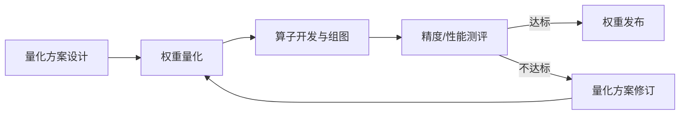

# 新模型量化调优流程

## 1. 适用范围

本指南面向需要把**新模型**（支持矩阵未收录，或目标量化模式未验证）从量化方案设计推进到可发布量化权重的开发者与算法工程师。主路径为**量化方案设计 → 权重量化 → 算子与组图 → 精度/性能测评 → 权重发布**；测评不达标时先进入**量化方案修订**，再回到权重量化继续闭环，直至达标发布或退出。

**适用场景**：

- 新模型或目标量化模式尚未验证，需从量化方案设计一路做到测评与发布。
- 已完成一轮或多轮量化，但精度 / 性能未达标，需修订量化方案并继续闭环。

> [!NOTE]
>
> - 支持矩阵已标记「一键量化」且目标 `quant_type` 已验证：请直接按《[一键量化完整指南](usage_quick_quantization.md)》执行。
> - 调优链路已打通，只查阅调优手段与算法建议：请阅读《[量化精度调优指南](process_quantization_precision_tuning.md)》。
> - 希望全自动搜索配置：可参考《[自动调优使用指南](usage_auto_precision_tuning.md)》。

## 2. 流程关系与前置条件

**前置条件**：

- 已明确精度 / 性能目标（相对浮点的可接受掉点、业务阈值，或性能约束）。
- 已准备浮点模型，或具备按《[权重量化使用指南](usage_weight_quantization.md)》下载与适配的条件。
- 已确定目标推理引擎与导出格式；浮点与量化测评须使用相同测评集、指标与配置（引擎版本、并行与采样等保持一致）。
- 若方案依赖新算子或组图能力，已具备对应引擎 / CANN 侧开发与合入条件。

**后续操作**：

- 达标并完成权重发布后：进入正式部署与业务验收；经验可沉淀为实践配置并更新支持矩阵。
- 在可接受的回退范围与压缩 / 性能收益约束下仍无法兼顾目标时：提高位宽、放宽目标或暂缓该方案。单纯加大回退虽能逼近浮点精度，但可能失去量化收益，不作为默认出路。

## 3. 输入和交付件

本流程开始前须具备浮点权重；结束后须交付可复现的最终量化配置与最终量化权重。精度 / 性能目标、目标引擎与导出格式等见第 2 章前置条件，不在此表重复。测评结论随闭环一并交付；权重可仅本地使用，不强制发布。

| 类型 | 名称 | 来源或保存位置 | 格式或约束 | 验收方式 |
| --- | --- | --- | --- | --- |
| 输入 | 浮点模型目录 | 用户本地路径；一般自 ModelScope / Hugging Face 获取 | 含配置、权重分片及类别所需附属文件 | 路径有效，文件齐全，可被目标 `model_type` 加载 |
| 交付件 | 最终量化配置 | 用户保存的收敛配置路径 | 符合对应配置协议 | 可被 `msmodelslim quant --config_path` 加载并复现交付权重 |
| 交付件 | 最终量化权重目录 | 用户指定的输出目录 | 符合所选导出格式 | 文件齐全；符合所选导出格式约定 |
| 交付件 | 精度 / 性能对比结论 | 测评记录 | 含浮点基线、最终量化结果、是否达标 | 同口径可核对 |

## 4. 流程总览

主路径按「量化方案设计 → 权重量化 → 算子开发与组图 → 精度/性能测评 → 权重发布」顺序推进。精度/性能测评后：达标则进入权重发布；不达标则进入量化方案修订，再回到权重量化继续闭环。各阶段顺序如下：

## 5. 操作步骤

### 步骤 1：量化方案设计

**目标**：固定精度 / 性能目标与测评口径，建立浮点基线，并给出**首次**可执行的初步量化方案。

**操作**：

1. **确定目标与浮点基线**：
   - 记录目标阈值、测评集、指标，以及目标推理引擎版本与关键配置；
   - 在目标引擎上完成浮点测评，确认可复现预期基线；尚无基线时先补测。
2. **确定首次推荐量化方案**：

   | 模型类别 | 配置协议 | 量化模式 | 初版量化范围 |
   | --- | --- | --- | --- |
   | 大语言模型 | `modelslim_v1` | `w8a8` 动态量化 | 线性层全局量化（可按需 `exclude` 少量敏感层）；MoE 初版也可仅量化共享专家 |
   | 多模态理解 | `multimodal_vlm_modelslim_v1` | `w8a8` 动态量化 | 仅量化大语言部分；视觉编码器、投影/merger 等先不量化 |
   | 多模态生成 | `multimodal_sd_modelslim_v1` | `w8a8` 动态量化 | 量化 DiT 主干 |

   - **新接入模型**：初版优先打通链路、保障精度。首版仅用线性量化（`linear_quant`），先不上离群值抑制；量化范围按上表选择。后续若要追求更低比特，再接入离群值抑制等算法。
   - **已接入但目标量化模式未验证**：可直接复用已有适配器。建议先按上表用 `w8a8` 动态 + `linear_quant` 确认链路可用，再按目标模式增量调整方案。
3. 分析可达路径：权重量化是否可行、目标引擎算子是否覆盖、组图是否需要新增或改造；形成权重量化、算子、组图三方面的方案结论，并记录算子 / 组图依赖。

**输出**：精度 / 性能目标与浮点基线记录；首次量化方案说明（配置协议、量化模式、量化范围、算法选型）；算子 / 组图依赖清单。

**通过条件**：目标可判定；浮点基线可信；测评口径已固定；方案结论可落地；关键依赖已识别。

### 步骤 2：权重量化

**目标**：按本轮方案产出量化权重，完成模式、算法、模型与格式的落地。

**操作**：

1. 确认本轮量化模式、算法、目标模型适配状态与导出格式。
2. 按《[权重量化使用指南](usage_weight_quantization.md)》完成适配、配置与量化，得到本轮量化权重产物。

**输出**：本轮量化权重目录 `${SAVE_PATH}`。

**通过条件**：产物符合所选导出格式约定。

### 步骤 3：量化算子开发与组图

**目标**：补齐目标引擎上部署本轮量化方案所需的算子与图结构能力。若现有算子与组图已覆盖，可跳过本步。

**操作**：

1. 对照方案中的算子依赖，确定单算子开发与融合算子开发需求。
2. 完成必要的算子分解 / 融合 / 映射，使量化图可在目标引擎执行。算子与部署实现通常落在目标推理引擎侧，可参考：
   - [vLLM Ascend](https://github.com/vllm-project/vllm-ascend)（[量化适配指南](https://docs.vllm.ai/projects/ascend/en/latest/developer_guide/Design_Documents/quantization.html)）
   - [CANN 算子库介绍](https://www.hiascend.com/document/detail/zh/CANNCommunityEdition/latest/API/aolapi/operatorlist_00001.html)
3. 完成结构组图，确认与导出格式、引擎图优化路径一致。
4. 确认可按本轮量化权重正常拉起服务化推理；记录所用推理引擎版本号。

**输出**：服务化拉起结论与所用版本记录；或「无需新增、可跳过」的确认记录。

**通过条件**：目标引擎可按本轮量化权重拉起服务化推理。

### 步骤 4：精度与性能测评

**目标**：在数据集支撑下做同口径测评，决定收口发布、进入量化方案修订，或退出闭环。

**操作**：

1. 在目标推理引擎上测评本轮量化权重；测评集、指标与引擎配置与步骤 1 中的浮点基线保持一致。先比精度，有性能目标时一并记录。常用测评工具可参考 [AISBench](https://github.com/AISBench/benchmark)。
2. 将结果与目标阈值对比：
   - **达标**：固定本轮量化配置、权重目录与测评记录，进入步骤 6。
   - **未达标且仍可迭代**：把差距作为反馈，进入步骤 5 修订量化方案。
3. **约束内仍无明显改善**：提高位宽、放宽目标或暂缓该方案，退出本调优闭环。

**输出**：本轮测评记录，以及「收口发布 / 继续修订方案 / 退出闭环」的决策。

**通过条件**：每轮测评与浮点基线同口径并给出明确决策；流程进入发布、修订或退出。

**审计记录**：各轮方案摘要、量化配置、量化命令、推理引擎版本、测评分数、最终配置与权重目录。

### 步骤 5：量化方案修订

**目标**：在测评不达标回流时，基于差距修订量化方案，形成下一轮可执行配置。

**操作**：

1. 按《[量化精度调优指南](process_quantization_precision_tuning.md)》完成方案与配置修订。
2. 优先只改一类手段，避免多变量同时变。
3. 若新手段要求适配器额外接口，先按对应接入指南补齐并 `bash install.sh`。
4. 记录本轮修订结论，以及算子 / 组图依赖是否有新增或变化。

**输出**：修订后的量化方案说明与待执行量化配置；若有适配或算子 / 组图变更，确认依赖已识别。

**通过条件**：修订方案可执行；关键依赖已识别。完成后回到步骤 2 重新权重量化。

### 步骤 6：权重发布

**目标**：将达标的量化权重按业务需要发布到开源社区或内部仓库，形成可对外引用的链接。

**操作**：

1. 确认最终量化配置、量化权重与测评结论已固定，版本可追溯。
2. 按业务需要选择发布渠道，例如 ModelScope、Hugging Face 或团队内部制品库；权重发布示例可见 [Eco-Tech](https://www.modelscope.cn/organization/Eco-Tech)。
3. 记录实际发布页链接与版本说明，便于后续引用与复现。

**输出**：发布链接与版本说明；若仅本地交付，记录最终权重目录即可。

**通过条件**：若已发布，链接可打开且权重可下载，并与本流程最终交付权重一致；若未发布，本地交付件齐全可复现即可。

## 6. 全局验收条件

- 最终量化配置与最终量化权重齐全，可复现量化。
- 涉及算子 / 组图时，引擎侧能力已合入并可支撑测评。
- 达标结论基于同口径浮点基线对比，并有对应测评记录。
- 若已对外发布，发布链接有效，且与本地量化权重保持一致。

## 7. 全局异常处置

| 现象 | 处理方向 |
| --- | --- |
| 浮点基线异常或无法复现 | 先修引擎 / 依赖 / 测评，再进闭环 |
| 权重量化失败 | 按《[权重量化使用指南](usage_weight_quantization.md)》排查适配、配置与环境 |
| 算子缺失或组图失败 | 回到方案设计或方案修订重评可达路径；补齐算子 / 组图后再测评 |
| 多轮修订方案仍无改善 | 先审视量化方案与改进手段是否选对、是否同口径生效；确认无误后再考虑下一档手段，或放宽目标 / 提高位宽 |
| 约束内仍无法兼顾精度与收益 | 提高位宽、放宽目标或暂缓该方案 |

## 8. 术语

| 术语 | 简述 | 链接 |
| --- | --- | --- |
| 模型适配 | 为特定模型实现并注册适配器，使 CLI 可通过 `--model_type` 命中加载与量化能力 | 《[LLM 大模型接入指南](../knowledge_base/model/integrating_models.md)》 |
| 量化算法 | 离群值抑制、线性量化、敏感层分析等算法说明 | 《[量化算法总览](../knowledge_base/quantization_algorithms/README.md)》 |
| 量化模式 | 如 w8a8、w4a8 等比特组合策略的命名与约定 | 《[量化模式命名规范](../knowledge_base/model/README.md#量化模式命名规范)》 |
| 量化格式 | 量化权重导出格式及其与推理框架的对应关系 | 《[量化格式支持矩阵](../knowledge_base/quantization_format/README.md)》 |

## 9. 安全说明

- `trust_remote_code` 默认保持 `False`；仅可信模型必要时开启。
- 测评日志、校准数据、量化产物与 ModelScope 发布内容按业务权限管控。
