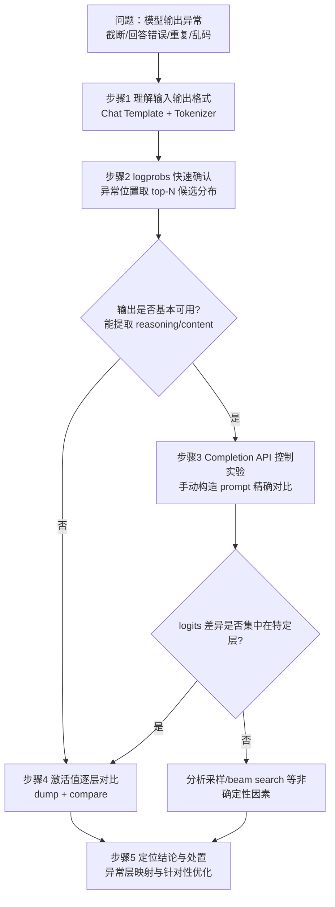

<!-- waiver: CE-05 原因：按团队链接规范，引用文档标题时书名号置于链接外（《[XX](…)》），链接锚文本内不使用书名号 -->
# 量化推理精度异常定位流程指南

## 1. 适用范围

本流程面向量化模型部署测评后推理输出异常的定位场景，适用于：

- 模型输出异常：内容截断、回答错误、重复生成、格式不符、乱码等；
- 量化模型输出与浮点模型无法对齐，需确认偏差来源（量化、推理框架、算子或编译优化）；
- 需要将偏差定位到具体层/算子，作为针对性优化或专项排障的输入。

**问题来源可能包括**：量化（INT8/INT4 精度损失导致 logits 分布偏移）、推理框架（版本差异、参数配置、调度策略）、算子（自定义算子实现、Ascend C 算子精度）、编译优化（图融合、CUDAGraph/ACLGraph 捕获错误路径）。

**定位难点**：精度问题可能是多因素叠加；浮点正常、量化异常不一定是量化的问题（量化可能触发框架/算子走不同执行路径）；同一输入多次输出不一致可能存在非确定性。

以下情况**不适用**本流程：

- 未量化的浮点模型本身存在精度问题，或测评数据/采样配置异常导致的假阳性（应先完成[主流模型量化部署流程指南](process_mainstream_model_deployment.md#步骤3精度测评)步骤3的基线确认）；
- 量化模型整体精度轻微下降但在业务可接受范围内，无需逐层定位，直接按《[量化精度调优指南](process_quantization_precision_tuning.md)》调优即可。

## 2. 流程关系与前置条件

**上级流程**：量化模型部署测评（[主流模型量化部署流程指南](process_mainstream_model_deployment.md#步骤3精度测评)步骤3）发现精度不达标、badcase 增多或输出异常时进入本流程。

**前置条件**：

- 可稳定复现异常的输入（badcase 样本或请求）；
- 两组可比环境（基准与目标），如：浮点模型 vs 量化模型、框架版本 X vs 版本 Y、算子实现 1 vs 实现 2，均可服务化访问（API）；
- 模型路径与 tokenizer（用于理解输入输出格式、构造 prompt）；
- 足够磁盘空间（激活值 dump 数据量较大）。

**后续操作**：定位结论作为处置输入——针对异常层调整量化方式或配置后重新量化部署，或转入框架、算子、编译专项排障。

## 3. 输入和交付件

| 类型 | 名称 | 来源或保存位置 | 格式或约束 | 验收方式 |
| --- | --- | --- | --- | --- |
| 输入 | badcase 复现输入 | 测评报告/业务侧反馈 | 含输入文本（及历史对话等上下文）、期望输出与实际输出 | 在目标环境可稳定复现异常 |
| 输入 | 两组对比环境 | 部署环境（基准与目标服务） | 服务化 API 可访问，两组环境除对比变量外配置一致 | 可分别发起推理请求 |
| 输入 | 模型路径与 tokenizer | 模型权重目录 | 可被目标 transformers 版本加载 | 可构造输入输出格式说明 |
| 交付件 | 异常定位报告 | 定位结论归档目录 | 含异常位置候选分布对比、首个生成 token 对比、逐层 cosine similarity 对比、异常层结论与处置建议 | 报告可复核：同数据可复现，结论有数据支撑 |

## 4. 流程总览

定位方法遵循**从宏观到微观、从外围到核心**的递进原则，每一层方法均可用于对比任意两组环境（如浮点 vs 量化、框架版本 X vs Y）。



> **说明**：步骤2~4 并非必须全部执行。输出基本可用时按 2→3→4 递进；输出严重重复、大量乱码时跳过步骤3，直接进入步骤4；步骤4 是所有场景（尤其乱码场景）最主要的定位手段。

## 5. 操作步骤

### 步骤1：理解模型的输入输出格式

**目标**：掌握 Chat Template 处理后的实际 prompt 与模型输出结构（特殊 token、reasoning/content 分界），为后续构造对比实验提供正确基础。

**操作**：

1. **查看 Chat Template 与特殊 token**：同一个 API 请求经 Chat Template 处理后，模型实际看到的文本可能与预期完全不同：

   ```python
   from transformers import AutoTokenizer

   tokenizer = AutoTokenizer.from_pretrained('/path/to/model', trust_remote_code=True)  # /path/to/model 替换为实际模型路径

   # 1. 查看 Chat Template（如果存在）
   print("Chat Template:\n", tokenizer.chat_template)
   # 2. 查看特殊 Token
   print("bos_token:", repr(tokenizer.bos_token))
   print("eos_token:", repr(tokenizer.eos_token))
   print("pad_token:", repr(tokenizer.pad_token))
   # 3. 查看 Chat Template 处理后的完整 prompt
   messages = [{'role': 'user', 'content': '测试问题'}]
   print("Full prompt:\n", tokenizer.apply_chat_template(
       messages, tokenize=False, add_generation_prompt=True))
   ```

2. **记录关键信息**：Chat Template 是否内置（决定 Chat API 是否自动拼接 system 消息）、bos/eos/pad token、特殊 role 标记、reasoning 标记（如 `<think>`）、generation prompt 固定前缀。
3. **分析输出格式**：通过简单测试请求（如 `"hi"`）观察 API 返回字段结构：有无 `reasoning` 字段、content 与 reasoning 的分界规则、模型是否输出特殊标记。

**输出**：模型输入输出格式说明（特殊 token 表、Chat Template 处理后的 prompt 结构、输出分界规则）。

**通过条件**：能解释异常输出与格式的对应关系（如输出是否在边界处截断）。

**审计记录**：tokenizer 路径与版本、测试请求与返回样例、prompt token 数。

### 步骤2：API 级快速确认（logprobs）

**目标**：在模型输出异常的位置（截断处、重复处等），通过 `logprobs` 获取 top-N 候选 token 的概率分布，快速确认两组环境的输出差异。

**操作**：

1. **发起带 logprobs 的请求**，以 Chat API 为例：

   ```json
   {
       "model": "模型名",
       "messages": [{"role": "user", "content": "问题"}],
       "temperature": 0,
       "max_tokens": 1024,
       "logprobs": true,
       "top_logprobs": 5
   }
   ```

   API 差异：`/v1/chat/completions` 的 `logprobs` 为布尔值、`top_logprobs` 为候选数；`/v1/completions` 的 `logprobs` 为整数（返回候选数，等效 `top_logprobs`）。
2. **分析候选分布**：`logprobs.content` 包含所有生成 token（含 reasoning 部分），定位到异常位置（通常为末尾几个 token），对比该位置 top-5 候选的 logprob。logprob 为自然对数概率（`logprob = ln(probability)`），差值 2.4 即概率相差 `exp(2.4) ≈ 11` 倍。
3. **对比两组环境**：同一请求下，观察异常位置候选分布是否变化（如浮点模型正确答案 token 概率最高，量化模型 EOS 反超）。

**输出**：异常位置候选 token 分布对比结论。

**通过条件**：确认或排除输出 logits 层面存在偏差。

### 步骤3：Completion API 控制实验

**目标**：用 Completion API 手动构造精确 prompt，使模型的**首个生成 token** 就是待分析的目标 token，对位比较两组环境的 logits。

**适用条件**：模型输出**基本可用**（能从中提取 reasoning 和 content 构造 prompt）。若输出存在严重重复、大量乱码（局部片段虽有意义但整体不可用于 prompt 构造），跳过本步直接进入步骤4。

**操作**：

1. **提取已有输出**：从 Chat API 返回中提取模型已生成的推理内容（reasoning）与回答内容（content），分别保存为文本文件，供下一步拼接使用。不同推理框架的返回字段结构可能不同，请按实际返回结构提取。
2. **构造完整 prompt**：拼接三段内容，使 prompt 结尾恰好停在异常边界处，从而让模型的**首个生成 token** 就是待分析的目标 token：

   ```text
   prompt = Chat Template 部分（system + developer + user，不加 generation prompt）
          + generation prompt 前缀
          + 已有 reasoning + content（结尾停在异常边界）
   ```

   其中 Chat Template 部分与 generation prompt 前缀可通过 tokenizer 的模板接口生成。

   > **可选示例**（以 transformers AutoTokenizer 为例）：
   >
   > ```python
   > from transformers import AutoTokenizer
   >
   > tokenizer = AutoTokenizer.from_pretrained('/path/to/model', trust_remote_code=True)  # /path/to/model 替换为实际模型路径
   >
   > with open('prompt.txt') as f: question = f.read()
   > with open('reasoning.txt') as f: reasoning = f.read()
   > with open('content.txt') as f: content = f.read()
   >
   > # Chat Template 部分（不加 generation prompt）
   > base = tokenizer.apply_chat_template(
   >     [{'role': 'user', 'content': question}],
   >     tokenize=False, add_generation_prompt=False)
   > # assistant 已有输出（格式需按模型调整，常见: [bos_token]ai\n[reasoning][content]）
   > assistant_prefix = f"{tokenizer.bos_token}ai\n{reasoning}{content}"
   > print(base + assistant_prefix, end='')
   > ```
   >
   > 验证 prompt 结尾必须停在异常边界。

3. **发送请求**：`max_tokens` 取少量（如 10），`temperature=0`，`logprobs=5`（Completion API 的 logprobs 为整数）。
4. **对比两组环境**：比较首个生成 token 及 logprob 分布。

**输出**：首个生成 token 分布对比与 logits 偏差确认。

**通过条件**：明确输出偏差形态（如量化模型 EOS 的 logprob 异常抬高、答案 token 概率被压低）。

> **提示**：prompt 停在目标边界后配合 `max_tokens=1`，dump 数据量仅为1个 step，相比完整生成（数百 step）可缩减 **99% 以上**，对反复迭代对比尤为重要。

### 步骤4：激活值逐层对比（dump + compare）

**目标**：通过激活值 dump 与逐层比对，定位偏差产生的层。

**操作**：

1. **安装并检查 msprobe**：安装 msprobe（昇腾算子/张量 dump 与比对分析工具，详见《[msprobe 文档](https://www.hiascend.com/)》），安装完成后执行 `msprobe --help` 确认命令可用。
2. **配置 dump**（以 msprobe 为例，`probe.json`）：

   ```json
   {
     "task": "tensor",
     "dump_path": "/path/to/dump/output",
     "rank": [0],
     "step": [],
     "level": "L0",
     "async_dump": false,
     "tensor": {
       "scope": [],
       "list": [],
       "tensor_list": [],
       "data_mode": ["all"],
       "summary_mode": "statistics"
     }
   }
   ```

   关键参数：`level`（L0 算子级最细粒度数据量最大，L1 API 级；）、`data_mode`（input/output/all）、`dump_path`（**两组环境必须不同路径**，替换为实际输出路径），关键参数的详细说明参见《[vLLM-Ascend msprobe 指南](https://docs.vllm.ai/projects/ascend/zh-cn/v0.18.0/developer_guide/performance_and_debug/msprobe_guide.html)》。
3. **分别在两组环境采集**：启动带 dump 的服务（vLLM-Ascend 示例），发送相同请求，dump 完成后停止服务：

   ```bash
   vllm serve /path/to/model \               # /path/to/model 替换为实际模型路径
       --host 0.0.0.0 \
       --port 8000 \
       --served-model-name 模型名 \           # 模型名 替换为服务对外模型名
       --trust-remote-code \
       --enforce-eager \
       --additional-config '{"dump_config_path": "/path/to/probe.json"}'   # /path/to/probe.json 替换为 probe.json 实际路径
   ```

   先采集基准侧（如浮点模型），再修改 `dump_path` 采集目标侧（如量化模型）。
4. **旋转量化与离群值抑制的逆变换**：旋转量化与离群值抑制算法都会改变激活值所在的空间，msprobe dump 出的目标侧激活值需先恢复至原始空间，再与基准侧比对：
   - **旋转量化**（如 QuaRot）：参与旋转的激活位于旋转后的空间，需按量化方案的旋转矩阵 R 及其作用位置，仅对实际参与旋转的激活 tensor 执行反旋转（`tensor @ R^T`），未参与旋转的 tensor 无需处理；
   - **离群值抑制**（如 SmoothQuant、Iterative Smooth）：被平滑的激活值按平滑因子缩放，需对相应 tensor 执行逆平滑（除以平滑因子）。平滑因子可通过量化时启用 `--debug` 模式，从 `save_path/debug_info` 中获取——调试模式保存各处理器的上下文信息，含离群值抑制处理器的平滑因子，详见《[调试模式使用指南](usage_debug_mode.md)》。
5. **构建比对图并查看**：

   ```bash
   msprobe graph_visualize \
       -tp /path/to/target_dump/step0/rank0 \   # 待调试侧 dump 路径，替换为实际路径
       -gp /path/to/golden_dump/step0/rank0 \   # 基准侧 dump 路径，替换为实际路径
       -o /path/to/compare_output               # 输出目录，替换为实际路径
   tensorboard --logdir /path/to/compare_output --bind_all   # 与 -o 相同的实际输出目录
   ```

   `-tp` 为待调试侧（如量化模型），`-gp` 为基准侧（如浮点模型，双图比对必选），输出 `compare_{timestamp}.vis.db`。比对与可视化的详细说明参见《[msprobe 精度比对可视化指南](https://gitcode.com/Ascend/msprobe/blob/master/docs/zh/user_guide/accuracy_compare/pytorch_visualization_instruct.md)》。
6. **定位分析**：在 TensorBoard 中观察各层 cosine similarity（节点颜色越深偏差越大）：
   - 输入偏差大 → 问题在前面的层；输出偏差大 → 问题在当前层；
   - 乱码场景 cosine 整体偏低时，关注**相对排名**（找 top-10 偏差层）、**模式识别**（偏差是否集中于特定模块类型如全部 MLP）、**拐点层**（逐层偏差曲线中 cosine 突然下降的拐点，问题可能源于量化对该层权重影响最大，或前一层输出偏差在该层被放大）。

**输出**：逐层 cosine similarity 对比与异常层定位结论。

**通过条件**：定位到偏差最大的层/模块（如某层 MLP 或 Attention 投影）。

### 步骤5：定位结论与处置

**目标**：将异常层映射到模型结构，给出针对性处置并迭代验证。

**操作**：

1. **映射模型结构**：将步骤4 定位的异常层对应到具体模块——Self-Attention 的 Q/K/V 投影、MLP 的 Gate/Up/Down 投影、RMS Norm 等。
2. **针对性优化与迭代验证**：按「定位偏差层 → 分析该层实现方式 → 调整量化方式或配置（如该层回退、更换量化算法/位宽）→ 重新量化部署 → 重新验证」的循环迭代，直至确认改善。
3. **非量化因素排查**：若偏差不符合量化影响特征，对照排查框架版本/参数配置、算子实现、编译优化（图融合、CUDAGraph/ACLGraph 捕获）等非量化因素。
4. **控制变量**：全程对比实验遵循——prompt 两组一致、logprobs 两边同开或同关、temperature 统一为 0、max_tokens 统一、prompt 构造用同一段代码、dump 配置仅 `dump_path` 不同、请求尽量在相近时间发送避让 warmup。

**输出**：异常层结论、处置建议与复测结果。

**通过条件**：处置后复测通过（badcase 恢复或达到业务阈值），或已给出可执行的下一步排障方向。

**审计记录**：异常位置候选分布对比、构造的 prompt 文件、两组环境返回 JSON、probe.json 与 dump 路径、逐层 cosine 对比数据、处置与复测记录。

## 6. 异常处置

- **dump 数据为空**：检查 dump_path 可写权限，服务启动补充 `--enforce-eager`；
- **磁盘空间不足**：`level` 由 L0 改为 L1，或 `data_mode` 仅采集 `input`；
- **logprobs 触发不同执行路径**：某些框架上开启 `logprobs` 可能改变输出行为——对比实验时确保基准/目标两边使用相同的 logprobs 设置（控制变量）；
- **异常无法复现**：补充触发条件（序列长度、上下文、输入批次），必要时固定 greedy 解码（temperature=0）排除采样随机性；
- **长序列累积问题**：单步 logprobs/Completion 实验无法反映累积效应，直接以步骤4 激活值逐层对比为主，并关注跨层累积、位置编码影响与 Attention 模块。

## 7. 术语

| 术语 | 简述 | 链接 |
| --- | --- | --- |
| 旋转量化 | 通过旋转矩阵改变激活值分布的量化技术（如 QuaRot），dump 对比前需对参与旋转的激活执行反旋转 | 《[量化算法总览](../knowledge_base/quantization_algorithms/README.md)》 |
| 离群值抑制 | 通过平滑因子缩放激活值以抑制离群值的量化技术（如 SmoothQuant、Iterative Smooth），dump 对比前需对相应激活执行逆平滑 | 《[量化算法总览](../knowledge_base/quantization_algorithms/README.md)》 |

## 8. 接口文档列表

| 接口或能力 | 简述 | 链接 |
| --- | --- | --- |
| `msmodelslim quant --debug` | 一键量化调试模式，保存逐层量化参数与激活统计 | 《[调试模式使用指南](usage_debug_mode.md)》 |
