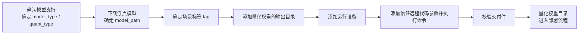

<!-- waiver: CE-05 原因：按团队链接规范，引用文档标题时书名号置于链接外（《[XX](…)》），链接锚文本内不使用书名号 -->
# 一键量化使用指南

## 1. 适用范围

**一键量化**是 msModelSlim 内置的量化能力：针对已收录支持矩阵的主流模型，用户只需指定模型名与量化类型，工具即可自动匹配官方验证过的最佳实践配置完成量化。

本指南面向希望在昇腾 NPU 或 CPU 上快速获得可部署量化权重的开发者（零基础可用），适用于以下场景：

- 目标模型已收录于《[大模型支持矩阵](../knowledge_base/model/README.md)》且标记为"一键量化"，无需自定义量化策略；
- 采用工具已内置验证的标准量化模式（如 W8A8、W4A8 等），无特殊精度或算法定制诉求。

以下情况**不适用**本指南，请改用其他路径：

- 模型未收录支持矩阵或未验证：请先参考《[新模型权重量化流程](process_new_model_quantization_tuning.md)》，完成模型适配后，再执行本指南；
- 需要深度定制量化算法组合、校准集等策略：请参考《[新模型量化调优流程](process_new_model_quantization_tuning.md)》制定方案。

## 2. 流程关系与前置条件

**上级流程**：部署指南——用户按《[主流模型量化部署流程指南](process_mainstream_model_deployment.md)》执行部署时，需先完成权重量化，从部署指南的"获取量化权重"环节进入本指南。

**前置条件**：

- 已安装 msModelSlim 且版本兼容，参见《[msModelSlim 工具安装指南](../install_guide/install_guide.md)》；
- 目标环境具备可用的昇腾 NPU（执行 `npu-smi info` 确认卡状态正常）或 CPU 环境，且磁盘空间充足；
- 已获取或可下载目标模型的浮点权重目录（tokenizer 等配套文件随权重目录一并提供）。

**后续操作**：量化权重交付部署，进入[主流模型量化部署流程指南](process_mainstream_model_deployment.md#步骤2部署推理服务)的"部署推理服务"章节；若部署测评发现精度异常，进入《[量化推理精度异常定位流程指南](process_quantization_accuracy_anomaly_locating.md)》。

## 3. 输入和交付件

| 类型 | 名称 | 来源或保存位置 | 格式或约束 | 验收方式 |
| --- | --- | --- | --- | --- |
| 输入 | 浮点模型权重目录 `${MODEL_PATH}` | ModelScope/HuggingFace 下载或自有权重 | 含模型配置、权重分片及类别所需附属文件（如 tokenizer、config 等） | 文件齐全；若官方提供校验值或版本号，与本地一致 |
| 交付件 | 量化权重目录 `${SAVE_PATH}` | 用户指定保存路径 | 含所选导出格式约定的描述文件与权重分片（如 AscendV1 的 `quant_model_description.json`） | 日志输出 SUCCESS；文件齐全；符合所选导出格式约定 |

## 4. 流程总览

本流程端到端分为五个阶段：确认模型支持、下载浮点模型、确定量化方案与场景标签、执行一键量化、校验交付件。其中 `msmodelslim quant` 命令的7个参数在步骤1~6 中逐一确定：步骤1 确定 `--model_type` 与 `--quant_type`，步骤2 确定 `--model_path`，步骤3 确定 `--tags`，步骤4~6 依次添加 `--save_path`、`--device`、`--trust_remote_code` 并执行：



## 5. 操作步骤

### 命令行预览

```bash
msmodelslim quant \
  --model_path ${MODEL_PATH} \          # 浮点权重目录
  --save_path ${SAVE_PATH} \            # 量化权重输出目录
  --device npu \                        # 量化设备，如 npu、npu --device_id 0 1 2 3
  --model_type ${MODEL_TYPE} \          # 已注册或支持矩阵中的模型名，大小写敏感
  --quant_type ${QUANT_TYPE} \          # 量化类型，如 w8a8
  --tags ${TAG} \                        # 场景标签，如 vLLM-Ascend Atlas_A2_Inference
  --trust_remote_code False             # 仅可信模型必要时设为 True
```

### 执行前预检

进入下载与量化前，按下列 checklist 逐项核对，任一项未通过时，先处理再继续后续步骤，执行一键量化前建议再跑一遍本预检。

| 序号 | 检查项 | 推荐命令 | 通过标准 |
| --- | --- | --- | --- |
| 1 | 原始权重未被意外更改 | `ls -lt <浮点模型目录> \| head` 或 `stat <关键权重文件>`，记录并比对最后修改时间 | 下载后与量化前的修改时间一致，无异常变化 |
| 2 | 硬盘空间足够 | `df -h` | 浮点目录与量化输出目录所在分区空间可覆盖模型体积、量化产物及余量 |
| 3 | NPU 未被占用 | `npu-smi info` | 目标卡状态正常，无非预期任务长期占卡 |

### 步骤1：确认模型支持

**目标**：确认目标模型已收录支持矩阵，且所选量化模式已验证——这是后续所有步骤的前提。

**操作**：

1. **确认模型收录**：在《[大模型支持矩阵](../knowledge_base/model/README.md)》中查找目标模型。支持矩阵是 msModelSlim 官方验证过的"模型 × 量化模式"清单，其中模型名称（`model_type`，大小写敏感，需与支持矩阵完全一致）与依赖库要求（如 transformers 版本）是后续命令的直接输入，先记录下来。
2. **确认量化模式验证状态**：确认所选量化模式（如 `w8a8`）在该模型下已标记验证通过。标记为"一键量化"的模型即可直接按本指南量化。

> **可选：了解量化算法与格式选型**
>
> 默认情况下无需关心算法与格式细节，工具自动匹配最佳实践配置。如需理解离群值抑制、线性量化等算法差异，参见《[量化算法说明](../knowledge_base/quantization_algorithms/README.md)》；如需选择导出格式（AscendV1、compressed-tensors 等），参见《[量化格式支持矩阵](../knowledge_base/quantization_format/README.md)》。

**输出**：确认的 `${MODEL_TYPE}` 与 `${QUANT_TYPE}`（即 `--model_type`、`--quant_type` 两个参数的取值）。

**通过条件**：支持矩阵中该模型与量化模式的组合标记为已验证。

### 步骤2：下载浮点模型

**目标**：获得与支持矩阵中 `model_type` 一致的浮点权重目录。

**操作**：

1. **下载权重**：浮点权重即未量化的原始模型权重，可从 ModelScope 下载：

   ```bash
   modelscope download --model <模型ID> --local_dir ${MODEL_PATH}
   ```

   其中 `<模型ID>` 替换为目标模型 ID，`${MODEL_PATH}` 替换为本地保存目录；也可使用 HuggingFace 等其他可信来源，或使用自有权重。
2. **校验目录完整性**：浮点权重目录应包含 `config.json`（模型结构配置）、`tokenizer_config.json`、`tokenizer.json`（分词器文件）及权重分片文件，缺一不可。

**输出**：浮点权重目录 `${MODEL_PATH}`（即 `--model_path` 参数的取值）。

**通过条件**：模型可被目标 transformers 版本正常加载。

### 步骤3：确定场景标签

**目标**：确定目标推理场景（`--tags`），使工具能匹配到该场景下已验证的最佳实践配置。

**操作**：

场景标签（`--tags`）用于告诉工具"量化后的模型将运行在什么环境"，支持两类场景标签，每一类别可指定一种场景，多个标签用空格分隔。各取值说明如下：

| 标签类别 | 取值 | 说明 |
| --- | --- | --- |
| 推理引擎 | `MindIE` | 量化后模型运行于 MindIE 推理引擎 |
| 推理引擎 | `vLLM-Ascend` | 量化后模型运行于 vLLM-Ascend 推理引擎 |
| 推理引擎 | `SGLang` | 量化后模型运行于 SGLang 推理引擎 |
| 硬件形态 | `Atlas_A2_Inference` | 量化后模型运行于 Atlas A2 系列推理卡 |
| 硬件形态 | `Atlas_A3_Inference` | 量化后模型运行于 Atlas A3 系列推理卡 |
| 硬件形态 | `Atlas_A2_Training` | 量化后模型运行于 Atlas A2 系列训练卡 |
| 硬件形态 | `Atlas_A3_Training` | 量化后模型运行于 Atlas A3 系列训练卡 |
| 硬件形态 | `Atlas_300I_Duo` | 量化后模型运行于 Atlas 300I Duo 推理卡 |
| 硬件形态 | `Ascend_950` | 量化后模型运行于昇腾950PR&950DT系列产品 |

> 推理引擎各取值对应的官方文档参见：《[MindIE 文档](https://mindie-motor.readthedocs.io/zh-cn/latest/)》《[vLLM-Ascend 文档](https://docs.vllm.ai/projects/ascend/zh-cn/latest/index.html)》《[SGLang 文档](https://docs.sglang.io/)》；硬件形态各取值对应的产品形态说明参见《[昇腾硬件形态描述](https://www.hiascend.com/document/detail/zh/AscendFAQ/ProduTech/productform/hardwaredesc_0001.html)》。

**注意**：

- 标签大小写不敏感；
- 未命中已验证场景时，工具会询问是否采用忽略场景标签的配置。

**输出**：确定的 `${TAG}`。

**通过条件**：`--tags` 取值与目标推理环境一致。

### 步骤4：添加量化权重的输出目录（必选）

**目标**：指定量化权重的输出目录。

**操作**：

在命令中添加 `--save_path` 参数：

- **填写**：`${SAVE_PATH}` 为自定义输出路径，建议单独建目录，例如 `~/qwen36_27b_w8a8`。
- **注意**：请确保磁盘空间充足。

**输出**：已指定输入与输出路径的量化命令。

**通过条件**：`--save_path` 取值已确认，指向量化权重输出目录。

### 步骤5：添加运行设备（可选，默认 `npu`）

**目标**：指定量化运行在哪个设备上。

**操作**：

在命令中添加 `--device` 参数：

- **填写**：`npu`（默认，单卡）、`npu:0,1,2,3`（多卡）、`cpu`。
- **注意**：指定多张卡时自动启用分布式逐层量化，详见下方"可选：多卡分布式量化"。

**输出**：已指定量化设备的命令。

**通过条件**：`--device` 取值已确认（单卡或多卡）。

> **可选：多卡分布式量化**
>
> 片上内存受限场景中，可指定多张 NPU 卡自动启用分布式逐层量化，将 `--device` 改为多卡即可，如 `--device npu --device_id 0 1 2 3`
>
> 多卡量化与逐层量化说明详见[一键量化完整指南](usage_quick_quantization.md#41-逐层量化及分布式逐层量化)。

### 步骤6：添加信任远程代码参数并执行命令（可选）

**目标**：补齐最后一个参数，执行完整命令完成量化。

**执行前检查**：目标 NPU 卡空闲可用；量化前不与其他训练/推理任务共享计算资源。

**操作**：

1. **添加 `--trust_remote_code` 参数**：模型仓库可能附带自定义代码，置为 `True` 时允许执行这些代码；存在安全风险，仅对可信来源的模型开启。
2. **执行完整命令**：此时命令已补齐全部参数，执行。

> **可选：最佳实践匹配逻辑（了解即可）**
>
> 指定 `--quant_type` 后，工具在最佳实践库中优先匹配"模型指定量化方式 + 场景标签"均命中的配置；若该模型在目标场景下没有已验证配置（最佳实践库仅收录已验证场景的组合），工具会依次询问是否采用忽略场景标签的配置、模型推荐量化方式（W8A8）的配置，按提示输入 `y` 即可继续。

**输出**：日志输出 `===========SUCCESS===========`，生成量化权重目录 `${SAVE_PATH}`。

**通过条件**：量化运行日志出现 SUCCESS 标志，无未处理的 ERROR。

### 步骤7：校验交付件

**目标**：确认量化新增的交付文件完整可用，并留下可复现的配置记录。

**操作**：

1. **核对新增文件**：量化后 `${SAVE_PATH}` 目录新增以下量化文件（交付件清单，以 AscendV1 格式为例）：

   ```text
   ${SAVE_PATH}/
   ├── quant_model_description.json      # 量化权重描述文件（AscendV1 格式；推理框架加载量化模型的重要依据）
   ├── quant_model_weights-00001-of-*.safetensors   # 量化权重分片
   └── ${MODEL_TYPE}_best_practice.yaml  # 本次量化的完整配置记录（可用于方案复现）
   ```

   输出文件含义详见《[AscendV1 量化权重格式说明](../knowledge_base/quantization_format/ascendv1/ascendv1_usage.md)》。

   > **注意**：不同导出格式的交付文件不同。如 compressed-tensors 格式没有 `quant_model_description.json`，量化元数据写入 `config.json` 的 `quantization_config` 字段，各格式的文件结构详见《[量化格式支持矩阵](../knowledge_base/quantization_format/README.md)》。
2. **保存配置记录**：留存 `${SAVE_PATH}` 下生成的 `*_best_practice.yaml`，作为本次量化的复现依据与审计记录。

**输出**：通过校验的量化权重目录 `${SAVE_PATH}` 与量化配置记录。

**通过条件**：所选导出格式约定的描述文件与全部权重分片存在（如 AscendV1 的 `quant_model_description.json`）；若缺失任一关键文件，量化权重不得进入部署环节。

**审计记录**：量化权重目录路径、`*_best_practice.yaml` 文件内容、量化日志（含 SUCCESS 标志）。

## 6. 验收条件

量化权重目录通过步骤7 校验（所选导出格式约定的描述文件与全部权重分片齐全、量化日志出现 SUCCESS）即完成交付，可进入部署流程；建议部署前按部署指南验证量化权重可被推理框架加载。

## 7. 异常处置

- **交互询问场景**：`--tags` 或 `--quant_type` 未命中已验证配置时，工具会询问是否采用推荐配置，确认场景与推荐配置匹配后按提示执行；
- **量化失败或 OOM**：先排查 NPU 状态（`npu-smi info`）与环境变量 `ASCEND_RT_VISIBLE_DEVICES` 是否指向有效空闲卡；显存不足（OOM）时改用空闲卡，或开启逐层量化、分布式逐层量化；
- **模型加载报错**：确认 transformers 等依赖库版本与支持矩阵要求一致，必要时补充 `--trust_remote_code True`（仅限可信模型）；
- **部署测评后精度异常**：量化权重已完成交付，但部署测评出现 badcase 或输出异常时，进入《[量化推理精度异常定位流程指南](process_quantization_accuracy_anomaly_locating.md)》定位异常位点，并按《[量化精度调优指南](process_quantization_precision_tuning.md)》调优后重新量化。

## 8. 案例列表

| 案例 | 简述 | 链接 |
| --- | --- | --- |
| DeepSeek-V4-Flash W8A8 一键量化 | 从环境准备到一键量化、量化权重检查、推理部署与评测的全流程闭环 | 《[DeepSeek-V4-Flash W8A8 一键量化案例](../best_practices/deepseek_v4_flash_w8a8_quick_quantization_case.md)》 |

## 9. 术语

| 术语 | 简述 | 链接 |
| --- | --- | --- |
| 模型适配矩阵 | 官方验证过的"模型 × 量化模式"支持清单，含依赖库要求 | 《[大模型支持矩阵](../knowledge_base/model/README.md)》 |
| 量化模式 | `W{权重位数}A{激活位数}[C{KV Cache位数}][S]` 命名规范，如 W8A8 表示权重与激活均量化为8bit | 《[大模型支持矩阵](../knowledge_base/model/README.md#量化模式命名规范)》 |
| 量化格式 | 量化权重的导出格式，如 AscendV1、compressed-tensors 等 | 《[量化格式支持矩阵](../knowledge_base/quantization_format/README.md)》 |

## 10. 接口文档列表

| 接口或能力 | 简述 | 链接 |
| --- | --- | --- |
| `msmodelslim quant` | 一键量化命令，含全部参数说明与使用示例 | 《[一键量化完整指南](usage_quick_quantization.md)》 |

## 11. 安全说明

trust_remote_code 默认保持 False；仅可信模型必要时开启。
测评日志、校准数据、量化产物与 ModelScope 发布内容按业务权限管控。
