# msMonitor Use Cases

<!-- md-trans-meta sourceCommit=4222e88544e08580745f0b6eec2d1d22cda8f31b translatedAt=2026-08-12T05:52:20.319Z pushedAt=2026-08-12T05:53:20.728Z -->

## Overview

This document introduces how to use msMonitor in training and inference scenarios through simple examples.

## Installing msMonitor

Software package release page: [msMonitor Releases](https://gitcode.com/Ascend/msmonitor/releases).

For detailed installation instructions, see [msMonitor Tool Installation Guide](../install_guide/msmonitor_install_guide.md).

## Case 1: Training Scenario Megatron (MindSpeed)

### Prerequisites

Training scenarios are typically equipped with an optimizer for iterative model parameter updates. By embedding a hook mechanism at the `optimizer.step` execution node, the interval of each training iteration can be clearly delineated.

If the optimizer is derived from the PyTorch standard base class `torch.optim.Optimizer`, integrating msMonitor enables zero-code modification and native compatibility. For a custom non-standard optimizer, the `torch_npu.profiler.dynamic_profile.step` method must be actively called at the end of each training iteration. Example:

```python
# Load the dynamic_profile module
from torch_npu.profiler import dynamic_profile as dp
...
for step in steps:
    train_one_step()
    # Mark the step
    dp.step()
```

### Starting dynolog daemon

```bash
dynolog --certs-dir NO_CERTS --enable-ipc-monitor
```

> [!NOTE]
>
> `--certs-dir NO_CERTS` indicates that certificate verification is not used. This is intended for test environments only, and the same applies below. In production environments, certificate verification is recommended to ensure data transmission security. For details, see [dynolog_instruct](../user_guide/dynolog_instruct.md).

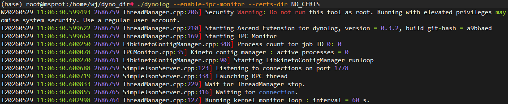

### Starting Training

Set the `MSMONITOR_USE_DAEMON` environment variable to `1` to enable the msMonitor feature.

```bash
export MSMONITOR_USE_DAEMON=1
```

Launch the Megatron training model.

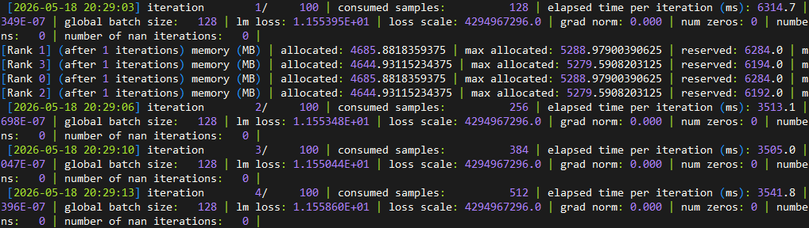

### nputrace Subcommand

Send the nputrace subcommand to collect profile data. For detailed parameter descriptions, refer to [nputrace Subcommand](../user_guide/nputrace_instruct.md).

```bash
# Start collection from the next step, collect framework, CANN, and Device data in 2 steps. Then the collected data is auto‑parsed with no data simplification. The output path is /tmp/profile_data.
dyno --certs-dir NO_CERTS nputrace --start-step -1 --iterations 2 --activities CPU,NPU --analyse --data-simplification false --log-file /tmp/profile_data
```

The training process receives the collection configuration and enables profile data collection and parsing.

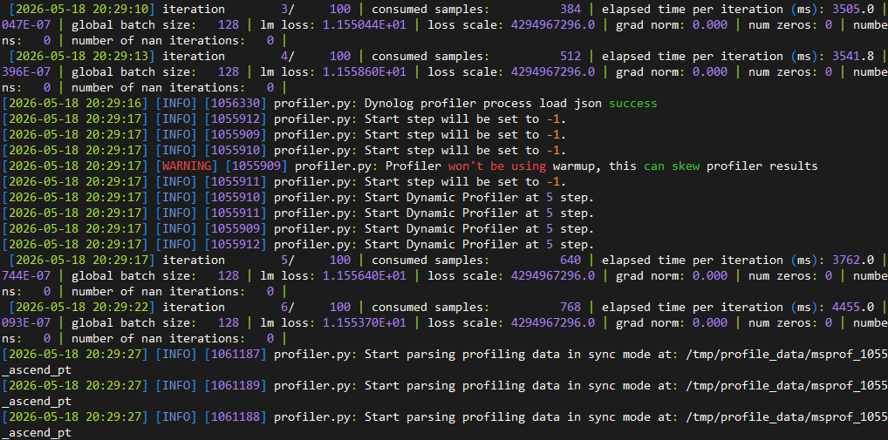

For the collected results, the on-disk data format and deliverables are described in [Ascend PyTorch Profiler Output File Description](https://gitcode.com/Ascend/pytorch/blob/master/docs/en/developer_notes/ascend_pytorch_profiler_user_guide.md#output-result-file-description-3)

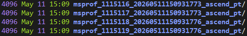

Use the [MindStudio Insight](https://gitcode.com/Ascend/msinsight/blob/master/docs/en/user_guide/overview.md) tool to view and analyze profile data.

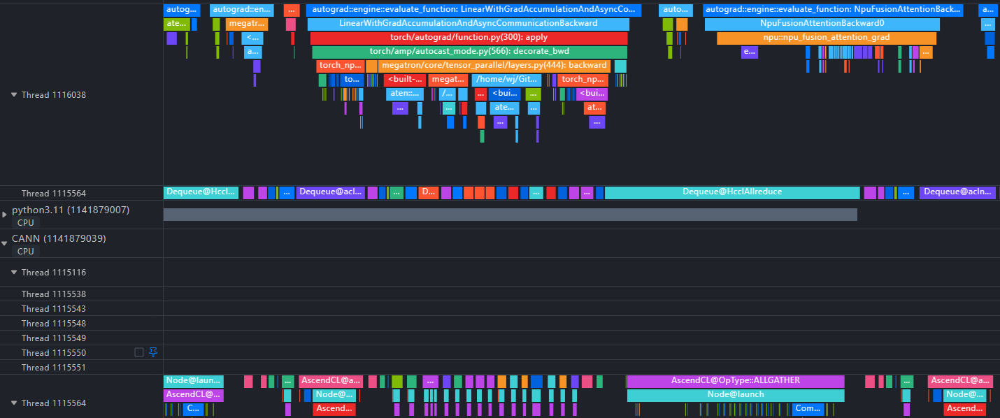

### npu-monitor Subcommand

> [!NOTE]
>
> The npu-monitor subcommand relies on the [msPTI](https://gitcode.com/Ascend/mspti/tree/master) interface at the underlying layer to implement lightweight data collection. Due to changes in the msPTI implementation mechanism, for versions earlier than CANN 9.0.0, set the `LD_PRELOAD` environment variable to point to the msPTI library path before starting training. The following is an example. CANN 9.0.0 and later versions do not require this setting.

```bash
# export LD_PRELOAD=<CANN Toolkit installation path>/cann/lib64/libmspti.so
# Default path example:
export LD_PRELOAD=/usr/local/Ascend/cann/lib64/libmspti.so
```

Send the npu-monitor subcommand to collect profile data. For detailed parameter descriptions, refer to [npu-monitor Subcommand](../user_guide/npumonitor_instruct.md).

```bash
# Write data to /tmp/msmonitor_jsonl at a 30s interval. Collect Marker, Kernel, and Communication data in Jsonl format.
dyno --certs-dir NO_CERTS npu-monitor --npu-monitor-start --report-interval-s 30 --mspti-activity-kind Marker,Kernel,Communication --log-file /tmp/msmonitor_jsonl --export-type Jsonl
```

The training process receives the collection configuration and enables profile data collection and writing.

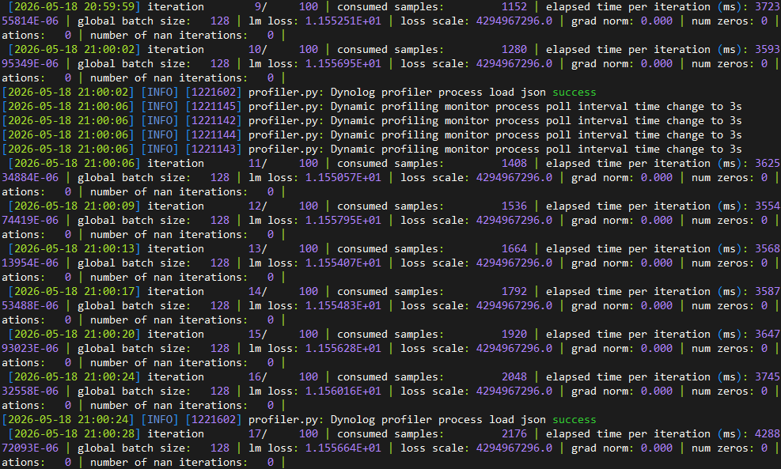

After collecting for a period of time, send a command to stop the collection.

```bash
dyno --certs-dir NO_CERTS npu-monitor --npu-monitor-stop
```

The collected profile data files are saved in the user‑specified dump path in JSONL format, with each line containing one performance record for ease of subsequent analysis.

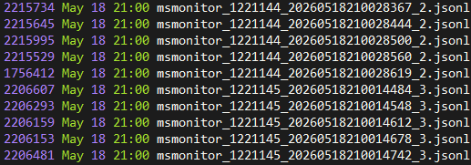

It contains latency information of markers (such as step), kernels, and communication.

Marker data includes the latency information of each step on the host and device:

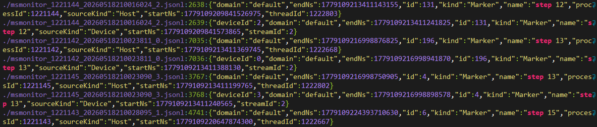

Kernel data includes the execution latency and type of compute operators on the device:

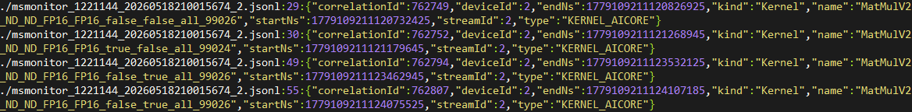

Communication data includes information such as the execution latency of communication operators on the device and the transmitted data types.

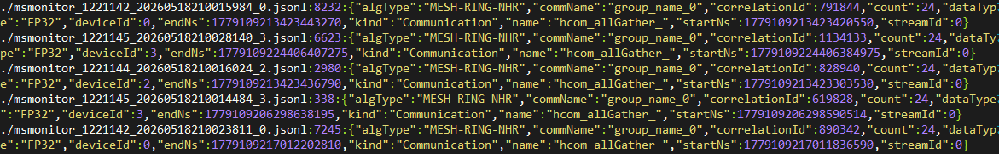

## Case 2: Inference Scenario vLLM

### Prerequisites

In inference scenarios, only the forward execution of the model is typically involved, without optimizer calls. Therefore, users need to manually invoke the `torch_npu.profiler.dynamic_profile.step` method during inference iterations, usually before each model forward call, to define the interval boundaries of inference iterations. In vLLM 0.11.0 and later versions, msMonitor supports automatically invoking the `torch_npu.profiler.dynamic_profile.step` method within the model's forward method, eliminating the need for manual invocation. Previous versions require manual execution by the user.

Refer to the vllm-ascend modification PR: https://github.com/vllm-project/vllm-ascend/pull/3123

```python
# Load the dynamic_profile module.
from torch_npu.profiler import dynamic_profile as dp
...

class NPUWorker(WorkerBase):

    def execute_model(
        self,
        scheduler_output: "SchedulerOutput",
    ) -> ModelRunnerOutput | AsyncModelRunnerOutput | None:
        # enable msMonitor to monitor the performance of vllm-ascend
        if envs_ascend.MSMONITOR_USE_DAEMON:
            dp.step()
        ...
```

### Starting dynolog daemon

```bash
dynolog --certs-dir NO_CERTS --enable-ipc-monitor
```


### Starting the Inference Service

Set the `MSMONITOR_USE_DAEMON` environment variable to `1` to enable the msMonitor feature.

```bash
export MSMONITOR_USE_DAEMON=1
```

Start the vLLM inference service.

```bash
# Start the vLLM inference service
# Model weight path: /path/to/model_weights
# Listening address: 127.0.0.1
# Listening port: 58000
# Tensor parallel size: 4
vllm serve /path/to/model_weights --host 127.0.0.1 --port 58000 --tensor-parallel-size 4
```

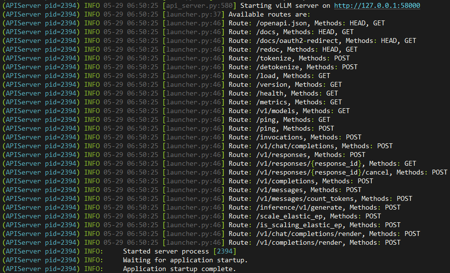

### Sending Inference Requests Continuously in the Background

After the inference service is started, the user needs to continuously send inference requests in another terminal to keep the model running.

```bash
#!/bin/bash

# Configuration
URL="http://127.0.0.1:58000/v1/chat/completions"
INTERVAL=0.1  # Request interval (seconds)
COUNT=0     # Counter

echo "Start continuously requesting vLLM. Press Ctrl+C to stop."

while true
do
  COUNT=$((COUNT+1))
  echo "===== Request $COUNT ====="

  curl -s -X POST "$URL" \
  -H "Content-Type: application/json" \
  -d '{
    "model": "your-model-name",
    "messages": [{"role":"user","content":"What is large language model"}],
    "temperature": 0.7,
    "max_tokens": 256
  }'

  echo -e "\n-------------------------"
  sleep $INTERVAL
done
```

### nputrace Subcommand

Send the nputrace subcommand to collect profile data. For detailed parameter descriptions, refer to [nputrace Subcommand](../user_guide/nputrace_instruct.md).

```bash
# Start collection from the next step, collect framework, CANN, and Device data in 10 steps, and set the storage path to /tmp/profile_data_vllm.
dyno --certs-dir NO_CERTS nputrace --start-step -1 --iterations 10 --with-modules --activities CPU,NPU --log-file /tmp/profile_data_vllm
```

The inference process receives the collection configuration and enables profile data collection.

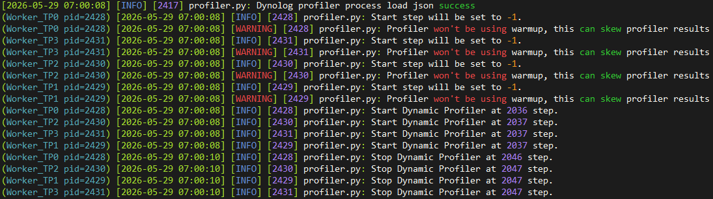

Note: Typically, the vllm model process runs as a daemon, so online parsing of profile data is not supported. Users need to manually parse the collected profile data.

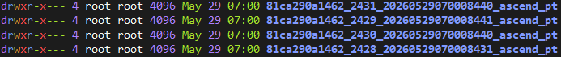

Parse the profile data offline.

```bash
# Execute the Python command to parse the profile data.
python -c "import torch_npu; torch_npu.profiler.profiler.analyse('/tmp/profile_data_vllm/81ca290a1462_2429_20260529070008441_ascend_pt')"
```

After parsing is complete, refer to <a href="https://gitcode.com/Ascend/pytorch/blob/master/docs/en/developer_notes/ascend_pytorch_profiler_user_guide.md#output-result-file-description-3">Ascend PyTorch Profiler Output Result File Description</a> for details on the generated data format and deliverables.

Use the [MindStudio Insight](https://gitcode.com/Ascend/msinsight/blob/master/docs/en/user_guide/overview.md) tool to view and analyze the profile data.

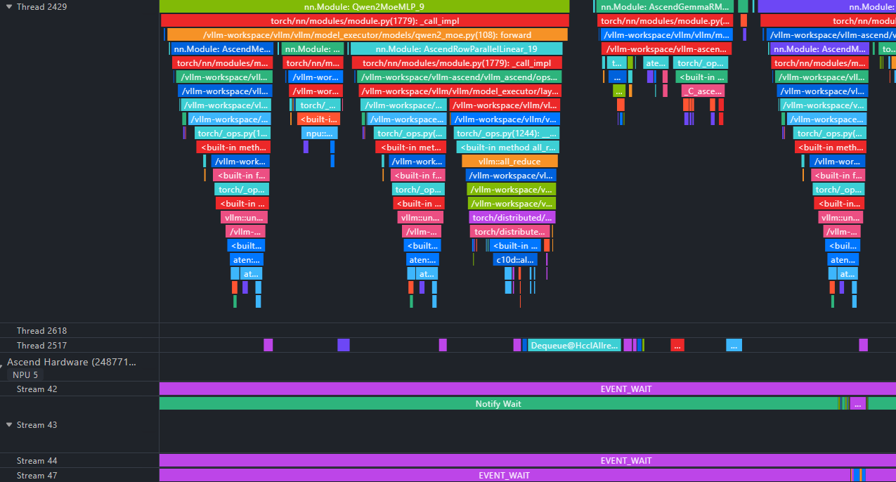

### npu-monitor Subcommand

> [!NOTE]
>
> The npu-monitor subcommand relies on the [msPTI](https://gitcode.com/Ascend/mspti/tree/master) interface at the underlying layer to implement lightweight data collection. Due to changes in the msPTI implementation mechanism, for versions earlier than CANN 9.0.0,  set the `LD_PRELOAD` environment variable to point to the msPTI library path before starting training. The following is an example. CANN 9.0.0 and later versions do not require this setting.

```bash
# export LD_PRELOAD=<CANN Toolkit installation path>/cann/lib64/libmspti.so
# Default path example
export LD_PRELOAD=/usr/local/Ascend/cann/lib64/libmspti.so
```

Send the npu-monitor subcommand to collect profile data. For detailed parameter descriptions, refer to [npu-monitor Subcommand](../user_guide/npumonitor_instruct.md).

```bash
# The data is written to /tmp/msmonitor_vllm_jsonl at a 30s flush interval. The collected data types are Marker, Kernel, and Communication, written in Jsonl format.
dyno --certs-dir NO_CERTS npu-monitor --npu-monitor-start --report-interval-s 30 --mspti-activity-kind Marker,Kernel,Communication --log-file /tmp/msmonitor_vllm_jsonl --export-type Jsonl
```

The inference process receives the collection configuration and starts profile data collection and writing.

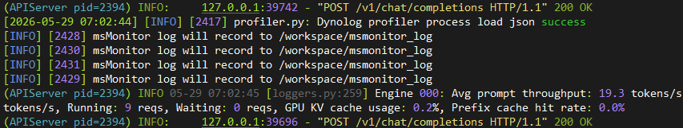

After collecting for a period of time, send the command to stop the collection.

```bash
dyno --certs-dir NO_CERTS npu-monitor --npu-monitor-stop
```

The collected performance data files are saved in the user‑specified dump path in JSONL format, with each line containing one performance record for ease of subsequent analysis.

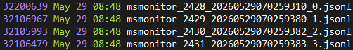

It contains Marker (such as step), Kernel, and Communication latency information.

Marker data includes the latency information of each step on the host and device:

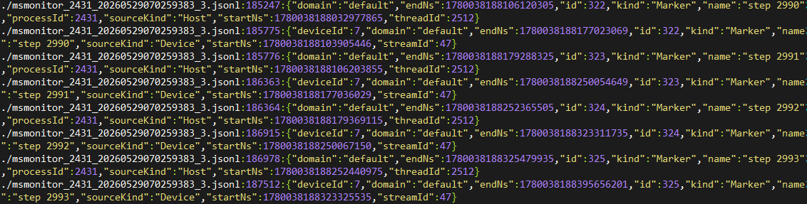

Kernel data includes the execution latency and type of compute operators on the device:

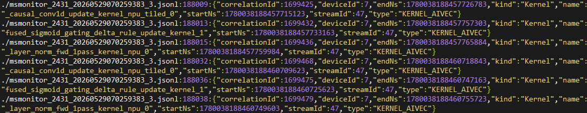

Communication data includes information such as the execution latency and transmitted data types of communication operators on the device.

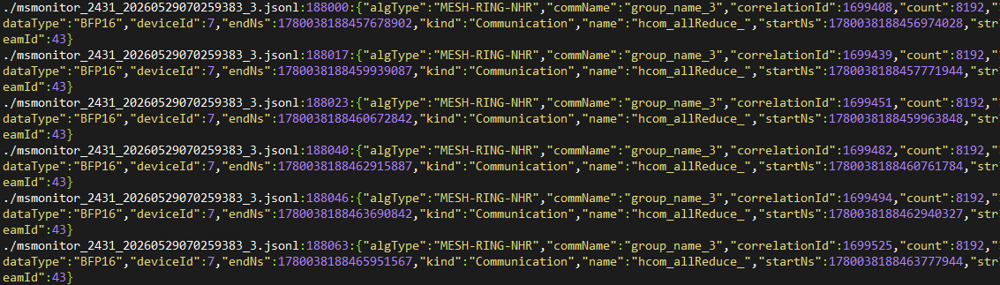

## Others

### TorchNPU Custom Markers

In large-scale cluster scenarios, traditional profiling generates massive amounts of data and involves complex analysis workflows. By using the torch_npu.npu.mstx custom marker feature, you can define custom collection time ranges or the start and end time points of key functions, identify information such as key functions or iterations, and quickly scope performance issues.

**Usage Example**

In a PyTorch script, call interfaces such as `torch_npu.npu.mstx`, `torch_npu.npu.mstx.mark`, `torch_npu.npu.mstx.range_start`, `torch_npu.npu.mstx.range_end`, and `torch_npu.npu.mstx.mstx_range` to insert markers for the events you want to collect, and collect the latency of the corresponding events.

Record only the host-side range latency.

```python
id = torch_npu.npu.mstx.range_start("dataloader", None)    # Set the second input parameter to None or leave it unset to record only the host-side range latency
dataloader()
torch_npu.npu.mstx.range_end(id)
```

Insert markers on the compute stream to record both the host-side range latency and the corresponding device-side range latency.

```python
stream = torch_npu.npu.current_stream()
id = torch_npu.npu.mstx.range_start("matmul", stream)    # Set the second input parameter to a valid stream to record both the host-side range latency and the corresponding device-side range latency
torch.matmul()    # Compute stream operation example
torch_npu.npu.mstx.range_end(id)
```

After completing custom markers in the model script, you can collect marker information using the nputrace and npu-monitor subcommands of msMonitor.

The nputrace subcommand requires setting the `msprof-tx` parameter, along with the `mstx_domain_include` or `mstx_domain_exclude` parameter to filter the domain of the marker data. Example:

```bash
dyno --certs-dir NO_CERTS nputrace --msprof-tx ...
```

The npu-monitor subcommand requires enabling `Marker` type data collection. Example:

```bash
dyno --certs-dir NO_CERTS npu-monitor --npu-monitor-start --mspti-activity-kind Marker ...
```

### Obtaining Parallel Strategy Communication Group Information

In multi-rank model scenarios, parallel strategy communication group information is typically required to correctly analyze communication performance issues.

When torch calls the `new_group` interface to create a communication group, user-defined information such as `group_name` and `hccl_buffer_size` can be passed through the `pg_options` parameter. In TorchNPU, the object corresponding to the `pg_options` parameter is `torch_npu._C_.distributed_c10d.ProcessGroupHccl.Options`. By setting `group_name` in this object, the communication group information can be viewed in msMonitor.

For details about the new_group API, see "[Groups](https://docs.pytorch.org/docs/2.9/distributed.html#torch.distributed.new_group)".

If users need to collect parallel strategy communication group information, the `group_name` parameter must be passed when torch calls `new_group`. The following uses Megatron/MindSpeed as an example:

```python
import torch_npu
from functools import wraps

def get_nccl_options_add_group_info_wrapper(get_nccl_options):
    @wraps(get_nccl_options)
    def wrapper(pg_name, nccl_comm_cfgs):
        options = get_nccl_options(pg_name, nccl_comm_cfgs)
        if hasattr(torch_npu._C._distributed_c10d.ProcessGroupHCCL.Options, 'hccl_config'):
            options = options if options is not None else torch_npu._C._distributed_c10d.ProcessGroupHCCL.Options()
            try:
                hccl_config = options.hccl_config
                hccl_config.update({'group_name': pg_name})
                options.hccl_config = hccl_config
            except TypeError as e:
                pass
        return options
    return wrapper
```

Example of creating a communication group in Megatron:

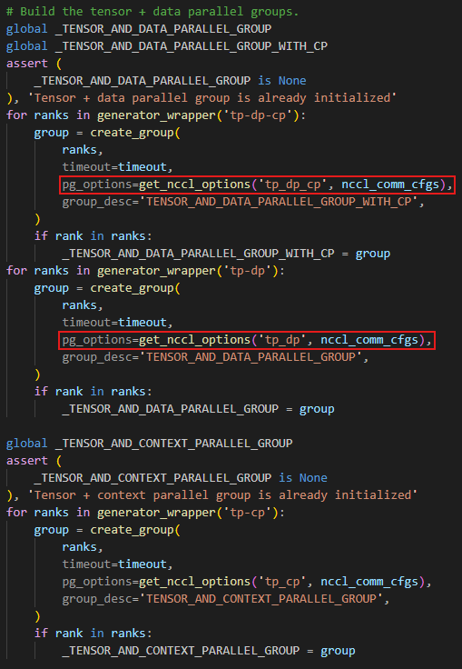

After completing the preceding modifications, you can view the parallel strategy communication group  information in the `profiler_metadata.json` file delivered by the nputrace subcommand. This information is also included in the jsonl file written by the npu-monitor subcommand.

```json
"parallel_group_info": {
    "group_name_0": {
        "group_name": "default_group",
        "group_rank": 2,
        "global_ranks": [0, 1, 2, 3]
    },
    "group_name_5": {
        "group_name": "dp",
        "group_rank": 0,
        "global_ranks": [2]
    },
    "group_name_13": {
        "group_name": "dp_cp",
        "group_rank": 0,
        "global_ranks": [2]
    },
    "group_name_21": {
        "group_name": "mp",
        "group_rank": 2,
        "global_ranks": [0, 1, 2, 3]
    },
    "group_name_23": {
        "group_name": "tp",
        "group_rank": 0,
        "global_ranks": [2, 3]
    }
}
```
