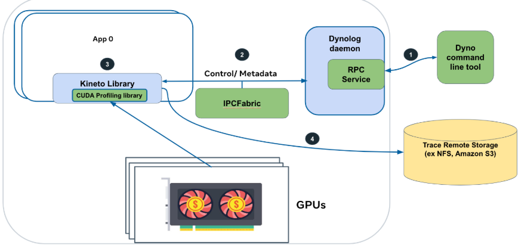
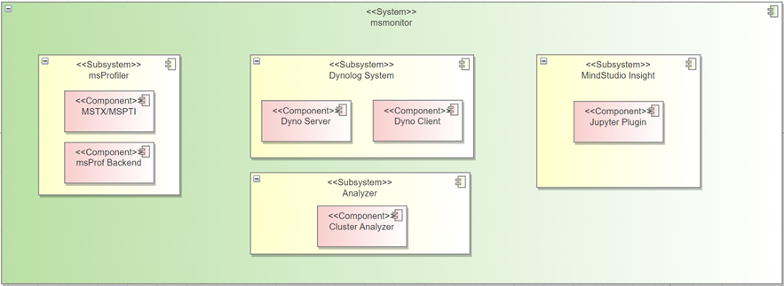
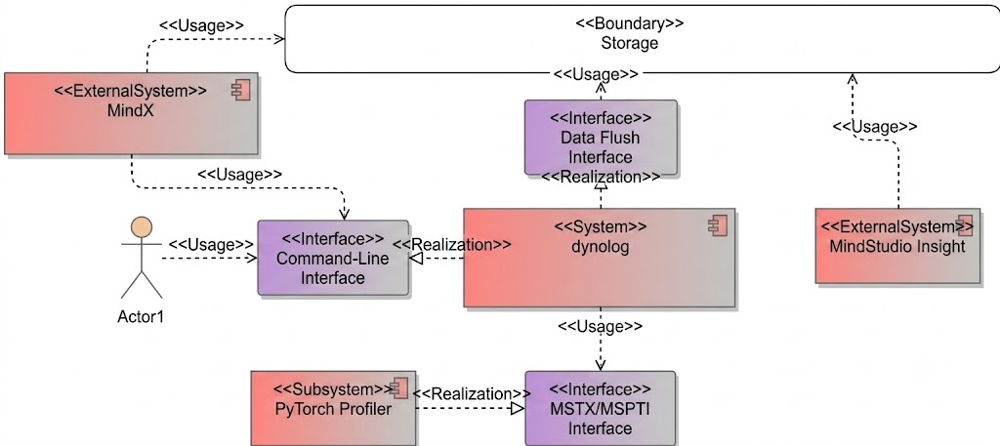

# MindStudio Monitor Feature Analysis and Design Specification

<!-- md-trans-meta sourceCommit=4222e88544e08580745f0b6eec2d1d22cda8f31b translatedAt=2026-08-12T09:24:35.928Z pushedAt=2026-08-12T09:25:22.539Z -->

<table>
    <tr>
        <td>SIG:</td>
        <td>mstt-sig</td>
    </tr>
    <tr>
        <td>Target Version:</td>
        <td>MindStudio 26.0.0</td>
    </tr>
    <tr>
        <td>Designer:</td>
        <td>chenhao</td>
    </tr>
    <tr>
        <td>Date:</td>
        <td>2026-01-21</td>
    </tr>
</table>

Your reproduction, use, modification, and distribution of "this document" are governed by the Creative Commons Attribution-ShareAlike 4.0 International Public License (hereinafter referred to as "CC BY-SA 4.0").
For ease of understanding, you may visit <https://creativecommons.org/licenses/by-sa/4.0> to review a summary of CC BY-SA 4.0 (which is not a substitute for the full license).
The full text of CC BY-SA 4.0 is available at the following URL: <https://creativecommons.org/licenses/by-sa/4.0/legalcode>.

**Revision History**

<table>
    <tr>
        <th>Date</th>
        <th>Revision Version</th>
        <th>Revision Description</th>
        <th>Author</th>
        <th>Reviewed</th>
    </tr>
    <tr>
        <td>2026-01-21</td>
        <td>1.0</td>
        <td>Initial draft completed</td>
        <td>chenhao</td>
        <td>chenhao</td>
    </tr>
</table>

# 1. Feature Overview

The online monitoring system primarily serves large-scale model cluster scenarios, establishing a complete performance monitoring and analysis workflow. It first relies on lightweight instrumentation-based monitoring to screen and identify slow-card nodes, and then leverages dynamic data collection capabilities to conduct in-depth investigation of anomalous slow cards and their corresponding communication domains, thereby precisely locating and analyzing the root cause of slow-card issues.

## 1.1 Scope

Includes capability enhancements for npu-monitor: supporting control over the collection time window and the scope of collected data, and nputrace supporting asynchronous parsing capability.

## 1.2 Feature Requirement List

Table 1: Feature Requirement List

<table>
    <tr>
        <th>Requirement ID</th>
        <th>Requirement Name</th>
        <th>Feature Description</th>
        <th>Remarks</th>
    </tr>
    <tr>
        <td>1</td>
        <td>npu-monitor supports collection by Duration</td>
        <td>Supports setting the duration parameter to control data metrics within the collection period</td>
        <td>Can be stopped early via the stop parameter</td>
    </tr>
    <tr>
        <td>2</td>
        <td>npu-monitor supports collection by operator name</td>
        <td>Supports setting operator name rules to filter required operator names</td>
        <td>Operator name configuration can be based on fuzzy matching</td>
    </tr>
    <tr>
        <td>3</td>
        <td>nputrace supports asynchronous parsing capability</td>
        <td>Supports asynchronous data processing in the parsing workflow</td>
        <td></td>
    </tr>
</table>

# 2. Requirement Scenario Analysis

## 2.1 Feature Requirement Sources and Value Overview

The basic capabilities of msMonitor are being improved and enhanced to support fine-grained control over the scope of collected data. This enables control over the volume of data collection while supporting custom data processing, delivering greater flexibility and ease of use.

## 2.2 Feature Scenario Analysis

### 2.2.1 npu-monitor Duration-Based Collection Scenario

**Scenario Trigger Conditions and Targets**:

- **Roles**: AI cluster O&M engineer, performance analysis engineer, MindStudio Insight user.

- **Tools/Interfaces**: msMonitor CLI (`dyno npu-monitor --duration`), MindStudio Insight interface, Dynolog Server RPC interface.

- **Trigger Conditions**: NPU performance metrics need to be collected within a specific time window, such as a particular iteration phase of a training task, the peak period of an inference service, or the observation window for slow card diagnosis.

**User application scenarios and key tasks**:

1. **Timed collection scenario**: Set `--duration 300` to automatically stop collection after the training task has run for 5 minutes, preventing excessive data from prolonged collection.

2. **Early stop with the stop parameter**: Set `--duration 3600` at startup, and terminate collection early via `--npu-monitor-stop` when an anomaly is detected.

3. **Periodic inspection**: O&M scripts trigger collection on a scheduled basis, for example, collecting metrics for 10 minutes every hour for cluster health assessment.

4. **Slow card reproduction and verification**: Precisely collect data within the suspected slow card time window, and use `--filter` to locate performance issues of specific operators.

### 2.2.2 npu-monitor Operator Name-Based Collection Scenario

**Scenario Trigger Conditions and Targets**:

- **Roles**: Model Development Engineer, Performance Tuning Expert, Algorithm Researcher.

- **Tool/Interface**: msMonitor CLI (`dyno npu-monitor --filter`).

- **Trigger Condition**: When there is a need to focus on the performance of specific operators (such as MatMul, AllReduce, Conv2D, etc.) while filtering out noise from irrelevant operators.

**User app scenarios and key tasks**:

1. **Hotspot operator focused analysis**: Set `--filter "Kernel:MatMul,Conv2D;Communication:AllReduce"` to collect only core compute and communication operators.

2. **Fuzzy matching filtering**: Use `--filter "Kernel:MatMul"` to match all MatMul variants (such as MatMul, BatchMatMul, etc.).

3. **Multi-activity type combined filtering**: Simultaneously filter operators across multiple activity types such as `Kernel`, `API`, and `Communication`.

4. **Precise targeting with Duration**: Combine `--duration 60 --filter "Kernel:Attention"` to collect only Attention operator performance data within 60 seconds.

### 2.2.3 nputrace Asynchronous Parsing Capability Scenario

**Scenario Trigger Conditions and Objects**:

- **Role**: Large model training engineer, distributed training platform developer.

- **Tools/Interfaces**: msMonitor CLI (`dyno nputrace --async-mode`), Dynolog Server, PyTorch Profiler dynamic collection interface.

- **Trigger Conditions**: Large-scale distributed training (thousand-card cluster) generates massive trace data, and synchronous parsing blocks the main process and affects training performance.

**User application scenarios and key tasks**:

1. **Lossless collection in large-scale clusters**: Enable `--async-mode` to offload trace data parsing to an independent process, avoiding blocking the main training process.

2. **High-frequency collection scenarios**: When trace collection is triggered frequently, asynchronous parsing prevents parsing backlog from causing memory overflow.

3. **Production environment performance analysis**: Obtain complete CANN/Device-side performance data without affecting training throughput.

4. **Combined with the analyse parameter**: `--async-mode --analyse` automatically triggers asynchronous parsing after collection to generate deliverables.

## 2.3 Feature Impact Analysis

The three new features introduced in this release—npu-monitor support for Duration-based collection, npu-monitor support for Filter-based operator screening, and nputrace support for Async asynchronous parsing—are all extensions and enhancements of the existing msMonitor capabilities. They do not alter the overall system architecture, introduce new external dependencies, or add new listening ports or communication protocols.

**Interaction Analysis with Other Requirements and Features**:

- The Duration parameter of npu-monitor is used in conjunction with the Stop parameter, allowing early termination during the collection process.

- The Filter-based screening of npu-monitor relies on filtering through the msPTI callback chain. It is decoupled from Duration and can be used in combination with it.

- nputrace supports Async Mode, which can be used together with the Analyse parameter to automatically trigger asynchronous parsing after collection ends.

**Platform Difference Analysis**:

Only the Linux operating system is supported. It does not depend on specific hardware platform features, and the behavior is consistent across all supported Ascend products.

**Compatibility Analysis**:

All newly added parameters are optional (with default values). When not specified, the behavior is fully consistent with previous versions, ensuring backward compatibility.

**Constraints and Limitations**:

- npu-monitor supports the duration parameter. When duration is set to 0, it indicates unlimited collection, which must be manually stopped using the stop parameter.

- npu-monitor supports the filter parameter. The maximum length of the filter string is 1024 characters. Operator names are matched using substring fuzzy matching (not regular expressions).

- nputrace supports the async-mode parameter. async-mode takes effect only in PyTorch Profiler.

### 2.3.1 Hardware Limitations

| Product Type                                    | Whether Supported |
| ----------------------------------------------- | :---------------: |
| Atlas 350 Accelerator Card                      |         √         |
| Atlas A3 Training Series/Atlas A3 Inference Series |         √         |
| Atlas A2 Training Series/Atlas A2 Inference Series |         √         |
| Atlas 200I/500 A2 Inference Product              |         √         |
| Atlas Inference Series                          |         ×         |
| Atlas Training Series                           |         ×         |

### 2.3.2 Technical Limitations

Operating system: Linux

Programming language: C++ / Python

### 2.3.3 Impact Analysis on License

No changes to the license will be introduced.

### 2.3.4 Impact Analysis on System Performance Specifications

The online monitoring system performs data collection and analysis only when necessary, and will not cause significant impact on system performance.

### 2.3.5 Impact Analysis on System Reliability Specifications

The online monitoring system does not affect normal system operation. Data collection and analysis are performed only when necessary, and no impact is imposed on system reliability.

### 2.3.6 Impact Analysis on System Compatibility

The newly added feature parameters and capabilities do not involve changes to existing functions, and there are no compatibility issues.

### 2.3.7 Impact Analysis of Interoperability and Conflicts with Other Major Features

The newly added feature parameters and capabilities do not involve changes to existing functions and will not affect other existing features.

## 2.4 Analysis of Similar Community/Commercial Software Implementation

Dynolog can perform on-demand performance analysis on distributed AI apps without any code modification. Users can initiate PyTorch performance data collection requests through the Dynolog service. Upon receiving the request, Dynolog dynamically configures the PyTorch profiler via inter-process communication (IPC).

The following figure illustrates this workflow:



Figure 1: Community solution implementation diagram

1. Configure the PyTorch app environment to enable on-demand trace collection.

2. Collect GPU trace data on demand, either locally or remotely.

3. Perform performance analysis on distributed training tasks.

# 3. Feature/Function Implementation Principles

## 3.1 Objectives

msMonitor provides the following core features:

**npu-monitor**: A lightweight resident background process that continuously monitors the latency of key operators, suitable for online observation of performance fluctuations.

**nputrace**: Dynamically triggers the collection and parsing of performance data from the framework, CANN, and Device sides without interrupting task execution.

## 3.2 Overall Solution



Figure 2: Overall Logical Architecture View of the msMonitor Solution

MindStudio implements an end-to-end solution based on distributed AI clusters:

**Dynolog System**: This is the core subsystem, primarily divided into two modules: Client and Server.

The client side initiates commands to enable the lightweight trace monitoring capability. Currently supported parameters include: nputrace (detailed mstx/mspti trace information) and npu-monitor (real-time monitoring metrics, analyzing slow card indicators). Client command parameter interaction uses RPC (Remote Procedure Call) messaging.

The server communicates with threads within the service process via IPC sockets, forwarding command messages issued by the client side. It assembles and dispatches commands and configurations to the service process to perform operations such as enabling/disabling.

**msMonitor**: A lightweight trace monitoring thread is launched within the training service process to periodically (every X seconds) read data from the mstx/mspti interface buffer. The lightweight trace monitoring thread reports trace data to the Daemon Server via IPC sockets.

**msInsight/Analyzer**: The user/platform side collects metrics data through the storage platform. Cluster node data depends on the aggregation capability of the user/platform. The aggregated data supports invoking the knowledge base for slow card analysis or visual presentation.



Figure 3: msMonitor interaction context view

The main external modules involved in msMonitor are as follows:

1. **Developer**: msMonitor provides a command-line interface that supports dynamic collection of custom data and the ability to enable preset monitoring data. Developers can quickly obtain cluster performance data through configuration. The environment where msMonitor resides is the runtime environment, where developers can perform configuration, start/stop, analysis, and other functions.

2. **Algorithm frameworks such as PyTorch Profiler**: Data collection capabilities implemented based on the PyTorch framework. They support data instrumentation, collection, and other capabilities. They provide performance data at the framework layer and CANN layer, which is returned to the monitoring system for further analysis and display.

3. **AI platforms such as MindX**: As a runtime platform, they can invoke command-line capabilities and obtain persisted data for secondary analysis/display. They can also integrate the MindStudio Insight visualization interface.

# 4. Implementation of Basic Parameter Collection Capability of msMonitor

## 4.1 Design Approach

By extending the parameters of the npu-monitor subcommand, flexible control over the collection scope is supported:

1. The extended parameter `--duration` supports specifying the collection time range.

2. The extended parameter `--filter` supports configuring operator name filtering rules.

## 4.2 Constraints

NA

## 4.3 Detailed Implementation

### 4.3.1 npu-monitor Duration Collection Sequence

  1. The user CLI (`dyno`) delivers the configuration to the Dynolog Server via RPC.

  2. The Dynolog Server forwards it to the service process through an IPC Socket.

  3. The MsptiMonitor thread parses the duration parameter → the collection thread counts time in the `Run()` loop, and automatically stops and cleans up resources when the duration threshold is reached.

### 4.3.2 npu-monitor Filter Filtering Sequence

  1. The user delivers a configuration containing `filter` via CLI (`dyno`).

  2. `InputParser::DynoLogGetOpts()` parses the filter string into the `msptiFilterItems` struct.

  3. `MsptiMonitor::SetFilterItems()` stores the filter items.

  4. In the msPTI callback `BufferComplete()`, `ShouldKeepRecord()` is called to perform fuzzy matching filtering on operator names.

  5. Only records that pass the filtering enter `ConsumeMsptiData()` for processing.

### 4.3.3 Module Interaction Flow

```text
CLI (dyno npu-monitor --duration 300 --filter "Kernel:MatMul")
  │
  ├─► RPC request (setKinetOnDemandRequest)
  │    │
  │    ▼
  ├─► Dynolog Server (IPC Socket forward)
  │    │
  │    ▼
  ├─► DynoLogNpuMonitor::EnableMsptiMonitor()
  │    │
  │    ├─► InputParser::DynoLogGetOpts()  // Parse duration/filter.
  │    │      ├─ str2Kinds()        → Activity type set
  │    │      ├─ str2FilterItems()  → Operator name filter map
  │    │      └─ duration           → Floating-point duration
  │    │
  │    └─► DealMonitorReq()
  │           ├─ msptiMonitor->SetDuration(duration)  // Store the duration.
  │           ├─ msptiMonitor->Start(cmd)              // Start the collection thread.
  │           └─ msptiMonitor->SetFilterItems(filter)  // Set the filter rules.
  │
  ▼
MsptiMonitor::Run() main loop
  │
  ├─► Poll every 1ms to check if the duration has elapsed
  │      if (duration_ > 0 && elapsed ≥ duration * 1000) → Stop upon expiration.
  │
  ├─► Trigger msptiActivityFlushAll() at every flushInterval
  │
  └─► msptiActivity calls back BufferComplete()
         └─► ShouldKeepRecord() ← apply fuzzy matching against filterItems_
                ├─ Activities of types in FILTER_WHITE_LIST (e.g., Memory, MemSet, MemCpy) are always retained
                ├─ The operator name is extracted from the name field based on activity kinds.
                └─ Fuzzy match: opName.find(filterOp) != npos
```

## 4.4 Inter-Subsystem Interface (Main Covered Module Interface)

| Module | Interface/Struct | File | Modification |
|------|------------|------|----------|
| CLI parameter parsing | `Command::NpuMonitor` enum | `dynolog_npu/cli/src/main.rs:289-320` | Added `duration` (f32) and `filter` (String) fields |
| CLI configuration assembly | `NpuMonitorConfig` struct | `dynolog_npu/cli/src/commands/npumonitor.rs` | Added `duration` and `filter` fields and `config()` serialization |
| Configuration parsing | `InputParser::DynoLogGetOpts()` | `plugin/ipc_monitor/InputParser.cpp` | Parses DURATION_KEY and NPU_MONITOR_FILTER key-value pairs |
| Configuration struct | `MsptiMonitorCfg` | `plugin/ipc_monitor/InputParser.h` | Added `duration` (float) and `filterItems` (msptiFilterItems) fields |
| Monitoring Management | `MsptiMonitor::SetDuration()` | `plugin/ipc_monitor/MsptiMonitor.h` | Added interface to set the duration atomic variable |
| Monitoring Management | `MsptiMonitor::SetFilterItems()` | `plugin/ipc_monitor/MsptiMonitor.h` | Added interface to set operator name filter rules |
| Monitoring Management | `MsptiMonitor::ShouldKeepRecord()` | `plugin/ipc_monitor/MsptiMonitor.cpp` | Added method for fuzzy matching filter based on filterItems |
| Monitoring Management | `MsptiMonitor::Run()` | `plugin/ipc_monitor/MsptiMonitor.cpp` | Added duration expiration detection logic |
| Message handling | `DynoLogNpuMonitor::DealMonitorReq()` | `plugin/ipc_monitor/DynoLogNpuMonitor.cpp` | Reads cmd.duration and cmd.filterItems and passes them to MsptiMonitor |

## 4.5 Subsystem Detailed Design

### 4.5.1 CLI Client Module (dyno)

**New Parameter Definitions**:

- `--duration`: f32 type, in seconds, supports fractional precision, default value 0.0 (unlimited). Non-negativity is validated through `parse_duration()`.

- `--filter`: String type, format `"Kind:OpName,OpName;Kind:OpName"`, default empty string (no filtering). Length is restricted to ≤1024 via `validate_string_max_len()`.

**Configuration Serialization**:

- `NpuMonitorConfig::config()` formats `duration` and `filter` into the `DURATION=xxx\nNPU_MONITOR_FILTER=xxx` key-value pair and sends it to the Server via RPC.

### 4.5.2 Configuration Parsing Module (plugin)

**Duration Parsing**:

- DURATION_KEY is validated using `isFloat()`, which supports floating-point format.

- In `DynoLogGetOpts()`, the string is converted to float via `Str2Float()` and stored in `MsptiMonitorCfg::duration`.

**Filter Parsing**:

- `str2FilterItems()` parses the filter string: first splits activity type entries by `;`, then splits each entry into `Kind:OpList` by `:`, and finally splits the operator name list by `,`.

- Operator names are stored in `msptiFilterItems` (i.e., `unordered_map<msptiActivityKind, unordered_set<string>>`).

- Operator names support substring fuzzy matching (e.g., `MatMul` can match `BatchMatMul`).

### 4.5.3 MsptiMonitor Monitoring Module (plugin/ipc_monitor/mspti_monitor/MsptiMonitor)

**Duration Control**:

- When the `Run()` thread starts, it records `startTime = steady_clock::now()`.

- In each loop iteration, it checks whether the `duration_` atomic variable is greater than 0, and calculates the elapsed time as `elapsed = currentTime - startTime`.

- When `elapsed >= duration * 1000` (in milliseconds), it sets `isDurationExpired=true` and exits the loop.

- After exiting, resource cleanup is performed: `msptiUnsubscribe`, disabling all activities, flushing remaining data, stopping the dataProcessor, and clearing filters and paths.

**Filter Filtering**:

- `ShouldKeepRecord()` performs filtering on each record in the `BufferComplete()` callback.

- Filter whitelist: The three activity types `MSPTI_ACTIVITY_KIND_MEMORY/MEMSET/MEMCPY` are always retained and do not participate in filtering.

- Operator name extraction: Based on the `record->kind` type, the record is cast to the corresponding structure (`msptiActivityApi`, `msptiActivityKernel`, `msptiActivityCommunication`, `msptiActivityMarker`), and the `name` field is extracted.

- Fuzzy matching: Use `std::any_of()` to iterate over the filter rule list, and perform substring matching via `opName.find(filterOp) != npos`.

- Special handling for Marker type: Only Marker records with a valid flag on the Host side are filtered; Markers on the Device side or Markers with an invalid flag are directly passed through.

## 4.6 DFX Attribute Design

### 4.6.1 Performance Design

The filtering rules and duration control mechanism introduced by this feature have a manageable impact on performance. The detailed analysis is as follows:

**Filter Overhead**:

- `ShouldKeepRecord()` performs a filtering decision on each msPTI record in the `BufferComplete()` callback. The filtering process includes: activity type lookup (`unordered_map::find`), record casting and operator name extraction (`reinterpret_cast` + `name` field read), and operator name substring fuzzy matching (`std::any_of` + `string::find`).

- When the filter is empty, only a single `filterItems_.empty()` emptiness check is performed before the record is passed through, resulting in negligible overhead.

- When filter is non-empty, the matching overhead per record is approximately in the hundreds of nanoseconds. Under a typical configuration (flush interval of 60 s, tens of thousands of records per flush), the additional filtering overhead per BufferComplete callback is in the microsecond range and does not constitute a performance bottleneck.

- Filtering significantly reduces the volume of data written to disk (for example, retaining only the Kernel type can filter out 60% to 80% of API/Marker records), effectively lowering the I/O load.

**Duration Polling Overhead**:

- The `Run()` thread polls the expiration status of `duration_` at a granularity of 1 ms. Each poll performs only one atomic read of `duration_.load()` and one `steady_clock::now()` time difference calculation. The CPU overhead per poll is approximately 0.5 μs, and the overall CPU utilization is below 0.1%.

- Upon expiration, `msptiUnsubscribe` and resource cleanup are automatically triggered, preventing continuous memory and I/O growth caused by unbounded collection.

**Buffer Management Performance**:

- Each msPTI buffer is fixed at 8 MB, with a maximum of 32 concurrent buffers (256 MB in total), and rate-limited through the `allocCnt` atomic counter. When buffers are insufficient, the msPTI driver layer automatically reduces the rate without affecting the stability of the service process.

- All buffers are released immediately upon Duration expiration or Stop, ensuring timely resource reclamation.

### 4.6.2 Upgrade and Expansion Design

The new parameter feature does not involve upgrade or expansion scenarios.

### 4.6.3 Exception Handling Design

**Parameter Validation Exception Handling**:

| Exception Scenario | Detection Phase | Handling Strategy | Impact Scope |
|---------|---------|---------|---------|
| duration is negative | CLI-side `parse_duration()` validation | Reject the request, prompt "Must be a positive number" | Error reported on CLI side, does not affect existing collection tasks |
| filter string too long (>1024 characters) | CLI-side `validate_string_max_len()` validation | Reject the request, prompt "The input string is too long" | Error reported on CLI side |
| filter format error (missing `Kind:Op` delimiter) | Server-side `str2FilterItems()` parsing | Invalid entries silently skipped, `LOG(WARNING)` records the abnormal entry | Valid entries continue to take effect, collection is not interrupted |
| filter contains invalid activity type | Server-side `str2FilterItems()` mapping lookup | Unmappable Kind entries automatically ignored, `LOG(WARNING)` | Valid activity types filtered normally |
| mspti_activity_kind enumeration value invalid | CLI-side `parse_mspti_activity_kinds()` whitelist validation | Reject the request, prompt "Invalid msPTI activity kind" | Error reported on CLI side |

**Runtime Exception Handling**:

| Exception Scenario | Handling Strategy | Code Location |
|---------|---------|---------|
| IPC message send failure | Exponential backoff retry up to 10 times (initial 10 ms, doubled each time), then abandon | `IpcClient::SyncSendMessage()` |
| msPTI buffer allocation exhausted (`allocCnt ≥ 32`) | BufferRequest returns nullptr, msPTI driver layer automatically throttles and drops data, `LOG(WARNING)` records allocCnt | `MsptiMonitor::BufferRequest()` |
| DB write failure | `ROLLBACK` transaction, `LOG(ERROR)`, retry in next cycle | `Connection::ExecuteSQL()` |
| JSONL file write failure | Silently return, does not interrupt the main collection flow | `RotateLogger::Log()` |
| Invalid activity type enabled | `LOG(WARNING)`, skip this type and continue processing other types | `Monitor::Start()` |
| Repeated Stop after Duration expires | Idempotent handling: when state is already stopped, only `LOG(WARNING)` without re-execution | `DealMonitorReq()` |
| Stop called when not started | Idempotent handling: `LOG(WARNING)` indicating currently not started | `DealMonitorReq()` |
| Repeated Start | Idempotent handling: when already started, calling again only `LOG(WARNING)` without re-starting | `DealMonitorReq()` |

All exception handling follows the principle of **not interrupting the main service flow**: CLI parameter errors only report errors on the client side without affecting running collection tasks; runtime msPTI/IPC/IO exceptions are all handled in isolation within the collection thread, without affecting the training service process.

### 4.6.4 Resource Management Design

**msPTI Buffer Pool Management**:

- Single buffer size: 8 MB (`DEFAULT_BUFFER_SIZE`), allocated via `MsptiMalloc` with alignment requirements.

- Maximum concurrent buffer count: 32 (`MAX_ALLOC_CNT = 256 MB / 8 MB`), controlled by the static atomic variable `allocCnt`.

- Buffer lifecycle: allocated in the `BufferRequest()` callback → filled with data by the msPTI driver → consumed in the `BufferComplete()` callback → freed via `MsptiFree`, with `allocCnt` incremented and decremented accordingly.

- Rate limiting mechanism: When `allocCnt` reaches the upper limit, `BufferRequest` returns nullptr, and the msPTI driver layer automatically slows down and discards data to prevent unbounded memory growth.

- Upon Duration expiration: Before `Run()` exits, `msptiUnsubscribe` is called to disable all activities, and `BufferComplete` continues processing the remaining allocated buffers until all are released.

**Thread Resource Management**:

- `MsptiMonitor::Run()` monitoring thread: An independent std::thread, named via `prctl(PR_SET_NAME, "MsptiMonitor")` at startup for easy identification by `ps`/`top`. The thread exits naturally after the Duration expires or Stop triggers the `isDurationExpired` flag.

- `JsonlDataDumper` flush-to-disk thread: A background independent thread that dumps data in batches, reducing I/O blocking on the main thread.

- `TimerTask` scheduled task thread: Created by the specific ProcessManager, responsible for periodic processing (such as DB transaction commits and Metric aggregation reporting).

- Thread isolation: Each thread runs independently, and a crash in any thread does not affect other threads or the main training process.

**Memory Resource Management**:

- Filter rule memory: `msptiFilterItems` (`unordered_map<msptiActivityKind, unordered_set<string>>`) is stored in the MsptiMonitor instance, with updates protected by the `filterMtx_` mutex via `SetFilterItems()`, and lock-based copying during reads in `ShouldKeepRecord()`, ensuring thread safety.

- Duration atomic variable: `std::atomic<float> duration_`, supporting lock-free reads and writes, with no race condition between `SetDuration()` and the polling check in `Run()`.

- Configuration string: After the filter string is parsed by `InputParser::str2FilterItems()`, the original string is released, retaining only the structured filter map, keeping memory overhead under control.

- Data processor resources: `dataProcessor_` (an instance of a `MsptiDataProcessBase` subclass) is created at Start and destroyed after `StopProcessor()` is called upon Duration expiration or Stop, preventing resource leaks.

### 4.6.5 Miniaturization Design

Miniaturization design is not involved.

### 4.6.6 Testability Design

**Functional Verification Dimensions**:

1. **Duration Parameter Function Test**: Normal duration collection (e.g., `--duration 10` automatically stops after 10s), unlimited collection (`--duration 0` continues until manual stop), floating-point precision collection (`--duration 0.5` stops after 500ms), and negative/zero value validation.

2. **Filter Parameter Function Test**: Single operator name exact match, multi-operator name filtering, multi-activity type combined filtering (e.g., `"Kernel:MatMul;Communication:AllReduce"`), fuzzy match verification (e.g., `Mat` matches `BatchMatMul`), empty string full collection, and verification that whitelist types (Memory/MemSet/MemCpy) are not affected by the filter.

3. **Parameter Combination Verification**: Combined use of duration + filter, early termination via duration + stop, and runtime dynamic update of filter (delivered through multiple `DealMonitorReq()` calls).

4. **Idempotency verification**: Repeated Start does not trigger duplicate startup; Stop without prior Start does not report an error; Stop after Duration expiration takes no action.

**Boundary test dimension**:

1. **Duration boundary**: 0 (unlimited collection), extremely short duration (0.001s = 1ms), extremely long duration (exceeding the total training task duration), floating-point precision boundary (e.g., 0.333333s).

2. **Filter boundary**: Single-character operator name, 1024-character upper limit, special characters (underscore, numeric prefix, Chinese characters), empty filter string.

3. **Concurrency boundary**: Frequent filter updates (issuing different filter rules multiple times within a short period), issuing a new collection task simultaneously upon Duration expiration.

**Exception Test Dimensions**:

1. **IPC Exception**: Verification of state recovery after IPC communication interruption and reconnection during the collection process.

2. **Resource Exhaustion**: Simulation of system behavior when the msPTI buffer allocation reaches the upper limit (`allocCnt=32`) and collection degradation behavior when the disk is full.

3. **Process Exception**: Verification of resource cleanup after the training process exits or the collection thread exits abnormally during the collection process.

### 4.6.7 Security Design

#### 4.6.7.1 Security Design Confirmation

| Security Attribute | Check Item | Check Item Details | Whether Involved | Compliance Status |
| ------------------ | ---------- | ------------------ | ---------------- | ----------------- |
| Access Channel Control | Whether a new listening port is added | A new listening port requires refreshing the communication matrix | No | |
| Access Channel Control | Whether new inter-process or inter-component communication is added | New inter-process or inter-component communication requires refreshing the communication matrix | No | |
| Access Channel Control | Whether a new authentication method is added | A new authentication method requires refreshing the communication matrix and product documentation | No | |
| Permission Control | Whether file or directory creation is involved | File or directory creation must explicitly specify the access permissions of the file or directory | No | |
| Permission Control | Whether account permissions comply with the Principle of Least Privilege | Each account in the system should be granted the minimum permissions | No | |
| Permission Control | Whether user privilege escalation exists | Unauthorized user privilege escalation is prohibited | No | |
| Undocumented Interface | Whether a new GUC parameter is added | A new GUC parameter requires refreshing the product documentation | No | |
| Undocumented Interface | Whether a function, view, or system table is added or modified | Adding or modifying a function, view, or system table requires refreshing the product documentation and considering permission control | No | |
| Undocumented Interface | Whether a new SQL syntax is added | A new SQL syntax requires refreshing the product documentation and supporting audit log recording | No | |
| Undocumented Interface | Whether a new internal tool is added | A new internal tool requires refreshing the product documentation | No | |
| Undocumented Interface | Whether commented-out code exists in scripts | Commented-out code is prohibited in interpreted languages such as Shell/Python; commented-out code must be deleted | No | |
| Undocumented Interface | Whether hidden commands, parameters, ports, or other access methods exist | Commands/parameters, ports, and other access methods (including but not limited to production, debugging, and maintenance purposes) that are not used during live network maintenance must be removed (e.g., via compilation macros) | No | |
| Undocumented Interface | Whether the system has hidden backdoors | The system is prohibited from reserving any undocumented accounts; all accounts must be manageable by the system and documented in the materials | No | |
| Undocumented Interface | It is prohibited to provide cracking or network sniffing tools in software (including software packages/patch packages) released to external users. | 1. It is prohibited to provide functions or tools in software (including software packages/patch packages) released to external users that can modify any user password, have "password cracking capability" (referring to brute-force password cracking or malicious password cracking by exploiting system/algorithm vulnerabilities), or decrypt files containing sensitive data (such as configuration files containing keys, databases). 2. It is prohibited to retain third-party network sniffing tools such as tcpdump, gdb, strace, readelf, network/process debugging tools, cpp, gcc, dexdump, mirror, JDK development/compilation tools, and self-developed debugging tools/scripts used only during the debugging phase (e.g., encryption/decryption scripts, debugging functions, privilege escalation commands used only during debugging) in the system. If retention is necessary due to business requirements, strict access control must be implemented, and the reason for retention, usage scenarios, and risks must be documented in the materials. | No | |
| Sensitive Data Protection | Authentication credentials must not be stored in plaintext in the system and should be encrypted for protection. | Authentication credentials (such as passwords/private keys) must not be stored in plaintext in the system and should be encrypted for protection. | No | |
| Sensitive Data Protection | Keys used for encrypting sensitive data transmission must not be hardcoded in the code. | Hardcoding of passwords and keys is prohibited. | No | |
| Sensitive Data Protection | Whether sensitive information such as passwords or keys is printed in plaintext | It is prohibited to print plaintext sensitive information (passwords/private keys/pre-shared keys) in logs, debugging information, error messages, and ps command output stored in the system. | No | |
| Sensitive Data Protection | Whether passwords are echoed in plaintext | Plaintext password echo is prohibited. | No | |
| Sensitive Data Protection | Whether default passwords of third-party and open-source software are used | The use of default passwords of third-party and open-source software is prohibited; refer to Section 1.5 of the Security Design Guide. | No | |
| Sensitive Data Protection | Whether passwords are stored in plaintext in configuration files | Plaintext passwords must not be written to configuration files (except for scenarios where passwords are required during CLI tool installation, deployment, and usage). | No | |
| Sensitive Data Protection | Whether insecure encryption algorithms are used | The use of proprietary or industry-known insecure encryption algorithms is prohibited. Refer to Section 6.2 of the Security Design Guide for recommended encryption algorithms. | No | |
| Sensitive Data Protection | Whether a secure transmission channel is used for sensitive information such as passwords | Sensitive information transmission between untrusted networks must use a secure transmission channel or be encrypted before transmission. Refer to Chapter 10 of the Security Design Guide. | No | |
| Sensitive Data Protection | Whether sensitive information such as passwords or keys in memory is destroyed after use | Passwords, keys, and other information in memory must be zeroed out immediately after use. | No | |
| Sensitive Data Protection | Random numbers used in cryptographic algorithms must be cryptographically secure random numbers. | Random numbers used in cryptographic algorithms must be cryptographically secure random numbers; refer to Section 6.3 of the Security Design Guide. | No | |
| Sensitive Data Protection | Whether insecure examples exist in the documentation | Examples in the documentation must be secure and provide correct guidance to users. If potential risks exist in the examples, they must be noted in the documentation. | No | |
| Authentication | Whether an authentication mechanism is provided | New systems must provide an authentication mechanism and enable it by default. | No | |
| Authentication | Whether authentication is performed on the server side | The authentication process must be performed on the server side. | No | |
| Authentication | Whether the server returns valid information after authentication failure | After authentication failure, the information returned by the server must not provide detailed hints that can be used to determine the specific cause of the error. | No | |
| External Parameter Validation | Whether validity checks are performed on external inputs | 1. Using external input data as loop termination conditions, array subscripts, memory allocation size parameters, etc., may cause the system to exhibit behaviors such as infinite loops, buffer overflows, memory out-of-bounds access, and denial of service. 2. External inputs such as file paths must undergo validity checks to prevent injection risks. | Yes | Yes |
| Third-Party Component Introduction | Whether a new third-party component is introduced | 1. New third-party components must pass security compilation option checks, virus scans, vulnerability scans, open-source snippet reference checks, license compliance checks, and open-source component scans; refer to the version release network security quality requirements. 2. New third-party components must be from trusted sources. | Yes | Yes |

#### 4.6.7.2 Sensitive Data Analysis

##### 1. Sensitive Data Inventory

| **Data Field**    | **Remarks/Description**          | **Data Field Sensitivity** | **Associated Processing Module** | **Mandatory Operation**             | **Prohibited Operation** |
| --------------- | ---------------------- | ------------------ | ---------------- | -------------------------- | -------------- |
| Administrator Account/Password | System administrator account and password | High                 | Login/Authentication        | Encrypted transmission/encrypted storage/anonymization, etc. | Echo/logging, etc.    |
| ...             | ...                    | ...                | ...              | ...                        | ...            |
|                 |                        |                    |                  |                            |                |

##### 2. Sensitive Operation Check

|            |                             Generation                              |                  Use                  |                       Transmission                        |     Persistence      |                Destruction                 |
| :--------: | :----------------------------------------------------------: | :------------------------------------: | :------------------------------------------------: | :----------------: | :----------------------------------: |
|    Print    |                            Not involved                            | Passwords are not printed in any form during use | Encryption is not required over secure transmission channels; encrypted transmission is required over non-secure transmission channels |     Not involved      | Passwords are not printed during destruction, but operation logs must be recorded |
|    Echo    |            Echoed as ciphertext on the client, with the password displayed as *********             |                Not involved                 |                      Not involved                       |     Not involved      |               Not involved                |
|   Storage   | After the user enters and sets a password, the password is encrypted using a secure encryption algorithm and saved to the backend database |               Same as [Generation]               |                      Not involved                       | Backend Database Encrypted Storage |    Delete the corresponding password from the backend database table     |
|   Hardcoding   |                            Not involved                            |                Not involved                 |                      Not involved                       |     Not involved      |               Not involved                |
| Insecure Algorithm |                  Encrypted using a secure algorithm (AES256)                  |            In-Memory Decryption on Use            |           A secure encryption algorithm is used over non-secure transmission channels           |     Same as [Generation]     |               Not involved                |

#### 4.6.7.3 Design Implementation

The parameters of the npumonitor subcommand are extended to support flexible control over the collection scope:

```rust
    NpuMonitor {
        /// Start NPU monitor.
        #[clap(long, action)]
        npu_monitor_start: bool,
        /// Stop NPU monitor.
        #[clap(long, action)]
        npu_monitor_stop: bool,
        /// NPU monitor report interval in seconds.
        #[clap(long, default_value_t = 60)]
        report_interval_s: u32,
        /// NPU monitor collect duration in seconds.
        #[clap(long, value_parser = parse_duration, default_value_t = 0.0)]
        duration: f32,
        /// MSPTI collect activity kind
        #[clap(long, value_parser = parse_mspti_activity_kinds, default_value = "Marker")]
        mspti_activity_kind: String,
        /// Log file for NPU monitor.
        #[clap(long, default_value = "")]
        log_file: String,
        /// Export type for NPU monitor.
        #[clap(long, value_parser = ["DB", "Jsonl"], default_value = "DB")]
        export_type: String,
        /// Filter for NPU monitor.
        #[clap(long, value_parser = validate_string_max_len, default_value = "")]
        filter: String,
    }
```

- The extended parameter `--duration` supports specifying the collection time range.

- The extended parameter `--filter` supports configuring operator name filtering rules.

## 4.7 System External Interface

New CLI parameters `--duration` and `--filter` are added and transmitted to the Dynolog Server via the RPC protocol. No other external interface changes are involved.

## 4.8 Self-Test Case Design

### 4.8.1 Duration Parameter Function Test

| Test Case ID | Test Scenario | Precondition | Input | Expected Result |
|---------|---------|---------|------|---------|
| DUR-01 | Normal duration collection | npumonitor not started | `--npu-monitor-start --duration 10` | Collection stops automatically after 10s |
| DUR-02 | duration=0 unlimited | npumonitor not started | `--npu-monitor-start --duration 0` | Continuous collection until manual stop |
| DUR-03 | Floating-point duration | npumonitor not started | `--npu-monitor-start --duration 0.5` | Collection stops automatically after 500ms |
| DUR-04 | duration + stop early termination | npumonitor running | Start first, then `--npu-monitor-stop` | Collection stops immediately after stop |
| DUR-05 | Negative value validation | - | `--duration -1` | CLI validation fails, error prompted |
| DUR-06 | Stop after duration expires | Duration has expired | Call stop after duration expires | No action taken, status remains stopped |

### 4.8.2 Filter Parameter Function Test

| Test Case ID | Test Scenario | Input | Expected Result |
|---------|---------|------|---------|
| FIL-01 | Single operator name filtering | `--filter "Kernel:MatMul"` | Only the operator named MatMul in the Kernel type is retained |
| FIL-02 | Multiple operator name filtering | `--filter "Kernel:MatMul,Conv2D"` | Both MatMul and Conv2D operators are retained |
| FIL-03 | Multiple activity type filtering | `--filter "Kernel:MatMul;Communication:AllReduce"` | Both Kernel and Communication are filtered simultaneously |
| FIL-04 | Fuzzy matching | `--filter "Kernel:Mat"` | All operators whose names contain "Mat" are retained, such as MatMul and BatchMatMul |
| FIL-05 | Empty filter = no filtering | `--filter ""` | All operators are retained |
| FIL-06 | Whitelist types are not filtered | `--filter "Kernel:MatMul"` | Memory/MemSet/MemCpy type data is not affected by the filter |
| FIL-07 | Filter length validation | Exceeds 1024 characters | CLI validation fails |
| FIL-08 | Invalid activity type | `--filter "InvalidKind:Op"` | No match, records are filtered out |

# 5. Implementation of Asynchronous Parsing Capability for msMonitor Collection

## 5.1 Design Approach

By extending the parameters of the nputrace subcommand, the asynchronous parsing process can be controlled:

1. The extended parameter `--async-mode` supports data parsing through an independent subprocess, enabling parallel processing to avoid blocking the business flow.

## 5.2 Constraints

None.

## 5.3 Detailed Implementation (Module-Level or Process-Level Message Sequence Diagram from User Entry)

### 5.3.1 nputrace Asynchronous Parsing Sequence

```text
CLI (dyno nputrace --async-mode --analyse --duration-ms 10000)
  │
  ├─► RPC request (setKinetOnDemandRequest,  PROFILE_ASYNC_MODE=true)
  │    │
  │    ▼
  ├─► Dynolog Server (IPC Socket forwarding to the training process.)
  │    │
  │    ▼
  ├─► PyTorch Profiler Callback Handling
  │    │
  │    ├─► Set PROFILER_ASYNC_MODE = true
  │    │
  │    ├─► Data Collection Phase (Main Process):
  │    │      mspti collection → write to temporary buffer → Buffer full triggers callback.
  │    │
  │    ├─► Data Parsing Phase (Child Process):
  │    │
  │    │       Main process fork/execs an independent child process
  │    │       Child process loads raw trace data
  │    │       Child process parses CANN layer and framework layer data
  │    │       Child process generates parsed result files
  │    │       Child process exits
  │    │
  │    └─► Main process continues training without being blocked by parsing
  │
  ▼
msInsight/Analyzer loads parsed results for visualization
```

### 5.3.2 Comparison Between Asynchronous Mode and Synchronous Mode

| Dimension | Synchronous Mode (async_mode=false) | Asynchronous Mode (async_mode=true) |
|------|----------------------------|---------------------------|
| Parsing Location | Inline parsing in the main collection process | Parsing in an independent child process |
| Training Blocking | Training is blocked during parsing | Training resumes immediately after collection is complete, with parsing performed in parallel |
| Memory Usage | Completed within a single process, resulting in high peak memory | The collection buffer in the main process can be released promptly |
| Applicable Scenarios | Single-card/small-scale debugging | Large-scale clusters and production environments |
| Data Flow | Collection → Parsing → Disk write (serial) | Collection → Raw data disk write; child process → Parsing → Result disk write |

## 5.4 Inter-Subsystem Interface (Main Covered Module Interface)

| Module | Interface/Struct | File | Modification |
|------|------------|------|----------|
| CLI argument parsing | `Command::Nputrace` enum | `dynolog_npu/cli/src/main.rs` | Added `async_mode` (bool) field |
| CLI configuration assembly | `NpuTraceOptions` struct | `dynolog_npu/cli/src/commands/nputrace.rs` | Added `async_mode` (bool) field |
| Configuration serialization | `NpuTraceOptions::config()` | `dynolog_npu/cli/src/commands/nputrace.rs` | Added `PROFILE_ASYNC_MODE={}` key-value pair output |
| Server-side processing | Dynolog Server configuration forwarding | Dynolog server code | Forwards the `PROFILE_ASYNC_MODE` configuration to the training process |
| PyTorch Profiler | Collector configuration parsing | PyTorch Profiler | Parses the `PROFILE_ASYNC_MODE` configuration to control whether to enable subprocess parsing |

## 5.5 Subsystem Detailed Design

### 5.5.1 CLI Client Module (dyno)

**New Parameter Definition**:

- `--async-mode`: bool type, declared as a switch flag via `#[clap(long, action)]`. Defaults to `false`.

- Passed to the `NpuTraceOptions` struct during `Nputrace` command matching.

**Configuration Serialization**:

- `NpuTraceOptions::config()` outputs `PROFILE_ASYNC_MODE=true/false`, which is sent to Dynolog Server via RPC together with parameters such as `--analyse`.

### 5.5.2 Dynolog Server Forwarding Module

After the Server receives the RPC request, it parses the `PROFILE_ASYNC_MODE` field in the `config` string, encapsulates it together with other trace parameters such as `PROFILE_ANALYSE` into an IPC message, and sends it to the target training process via the IPC Socket.

### 5.5.3 PyTorch Profiler Collection Module

After the PyTorch Profiler receives the configuration file:

1. Reads the `PROFILE_ASYNC_MODE` flag.

2. If `async_mode=true`:

   - Collection phase: The main process performs CANN data collection normally, and the data is written to the specified output directory.

   - Parsing phase: Create an independent child process via `fork()`

   - The child process loads the raw collection data and performs CANN-layer and framework-layer data parsing

   - Upon completion, the child process writes the parsing results to the specified output directory

   - The main process does not wait for the child process to complete and immediately returns to the training workflow

3. If `async_mode=false`:

   - Data parsing is performed synchronously in the main process, and training continues only after completion.

## 5.6 DFX Attribute Design

### 5.6.1 Performance Design

This feature scenario introduces asynchronous parsing capability, which migrates data processing from the main process to a child process, with a manageable performance impact.

### 5.6.2 Upgrade and Expansion Design

The newly added parameter feature does not involve upgrade or expansion scenarios.

### 5.6.3 Exception Handling Design

The parameter validity and effectiveness design must control and restrict the parameter setting range and ensure the reliability and resilience of validity checks, preventing abnormal parameters from affecting the main service flow.

### 5.6.4 Resource Management Design

Profiler data asynchronous parsing runs in parallel with model training and does not block the training process, but consumes additional CPU and memory resources.

### 5.6.5 Miniaturization Design

No model miniaturization-related design is involved.

### 5.6.6 Testability Design

**Functional Verification Dimension**:

1. **Async Mode Basic Functional Verification**: Start async mode (`--async-mode`) to confirm that the child process starts parsing and the main process is not blocked; use sync mode (without specifying `--async-mode`) to confirm that the main process performs inline parsing.

2. **Data Consistency Verification**: Collect data using async-mode=true and async-mode=false respectively in the same scenario, and compare the output trace data to confirm that the content is completely consistent.

3. **Parameter Combination Verification**: Use `--async-mode --analyse` in combination to verify that the child process automatically triggers offline analysis after async collection; use `--async-mode` in combination with parameters such as `--iterations` to confirm that they do not conflict with each other.

**Boundary test dimension**:

1. **Multiple asynchronous triggers**: Send two consecutive nputrace async requests, and verify that the two asynchronous parsing operations proceed independently without interfering with each other.

**Exception test dimension**:

1. **Abnormal child process interruption**: Kill the asynchronous parsing child process during execution, and verify that the main process is not affected.

2. **Resource cleanup verification**: After asynchronous parsing completes, verify that the child process exits normally, temporary files are deleted, and no residual processes remain.

3. **Concurrency conflict verification**: Attempt to start npu-monitor while nputrace async is running, and verify that the resource conflict detection mechanism functions correctly.

4. **Main process abnormal exit**: During collection, the main training process exits abnormally. Verify that the child process can exit and perform automatic cleanup.

### 5.6.7 Security Design

#### 5.6.7.1 Security Design Confirmation

| Security Attribute | Check Item | Check Item Details | Involved | Compliance Status |
| ------------ | ------------------------------------------------------------ | ------------------------------------------------------------ | -------- | -------- |
| Access Channel Control | Whether a new listening port is added | If a new listening port is added, the communication matrix must be refreshed. | No |          |
| Access Channel Control | Whether a new process or inter-component communication is added | If a new process or inter-component communication is added, the communication matrix must be refreshed. | No |          |
| Access Channel Control | Whether a new authentication method is added | If a new authentication method is added, the communication matrix and product documentation must be refreshed. | No |          |
| Permission Control | Whether file or directory creation is involved | When creating a file or directory, the access permission must be explicitly specified. | No |          |
| Permission Control | Whether account permissions comply with the Principle of Least Privilege | Each account in the system should be granted the minimum permissions. | No |          |
| Permission Control | Whether user privilege escalation exists | Unauthorized user privilege escalation is prohibited. | No |          |
| Undocumented Interface | Whether a new GUC parameter is added | If a new GUC parameter is added, the product documentation must be refreshed. | No |          |
| Undocumented Interface | Whether a function, view, or system table is added or modified | If a function, view, or system table is added or modified, the product documentation must be refreshed and permission control must be considered. | No |          |
| Undocumented Interface | Whether a new SQL syntax is added | If a new SQL syntax is added, the product documentation must be refreshed and audit log recording must be supported. | No |          |
| Undocumented Interface | Whether a new internal tool is added | If a new internal tool is added, the product documentation must be refreshed. | No |          |
| Undocumented Interface | Whether commented-out code exists in scripts | Commented-out code is prohibited in interpreted languages such as Shell/Python, and must be deleted. | No |          |
| Undocumented Interface | Whether hidden commands, parameters, ports, or other access methods exist | Commands/parameters, ports, and other access methods (including but not limited to those used for production, debugging, and maintenance purposes) that are not used during live network maintenance must be deleted (e.g., via compilation macros). | No |          |
| Undocumented Interface | Whether the system has hidden backdoors | The system is prohibited from reserving any undocumented accounts. All accounts must be manageable by the system and documented in the materials. | No |          |
| Undocumented Interface | It is prohibited to provide cracking or network sniffing tools in software (including software packages/patch packages) released to external users. | 1. It is prohibited to provide functions or tools in software (including software packages/patch packages) released to external users that can modify any user password, have "password cracking capability" (referring to brute-force password cracking or malicious password cracking by exploiting system/algorithm vulnerabilities), or decrypt files containing sensitive data (such as configuration files containing keys, databases). 2. It is prohibited to retain third-party network sniffing tools such as tcpdump, gdb, strace, readelf, network/process debugging tools, cpp, gcc, dexdump, mirror, JDK development/compilation tools, and self-developed debugging tools/scripts used only during the debugging phase (e.g., encryption/decryption scripts, debugging functions, and privilege escalation commands used only during debugging) in the system. If retention is necessary for business reasons, strict access control must be implemented, and the reason for retention, usage scenarios, and risks must be documented in the materials. | No |          |
| Sensitive Data Protection | Authentication credentials must not be stored in plaintext in the system and should be encrypted for protection. | Authentication credentials (such as passwords/private keys) must not be stored in plaintext in the system and should be encrypted for protection. | No |          |
| Sensitive Data Protection | Keys used for encrypting sensitive data transmission must not be hardcoded in the code. | Hardcoding of passwords and keys is prohibited. | No |          |
| Sensitive Data Protection | Whether sensitive information such as passwords or keys is printed in plaintext | It is prohibited to print plaintext sensitive information (passwords/private keys/pre-shared keys) in logs, debugging information, error messages, and ps command output stored in the system. | No |          |
| Sensitive Data Protection | Whether passwords are echoed in plaintext | Plaintext password echo is prohibited. | No |          |
| Sensitive Data Protection | Whether default passwords of third-party and open-source software are used | The use of default passwords of third-party and open-source software is prohibited. Refer to Chapter 1.5 of the Security Design Guide. | No |          |
| Sensitive Data Protection | Whether passwords are stored in plaintext in configuration files | Plaintext passwords must not be written into configuration files (except for scenarios where passwords are required during CLI tool installation, deployment, and usage). | No |          |
| Sensitive Data Protection | Whether insecure encryption algorithms are used | The use of proprietary or industry-known insecure encryption algorithms is prohibited. Refer to Chapter 6.2 of the Security Design Guide for recommended encryption algorithms. | No |          |
| Sensitive Data Protection | Whether a secure transmission channel is used for sensitive information such as passwords | Sensitive information transmission between untrusted networks must use a secure transmission channel or be encrypted before transmission. Refer to Chapter 10 of the Security Design Guide. | No |          |
| Sensitive Data Protection | Whether sensitive information such as passwords or keys in memory is destroyed after use | Passwords, keys, and other information in memory must be cleared to zero immediately after use. | No |          |
| Sensitive Data Protection | Random numbers used in cryptographic algorithms must be cryptographically secure random numbers. | Random numbers used in cryptographic algorithms must be cryptographically secure random numbers. Refer to Chapter 6.3 of the Security Design Guide. | No |          |
| Sensitive Data Protection | Whether insecure examples exist in the documentation | Examples in the documentation must be secure and provide correct guidance to users. If potential risks exist in the examples, they must be explained in the documentation. | No |          |
| Authentication | Whether an authentication mechanism is provided | New systems must provide an authentication mechanism and enable it by default. | No |          |
| Authentication | Whether authentication is performed on the server side | The authentication process must be performed on the server side. | No |          |
| Authentication | Whether the server returns valid information after authentication failure | After authentication failure, the information returned by the server must not provide detailed prompts that can be used to determine the specific cause of the error. | No |          |
| External Parameter Validation | Whether external input is validated for legitimacy | 1. Using external input data as loop termination conditions, array subscripts, memory allocation size parameters, etc., may cause system dead loops, buffer overflows, memory out-of-bounds access, denial of service, and other behaviors. 2. External inputs such as file paths must be validated for legitimacy to prevent injection risks. | Yes | Yes |
| Third-Party Component Introduction | Whether a new third-party component is introduced | 1. Newly introduced third-party components must pass security compilation option checks, virus scans, vulnerability scans, open-source snippet reference checks, license compliance checks, and open-source component scans. Refer to the version release network security quality requirements. 2. Newly introduced third-party components must be from trusted sources. | Yes | Yes |

#### 5.6.7.2 Sensitive Data Analysis

##### 1. Sensitive Data Inventory

| **Data Field**    | **Remarks/Description**          | **Data Field Sensitivity** | **Associated Processing Module** | **Mandatory Operation**             | **Prohibited Operation** |
| --------------- | ---------------------- | ------------------ | ---------------- | -------------------------- | -------------- |
| Administrator Account/Password | System administrator account and password | High                 | Login/Authentication        | Encrypted transmission/encrypted storage/anonymization, etc. | Echo/logging, etc.    |
| ...             | ...                    | ...                | ...              | ...                        | ...            |
|                 |                        |                    |                  |                            |                |

##### 2. Sensitive Operation Check

|            |                             Generation                              |                  Usage                  |                       Transmission                        |      Persistence       |                 Destruction                 |
| :--------: | :----------------------------------------------------------: | :------------------------------------: | :------------------------------------------------: | :----------------: | :----------------------------------: |
|   Print    |                          Not involved                          | Passwords are not printed in any form during use | Encryption is not required over secure transmission channels; encrypted transmission is required over non-secure transmission channels |     Not involved      | Passwords are not printed during destruction, but operation logs must be recorded |
|    Echo    |            Echoed as ciphertext on the client, with the password displayed as *********             |             Not involved              |                     Not involved                      |     Not involved      |             Not involved              |
|   Store    | After the user enters and sets a password, the password is encrypted using a secure encryption algorithm and saved to the backend database |           Same as [Generation]           |                     Not involved                      | Backend Database Encrypted Storage |    Delete the corresponding password from the backend database table     |
|  Hardcode  |                          Not involved                          |             Not involved              |                     Not involved                      |     Not involved      |             Not involved              |
| Insecure Algorithm |                  Encrypted using a secure algorithm (AES256)                  |           In-Memory Decryption on Use            |           Secure encryption algorithm used for non-secure transmission channels           |     Same as [Generation]     |             Not involved              |

#### 5.6.7.3 Design Implementation

The parameters of the `nputrace` subcommand are extended to support flexible control over the collection scope:

```rust
    Nputrace {
        /// Job id of the application to trace.
        #[clap(long, default_value_t = 0)]
        job_id: u64,
        /// List of pids to capture trace for (comma separated).
        #[clap(long, value_parser = validate_string_max_len, default_value = "0")]
        pids: String,
        /// Duration of trace to collect in ms.
        #[clap(long, default_value_t = 500)]
        duration_ms: u64,
        /// Training iterations to collect, this takes precedence over duration.
        #[clap(long, value_parser = parse_iterations, allow_negative_numbers = true)]
        iterations: i64,
        /// Log file for trace.
        #[clap(long)]
        log_file: String,
        /// Unix timestamp used for synchronized collection (milliseconds since epoch).
        #[clap(long, default_value_t = 0)]
        profile_start_time: u64,
        /// Number of steps to start profile, -1 means start from next step.
        #[clap(long, value_parser = parse_start_step, allow_negative_numbers = true)]
        start_step: i64,
        /// Max number of processes to profile.
        #[clap(long, default_value_t = 3)]
        process_limit: u32,
        /// Whether to record PyTorch operator input shapes and types.
        #[clap(long, action)]
        record_shapes: bool,
        /// Whether to profile PyTorch memory.
        #[clap(long, action)]
        profile_memory: bool,
        /// Whether to profile the Python call stack in trace.
        #[clap(long, action)]
        with_stack: bool,
        /// Annotate operators with analytical flops.
        #[clap(long, action)]
        with_flops: bool,
        /// Whether to profile PyTorch operator modules in traces.
        #[clap(long, action)]
        with_modules: bool,
        /// The scope of the profile's events.
        #[clap(long, value_parser = ["CPU,NPU", "NPU,CPU", "CPU", "NPU"], default_value = "CPU,NPU")]
        activities: String,
        /// Profiler level.
        #[clap(long, value_parser = ["Level0", "Level1", "Level2", "Level_none"], default_value = "Level0")]
        profiler_level: String,
        /// AIC metrics.
        #[clap(long, value_parser = ["AiCoreNone", "PipeUtilization", "ArithmeticUtilization", "Memory", "MemoryL0", "ResourceConflictRatio", "MemoryUB", "L2Cache", "MemoryAccess"], default_value = "AiCoreNone")]
        aic_metrics: String,
        /// Whether to analyse the data after collection.
        #[clap(long, action)]
        analyse: bool,
        /// Whether to enable async mode.
        #[clap(long, action)]
        async_mode: bool,
        /// Whether to collect L2 cache.
        #[clap(long, action)]
        l2_cache: bool,
        /// Whether to collect op attributes.
        #[clap(long, action)]
        op_attr: bool,
        /// Whether to enable MSTX.
        #[clap(long, action)]
        msprof_tx: bool,
        /// GC detect threshold.
        #[clap(long)]
        gc_detect_threshold: Option<f32>,
        /// Whether to streamline data after analyse is complete.
        #[clap(long, value_parser = ["true", "false"], default_value = "true")]
        data_simplification: String,
        /// Types of data exported by the profiler.
        #[clap(long, value_parser = ["Text", "Db"], default_value = "Text")]
        export_type: String,
        /// Obtain the system data on the host side.
        #[clap(long, value_parser = parse_host_sys, default_value = "None")]
        host_sys: String,
        /// Whether to enable sys io.
        #[clap(long, action)]
        sys_io: bool,
        /// Whether to enable sys interconnection.
        #[clap(long, action)]
        sys_interconnection: bool,
        /// The domain that needs to be enabled in mstx mode.
        #[clap(long)]
        mstx_domain_include: Option<String>,
        /// Domains that do not need to be enabled in mstx mode.
        #[clap(long)]
        mstx_domain_exclude: Option<String>,
    }
```

- The extended parameter --async-mode supports asynchronous parsing.

## 5.7 System External Interface

A new CLI parameter `--async-mode` is added, which is transmitted to the Dynolog Server via the RPC protocol and ultimately passed to the PyTorch Profiler collection process through IPC. No other external interface changes are involved.

## 5.8 Self-Test Case Design

### 5.8.1 Async Mode Asynchronous Parsing Function Test

| Test Case ID | Test Scenario | Input | Expected Result |
|---------|---------|------|---------|
| ASYNC-01 | Async mode startup | `--async-mode --duration-ms 10000` | The background child process starts asynchronous parsing, and the main process is not blocked. |
| ASYNC-02 | Sync mode (default) | `--duration-ms 10000` (without specifying async-mode) | The main process performs synchronous parsing. |
| ASYNC-03 | Async + analyse combination | `--async-mode --analyse` | After asynchronous collection, the child process automatically completes the analysis. |
| ASYNC-04 | Async mode data integrity | `--async-mode` + compare with sync results | The trace data content generated in async and sync modes is consistent. |
| ASYNC-05 | Multiple async triggers | Two consecutive nputrace async requests | The two asynchronous parsing operations proceed independently without interfering with each other. |
| ASYNC-06 | Async mode exception handling | Kill the child process during parsing | The main process is unaffected, detects the child process exception, and logs it. |
| ASYNC-07 | Resource cleanup | After asynchronous parsing completes | The child process exits, temporary files are deleted, and no residual processes remain. |

# 6. Reliability & Availability Design

## 6.1 Redundancy Design

### 6.1.1 IPC Communication Redundancy

The IPC client (`IpcClient::SyncSendMessage`) has a built-in exponential backoff retry mechanism:

- The default maximum retry count is 10, and 5 for Metric messages.

- The initial sleep duration is 10 ms, which grows exponentially as `sleepTimeUs *= 2` after each failure.

- `EAGAIN`/`EWOULDBLOCK` are treated as transient faults and automatically retried.

- Treat `ECONNREFUSED` (server not ready) as a recoverable error and automatically retry.

### 6.1.2 Data Persistence Redundancy

- **DB Mode**: `DBProcessManager` first executes `BEGIN` transaction in each cycle. If the write succeeds, it executes `COMMIT`; if it fails, it executes `ROLLBACK`, ensuring data atomicity.

- **Jsonl Mode**: `RotateLogger` supports file rotation. `maxFiles_` controls the number of retained files (-1 indicates no limit). When the limit is exceeded, the oldest file is automatically deleted.

### 6.1.3 Multi-Data Processor Support

`MsptiMonitor` supports dynamic switching among three data processors:

- `MetricManager`: In-memory aggregation + IPC reporting (lightweight mode).

- `DBProcessManager`: DB persistence (persistence mode).

- `JsonlProcessManager`: JSONL file output (readable mode).

The three modes are dynamically switched via the `--export-type` parameter and are mutually exclusive at runtime. When savePath is not specified, the Metric lightweight mode is used by default, and it can serve as a fallback in case of exceptions.

## 6.2 Fault Management

### 6.2.1 Error Code System

The system defines a unified `ErrCode` enumeration (`utils.h`) covering 13 error types:

| Error Code | Description | Typical Trigger Scenario |
|--------|------|-------------|
| `SUC` | Success | - |
| `PARAM` | Parameter error | Invalid duration/filter input |
| `PERMISSION` | Insufficient permission | Log path not writable |
| `VALUE` | Value error | Empty msPTI record |
| `PTR` | Null pointer | dataProcessor creation failed |
| `MEMORY` | Insufficient memory | MsptiMalloc allocation failed |
| `INTERNAL` | Internal error | msptiSubscribe failed |
| `SYSCALL` | System call failed | Socket/file operation failed |
| `TIMEOUT` | Timeout | IPC communication timeout |
| `UNAVAIL` | Unavailable | IPC server not connected |

### 6.2.2 Fault Isolation

- **Thread Isolation**: The MsptiMonitor monitoring thread, JsonlDataDumper disk write thread, and TimerTask scheduled task thread are independent of each other. A crash in any thread does not affect the others.

- **Process Isolation** (async-mode): nputrace asynchronous parsing is executed in a child process. A crash in the child process does not affect the main training process.

- **Memory Isolation**: The MSPTI Buffer Pool limits the maximum number of buffers to 32 (256 MB in total) via the `allocCnt` atomic variable, preventing memory leaks from overwhelming the system.

### 6.2.3 Exception Handling Strategy

| Exception Scenario | Handling Strategy | Code Location |
|---------|---------|---------|
| IPC message send failure | Exponential backoff retry up to 10 times, then abandon | `IpcClient::SyncSendMessage()` |
| Database operation failure | `ROLLBACK` transaction, `LOG(ERROR)`, continue to next cycle | `Connection::ExecuteSQL()` |
| JSON file write failure | Silent return, do not interrupt the main collection flow | `RotateLogger::Log()` |
| msPTI Buffer exhausted | BufferRequest returns nullptr, log allocCnt | `MsptiMonitor::BufferRequest()` |
| Invalid activity type | `LOG(WARNING)`, skip this type | `Monitor::Start()` |

## 6.3 Overload Control Design

### 6.3.1 msPTI Buffer Rate Limiting

- Single buffer size: 8 MB (`DEFAULT_BUFFER_SIZE`).

- Maximum concurrent buffer count: 32 (`MAX_ALLOC_CNT = 256 MB / 8 MB`).

- Rate limiting mechanism: `allocCnt` is an atomic counter. When the upper limit is reached, `BufferRequest` returns nullptr, and the msPTI driver layer automatically reduces speed.

### 6.3.2 JSONL RingBuffer Rate Limiting

- Default capacity: 512K entries (configurable via the `MSMONITOR_JSONL_BUFFER_CAPACITY` environment variable, range: 8K–2M).

- Full buffer detection: `full_cnt_` is counted during Push, and a log is recorded without blocking.

- Consumption trigger: Dump is triggered when the high watermark of 256 entries (`kNotifyInterval`) is reached or the timeout of 30s (`maxDumpIntervalMs_`) expires.

- On stop: The `Flush()` method drains all residual data.

### 6.3.3 Duration Timeout Auto-Stop

- The Duration mechanism prevents infinite collection: the `Run()` thread polls and checks the elapsed time at 1 ms granularity, and upon expiration automatically triggers `msptiUnsubscribe` and cleans up resources.

- When `duration=0`, the manual Stop path is used, relying on the user to explicitly stop via `--npu-monitor-stop`.

### 6.3.4 Periodic Flush Control

- `flushInterval_` controls the refresh interval of the msPTI buffer (default: 60s) to prevent excessive buffer accumulation.

- The refresh frequency is dynamically adjusted via `MsptiMonitor::SetFlushInterval()`.

## 6.4 Upgrade Without Service Interruption

### 6.4.1 Parameter Compatibility

- The three new parameters `--duration`, `--filter`, and `--async-mode` are all **optional parameters** and have reasonable default values.

  - `duration` defaults to 0.0 (unlimited duration, behavior same as previous versions)

  - `filter` defaults to an empty string (no filtering, behavior same as previous)

  - `async-mode` defaults to false (synchronous mode, behavior same as previous)

- When the new parameters are not specified in legacy command-line scripts, the behavior remains exactly the same as before the upgrade, with no compatibility issues.

### 6.4.2 Configuration Format Compatibility

- Configurations are passed in the `key=value\n` format. The newly added `DURATION`, `NPU_MONITOR_FILTER`, and `PROFILE_ASYNC_MODE` are optional keys.

- When the legacy Server receives unknown keys, it simply ignores them without affecting the parsing of existing functionality.

### 6.4.3 Data Format Compatibility

- DB Schema uses `CREATE TABLE IF NOT EXISTS`, so adding new tables or columns does not break existing data.

- The Jsonl output format remains unchanged. New fields are extended via JSON keys without altering the semantics of existing fields.

## 6.5 Human Error Design

### 6.5.1 Parameter Validation Anti-Misoperation Design

| Anti-Misoperation Design | Parameter | Validation Logic | Error Message |
|---------|------|---------|---------|
| Negative value interception | `--duration` | `parse_duration()` requires ≥0 | "Must be a positive number" |
| Length limit | `--filter` | `validate_string_max_len()` limits to ≤1024 | "The input string is too long" |
| Enumeration validation | `--mspti-activity-kind` | `parse_mspti_activity_kinds()` whitelist validation | "Invalid msPTI activity kind" |
| Format validation | `--filter` | Server-side `str2FilterItems()` checks `Kind:Op` format | Invalid entries silently skipped + LOG(WARNING) |

### 6.5.2 Operation Confirmation

- `--npu-monitor-start` and `--npu-monitor-stop` are explicit operations to prevent accidental triggering.

- When `npu-monitor-start` is invoked again while already started, only `LOG(WARNING)` is issued without restarting (idempotent design).

- When `npu-monitor-stop` is invoked while not started, `LOG(WARNING)` is returned without error (idempotent design).

- When nputrace starts, the complete configuration content is printed for user confirmation.

### 6.5.3 Recoverability

- Parameter errors are reported only on the CLI side and do not affect running collection tasks.

- At runtime, filter rules can be dynamically adjusted through `DealMonitorReq()` without requiring a restart.

## 6.6 Fault Prediction and Prevention Design

### 6.6.1 Log Rotation to Prevent Disk Full

- `RotateLogger` supports automatic log file rotation by line count.

- Rotation parameters are configured through environment variables (`MSMONITOR_JSONL_ROTATE_LOG_LINES`, `MSMONITOR_JSONL_ROTATE_LOG_FILES`).

- When `maxFiles_` is exceeded, the oldest file is automatically deleted to prevent disk space exhaustion.

### 6.6.2 Anomaly Detection and Reporting

- The monitoring thread status is reported in real time via IPC as `NpuStatus`, which includes `status` (0 = stopped, 1 = running).

- `UpdateNpuStatus()` proactively reports status changes after each start or stop operation.

- The dynolog daemon can promptly detect collection anomalies through status awareness.

### 6.6.3 Buffer Utilization Monitoring

- The `allocCnt` atomic variable tracks the number of allocated msPTI Buffers in real time.

- `RingBuffer` collects statistics on `full_cnt_` (number of times the Buffer is full) and `cycles_exceed_cnt_` (number of times the CAS spin limit is exceeded).

- These metrics are output via `LOG(INFO)`, allowing collection bottlenecks to be identified in advance from the logs.

### 6.6.4 Thread Naming for Assisted Diagnosis

- All critical threads are named (`prctl(PR_SET_NAME, ...)`):

  - `MsptiMonitor`: Main monitoring thread

  - `JsonlDataDumper`: JSON disk write thread

  - TimerTask threads (created by the specific ProcessManager).

- msMonitor threads can be directly identified via `ps`/`top`, facilitating runtime diagnosis.

# 7. Feature Non-Functional Quality Attribute Design

## 7.1 Testability

### 7.1.1 Test Dimensions

**Functional Testing**:

- Duration parameter: positive testing (normal duration collection), negative testing (negative/zero values, floating-point precision), and combination testing (+stop early termination, +filter parallel).

- Filter parameter: single operator name filtering, multiple operator name filtering, multiple activity type combination filtering, fuzzy matching verification, and verification that whitelist types (Memory/MemSet/MemCpy) are not affected by the filter.

- Async Mode: asynchronous mode start/stop, asynchronous vs. synchronous data consistency comparison, multiple asynchronous triggers, and parent process recovery after abnormal child process termination.

**Boundary Testing**:

- Duration boundaries: 0 (unlimited), maximum value (floating-point precision upper limit), extremely small value (0.001s = 1ms).

- Filter boundaries: empty string (full collection), single-character operator name, 1024-character upper limit, special characters (underscore, numeric prefix).

- Async Mode boundaries: short task async (duration=1ms), long task async (duration=1h), stop during async process.

**Exception Testing**:

- IPC communication recovery after interruption.

- DB file write failure / disk full.

- msPTI buffer allocation failure (simulating the upper limit of `allocCnt`).

- Repeated start/stop operations (idempotency verification).

### 7.1.2 Automated Testing

- **Unit Test**: `test_DynoLogNpuMonitor.cpp` (gtest) covers basic lifecycle management of the Monitor.

- **Pre-Integration Test**: `test/pre_smoke/src/test_ascend_pytorch_profiler_msmonitor_npu_monitor.py` covers the end-to-end npumonitor collection process.

- **Configuration Validation Test**: `DynoLogGetOpts()` of `InputParser` includes parameter rule validation, and all parameters are verified one by one through the `rules` mapping table.

## 7.2 Serviceability

### 7.2.1 Logging System

- **Categorized Logs**: Implemented by `glog`, supporting three log levels: `INFO`/`WARNING`/`ERROR`.

- **Key Event Logs**:

  - MsptiMonitor start/stop logs (including rankId identifier).

  - Duration expiration auto-stop log (including the configured duration).

  - IPC communication failure logs (including retry count and error code).

  - Buffer allocation/release logs (including size and validSize).

### 7.2.2 Environment Variable Configuration

| Environment Variable | Purpose | Default Value | Range |
|---------|------|--------|------|
| `MSMONITOR_JSONL_ROTATE_LOG_LINES` | Maximum number of lines per JSONL file | 10000 | [100, 500000] |
| `MSMONITOR_JSONL_ROTATE_LOG_FILES` | Maximum number of retained JSONL files | 10 | -1 or ≥2 |
| `MSMONITOR_JSONL_BUFFER_CAPACITY` | RingBuffer capacity | 524288 | [8K, 2M], must be a power of 2 |
| `MSMONITOR_JSONL_MAX_DUMP_INTERVAL` | Dump timeout interval (ms) | 30000 | - |

### 7.2.3 Status Reporting

- After MsptiMonitor starts or stops, `NpuStatus` is reported in real time to the Dynolog Daemon via IPC.

- `NpuStatus` includes `status` (running status), `pid`, `jobId`, `currentStep`, `startStep`, and `stopStep`.

- mindstudio-insight can perceive the health status of the collector by querying the status.

## 7.3 Evolvability

### 7.3.1 Evolvability of Modular Architecture

- **CLI layer**: Parsed by the `clap` framework. Adding new subcommands or parameters only requires adding fields to the enumeration, without modifying the core logic.

- **Configuration layer**: Passed as `key=value` key-value pairs. Adding new configuration items does not affect the existing parsing logic.

- **Collection layer**: The `MsptiDataProcessBase` abstract base class defines the data processor interface, supporting plugin-based extension.

  - Existing implementations: `MetricManager`, `DBProcessManager`, `JsonlProcessManager`.

  - Future extension: Modules such as `KafkaProcessManager` and `PrometheusProcessManager` can be added.

### 7.3.2 Filter Evolvability

- `msptiFilterItems` is defined as `unordered_map<msptiActivityKind, unordered_set<string>>`, supporting any combination of activity types and operator names.

- Filter rules are delimited by `;` and `,`, and can be naturally extended to support more matching patterns (such as regex matching, prefix matching, and suffix matching).

### 7.3.3 Asynchronous Parsing Evolvability

- `PROFILE_ASYNC_MODE` is passed as a configuration parameter of PyTorch Profiler, allowing additional control parameters (such as CPU core count and memory limit) to be passed to child processes in the future.

## 7.4 Openness

### 7.4.1 CLI Interface

- Based on the `clap` framework, supports `--help` for auto-generated parameter descriptions.

- The RPC message format is JSON, transmitted over standard TCP sockets (TLS optional).

- Request structure: `{"fn": "setKinetOnDemandRequest", "config": "...", "job_id": ..., "pids": [...], "process_limit": ...}`.

### 7.4.2 Data Export Interface

- **DB mode**: A standard SQLite database file (`msmonitor.db`) that can be queried via standard SQL, covering the complete performance data model.

- **Jsonl mode**: A standard format with one JSON object per line, which can be directly consumed by log collection systems such as logstash and fluentd.

- **Metric mode**: Aggregated metrics in JSON format are pushed in real time via IPC Socket, suitable for integration with monitoring systems such as prometheus.

### 7.4.3 Integration Interface

- Provides the Python proxy class `PyDynamicMonitorProxy`, which can be directly integrated and called in Python training scripts to invoke `InitDyno()`, `EnableMsptiMonitor()`, `PollDyno()`, and `FinalizeDyno()`.

## 7.5 Compatibility

### 7.5.1 Forward Compatibility

- All three newly added parameters are optional. When not specified, the behavior is the same as that of earlier versions.

- An empty string for filter is equivalent to no filtering, and the performance overhead only increases by one `currFilterItems.empty()` empty check.

- duration=0 is equivalent to unlimited duration, which is consistent with the behavior of earlier versions.

### 7.5.2 Data Format Compatibility

- The DB schema uses `CREATE TABLE IF NOT EXISTS`, and version evolution is tracked by recording the schema version number in the `META_DATA` table.

- The Jsonl format adopts a key extension approach, where newly added fields do not affect the legacy parser.

## 7.6 Scalability/Extensibility

### 7.6.1 Collection Layer Scalability

- **Threading Model**: MsptiMonitor single-thread polling + TimerTask single-thread processing, with load controlled via `flushInterval_`.

- **Adjustable Buffer Configuration**: The MSPTI buffer size is fixed at 8 MB, but the concurrency count is limited by `MAX_ALLOC_CNT=32` and can be adjusted at compile time.

- **Adjustable RingBuffer Capacity**: Adapts to different data volumes via `MSMONITOR_JSONL_BUFFER_CAPACITY`.

### 7.6.2 Data Processing Scalability

- **DB ProcessManager**: Uses `IdPool` to convert IDs to strings, saving storage space. Fourteen tables are partitioned by activity type, supporting large-scale trace data.

- **Metric ProcessManager**: Eight types of Metric Processors perform parallel aggregation. Within each Processor, data is grouped and summarized by `deviceId`, supporting multi-device scenarios.

- **Jsonl ProcessManager**: A dedicated background thread performs batch dumping, reducing I/O blocking on the main thread.

### 7.6.3 Cluster Expansion Support

- msMonitor communicates with the dynolog daemon via IPC and runs independently on each node.

- In cluster scenarios, the user or platform is responsible for cross-node data aggregation; msMonitor itself does not assume aggregation responsibilities.

## 7.7 Maintainability

### 7.7.1 Log Maintainability

- All critical operations are logged at the `LOG(INFO)` level, with the rankId attached to facilitate multi-process log correlation.

- Thread naming (via `prctl`) enables `ps`/`top` to directly identify msMonitor threads.

- Key state changes such as Duration expiration, start/stop switching, and filter modifications are all recorded in logs.

### 7.7.2 Code Maintainability

- Singleton pattern (`Singleton` template): MsptiMonitor, DynoLogNpuMonitor, InputParser.

- Factory Method (`MakeSharedPtr`): uniformly handles shared_ptr creation exceptions.

- Abstract base classes: `MsptiDataProcessBase`, `MetricProcessBase`, `Thread`, `TimerTask`.

- All modules depend on interfaces, and adding new implementation classes does not require modifying callers.

### 7.7.3 Diagnostic Capability

- IPC message type identifiers (`MSG_TYPE_REQUEST`, `MSG_TYPE_CONTEXT`, `MSG_TYPE_TRACE_STATUS`, `MSG_TYPE_MONITOR_STATUS`, `MSG_TYPE_DATA`) facilitate link tracing.

- The `IPC_ERROR()` macro formats error messages as `[ERROR] timestamp (PID:N) ERR<submodule><code> <submodule_name> <error_message>`, facilitating automated log analysis.

# 8. Data Structure Design

## 8.1 Configuration Data Structure

### 8.1.1 MsptiMonitorCfg

Structured configuration output after `InputParser` parses the CLI configuration:

```cpp
MsptiMonitorCfg {
  enableActivities: set<msptiActivityKind>    // Set of enabled activity types.
  reportIntervals: uint32_t                   // Reporting interval (in seconds).
  duration: float                             // Collection duration (in seconds, 0 = unlimited).
  monitorStart: bool                          // Start trigger
  monitorStop: bool                           // Stop trigger
  isMonitor: bool                             // Whether it is monitoring mode
  savePath: string                            // Data write-to-disk path
  export_type: string                         // Export type (DB/Jsonl)
  filterItems: msptiFilterItems               // Operator name filter rule
  json_rotate_log_lines: string               // Number of JSONL rotation lines
  json_rotate_log_files: string               // Number of retained JSONL files
}
```

### 8.1.2 NpuTraceOptions

nputrace CLI parameter structure (`nputrace.rs`):

```rust
NpuTraceOptions {
  record_shapes: bool,          // Record operator input shapes.
  profile_memory: bool,         // Collect memory information.
  with_stack: bool,             // Record Python call stack.
  with_flops: bool,             // Compute FLOPS.
  with_modules: bool,           // Record module information.
  activities: String,           // Collection scope (CPU/NPU).
  analyse: bool,                // Auto-analyze after collection.
  async_mode: bool,             // Asynchronous parsing mode.
  profiler_level: String,       // Profiling level
  aic_metrics: String,         // AICore metric type
  l2_cache: bool,              // Collect L2 Cache
  op_attr: bool,               // Collect operator attributes
  msprof_tx: bool,             // Enable MSTX
  gc_detect_threshold: Option<f32>,  // GC detection threshold
  data_simplification: String, // data simplification
  export_type: String,         // export type (Text/Db)
  host_sys: String,            // Host system data
  sys_io: bool,                // system IO
  sys_interconnection: bool,   // System interconnection
  mstx_domain_include: Option<String>, // MSTX inclusion domain
  mstx_domain_exclude: Option<String>, // MSTX exclusion domain
  rank_list: Option<String>,   // Specified rank list
}
```

## 8.2 Database Table Structure

The SQLite database `msmonitor.db` contains the following 14 tables:

### 8.2.1 Basic Information Tables

**STRING_IDS** - String ID Mapping Table

```sql
CREATE TABLE STRING_IDS (id INTEGER PRIMARY KEY, value TEXT UNIQUE);
```

**SESSION_TIME_INFO** - Collection Session Time Range

```sql
CREATE TABLE SESSION_TIME_INFO (startTimeNs INTEGER, endTimeNs INTEGER);
```

**META_DATA** - Metadata Key-Value Pairs

```sql
CREATE TABLE META_DATA (name TEXT, value TEXT);
```

**HOST_INFO** - Host Information

```sql
CREATE TABLE HOST_INFO (hostUid TEXT, hostName TEXT);
```

**NPU_INFO** - NPU device information

```sql
CREATE TABLE NPU_INFO (id INTEGER, name TEXT);
```

**RANK_DEVICE_MAP** - Rank-to-Device mapping

```sql
CREATE TABLE RANK_DEVICE_MAP (rankId INTEGER, deviceId INTEGER);
```

### 8.2.2 Performance Data Tables

**CANN_API** - CANN API call records

```sql
CREATE TABLE CANN_API (
  startNs INTEGER, endNs INTEGER, type INTEGER,
  globalTid INTEGER, connectionId INTEGER, name TEXT
);
```

**TASK** - Task execution records

```sql
CREATE TABLE TASK (
  startNs INTEGER, endNs INTEGER, deviceId INTEGER,
  connectionId INTEGER, globalTaskId INTEGER, globalPid INTEGER,
  taskType INTEGER, contextId INTEGER, streamId INTEGER,
  taskId INTEGER, modelId INTEGER
);
```

**COMPUTE_TASK_INFO** - Detailed compute task information (15 fields covering operator-level metadata)

```sql
CREATE TABLE COMPUTE_TASK_INFO (
  name TEXT, globalTaskId INTEGER, blockNum INTEGER,
  mixBlockNum INTEGER, opState INTEGER, hf32Eligible INTEGER,
  ...
);
```

**COMMUNICATION_OP** - HCCL communication operation records

```sql
CREATE TABLE COMMUNICATION_OP (
  opName TEXT, startNs INTEGER, endNs INTEGER,
  connectionId INTEGER, groupName TEXT, opId INTEGER,
  relay INTEGER, retry INTEGER, dataType INTEGER,
  algType INTEGER, count INTEGER, opType INTEGER,
  deviceId INTEGER
);
```

**MSTX_EVENTS** - MSTX marker/range events

```sql
CREATE TABLE MSTX_EVENTS (
  startNs INTEGER, endNs INTEGER, eventType INTEGER,
  rangeId INTEGER, category TEXT, message TEXT,
  globalTid INTEGER, endGlobalTid INTEGER,
  domainId INTEGER, connectionId INTEGER
);
```

### 8.2.3 Enumeration Tables

- `ENUM_MSTX_EVENT_TYPE` - MSTX Event Type Enumeration

- `ENUM_HCCL_DATA_TYPE` - HCCL Data Type Enumeration

- `ENUM_API_TYPE` - API Type Enumeration

## 8.3 In-Memory Aggregation Data Structure

A lightweight aggregation data structure used in Metric mode, categorized into 8 types by activity type:

| Metric Type | Aggregation Key | Output Field | Output Frequency |
|------------|--------|---------|---------|
| `ApiMetric` | (kind, deviceId) | duration, timestamp, kind | Per reportInterval |
| `KernelMetric` | deviceId | duration, timestamp | Per reportInterval |
| `MemCpyMetric` | deviceId | duration, timestamp | Per reportInterval |
| `MemSetMetric` | deviceId | duration, timestamp | Per reportInterval |
| `MemMetric` | deviceId | duration, timestamp | Per reportInterval |
| `HcclMetric` | deviceId | duration, timestamp | Per reportInterval |
| `CommunicationMetric` | deviceId | duration, timestamp | Per reportInterval |
| `MarkMetric` | (name, domain, deviceId) | name, domain, duration, timestamp | Per reportInterval |

All Metrics share the JSON output schema:

```json
{"kind": "<type>", "deviceId": <int>, "duration": <uint64>, "timestamp": <uint64>}
```

## 8.4 IPC Message Structure

### 8.4.1 Message Metadata

```cpp
Message {
  Metadata {
    size: size_t          // Payload size
    type: char[32]        // Message type identifier
  }
  buf: unique_ptr<unsigned char[]> // Payload data
  src: string             // Source socket name
}
```

### 8.4.2 Message Types

| Type Identifier | Purpose | Sender | Receiver |
|---------|------|-------|-------|
| `req` | Configuration request | CLI/Server | Training process |
| `ctxt` | Instance registration/context | IpcClient | Dynolog Daemon |
| `npuTraceStatus` | Trace status report | IpcClient | Dynolog Daemon |
| `npuMonitorStatus` | Monitor status report | IpcClient | Dynolog Daemon |
| `data` | Aggregated metric data | MetricProcess | Dynolog Daemon |

### 8.4.3 NpuStatus Status Structure

```cpp
struct NpuStatus {
  int32_t status;        // 0=Stopped, 1=Running
  int32_t currentStep;   // Current iteration step
  int32_t startStep;     // Start iteration step
  int32_t stopStep;      // Stop iteration step
  int32_t pid;           // Process PID
  int32_t jobId;         // Job ID
};
```
