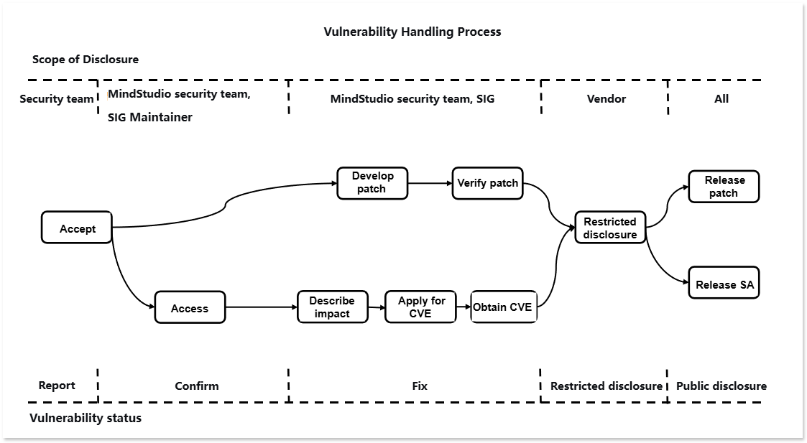

# MindStudio Vulnerability Handling Mechanism

<!-- md-trans-meta sourceCommit=e3a8deaf01b2d64c57c186060218bcdec0b74bc9 translatedAt=2026-08-12T07:36:26.971Z pushedAt=2026-08-12T07:36:50.048Z -->

The MindStudio community places great emphasis on the security of its community version and has designated a vulnerability management specialist to handle vulnerability-related matters. To build a more secure full-process AI toolchain, we also welcome your participation.

## Vulnerability Handling Process

For each security vulnerability, the MindStudio community assigns personnel to track and handle it. The end-to-end vulnerability handling process is illustrated in the following figure.

The following sections focus on explaining the processes of vulnerability reporting, Vulnerability Assessment, and vulnerability disclosure.

## Vulnerability Reporting

You can contact the MindStudio community team by submitting an Issue, and we will promptly assign a security vulnerability specialist to contact you. Note: To ensure security, do not describe specific security and privacy information in the Issue.

### Report Response

1. The MindStudio community will confirm, analyze, and report the security vulnerability issue within 3 working days, and simultaneously initiate the security handling process.

2. After confirming the security vulnerability issue, the MindStudio security team will distribute and follow up on the issue.

3. We will update the report in a timely manner throughout the process of classification, confirmation, remediation, and disclosure of the security vulnerability issue.

## Vulnerability Assessment

The industry widely uses the CVSS standard to assess the severity of vulnerabilities. When MindStudio uses CVSS v3.1 for vulnerability assessment, it is necessary to define the attack scenario and evaluate based on the actual impact under that scenario. Severity level assessment refers to evaluating the difficulty of exploiting a vulnerability and its impact on Confidentiality, Integrity, and Availability after exploitation, and generating a score.

### Vulnerability Assessment Criteria

MindStudio evaluates the severity level of a vulnerability using the following vectors:

- Attack Vector (AV): Indicates the "remoteness" of the attack and how this vulnerability can be exploited.

- Attack Complexity (AC): Describes the difficulty of executing the attack and the factors required for a successful attack.

- User Interaction (UI): Determines whether user participation is required for the attack.

- Privileges Required (PR): Records the level of user authentication required for a successful attack.

- Scope (S): Determines whether an attacker can affect components with different privilege levels.

- Confidentiality (C): Measures the degree of impact caused by information disclosure to unauthorized parties.

- Integrity (I): Measures the degree of impact caused by information tampering.

- Availability (A): Measures the degree to which users are affected when they need to access data or services.

### Assessment Principles

- Assess the severity level of a vulnerability, not the risk.

- The assessment must be based on an attack scenario, and it must be ensured that under that scenario, a successful attack by the attacker can cause impacts on Confidentiality, Integrity, and Availability of the system.

- When a security vulnerability has multiple attack scenarios, the assessment shall be based on the scenario that causes the greatest impact, i.e., the attack scenario with the highest CVSS score.

- For vulnerabilities in embedded or invoked libraries, the assessment shall be conducted after determining the attack scenario of the vulnerability based on how the library is used in the product.

- If a security defect cannot be triggered or does not affect CIA (Confidentiality, Integrity, Availability), the CVSS score is 0.0.

### Assessment Steps

To assess the severity level of a vulnerability, follow these steps:

1. Define possible attack scenarios and score based on the attack scenarios.

2. Identify the Vulnerable Component and the Impact Component.

3. Select the values for the base metrics.

   - Exploitability Metrics (Attack Vector, Attack Complexity, Privileges Required, User Interaction, Scope): Select metric values based on the vulnerable component.

   - Impact Metrics (Confidentiality, Integrity, Availability): Reflect either the impact on the vulnerable component or the impact on the affected component, whichever results in the more severe outcome.

### Severity Level

| **Severity Level** | **CVSS Score** | **Vulnerability Remediation Timeframe** |
| ------------------------------- | --------------------- | ---------------- |
| Critical                | 9.0–10.0              | 7 days              |
| High                      | 7.0–8.9               | 14 days             |
| Medium                    | 4.0–6.9               | 30 days             |
| Low                       | 0.1–3.9               | 30 days             |

## Vulnerability Disclosure

After a security vulnerability is remediated, the MindStudio community will publish a Security Advisory (SA) and a Security Notice (SN). The Security Advisory includes information such as the technical details of the vulnerability, its type, the reporter, the CVE ID, and the affected and fixed versions. To protect the security of MindStudio users, the MindStudio community will not publicly disclose, discuss, or confirm any security issues in MindStudio products until the investigation, remediation, and Security Advisory publication are complete.

## Appendixes

### MindStudio Security Advisory (SA)

Currently under maintenance release, no security vulnerabilities.

### MindStudio Security Note (SN)

Vulnerability notes for third-party open source components:

| CVE ID | Third-Party Component Name | Affected MindStudio Tool/Plugin Name | Status | Description |
| ------ | -------------------------- | ------------------------------------ | ------ | ----------- |
|        |                            |                                      |        |             |
