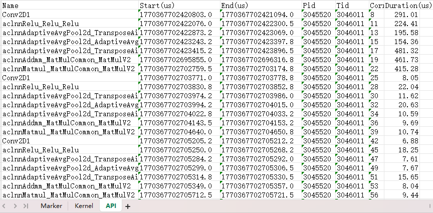

# Monitor 特性介绍

## 简介

Monitor 是集成在MindStudio Monitor中的一套接口，用户可以通过调用这些接口来开启、停止性能监测，以及获取监测数据。

## 使用前准备

安装msMonitor工具。详情请参见《[msMonitor工具安装指南](../install_guide/msmonitor_install_guide.md)》，推荐使用下载软件包安装。

## Monitor功能介绍

**功能说明**

提供简单易用接口，采集计算类算子、通信类算子、API、Runtime API、Mstx等性能数据，用户可以根据需要选择采集的指标。此外，支持通过 DCMI 接口采集 NPU 卡的设备级指标（Power、Temp）与各硬件层指标（AICore 频率/利用率、AICPU 最大/当前频率与利用率、HBM 片上内存频率/容量/用量/带宽/温度等），并支持将结果以 Chrome Trace JSON 格式导出，便于在 `chrome://tracing` 或 Perfetto 中以时间轴条形图（算子耗时）+ 曲线（设备指标变化趋势）方式按硬件层可视化分析。

**接口说明**

参考mindstudio_monitor的[Monitor特性接口说明](./mindstudio_monitor_api_reference.md#monitor特性接口说明)。

**使用示例**

1. 在模型 Python 脚本中引入 Monitor 接口。

   ```python
   from msmonitor import Monitor, ActivityKind, DcmiLayer
   ```

2. 在模型 Python 脚本中调用 Monitor 接口启动性能监测。

   ```python
   import torch
   import torch.nn as nn

   class FeatureExtractor(nn.Module):

       def __init__(self, in_channels=3, out_channels=16, kernel_size=3):
           super(FeatureExtractor, self).__init__()
           self.conv = nn.Conv2d(in_channels, out_channels, kernel_size, stride=1, padding=1)
           self.relu = nn.ReLU()
           self.pool = nn.AdaptiveAvgPool2d((4, 4))

       def forward(self, x):
           x = self.conv(x)
           x = self.relu(x)
           x = self.pool(x)
           return x

   from msmonitor import Monitor, ActivityKind, DcmiLayer

   # 开启性能监测：算子类数据 + DCMI 设备指标
   # DCMI 按硬件层配置：选择某层即采集该层全部可得指标（无需逐项枚举）。
   monitor = Monitor()
   monitor.start(
       kinds=[
           ActivityKind.API,
           ActivityKind.Kernel,
           ActivityKind.Marker
       ],
       dcmi_layers=[
           DcmiLayer.DEVICE,   # Power / Temp
           DcmiLayer.AICORE,   # AICore 频率 / 利用率族
           DcmiLayer.AICPU,    # AICPU 最大/当前频率、利用率
           DcmiLayer.HBM,      # 片上内存频率/容量/用量/带宽/温度
       ],
       dcmi_interval_ms=10,    # DCMI 采样间隔，默认 10ms
   )

   # 模型运行
   batch_size = 4
   input_tensor = torch.randn(batch_size, 3, 32, 32).npu()
   extractor = FeatureExtractor(in_channels=3, out_channels=16, kernel_size=3).npu()
   linear_layer = nn.Linear(in_features=256, out_features=128).npu()

   for i in range(10):
       range_id = torch.npu.mstx.range_start(f"step {i}", torch.npu.current_stream())
       features = extractor(input_tensor)
       flat_features = features.view(batch_size, -1)
       x = linear_layer(flat_features)
       w = torch.randn(128, 64).npu()
       y = torch.matmul(x, w)
       torch.npu.mstx.range_end(range_id)

   torch.npu.synchronize()

   # 停止性能监测
   monitor.stop()

   # （可选）在线获取性能数据，参考步骤3
   result = monitor.get_result()

   # （可选）将性能数据保存到本地（start 已指定输出目录，save 无参导出 xlsx/json/log），参考步骤4
   monitor.save()
   ```

3. （可选）可通过在线方式获取性能数据，返回的数据结构请参考[ActivityData数据结构](./mindstudio_monitor_api_reference.md#activitydata数据结构)。返回字典的 key 包含已开启的 `ActivityKind` 与 DCMI 样本列表（统一以 `DCMI` 作为 key，元素为 `DcmiSample`，字段含指标 kind、时间戳、设备ID、数值）。

   ```python
   # 获取性能数据并打印
   result = monitor.get_result()
   for kind, data in result.items():
       for item in data:
           print(f"kind: {kind}, name: {item.name}, durationNs: {item.endNs-item.startNs}")
   ```

4. （可选）将性能数据保存到本地：`save()` 无参导出，输出目录在 `start(save_path=...)` 时已确定——start 即在其下创建 `msmonitor_<pid>_<时间戳>/` 会话目录，glog 从开始直接写入其 `log/`，save 只补充 xlsx/json，无任何移动/复制：

   ```python
   # start 时指定输出目录（会话目录直接建在其下）
   monitor.start(..., save_path="./out")
   # 导出：./out/msmonitor_<pid>_<时间戳>/monitor_result.xlsx + monitor_result.json + log/
   monitor.save()
   ```

   > 仅在线获取数据（不落盘）时省略 `save_path`：`start(..., save_path=None)` 不创建会话目录，
   > 不保存日志文件，直接通过 `get_result()` 在内存中取数，此时调用 `save()` 会提示无会话目录。

   - `monitor_result.xlsx`：Excel（多 Sheet，含算子耗时、DCMI 指标 Sheet）。
   - `monitor_result.json`：Chrome Trace JSON，可在 `chrome://tracing` 或 Perfetto 打开，算子耗时以条形图（X 事件）、DCMI 指标以曲线（C counter 事件）按硬件层分进程呈现。
   - `log/` 子目录：当前进程的 C++ glog 运行日志，`start()` 起 glog 就写入其中（无外层临时日志目录）。

   > 端到端运行示例参见系统测试用例 [`test/st/test_dcmi_fa_comm_multistream.py`](../../../test/st/test_dcmi_fa_comm_multistream.py)（FA 多流计算 + DCMI 采集 + 导出校验）。

## 输出结果文件说明

落盘的 Excel 文件包含多个 Sheet 页，每个 Sheet 页对应一种采集的数据类型，例如 API、Kernel、Marker 等，用户可通过查看不同 Sheet 页来分析算子、API的执行耗时情况。

如下图所示：



各个Sheet页的字段说明如下：

### Marker

* `Name`: mstx打点消息内容
* `SourceKind`: 消息来源类型，"Host" 或 "Device"
* `Domain`: 消息所属 domain 名称
* `ID`: 消息ID
* `Start(us)`: mstx打点开始时间，单位：us
* `End(us)`: mstx打点结束时间，单位：us
* `Pid`: SourceKind 为 "Host" 时为进程ID，为 "Device" 时为 0
* `Tid`: SourceKind 为 "Host" 时为线程ID，为 "Device" 时为 0
* `Device ID`: SourceKind 为 "Device" 时为marker所属设备ID，为 "Host" 时为 0
* `Stream ID`: SourceKind 为 "Device" 时为marker所属流ID，为 "Host" 时为 0
* `Duration(us)`: mstx打点执行时间，单位：us

### Kernel

* `Name`: 计算类算子名称
* `Start(us)`: 算子执行开始时间，单位：us
* `End(us)`: 算子执行结束时间，单位：us
* `Device ID`: 算子执行所在的设备ID
* `Stream ID`: 算子执行所在的流ID
* `Correlation ID`: 算子执行关联ID，用于和API数据关联
* `Type`: 算子类型，例如 "KERNEL_AICORE"、"KERNEL_AIVEC"、"KERNEL_AICPU" 等
* `Duration(us)`: 算子执行时间，单位：us

### Communication

* `Name`: 通信类算子名称
* `Start(us)`: 算子执行开始时间，单位：us
* `End(us)`: 算子执行结束时间，单位：us
* `Device ID`: 算子执行所在的设备ID
* `Stream ID`: 算子执行所在的流ID
* `Count`: 算子传输的数据量
* `DataType`: 算子传输的数据类型，例如 "FP32"、"INT8" 等
* `CommName`: 算子所属通信域名称
* `AlgType`: 算子所属通信算法类型，例如 "RING"、"MESH" 等
* `Correlation ID`: 算子执行关联ID，用于和API数据关联
* `Duration(us)`: 算子执行时间，单位：us

### API、AclAPI、NodeAPI、RuntimeAPI

* `Name`: API 名称
* `Start(us)`: API 调用开始时间，单位：us
* `End(us)`: API 调用结束时间，单位：us
* `Pid`: 调用 API 的进程ID
* `Tid`: 调用 API 的线程ID
* `Correlation ID`: API 调用关联ID，用于和Kernel/Communication数据关联
* `Duration(us)`: API 调用时间，单位：us

### DCMI

当 `start` 指定 `dcmi_layers` 时，Excel 会多出 `DCMI` Sheet 页。

`DCMI` Sheet 页每行对应一条 DCMI 采样样本（所有设备 × 所有指标扁平排列）：

* `Layer`: 指标所属硬件层，取值 `DEVICE` / `AICORE` / `AICPU` / `HBM`
* `Metric`: 指标名称，如 `Power`、`AICore Freq`、`AICPU Max Freq`、`HBM Memory Used` 等
* `Unit`: 指标单位，如 `W`、`MHz`、`%`、`MB`、`℃`
* `Timestamp(us)`: 采样时间戳，单位：us
* `Device ID`: 设备ID（扁平编号）
* `Value`: 采样值

### Chrome Trace（.json）

`save()` 生成的 Chrome Trace JSON（位于 `start(save_path)` 确定的 `out/msmonitor_<pid>_<时间戳>/` 文件夹内）可在 `chrome://tracing` 或 Perfetto（`ui.perfetto.dev`）中打开。事件按硬件层分进程呈现（每个设备 6 个进程，进程名如 `Device 0 · Ascend Hardware`）：

| 层 | 内容 | 呈现 |
|---|---|---|
| Ascend Hardware | mspti 采集的 Kernel / Communication 耗时条，每个 stream 一个泳道 | 条形图（X 事件） |
| Power/Temp | DEVICE 层指标（Power/Temp）曲线 | 曲线（C 事件） |
| AICore | AICore 当前/额定频率、利用率（含 AI Cube / Vector Core / NPU 利用率） | 曲线 |
| AICPU | AICPU 最大/当前运行频率、利用率 | 曲线 |
| HBM | 片上内存频率、总容量、已用内存、带宽利用率、温度 | 曲线 |
| Overlap Analysis | 每个设备一条泳道：Computing / Communication（Overlapped / Not Overlapped）/ Free | 耗时条 |

DCMI 采集在独立 C++ 线程中执行，不阻塞训练主流程；默认采样间隔 10ms，样本使用有界环形缓冲（上限 100 万条，超出覆盖最旧）。`libdcmi.so` 不可用或接口不支持时自动跳过对应指标，不影响算子类数据采集；加载/使能/失败的 DFX 信息在启动日志中打印，并写入 trace metadata（Chrome Trace 打开后可查看），供问题定位。
