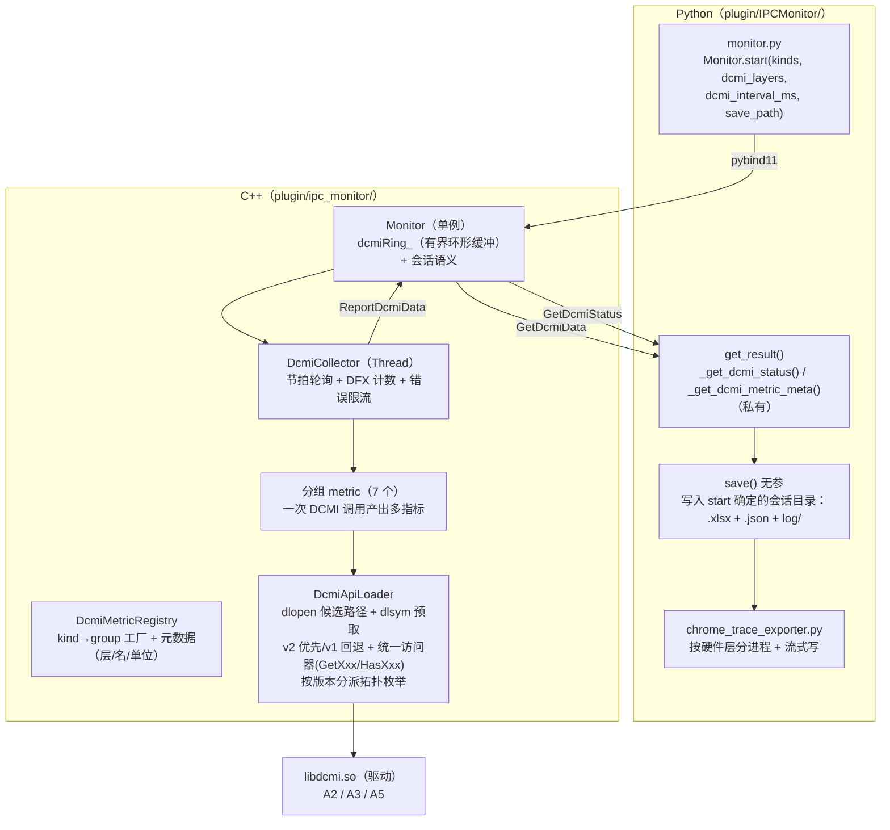
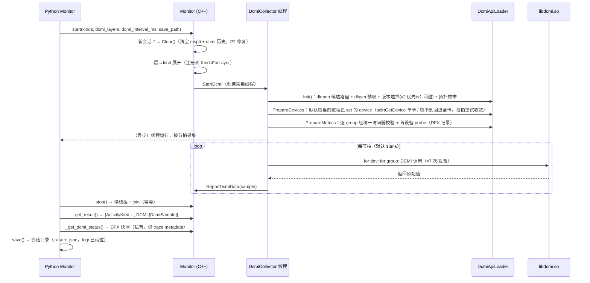
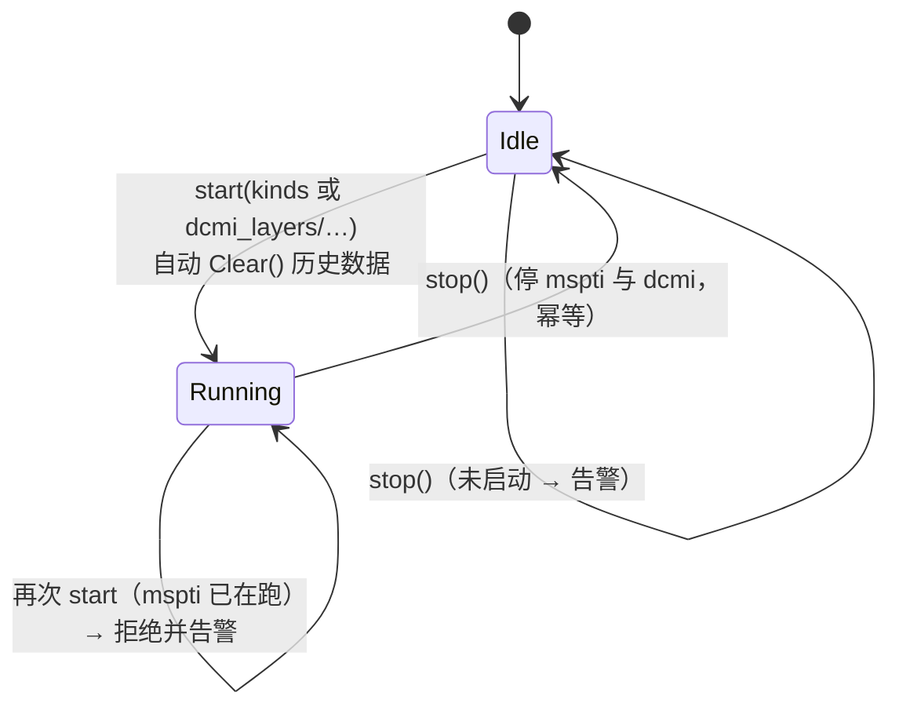
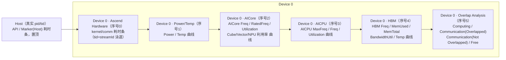
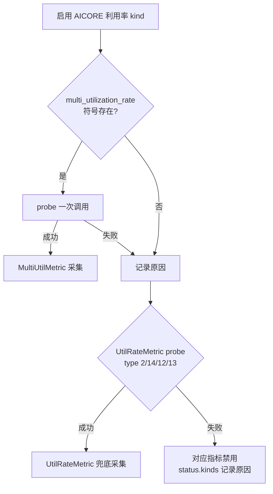
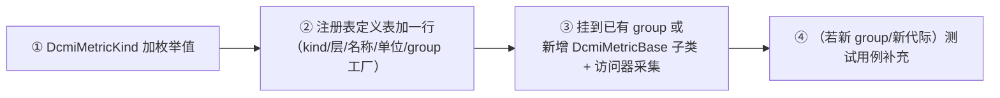

# msmonitor DCMI 采集 + Chrome Trace 分层可视化 技术方案设计（RFC）

**状态（Status）**：Draft

**作者（Authors）**：@kali20gakki1

**创建日期（Created）**：2026-08-22

**更新日期（Updated）**：2026-08-31

**相关 issue/PR**：参考实现 [Ascend/msmonitor !133（support dcmi collect）](https://gitcode.com/Ascend/msmonitor/pull/133)（本提案为在其评审意见基础上的重新设计）

---

# 1. 概述

## 1.1 简介

本提案为 `msmonitor` whl 包内置 Monitor API（`plugin/IPCMonitor/`）新增两项能力：

1. **DCMI 硬件指标采集**：以 C++ 独立线程通过 `dlopen` 动态加载 `libdcmi.so` 采集 NPU 卡设备级指标（功耗/温度）与各硬件层指标（AICore 频率与利用率、AICPU 最大/当前频率与利用率、HBM 片上内存频率/容量/用量/带宽利用率/温度），Python 接口**按硬件层（DEVICE/AICORE/AICPU/HBM）配置**采集项，与原有 `ActivityKind` 统一在 `Monitor.start()` 中配置。
2. **Chrome Trace JSON 可视化导出**：`Monitor.start(..., save_path)` 确定会话目录 `<save_path>/msmonitor_<pid>_<时间戳>/`（glog 从开始直接写入其 `log/`），`Monitor.save()` 无参导出，在其中生成 Chrome Trace JSON 与 Excel（`monitor_result.json` 可在 `chrome://tracing` / Perfetto 打开，kernel/comm 耗时条（X 事件）与 DCMI 指标曲线（C counter 事件）**按硬件层分进程**呈现，kernel 按 stream 分泳道），无移动/复制、无外层临时日志目录。

核心价值：把「算子耗时（软件视图）」与「硬件状态（功耗/频率/利用率，硬件视图）」在**同一时间轴**上对齐呈现，帮助定位训练/推理性能瓶颈究竟是"算子本身慢"还是"硬件被降频/受限/带宽打满"。

## 1.2 动机

- **现状痛点**：当前 Monitor 只能采集 mspti 算子类数据（Kernel/Communication/API/Marker），无法回答"算子在跑但硬件频率是多少、功耗多大、HBM 带宽是否打满、AICPU 是否成为瓶颈"这类问题；开发者排查性能问题需要另行使用 `npu-smi` 等命令手动采样，无法与算子时间轴对齐。
- **用户场景**：
  - 训练/推理性能分析：在 vLLM、PyTorch 训练脚本中一键开启采集，结束后在 Perfetto 中同时看到 kernel 泳道与 AICore 频率/利用率曲线，判断是否 DVFS 降频、HBM 带宽是否饱和。
  - 硬件健康/趋势观测：长时间采集 power/temp 曲线，观察功耗爬升与温度趋势（压测场景）。
  - 故障定位：`libdcmi.so` 缺失、接口不支持（代际差异）、调用返回错误等异常需要有明确的 DFX 手段可查，而不是静默失败。
- **必要性**：DCMI 接口是昇腾硬件唯一统一的设备级指标接口，官方文档覆盖 A2/A3/中心训练卡（A5/950）全代际；不做此提案则 Monitor 的硬件视图能力长期缺失。
- **不做的影响**：用户继续依赖手工 `npu-smi` 采样，无法与算子时间轴对齐，问题定位效率低。

## 1.3 目标

**目标**：

- G1：DCMI 以 C++ 独立线程采集，Python 接口按硬件层配置采集项，采集开销极小（全层每设备每节拍 ≈7 次 DCMI 调用、≈16 个样本）。
- G2：Monitor 接口统一配置原有 `ActivityKind` 与新增 `DcmiLayer`。
- G3：导出兼顾 Excel 与 Chrome Trace（dcmi 曲线、kernel/comm 耗时条），按硬件层分进程呈现。
- G4：DCMI 模块易扩展（注册表 + 分组 metric 抽象，新增指标零改动 Collector/Exporter）。
- G5：DFX 完备——so 加载失败、符号缺失、接口返回错误均有定位手段（启动日志汇总 + trace metadata 内嵌状态）。
- G6：兼容 A2 / A3 / A5（950）代际芯片——**DCMI v2 优先、v1 自动回退**（v1-only 库直接走 v1，v2-only 库走 v2），自动适配每卡 NPU 芯片数与接口差异。

# 2. 用例分析

## 2.1 用例清单

| 编号 | 用例 | 描述 | 关键性能指标 | DFX 要求 |
|---|---|---|---|---|
| UC1 | 训练/推理性能联合分析 | 采集 Kernel/Communication + 全硬件层 DCMI，导出 Chrome Trace 在同一时间轴查看 | 采样间隔 ≤10ms 不影响训练主流程；导出文件可被 Perfetto 正常打开 | 采集异常不阻断训练；trace 自描述（metadata 含 DFX 状态） |
| UC2 | 硬件趋势/压测观测 | 仅采集 DCMI（高负载跑算子），观测 power/temp/freq/带宽曲线 | 10ms 级采样；ring 有界不 OOM | 溢出/超时可见（`ringDropCount`/`overrunCount`） |
| UC3 | 表格化分析 | Excel 导出：DCMI 样本 + DFX 状态 Sheet，便于脚本/人工分析 | 百万级样本可导出 | DCMI Sheet 含层/单位，状态 Sheet 含加载与使能信息 |
| UC4 | 故障定位 | `libdcmi.so` 缺失 / 符号缺失 / 接口不支持 / 调用返回错误时快速定位 | 错误日志限流不刷屏 | 启动日志汇总加载状态、缺失符号、使能原因、失败计数；写入 trace metadata |
| UC5 | 多代际部署 | 同一 whl 在 A2 / A3 / A5 上运行 | 自动适配，无人工配置 | 不支持的类型自动禁用并给出原因 |

## 2.2 使用限制与约束

| 约束 | 说明 |
|---|---|
| 运行环境 | 仅 Linux（依赖 `dlopen`/`pthread`），NPU 驱动已安装且 `libdcmi.so` 可加载（默认搜索 LD_LIBRARY_PATH 与固定候选路径） |
| 权限 | 裸机 root/非 root 均可（官方支持矩阵）；容器场景需 root 且部分接口不支持（如 AVI 容器内带宽利用率为 0） |
| 代际差异 | A2/A3 支持 utilization type 2,3,4,6,10,12,13,14；A5（训练卡）支持 1,2,3,4,5,6,10——不支持的指标自动禁用并提示 |
| 采样与存储 | 默认 10ms 间隔、样本环形缓冲固定 100 万条（内部策略，满覆盖最旧）；长时高采样会导致 ring 覆盖或 trace 文件偏大，需按场景调大 interval |
| 数据安全 | 仅采集设备级公开指标（功耗/频率/温度/利用率/内存），不采集用户数据、算子入参、权重等 |

# 3. 方案设计

## 3.1 总体方案

### 3.1.1 总体架构



### 3.1.2 数据链路（时序）



### 3.1.3 会话语义（状态机）



### 3.1.4 Chrome Trace 分层呈现

每个设备在 trace 中呈现为 6 个进程（`pid = 1_000_000 + 设备号×6 + 序号`，`process_sort_index`：Host=0 置顶，设备按 1000+序号；Host 用真实 pid）：



## 3.2 技术选型

| 方案 | 备选 | 选型 | 对比结论 |
|---|---|---|---|
| DCMI 接入方式 | A：编译期链接 DCMI 头文件/库 | **B：`dlopen`/`dlsym` 动态加载** | A 依赖驱动开发包且与 driver 版本强绑定；B 无编译期依赖、符号缺失可降级、采集期零解析开销（dlsym 一次性预取），对齐 CANN `prof_timer` 模式 |
| Python 配置模型 | A：扁平 `DcmiMetricKind` 枚举（17 项）逐个选 | **B：按硬件层 `DcmiLayer` 配置** | A 项多、与底层"一个接口返回同层多指标"事实脱节；B 层=接口天然对应（HBM 层↔`hbm_info`），选层即全采，配置少且开销可预期 |
| 采集调用模型 | A：每指标一次 DCMI 调用（3 项=3 次） | **B：分组 metric，一次接口调用产出多 kind** | A 调用次数随指标线性膨胀；B 每层 ≤2 次调用（struct API 批量返回），全层仅 ≈7 次 |
| 利用率采集 | A：仅 `dcmi_get_device_utilization_rate` 逐 type | **B：优先 `multi_utilization_rate`（1 次返回 4 项），缺失/失败降级 A** | B 调用更省；降级路径由 probe 自动决策，适配代际差异 |
| 样本存储 | A：无界 vector | **B：有界环形缓冲（默认 1M，满覆盖最旧）** | A 长跑 OOM；B 内存有界且溢出可计数（DFX） |
| 导出实现位置 | A：C++ 生成 | **B：Python（`chrome_trace_exporter.py`）** | 数据已经 pybind 到 Python，Excel 导出本就在 Python；B 保持 C++ 轻、复用现有文件管理，流式写控内存 |
| 线程模型 | A：每设备一线程 | **B：单线程轮询所有设备×指标** | 对齐 `prof_timer`；7 次调用/设备/节拍在默认 10ms 节拍下开销充裕，超时自动降频，避免线程爆炸 |
| 枚举扩展 | A：扩展第三方 `msptiActivityKind` | **B：独立 `DcmiLayer`/`DcmiMetricKind`** | mspti 枚举不可改；独立枚举 + 注册表元数据实现单一数据源 |
| 版本策略 | A：仅 v1（PR !133 方案） | **B：v2 优先 + v1 自动回退** | 950 为 v2-only（v1 init -8255）；910B 无 dcmiv2 符号自动走 v1；A3 等新驱动双栈自动用 v2——v2 优先对三代均正确且前瞻 |
| 代际分派位置 | A：各 metric 内 `if (v2) ... else ...` | **B：`DcmiApiLoader` 统一访问器（`GetXxx`/`HasXxx`）** | 分派收敛到 loader 一处，metric 层零代际分支；新增 DCMI 版本/接口只改 loader |

## 3.3 功能与性能设计

### 3.3.1 功能点

| 功能 | 说明 |
|---|---|
| 层配置展开 | `Monitor.start(dcmi_layers=...)` → C++ 注册表 `KindsForLayer(layer)` 展开为 kind 集合 |
| 采集 | 独立线程节拍采集；不暴露 devices 参数，默认取当前进程已 set 的 device（`aclrtGetDevice`），取不到回退全部可见卡并每拍重试收敛单卡 |
| 版本适配 | `DcmiApiLoader` v2 优先（`dcmiv2_init` + `dcmiv2_get_device_list`），符号缺失/init 失败/枚举失败自动回退 v1；失败合并报因（DFX） |
| 降级 | 多接口/多类型经统一访问器逐项 probe；不支持的指标自动禁用并记录原因；`multi_utilization` 缺失时 UtilRate 逐 type 兜底 |
| 导出 | `.xlsx`（DCMI Sheet）、`.json`（Chrome Trace 分层 + Overlap Analysis） |
| DFX | 状态快照（含 version/各接口耗时）经私有 `_get_dcmi_status()` 供 trace metadata；错误日志限流；停止汇总日志；启动提示不可采集指标 |

### 3.3.2 数据模型

**DcmiSample**（每行一条采样）：

| 字段 | 类型 | 说明 |
|---|---|---|
| kind | DcmiMetricKind | 指标类型 |
| timestampNs | uint64 | 采样时间戳（ns） |
| deviceId | int32 | 扁平设备号 |
| value | double | 采样值（单位见注册表元数据） |

**DcmiMetricMeta**（注册表维护，Python 导出/DFX 的单一数据源）：

| 字段 | 说明 |
|---|---|
| kind / layer | 指标类型 / 所属硬件层 |
| name / displayName | 枚举名 / 展示名（如 `AICore Freq`） |
| unit | 单位（`W`/`MHz`/`%`/`MB`/`℃`） |

**DcmiStatusSnapshot**（私有 `_get_dcmi_status()` 返回，DFX）：

| 字段 | 说明 |
|---|---|
| load | 加载状态（statusName、命中路径、缺失符号、dcmi_init 返回码、卡数/每卡芯片数、采集设备列表、错误原因） |
| kinds | 每指标使能状态与未使能原因 |
| tickCount / overrunCount | 节拍数 / 超时次数（超时自动降频） |
| ringDropCount / ringSize / ringCapacity | ring 满覆盖次数 / 当前样本数 / 容量 |
| groupFailCounts / lastErrorCodes | 各接口调用失败次数 / 最近错误码 |

### 3.3.3 性能设计

**每设备每节拍调用开销**（全层 16 项指标）：

| Group | DCMI 调用 | 产出 kind 数 | 单位 |
|---|---|---|---|
| PowerMetric | `power_info` | 1 | W（×0.1） |
| TempMetric | `temperature` | 1 | ℃ |
| AicoreInfoMetric | `aicore_info` | 2 | MHz |
| MultiUtilMetric | `multi_utilization_rate` | 4 | % |
| AicpuInfoMetric | `aicpu_info` | 2 | MHz |
| UtilRateMetric | `utilization_rate`(type=3) | 1 | % |
| HbmInfoMetric | `hbm_info` | 5 | MB/MHz/%/℃ |
| **合计** | **≈7 次调用** | **≈16 样本** | |

**开销预算**（DCMI ioctl 典型 ≤50μs/次，参考 `prof_timer` 实测；**真机实测 utilization_rate 可达 ~36ms/次**）：

| 场景 | 调用数/节拍 | 估算耗时 | 结论 |
|---|---|---|---|
| 单设备 × 全层 | 7 | ≤350μs（util 接口慢时经节流控制在预算内） | 1ms 节拍可行 |
| 8 设备 × 全层 | 56 | ≥2.8ms（util 慢时可达 1.5s） | 超时自动降频 + **自动收敛单卡** + **慢接口节流** |
| 单设备 × 单层（如仅 HBM） | 1~2 | ≤100μs | 1ms 节拍充裕 |

**真机实测与对策（2026-08-22 ~ 08-24，910B 与 950 服务器）**：

- 910B（v1-only）：`dcmi_get_device_utilization_rate` 单次调用 ≈36ms（驱动行为），且该机 `libdcmi.so` 缺 `dcmi_get_device_multi_utilization_rate` 符号 → 利用率需 5 次逐 type 调用 → 每节拍 8 设备 × 5 = 40 次 ≈ 1.46s，占节拍 92%。
- 950（v2-only）：v1 全链路返回 -8255，v2 生效后 `multi_utilization_rate`/`hbm_info` 等结构体接口一次返回多值，**全量 16 项指标可用**，无 910B 的利用率逐 type 问题；`utilization_rate`(AICPUUtil) 同样较慢（~36ms/次），节流继续生效。
- 对策 1（**慢接口节流**）：`DcmiMetricBase::SampleEveryTicks()` 按 group 降频，UtilRateMetric 默认每 10 拍采集一次，单拍预算回落至毫秒级。
- 对策 2（**自动收敛单卡**）：不暴露 devices 参数；若启动时 `aclrtGetDevice` 取不到当前设备（start 早于 torch set_device），先回退全卡，采集线程**每拍重试**，一旦取到当前设备即收敛为单卡。
- 对策 3（**最终采样**）：stop 时补一拍最终采样（跳过慢接口节流门控），保证曲线覆盖到停止时刻、与 kernel 窗口尾部重合。
- 对策 4（DFX 闭环）：stop 后保留 collector 状态，经私有 `_get_dcmi_status()` 持续可读并写入 trace metadata；`version/groupCallCounts/groupCollectNs/lastTickCollectUs` 可逐接口核对耗时与降频是否生效。
- 对策 5（**最终采样拍时间戳取采集完成时刻**）：普通拍样本时间戳取节拍开始（同拍各指标起点对齐）；仅最终拍改在采集完成后打点，避免慢接口（utilization_rate 可达百 ms 级）令最后样本早于真实停止时刻、timeline 尾部空洞（2026-08-31 实测两轮修复：先逐 group 打点导致各指标起点错位，收敛为仅最终拍取拍末）；配合示例在 stop 前同步全部计算流，DCMI 曲线尾部与 kernel 窗口重合。

**内存预算**：

| 项 | 预算 |
|---|---|
| ring 容量默认 100 万 × DcmiSample（≈32B） | ≈32MB（覆盖最旧，有界） |
| 导出 JSON（1M 样本 × ≈90B） | ≈90MB 最坏（流式写，不整树驻留） |

**降频机制**：节拍开始若已超时，`nextNs = now + interval`（不追赶），`overrunCount++`，保证采集线程不会堆积突发补采。

### 3.3.4 边界场景设计

| 边界场景 | 行为 | 验证点 |
|---|---|---|
| `libdcmi.so` 缺失/不可加载 | `Init()` 返回 NOT_SUPPORT，`LOG(WARNING)` 一次，DCMI 整体禁用，算子类采集不受影响 | status.load.statusName=NOT_SUPPORT + error 可读 |
| v1-only 库（910B，无 dcmiv2 符号） | v2 分支 dlsym 判空即跳过，直接走 v1 | version=V1，正常采集 |
| v2-only 库（950，v1 init -8255） | v1 尝试失败 → 自动 v2（`dcmiv2_init` + `dcmiv2_get_device_list`） | version=V2，16 项全采 |
| v2 init 成功但 v2 枚举失败 | 回退 v1；两者均失败时合并报因 | status.error 含 `v2(原因); v1(原因)` |
| 关键符号缺失（无 init/枚举） | NOT_SUPPORT，`missingSymbols` 列出缺失符号 | 日志与 status 均可定位 |
| 非核心符号缺失（如 `dcmi_get_dcmi_version`） | 仅记录，不阻断 | 正常采集 |
| 单卡/多卡设备枚举失败 | 跳过失败卡，其余正常；全失败则 FAILED | 枚举结果入 status |
| 当前设备未 set（start 早于 torch set_device） | 回退全卡 + 每拍重试 `aclrtGetDevice`，取到后收敛单卡 | 不崩溃，收敛后只采当前卡 |
| 目标设备上接口类型不支持（代际差异） | probe 失败 → 该指标禁用 + 原因记录，其余指标正常 | status.kinds 中 reason 明确 |
| `multi_utilization` 缺失 → AICORE 利用率兜底 | 自动创建 UtilRateMetric 按 type 2/14/12/13 接管 | status.kinds 显示启用来源 |
| 采集节拍超时 | 自动降频 + overrunCount++，不追赶 | 长跑无堆积、计数可见 |
| 最终采样 | stop 时补一拍（跳过慢接口节流），曲线覆盖到停止时刻 | 曲线尾部与 kernel 窗口重合 |
| ring 满 | 覆盖最旧 + `ringDropCount++`（DFX）；ring 容量固定 1M（内部策略） | 长跑内存有界 |
| `start()` 无任何 kinds/层/指标 | `[ERROR]` 提示并返回，不启动 | 不崩溃 |
| 非法参数（类型不对/非正数） | Python 侧校验 `[ERROR]` 返回；C++ 侧合法集合过滤 | 边界输入不穿透到 C++ |
| 会话残留数据（先 mspti 后仅 DCMI） | 新会话启动一律 `Clear()`，避免混合数据（P2） | get_result 不含旧样本 |
| mspti 已在跑时再次 start | 拒绝并告警（沿用现状） | 不重复启动 |
| stop() 未启动/重复调用 | 幂等，未启动仅告警 | 不崩溃、不挂死 |
| 采集线程 Stop 延迟 | 分段睡眠 ≤1ms，join 及时返回 | 无长时间阻塞 |
| 大样本导出（1M+） | 流式写 JSON；Excel 逐行写 | 内存不随样本线性增长 |
| 容器/AVI 场景 | 不支持的接口 probe 失败自动禁用；带宽等为 0 时正常输出 | 无异常，status 可查 |

### 3.3.5 测试用例设计

#### 3.3.5.1 单元测试（C++ gtest，`python build.py test local`）

| 用例 | 覆盖点 | 断言要点 |
|---|---|---|
| test_DcmiRingBuffer | 环形缓冲 Push/Snapshot/Clear/覆盖/容量 0 | 顺序、满覆盖返回 true、Clear 后为空、容量 0 安全 |
| test_DcmiMetricRegistry | 层→kind 展开、group 去重、未知 kind 忽略、元数据完整、UtilRate 兜底创建 | DEVICE 层=2 项、AICORE 层=AicoreInfo+MultiUtil 两 group、meta≥16 项 |
| test_DcmiCollector | 假 loader 注入（`InjectForTest`）+ 假 metric：节拍采样、失败计数与限流、无效设备拒绝、Stop 幂等、无启用指标拒绝 | tickCount≥1、样本≥1、failCount≥1 且 lastErrorCode=42、无样本 |
| test_DcmiMonitorSession | ring 清空、DCMI-only 会话启动清旧数据（P2 回归）、无输入拒绝、状态快照、ring 固定容量 | 旧样本被清、ringCapacity=1M、无崩溃 |

#### 3.3.5.2 Python 单测（`python -m unittest discover -s test/ut/python`）

| 用例 | 覆盖点 | 断言要点 |
|---|---|---|
| test_chrome_trace_exporter | schema、kernel 分层 pid/tid、DCMI 曲线进正确层、时间基准归一、进程/线程命名、Host 置顶排序、Overlap Analysis 计算/通信/Free 区间、metadata 内嵌状态 | `pid=1M+dev×6+序号`、counter 名含单位、最小时间戳归零、Host sort_index=0 |
| test_monitor_dispatch | start 校验与参数透传（kinds/layers/interval/save_path）、get_result 合并 DCMI、save() 无参写入会话目录、`get_dcmi_status` 收敛为私有 | 非法输入不调用 C++、参数顺序/默认值（interval=10、save_path=None 仅在线）正确 |

#### 3.3.5.3 集成与真机验收用例（A2 / A3 / A5 各执行一遍）

| 用例 | 步骤 | 预期 |
|---|---|---|
| 端到端（st） | `python test/st/test_dcmi_fa_comm_multistream.py` | 每 rank 产出会话目录（xlsx/json/log），json 内 DCMI counter 与 kernel 事件非空（自动断言）；Perfetto 打开见 6 层进程（Host 置顶 + 每设备 6 层）、kernel 泳道、曲线与算子时间轴对齐、Overlap Analysis 行 |
| 代际切换 | 分别在 v1-only（910B）、v2-only（950）、双栈（A3，待验证）机型运行 st 端到端用例 | version 自动为 V1/V2/V2，16 项指标均可采集 |
| 故障演练 1 | 临时改名 `libdcmi.so` | 不崩溃，DCMI 禁用，算子采集正常，trace metadata 有原因 |
| 故障演练 2 | 构造不支持类型（如强制 probe 失败） | 对应指标禁用，其余正常 |
| 长跑稳定性 | 100ms 间隔跑 10 分钟 | 无内存增长（ring 有界）、无日志刷屏 |

### 3.3.6 影响范围

- 修改：`monitor/Monitor.{h,cpp}`、`plugin/bindings.cpp`、`plugin/CMakeLists.txt`、`plugin/IPCMonitor/{monitor.py,__init__.py}`、`test/ut/plugin/ipc_monitor/CMakeLists.txt`。
- 新增：`plugin/ipc_monitor/dcmi/*`（9 文件）、`plugin/IPCMonitor/chrome_trace_exporter.py`、`test/ut/python/*`、`test/st/test_dcmi_fa_comm_multistream.py`（端到端）、本文档。
- 向后兼容：`start(kinds)` 旧调用方式不变（新参数带默认值，`devices` 已移除、新增 `save_path`）；`save()` 不再接收路径（输出目录由 `start(save_path)` 确定）；`get_result()` 无 DCMI 时键集合与旧版一致（新增 `DCMI` 键仅在启用 DCMI 时出现）。

## 3.4 安全隐私与DFX设计

### 3.4.1 兼容性（A2 / A3 / A5）

**官方文档确认的接口表面与单位**（26.1.x DCMI API 参考：A2/A3/中心训练卡三份）：

| API | 签名要点 | 单位 | 代际差异 |
|---|---|---|---|
| `dcmi_get_device_power_info` | `(card, dev, int *power)` | **0.1W** | 三代一致 |
| `dcmi_get_device_temperature` | `(card, dev, int *temp)` | ℃ | 三代一致 |
| `dcmi_get_device_aicore_info` | `struct {freq, cur_freq}` | MHz | 三代一致 |
| `dcmi_get_device_aicpu_info` | `struct {max_freq, cur_freq, aicpu_num, util_rate[]}` | MHz | 三代一致 |
| `dcmi_get_device_hbm_info` | `struct {memory_size, freq, memory_usage, temp, bandwith_util_rate}` | MB/MHz/%/℃ | 三代一致 |
| `dcmi_get_device_multi_utilization_rate` | `struct {aic_util, aiv_util, aicore_util, npu_util}` | % | 三代一致 |
| `dcmi_get_device_utilization_rate` | `(card, dev, type, unsigned int*)` | % | A2/A3 支持 2,3,4,6,10,12,13,14；A5 支持 1,2,3,4,5,6,10 |
| `dcmi_get_device_id_in_card` | `(card, &device_id_max, &mcu_id, &cpu_id)` | - | **A2/A5 每卡 1 片 NPU，A3 每卡 2 片 NPU** |

**适配机制**（代码不硬编码代际名）：

1. **版本选择**：v2 优先（`dcmiv2_init` + `dcmiv2_get_device_list`），符号缺失/init 失败/枚举失败自动回退 v1（`dcmi_init` + `dcmi_get_card_list` + `dcmi_get_device_id_in_card`）；`LoadInfo.version` 标识生效版本。
2. **统一访问器**：`DcmiApiLoader::GetXxx/HasXxx` 按版本分派（v1 用 (card,dev)，v2 用扁平 dev_id），metric 层零代际分支。
3. 逐指标 probe：Init 阶段经访问器校验 + 首设备调用；type 不支持 → 自动禁用并记录原因。
4. 利用率双路径：`multi_utilization_rate` 缺失/失败 → `utilization_rate` 按 type 兜底。

**DCMI v2（950 实测，签名来自 950 的 `dcmi_interface_api.h`）**：

v2 为**扁平 dev_id 模型**（单参），结构体布局与 v1 一致：

| API | 签名 | 说明 |
|---|---|---|
| `dcmiv2_init` | `int(void)` | v2 初始化 |
| `dcmiv2_get_device_list` | `int(int *device_list, int *device_cnt, int list_len)` | 扁平设备枚举（950 为 8） |
| `dcmiv2_get_device_power_info` / `temperature` | `int(int dev_id, int *out)` | 单参 |
| `dcmiv2_get_device_frequency` | `int(int dev_id, enum dcmi_freq_type, unsigned int *)` | type 2/6/7/9 |
| `dcmiv2_get_device_utilization_rate` | `int(int dev_id, int type, unsigned int *)` | type 2/3/12/13/14 |
| `dcmiv2_get_device_aicore_info` / `aicpu_info` / `hbm_info` / `multi_utilization_rate` | `int(int dev_id, struct *)` | 结构体与 v1 一致 |

**910B（Atlas 中心训练卡）实测发现的限制**（2026-08-22 服务器，npu-smi 确认 Chip=910B3）：

| utilization type | 名称 | 文档支持（910B 训练卡） | 实测 |
|---|---|---|---|
| 2 | AI Core | ✅ | 0（开启 profiling 时查询为 0，文档注明） |
| 3 | AI CPU | ✅ | 0（同上场景） |
| 12 | Vector Core | ❌ 不支持 | 0（垃圾值） |
| 13 | NPU 整体 | ❌ 不支持 | 100（垃圾值） |
| 14 | AI Cube | ❌ 不支持 | 0（垃圾值） |

即：**驱动对不支持的 type 返回成功但值为 0/100**，probe 无法仅凭返回码区分"不支持"与"真实空闲"。
→ DFX 手段（**执行期一次性提示，零运行开销**）：

- 启动时 C++ 侧 `LOG(WARNING)` 汇总列出当前设备上未能启用的指标及原因（符号缺失/probe 失败等），写入 glog 日志；
- 内部 `_get_dcmi_status()` 状态快照写入 trace metadata，供事后核对；
- 不做运行期值检测与事后质量分析（避免采集开销），展示时结合官方支持矩阵判断
  （910B 上 AI Cube/Vector/NPU Utilization 应视为无意义并忽略）。



### 3.4.2 可维护性（扩展点）

- **新增指标**：① `DcmiMetricKind` 加枚举值；② 注册表 `RegisterDefaults()` 定义表加一行（kind/层/名称/单位/group 工厂）；③ （新 group 时）实现 `DcmiMetricBase` 子类并经访问器采集。Collector / Monitor / Python 导出器零改动。
- **新增代际/版本**：只改 `DcmiApiLoader` 的访问器分派（`GetXxx`/`HasXxx`）与符号表，metric/Collector/导出层零改动。



### 3.4.3 可测试性

- C++ 侧：`DcmiApiLoader::InjectForTest()` 跳过 dlopen/dlsym 直接注入符号表与拓扑；注册表 `Register()` 公开，UT 可覆盖默认工厂为假 metric——采集线程在无硬件环境可测节拍/计数/限流。
- Python 侧：`test_monitor_dispatch` 以假 `_ipcmonitor_C` 模块驱动；`test_chrome_trace_exporter` 以假数据行驱动，均不依赖真机。
- 真机验收用例见 §3.3.5.3。

### 3.4.4 可靠性

| 风险面 | 措施 |
|---|---|
| 高频错误日志刷屏 | 错误日志限流：首次 + 每 1000 次同类错误（计数进 status） |
| 节拍超时累积 | 不追赶补采，`nextNs = now + interval`，overrun 计数 |
| 内存增长 | 有界 ring（默认 1M）+ 覆盖计数；导出流式写 |
| 线程泄漏/挂死 | Stop 幂等 + join；分段睡眠 ≤1ms；析构兜底停线程 |
| 单点接口失败扩散 | 逐 group 失败独立计数，失败不影响其他 group 与 mspti |

### 3.4.5 安全与隐私

- 数据内容：仅设备级公开指标（功耗/频率/温度/利用率/内存占用），不涉及用户模型、权重、算子入参、通信数据内容。
- 加载安全：`dlopen` 使用固定候选路径（LD_LIBRARY_PATH + 系统固定路径），不做任意路径注入；符号仅按白名单 `dlsym`。
- 无新增第三方依赖（Chrome Trace 导出用标准库 `json`）。
- 文件写权限沿用现有 `FileManager` 的安全创建逻辑（拒绝软链、权限校验）。

## 3.5 编程与调用设计

### 3.5.1 编程模型基本设计

**开发环境设计**：开发者 = 使用 whl 的模型脚本开发者（Python），无需接触 C++；二次开发（新增 DCMI 指标）需 Linux + C++17 + pybind11/glog 构建环境。

**开发约束**：仅 Linux；DCMI 依赖 driver 提供 `libdcmi.so`；`torch_npu` 场景可自动定位当前 device；不支持 Windows。

**可验收设计**：

- 功能验收：按 §3.3.5 用例执行通过。
- 性能验收：单设备 1ms 间隔采集 60s，采集线程 CPU 占用 < 5%（单核）、训练步长劣化 < 1%（对照无采集基线）；ring 溢出/超时计数为 0 或可解释。
- DFX 验收：故障演练 1/2 通过，启动日志与 trace metadata 原因可读。

### 3.5.2 接口定义和设计

#### 3.5.2.1 Monitor.start

- 接口描述：统一开启 mspti 算子类与 DCMI 硬件指标采集（新会话自动清空历史数据；DCMI 设备默认取当前进程已 set 的 device，无 devices 参数）。
- 接口原型：

  ```python
  @classmethod
  def start(cls, kinds=None, dcmi_layers=None,
            dcmi_interval_ms=10, save_path=None)
  ```

- 输入参数：

  | 参数名称 | 输入/输出 | 类型 | 描述 | 取值范围 |
  |---|---|---|---|---|
  | kinds | 输入 | List[ActivityKind] | mspti 算子类采集类型 | 空/合法枚举 |
  | dcmi_layers | 输入 | List[DcmiLayer] | 硬件层配置（选层即采该层全部指标），空则不采集 DCMI | DEVICE/AICORE/AICPU/HBM |
  | dcmi_interval_ms | 输入 | int | DCMI 采样间隔 | ≥1（默认 10） |
  | save_path | 输入 | str | 结果保存目录（默认 None=仅在线 get_result()，不建目录/不落盘日志）；指定时 start 即在其下创建 `msmonitor_<pid>_<时间戳>/` 会话目录，glog 从开始直接写入其 `log/` | 可写目录或 None |

- 返回参数：None。
- 异常处理：参数非法 → `[ERROR]` 打印并返回，不抛异常；`libdcmi.so` 不可用 → DCMI 静默禁用（日志 + 状态可查），不影响算子类。
- 约束说明：mspti 已在运行时再次 start 被拒绝；新会话自动 Clear。
- 变更说明：参数向后兼容（旧调用 `start(kinds=[...])` 不变）；`dcmi_metrics` 层内精调不再对外（指标级配置收敛为按层，内部恒传空列表）；`devices` 参数移除（默认采当前进程已 set 的 device）；新增 `save_path`（会话目录直接建在其下，save 无需再传路径、无移动/复制）。
- 调用参考代码：

  ```python
  monitor = Monitor()
  monitor.start(
      kinds=[ActivityKind.Kernel, ActivityKind.Marker],
      dcmi_layers=[DcmiLayer.AICORE, DcmiLayer.HBM],   # 按硬件层配置
      dcmi_interval_ms=10,
      save_path="./out",
  )
  ```

#### 3.5.2.2 Monitor.save

- 接口描述：导出数据到 start 确定的会话目录（有什么数据生成什么数据）。
- 接口原型：`save()`
- 输入参数：None（输出目录在 `start(save_path)` 时已确定）。
- 说明：在 `<save_path>/msmonitor_<pid>_<时间戳>/` 内生成 `monitor_result.xlsx` 与 `monitor_result.json`；glog 自 start 起直接写入其 `log/`，无移动/复制、无外层临时日志目录。
- 返回参数：None。
- 异常处理：写入失败 → `[ERROR]` 打印；已存在文件覆盖前告警。

#### 3.5.2.3 Monitor.get_result（_get_dcmi_status / _get_dcmi_metric_meta 私有）

- `get_result() -> dict`：key 为已开启 `ActivityKind` 与 `DCMI`（哨兵对象，值为 `List[DcmiSample]`）。
- `_get_dcmi_status() -> dict`（**私有**）：DFX 快照——`load`（含 `version`：V1/V2）、`kinds`（使能/原因）、`tickCount/overrunCount/lastTickCollectUs`、`groupCallCounts/groupCollectNs`（各接口调用次数/耗时）、`groupFailCounts/lastErrorCodes`、`ringDropCount/ringSize`。供 trace metadata 使用，不对外公开（DFX 信息以启动日志 + 落盘为准）。
- `_get_dcmi_metric_meta() -> list`（**私有**）：指标元数据（kind/layer/name/displayName/unit），供 Excel/Chrome Trace 导出使用，不对外公开。

#### 3.5.2.4 枚举与数据结构

- `DcmiLayer`：DEVICE / AICORE / AICPU / HBM。
- `DcmiMetricKind`：内部枚举（Power、Temp、AICoreFreq、…、HBMTemp，预留 Voltage），`DcmiSample.kind` 引用，**不对外导出**（采集配置只由 `dcmi_layers` 控制）。
- `DcmiSample`：`kind / timestampNs / deviceId / value`（含 `to_tuple()`）。

### 3.5.3 编程手册设计

在已有手册中更新（不单独成册）：

| 文档 | 变更 |
|---|---|
| `docs/zh/advanced_features/monitor_feature.md` | DCMI 功能说明、按层配置示例、`.json` 导出示例、DCMI Sheet 字段、Chrome Trace 分层说明 |
| `docs/zh/advanced_features/mindstudio_monitor_api_reference.md` | `start` 新参数（默认 10ms、save_path）、`DcmiLayer` 枚举、`DcmiSample` 结构、`save()` 无参语义（`get_dcmi_status`/`get_dcmi_unavailable` 已收敛） |
| `docs/zh/design/dcmi_chrome_trace_plan.md` | 本文档（RFC） |

# 4. 缺点和风险

| 风险/缺点 | 影响 | 应对 |
|---|---|---|
| Breaking Change：`start_monitor` 绑定签名变化 | 编译期绑定参数增加（带默认值），Python 层旧调用不变 | 默认值保证向后兼容；评审关注点（PR !133 同款签名扩展） |
| 性能回退：DCMI 调用占用采集线程 | 多设备 1ms 间隔可能超时 | 自动降频不追赶 + overrun 计数；文档建议多设备调大 interval |
| 复杂度提升：v1/v2 双版本 + 利用率兜底 | 版本分派集中、分支多 | 分派收敛到 loader 统一访问器（metric 层零分支）；兜底仅 UtilRateMetric 一个 group；UT 覆盖 |
| 兼容性风险：v2 结构体布局与真实头文件偏差 | `aicpu_info.util_rate[64]` 为保守声明 | 已用 950 的 `dcmi_interface_api.h` 核对 v1/v2 结构体一致；probe 验证；仅读取头部字段 |
| 版本切换风险：v2 在 A3 双栈机型的实际行为 | A3 自动走 v2，未经真机验证 | v2 失败自动回退 v1；待 A3 真机端到端用例确认（§6） |
| 单位/语义风险：HBM memory_usage 单位、AICPU util_rate 语义 | 导出值可能偏差 | 按官方文档实现并注释假设；st 端到端用例产物（首末值）供人工核对；偏差仅改元数据/换算处 |
| 数据量风险：长跑 + 高采样 → trace 文件大/ring 覆盖 | 丢失早期样本 | ring 固定 1M + drop 计数（DFX 可查）；文档提示按场景调小 interval |
| 实现成本 | 新增 ≈9 个 C++ 文件 + 导出器 + 测试/文档 | 已按最小职责拆分；无新增第三方依赖 |
| 旧版本迁移 | 无数据格式迁移（新增导出格式与原格式并存） | 不涉及 |

# 5. 现有技术

| 参考 | 借鉴 | 差异/改进 |
|---|---|---|
| [Ascend/msmonitor !133（demo PR）](https://gitcode.com/Ascend/msmonitor/pull/133) | dlopen/dlsym 模式、ring 缓冲、`aclrtGetDevice` 取当前设备、base 时间戳归一 | 修复其评审 P2（会话残留数据）；P3（头文件匿名 namespace/死代码）；按层配置替代扁平枚举；分组批量调用降开销；完整 DFX 状态；`dcmi_get_device_id_in_card` 按卡枚举（覆盖 A3 双片） |
| CANN runtime `prof_timer.cpp` | 单线程轮询 handlerMap、`GetDcmiCardDevId` 映射 | 用官方 `dcmi_get_device_id_in_card` 替代简化的 `device_num` 假设 |
| DSMI（`collect_lpdavid.py`） | 多线程 + queue writer 思路 | 单线程已满足开销目标，避免线程爆炸 |
| PyTorch Profiler / MindSpore Profiler | 时间轴 + 硬件计数器（如 CUDA clocks/DRAM bandwidth）的呈现思路 | 昇腾侧以 DCMI 为数据源，按硬件层分进程呈现 |

# 6. 未解决问题

| 开放问题 | 影响 | 待决策 |
|---|---|---|
| HBM `memory_usage` 单位与 AICPU `util_rate[]` 聚合语义 | 导出值展示 | 910B/950 已真机采集（量级符合预期），正式定稿仍需人工核对首末值 |
| **A3（910C）双栈机型 v2 路径验证** | v2 优先后 A3 自动走 v2 | 需 A3 真机跑 `test/st/test_dcmi_fa_comm_multistream.py` 确认 version=V2 且 16 项指标正常 |

---

# 附录

## 参考资料

- Atlas A2 中心推理和训练硬件 26.1.x DCMI API 参考 02（PDF）
- Atlas A3 中心推理和训练硬件 26.1.x DCMI API 参考 02（PDF）
- Atlas 中心训练卡 26.1.x DCMI API 参考 02（PDF）
- 950（Ascend950DT）`/usr/local/dcmi/dcmi_interface_api.h`（v2 签名来源，已实测核对）
- [Ascend/msmonitor !133 support dcmi collect](https://gitcode.com/Ascend/msmonitor/pull/133)

## 术语表

| 术语 | 说明 |
|---|---|
| DCMI | Device Control Management Interface，昇腾设备管理接口 |
| DCMI v1 / v2 | v1=(card_id, device_id) 双参模型；v2=扁平 dev_id 单参模型（950 等新代际） |
| mspti | MindStudio Performance Tracing Interface，算子级性能采集接口 |
| Chrome Trace / Perfetto | trace 可视化前端（`chrome://tracing` / `ui.perfetto.dev`） |
| X 事件 / C 事件 | Chrome Trace 完整事件（耗时条）/ counter 事件（曲线） |
| AICore / AICPU / HBM | AI 计算核 / AI 控制 CPU / 高带宽片上内存 |
| overrun | 采集节拍超时（自动降频） |
| SampleEveryTicks | 慢接口采样节流（每 N 拍一次） |

## 文档更新计划

- 已更新：`monitor_feature.md`、`mindstudio_monitor_api_reference.md`（§3.5.3 清单）。
- 真机验证状态：910B（v1-only）与 950（v2-only）已完成全量采集验证；**待 A3（910C）双栈机型验证 v2 路径**。
- API 收敛（2026-08-31）：`dcmi_interval_ms` 默认定稿为 **10ms**；`get_dcmi_status`/`get_dcmi_unavailable` 公开接口移除（DFX 走日志 + 落盘 + 私有 `_get_dcmi_status`）；`dcmi_metrics` 层内精调不再对外；`devices` 参数移除（默认采当前进程已 set 的 device）；`save` 收敛为无参——`start(save_path)` 直接在其下创建会话目录 `msmonitor_<pid>_<时间戳>/`（glog 从开始写入其 `log/`），save 只补充 xlsx + json，无移动/复制、无外层临时日志目录。
