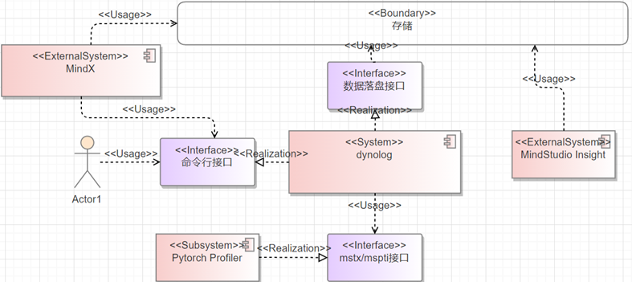

# MindStudio Monitor特性分析与设计说明书

<table>
    <tr>
        <td>所属SIG组:</td>
        <td>mstt-sig</td>
    </tr>
    <tr>
        <td>落入版本:</td>
        <td>MindStudio 26.0.0</td>
    </tr>
    <tr>
        <td>设计人员:</td>
        <td>chenhao</td>
    </tr>
    <tr>
        <td>日期:</td>
        <td>2026.01.21</td>
    </tr>
</table>

您对&quot;本文档&quot;的复制，使用，修改及分发受知识共享（Creative Commons）署名—相同方式共享4.0国际公共许可协议（以下简称&quot;CC BY-SA 4.0&quot;）的约束。
为了方便用户理解，您可以通过访问<https://creativecommons.org/licenses/by-sa/4.0>了解CC BY-SA 4.0的概要 （但不是替代）。
CC BY-SA 4.0的完整协议内容您可以访问如下网址获取：<https://creativecommons.org/licenses/by-sa/4.0/legalcode>。

**改版记录**

<table>
    <tr>
        <th>日期</th>
        <th>修订版本</th>
        <th>修订描述</th>
        <th>作者</th>
        <th>审核</th>
    </tr>
    <tr>
        <td>2026.01.21</td>
        <td>1.0</td>
        <td>初稿完成</td>
        <td>chenhao</td>
        <td>chenhao</td>
    </tr>
</table>

# 1.特性概述

在线监测系统主要服务于大模型集群场景，搭建起一套完整的性能监测与分析流程。首先依靠轻量化打点监测手段筛查识别慢卡节点，再借助动态数据采集能力，对异常慢卡及其对应通信域展开深度排查，精准定位、剖析慢卡问题的根因。

## 1.1范围

包含 npu-monitor 的能力增强：支持控制采集时段、控制采集数据范围，nputrace 支持异步解析能力。

## 1.2特性需求列表

表1：特性需求列表

<table>
    <tr>
        <th>需求编号</th>
        <th>需求名称</th>
        <th>特性描述</th>
        <th>备注</th>
    </tr>
    <tr>
        <td>1</td>
        <td>npu-monitor 支持按 Duration 采集</td>
        <td>支持设置参数 duration 控制采集的时间段内的数据指标</td>
        <td>可由 stop 参数控制提前停止</td>
    </tr>
    <tr>
        <td>2</td>
        <td>npu-monitor 支持按算子名采集</td>
        <td>支持设置算子名规则进行过滤需要的算子名称</td>
        <td>算子名称配置可基于模糊匹配</td>
    </tr>
    <tr>
        <td>3</td>
        <td>nputrace 支持异步解析能力</td>
        <td>支持解析流程异步处理数据</td>
        <td></td>
    </tr>
</table>

# 2.需求场景分析

## 2.1特性需求来源与价值概述

msMonitor 基础能力完善和加强，支持精细控制采集的数据范围，控制数据采集量级的同时可以支持自定义数据处理，灵活性及易用性更佳。

## 2.2特性场景分析

### 2.2.1 npu-monitor 按 Duration 采集场景

**场景触发条件及对象**：

- **角色**：AI集群运维工程师、性能分析工程师、MindStudio Insight用户。
- **工具/接口**：msMonitor CLI (`dyno npu-monitor --duration`)、MindStudio Insight 界面、Dynolog Server RPC接口。
- **触发条件**：需要在特定时间窗口内采集NPU性能指标，如训练任务的特定迭代阶段、推理服务的高峰期、慢卡排查的观测窗口。

**用户应用场景及关键任务**：

1. **定时采集场景**：设置 `--duration 300` 在训练任务运行5分钟后自动停止采集，避免长时间采集产生过多数据。
2. **配合stop参数提前停止**：启动时设置 `--duration 3600`，在发现异常时通过 `--npu-monitor-stop` 提前终止采集。
3. **周期性巡检**：运维脚本定时触发采集，如每小时采集10分钟指标用于集群健康度评估。
4. **慢卡复现验证**：在怀疑慢卡的时间窗口内精准采集，配合 `--filter` 定位特定算子的性能问题。

### 2.2.2 npu-monitor 按算子名采集场景

**场景触发条件及对象**：

- **角色**：模型开发工程师、性能调优专家、算法研究人员。
- **工具/接口**：msMonitor CLI (`dyno npu-monitor --filter`)。
- **触发条件**：需要聚焦特定算子（如MatMul、AllReduce、Conv2D等）的性能表现，屏蔽无关算子噪声。

**用户应用场景及关键任务**：

1. **热点算子聚焦分析**：设置 `--filter "Kernel:MatMul,Conv2D;Communication:AllReduce"` 仅采集计算和通信核心算子。
2. **模糊匹配筛选**：使用 `--filter "Kernel:MatMul"` 匹配所有MatMul变体（如MatMul、BatchMatMul等）。
3. **多活动类型组合过滤**：同时过滤`Kernel`、`API`、`Communication`等多种活动类型的算子。
4. **配合Duration精准定位**：结合 `--duration 60 --filter "Kernel:Attention"` 在60秒内仅采集 Attention 算子性能数据。

### 2.2.3 nputrace 异步解析能力场景

**场景触发条件及对象**：

- **角色**：大模型训练工程师、分布式训练平台开发者。
- **工具/接口**：msMonitor CLI (`dyno nputrace --async-mode`)、Dynolog Server、PyTorch Profiler 动态采集接口。
- **触发条件**：大规模分布式训练（千卡级集群）产生海量trace数据，同步解析阻塞主进程、影响训练性能。

**用户应用场景及关键任务**：

1. **大规模集群无损采集**：开启 `--async-mode` 将trace数据解析卸载到独立进程，避免阻塞训练主进程。
2. **高频采集场景**：频繁触发trace采集时，异步解析防止解析积压导致内存溢出。
3. **生产环境性能分析**：在不影响训练吞吐的前提下获取完整的CANN/Device侧性能数据。
4. **配合analyse参数**：`--async-mode --analyse` 采集结束后自动触发异步解析生成交付件。

## 2.3特性影响分析

本次新增的 npu-monitor 支持 Duration 采集、npu-monitor 支持 Filter 算子筛选、nputrace 支持 Async 异步解析能力三个特性均属于原有 msMonitor 能力的扩展增强，不改变系统整体架构，不引入新的外部依赖，不新增侦听端口或通信协议。

**与其他需求及特性的交互分析**：

- npu-monitor 支持 Duration 参数与 Stop 参数配合使用，支持采集过程中提前终止。
- npu-monitor 支持 Filter 筛选基于 msPTI 回调链路的过滤，与 Duration 无耦合可叠加使用。
- nputrace 支持 Async Mode 与 Analyse 参数可配合使用，采集结束后自动触发异步解析。

**平台差异性分析**：

仅支持 Linux 操作系统，不依赖特定硬件平台特性，所有支持的昇腾产品行为一致。

**兼容性分析**：

新增参数均为可选参数（含默认值），不指定时行为与旧版本完全一致，向下兼容。

**约束及限制**：

- npu-monitor 支持 duration 参数，duration 为 0 时表示不限时采集，需通过 stop 参数手动停止。
- npu-monitor 支持 filter 参数，filter 字符串最大长度 1024字符，算子名采用子串模糊匹配（非正则）。
- nputrace 支持 async-mode 参数，async-mode 仅在 PyTorch Profiler 中生效。

### 2.3.1硬件限制

| 产品类型                                    | 是否支持 |
| ------------------------------------------- | :------: |
| Atlas 350 加速卡                           |    √     |
| Atlas A3 训练系列产品/Atlas A3 推理系列产品 |    √     |
| Atlas A2 训练系列产品/Atlas A2 推理系列产品 |    √     |
| Atlas 200I/500 A2 推理产品                 |    √     |
| Atlas 推理系列产品                         |    ×     |
| Atlas 训练系列产品                         |    ×     |

### 2.3.2技术限制

操作系统：Linux

编程语言：C++ / Python

### 2.3.3对License的影响分析

不会对 License 带来变更。

### 2.3.4对系统性能规格的影响分析

在线监测系统仅在必要时进行数据采集和分析，不会对系统性能造成显著影响。

### 2.3.5对系统可靠性规格的影响分析

在线监测系统不会影响系统正常运行，仅在必要时进行数据采集和分析，不会对系统可靠性造成影响。

### 2.3.6对系统兼容性的影响分析

新增功能参数及能力，不涉及原有功能的变更，无兼容性问题。

### 2.3.7与其他重大特性的交互性，冲突性的影响分析

新增功能参数及能力，不涉及原有功能的变更，不会影响其他已有的特性。

## 2.4同类社区/商用软件实现方案分析

Dynolog 能够对分布式 AI 应用实施按需性能分析，且无需修改任何代码。用户可通过 Dynolog 服务发起 PyTorch 性能数据收集请求。接收到请求后，Dynolog 会通过进程间通信（IPC）动态配置 PyTorch 性能分析器。

下图展示了该工作流程:


图1：社区方案实现图

1、配置 PyTorch 应用环境以启用按需追踪收集功能。

2、在本地或远程按需收集 GPU 追踪数据。

3、对分布式训练任务进行性能分析。

# 3.特性/功能实现原理

## 3.1目标

msMonitor 提供以下核心功能：

**npu-monitor**：轻量常驻后台，持续监测关键算子耗时，适合在线观察性能波动。

**nputrace**：动态触发框架、CANN和Device侧性能数据采集与解析，无需中断任务运行。

## 3.2总体方案


图2：msMonitor 方案总体逻辑架构视图

MindStudio基于分布式AI集群实现端到端解决方案：

**Dynolog System**：该系统为核心子系统，主要分成 Client、Server 两个模块。

Client 侧发起指令使能轻量化打点监测能力，目前支持的参数有：nputrace（mstx/mspti详细打点信息） 、npu-monitor（实时监测metrics，分析慢卡指标）Client 命令参数交互使用 RPC（Remote Procedure Call） 消息传递。

Server 通过 IPC Socket 与业务进程内线程通信，转发 Client 侧下发的指令消息，通过组装和分发命令、配置到业务进程，进行使能/去使能等操作。

**msMonitor**：训练业务进程内拉起轻量化打点监测线程进行周期性（Xs）读取mstx/mspti接口Buff的数据。轻量化打点监测线程通过 IPC Socket 向 Daemon Server 端上报打点数据。

**msInsight/Analyzer**：用户/平台侧通过存储平台收集 Metrics 指标数据，集群节点数据依赖用户/平台的汇聚能力，汇聚后的数据支持调用知识库分析慢卡或可视化呈现。



图3：msMonitor交互上下文视图

msMonitor 主要涉及的外部模块包括以下几个：

1、**开发者**：msMonitor 提供命令行接口，支持动态采集自定义数据和开启预设监测数据的能力。开发者可通过配置快速获取集群性能数据。msMonitor 所在环境为运行环境，开发人员可以进行配置、启停、分析等功能。

2、**PyTorch Profiler等算法框架**：基于 PyTorch 框架实现的数据采集能力。支持数据打点、采集等能力。提供框架层、CANN层性能数据，返回给监测系统进行下一步分析和展示。

3、**MindX等AI平台**：作为运行平台可以调用命令行能力，可获取落盘数据进行二次分析/展示。也可以集成 MindStudio Insight 可视化界面。

# 4.msMonitor采集基础参数能力实现

## 4.1设计思路

通过扩展子命令 npu-monitor 的参数，以支持灵活控制采集的范围：

1、扩展参数 `--duration` 支持指定采集时间范围。

2、扩展参数 `--filter` 支持配置算子名筛选规则。

## 4.2约束条件

NA

## 4.3详细实现

### 4.3.1 npu-monitor Duration 采集时序

  1. 用户 CLI(`dyno`) 通过 RPC 向 Dynolog Server 下发配置。
  2. Dynolog Server 通过 IPC Socket 转发至业务进程。
  3. MsptiMonitor 线程解析 duration 参数 → 采集线程在 `Run()` 循环中计时，到达 duration 阈值时自动停止并清理资源。

### 4.3.2 npu-monitor Filter 筛选时序

  1. 用户 CLI(`dyno`) 下发包含 `filter` 的配置。
  2. `InputParser::DynoLogGetOpts()` 解析 filter 字符串为 `msptiFilterItems` 结构体。
  3. `MsptiMonitor::SetFilterItems()` 存储。
  4. msPTI 回调 `BufferComplete()` 中调用 `ShouldKeepRecord()` 进行算子名模糊匹配过滤。
  5. 仅通过筛选的记录进入 `ConsumeMsptiData()` 处理。

### 4.3.3 模块交互流程

```text
CLI (dyno npu-monitor --duration 300 --filter "Kernel:MatMul")
  │
  ├─► RPC 请求 (setKinetOnDemandRequest)
  │    │
  │    ▼
  ├─► Dynolog Server (IPC Socket转发)
  │    │
  │    ▼
  ├─► DynoLogNpuMonitor::EnableMsptiMonitor()
  │    │
  │    ├─► InputParser::DynoLogGetOpts()  // 解析duration/filter
  │    │      ├─ str2Kinds()        → 活动类型集合
  │    │      ├─ str2FilterItems()  → 算子名过滤映射
  │    │      └─ duration           → 浮点时长
  │    │
  │    └─► DealMonitorReq()
  │           ├─ msptiMonitor->SetDuration(duration)  // 存储duration
  │           ├─ msptiMonitor->Start(cmd)              // 启动采集线程
  │           └─ msptiMonitor->SetFilterItems(filter)  // 设置过滤规则
  │
  ▼
MsptiMonitor::Run() 线程主循环
  │
  ├─► 每1ms轮询检查 duration 是否到期
  │      if (duration_ > 0 && elapsed ≥ duration * 1000) → 到期停止
  │
  ├─► 每 flushInterval 触发 msptiActivityFlushAll()
  │
  └─► msptiActivity回调 BufferComplete()
         └─► ShouldKeepRecord() ← 根据 filterItems_ 模糊匹配
                ├─ FILTER_WHITE_LIST 中的类型(Memory/MemSet/MemCpy)始终保留
                ├─ 根据 activityKind 提取算子名 (name字段)
                └─ 模糊匹配: opName.find(filterOp) != npos
```

## 4.4子系统间接口（主要覆盖模块接口定义）

| 模块 | 接口/结构体 | 文件 | 修改内容 |
|------|------------|------|----------|
| CLI参数解析 | `Command::NpuMonitor` 枚举 | `dynolog_npu/cli/src/main.rs:289-320` | 新增 `duration`(f32), `filter`(String) 字段 |
| CLI配置组装 | `NpuMonitorConfig` 结构体 | `dynolog_npu/cli/src/commands/npumonitor.rs` | 新增 `duration`, `filter` 字段及 `config()` 序列化 |
| 配置解析 | `InputParser::DynoLogGetOpts()` | `plugin/ipc_monitor/InputParser.cpp` | 解析 DURATION_KEY 和 NPU_MONITOR_FILTER 键值对 |
| 配置结构体 | `MsptiMonitorCfg` | `plugin/ipc_monitor/InputParser.h` | 新增 `duration`(float), `filterItems`(msptiFilterItems) 字段 |
| 监控管理 | `MsptiMonitor::SetDuration()` | `plugin/ipc_monitor/MsptiMonitor.h` | 新增接口，设置 duration 原子变量 |
| 监控管理 | `MsptiMonitor::SetFilterItems()` | `plugin/ipc_monitor/MsptiMonitor.h` | 新增接口，设置算子名过滤规则 |
| 监控管理 | `MsptiMonitor::ShouldKeepRecord()` | `plugin/ipc_monitor/MsptiMonitor.cpp` | 新增方法，根据 filterItems 进行算子名模糊匹配过滤 |
| 监控管理 | `MsptiMonitor::Run()` | `plugin/ipc_monitor/MsptiMonitor.cpp` | 新增 duration 到期检测逻辑 |
| 消息处理 | `DynoLogNpuMonitor::DealMonitorReq()` | `plugin/ipc_monitor/DynoLogNpuMonitor.cpp` | 读取 cmd.duration 和 cmd.filterItems 传递给 MsptiMonitor |

## 4.5子系统详细设计

### 4.5.1 CLI 客户端模块 (dyno)

**新增参数定义**:

- `--duration`: f32 类型，单位秒，支持小数精度，默认值0.0（不限时）。通过 `parse_duration()` 校验非负性。
- `--filter`: String 类型，格式为 `"Kind:OpName,OpName;Kind:OpName"`，默认空字符串（不过滤）。通过 `validate_string_max_len()` 限制长度 ≤1024。

**配置序列化**:

- `NpuMonitorConfig::config()` 将 duration 和 filter 格式化为 `DURATION=xxx\nNPU_MONITOR_FILTER=xxx` 键值对，通过 RPC 发送至 Server。

### 4.5.2 配置解析模块 (plugin)

**duration 解析**:

- DURATION_KEY 使用 `isFloat()` 校验，支持浮点数格式。
- `DynoLogGetOpts()` 中通过 `Str2Float()` 将字符串转为 float 存入 `MsptiMonitorCfg::duration`。

**filter 解析**:

- `str2FilterItems()` 解析 filter 字符串：先按 `;` 分割活动类型条目，再按 `:` 分割为 `Kind:OpList`，最后按 `,` 分割算子名列表。
- 算子名存入 `msptiFilterItems` (即 `unordered_map<msptiActivityKind, unordered_set<string>>`)。
- 算子名支持子串模糊匹配（如 `MatMul` 可匹配 `BatchMatMul`）。

### 4.5.3 MsptiMonitor 监控模块 (plugin/ipc_monitor/mspti_monitor/MsptiMonitor)

**Duration 控制**:

- `Run()` 线程启动时记录 `startTime = steady_clock::now()`。
- 每次循环检查 `duration_` 原子变量 > 0，计算已耗时间 `elapsed = currentTime - startTime`。
- 当 `elapsed >= duration * 1000`（毫秒）时，标记 `isDurationExpired=true`，退出循环。
- 退出后执行资源清理：`msptiUnsubscribe`、禁用所有活动、flush 剩余数据、停止 dataProcessor、清空 filter 和 path。

**Filter 过滤**:

- `ShouldKeepRecord()` 在 `BufferComplete()` 回调中对每条记录执行过滤。
- 过滤白名单：`MSPTI_ACTIVITY_KIND_MEMORY/MEMSET/MEMCPY` 三种活动类型始终保留，不参与过滤。
- 算子名提取：根据 `record->kind` 类型将 record 转型为对应结构体（`msptiActivityApi`、`msptiActivityKernel`、`msptiActivityCommunication`、`msptiActivityMarker`），提取 `name` 字段。
- 模糊匹配：使用 `std::any_of()` 遍历过滤规则列表，通过 `opName.find(filterOp) != npos` 进行子串匹配。
- Marker 类型特殊处理：仅对 Host 侧具有有效 flag 的 Marker 记录进行过滤，Device 侧 Marker 或无效 flag 的 Marker 直接放行。

## 4.6DFX属性设计

### 4.6.1性能设计

本特性新增筛选规则和时长控制机制，对性能的影响在可控范围内，具体分析如下：

**Filter 过滤开销**：

- `ShouldKeepRecord()` 在 `BufferComplete()` 回调中对每条 msPTI 记录执行过滤判定。过滤流程包含：活动类型查找（`unordered_map::find`）、record 转型与算子名提取（`reinterpret_cast` + `name` 字段读取）、算子名子串模糊匹配（`std::any_of` + `string::find`）。
- filter 为空时仅执行一次 `filterItems_.empty()` 判空检查即放行，开销可忽略。
- filter 非空时单条记录匹配耗时约百纳秒级。按典型配置（flush 间隔 60s、单次 flush 约数万条记录），单次 BufferComplete 回调新增过滤耗时在微秒级，不构成性能瓶颈。
- 过滤显著减少落盘数据量（如仅保留 Kernel 类型可过滤掉 60%~80% 的 API/Marker 记录），有效降低 I/O 负载。

**Duration 轮询开销**：

- `Run()` 线程以 1ms 粒度轮询检查 `duration_` 到期状态，每次轮询仅执行一次 `duration_.load()` 原子读取和 `steady_clock::now()` 时间差计算。单次轮询 CPU 开销约 0.5μs，整体 CPU 占用率 < 0.1%。
- 到期自动触发 `msptiUnsubscribe` 和资源清理，避免无限采集导致的内存和 I/O 持续增长。

**Buffer 管理性能**：

- msPTI Buffer 固定 8MB/个，最大并发 32 个（共 256MB），通过 `allocCnt` 原子计数限流。Buffer 不足时 msPTI 驱动层自动降速，不影响业务进程稳定性。
- Duration 到期或 Stop 时立即释放所有 Buffer，资源回收及时。

### 4.6.2升级与扩容设计

参数新增特性不涉及升级和扩容场景。

### 4.6.3异常处理设计

**参数校验异常处理**：

| 异常场景 | 检测阶段 | 处理策略 | 影响范围 |
|---------|---------|---------|---------|
| duration 为负值 | CLI 侧 `parse_duration()` 校验 | 拒绝请求，提示 "Must be a positive number" | CLI 侧报错，不影响已有采集任务 |
| filter 字符串超长（>1024字符） | CLI 侧 `validate_string_max_len()` 校验 | 拒绝请求，提示 "The input string is too long" | CLI 侧报错 |
| filter 格式错误（缺少 `Kind:Op` 分隔符） | 服务端 `str2FilterItems()` 解析 | 无效条目静默跳过，`LOG(WARNING)` 记录异常条目 | 有效条目继续生效，采集不中断 |
| filter 中包含无效活动类型 | 服务端 `str2FilterItems()` 映射查找 | 无法映射的 Kind 条目自动忽略，`LOG(WARNING)` | 有效活动类型正常过滤 |
| mspti_activity_kind 枚举值非法 | CLI 侧 `parse_mspti_activity_kinds()` 白名单校验 | 拒绝请求，提示 "Invalid msPTI activity kind" | CLI 侧报错 |

**运行时异常处理**：

| 异常场景 | 处理策略 | 代码位置 |
|---------|---------|---------|
| IPC 消息发送失败 | 指数退避重试 10 次（初始 10ms，每次翻倍）后放弃 | `IpcClient::SyncSendMessage()` |
| msPTI Buffer 分配耗尽（`allocCnt ≥ 32`） | BufferRequest 返回 nullptr，msPTI 驱动层自动降速丢弃数据，`LOG(WARNING)` 记录 allocCnt | `MsptiMonitor::BufferRequest()` |
| DB 写入失败 | `ROLLBACK` 事务，`LOG(ERROR)`，下一周期重试 | `Connection::ExecuteSQL()` |
| JSONL 文件写入失败 | 静默返回，不中断采集主流程 | `RotateLogger::Log()` |
| 无效活动类型使能 | `LOG(WARNING)`，跳过该类型继续处理其他类型 | `Monitor::Start()` |
| Duration 到期后重复 Stop | 幂等处理：状态为已停止时仅 `LOG(WARNING)` 不重复执行 | `DealMonitorReq()` |
| 未启动时调用 Stop | 幂等处理：`LOG(WARNING)` 提示当前未启动 | `DealMonitorReq()` |
| 重复 Start | 幂等处理：已启动状态下再次调用仅 `LOG(WARNING)` 不重复启动 | `DealMonitorReq()` |

所有异常处理遵循**不中断业务主流程**原则：CLI 参数错误仅在客户端报错，不影响已运行的采集任务；运行时 msPTI/IPC/IO 异常均在采集线程内隔离处理，不影响训练业务进程。

### 4.6.4资源管理相关设计

**msPTI Buffer 池管理**：

- 单 Buffer 大小：8MB（`DEFAULT_BUFFER_SIZE`），通过 `MsptiMalloc` 按对齐要求分配。
- 最大并发 Buffer 数：32（`MAX_ALLOC_CNT = 256MB / 8MB`），通过静态原子变量 `allocCnt` 计数控制。
- Buffer 生命周期：`BufferRequest()` 回调中分配 → msPTI 驱动填充数据 → `BufferComplete()` 回调中消费 → `MsptiFree` 释放，`allocCnt` 对应增减。
- 限流机制：`allocCnt` 达到上限时 `BufferRequest` 返回 nullptr，msPTI 驱动层自动降速丢弃数据，防止内存无限增长。
- Duration 到期时：`Run()` 退出前调用 `msptiUnsubscribe` 禁用所有活动，`BufferComplete` 继续处理已分配的残留 Buffer 直至全部释放。

**线程资源管理**：

- `MsptiMonitor::Run()` 监控线程：独立 std::thread，启动时通过 `prctl(PR_SET_NAME, "MsptiMonitor")` 命名，便于 `ps`/`top` 识别。Duration 到期或 Stop 触发 `isDurationExpired` 标志后线程自然退出。
- `JsonlDataDumper` 落盘线程：后台独立线程批量 Dump 数据，减少主线程 I/O 阻塞。
- `TimerTask` 定时任务线程：由具体 ProcessManager 创建，负责周期性处理（如 DB 事务提交、Metric 聚合上报）。
- 线程隔离：各线程独立运行，任一线程崩溃不影响其他线程和训练主流程。

**内存资源管理**：

- filter 规则内存：`msptiFilterItems`（`unordered_map<msptiActivityKind, unordered_set<string>>`）存储于 MsptiMonitor 实例，通过 `SetFilterItems()` 由 `filterMtx_` 互斥锁保护更新，`ShouldKeepRecord()` 读取时加锁拷贝，确保线程安全。
- Duration 原子变量：`std::atomic<float> duration_`，无锁读写，`SetDuration()` 和 `Run()` 轮询检查之间无竞态。
- 配置字符串：filter 字符串在 `InputParser::str2FilterItems()` 解析后释放原始字符串，仅保留结构化过滤映射，内存开销可控。
- 数据处理器资源：`dataProcessor_`（`MsptiDataProcessBase` 子类实例）在 Start 时创建，Duration 到期或 Stop 时 `StopProcessor()` 停止后销毁，避免资源泄漏。

### 4.6.5小型化设计

不涉及小型化设计。

### 4.6.6可测性设计

**功能验证维度**：

1. **Duration 参数功能验证**：正常时长采集（如 `--duration 10` 10s 后自动停止）、不限时采集（`--duration 0` 持续至手动 stop）、浮点精度采集（`--duration 0.5` 500ms 停止）、负值/零值校验。
2. **Filter 参数功能验证**：单算子名精确匹配、多算子名过滤、多活动类型组合过滤（如 `"Kernel:MatMul;Communication:AllReduce"`）、模糊匹配验证（如 `Mat` 匹配 `BatchMatMul`）、空字符串全量采集、白名单类型（Memory/MemSet/MemCpy）不受 filter 影响验证。
3. **参数组合验证**：duration + filter 叠加使用、duration + stop 提前终止、filter 运行时动态更新（通过多次 `DealMonitorReq()` 下发）。
4. **幂等性验证**：重复 Start 不重复启动、未启动 Stop 不报错、Duration 到期后 Stop 不做处理。

**边界测试维度**：

1. **Duration 边界**：0（无限采集）、极短时长（0.001s=1ms）、极大时长（超过训练任务总时长）、浮点精度边界（如 0.333333s）。
2. **Filter 边界**：单字符算子名、1024字符上限、特殊字符（下划线、数字开头、中文字符）、空 filter 字符串。
3. **并发边界**：频繁 filter 更新（短时间多次下发不同 filter 规则）、duration 到期同时下发新采集任务。

**异常测试维度**：

1. **IPC 异常**：采集过程中 IPC 通信中断、重连后状态恢复验证。
2. **资源耗尽**：模拟 msPTI Buffer 分配达上限（`allocCnt=32`）时系统行为、磁盘写满时采集降级行为。
3. **进程异常**：采集过程中训练进程退出、采集线程异常退出后资源清理验证。

### 4.6.7 安全设计

#### 4.6.7.1 安全设计确认

| 安全属性     | 检查项                                                       | 检查项详细说明                                               | 是否涉及 | 是否满足 |
| ------------ | ------------------------------------------------------------ | ------------------------------------------------------------ | -------- | -------- |
| 访问通道控制 | 是否新增侦听端口                                             | 新增侦听端口需刷新通信矩阵                                   | 否       |          |
| 访问通道控制 | 是否新增进程或组件间通信                                     | 新增进程或组件间通信刷新通信矩阵                             | 否       |          |
| 访问通道控制 | 是否新增认证方式                                             | 新增认证方式需刷新通信矩阵及产品文档                         | 否       |          |
| 权限控制     | 是否涉及创建文件或目录                                       | 创建文件或目录须显式指定文件或目录的访问权限                 | 否       |          |
| 权限控制     | 账号权限是否满足“权限最小化原则”                             | 系统中各账号应赋予最小权限                                   | 否       |          |
| 权限控制     | 是否存在用户权限提升                                         | 禁止出现用户非法权限提升                                     | 否       |          |
| 未公开接口   | 是否新增GUC参数                                              | 新增GUC参数需刷新产品文档                                    | 否       |          |
| 未公开接口   | 是否新增或修改函数、视图、系统表                             | 新增或修改函数、视图、系统表需刷新产品文档，考虑权限控制     | 否       |          |
| 未公开接口   | 是否新增SQL语法                                              | 新增SQL语法需刷新产品文档，支持记录审计日志                  | 否       |          |
| 未公开接口   | 是否新增内部工具                                             | 新增内部工具需刷新产品文档                                   | 否       |          |
| 未公开接口   | 脚本中是否存在注释代码                                       | Shell/Python等解释性语言禁止注释代码，注释代码需要删除       | 否       |          |
| 未公开接口   | 是否存在隐藏命令、参数、端口等接入方式                       | 对于现网维护期间不会使用的命令/参数、端口等接入方式（包括但不限于产品的生产、调测、维护用途），必须删除（如通过编译宏） | 否       |          |
| 未公开接口   | 系统是否存在隐藏后门                                         | 禁止系统预留任何的未公开账号，所有账号必须可被系统管理，并在资料中予以说明 | 否       |          |
| 未公开接口   | 禁止在产品对外部用户发布的软件（包含软件包/补丁包）中提供破解类、网络嗅探类工具。 | 1、禁止在产品对外部用户发布的软件（包含软件包/补丁包）中提供可修改任意用户口令、具有“口令破解能力”（指口令暴力破解、利用系统/算法漏洞恶意破解口令）、对包含敏感数据的文件（如包含密钥的配置文件、数据库）进行解密的功能或工具。2、禁止在系统中保留第三方的网络嗅探工具tcpdump、gdb、strace、readelf网络、进程调试工具，cpp、gcc、dexdump、mirror、JDK开发/编译工具和仅在调测阶段使用的自研调试工具/脚本（例如：仅在调试阶段使用的加解密脚本、调测功能、可以提权的命令），由于业务需要必须保留的，需要进行严格的访问控制。同时在资料中说明保留的原因、使用的场景、风险。 | 否       |          |
| 敏感数据保护 | 认证凭据不允许明文存储在系统中，应该加密保护。               | 认证凭据（如口令/私钥等）不允许明文存储在系统中，应该加密保护。 | 否       |          |
| 敏感数据保护 | 用于敏感数据传输加密的密钥，不能硬编码在代码中。             | 禁止口令和密钥硬编码。                                       | 否       |          |
| 敏感数据保护 | 是否明文打印口令或密钥等敏感信息                             | 禁止在系统中存储的日志、调试信息、错误提示及ps命令等信息打印明文敏感信息（口令/私钥/预共享密钥）。 | 否       |          |
| 敏感数据保护 | 是否明文回显口令                                             | 禁止明文回显口令。                                           | 否       |          |
| 敏感数据保护 | 是否使用第三方和开源软件的缺省口令                           | 禁止使用第三方和开源软件的缺省口令，参考安全设计指南第1.5章节。 | 否       |          |
| 敏感数据保护 | 是否将密码明文存储在配置文件中                               | 明文密码不允许写入配置文件（命令行工具安装部署及使用时必需配置密码的场景除外）。 | 否       |          |
| 敏感数据保护 | 是否使用不安全的加密算法                                     | 禁止使用私有的或业界已知不安全的加密算法。推荐加密算法安全设计指南6.2章节。 | 否       |          |
| 敏感数据保护 | 口令等敏感信息是否使用安全的传输通道                         | 在非信任网络之间进行敏感信息传输须采用安全传输通道或者加密后传输。参考安全设计指南第10章。 | 否       |          |
| 敏感数据保护 | 内存中口令或密钥等敏感信息使用后是否销毁                     | 内存中的口令或密钥等信息使用完毕后立即清0。                  | 否       |          |
| 敏感数据保护 | 密码算法中使用到的随机数必须是密码学意义上的安全随机数。     | 密码算法中使用到的随机数必须是密码学意义上的安全随机数，参考安全设计指南6.3章节。 | 否       |          |
| 敏感数据保护 | 资料中是否存在不安全的示例                                   | 资料中的示例需要是安全的，对用户进行正确的引导，若示例中存在潜在的风险，要在资料中进行说明。 | 否       |          |
| 认证         | 是否提供认证机制                                             | 新系统需要提供认证机制并缺省开启。                           | 否       |          |
| 认证         | 认证是否在服务端进行                                         | 认证处理过程需要在服务端进行。                               | 否       |          |
| 认证         | 认证失败后服务端是否返回有效信息                             | 认证失败后，服务端返回信息不能提供详细的、可用于判断具体错误原因的提示。 | 否       |          |
| 外部参数校验 | 是否对外部输入进行合法性校验                                 | 1、使用外部输入数据作为循环终止条件、数组下标、内存分配大小参数等，可能导致系统出现死循环、缓冲区溢出、内存越界、拒绝服务等一系列行为。2、文件路径等外部输入应进行合法性校验，防止注入风险 | 是       | 是       |
| 三方件引入   | 是否新引入三方组件                                           | 1.新增三方组件需要通过安全编译选项、病毒、漏洞、开源片段引用、license合规、开源组件扫描，参考版本发布网络安全质量要求。2.新增三方组件需保证来源可信。 | 是       | 是       |

#### 4.6.7.2 敏感数据分析

##### 1. 敏感数据清单

| **数据字段**    | **备注/说明**          | **数据字段敏感度** | **关联处理模块** | **强制的操作**             | **禁止的操作** |
| --------------- | ---------------------- | ------------------ | ---------------- | -------------------------- | -------------- |
| 管理员账号/密码 | 系统管理员的账号和密码 | 高                 | 登陆/认证        | 加密传输/加密存储/匿名化等 | 回显/日志等    |
| ...             | ...                    | ...                | ...              | ...                        | ...            |
|                 |                        |                    |                  |                            |                |

##### 2. 敏感操作检查

|            |                             产生                             |                  使用                  |                        传输                        |       持久化       |                 销毁                 |
| :--------: | :----------------------------------------------------------: | :------------------------------------: | :------------------------------------------------: | :----------------: | :----------------------------------: |
|    打印    |                            不涉及                            | 使用过程中不会将密码进行任何形式的打印 | 安全传输通道下不需要加密；非安全传输通道下加密传输 |       不涉及       | 销毁过程不打印密码，但需记录操作日志 |
|    回显    |            在客户端密文回显，口令显示为*********             |                 不涉及                 |                       不涉及                       |       不涉及       |                不涉及                |
|    存储    | 用户输入设置密码后，会通过安全加密算法将密码加密保存至后端数据库 |               同【产生】               |                       不涉及                       | 后端数据库加密存储 |    从后端数据库 表中删除对应密码     |
|   硬编码   |                            不涉及                            |                 不涉及                 |                       不涉及                       |       不涉及       |                不涉及                |
| 不安全算法 |                  使用安全算法（AES256）加密                  |            使用时内存中解密            |           非安全传输通道使用安全加密算法           |     同【产生】     |                不涉及                |

#### 4.6.7.3 设计实现

通过扩展子命令npumonitor的参数，以支持灵活控制采集的范围：

```rust
    NpuMonitor {
        /// Start NPU monitor.
        #[clap(long, action)]
        npu_monitor_start: bool,
        /// Stop NPU monitor.
        #[clap(long, action)]
        npu_monitor_stop: bool,
        /// NPU monitor report interval in seconds.
        #[clap(long, default_value_t = 60)]
        report_interval_s: u32,
        /// NPU monitor collect duration in seconds.
        #[clap(long, value_parser = parse_duration, default_value_t = 0.0)]
        duration: f32,
        /// MSPTI collect activity kind
        #[clap(long, value_parser = parse_mspti_activity_kinds, default_value = "Marker")]
        mspti_activity_kind: String,
        /// Log file for NPU monitor.
        #[clap(long, default_value = "")]
        log_file: String,
        /// Export type for NPU monitor.
        #[clap(long, value_parser = ["DB", "Jsonl"], default_value = "DB")]
        export_type: String,
        /// Filter for NPU monitor.
        #[clap(long, value_parser = validate_string_max_len, default_value = "")]
        filter: String,
    }
```

- 扩展参数 `--duration` 支持指定采集时间范围。

- 扩展参数 `--filter` 支持配置算子名筛选规则。

## 4.7系统外部接口

新增 CLI 参数 `--duration` 和 `--filter`，通过 RPC 协议传送到 Dynolog Server，不涉及其他外部接口变更。

## 4.8自测用例设计

### 4.8.1 Duration 参数功能测试

| 用例编号 | 测试场景 | 前置条件 | 输入 | 预期结果 |
|---------|---------|---------|------|---------|
| DUR-01 | 正常duration采集 | npumonitor未启动 | `--npu-monitor-start --duration 10` | 采集持续10s后自动停止 |
| DUR-02 | duration=0不限时 | npumonitor未启动 | `--npu-monitor-start --duration 0` | 持续采集直到手动stop |
| DUR-03 | 浮点duration | npumonitor未启动 | `--npu-monitor-start --duration 0.5` | 采集500ms后自动停止 |
| DUR-04 | duration + stop提前终止 | npumonitor运行中 | 先start，再 `--npu-monitor-stop` | stop后立即停止采集 |
| DUR-05 | 负值校验 | - | `--duration -1` | CLI校验失败，提示错误 |
| DUR-06 | duration到期后stop | duration已到期 | duration到期后调用stop | 不做处理，状态保持停止 |

### 4.8.2 Filter 参数功能测试

| 用例编号 | 测试场景 | 输入 | 预期结果 |
|---------|---------|------|---------|
| FIL-01 | 单个算子名过滤 | `--filter "Kernel:MatMul"` | 仅保留Kernel类型中名为MatMul的算子 |
| FIL-02 | 多个算子名过滤 | `--filter "Kernel:MatMul,Conv2D"` | 保留MatMul和Conv2D两个算子 |
| FIL-03 | 多活动类型过滤 | `--filter "Kernel:MatMul;Communication:AllReduce"` | 同时过滤Kernel和Communication |
| FIL-04 | 模糊匹配 | `--filter "Kernel:Mat"` | 保留算子名包含"Mat"的所有算子如MatMul、BatchMatMul |
| FIL-05 | 空filter=不过滤 | `--filter ""` | 所有算子均保留 |
| FIL-06 | 白名单类型不过滤 | `--filter "Kernel:MatMul"` | Memory/MemSet/MemCpy类型数据不受filter影响 |
| FIL-07 | filter超长校验 | 超过1024字符 | CLI校验失败 |
| FIL-08 | 无效活动类型 | `--filter "InvalidKind:Op"` | 无匹配，记录被过滤 |

# 5.msMonitor采集异步解析能力实现

## 5.1设计思路

通过扩展子命令nputrace的参数，以支持控制异步解析流程：

1、扩展参数 `--async-mode` 支持通过独立子进程进行数据解析处理，并行处理避免阻塞业务流程。

## 5.2约束条件

无。

## 5.3详细实现（从用户入口的模块级别或进程级别消息序列图）

### 5.3.1 nputrace 异步解析时序

```text
CLI (dyno nputrace --async-mode --analyse --duration-ms 10000)
  │
  ├─► RPC 请求 (setKinetOnDemandRequest, 含 PROFILE_ASYNC_MODE=true)
  │    │
  │    ▼
  ├─► Dynolog Server (IPC Socket转发至训练进程)
  │    │
  │    ▼
  ├─► PyTorch Profiler 回调处理
  │    │
  │    ├─► 设置 PROFILER_ASYNC_MODE = true
  │    │
  │    ├─► 数据采集阶段（主进程）：
  │    │      mspti采集 → 写入临时Buffer → Buffer满触发回调
  │    │
  │    ├─► 数据解析阶段（子进程）：
  │    │
  │    │       主进程 fork/exec 独立子进程
  │    │       子进程加载原始trace数据
  │    │       子进程进行CANN层/框架层数据解析
  │    │       子进程生成解析结果文件
  │    │       子进程退出
  │    │
  │    └─► 主进程继续训练流程，不被解析阻塞
  │
  ▼
msInsight/Analyzer 加载解析结果进行可视化
```

### 5.3.2 异步模式 vs 同步模式对比

| 维度 | 同步模式 (async_mode=false) | 异步模式 (async_mode=true) |
|------|----------------------------|---------------------------|
| 解析位置 | 采集主进程内联解析 | 独立子进程解析 |
| 训练阻塞 | 解析期间阻塞训练 | 采集完成后立即恢复训练，解析并行进行 |
| 内存占用 | 单进程内完成，峰值内存高 | 主进程采集Buffer可及时释放 |
| 适用场景 | 单卡/小规模调试 | 大规模集群、生产环境 |
| 数据流 | 采集→解析→落盘（串行） | 采集→落盘原始数据；子进程→解析→落盘结果 |

## 5.4子系统间接口（主要覆盖模块接口定义）

| 模块 | 接口/结构体 | 文件 | 修改内容 |
|------|------------|------|----------|
| CLI参数解析 | `Command::Nputrace` 枚举 | `dynolog_npu/cli/src/main.rs` | 新增 `async_mode`(bool) 字段 |
| CLI配置组装 | `NpuTraceOptions` 结构体 | `dynolog_npu/cli/src/commands/nputrace.rs` | 新增 `async_mode`(bool) 字段 |
| 配置序列化 | `NpuTraceOptions::config()` | `dynolog_npu/cli/src/commands/nputrace.rs` | 新增 `PROFILE_ASYNC_MODE={}` 键值对输出 |
| 服务端处理 | Dynolog Server 配置转发 | dynolog 服务端代码 | 将 `PROFILE_ASYNC_MODE` 配置转发至训练进程 |
| PyTorch Profiler | 采集器配置解析 | PyTorch Profiler（Ascend扩展） | 解析 `PROFILE_ASYNC_MODE` 配置，控制是否启用子进程解析 |

## 5.5子系统详细设计

### 5.5.1 CLI 客户端模块 (dyno)

**新增参数定义**:

- `--async-mode`: bool 类型，通过 `#[clap(long, action)]` 声明为开关标志。默认 `false`。
- 在 `Nputrace` 命令匹配中传递至 `NpuTraceOptions` 结构体。

**配置序列化**:

- `NpuTraceOptions::config()` 输出 `PROFILE_ASYNC_MODE=true/false`，与 `--analyse` 等参数一同通过 RPC 发送给 Dynolog Server。

### 5.5.2 Dynolog Server 转发模块

Server 收到 RPC 请求后，解析 `config` 字符串中的 `PROFILE_ASYNC_MODE` 字段，将其与 `PROFILE_ANALYSE` 等其他 trace 参数一同封装为 IPC 消息，通过 IPC Socket 发送至目标训练进程。

### 5.5.3 PyTorch Profiler 采集模块

PyTorch Profiler（Ascend扩展）接收到配置文件后：

1. 读取 `PROFILE_ASYNC_MODE` 标志位
2. 若 `async_mode=true`：
   - 采集阶段：主进程正常进行 CANN 数据采集，数据写入指定输出目录
   - 解析阶段：通过 `fork()` 创建独立子进程
   - 子进程加载原始采集数据执行 CANN 层 & 框架层数据解析
   - 子进程完成后将解析结果写入指定输出目录
   - 主进程不等待子进程完成，立即返回训练流程
3. 若 `async_mode=false`：
   - 数据解析在主进程内同步进行，完成后才继续训练

## 5.6DFX属性设计

### 5.6.1性能设计

本特性场景新增异步解析能力，从主进程迁移子进程进行数据处理，性能影响可控。

### 5.6.2升级与扩容设计

参数新增特性不涉及升级和扩容场景。

### 5.6.3异常处理设计

参数合法性和有效性设计，需要控制并限制参数的设置范围和有效性检查的可靠性和韧性，避免异常参数影响业务主流程。

### 5.6.4资源管理相关设计

Profiler 数据异步解析与模型训练并行进行，不阻塞训练流程，会占用额外的 CPU 和内存资源。

### 5.6.5小型化设计

不涉及模型小型化相关设计。

### 5.6.6可测性设计

**功能验证维度**：

1. **Async Mode 基本功能验证**：异步模式启动（`--async-mode`）确认子进程启动解析、主进程不阻塞；同步模式（不指定 `--async-mode`）确认主进程内联解析。
2. **数据一致性验证**：同一场景下分别使用 async-mode=true 和 async-mode=false 采集，对比输出的 trace 数据内容完全一致。
3. **参数组合验证**：`--async-mode --analyse` 组合验证异步采集后子进程自动触发离线分析；`--async-mode` 与 `--iterations` 等参数组合使用确认互不冲突。

**边界测试维度**：

1. **多次异步触发**：连续两次 nputrace async 请求，验证两次异步解析独立进行、互不干扰。

**异常测试维度**：

1. **子进程异常中断**：异步解析子进程运行中被 kill，验证主进程不受影响。
2. **资源清理验证**：异步解析完成后，验证子进程正常退出、临时文件删除、无残留进程。
3. **并发冲突验证**：nputrace async 运行中尝试启动 npu-monitor，验证资源冲突检测机制正常。
4. **主进程异常退出**：采集过程中主训练进程异常退出，验证子进程能退出并自动清理。

### 5.6.7 安全设计

#### 5.6.7.1 安全设计确认

| 安全属性     | 检查项                                                       | 检查项详细说明                                               | 是否涉及 | 是否满足 |
| ------------ | ------------------------------------------------------------ | ------------------------------------------------------------ | -------- | -------- |
| 访问通道控制 | 是否新增侦听端口                                             | 新增侦听端口需刷新通信矩阵                                   | 否       |          |
| 访问通道控制 | 是否新增进程或组件间通信                                     | 新增进程或组件间通信刷新通信矩阵                             | 否       |          |
| 访问通道控制 | 是否新增认证方式                                             | 新增认证方式需刷新通信矩阵及产品文档                         | 否       |          |
| 权限控制     | 是否涉及创建文件或目录                                       | 创建文件或目录须显式指定文件或目录的访问权限                 | 否       |          |
| 权限控制     | 账号权限是否满足“权限最小化原则”                             | 系统中各账号应赋予最小权限                                   | 否       |          |
| 权限控制     | 是否存在用户权限提升                                         | 禁止出现用户非法权限提升                                     | 否       |          |
| 未公开接口   | 是否新增GUC参数                                              | 新增GUC参数需刷新产品文档                                    | 否       |          |
| 未公开接口   | 是否新增或修改函数、视图、系统表                             | 新增或修改函数、视图、系统表需刷新产品文档，考虑权限控制     | 否       |          |
| 未公开接口   | 是否新增SQL语法                                              | 新增SQL语法需刷新产品文档，支持记录审计日志                  | 否       |          |
| 未公开接口   | 是否新增内部工具                                             | 新增内部工具需刷新产品文档                                   | 否       |          |
| 未公开接口   | 脚本中是否存在注释代码                                       | Shell/Python等解释性语言禁止注释代码，注释代码需要删除       | 否       |          |
| 未公开接口   | 是否存在隐藏命令、参数、端口等接入方式                       | 对于现网维护期间不会使用的命令/参数、端口等接入方式（包括但不限于产品的生产、调测、维护用途），必须删除（如通过编译宏） | 否       |          |
| 未公开接口   | 系统是否存在隐藏后门                                         | 禁止系统预留任何的未公开账号，所有账号必须可被系统管理，并在资料中予以说明 | 否       |          |
| 未公开接口   | 禁止在产品对外部用户发布的软件（包含软件包/补丁包）中提供破解类、网络嗅探类工具。 | 1、禁止在产品对外部用户发布的软件（包含软件包/补丁包）中提供可修改任意用户口令、具有“口令破解能力”（指口令暴力破解、利用系统/算法漏洞恶意破解口令）、对包含敏感数据的文件（如包含密钥的配置文件、数据库）进行解密的功能或工具。2、禁止在系统中保留第三方的网络嗅探工具tcpdump、gdb、strace、readelf网络、进程调试工具，cpp、gcc、dexdump、mirror、JDK开发/编译工具和仅在调测阶段使用的自研调试工具/脚本（例如：仅在调试阶段使用的加解密脚本、调测功能、可以提权的命令），由于业务需要必须保留的，需要进行严格的访问控制。同时在资料中说明保留的原因、使用的场景、风险。 | 否       |          |
| 敏感数据保护 | 认证凭据不允许明文存储在系统中，应该加密保护。               | 认证凭据（如口令/私钥等）不允许明文存储在系统中，应该加密保护。 | 否       |          |
| 敏感数据保护 | 用于敏感数据传输加密的密钥，不能硬编码在代码中。             | 禁止口令和密钥硬编码。                                       | 否       |          |
| 敏感数据保护 | 是否明文打印口令或密钥等敏感信息                             | 禁止在系统中存储的日志、调试信息、错误提示及ps命令等信息打印明文敏感信息（口令/私钥/预共享密钥）。 | 否       |          |
| 敏感数据保护 | 是否明文回显口令                                             | 禁止明文回显口令。                                           | 否       |          |
| 敏感数据保护 | 是否使用第三方和开源软件的缺省口令                           | 禁止使用第三方和开源软件的缺省口令，参考安全设计指南第1.5章节。 | 否       |          |
| 敏感数据保护 | 是否将密码明文存储在配置文件中                               | 明文密码不允许写入配置文件（命令行工具安装部署及使用时必需配置密码的场景除外）。 | 否       |          |
| 敏感数据保护 | 是否使用不安全的加密算法                                     | 禁止使用私有的或业界已知不安全的加密算法。推荐加密算法安全设计指南6.2章节。 | 否       |          |
| 敏感数据保护 | 口令等敏感信息是否使用安全的传输通道                         | 在非信任网络之间进行敏感信息传输须采用安全传输通道或者加密后传输。参考安全设计指南第10章。 | 否       |          |
| 敏感数据保护 | 内存中口令或密钥等敏感信息使用后是否销毁                     | 内存中的口令或密钥等信息使用完毕后立即清0。                  | 否       |          |
| 敏感数据保护 | 密码算法中使用到的随机数必须是密码学意义上的安全随机数。     | 密码算法中使用到的随机数必须是密码学意义上的安全随机数，参考安全设计指南6.3章节。 | 否       |          |
| 敏感数据保护 | 资料中是否存在不安全的示例                                   | 资料中的示例需要是安全的，对用户进行正确的引导，若示例中存在潜在的风险，要在资料中进行说明。 | 否       |          |
| 认证         | 是否提供认证机制                                             | 新系统需要提供认证机制并缺省开启。                           | 否       |          |
| 认证         | 认证是否在服务端进行                                         | 认证处理过程需要在服务端进行。                               | 否       |          |
| 认证         | 认证失败后服务端是否返回有效信息                             | 认证失败后，服务端返回信息不能提供详细的、可用于判断具体错误原因的提示。 | 否       |          |
| 外部参数校验 | 是否对外部输入进行合法性校验                                 | 1、使用外部输入数据作为循环终止条件、数组下标、内存分配大小参数等，可能导致系统出现死循环、缓冲区溢出、内存越界、拒绝服务等一系列行为。2、文件路径等外部输入应进行合法性校验，防止注入风险 | 是       | 是       |
| 三方件引入   | 是否新引入三方组件                                           | 1.新增三方组件需要通过安全编译选项、病毒、漏洞、开源片段引用、license合规、开源组件扫描，参考版本发布网络安全质量要求。2.新增三方组件需保证来源可信。 | 是       | 是       |

#### 5.6.7.2 敏感数据分析

##### 1. 敏感数据清单

| **数据字段**    | **备注/说明**          | **数据字段敏感度** | **关联处理模块** | **强制的操作**             | **禁止的操作** |
| --------------- | ---------------------- | ------------------ | ---------------- | -------------------------- | -------------- |
| 管理员账号/密码 | 系统管理员的账号和密码 | 高                 | 登陆/认证        | 加密传输/加密存储/匿名化等 | 回显/日志等    |
| ...             | ...                    | ...                | ...              | ...                        | ...            |
|                 |                        |                    |                  |                            |                |

##### 2. 敏感操作检查

|            |                             产生                             |                  使用                  |                        传输                        |       持久化       |                 销毁                 |
| :--------: | :----------------------------------------------------------: | :------------------------------------: | :------------------------------------------------: | :----------------: | :----------------------------------: |
|    打印    |                            不涉及                            | 使用过程中不会将密码进行任何形式的打印 | 安全传输通道下不需要加密；非安全传输通道下加密传输 |       不涉及       | 销毁过程不打印密码，但需记录操作日志 |
|    回显    |            在客户端密文回显，口令显示为*********             |                 不涉及                 |                       不涉及                       |       不涉及       |                不涉及                |
|    存储    | 用户输入设置密码后，会通过安全加密算法将密码加密保存至后端数据库 |               同【产生】               |                       不涉及                       | 后端数据库加密存储 |    从后端数据库 表中删除对应密码     |
|   硬编码   |                            不涉及                            |                 不涉及                 |                       不涉及                       |       不涉及       |                不涉及                |
| 不安全算法 |                  使用安全算法（AES256）加密                  |            使用时内存中解密            |           非安全传输通道使用安全加密算法           |     同【产生】     |                不涉及                |

#### 5.6.7.3 设计实现

通过扩展子命令 `nputrace` 的参数，以支持灵活控制采集的范围：

```rust
    Nputrace {
        /// Job id of the application to trace.
        #[clap(long, default_value_t = 0)]
        job_id: u64,
        /// List of pids to capture trace for (comma separated).
        #[clap(long, value_parser = validate_string_max_len, default_value = "0")]
        pids: String,
        /// Duration of trace to collect in ms.
        #[clap(long, default_value_t = 500)]
        duration_ms: u64,
        /// Training iterations to collect, this takes precedence over duration.
        #[clap(long, value_parser = parse_iterations, allow_negative_numbers = true)]
        iterations: i64,
        /// Log file for trace.
        #[clap(long)]
        log_file: String,
        /// Unix timestamp used for synchronized collection (milliseconds since epoch).
        #[clap(long, default_value_t = 0)]
        profile_start_time: u64,
        /// Number of steps to start profile, -1 means start from next step.
        #[clap(long, value_parser = parse_start_step, allow_negative_numbers = true)]
        start_step: i64,
        /// Max number of processes to profile.
        #[clap(long, default_value_t = 3)]
        process_limit: u32,
        /// Whether to record PyTorch operator input shapes and types.
        #[clap(long, action)]
        record_shapes: bool,
        /// Whether to profile PyTorch memory.
        #[clap(long, action)]
        profile_memory: bool,
        /// Whether to profile the Python call stack in trace.
        #[clap(long, action)]
        with_stack: bool,
        /// Annotate operators with analytical flops.
        #[clap(long, action)]
        with_flops: bool,
        /// Whether to profile PyTorch operator modules in traces.
        #[clap(long, action)]
        with_modules: bool,
        /// The scope of the profile's events.
        #[clap(long, value_parser = ["CPU,NPU", "NPU,CPU", "CPU", "NPU"], default_value = "CPU,NPU")]
        activities: String,
        /// Profiler level.
        #[clap(long, value_parser = ["Level0", "Level1", "Level2", "Level_none"], default_value = "Level0")]
        profiler_level: String,
        /// AIC metrics.
        #[clap(long, value_parser = ["AiCoreNone", "PipeUtilization", "ArithmeticUtilization", "Memory", "MemoryL0", "ResourceConflictRatio", "MemoryUB", "L2Cache", "MemoryAccess"], default_value = "AiCoreNone")]
        aic_metrics: String,
        /// Whether to analyse the data after collection.
        #[clap(long, action)]
        analyse: bool,
        /// Whether to enable async mode.
        #[clap(long, action)]
        async_mode: bool,
        /// Whether to collect L2 cache.
        #[clap(long, action)]
        l2_cache: bool,
        /// Whether to collect op attributes.
        #[clap(long, action)]
        op_attr: bool,
        /// Whether to enable MSTX.
        #[clap(long, action)]
        msprof_tx: bool,
        /// GC detect threshold.
        #[clap(long)]
        gc_detect_threshold: Option<f32>,
        /// Whether to streamline data after analyse is complete.
        #[clap(long, value_parser = ["true", "false"], default_value = "true")]
        data_simplification: String,
        /// Types of data exported by the profiler.
        #[clap(long, value_parser = ["Text", "Db"], default_value = "Text")]
        export_type: String,
        /// Obtain the system data on the host side.
        #[clap(long, value_parser = parse_host_sys, default_value = "None")]
        host_sys: String,
        /// Whether to enable sys io.
        #[clap(long, action)]
        sys_io: bool,
        /// Whether to enable sys interconnection.
        #[clap(long, action)]
        sys_interconnection: bool,
        /// The domain that needs to be enabled in mstx mode.
        #[clap(long)]
        mstx_domain_include: Option<String>,
        /// Domains that do not need to be enabled in mstx mode.
        #[clap(long)]
        mstx_domain_exclude: Option<String>,
    }
```

- 扩展参数 --async-mode 支持异步解析能力。

## 5.7系统外部接口

新增 CLI 参数 `--async-mode`，通过 RPC 协议传送至 Dynolog Server，最终通过 IPC 传递至 PyTorch Profiler 采集进程。不涉及其他外部接口变更。

## 5.8自测用例设计

### 5.8.1 Async Mode 异步解析功能测试

| 用例编号 | 测试场景 | 输入 | 预期结果 |
|---------|---------|------|---------|
| ASYNC-01 | 异步模式启动 | `--async-mode --duration-ms 10000` | 后台子进程启动异步解析，主进程不阻塞 |
| ASYNC-02 | 同步模式（默认） | `--duration-ms 10000` (不指定async-mode) | 主进程同步解析 |
| ASYNC-03 | 异步+analyse组合 | `--async-mode --analyse` | 异步采集后子进程自动完成分析 |
| ASYNC-04 | 异步模式数据完整性 | `--async-mode` + 对比同步结果 | 异步和同步模式生成的trace数据内容一致 |
| ASYNC-05 | 多次异步触发 | 连续两次nputrace async请求 | 两次异步解析独立进行，互不干扰 |
| ASYNC-06 | 异步模式异常处理 | 子进程解析过程中kill子进程 | 主进程不受影响，能检测到子进程异常并记录日志 |
| ASYNC-07 | 资源清理 | 异步解析完成后 | 子进程退出，临时文件删除，无遗留进程 |

# 6.可靠性&可用性设计

## 6.1冗余设计

### 6.1.1 IPC 通信冗余

IPC 客户端 (`IpcClient::SyncSendMessage`) 内置指数退避重试机制：

- 默认最大重试次数 10 次，Metric 消息重试 5 次。
- 初始睡眠 10ms，每次失败后 `sleepTimeUs *= 2` 指数增长。
- 对 `EAGAIN`/`EWOULDBLOCK` 视为瞬时故障自动重试。
- 对 `ECONNREFUSED`（服务端未就绪）视为可恢复错误自动重试。

### 6.1.2 数据落盘冗余

- **DB 模式**：`DBProcessManager` 每周期先 `BEGIN` 事务，写入成功则 `COMMIT`，失败则 `ROLLBACK`，保证数据原子性。
- **Jsonl 模式**：`RotateLogger` 支持文件轮转，`maxFiles_` 控制保留文件数（-1 表示不限），超出时自动删除最旧文件。

### 6.1.3 多数据处理器支持

`MsptiMonitor` 支持三种数据处理器动态切换：

- `MetricManager`：内存聚合 + IPC 上报（轻量模式）。
- `DBProcessManager`：DB 落盘（持久化模式）。
- `JsonlProcessManager`：JSONL 文件输出（可读模式）。

三种模式通过 `--export-type` 参数动态切换，运行时互斥。不指定 savePath 时默认进入 Metric 轻量模式，异常时可降级使用。

## 6.2故障管理

### 6.2.1 错误码体系

系统定义统一的 `ErrCode` 枚举（`utils.h`），覆盖 13 种错误类型：

| 错误码 | 含义 | 典型触发场景 |
|--------|------|-------------|
| `SUC` | 成功 | - |
| `PARAM` | 参数错误 | 非法 duration/filter 输入 |
| `PERMISSION` | 权限不足 | 日志路径不可写 |
| `VALUE` | 值错误 | 空 msPTI 记录 |
| `PTR` | 空指针 | dataProcessor 创建失败 |
| `MEMORY` | 内存不足 | MsptiMalloc 分配失败 |
| `INTERNAL` | 内部错误 | msptiSubscribe 失败 |
| `SYSCALL` | 系统调用失败 | socket/文件操作失败 |
| `TIMEOUT` | 超时 | IPC 通信超时 |
| `UNAVAIL` | 不可用 | IPC 服务端未连接 |

### 6.2.2 故障隔离

- **线程隔离**：MsptiMonitor 监控线程、JsonlDataDumper 落盘线程、TimerTask 定时任务线程各自独立，任一线程崩溃不影响其他线程。
- **进程隔离**（async-mode）：nputrace 异步解析在子进程中执行，子进程崩溃不影响训练主进程。
- **内存隔离**：MSPTI Buffer Pool 通过 `allocCnt` 原子变量限制最大 32 个 Buffer（共 256MB），防止内存泄漏撑爆系统。

### 6.2.3 异常处理策略

| 异常场景 | 处理策略 | 代码位置 |
|---------|---------|---------|
| IPC 消息发送失败 | 指数退避重试 10 次后放弃 | `IpcClient::SyncSendMessage()` |
| 数据库操作失败 | `ROLLBACK` 事务，`LOG(ERROR)`，继续下一周期 | `Connection::ExecuteSQL()` |
| JSON 文件写入失败 | 静默返回，不中断采集主流程 | `RotateLogger::Log()` |
| msPTI Buffer 耗尽 | BufferRequest 返回 nullptr，记录 allocCnt 日志 | `MsptiMonitor::BufferRequest()` |
| 无效活动类型 | `LOG(WARNING)`，跳过该类型 | `Monitor::Start()` |

## 6.3过载控制设计

### 6.3.1 msPTI Buffer 限流

- 单 Buffer 大小：8MB（`DEFAULT_BUFFER_SIZE`）。
- 最大并发 Buffer 数：32（`MAX_ALLOC_CNT = 256MB / 8MB`）。
- 限流机制：`allocCnt` 原子计数，达到上限时 `BufferRequest` 返回 nullptr，msPTI 驱动层自动降速。

### 6.3.2 JSONL RingBuffer 限流

- 默认容量：512K 条目（`MSMONITOR_JSONL_BUFFER_CAPACITY` 环境变量可配，范围 8K~2M）。
- 满 Buffer 检测：Push 时统计 `full_cnt_`，记录日志但不阻塞。
- 消费触发：高水位 256 条（`kNotifyInterval`）或超时 30s（`maxDumpIntervalMs_`）触发 Dump。
- 停止时：`Flush()` 方法排空全部残留数据。

### 6.3.3 Duration 超时自动停止

- Duration 机制防止无限采集：`Run()` 线程以 1ms 粒度轮询检查耗时，到期自动触发 `msptiUnsubscribe` 并清理资源。
- `duration=0` 时走手动 Stop 路径，依赖用户通过 `--npu-monitor-stop` 显式停止。

### 6.3.4 周期性 Flush 控制

- `flushInterval_` 控制 msPTI Buffer 的刷新周期（默认 60s），避免 Buffer 过度堆积。
- 通过 `MsptiMonitor::SetFlushInterval()` 动态调整刷新频率。

## 6.4升级不中断业务

### 6.4.1 参数兼容性

- `--duration`、`--filter`、`--async-mode` 三个新增参数均为**可选参数**，均有合理的默认值
  - `duration` 默认 0.0（不限时，行为同旧版本）
  - `filter` 默认空字符串（不过滤，行为同旧版本）
  - `async-mode` 默认 false（同步模式，行为同旧版本）
- 旧版命令行脚本不指定新参数时，行为与升级前完全一致，无兼容性问题

### 6.4.2 配置格式兼容

- 配置通过 `key=value\n` 格式传递，新增的 `DURATION`、`NPU_MONITOR_FILTER`、`PROFILE_ASYNC_MODE` 为可选键
- 旧版 Server 收到未知键时直接忽略，不影响已有功能解析。

### 6.4.3 数据格式兼容

- DB Schema 使用 `CREATE TABLE IF NOT EXISTS`，新增表或列时不会破坏已有数据
- Jsonl 输出格式保持不变，新增字段用 JSON key 扩展，不改变已有字段含义。

## 6.5人因差错设计

### 6.5.1 参数校验防误操作

| 防误设计 | 参数 | 校验逻辑 | 错误提示 |
|---------|------|---------|---------|
| 负值拦截 | `--duration` | `parse_duration()` 要求 ≥0 | "Must be a positive number" |
| 长度限制 | `--filter` | `validate_string_max_len()` 限制 ≤1024 | "The input string is too long" |
| 枚举校验 | `--mspti-activity-kind` | `parse_mspti_activity_kinds()` 白名单校验 | "Invalid msPTI activity kind" |
| 格式校验 | `--filter` | 服务端 `str2FilterItems()` 检查 `Kind:Op` 格式 | 无效条目静默跳过 + LOG(WARNING) |

### 6.5.2 操作确认

- `--npu-monitor-start` 和 `--npu-monitor-stop` 为显式操作，防止误触。
- `npu-monitor-start` 在已启动状态下再次调用仅 `LOG(WARNING)` 不重复启动（幂等设计）。
- `npu-monitor-stop` 在未启动状态下返回 `LOG(WARNING)` 不报错（幂等设计）。
- nputrace 启动时打印完整配置内容供用户确认。

### 6.5.3 可恢复性

- 参数错误仅在 CLI 侧报错，不影响已运行的采集任务。
- 运行时通过 `DealMonitorReq()` 可动态调整 filter 规则，无需重启。

## 6.6故障预测预防设计

### 6.6.1 日志轮转防磁盘写满

- `RotateLogger` 支持按行数自动轮转日志文件
- 轮转参数通过环境变量配置（`MSMONITOR_JSONL_ROTATE_LOG_LINES`、`MSMONITOR_JSONL_ROTATE_LOG_FILES`）。
- 超过 `maxFiles_` 时自动删除最旧文件，防止磁盘空间耗尽。

### 6.6.2 异常检测与上报

- 监控线程状态通过 IPC 实时上报 `NpuStatus`，包含 `status`（0=停止, 1=运行中）。
- `UpdateNpuStatus()` 在每次启停操作后主动上报状态变更。
- dynolog daemon 通过状态感知可以及时发现采集异常

### 6.6.3 Buffer 利用率监控

- `allocCnt` 原子变量实时追踪已分配的 msPTI Buffer 数量。
- `RingBuffer` 统计 `full_cnt_`（满 Buffer 次数）和 `cycles_exceed_cnt_`（CAS 自旋超限次数）。
- 这些指标通过 `LOG(INFO)` 输出，可在日志中提前发现采集瓶颈。

### 6.6.4 线程命名辅助诊断

- 所有关键线程都有命名（`prctl(PR_SET_NAME, ...)`）：
  - `MsptiMonitor`：主监控线程
  - `JsonlDataDumper`：JSON 落盘线程
  - TimerTask 线程（由具体 ProcessManager 创建）。
- 通过 `ps`/`top` 可直接识别 msMonitor 线程，便于运行时诊断。

# 7.特性非功能性质量属性相关设计

## 7.1可测试性

### 7.1.1 测试维度

**功能测试**：

- Duration 参数：正测（正常时长采集）、负测（负值/零值/浮点精度）、组合测试（+stop 提前终止、+filter 并行）。
- Filter 参数：单算子名过滤、多算子名过滤、多活动类型组合过滤、模糊匹配验证、白名单类型（Memory/MemSet/MemCpy）不受 filter 影响验证。
- Async Mode：异步模式启动/停止、异步 vs 同步数据一致性对比、多次异步触发、子进程异常中断后主进程恢复。

**边界测试**：

- Duration 边界：0（无限）、最大值（浮点精度上限）、极小值（0.001s=1ms）。
- Filter 边界：空字符串（全量采集）、单字符算子名、1024字符上限、特殊字符（下划线、数字开头）。
- Async Mode边界：短任务异步（duration=1ms）、长任务异步（duration=1h）、异步过程中 stop。

**异常测试**：

- IPC 通信中断后恢复。
- DB 文件写入失败 / 磁盘满。
- msPTI Buffer 分配失败（模拟 `allocCnt` 达上限）。
- 重复启停操作（幂等性验证）。

### 7.1.2 自动化测试

- **单元测试**：`test_DynoLogNpuMonitor.cpp` (gtest) 覆盖 Monitor 基本生命周期管理。
- **预集成测试**：`test/pre_smoke/src/test_ascend_pytorch_profiler_msmonitor_npu_monitor.py` 覆盖端到端 npumonitor 采集流程。
- **配置校验测试**：`InputParser` 的 `DynoLogGetOpts()` 包含参数规则校验，所有参数通过 `rules` 映射表逐一验证。

## 7.2可服务性

### 7.2.1 日志体系

- **分类日志**：`glog` 实现，支持 `INFO`/`WARNING`/`ERROR` 三级日志。
- **关键事件日志**：
  - MsptiMonitor 启停日志（含 rankId 标识）。
  - Duration 到期自动停止日志（含设定时长）。
  - IPC 通信失败日志（含重试次数和错误码）。
  - Buffer 分配/释放日志（含 size 和 validSize）。

### 7.2.2 环境变量配置

| 环境变量 | 用途 | 默认值 | 范围 |
|---------|------|--------|------|
| `MSMONITOR_JSONL_ROTATE_LOG_LINES` | JSONL 单文件最大行数 | 10000 | [100, 500000] |
| `MSMONITOR_JSONL_ROTATE_LOG_FILES` | JSONL 最大保留文件数 | 10 | -1 或 ≥2 |
| `MSMONITOR_JSONL_BUFFER_CAPACITY` | RingBuffer 容量 | 524288 | [8K, 2M]，须为 2 的幂 |
| `MSMONITOR_JSONL_MAX_DUMP_INTERVAL` | Dump 超时间隔(ms) | 30000 | - |

### 7.2.3 状态上报

- MsptiMonitor 启动/停止后通过 IPC 实时上报 `NpuStatus` 至 Dynolog Daemon。
- `NpuStatus` 包含 `status`（运行状态）、`pid`、`jobId`、`currentStep`、`startStep`、`stopStep`。
- mindstudio-insight 可通过查询状态感知采集器健康度。

## 7.3可演进性

### 7.3.1 模块化架构可演进

- **CLI 层**：`clap` 框架解析，新增子命令/参数只需在枚举中增加字段，无需修改核心逻辑。
- **配置层**：`key=value` 键值对传递，新增配置项不影响已有解析逻辑。
- **采集层**：`MsptiDataProcessBase` 抽象基类定义数据处理器接口，支持插件式扩展。
  - 现有实现：`MetricManager`、`DBProcessManager`、`JsonlProcessManager`。
  - 未来扩展：可新增 `KafkaProcessManager`、`PrometheusProcessManager` 等。

### 7.3.2 过滤器可演进

- `msptiFilterItems` 定义为 `unordered_map<msptiActivityKind, unordered_set<string>>`，支持任意活动类型与算子名的组合。
- 过滤规则通过 `;` 和 `,` 分隔，可自然扩展为更多匹配模式（如正则匹配、前缀匹配、后缀匹配）。

### 7.3.3 异步解析可演进

- `PROFILE_ASYNC_MODE` 作为 PyTorch Profiler 的配置参数传递，未来可向子进程传递更多控制参数（如 CPU 核数、内存限制）。

## 7.4开放性

### 7.4.1 CLI 接口

- 基于 `clap` 框架，支持 `--help` 自动生成参数说明。
- RPC 消息格式为 JSON，通过标准 TCP Socket（TLS 可选）传输。
- 请求结构：`{"fn": "setKinetOnDemandRequest", "config": "...", "job_id": ..., "pids": [...], "process_limit": ...}`。

### 7.4.2 数据导出接口

- **DB 模式**：SQLite 标准数据库文件（`msmonitor.db`），可通过标准 SQL 查询，覆盖完整的性能数据模型。
- **Jsonl 模式**：每行一个 JSON 对象的标准格式，可直接被 logstash、fluentd 等日志采集系统消费。
- **Metric 模式**：通过 IPC Socket 实时推送 JSON 格式的聚合指标，适合对接 prometheus 等监控系统。

### 7.4.3 集成接口

- 提供 Python 代理类 `PyDynamicMonitorProxy`，可直接在 Python 训练脚本中集成调用 `InitDyno()`、`EnableMsptiMonitor()`、`PollDyno()`、`FinalizeDyno()`。

## 7.5兼容性

### 7.5.1 前向兼容

- 三个新增参数均为可选，不指定时行为与旧版本相同。
- filter 空字符串等价于不过滤，performance 开销仅增加一次 `currFilterItems.empty()` 判空检查。
- duration=0 等价于不限时，与旧版本行为一致。

### 7.5.2 数据格式兼容

- DB schema 使用 `CREATE TABLE IF NOT EXISTS`，版本演进通过 `META_DATA` 表记录 schema 版本号。
- Jsonl 格式采用 key 扩展方式，新增字段不会影响旧版解析器。

## 7.6可伸缩性/可扩展性

### 7.6.1 采集层可伸缩

- **线程模型**：MsptiMonitor 单线程轮询 + TimerTask 单线程处理，通过 `flushInterval_` 控制负载。
- **Buffer 配置可调**：MSPTI Buffer 大小 8MB 固定，但并发数受 `MAX_ALLOC_CNT=32` 限制，可在编译期调整。
- **RingBuffer 容量可调**：通过 `MSMONITOR_JSONL_BUFFER_CAPACITY` 适应不同数据量级。

### 7.6.2 数据处理可扩展

- **DB ProcessManager**：使用 `IdPool` 字符串 ID 化节约存储空间，14 张表按活动类型分表存储，支持大规模 trace 数据。
- **Metric ProcessManager**：8 种 Metric Processor 并行聚合，每种 Processor 内部按 `deviceId` 分组汇总，支持多设备场景。
- **Jsonl ProcessManager**：后台独立线程批量 Dump，减少主线程 I/O 阻塞。

### 7.6.3 集群扩展支持

- msMonitor 通过 IPC 与 dynolog daemon 通信，每节点独立运行。
- 集群场景下，用户/平台负责跨节点数据汇聚，msMonitor 本身不承担汇聚职责。

## 7.7可维护性

### 7.7.1 日志可维护

- 所有关键操作均有 `LOG(INFO)` 日志，附带 rankId 便于多进程日志关联。
- 线程命名（`prctl`）使 `ps`/`top` 能直接识别 msMonitor 线程。
- Duration 到期、启停切换、filter 变更等关键状态变化均有日志记录。

### 7.7.2 代码可维护

- 单例模式（`Singleton` 模板）：MsptiMonitor、DynoLogNpuMonitor、InputParser。
- 工厂方法（`MakeSharedPtr`）：统一处理 shared_ptr 创建异常。
- 抽象基类：`MsptiDataProcessBase`、`MetricProcessBase`、`Thread`、`TimerTask`。
- 所有模块通过接口依赖，新增实现类无需修改调用方。

### 7.7.3 诊断能力

- IPC 消息类型标识（`MSG_TYPE_REQUEST`、`MSG_TYPE_CONTEXT`、`MSG_TYPE_TRACE_STATUS`、`MSG_TYPE_MONITOR_STATUS`、`MSG_TYPE_DATA`），便于链路追踪。
- `IPC_ERROR()` 宏格式化错误信息为 `[ERROR] timestamp (PID:N) ERR<submodule><code> <submodule_name> <error_message>`，便于自动化日志分析。

# 8.数据结构设计

## 8.1 配置数据结构

### 8.1.1 MsptiMonitorCfg

`InputParser` 解析 CLI 配置后输出的结构化配置：

```cpp
MsptiMonitorCfg {
  enableActivities: set<msptiActivityKind>    // 使能的活动类型集合
  reportIntervals: uint32_t                   // 上报间隔(秒)
  duration: float                             // 采集时长(秒, 0=不限)
  monitorStart: bool                          // 启动触发器
  monitorStop: bool                           // 停止触发器
  isMonitor: bool                             // 是否为监控模式
  savePath: string                            // 数据落盘路径
  export_type: string                         // 导出类型(DB/Jsonl)
  filterItems: msptiFilterItems               // 算子名过滤规则
  json_rotate_log_lines: string               // Jsonl轮转行数
  json_rotate_log_files: string               // Jsonl保留文件数
}
```

### 8.1.2 NpuTraceOptions

nputrace CLI 参数结构体（`nputrace.rs`）：

```rust
NpuTraceOptions {
  record_shapes: bool,          // 记录算子输入形状
  profile_memory: bool,         // 采集内存信息
  with_stack: bool,             // 记录Python调用栈
  with_flops: bool,             // 计算FLOPS
  with_modules: bool,           // 记录模块信息
  activities: String,           // 采集范围(CPU/NPU)
  analyse: bool,                // 采集后自动分析
  async_mode: bool,             // 异步解析模式
  profiler_level: String,       // 采集级别
  aic_metrics: String,         // AICore指标类型
  l2_cache: bool,              // 采集L2 Cache
  op_attr: bool,               // 采集算子属性
  msprof_tx: bool,             // 启用MSTX
  gc_detect_threshold: Option<f32>,  // GC检测阈值
  data_simplification: String, // 数据精简
  export_type: String,         // 导出类型(Text/Db)
  host_sys: String,            // Host系统数据
  sys_io: bool,                // 系统IO
  sys_interconnection: bool,   // 系统互联
  mstx_domain_include: Option<String>, // MSTX包含域
  mstx_domain_exclude: Option<String>, // MSTX排除域
  rank_list: Option<String>,   // 指定rank列表
}
```

## 8.2 数据库表结构

SQLite 数据库 `msmonitor.db`，包含以下 14 张表：

### 8.2.1 基础信息表

**STRING_IDS** - 字符串 ID 映射表

```sql
CREATE TABLE STRING_IDS (id INTEGER PRIMARY KEY, value TEXT UNIQUE);
```

**SESSION_TIME_INFO** - 采集会话时间范围

```sql
CREATE TABLE SESSION_TIME_INFO (startTimeNs INTEGER, endTimeNs INTEGER);
```

**META_DATA** - 元数据键值对

```sql
CREATE TABLE META_DATA (name TEXT, value TEXT);
```

**HOST_INFO** - 主机信息

```sql
CREATE TABLE HOST_INFO (hostUid TEXT, hostName TEXT);
```

**NPU_INFO** - NPU 设备信息

```sql
CREATE TABLE NPU_INFO (id INTEGER, name TEXT);
```

**RANK_DEVICE_MAP** - Rank 到 Device 映射

```sql
CREATE TABLE RANK_DEVICE_MAP (rankId INTEGER, deviceId INTEGER);
```

### 8.2.2 性能数据表

**CANN_API** - CANN API 调用记录

```sql
CREATE TABLE CANN_API (
  startNs INTEGER, endNs INTEGER, type INTEGER,
  globalTid INTEGER, connectionId INTEGER, name TEXT
);
```

**TASK** - 任务执行记录

```sql
CREATE TABLE TASK (
  startNs INTEGER, endNs INTEGER, deviceId INTEGER,
  connectionId INTEGER, globalTaskId INTEGER, globalPid INTEGER,
  taskType INTEGER, contextId INTEGER, streamId INTEGER,
  taskId INTEGER, modelId INTEGER
);
```

**COMPUTE_TASK_INFO** - 计算任务详细信息（15 个字段覆盖算子级元数据）

```sql
CREATE TABLE COMPUTE_TASK_INFO (
  name TEXT, globalTaskId INTEGER, blockNum INTEGER,
  mixBlockNum INTEGER, opState INTEGER, hf32Eligible INTEGER,
  ...
);
```

**COMMUNICATION_OP** - HCCL 通信操作记录

```sql
CREATE TABLE COMMUNICATION_OP (
  opName TEXT, startNs INTEGER, endNs INTEGER,
  connectionId INTEGER, groupName TEXT, opId INTEGER,
  relay INTEGER, retry INTEGER, dataType INTEGER,
  algType INTEGER, count INTEGER, opType INTEGER,
  deviceId INTEGER
);
```

**MSTX_EVENTS** - MSTX 标记/范围事件

```sql
CREATE TABLE MSTX_EVENTS (
  startNs INTEGER, endNs INTEGER, eventType INTEGER,
  rangeId INTEGER, category TEXT, message TEXT,
  globalTid INTEGER, endGlobalTid INTEGER,
  domainId INTEGER, connectionId INTEGER
);
```

### 8.2.3 枚举表

- `ENUM_MSTX_EVENT_TYPE` - MSTX 事件类型枚举
- `ENUM_HCCL_DATA_TYPE` - HCCL 数据类型枚举
- `ENUM_API_TYPE` - API 类型枚举

## 8.3 内存聚合数据结构

Metric 模式下使用的轻量聚合数据结构，按活动类型分 8 类：

| Metric 类型 | 聚合键 | 输出字段 | 输出频率 |
|------------|--------|---------|---------|
| `ApiMetric` | (kind, deviceId) | duration, timestamp, kind | 每 reportInterval |
| `KernelMetric` | deviceId | duration, timestamp | 每 reportInterval |
| `MemCpyMetric` | deviceId | duration, timestamp | 每 reportInterval |
| `MemSetMetric` | deviceId | duration, timestamp | 每 reportInterval |
| `MemMetric` | deviceId | duration, timestamp | 每 reportInterval |
| `HcclMetric` | deviceId | duration, timestamp | 每 reportInterval |
| `CommunicationMetric` | deviceId | duration, timestamp | 每 reportInterval |
| `MarkMetric` | (name, domain, deviceId) | name, domain, duration, timestamp | 每 reportInterval |

所有 Metric 共享 JSON 输出 schema：

```json
{"kind": "<type>", "deviceId": <int>, "duration": <uint64>, "timestamp": <uint64>}
```

## 8.4 IPC 消息结构

### 8.4.1 消息元数据

```cpp
Message {
  Metadata {
    size: size_t          // 载荷大小
    type: char[32]        // 消息类型标识
  }
  buf: unique_ptr<unsigned char[]> // 载荷数据
  src: string             // 来源 socket 名称
}
```

### 8.4.2 消息类型

| 类型标识 | 用途 | 发送者 | 接收者 |
|---------|------|-------|-------|
| `req` | 配置请求 | CLI/服务端 | 训练进程 |
| `ctxt` | 实例注册/上下文 | IpcClient | Dynolog Daemon |
| `npuTraceStatus` | Trace 状态上报 | IpcClient | Dynolog Daemon |
| `npuMonitorStatus` | Monitor 状态上报 | IpcClient | Dynolog Daemon |
| `data` | 聚合指标数据 | MetricProcess | Dynolog Daemon |

### 8.4.3 NpuStatus 状态结构

```cpp
struct NpuStatus {
  int32_t status;        // 0=停止, 1=运行中
  int32_t currentStep;   // 当前迭代步
  int32_t startStep;     // 起始迭代步
  int32_t stopStep;      // 停止迭代步
  int32_t pid;           // 进程 PID
  int32_t jobId;         // 任务 ID
};
```
