# msMonitor 使用案例

## 概述

本节通过简单的案例介绍 msMonitor 在训练和推理场景下的使用方式。

## 安装 msMonitor

软件包发布地址：[msMonitor Releases](https://gitcode.com/Ascend/msmonitor/releases)。

详细安装方式请参见《[msMonitor工具安装指南](../install_guide/msmonitor_install_guide.md)》。

## 案例一：训练场景 Megatron（MindSpeed）

### 前置准备

通常训练场景均配备优化器以实现模型参数迭代更新，通过在 `optimizer.step` 执行节点嵌入 hook 机制，能够完成训练迭代的区间界定。

当用户使用的优化器派生自 PyTorch 标准基类torch.optim.Optimizer 时，集成 msMonitor 可实现零代码改造、原生兼容；若为自定义非标准优化器，则需在每轮训练迭代收尾处，主动调用 `torch_npu.dynamic_profiler.step` 方法，示例如下：

```python
# 加载dynamic_profile模块
from torch_npu.profiler import dynamic_profile as dp
...
for step in steps:
    train_one_step()
    # 划分step
    dp.step()
```

### 启动dynolog daemon

```bash
dynolog --certs-dir NO_CERTS --enable-ipc-monitor
```

> [!NOTE] Note
> `--certs-dir NO_CERTS` 表示不使用证书验证，仅用于测试环境，后文同理。在生产环境中，建议使用证书验证，以确保数据传输的安全性。详情请参见 [dynolog_instruct](../user_guide/dynolog_instruct.md)。

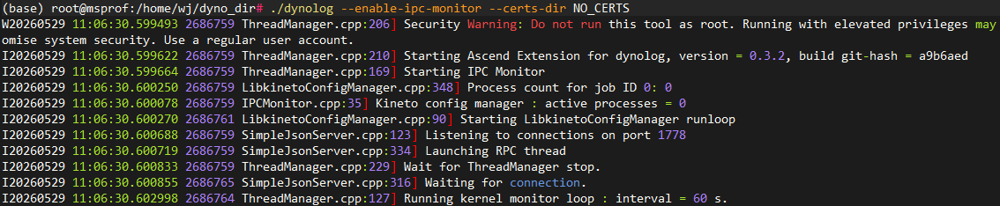

### 启动训练

设置 `MSMONITOR_USE_DAEMON` 环境变量为1，开启msMonitor功能。

```bash
export MSMONITOR_USE_DAEMON=1
```

拉起 Megatron 训练模型。

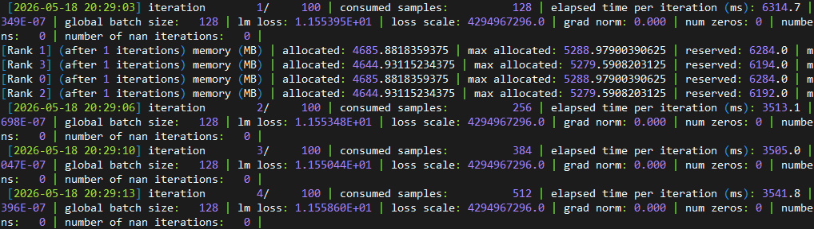

### nputrace 子命令

发送 nputrace 子命令，采集性能数据，详细参数说明请参考 [nputrace 子命令](../user_guide/nputrace_instruct.md)。

```bash
# 从下一个step开始采集，采集 2 个step，采集框架、CANN和Device数据，同时采集完后自动解析以及解析完成不做数据精简，落盘路径为/tmp/profile_data
dyno --certs-dir NO_CERTS nputrace --start-step -1 --iterations 2 --activities CPU,NPU --analyse --data-simplification false --log-file /tmp/profile_data
```

训练进程接收到采集配置，开启性能数据采集和解析。

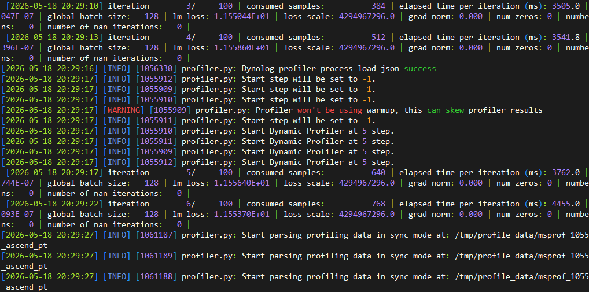

采集结果，落盘的数据格式和交付件介绍请参见 [Ascend PyTorch Profiler 输出结果文件说明](https://gitcode.com/Ascend/pytorch/blob/v2.7.1/docs/zh/ascend_pytorch_profiler/ascend_pytorch_profiler_user_guide.md#%E8%BE%93%E5%87%BA%E7%BB%93%E6%9E%9C%E6%96%87%E4%BB%B6%E8%AF%B4%E6%98%8E)

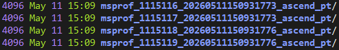

使用 [MindStudio Insight](https://gitcode.com/Ascend/msinsight/blob/master/docs/zh/user_guide/overview.md) 工具进行性能数据的查看和分析

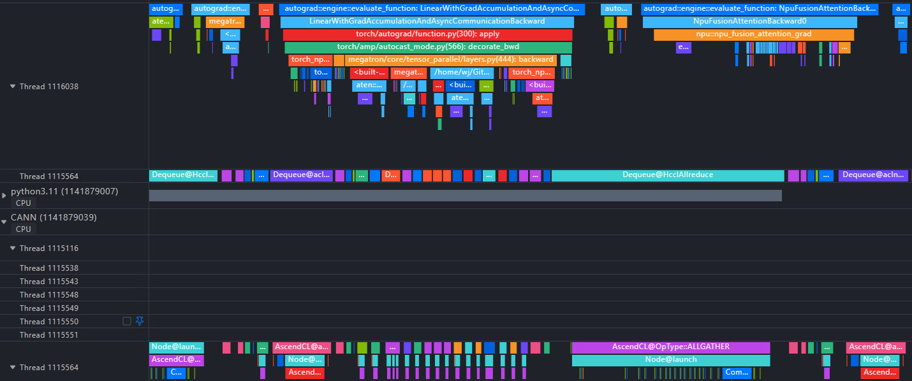

### npu-monitor 子命令

> [!NOTE] Note
> npu-monitor 子命令底层依赖 [msPTI](https://gitcode.com/Ascend/mspti) 接口，实现轻量化数据采集，由于 msPTI 实现机制的变更，CANN 9.0.0 之前的版本，在拉起训练前，需要设置 LD_PRELOAD 环境变量，指向 msPTI 库的路径，示例如下，CANN 9.0.0 及之后版本无需设置。

```bash
# export LD_PRELOAD=<CANN Toolkit安装路径>/cann/lib64/libmspti.so
# 默认路径示例：
export LD_PRELOAD=/usr/local/Ascend/cann/lib64/libmspti.so
```

发送 npu-monitor 子命令，采集性能数据，详细参数说明请参考 [npu-monitor 子命令](../user_guide/npumonitor_instruct.md)。

```bash
# 数据落盘路径为/tmp/msmonitor_jsonl，落盘周期为 30s，采集数据类型为Marker，Kernel，Communication，以 Jsonl 格式落盘
dyno --certs-dir NO_CERTS npu-monitor --npu-monitor-start --report-interval-s 30 --mspti-activity-kind Marker,Kernel,Communication --log-file /tmp/msmonitor_jsonl --export-type Jsonl
```

训练进程接收到采集配置，开启性能数据采集和落盘。

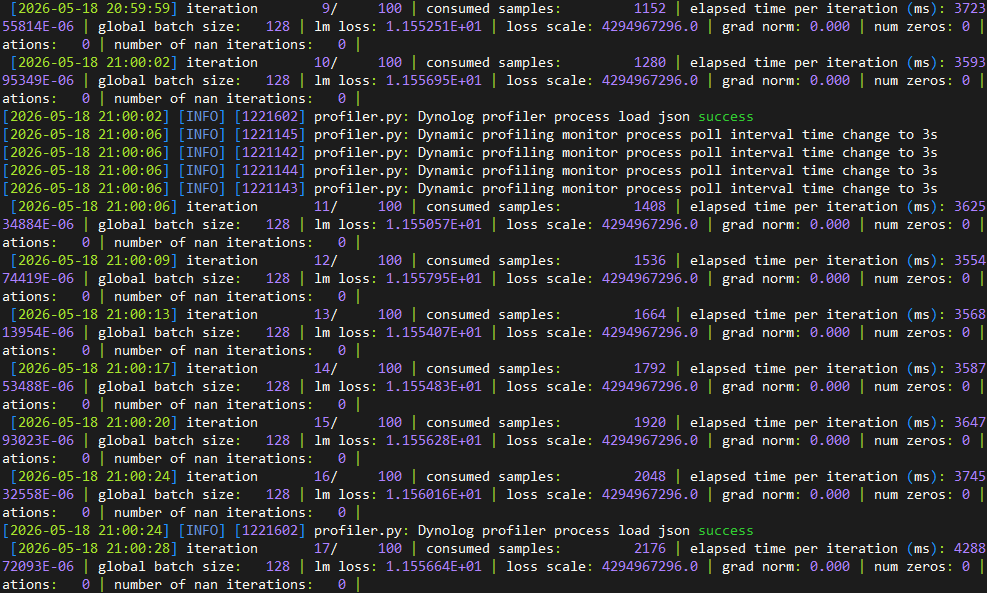

采集一段时间后，发送命令，停止采集。

```bash
dyno --certs-dir NO_CERTS npu-monitor --npu-monitor-stop
```

在用户设置的落盘路径下，即可找到采集到的性能数据文件，Jsonl 格式，每行数据包含一条采集到的性能数据，方便用户后续分析。

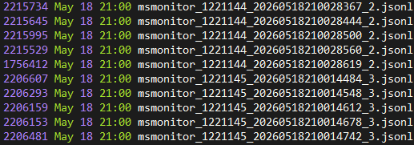

其中包含 Marker（如 step）、Kernel、Communication 耗时信息等。

Marker 数据，包含每个 step 在 Host 和 Device 上的耗时信息：

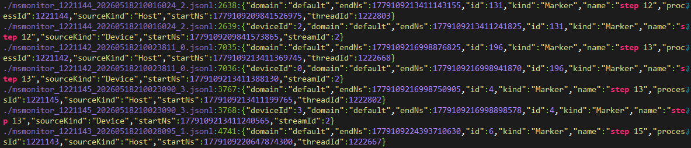

Kernel 数据，包含计算算子在 Device 上的执行耗时、类型等信息：

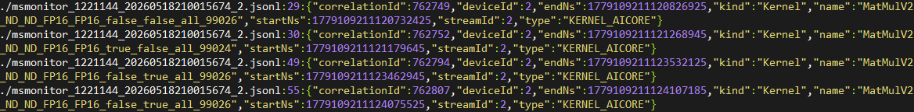

Communication 数据，包含通信算子在 Device 上的执行耗时、传输的数据类型等信息：

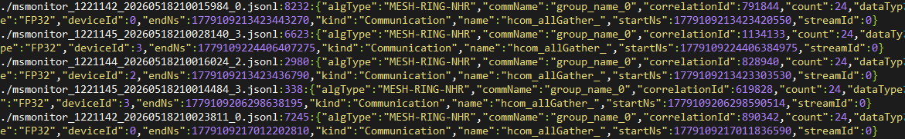

## 案例二：推理场景 vLLM

### 前置准备

推理场景通常只有模型的前向执行，没有优化器的调用，因此用户需要在推理的迭代中，通常是每次模型前向调用，手动执行 `torch_npu.dynamic_profiler.step` 方法，才能完成推理迭代的区间界定。在 vLLM 0.11.0 及之后版本中，msMonitor 支持在模型的 forward 方法中，自动调用 `torch_npu.dynamic_profiler.step` 方法，无需用户手动调用。之前的版本则需要用户手动执行。

参考 vllm-ascend 修改pr：https://github.com/vllm-project/vllm-ascend/pull/3123

```python
# 加载dynamic_profile模块
from torch_npu.profiler import dynamic_profile as dp
...

class NPUWorker(WorkerBase):

    def execute_model(
        self,
        scheduler_output: "SchedulerOutput",
    ) -> ModelRunnerOutput | AsyncModelRunnerOutput | None:
        # enable msMonitor to monitor the performance of vllm-ascend
        if envs_ascend.MSMONITOR_USE_DAEMON:
            dp.step()
        ...
```

### 启动dynolog daemon

```bash
dynolog --certs-dir NO_CERTS --enable-ipc-monitor
```


### 启动推理服务

设置 `MSMONITOR_USE_DAEMON` 环境变量为1，开启 msMonitor 功能。

```bash
export MSMONITOR_USE_DAEMON=1
```

拉起 vLLM 推理服务

```bash
# 拉起 vLLM 推理服务
# 模型权重路径为 /path/to/model_weights
# 监听地址为 127.0.0.1
# 监听端口为 58000
# 张量并行大小为 4
vllm serve /path/to/model_weights --host 127.0.0.1 --port 58000 --tensor-parallel-size 4
```

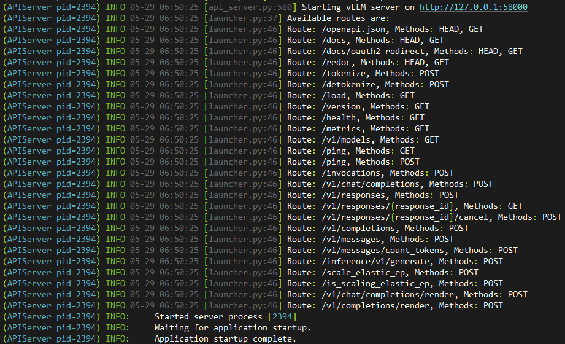

### 后台持续发起推理请求

在推理服务启动后，用户需要在另一个终端中，持续发起推理请求，使模型保持运行状态。

```bash
#!/bin/bash

# 配置
URL="http://127.0.0.1:58000/v1/chat/completions"
INTERVAL=0.1  # 请求间隔(秒)
COUNT=0     # 计数

echo "开始持续请求 vLLM，按 Ctrl+C 停止"

while true
do
  COUNT=$((COUNT+1))
  echo "===== 第 $COUNT 次请求 ====="

  curl -s -X POST "$URL" \
  -H "Content-Type: application/json" \
  -d '{
    "model": "your-model-name",
    "messages": [{"role":"user","content":"What is large language model"}],
    "temperature": 0.7,
    "max_tokens": 256
  }'

  echo -e "\n-------------------------"
  sleep $INTERVAL
done
```

### nputrace 子命令

发送 nputrace 子命令，采集性能数据，详细参数说明请参考 [nputrace 子命令](../user_guide/nputrace_instruct.md)。

```bash
# 从下一个step开始采集，采集 10 个step，采集框架、CANN和Device数据，落盘路径为/tmp/profile_data_vllm
dyno --certs-dir NO_CERTS nputrace --start-step -1 --iterations 10 --with-modules --activities CPU,NPU --log-file /tmp/profile_data_vllm
```

推理进程接收到采集配置，开启性能数据采集。

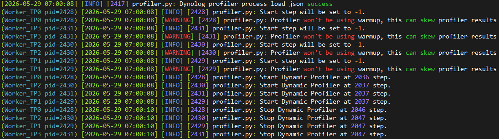

注意，通常 vllm 模型进程是以守护进程的形式运行的，所以无法支持在线解析性能数据，需要用户在采集完成后，手动解析性能数据。

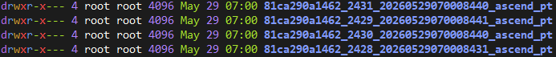

离线解析性能数据。

```bash
# 执行 Python 命令，解析性能数据
python -c "import torch_npu; torch_npu.profiler.profiler.analyse('/tmp/profile_data_vllm/81ca290a1462_2429_20260529070008441_ascend_pt')"
```

解析完成后，生成的数据格式和交付件介绍请参见 [Ascend PyTorch Profiler 输出结果文件说明](https://gitcode.com/Ascend/pytorch/blob/v2.7.1/docs/zh/ascend_pytorch_profiler/ascend_pytorch_profiler_user_guide.md#%E8%BE%93%E5%87%BA%E7%BB%93%E6%9E%9C%E6%96%87%E4%BB%B6%E8%AF%B4%E6%98%8E)。

使用 [MindStudio Insight](https://gitcode.com/Ascend/msinsight/blob/master/docs/zh/user_guide/overview.md) 工具进行性能数据的查看和分析。

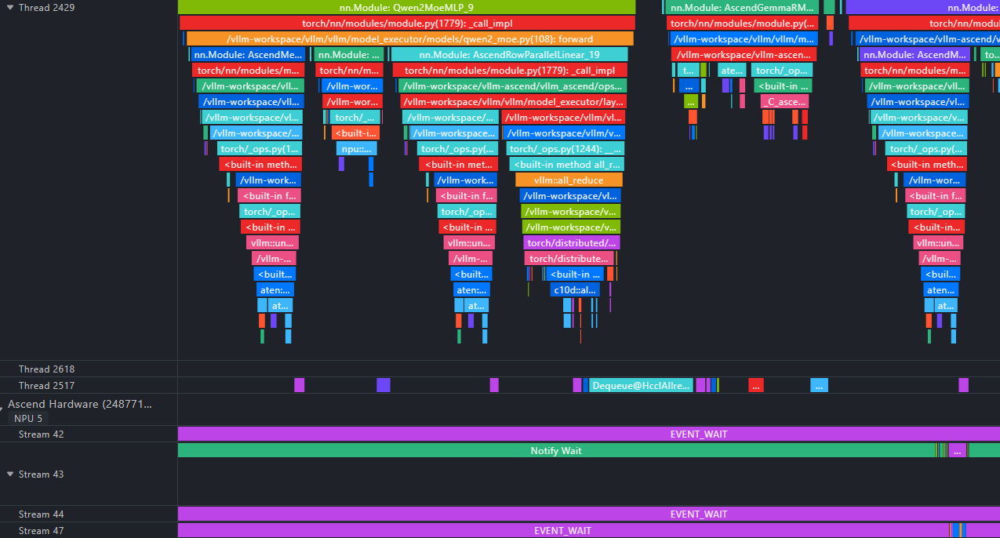

### npu-monitor 子命令

> [!NOTE] Note
> npu-monitor 子命令底层依赖 [msPTI](https://gitcode.com/Ascend/mspti) 接口，实现轻量化数据采集，由于 msPTI 实现机制的变更，CANN 9.0.0 之前的版本，在拉起训练前，需要设置 LD_PRELOAD 环境变量，指向 msPTI 库的路径，示例如下，CANN 9.0.0 及之后版本无需设置。

```bash
# export LD_PRELOAD=<CANN Toolkit安装路径>/cann/lib64/libmspti.so
# 默认路径示例：
export LD_PRELOAD=/usr/local/Ascend/cann/lib64/libmspti.so
```

发送 npu-monitor 子命令，采集性能数据，详细参数说明请参考 [npu-monitor 子命令](../user_guide/npumonitor_instruct.md)。

```bash
# 数据落盘路径为/tmp/msmonitor_vllm_jsonl，落盘周期为 30s，采集数据类型为Marker，Kernel，Communication，以 Jsonl 格式落盘
dyno --certs-dir NO_CERTS npu-monitor --npu-monitor-start --report-interval-s 30 --mspti-activity-kind Marker,Kernel,Communication --log-file /tmp/msmonitor_vllm_jsonl --export-type Jsonl
```

推理进程接收到采集配置，开启性能数据采集和落盘。

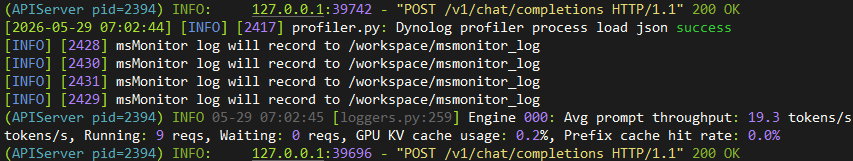

采集一段时间后，发送命令，停止采集。

```bash
dyno --certs-dir NO_CERTS npu-monitor --npu-monitor-stop
```

在用户设置的落盘路径下，即可找到采集到的性能数据文件，Jsonl 格式，每行数据包含一条采集到的性能数据，方便用户后续分析。

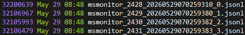

其中包含 Marker（如 step）、Kernel、Communication 耗时信息等。

Marker 数据，包含每个 step 在 Host 和 Device 上的耗时信息：

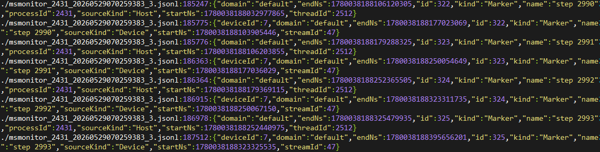

Kernel 数据，包含计算算子在 Device 上的执行耗时、类型等信息：

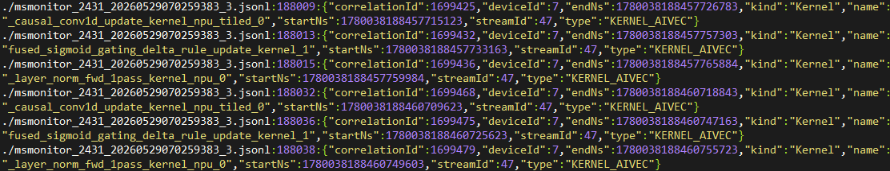

Communication 数据，包含通信算子在 Device 上的执行耗时、传输的数据类型等信息：

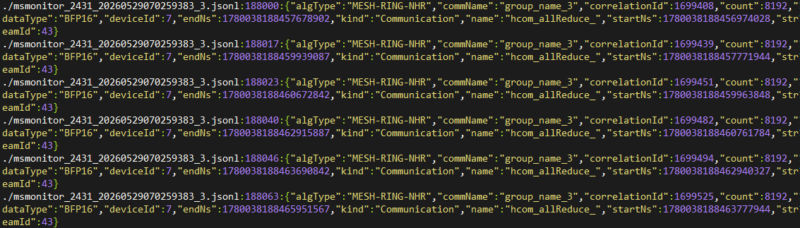

## 其他

### Torch NPU 自定义打点

针对大集群场景传统 Profiling 数据量大、分析流程复杂的现象，通过使用 torch_npu.npu.mstx 自定义打点功能，自定义采集时间段或者关键函数的开始和结束时间点，识别关键函数或迭代等信息，对性能问题快速定界。

**使用示例**

在PyTorch脚本中对于想采集的事件调用`torch_npu.npu.mstx`、`torch_npu.npu.mstx.mark`、`torch_npu.npu.mstx.range_start`、`torch_npu.npu.mstx.range_end`、`torch_npu.npu.mstx.mstx_range`等接口实现打点，采集对应事件的耗时。

只记录 Host 侧 range 耗时：

```python
id = torch_npu.npu.mstx.range_start("dataloader", None)    # 第二个入参设置None或者不设置，只记录 Host 侧 range 耗时
dataloader()
torch_npu.npu.mstx.range_end(id)
```

在计算流上打点，记录 Host 侧 range 耗时和 Device 侧对应的 range 耗时：

```python
stream = torch_npu.npu.current_stream()
id = torch_npu.npu.mstx.range_start("matmul", stream)    # 第二个入参设置有效的stream，记录 Host 侧 range 耗时和 Device 侧对应的 range 耗时
torch.matmul()    # 计算流操作示意
torch_npu.npu.mstx.range_end(id)
```

用户在模型脚本中完成自定义打点后，即可通过 msMonitor 的 nputrace 和 npu-monitor 子命令采集打点信息。

nputrace 子命令需要设置 `msprof-tx` 参数，以及 mstx_domain_include 或 mstx_domain_exclude 参数对打点数据的 domain 进行过滤，示例如下：

```bash
dyno --certs-dir NO_CERTS nputrace --msprof-tx ...
```

npu-monitor 子命令需要开启 `Marker` 类型数据采集，示例如下：

```bash
dyno --certs-dir NO_CERTS npu-monitor --npu-monitor-start --mspti-activity-kind Marker ...
```

### 获取并行策略通信域信息

多卡模型场景下，通常需要结合并行策略通信域信息，才能正确分析通信性能问题。

在 torch 调用 `new_group` 接口创建通信域时，可以通过 `pg_options` 参数传入用户自定义的信息，例如 group_name、hccl_buffer_size 等。在 torch npu中，`pg_options` 参数对应的对象是 `torch_npu._C_.distributed_c10d.ProcessGroupHccl.Options`，通过在该对象中设置 group_name，即可在 msMonitor 中查看该通信域的信息。

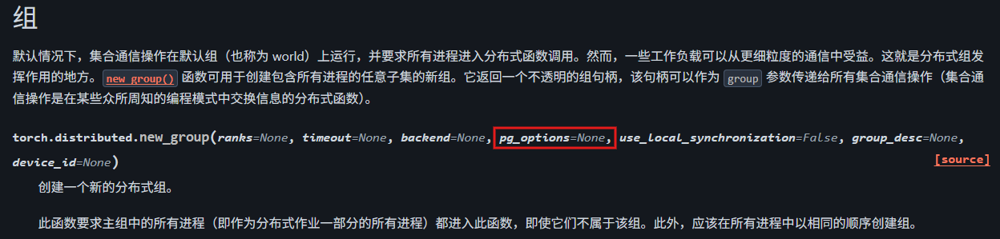

如果用户需要采集并行策略通信域的信息，需要在 torch 调用 `new_group` 接口时，传入 group_name 参数，以Megatron/MindSpeed为例：

```python
import torch_npu
from functools import wraps

def get_nccl_options_add_group_info_wrapper(get_nccl_options):
    @wraps(get_nccl_options)
    def wrapper(pg_name, nccl_comm_cfgs):
        options = get_nccl_options(pg_name, nccl_comm_cfgs)
        if hasattr(torch_npu._C._distributed_c10d.ProcessGroupHCCL.Options, 'hccl_config'):
            options = options if options is not None else torch_npu._C._distributed_c10d.ProcessGroupHCCL.Options()
            try:
                hccl_config = options.hccl_config
                hccl_config.update({'group_name': pg_name})
                options.hccl_config = hccl_config
            except TypeError as e:
                pass
        return options
    return wrapper
```

Megatron 创建通信域示例：

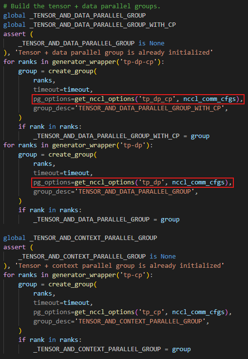

完成上述修改后，在 nputrace 子命令交付件 profiler_metadata.json 中，即可查看并行策略通信域的信息，在 npu-monitor 子命令落盘的 jsonl 文件中也会包含该信息。

```json
"parallel_group_info": {
    "group_name_0": {
        "group_name": "default_group",
        "group_rank": 2,
        "global_ranks": [0, 1, 2, 3]
    },
    "group_name_5": {
        "group_name": "dp",
        "group_rank": 0,
        "global_ranks": [2]
    },
    "group_name_13": {
        "group_name": "dp_cp",
        "group_rank": 0,
        "global_ranks": [2]
    },
    "group_name_21": {
        "group_name": "mp",
        "group_rank": 2,
        "global_ranks": [0, 1, 2, 3]
    },
    "group_name_23": {
        "group_name": "tp",
        "group_rank": 0,
        "global_ranks": [2, 3]
    }
}
```
