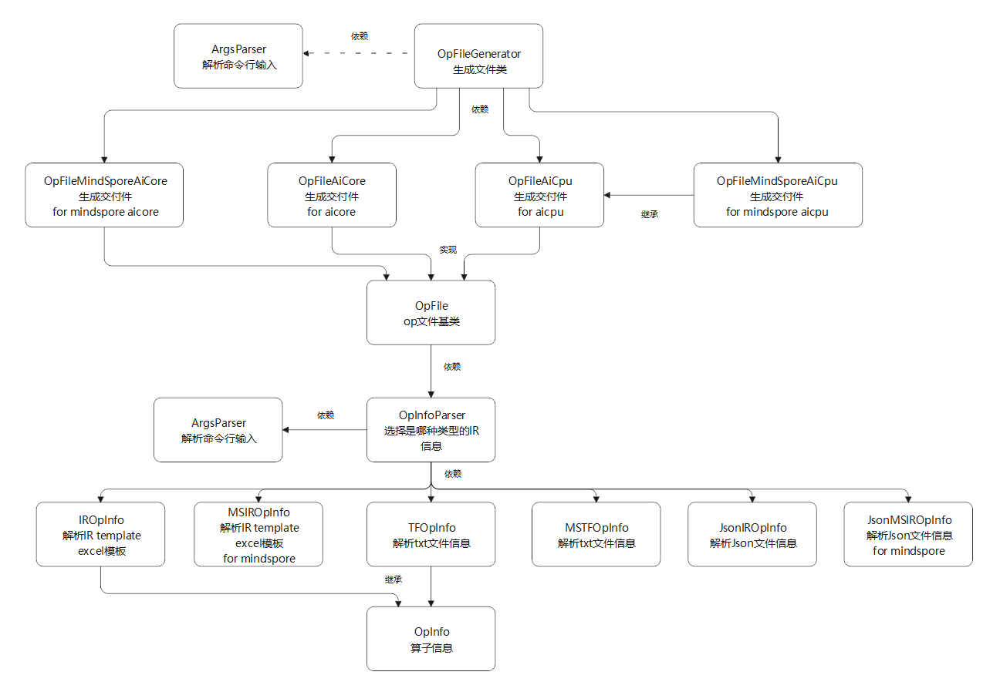

# msOpGen Architecture Design Specifications

<br>

## 1 Project Overview

### 1.1 Background and Motivation

Operator development involves extensive framework code (Host-side prototype registration, Tiling strategies, Kernel-side operator implementation, build configuration, etc.). Manually setting up operator projects is tedious and error-prone. msOpGen automatically generates a complete operator project framework from JSON prototype definition files, allowing developers to focus on core algorithm logic.

### 1.2 Feature List

| Type | Feature | Description |
|-----|------|------|
| Core | Operator Project Generation | Generates complete Ascend C/TBE/AI CPU operator projects from JSON prototypes |
| Core | Multi-Framework Adaptation | Supports TensorFlow, PyTorch, MindSpore, ONNX frameworks and aclnn direct invocation |
| Core | Operator Append | Supports appending new operators to existing projects (`-m 1` mode) |
| Core | Simulation Pipeline Visualization | Parses performance simulation dump data to generate Chrome tracing views |
| Core | Compilation & Deployment | Generates build.sh compilation scripts and .run deployment packages |
| Support | ST Testing | msOpST tool auto-generates test cases and executes them on hardware |
| Support | On-Board Test Framework | msOpST ascendc_test generates kernel direct-invoke test framework |

---

## 2 Design Goals

| Design Goal | Description |
|---------|------|
| **Completeness** | Generated projects can be compiled and deployed directly without manual framework code |
| **Multi-Framework Coverage** | Unified JSON interface adapts to multiple AI frameworks, reducing learning costs |
| **Configurable Build** | Flexible configuration of build options, chip models, and distribution modes via CMakePresets.json |
| **CLI Usability** | Clear and intuitive parameter design with sensible defaults |

---

## 3 Architecture Overview

### 3.1 System Architecture

```text
┌──────────────────────────────────────────────┐
│                CLI Layer                      │
│   msopgen gen    msopgen sim    msopst        │
└──────────────────┬───────────────────────────┘
                   │
┌──────────────────▼───────────────────────────┐
│              Core Engine Layer                 │
│  ┌──────────┐  ┌──────────┐  ┌────────────┐  │
│  │ JSON     │  │ Template │  │ Dump       │  │
│  │ Parser   │  │ Engine   │  │ Analyzer   │  │
│  └──────────┘  └──────────┘  └────────────┘  │
│  ┌──────────┐  ┌──────────────────────────┐  │
│  │ ST Test  │  │ Project Builder          │  │
│  │ Generator│  │ (CMake/Build Integration)│  │
│  └──────────┘  └──────────────────────────┘  │
└──────────────────┬───────────────────────────┘
                   │
┌──────────────────▼───────────────────────────┐
│                Output Layer                    │
│  Operator project / .run package /             │
│  trace.json / ST case.json / st_report.json   │
└──────────────────────────────────────────────┘
```

### 3.2 Module Division

| Module | Responsibility | Input | Output |
|------|------|------|------|
| JSON Parser | Parse and validate operator prototype definition files | `*.json` prototype | Structured operator description |
| Template Engine | Generate project templates from operator description and chip model | Operator description + soc_version | Complete operator project directory |
| Dump Analyzer | Parse performance simulation dump data | Dump data files | trace.json pipeline visualization |
| Project Builder | Generate CMakeLists.txt, CMakePresets.json, build.sh | Operator description + build options | Buildable project |
| ST Test Generator | Parse Host-side source code to generate ST test cases | `op_host/*.cpp` | `*_case.json` |
| ST Test Runner | Execute hardware tests and generate reports | `*_case.json` + soc | `st_report.json` |

### 3.3 Data Flow

```text
Operator JSON ──→ [JSON Parser] ──→ 算子描述结构体
                                       │
                                [Template Engine] ──→ 算子工程目录
                                       │
                                [用户编写 Kernel 实现]
                                       │
                              [build.sh 编译] ──→ .run 部署包
                                       │                               
                                [msopst create]                       
                                       │                                     
                                ST 用例 .json   
                                       │                         
                                [msopst run]                       
                                       │                                 
                                st_report.json                           
```

---

## 4 Key Technical Points

### 4.1 Template Substitution Mechanism

msOpGen uses a template engine to automatically replace placeholders in C++ source templates based on the operator name, input/output parameter types, and formats defined in the JSON prototype, generating both Host-side (prototype registration, Shape inference, Tiling, info library) and Kernel-side (operator logic) framework code.

### 4.2 Naming Rules

Strict conversion rules between operator type (OpType) and file names / kernel function names:
- PascalCase → snake_case
- Example: `AddCustom` → `add_custom.cpp` / `add_custom`

### 4.3 Distribution Modes

- **Source Distribution**: Retain kernel source .cpp files, supporting online compilation and ATC model conversion
- **Binary Distribution**: Compile to .o and .json info files for direct operator binary invocation

---

## 5 Directory Structure

```text
├── example/       // Tool examples
├── docs/          // Project documentation
├── msopgen/       // msopgen source code
├── tools/msopst/  // msopst code
├── test/
│   ├── msopgen/   // msopgen unit tests
│   └── msopst/    // msopst unit tests
├── output/        // WHL package output, test reports
├── setup.py       // msopgen WHL build script
└── build.py       // Build entry script
```

## 6 msOpGen Class Diagram


