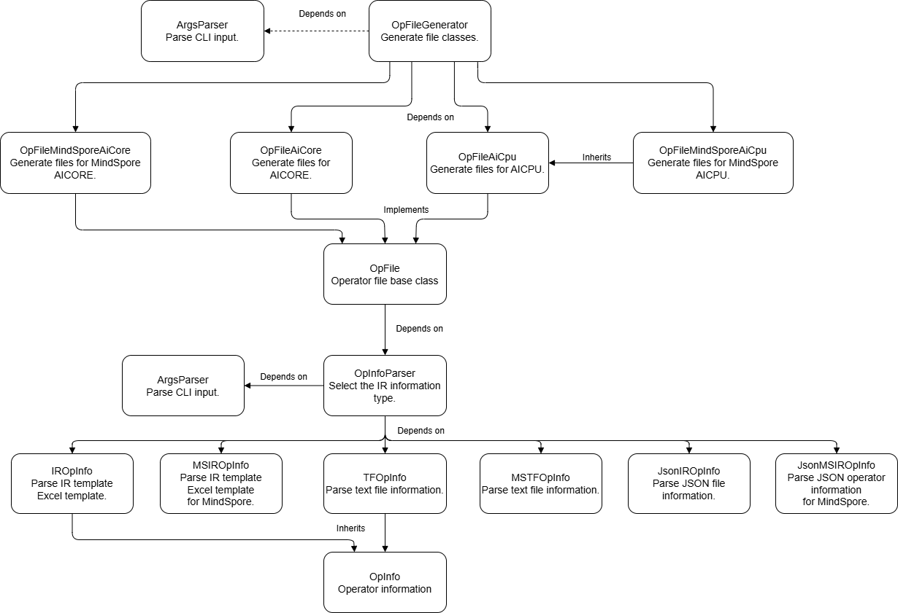

# msOpGen Architecture Design Specifications

<br>

## 1 Project Overview

### 1.1 Background and Motivation

Operator development involves a large amount of framework code, including host-side prototype registration, Tiling strategies, kernel-side operator implementation, and compilation configuration. Manually setting up an operator project is cumbersome and error-prone. msOpGen automatically generates a complete operator project framework from an operator prototype definition JSON file, allowing you to focus on the core algorithm logic.

### 1.2 Feature List

| Type | Feature | Description |
|-----|---------|-------------|
| Service feature | Operator project generation | Generates a complete AscendC/TBE/AI CPU operator project based on a JSON prototype definition. |
| Service feature | Multi-framework support | Supports the TensorFlow, PyTorch, MindSpore, and ONNX frameworks. |
| Service feature | Operator addition | Supports adding new operators to an existing operator project (`-m 1` mode). |
| Service feature | Simulation pipeline graph parsing | Parses performance simulation dump data and generates a pipeline graph that can be viewed in Chrome tracing. |
| Service feature | Compilation and deployment integration | Generates the `build.sh` compilation script and `.run` operator deployment package. |
| Supporting tool | ST testing | The msOpST tool automatically generates test cases and runs them in a hardware environment. |

---

## 2 Design Goals

| Design Goal | Description |
|------------|-------------|
| **Project completeness** | The generated project can be compiled and deployed directly without manually adding framework code. |
| **Multi-framework coverage** | A unified JSON interface supports multiple AI frameworks, reducing the learning cost. |
| **Configurable compilation** | `CMakePresets.json` flexibly configures compilation options, chip models, and release modes. |
| **CLI usability** | Parameters are clearly and intuitively designed, with support for default values and automatic inference. |

---

## 3 Architecture Overview

### 3.1 System Architecture Diagram

```text
┌──────────────────────────────────────────────┐
│               CLI Entry Layer                │
│   msopgen gen    msopgen sim    msopst         │
└──────────────────┬───────────────────────────┘
                   │
┌──────────────────▼───────────────────────────┐
│              Core Engine Layer               │
│  ┌──────────┐  ┌──────────┐  ┌────────────┐  │
│  │ JSON     │  │ Template │  │ Dump       │  │
│  │ Parser   │  │ Engine   │  │ Analyzer   │  │
│  └──────────┘  └──────────┘  └────────────┘  │
│  ┌──────────┐  ┌──────────────────────────┐  │
│  │ ST Test  │  │ Project Builder          │  │
│  │ Generator│  │ (CMake/Compilation)      │  │
│  └──────────┘  └──────────────────────────┘  │
└──────────────────┬───────────────────────────┘
                   │
┌──────────────────▼───────────────────────────┐
│                 Output Layer                 │
│ Operator project / .run package / trace.json │
│  ST test case .json / st_report.json          │
└──────────────────────────────────────────────┘
```

### 3.2 Module Breakdown

| Module | Responsibilities | Input | Output |
|--------|------------------|-------|--------|
| JSON Parser | Parses the operator prototype definition file and validates that the fields are valid. | `*.json` prototype definition | Structured operator description |
| Template Engine | Generates a project template based on the operator description and chip model. | Operator description + `soc_version` | Complete operator project directory |
| Dump Analyzer | Parses performance simulation dump data. | Dump data file | `trace.json` pipeline graph |
| Project Builder | Generates `CMakeLists.txt`, `CMakePresets.json`, and `build.sh`. | Operator description + compilation options | Compilable project |
| ST Test Generator | Parses host-side source code to generate ST test cases. | `op_host/*.cpp` | `*_case.json` |
| ST Test Runner | Runs hardware tests and generates a report. | `*_case.json` + `soc` | `st_report.json` |

### 3.3 Data Flow

```text
Operator prototype JSON ──→ [JSON Parser] ──→ Operator description structure
                                             │
                                [Template Engine] ──→ Operator project directory
                                             │
                                [Your Kernel implementation]
                                             │
                              [build.sh compilation] ──→ .run deployment package
                                             │
                                [msopst create]
                                             │
                                ST test case .json
                                [msopst run]
                                             │
                                st_report.json
```

---

## 4 Key Technical Points

### 4.1 Template Replacement Mechanism

Based on the operator name and the types and formats of the input and output parameters in the JSON prototype definition, msOpGen uses a template engine to automatically replace placeholders in C++ source code templates and generate framework code for the host side (prototype registration, Shape inference, Tiling implementation, and information library) and the kernel side (operator computation logic).

### 4.2 Naming Rules

Strict conversion rules apply between the operator type (OpType), file names, and kernel function names:

- PascalCase → snake_case
- Example: `AddCustom` → `add_custom.cpp` / `add_custom`

### 4.3 Release Modes

- **Source release**: Retains the Kernel source `.cpp` file and supports online compilation and ATC model conversion
- **Binary release**: Compiles `.o` and `.json` information files and directly calls the operator binary

---

## 5 Directory Structure

```text
├── example/       // Tool example
├── docs/          // Project documentation
├── msopgen/       // msopgen source code directory
├── tools/msopst/  // msopst code directory
├── test/
│   ├── msopgen/   // msopgen unit tests
│   └── msopst/    // msopst unit tests
├── output/        // WHL package output and test reports
├── setup.py       // msopgen WHL package build script
└── build.py       // Build entry script
```

## 6 msOpGen Class Diagram


