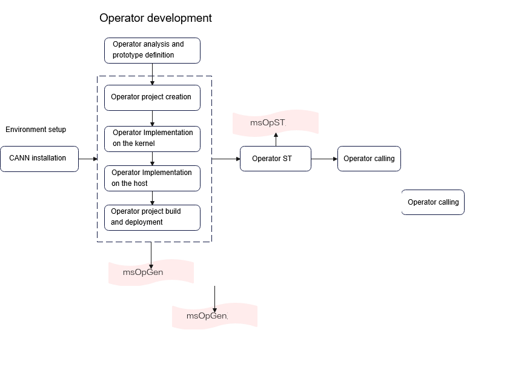
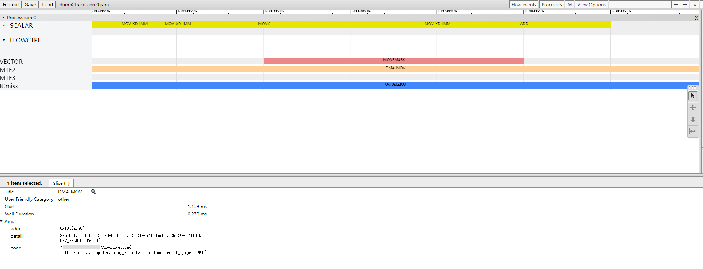
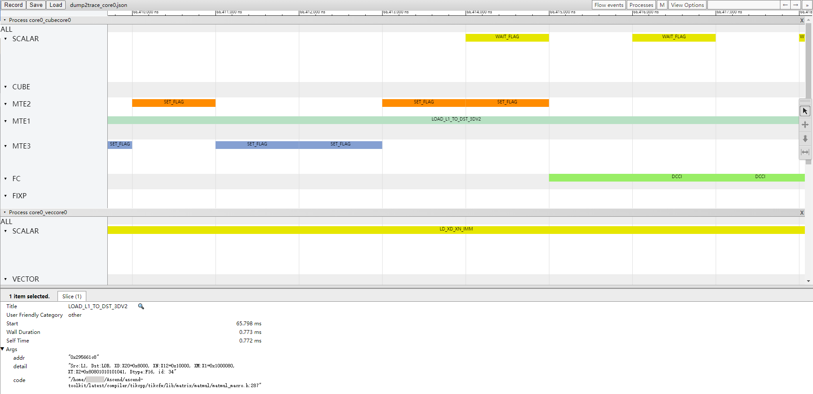
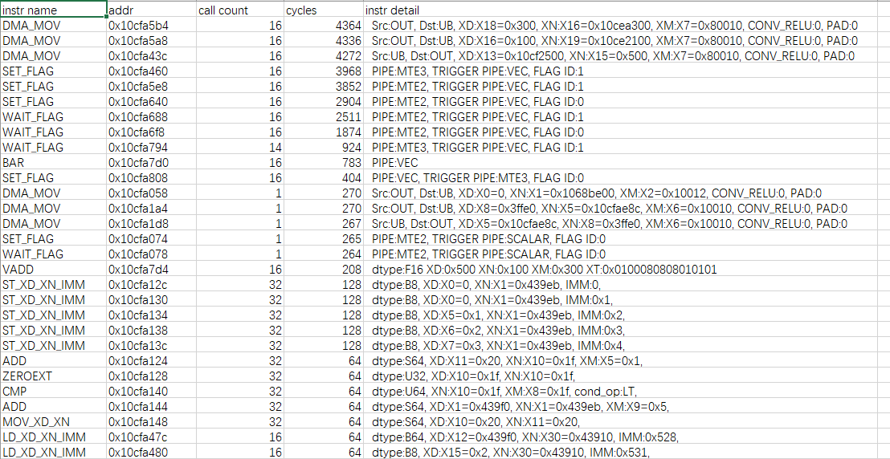
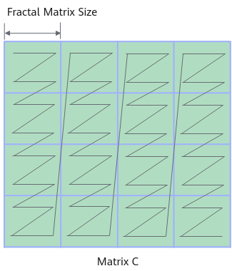
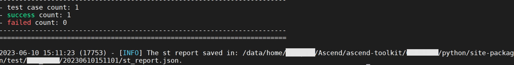

# **MindStudio Ops Generator User Guide** <a id="ZH-CN_TOPIC_0000002526346607"></a>

## Introduction<a id="ZH-CN_TOPIC_0000002494186946"></a>

**Tool Overview<a id="zh-cn_topic_0000001776910254_section17618134714611"></a>**

After analyzing an operator and defining the prototype, you can use MindStudio Ops Generator (msOpGen) to generate a custom operator project, build the project, and deploy it.  

It provides the following functions:

- Outputs operator projects based on the operator prototype definition.
- Outputs the operator simulation pipeline file based on the dump data file generated in the performance simulation environment.

**Tool Usage Process<a id="section1841083612111"></a>**

For details, see [Figure 1 msOpGen workflow](#fig1120319585112).

**Figure 1** msOpGen workflow<a id="fig1120319585112"></a>  


## Preparations<a id="Preparations"></a>

After the environment is set up according to the requirements, you can directly use msOpGen.

**Environment Setup<a id="section16705155515116"></a>**

Before developing an operator, install the CANN Toolkit and ops operator package of the required version and configure CANN environment variables. For details, see [CANN Software Installation Guide](https://www.hiascend.com/document/detail/zh/CANNCommunityEdition/83RC1/softwareinst/instg/instg_0000.html). No installation example is provided in this section.

**Constraints<a id="section160697141319"></a>**

- For security and least privilege purposes, you are advised to use a common user account instead of a high-permission user account (such as `root`) to run the tools in this code repository.
- Before using the operator development tools, ensure that the running user's `umask` is `0027` or more restrictive. Failure to do so may result in excessively permissive permissions on the directories and files where profile data is stored.
- Before using the operator development tools, ensure that the principle of least privilege is applied (for example, do not allow write access for `others` and avoid setting file permissions to `666` or `777`).
- You are not advised to configure or run custom scripts in directories of the `other` user to avoid privilege escalation.
- When downloading the code sample, run the following command to specify the branch version:

    ```sh
    git clone https://gitee.com/ascend/samples.git -b master
    ```

## Operator Project Creation Functions <a id="ZH-CN_TOPIC_0000002507799464"></a>

### Function Description <a id="ZH-CN_TOPIC_0000002539479309"></a>

msOpGen supports the following functions: operator project creation, operator implementation (on both host and kernel), operator project build and deployment, and operator simulation pipeline file parsing.

**Table 1** msOpGen functions

<a id="zh-cn_topic_0000001691887174_table2520191519210"></a>
<table><thead align="left"><tr id="zh-cn_topic_0000001691887174_row17520215162117"><th class="cellrowborder" valign="top" width="27.6%" id="mcps1.2.3.1.1"><p id="zh-cn_topic_0000001691887174_p4521815102112"><a id="zh-cn_topic_0000001691887174_p4521815102112"></a><a id="zh-cn_topic_0000001691887174_p4521815102112"></a>Function</p>
</th>
<th class="cellrowborder" valign="top" width="72.39999999999999%" id="mcps1.2.3.1.2"><p id="zh-cn_topic_0000001691887174_p7521415172116"><a id="zh-cn_topic_0000001691887174_p7521415172116"></a><a id="zh-cn_topic_0000001691887174_p7521415172116"></a>Link</p>
</th>
</tr>
</thead>
<tbody><tr id="zh-cn_topic_0000001691887174_row1152171542120"><td class="cellrowborder" valign="top" width="27.6%" headers="mcps1.2.3.1.1 "><p id="zh-cn_topic_0000001691887174_p16149193723113"><a id="zh-cn_topic_0000001691887174_p16149193723113"></a><a id="zh-cn_topic_0000001691887174_p16149193723113"></a>Operator project creation</p>
</td>
<td class="cellrowborder" valign="top" width="72.39999999999999%" headers="mcps1.2.3.1.2 "><p id="zh-cn_topic_0000001691887174_p1452121582114"><a id="zh-cn_topic_0000001691887174_p1452121582114"></a><a id="zh-cn_topic_0000001691887174_p1452121582114"></a><a href="#creating-an-operator-project">Creating an Operator Project</a></p>
</td>
</tr>
<tr id="zh-cn_topic_0000001691887174_row13521315132112"><td class="cellrowborder" valign="top" width="27.6%" headers="mcps1.2.3.1.1 "><p id="p648323893210"><a id="p648323893210"></a><a id="p648323893210"></a>Operator implementation (on both host and kernel)</p>
</td>
<td class="cellrowborder" valign="top" width="72.39999999999999%" headers="mcps1.2.3.1.2 "><p id="zh-cn_topic_0000001691887174_p25211015152117"><a id="zh-cn_topic_0000001691887174_p25211015152117"></a><a id="zh-cn_topic_0000001691887174_p25211015152117"></a><a href="#developing-an-operator">Developing an Operator</a></p
</td>
</tr>
<tr id="row333312710327"><td class="cellrowborder" valign="top" width="27.6%" headers="mcps1.2.3.1.1 "><p id="p133497193219"><a id="p133497193219"></a><a id="p133497193219"></a>Operator project build and deployment</p>
</td>
<td class="cellrowborder" valign="top" width="72.39999999999999%" headers="mcps1.2.3.1.2 "><p id="p19870155063312"><a id="p19870155063312"></a><a id="p19870155063312"></a><a href="#building-and-deploying-an-operator">Building and Deploying an Operator</a></p>
</td>
</tr>
<tr id="row13351279322"><td class="cellrowborder" valign="top" width="27.6%" headers="mcps1.2.3.1.1 "><p id="p23350723220"><a id="p23350723220"></a><a id="p23350723220"></a>Operator simulation pipeline file parsing</p>
</td>
<td class="cellrowborder" valign="top" width="72.39999999999999%" headers="mcps1.2.3.1.2 "><p id="p8973947104414"><a id="p8973947104414"></a><a id="p8973947104414"></a><a href="#viewing-the-operator-simulation-pipeline">Viewing the Operator Simulation Pipeline</a></p>
</td>
</tr>
</tbody>
</table>

### Precautions<a id="ZH-CN_TOPIC_0000002507639608"></a>

After an operator template is generated based on the input configuration parameters, you are advised to check the security of the operator project code before running the template.

### Command Syntax<a id="ZH-CN_TOPIC_0000002507963578"></a>

**Command<a id="section66278453613"></a>**

Run the following command. For details about the parameters, see [Table 1 Parameters for creating an operator project](#zh-cn_topic_0000001740005677_table20825174505717). After an operator template is generated based on the input configuration parameters, you are advised to check the security of the operator project code before running the template.

```sh
msopgen gen -i {*.json} -f {framework type} -c {Compute Resource} -lan cpp -out {Output Path}
```

### Parameter Description <a id="ZH-CN_TOPIC_0000002508123428"></a>

**Table 1** Parameters for creating an operator project

<a id="zh-cn_topic_0000001740005677_table20825174505717"></a>
<table><thead align="left"><tr id="zh-cn_topic_0000001740005677_row682564565718"><th class="cellrowborder" valign="top" width="19.220000000000002%" id="mcps1.2.4.1.1"><p id="zh-cn_topic_0000001740005677_p128251945155719"><a id="zh-cn_topic_0000001740005677_p128251945155719"></a><a id="zh-cn_topic_0000001740005677_p128251945155719"></a>Parameter</p>
</th>
<th class="cellrowborder" valign="top" width="66.95%" id="mcps1.2.4.1.2"><p id="zh-cn_topic_0000001740005677_p18251245125720"><a id="zh-cn_topic_0000001740005677_p18251245125720"></a><a id="zh-cn_topic_0000001740005677_p18251245125720"></a>Description</p>
</th>
<th class="cellrowborder" valign="top" width="13.83%" id="mcps1.2.4.1.3"><p id="zh-cn_topic_0000001740005677_p682514545718"><a id="zh-cn_topic_0000001740005677_p682514545718"></a><a id="zh-cn_topic_0000001740005677_p682514545718"></a>Required/Optional</p>
</th>
</tr>
</thead>
<tbody><tr id="zh-cn_topic_0000001740005677_row1182514455574"><td class="cellrowborder" valign="top" width="19.220000000000002%" headers="mcps1.2.4.1.1 "><p id="zh-cn_topic_0000001740005677_p58255455574"><a id="zh-cn_topic_0000001740005677_p58255455574"></a><a id="zh-cn_topic_0000001740005677_p58255455574"></a>gen</p>
</td>
<td class="cellrowborder" valign="top" width="66.95%" headers="mcps1.2.4.1.2 "><p id="zh-cn_topic_0000001740005677_p13826114510578"><a id="zh-cn_topic_0000001740005677_p13826114510578"></a><a id="zh-cn_topic_0000001740005677_p13826114510578"></a>Generates operator development deliverables.</p>
</td>
<td class="cellrowborder" valign="top" width="13.83%" headers="mcps1.2.4.1.3 "><p id="zh-cn_topic_0000001740005677_p182684519577"><a id="zh-cn_topic_0000001740005677_p182684519577"></a><a id="zh-cn_topic_0000001740005677_p182684519577"></a>Required</p>
</td>
</tr>
<tr id="zh-cn_topic_0000001740005677_row98261945145710"><td class="cellrowborder" valign="top" width="19.220000000000002%" headers="mcps1.2.4.1.1 "><p id="zh-cn_topic_0000001740005677_p198261452574"><a id="zh-cn_topic_0000001740005677_p198261452574"></a><a id="zh-cn_topic_0000001740005677_p198261452574"></a>-i, --input</p>
</td>
<td class="cellrowborder" valign="top" width="66.95%" headers="mcps1.2.4.1.2 "><p id="zh-cn_topic_0000001740005677_p282694575716"><a id="zh-cn_topic_0000001740005677_p282694575716"></a><a id="zh-cn_topic_0000001740005677_p282694575716"></a>Operator prototype definition file (.json) path, which can be an absolute path or a relative path. The tool running user must have the read permission on this path.</p>
</td>
<td class="cellrowborder" valign="top" width="13.83%" headers="mcps1.2.4.1.3 "><p id="zh-cn_topic_0000001740005677_p12826945145713"><a id="zh-cn_topic_0000001740005677_p12826945145713"></a><a id="zh-cn_topic_0000001740005677_p12826945145713"></a>Required</p>
</td>
</tr>
<tr id="zh-cn_topic_0000001740005677_row88264455577"><td class="cellrowborder" valign="top" width="19.220000000000002%" headers="mcps1.2.4.1.1 "><p id="zh-cn_topic_0000001740005677_p15826184516572"><a id="zh-cn_topic_0000001740005677_p15826184516572"></a><a id="zh-cn_topic_0000001740005677_p15826184516572"></a>-f, --framework</p>
</td>
<td class="cellrowborder" valign="top" width="66.95%" headers="mcps1.2.4.1.2 "><p id="zh-cn_topic_0000001740005677_p48261745105714"><a id="zh-cn_topic_0000001740005677_p48261745105714"></a><a id="zh-cn_topic_0000001740005677_p48261745105714"></a>Framework type.</p>
<a id="zh-cn_topic_0000001740005677_ul5826144515578"></a><a id="zh-cn_topic_0000001740005677_ul5826144515578"></a><ul id="zh-cn_topic_0000001740005677_ul5826144515578"><li>By default, the TensorFlow framework is used. Default value: tf or tensorflow</li><li>Caffe framework: <code>caffe</code><div class="note" id="note3645111616382"><a id="note3645111616382"></a><a id="note3645111616382"></a><span class="notetitle"> Note: </span><div class="notebody"><p id="p1364551663812"><a id="p1364551663812"></a><a id="p1364551663812"></a>Custom Ascend C operators do not support the Caffe framework.</p>
</div></div>
</li><li>PyTorch framework: pytorch</li><li>MindSpore framework: <code>ms</code>
 or <code>mindspore</code></li><li>ONNX framework: <code>onnx</code></li></ul>
<div class="note" id="zh-cn_topic_0000001740005677_note75526525356"><a id="zh-cn_topic_0000001740005677_note75526525356"></a><a id="zh-cn_topic_0000001740005677_note75526525356"></a><span class="notetitle"> Note: </span><div class="notebody"><a id="zh-cn_topic_0000001740005677_ul1483915433531"></a><a id="zh-cn_topic_0000001740005677_ul1483915433531"></a><ul id="zh-cn_topic_0000001740005677_ul1483915433531"><li>All values are case insensitive. </li><li>TBE&TIK do not support single-operator API call. By default, the TensorFlow framework is generated. </li><li>Ascend C operator projects support the TensorFlow framework, PyTorch framework, and single-operator API call. By default, the TensorFlow framework is generated. </li><li>When <code>-f aclnn</code> is used, an Ascend C operator project is generated.</li></ul>
</div></div>
</td>
<td class="cellrowborder" valign="top" width="13.83%" headers="mcps1.2.4.1.3 "><p id="zh-cn_topic_0000001740005677_p7827154512574"><a id="zh-cn_topic_0000001740005677_p7827154512574"></a><a id="zh-cn_topic_0000001740005677_p7827154512574"></a>Optional</p>
</td>
</tr>
<tr id="row790282815185"><td class="cellrowborder" valign="top" width="19.220000000000002%" headers="mcps1.2.4.1.1 "><p id="zh-cn_topic_0000001740005677_p11914135218228"><a id="zh-cn_topic_0000001740005677_p11914135218228"></a><a id="zh-cn_topic_0000001740005677_p11914135218228"></a>-lan, --language</p>
</td>
<td class="cellrowborder" valign="top" width="66.95%" headers="mcps1.2.4.1.2 "><p id="zh-cn_topic_0000001740005677_p885792872216"><a id="zh-cn_topic_0000001740005677_p885792872216"></a><a id="zh-cn_topic_0000001740005677_p885792872216"></a>Operator encoding language.</p>
<a id="zh-cn_topic_0000001740005677_ul142592250248"></a><a id="zh-cn_topic_0000001740005677_ul142592250248"></a><ul id="zh-cn_topic_0000001740005677_ul142592250248"><li><code>cpp</code>: Use C/C++ for operator development based on the <span id="ph18765379559"><a id="ph18765379559"></a><a id="ph18765379559"></a>Ascend C</span> framework. </li><li><code>py</code>: Use Python for operator development based on the DSL and TIK frameworks.</li></ul>
<p id="zh-cn_topic_0000001740005677_p1651012022614"><a id="zh-cn_topic_0000001740005677_p1651012022614"></a><a id="zh-cn_topic_0000001740005677_p1651012022614"></a>Default value: <code>py</code>.</p>
<div class="note" id="note4520168111917"><a id="note4520168111917"></a><a id="note4520168111917"></a><span class="notetitle"> Note: </span><div class="notebody"><p id="p105204881911"><a id="p105204881911"></a><a id="p105204881911"></a><strong id="b1816821316196"><a id="b1816821316196"></a><a id="b1816821316196"></a><code>cpp</code>
</strong> applies only to Ascend C operator development scenarios.</p>
</div></div>
</td>
<td class="cellrowborder" valign="top" width="13.83%" headers="mcps1.2.4.1.3 "><p id="zh-cn_topic_0000001740005677_p108571628192219"><a id="zh-cn_topic_0000001740005677_p108571628192219"></a><a id="zh-cn_topic_0000001740005677_p108571628192219"></a>Optional</p>
</td>
</tr>
<tr id="zh-cn_topic_0000001740005677_row3827114535715"><td class="cellrowborder" valign="top" width="19.220000000000002%" headers="mcps1.2.4.1.1 "><p id="zh-cn_topic_0000001740005677_p9827945125719"><a id="zh-cn_topic_0000001740005677_p9827945125719"></a><a id="zh-cn_topic_0000001740005677_p9827945125719"></a>-c, --compute_unit</p>
</td>
<td class="cellrowborder" valign="top" width="66.95%" headers="mcps1.2.4.1.2 "><a id="zh-cn_topic_0000001740005677_ul131481444164116"></a><a id="zh-cn_topic_0000001740005677_ul131481444164116"></a><ul id="zh-cn_topic_0000001740005677_ul131481444164116"><li>Compute resources used by the operator. <p id="zh-cn_topic_0000001740005677_p982910215314">Configuration format: <code>
ai_core-{soc version}</code>. <code>ai_core</code> and <code>{soc version}</code> are connected by a hyphen (-).</p>
<p id="zh-cn_topic_0000001740005677_p109605188117">Select according to the actual AI processor version.</p>
</li></ul>
<div class="note" id="zh-cn_topic_0000001740005677_note481620356579"><a id="zh-cn_topic_0000001740005677_note481620356579"></a><a id="zh-cn_topic_0000001740005677_note481620356579"></a><span class="notetitle"> Note: </span><div class="notebody"><p id="zh-cn_topic_0000001618617245_p15587811201611"><a id="zh-cn_topic_0000001618617245_p15587811201611"></a><a id="zh-cn_topic_0000001618617245_p15587811201611"></a>To determine the AI processor model <code>soc_version</code>, use the following method:</p>
<a id="zh-cn_topic_0000001618617245_ul1124912113117"></a><a id="zh-cn_topic_0000001618617245_ul1124912113117"></a><ul id="zh-cn_topic_0000001618617245_ul1124912113117"><li>For servers other than<span id="zh-cn_topic_0000001740005657_ph11939124012202"><a id="zh-cn_topic_0000001740005657_ph11939124012202"></a><a id="zh-cn_topic_0000001740005657_ph11939124012202"></a><term id="zh-cn_topic_0000001312391781_term1253731311225"><a id="zh-cn_topic_0000001312391781_term1253731311225"></a><a id="zh-cn_topic_0000001312391781_term1253731311225"></a> the Atlas A3 training products</term>/<term id="zh-cn_topic_0000001312391781_term131434243115"><a id="zh-cn_topic_0000001312391781_term131434243115"></a><a id="zh-cn_topic_0000001312391781_term131434243115"></a>Atlas A3 inference products</term></span>: Run the <code>npu-smi info</code> command on the server where the Ascend AI Processor is installed to obtain the chip name. Note that the actual value is represented by <code>AscendChip name</code>. For example, if the chip name is <code>xxxyy</code>, the actual value is <code>Ascendxxxyy</code>. If <code>Ascendxxxyy</code> is the path of the code sample, set this parameter to <code>ascendxxxyy</code>. </li><li><span id="ph863263317817"><a id="ph863263317817"></a><a id="ph863263317817"></a><term id="zh-cn_topic_0000001312391781_term1253731311225_1"><a id="zh-cn_topic_0000001312391781_term1253731311225_1"></a><a id="zh-cn_topic_0000001312391781_term1253731311225_1"></a>For the Atlas A3 training products</term>/<term id="zh-cn_topic_0000001312391781_term131434243115_1"><a id="zh-cn_topic_0000001312391781_term131434243115_1"></a><a id="zh-cn_topic_0000001312391781_term131434243115_1"></a>Atlas A3 inference products</term></span>: Run the <code>npu-smi info -t board -i id -c chip_id</code> command on the server where the Ascend AI Processor is installed to obtain the chip name and NPU name. The actual value is represented by <code>Chip name_NPU name</code>. For example, if the chip name is <code>Ascendxxx</code> and the NPU name is <code>1234</code>, the actual value is <code>Ascendxxx_1234</code>. If <code>Ascendxxx_1234</code> is the path of the code sample, set this parameter to <code>ascendxxx_1234</code>.  
<a id="zh-cn_topic_0000001618617245_zh-cn_topic_0000001265392790_ul2747601334"></a><a id="zh-cn_topic_0000001618617245_zh-cn_topic_0000001265392790_ul2747601334"></a><ul id="zh-cn_topic_0000001618617245_zh-cn_topic_0000001265392790_ul2747601334"><li><code>id</code>: device ID, which is the NPU ID obtained by running the `npu-smi info -l` command. </li><li><code>chip_id</code>: chip ID, which is the same as the chip ID obtained by running the <code>npu-smi info -m</code> command.</li></ul>
</li></ul>
<p id="zh-cn_topic_0000001618617245_p127461720132915"><a id="zh-cn_topic_0000001618617245_p127461720132915"></a><a id="zh-cn_topic_0000001618617245_p127461720132915"></a>Basic functions (operator development, build, and deployment based on the project) are applicable across operator projects created based on AI processor models from the same series.</p>
</div></div>
<a id="zh-cn_topic_0000001740005677_ul372116472414"></a><a id="zh-cn_topic_0000001740005677_ul372116472414"></a><ul id="zh-cn_topic_0000001740005677_ul372116472414"><li>For AI CPU operators, set this parameter to <code>aicpu</code>. <div class="note" id="zh-cn_topic_0000001740005677_note17277141815425"><a id="zh-cn_topic_0000001740005677_note17277141815425"></a><a id="zh-cn_topic_0000001740005677_note17277141815425"></a><span class="notetitle"> Note: </span><div class="notebody"><p id="zh-cn_topic_0000001740005677_p846511345444"><a id="zh-cn_topic_0000001740005677_p846511345444"></a><a id="zh-cn_topic_0000001740005677_p846511345444"></a><span id="zh-cn_topic_0000001740005677_ph13754548217"><a id="zh-cn_topic_0000001740005677_ph13754548217"></a><a id="zh-cn_topic_0000001740005677_ph13754548217"></a><term id="zh-cn_topic_0000001312391781_term1253731311225_2"><a id="zh-cn_topic_0000001312391781_term1253731311225_2"></a><a id="zh-cn_topic_0000001312391781_term1253731311225_2"></a>For the Atlas A3 training products</term>/<term id="zh-cn_topic_0000001312391781_term131434243115_2"><a id="zh-cn_topic_0000001312391781_term131434243115_2"></a><a id="zh-cn_topic_0000001312391781_term131434243115_2"></a>Atlas A3 inference products</term></span>: Do not use the following compile options during compilation. Failure to comply may result in system malfunction.</p>
<a id="zh-cn_topic_0000001740005677_ul2040191714542"></a><a id="zh-cn_topic_0000001740005677_ul2040191714542"></a><ul id="zh-cn_topic_0000001740005677_ul2040191714542"><li>-march=armv8-a+lse</li><li>-march=armv8.1-a</li><li>-march=armv8.2-a</li><li>-march=armv8.3-a</li></ul>
</div></div>
</li></ul>
</td>
<td class="cellrowborder" valign="top" width="13.83%" headers="mcps1.2.4.1.3 "><p id="zh-cn_topic_0000001740005677_p18827134515579"><a id="zh-cn_topic_0000001740005677_p18827134515579"></a><a id="zh-cn_topic_0000001740005677_p18827134515579"></a>Required</p>
</td>
</tr>
<tr id="zh-cn_topic_0000001740005677_row6828134545715"><td class="cellrowborder" valign="top" width="19.220000000000002%" headers="mcps1.2.4.1.1 "><p id="zh-cn_topic_0000001740005677_p13828114565712"><a id="zh-cn_topic_0000001740005677_p13828114565712"></a><a id="zh-cn_topic_0000001740005677_p13828114565712"></a>-out, --output</p>
</td>
<td class="cellrowborder" valign="top" width="66.95%" headers="mcps1.2.4.1.2 "><p id="zh-cn_topic_0000001740005677_p138581455135411"><a id="zh-cn_topic_0000001740005677_p138581455135411"></a><a id="zh-cn_topic_0000001740005677_p138581455135411"></a>Directory where the generated file will be stored. This path can be configured as an absolute path or a relative path. The user executing the tool must have read and write permissions for the specified directory.</p>
<p id="zh-cn_topic_0000001740005677_p128581355135414"><a id="zh-cn_topic_0000001740005677_p128581355135414"></a><a id="zh-cn_topic_0000001740005677_p128581355135414"></a>If this parameter is not specified, the file is generated in the current path where the command is executed by default.</p>
<div class="note" id="note1511820303137"><a id="note1511820303137"></a><a id="note1511820303137"></a><span class="notetitle"> Note: </span><div class="notebody"><p id="p1118133091310"><a id="p1118133091310"></a><a id="p1118133091310"></a>If a file with the same name as a template project exists in the user-specified output directory, the file in the output directory will be overwritten by the file from the template project.</p>
</div></div>
</td>
<td class="cellrowborder" valign="top" width="13.83%" headers="mcps1.2.4.1.3 "><p id="zh-cn_topic_0000001740005677_p1485816553543"><a id="zh-cn_topic_0000001740005677_p1485816553543"></a><a id="zh-cn_topic_0000001740005677_p1485816553543"></a>Optional</p>
</td>
</tr>
<tr id="zh-cn_topic_0000001740005677_row8828144516578"><td class="cellrowborder" valign="top" width="19.220000000000002%" headers="mcps1.2.4.1.1 "><p id="zh-cn_topic_0000001740005677_p10828245155713"><a id="zh-cn_topic_0000001740005677_p10828245155713"></a><a id="zh-cn_topic_0000001740005677_p10828245155713"></a>-m, --mode</p>
</td>
<td class="cellrowborder" valign="top" width="66.95%" headers="mcps1.2.4.1.2 "><p id="zh-cn_topic_0000001740005677_p1828545205719"><a id="zh-cn_topic_0000001740005677_p1828545205719"></a><a id="zh-cn_topic_0000001740005677_p1828545205719"></a>Deliverable generation mode.</p>
<a id="zh-cn_topic_0000001740005677_ul19828945145717"></a><a id="zh-cn_topic_0000001740005677_ul19828945145717"></a><ul id="zh-cn_topic_0000001740005677_ul19828945145717"><li><code>0</code>: creates an operator project. If an operator project already exists in the specified path, an error is reported and the system exits. </li><li><code>1</code>: generates the deliverables to an existing operator project.</li></ul>
<p id="zh-cn_topic_0000001740005677_p78281845115710"><a id="zh-cn_topic_0000001740005677_p78281845115710"></a><a id="zh-cn_topic_0000001740005677_p78281845115710"></a>Default value: <code>0</code>.</p>
</td>
<td class="cellrowborder" valign="top" width="13.83%" headers="mcps1.2.4.1.3 "><p id="zh-cn_topic_0000001740005677_p38280455574"><a id="zh-cn_topic_0000001740005677_p38280455574"></a><a id="zh-cn_topic_0000001740005677_p38280455574"></a>Optional</p>
</td>
</tr>
<tr id="zh-cn_topic_0000001740005677_row14828134575712"><td class="cellrowborder" valign="top" width="19.220000000000002%" headers="mcps1.2.4.1.1 "><p id="zh-cn_topic_0000001740005677_p19828445195712"><a id="zh-cn_topic_0000001740005677_p19828445195712"></a><a id="zh-cn_topic_0000001740005677_p19828445195712"></a>-op, --operator</p>
</td>
<td class="cellrowborder" valign="top" width="66.95%" headers="mcps1.2.4.1.2 "><p id="zh-cn_topic_0000001740005677_p382904515710"><a id="zh-cn_topic_0000001740005677_p382904515710"></a><a id="zh-cn_topic_0000001740005677_p382904515710"></a>Operator type, for example, Conv2DTik.</p>
<p id="zh-cn_topic_0000001740005677_p20829345145713"><a id="zh-cn_topic_0000001740005677_p20829345145713"></a><a id="zh-cn_topic_0000001740005677_p20829345145713"></a>If this option is not set, the tool prompts you to select an operator when there are multiple operators in the operator prototype definition file.</p>
</td>
<td class="cellrowborder" valign="top" width="13.83%" headers="mcps1.2.4.1.3 "><p id="zh-cn_topic_0000001740005677_p148290452572"><a id="zh-cn_topic_0000001740005677_p148290452572"></a><a id="zh-cn_topic_0000001740005677_p148290452572"></a>Optional</p>
</td>
</tr>
</tbody>
</table>

**Supplementary Information <a id="zh-cn_topic_0000001776910254_section1497642710915"></a>**

For details about other parameters of the msOpGen tool, see [Table 2 Parameter description](#table122041115099).

**Table 2** Parameter description <a id="table122041115099"></a>

|Parameter|Description|Remarks|
|------|-------|-------|
|compile|Used when building a TBE&AI CPU operator project.|For details, see [Independent Compilation of Operator Deliverables](https://www.hiascend.com/document/detail/zh/mindstudio/830/ODtools/Operatordevelopmenttools/atlasopdev_10_0090.html#ZH-CN_TOPIC_0000002505040674).|

### Example <a id="ZH-CN_TOPIC_0000002539399341"></a>

#### Creating an Operator Project <a id="creating-an-operator-project"></a>

1. <a id="zh-cn_topic_0000001740005677_zh-cn_topic_0000001502825998_li1426528194416"></a>Compile the prototype definition JSON file of the operator to generate the operator development project. For details about the parameters in the JSON file, see [Table 1 Parameters in the JSON file](#Parameters_in_the_JSON_file).

    For example, the JSON file of the AddCustom operator is named `add\_custom.json`, and the file content is as follows:

    ```json
    [
        {
            "op": "AddCustom",
            "input_desc": [
                {
                    "name": "x",
                    "param_type": "required",
                    "format": [
                        "ND",
                        "ND",
                        "ND"
                    ],
                    "type": [
                        "fp16",
                        "float",
                        "int32"
                    ]
                },
                {
                    "name": "y",
                    "param_type": "required",
                    "format": [
                        "ND",
                        "ND",
                        "ND"
                    ],
                    "type": [
                        "fp16",
                        "float",
                        "int32"
                    ]
                }
            ],
            "output_desc": [
                {
                    "name": "z",
                    "param_type": "required",
                    "format": [
                        "ND",
                        "ND",
                        "ND"
                    ],
                    "type": [
                        "fp16",
                        "float",
                        "int32"
                    ]
                }
            ]
        }
    ]
    ```

    For example, the JSON file of the ReduceMaxCustom operator (including attributes) is named `reduce\_max\_custom.json`, and the file content is as follows:

    ```json
    [
        {
            "op": "ReduceMaxCustom",
            "input_desc": [
                {
                    "name": "x",
                    "param_type": "required",
                    "format": ["ND"],
                    "type": ["float16"]
                }
            ],
            "output_desc": [
                {
                    "name": "y",
                    "param_type": "required",
                    "format": ["ND"],
                    "type": ["float16"]
                },
                {
                    "name": "idx",
                    "param_type": "required",
                    "format": ["ND"],
                    "type": ["int32"]
                }
            ],
            "attr": [                                                                   
                {
                    "name": "reduceDim",
                    "param_type": "required",
                    "type": "int"
                },
                {
                    "name": "isKeepDim",
                    "param_type": "optional",
                    "type": "int",
                    "default_value": 1
                }
            ]
        }
    ]
    ```

    **Table 1** Parameters in the JSON file<a id="Parameters_in_the_JSON_file"></a>

    <table><thead align="left"><tr id="zh-cn_topic_0000001740005677_row1753514201512"><th class="cellrowborder" colspan="2" valign="top" id="mcps1.2.6.1.1"><p id="zh-cn_topic_0000001740005677_p145353201118"><a id="zh-cn_topic_0000001740005677_p145353201118"></a><a id="zh-cn_topic_0000001740005677_p145353201118"></a>Configuration Field</p>
    </th>
    <th class="cellrowborder" valign="top" id="mcps1.2.6.1.2"><p id="zh-cn_topic_0000001740005677_p16311100131319"><a id="zh-cn_topic_0000001740005677_p16311100131319"></a><a id="zh-cn_topic_0000001740005677_p16311100131319"></a>Type</p>
    </th>
    <th class="cellrowborder" valign="top" id="mcps1.2.6.1.3"><p id="zh-cn_topic_0000001740005677_p1653512011117"><a id="zh-cn_topic_0000001740005677_p1653512011117"></a><a id="zh-cn_topic_0000001740005677_p1653512011117"></a>Description</p>
    </th>
    <th class="cellrowborder" valign="top" id="mcps1.2.6.1.4"><p id="zh-cn_topic_0000001740005677_p5535142011114"><a id="zh-cn_topic_0000001740005677_p5535142011114"></a><a id="zh-cn_topic_0000001740005677_p5535142011114"></a>Required/Optional</p>
    </th>
    </tr>
    </thead>
    <tbody><tr id="zh-cn_topic_0000001740005677_row85351220718"><td class="cellrowborder" valign="top" width="11.680664156771888%" headers="mcps1.2.6.1.1 "><p id="zh-cn_topic_0000001740005677_p5535122011114"><a id="zh-cn_topic_0000001740005677_p5535122011114"></a><a id="zh-cn_topic_0000001740005677_p5535122011114"></a>op</p>
    </td>
    <td class="cellrowborder" valign="top" width="16.159860990443093%" headers="mcps1.2.6.1.1 "><p id="zh-cn_topic_0000001740005677_p663430127"><a id="zh-cn_topic_0000001740005677_p663430127"></a><a id="zh-cn_topic_0000001740005677_p663430127"></a>-</p>
    </td>
    <td class="cellrowborder" valign="top" width="8.50468191910416%" headers="mcps1.2.6.1.2 "><p id="zh-cn_topic_0000001740005677_p1931113011137"><a id="zh-cn_topic_0000001740005677_p1931113011137"></a><a id="zh-cn_topic_0000001740005677_p1931113011137"></a>String</p>
    </td>
    <td class="cellrowborder" valign="top" width="49.271165170383235%" headers="mcps1.2.6.1.3 "><p id="zh-cn_topic_0000001740005677_p174847554417"><a id="zh-cn_topic_0000001740005677_p174847554417"></a><a id="zh-cn_topic_0000001740005677_p174847554417"></a>Operator type.</p>
    </td>
    <td class="cellrowborder" valign="top" width="14.383627763297616%" headers="mcps1.2.6.1.4 "><p id="zh-cn_topic_0000001740005677_p3535132016117"><a id="zh-cn_topic_0000001740005677_p3535132016117"></a><a id="zh-cn_topic_0000001740005677_p3535132016117"></a>Required</p>
    </td>
    </tr>
    <tr id="zh-cn_topic_0000001740005677_row753552018114"><td class="cellrowborder" rowspan="5" valign="top" width="11.680664156771888%" headers="mcps1.2.6.1.1 "><p id="zh-cn_topic_0000001740005677_p2053518208111"><a id="zh-cn_topic_0000001740005677_p2053518208111"></a><a id="zh-cn_topic_0000001740005677_p2053518208111"></a>input_desc</p>
    </td>
    <td class="cellrowborder" valign="top" width="16.159860990443093%" headers="mcps1.2.6.1.1 "><p id="zh-cn_topic_0000001740005677_p1363133011213"><a id="zh-cn_topic_0000001740005677_p1363133011213"></a><a id="zh-cn_topic_0000001740005677_p1363133011213"></a>-</p>
    </td>
    <td class="cellrowborder" valign="top" width="8.50468191910416%" headers="mcps1.2.6.1.2 "><p id="zh-cn_topic_0000001740005677_p831111014139"><a id="zh-cn_topic_0000001740005677_p831111014139"></a><a id="zh-cn_topic_0000001740005677_p831111014139"></a>List</p>
    </td>
    <td class="cellrowborder" valign="top" width="49.271165170383235%" headers="mcps1.2.6.1.3 "><p id="zh-cn_topic_0000001740005677_p1053510202119"><a id="zh-cn_topic_0000001740005677_p1053510202119"></a><a id="zh-cn_topic_0000001740005677_p1053510202119"></a>Input parameter description.</p>
    </td>
    <td class="cellrowborder" rowspan="5" valign="top" width="14.383627763297616%" headers="mcps1.2.6.1.4 "><p id="zh-cn_topic_0000001740005677_p55355207112"><a id="zh-cn_topic_0000001740005677_p55355207112"></a><a id="zh-cn_topic_0000001740005677_p55355207112"></a>Optional</p>
    </td>
    </tr>
    <tr id="zh-cn_topic_0000001740005677_row1353514203116"><td class="cellrowborder" valign="top" headers="mcps1.2.6.1.1 "><p id="zh-cn_topic_0000001740005677_p10633304215"><a id="zh-cn_topic_0000001740005677_p10633304215"></a><a id="zh-cn_topic_0000001740005677_p10633304215"></a>name</p>
    </td>
    <td class="cellrowborder" valign="top" headers="mcps1.2.6.1.1 "><p id="zh-cn_topic_0000001740005677_p1031110012130"><a id="zh-cn_topic_0000001740005677_p1031110012130"></a><a id="zh-cn_topic_0000001740005677_p1031110012130"></a>String</p>
    </td>
    <td class="cellrowborder" valign="top" headers="mcps1.2.6.1.2 "><p id="zh-cn_topic_0000001740005677_p52001568519"><a id="zh-cn_topic_0000001740005677_p52001568519"></a><a id="zh-cn_topic_0000001740005677_p52001568519"></a>Name of the operator input parameter.</p>
    </td>
    </tr>
    <tr id="zh-cn_topic_0000001740005677_row9535320817"><td class="cellrowborder" valign="top" headers="mcps1.2.6.1.1 "><p id="zh-cn_topic_0000001740005677_p4634301326"><a id="zh-cn_topic_0000001740005677_p4634301326"></a><a id="zh-cn_topic_0000001740005677_p4634301326"></a>param_type</p>
    </td>
    <td class="cellrowborder" valign="top" headers="mcps1.2.6.1.1 "><p id="zh-cn_topic_0000001740005677_p23116081312"><a id="zh-cn_topic_0000001740005677_p23116081312"></a><a id="zh-cn_topic_0000001740005677_p23116081312"></a>String</p>
    </td>
    <td class="cellrowborder" valign="top" headers="mcps1.2.6.1.2 "><p id="zh-cn_topic_0000001740005677_p1528116199820"><a id="zh-cn_topic_0000001740005677_p1528116199820"></a><a id="zh-cn_topic_0000001740005677_p1528116199820"></a>Parameter type:</p>
    <a id="zh-cn_topic_0000001740005677_ul74582338815"></a><a id="zh-cn_topic_0000001740005677_ul74582338815"></a><ul id="zh-cn_topic_0000001740005677_ul74582338815"><li>required</li><li>optional</li><li>dynamic</li></ul>
    <p id="zh-cn_topic_0000001740005677_p862570718"><a id="zh-cn_topic_0000001740005677_p862570718"></a><a id="zh-cn_topic_0000001740005677_p862570718"></a>If it is not configured, the default value is <code>required</code>.</p>
    </td>
    </tr>
    <tr id="zh-cn_topic_0000001740005677_row353518207114"><td class="cellrowborder" valign="top" headers="mcps1.2.6.1.1 "><p id="zh-cn_topic_0000001740005677_p116316301424"><a id="zh-cn_topic_0000001740005677_p116316301424"></a><a id="zh-cn_topic_0000001740005677_p116316301424"></a>format</p>
    </td>
    <td class="cellrowborder" valign="top" headers="mcps1.2.6.1.1 "><p id="zh-cn_topic_0000001740005677_p1431190121318"><a id="zh-cn_topic_0000001740005677_p1431190121318"></a><a id="zh-cn_topic_0000001740005677_p1431190121318"></a>List</p>
    </td>
    <td class="cellrowborder" valign="top" headers="mcps1.2.6.1.2 "><p id="zh-cn_topic_0000001740005677_p28514499186"><a id="zh-cn_topic_0000001740005677_p28514499186"></a><a id="zh-cn_topic_0000001740005677_p28514499186"></a>For parameters of the tensor type, set this field to the data layout format supported by the tensor.</p>
    <p id="zh-cn_topic_0000001740005677_p163971511095"><a id="zh-cn_topic_0000001740005677_p163971511095"></a><a id="zh-cn_topic_0000001740005677_p163971511095"></a>Values:</p>
    <p id="zh-cn_topic_0000001740005677_p83971111999"><a id="zh-cn_topic_0000001740005677_p83971111999"></a><a id="zh-cn_topic_0000001740005677_p83971111999"></a><code>ND</code>, <code>NHWC</code>, <code>NCHW</code>, <code>HWCN</code>, <code>NC1HWC0</code>, <code>FRACTAL_Z</code>, and others.</p>
    <div class="note" id="note1845742651219"><a id="note1845742651219"></a><a id="note1845742651219"></a><span class="notetitle"> Note: </span><div class="notebody"><p id="p12277144516"><a id="p12277144516"></a><a id="p12277144516"></a><span id="ph25551128181314"><a id="ph25551128181314"></a><a id="ph25551128181314"></a><code>format</code> must match <code>type</code>. If one field is only populated with a unique value, msOpGen automatically scales that value to match the length of the other fully-populated field. For example, if you set <code>format:["ND"]</code> and <code>type:["fp16","float","int32"]</code>, msOpGen automatically scales the unique value (<code>ND</code>) of <code>format</code> to match the length of the <code>type</code> parameter, resulting in the configuration <code>format:["ND","ND","ND"]</code> and <code>type:["fp16","float","int32"]</code>.</span></p>
    </div></div>
    </td>
    </tr>
    <tr id="zh-cn_topic_0000001740005677_row053519201114"><td class="cellrowborder" valign="top" headers="mcps1.2.6.1.1 "><p id="zh-cn_topic_0000001740005677_p36312301223"><a id="zh-cn_topic_0000001740005677_p36312301223"></a><a id="zh-cn_topic_0000001740005677_p36312301223"></a>type</p>
    </td>
    <td class="cellrowborder" valign="top" headers="mcps1.2.6.1.1 "><p id="zh-cn_topic_0000001740005677_p1311707133"><a id="zh-cn_topic_0000001740005677_p1311707133"></a><a id="zh-cn_topic_0000001740005677_p1311707133"></a>List</p>
    </td>
    <td class="cellrowborder" valign="top" headers="mcps1.2.6.1.2 "><p id="p132471493320"><a id="p132471493320"></a><a id="p132471493320"></a>Type of the operator parameter.</p>
    <a id="ul2066691961715"></a><a id="ul2066691961715"></a><ul id="ul2066691961715"><li><span id="ph1189182417255"><a id="ph1189182417255"></a><a id="ph1189182417255"></a>Ascend C or TBE operator: float, half, float16 (fp16), float32 (fp32), int8, int16, int32, int64, uint8, uint16, uint32, uint64, qint8, qint16, qint32, quint8, quint16, quint32, bool, double, string, resource, complex64, complex128, bf16, numbertype, realnumbertype, quantizedtype, all, BasicType, IndexNumberType, and bfloat16. </span></li><li><span id="ph51382781714"><a id="ph51382781714"></a><a id="ph51382781714"></a>MindSpore data: None_None, BOOL_None, BOOL_Default, BOOL_5HD, BOOL_FracZ, BOOL_FracNZ, BOOL_C1HWNCoC0, BOOL_NCHW, BOOL_NHWC, BOOL_NDHWC, I8_None, I8_Default, I8_5HD, I8_FracZ, I8_FracNZ, I8_C1HWNCoC0, I8_NCHW, I8_NHWC, I8_HWCN, I8_NDHWC, U8_None, U8_Default, U8_5HD, U8_FracZ, U8_FracNZ, U8_C1HWNCoC0, U8_NCHW, U8_NHWC, U8_HWCN, U8_NDHWC, I16_None, I16_Default, I16_5HD, I16_FracZ, I16_FracNZ, I16_C1HWNCoC0, I16_NCHW, I16_NHWC, I16_HWCN, I16_NDHWC, U16_None, U16_Default, U16_5HD, U16_FracZ, U16_FracNZ, U16_C1HWNCoC0, U16_NCHW, U16_NHWC, U16_HWCN, U16_NDHWC, I32_None, I32_Default, I32_5HD, I32_FracZ, I32_FracNZ, I32_C1HWNCoC0, I32_NCHW, I32_NHWC, I32_HWCN, I32_NDHWC, U32_None, U32_Default, U32_5HD, U32_FracZ, U32_FracNZ, U32_C1HWNCoC0, U32_NCHW, U32_NHWC, U32_HWCN, U32_NDHWC, I64_None, I64_Default, I64_5HD, I64_FracZ, I64_FracNZ, I64_C1HWNCoC0, I64_NCHW, I64_NHWC, I64_HWCN, I64_NDHWC, U64_None, U64_Default, U64_5HD, U64_FracZ, U64_FracNZ, U64_C1HWNCoC0, U64_NCHW, U64_NHWC, U64_HWCN, U64_NDHWC, F16_None, F16_Default, F16_5HD, F16_FracZ, F16_FracNZ, F16_C1HWNCoC0, F16_NCHW, F16_NHWC, F16_HWCN, F16_NDHWCi, F16_FracZNLSTM, F32_None, F32_Default, F32_5HD, F32_FracZ, F32_FracNZ, F32_C1HWNCoC0, F32_NCHW, F32_NHWC, F32_HWCN, F32_NDHWC, F32_FracZNLSTM, F64_None, F64_Default, F64_5HD, F64_FracZ, F64_FracNZ, F64_C1HWNCoC0, F64_NCHW, F64_NHWC, F64_HWCN, and F64_NDHWC.</span></li></ul>
    <div class="note" id="zh-cn_topic_0000001740005677_zh-cn_topic_0228422146_zh-cn_topic_0187054064_note125461103482"><a id="zh-cn_topic_0000001740005677_zh-cn_topic_0228422146_zh-cn_topic_0187054064_note125461103482"></a><a id="zh-cn_topic_0000001740005677_zh-cn_topic_0228422146_zh-cn_topic_0187054064_note125461103482"></a><span class="notetitle"> Note: </span><div class="notebody"><a id="ul54891820181216"></a><a id="ul54891820181216"></a><ul id="ul54891820181216"><li>Different compute operations support different data types. For details, see <a href="https://www.hiascend.com/document/detail/zh/canncommercial/83RC1/API/ascendcopapi/atlasascendc_api_07_0003.html" target="_blank" rel="noopener noreferrer">Ascend C Operator Development APIs</a>. </li><li><span id="ph1183323441317"><a id="ph1183323441317"></a><a id="ph1183323441317"></a><code>format</code> must match <code>type</code>. If one field is only populated with a unique value, msOpGen automatically scales that value to match the length of the other fully-populated field. For example, if you set <code>format:["ND"]</code> and <code>type:["fp16","float","int32"]</code>, msOpGen automatically scales the unique value (<code>ND</code>) of <code>format</code> to match the length of the <code>type</code> parameter, resulting in the configuration <code>format:["ND","ND","ND"]</code> and <code>type:["fp16","float","int32"]</code>.</span></li></ul>
    </div></div>
    </td>
    </tr>
    <tr id="zh-cn_topic_0000001740005677_row8547891536"><td class="cellrowborder" rowspan="5" valign="top" width="11.680664156771888%" headers="mcps1.2.6.1.1 "><p id="zh-cn_topic_0000001740005677_p135371692319"><a id="zh-cn_topic_0000001740005677_p135371692319"></a><a id="zh-cn_topic_0000001740005677_p135371692319"></a>output_desc</p>
    </td>
    <td class="cellrowborder" valign="top" width="16.159860990443093%" headers="mcps1.2.6.1.1 "><p id="zh-cn_topic_0000001740005677_p85371891433"><a id="zh-cn_topic_0000001740005677_p85371891433"></a><a id="zh-cn_topic_0000001740005677_p85371891433"></a>-</p>
    </td>
    <td class="cellrowborder" valign="top" width="8.50468191910416%" headers="mcps1.2.6.1.2 "><p id="zh-cn_topic_0000001740005677_p328612601417"><a id="zh-cn_topic_0000001740005677_p328612601417"></a><a id="zh-cn_topic_0000001740005677_p328612601417"></a>List</p>
    </td>
    <td class="cellrowborder" valign="top" width="49.271165170383235%" headers="mcps1.2.6.1.3 "><p id="zh-cn_topic_0000001740005677_p55371591935"><a id="zh-cn_topic_0000001740005677_p55371591935"></a><a id="zh-cn_topic_0000001740005677_p55371591935"></a>Output parameter description.</p>
    </td>
    <td class="cellrowborder" rowspan="5" valign="top" width="14.383627763297616%" headers="mcps1.2.6.1.4 "><p id="zh-cn_topic_0000001740005677_p175379918317"><a id="zh-cn_topic_0000001740005677_p175379918317"></a><a id="zh-cn_topic_0000001740005677_p175379918317"></a>Required</p>
    </td>
    </tr>
    <tr id="zh-cn_topic_0000001740005677_row15471192315"><td class="cellrowborder" valign="top" headers="mcps1.2.6.1.1 "><p id="zh-cn_topic_0000001740005677_p1553719919315"><a id="zh-cn_topic_0000001740005677_p1553719919315"></a><a id="zh-cn_topic_0000001740005677_p1553719919315"></a>name</p>
    </td>
    <td class="cellrowborder" valign="top" headers="mcps1.2.6.1.1 "><p id="zh-cn_topic_0000001740005677_p17526125417136"><a id="zh-cn_topic_0000001740005677_p17526125417136"></a><a id="zh-cn_topic_0000001740005677_p17526125417136"></a>String</p>
    </td>
    <td class="cellrowborder" valign="top" headers="mcps1.2.6.1.2 "><p id="zh-cn_topic_0000001740005677_p155606121511"><a id="zh-cn_topic_0000001740005677_p155606121511"></a><a id="zh-cn_topic_0000001740005677_p155606121511"></a>Name of the operator output parameter.</p>
    </td>
    </tr>
    <tr id="zh-cn_topic_0000001740005677_row14547791433"><td class="cellrowborder" valign="top" headers="mcps1.2.6.1.1 "><p id="zh-cn_topic_0000001740005677_p35373911312"><a id="zh-cn_topic_0000001740005677_p35373911312"></a><a id="zh-cn_topic_0000001740005677_p35373911312"></a>param_type</p>
    </td>
    <td class="cellrowborder" valign="top" headers="mcps1.2.6.1.1 "><p id="zh-cn_topic_0000001740005677_p05263545132"><a id="zh-cn_topic_0000001740005677_p05263545132"></a><a id="zh-cn_topic_0000001740005677_p05263545132"></a>String</p>
    </td>
    <td class="cellrowborder" valign="top" headers="mcps1.2.6.1.2 "><p id="zh-cn_topic_0000001740005677_p8164134617812"><a id="zh-cn_topic_0000001740005677_p8164134617812"></a><a id="zh-cn_topic_0000001740005677_p8164134617812"></a>Parameter type:</p>
    <a id="zh-cn_topic_0000001740005677_ul1416416463813"></a><a id="zh-cn_topic_0000001740005677_ul1416416463813"></a><ul id="zh-cn_topic_0000001740005677_ul1416416463813"><li>required</li><li>optional</li><li>dynamic</li></ul>
    <p id="zh-cn_topic_0000001740005677_p1716414611818"><a id="zh-cn_topic_0000001740005677_p1716414611818"></a><a id="zh-cn_topic_0000001740005677_p1716414611818"></a> If it is not configured, the default value is <code>required</code>.</p>
    </td>
    </tr>
    <tr id="zh-cn_topic_0000001740005677_row12547995314"><td class="cellrowborder" valign="top" headers="mcps1.2.6.1.1 "><p id="zh-cn_topic_0000001740005677_p185381291233"><a id="zh-cn_topic_0000001740005677_p185381291233"></a><a id="zh-cn_topic_0000001740005677_p185381291233"></a>format</p>
    </td>
    <td class="cellrowborder" valign="top" headers="mcps1.2.6.1.1 "><p id="zh-cn_topic_0000001740005677_p2526185417130"><a id="zh-cn_topic_0000001740005677_p2526185417130"></a><a id="zh-cn_topic_0000001740005677_p2526185417130"></a>List</p>
    </td>
    <td class="cellrowborder" valign="top" headers="mcps1.2.6.1.2 "><p id="zh-cn_topic_0000001740005677_p77503442118"><a id="zh-cn_topic_0000001740005677_p77503442118"></a><a id="zh-cn_topic_0000001740005677_p77503442118"></a>For parameters of the tensor type, set this field to the data layout format supported by the tensor.</p>
    <p id="zh-cn_topic_0000001740005677_p1855015160916"><a id="zh-cn_topic_0000001740005677_p1855015160916"></a><a id="zh-cn_topic_0000001740005677_p1855015160916"></a>Values:</p>
    <p id="zh-cn_topic_0000001740005677_p10550316597"><a id="zh-cn_topic_0000001740005677_p10550316597"></a><a id="zh-cn_topic_0000001740005677_p10550316597"></a><code>ND</code>, <code>NHWC</code>, <code>NCHW</code>, <code>HWCN</code>, <code>NC1HWC0</code>, <code>FRACTAL_Z</code>, and others.</p>
    <div class="note" id="note1844438111711"><a id="note1844438111711"></a><a id="note1844438111711"></a><span class="notetitle"> Note: </span><div class="notebody"><p id="p18994114616359"><a id="p18994114616359"></a><a id="p18994114616359"></a><span id="ph4165184513358"><a id="ph4165184513358"></a><a id="ph4165184513358"></a><code>format</code> must match <code>type</code>. If one field is only populated with a unique value, msOpGen automatically scales that value to match the length of the other fully-populated field. For example, if you set <code>format:["ND"]</code> and <code>type:["fp16","float","int32"]</code>, msOpGen automatically scales the unique value (<code>ND</code>) of <code>format</code> to match the length of the <code>type</code> parameter, resulting in the configuration <code>format:["ND","ND","ND"]</code> and <code>type:["fp16","float","int32"]</code>.</span></p>
    </div></div>
    </td>
    </tr>
    <tr id="zh-cn_topic_0000001740005677_row14547291033"><td class="cellrowborder" valign="top" headers="mcps1.2.6.1.1 "><p id="zh-cn_topic_0000001740005677_p10538397315"><a id="zh-cn_topic_0000001740005677_p10538397315"></a><a id="zh-cn_topic_0000001740005677_p10538397315"></a>type</p>
    </td>
    <td class="cellrowborder" valign="top" headers="mcps1.2.6.1.1 "><p id="zh-cn_topic_0000001740005677_p852610548135"><a id="zh-cn_topic_0000001740005677_p852610548135"></a><a id="zh-cn_topic_0000001740005677_p852610548135"></a>List</p>
    </td>
    <td class="cellrowborder" valign="top" headers="mcps1.2.6.1.2 "><p id="zh-cn_topic_0000001740005677_p98712521657"><a id="zh-cn_topic_0000001740005677_p98712521657"></a><a id="zh-cn_topic_0000001740005677_p98712521657"></a>Type of the operator parameter.</p>
    <a id="ul17864151012187"></a><a id="ul17864151012187"></a><ul id="ul17864151012187"><li><span id="ph15518186114510"><a id="ph15518186114510"></a><a id="ph15518186114510"></a>Ascend C or TBE operator: float, half, float16 (fp16), float32 (fp32), int8, int16, int32, int64, uint8, uint16, uint32, uint64, qint8, qint16, qint32, quint8, quint16, quint32, bool, double, string, resource, complex64, complex128, bf16, numbertype, realnumbertype, quantizedtype, all, BasicType, IndexNumberType, and bfloat16. </span></li><li><span id="ph192021333111720"><a id="ph192021333111720"></a><a id="ph192021333111720"></a>MindSpore data: None_None, BOOL_None, BOOL_Default, BOOL_5HD, BOOL_FracZ, BOOL_FracNZ, BOOL_C1HWNCoC0, BOOL_NCHW, BOOL_NHWC, BOOL_NDHWC, I8_None, I8_Default, I8_5HD, I8_FracZ, I8_FracNZ, I8_C1HWNCoC0, I8_NCHW, I8_NHWC, I8_HWCN, I8_NDHWC, U8_None, U8_Default, U8_5HD, U8_FracZ, U8_FracNZ, U8_C1HWNCoC0, U8_NCHW, U8_NHWC, U8_HWCN, U8_NDHWC, I16_None, I16_Default, I16_5HD, I16_FracZ, I16_FracNZ, I16_C1HWNCoC0, I16_NCHW, I16_NHWC, I16_HWCN, I16_NDHWC, U16_None, U16_Default, U16_5HD, U16_FracZ, U16_FracNZ, U16_C1HWNCoC0, U16_NCHW, U16_NHWC, U16_HWCN, U16_NDHWC, I32_None, I32_Default, I32_5HD, I32_FracZ, I32_FracNZ, I32_C1HWNCoC0, I32_NCHW, I32_NHWC, I32_HWCN, I32_NDHWC, U32_None, U32_Default, U32_5HD, U32_FracZ, U32_FracNZ, U32_C1HWNCoC0, U32_NCHW, U32_NHWC, U32_HWCN, U32_NDHWC, I64_None, I64_Default, I64_5HD, I64_FracZ, I64_FracNZ, I64_C1HWNCoC0, I64_NCHW, I64_NHWC, I64_HWCN, I64_NDHWC, U64_None, U64_Default, U64_5HD, U64_FracZ, U64_FracNZ, U64_C1HWNCoC0, U64_NCHW, U64_NHWC, U64_HWCN, U64_NDHWC, F16_None, F16_Default, F16_5HD, F16_FracZ, F16_FracNZ, F16_C1HWNCoC0, F16_NCHW, F16_NHWC, F16_HWCN, F16_NDHWCi, F16_FracZNLSTM, F32_None, F32_Default, F32_5HD, F32_FracZ, F32_FracNZ, F32_C1HWNCoC0, F32_NCHW, F32_NHWC, F32_HWCN, F32_NDHWC, F32_FracZNLSTM, F64_None, F64_Default, F64_5HD, F64_FracZ, F64_FracNZ, F64_C1HWNCoC0, F64_NCHW, F64_NHWC, F64_HWCN, and F64_NDHWC.</span></li></ul>
    <div class="note" id="zh-cn_topic_0000001740005677_note1311920126217"><a id="zh-cn_topic_0000001740005677_note1311920126217"></a><a id="zh-cn_topic_0000001740005677_note1311920126217"></a><span class="notetitle"> Note: </span><div class="notebody"><a id="ul135819481168"></a><a id="ul135819481168"></a><ul id="ul135819481168"><li>Different compute operations support different data types. For details, see <a href="https://www.hiascend.com/document/detail/zh/canncommercial/83RC1/API/ascendcopapi/atlasascendc_api_07_0003.html" target="_blank" rel="noopener noreferrer">Ascend C Operator Development APIs</a>. </li><li><span id="ph52588526169"><a id="ph52588526169"></a><a id="ph52588526169"></a><code>format</code> must match <code>type</code>. If one field is only populated with a unique value, msOpGen automatically scales that value to match the length of the other fully-populated field. For example, if you set <code>format:["ND"]</code> and <code>type:["fp16","float","int32"]</code>, msOpGen automatically scales the unique value (<code>ND</code>) of <code>format</code> to match the length of the <code>type</code> parameter, resulting in the configuration <code>format:["ND","ND","ND"]</code> and <code>type:["fp16","float","int32"]</code>.</span></li></ul>
    </div></div>
    </td>
    </tr>
    <tr id="zh-cn_topic_0000001740005677_row1079215101410"><td class="cellrowborder" rowspan="5" valign="top" width="11.680664156771888%" headers="mcps1.2.6.1.1 "><p id="zh-cn_topic_0000001740005677_p19446381339"><a id="zh-cn_topic_0000001740005677_p19446381339"></a><a id="zh-cn_topic_0000001740005677_p19446381339"></a>attr</p>
    </td>
    <td class="cellrowborder" valign="top" width="16.159860990443093%" headers="mcps1.2.6.1.1 "><p id="zh-cn_topic_0000001740005677_p14944133818311"><a id="zh-cn_topic_0000001740005677_p14944133818311"></a><a id="zh-cn_topic_0000001740005677_p14944133818311"></a>-</p>
    </td>
    <td class="cellrowborder" valign="top" width="8.50468191910416%" headers="mcps1.2.6.1.2 "><p id="zh-cn_topic_0000001740005677_p9312130171312"><a id="zh-cn_topic_0000001740005677_p9312130171312"></a><a id="zh-cn_topic_0000001740005677_p9312130171312"></a>List</p>
    </td>
    <td class="cellrowborder" valign="top" width="49.271165170383235%" headers="mcps1.2.6.1.3 "><p id="zh-cn_topic_0000001740005677_p129440381314"><a id="zh-cn_topic_0000001740005677_p129440381314"></a><a id="zh-cn_topic_0000001740005677_p129440381314"></a>Attribute description.</p>
    </td>
    <td class="cellrowborder" rowspan="5" valign="top" width="14.383627763297616%" headers="mcps1.2.6.1.4 "><p id="zh-cn_topic_0000001740005677_p09444389317"><a id="zh-cn_topic_0000001740005677_p09444389317"></a><a id="zh-cn_topic_0000001740005677_p09444389317"></a>Optional</p>
    </td>
    </tr>
    <tr id="zh-cn_topic_0000001740005677_row12427191144"><td class="cellrowborder" valign="top" headers="mcps1.2.6.1.1 "><p id="zh-cn_topic_0000001740005677_p1794411381434"><a id="zh-cn_topic_0000001740005677_p1794411381434"></a><a id="zh-cn_topic_0000001740005677_p1794411381434"></a>name</p>
    </td>
    <td class="cellrowborder" valign="top" headers="mcps1.2.6.1.1 "><p id="zh-cn_topic_0000001740005677_p03122081319"><a id="zh-cn_topic_0000001740005677_p03122081319"></a><a id="zh-cn_topic_0000001740005677_p03122081319"></a>String</p>
    </td>
    <td class="cellrowborder" valign="top" headers="mcps1.2.6.1.2 "><p id="zh-cn_topic_0000001740005677_p76644139514"><a id="zh-cn_topic_0000001740005677_p76644139514"></a><a id="zh-cn_topic_0000001740005677_p76644139514"></a>Name of the operator attribute parameter.</p>
    </td>
    </tr>
    <tr id="zh-cn_topic_0000001740005677_row3419917843"><td class="cellrowborder" valign="top" headers="mcps1.2.6.1.1 "><p id="zh-cn_topic_0000001740005677_p694533818311"><a id="zh-cn_topic_0000001740005677_p694533818311"></a><a id="zh-cn_topic_0000001740005677_p694533818311"></a>param_type</p>
    </td>
    <td class="cellrowborder" valign="top" headers="mcps1.2.6.1.1 "><p id="zh-cn_topic_0000001740005677_p73125011131"><a id="zh-cn_topic_0000001740005677_p73125011131"></a><a id="zh-cn_topic_0000001740005677_p73125011131"></a>String</p>
    </td>
    <td class="cellrowborder" valign="top" headers="mcps1.2.6.1.2 "><p id="zh-cn_topic_0000001740005677_p191946481820"><a id="zh-cn_topic_0000001740005677_p191946481820"></a><a id="zh-cn_topic_0000001740005677_p191946481820"></a>Parameter type:</p>
    <a id="zh-cn_topic_0000001740005677_ul13194154820819"></a><a id="zh-cn_topic_0000001740005677_ul13194154820819"></a><ul id="zh-cn_topic_0000001740005677_ul13194154820819"><li>required</li><li>optional</li></ul>
    <p id="zh-cn_topic_0000001740005677_p111944489815"><a id="zh-cn_topic_0000001740005677_p111944489815"></a><a id="zh-cn_topic_0000001740005677_p111944489815"></a>If it is not set, the default value is <code>required</code>.</p>
    </td>
    </tr>
    <tr id="zh-cn_topic_0000001740005677_row73152153415"><td class="cellrowborder" valign="top" headers="mcps1.2.6.1.1 "><p id="zh-cn_topic_0000001740005677_p89451538137"><a id="zh-cn_topic_0000001740005677_p89451538137"></a><a id="zh-cn_topic_0000001740005677_p89451538137"></a>type</p>
    </td>
    <td class="cellrowborder" valign="top" headers="mcps1.2.6.1.1 "><p id="zh-cn_topic_0000001740005677_p631218011313"><a id="zh-cn_topic_0000001740005677_p631218011313"></a><a id="zh-cn_topic_0000001740005677_p631218011313"></a>String</p>
    </td>
    <td class="cellrowborder" valign="top" headers="mcps1.2.6.1.2 "><p id="zh-cn_topic_0000001740005677_p3994193815913"><a id="zh-cn_topic_0000001740005677_p3994193815913"></a><a id="zh-cn_topic_0000001740005677_p3994193815913"></a>Type of the operator parameter.</p>
    <p id="zh-cn_topic_0000001740005677_p15994133815914"><a id="zh-cn_topic_0000001740005677_p15994133815914"></a><a id="zh-cn_topic_0000001740005677_p15994133815914"></a>Values:</p>
    <p id="p973243181319"><a id="p973243181319"></a><a id="p973243181319"></a>int, bool, float, string, list_int, list_float, list_bool, and list_list_int. For more details, see "Host APIs" > "Prototype Registration and Management" > "OpAttrDef" > "OpAttrDef" in <a href="https://www.hiascend.com/document/detail/zh/canncommercial/83RC1/API/ascendcopapi/atlasascendc_api_07_0003.html" target="_blank" rel="noopener noreferrer">Ascend C Operator Development APIs</a>.</p>
    </td>
    </tr>
    <tr id="zh-cn_topic_0000001740005677_row342716133411"><td class="cellrowborder" valign="top" headers="mcps1.2.6.1.1 "><p id="zh-cn_topic_0000001740005677_p994511381038"><a id="zh-cn_topic_0000001740005677_p994511381038"></a><a id="zh-cn_topic_0000001740005677_p994511381038"></a>default_value</p>
    </td>
    <td class="cellrowborder" valign="top" headers="mcps1.2.6.1.1 "><p id="zh-cn_topic_0000001740005677_p10312904137"><a id="zh-cn_topic_0000001740005677_p10312904137"></a><a id="zh-cn_topic_0000001740005677_p10312904137"></a>-</p>
    </td>
    <td class="cellrowborder" valign="top" headers="mcps1.2.6.1.2 "><p id="zh-cn_topic_0000001740005677_p1594510381538"><a id="zh-cn_topic_0000001740005677_p1594510381538"></a><a id="zh-cn_topic_0000001740005677_p1594510381538"></a>Default value.</p>
    </td>
    </tr>
    </tbody>
    </table>

    > [!NOTE]NOTE 
    >- Multiple operators can be configured in a JSON file, which contains a list, with each element representing an operator.
    >- If the `input\_desc` or `output\_desc` parameter has the same `name`, the latter parameter overwrites the previous one.
    >- The `type` and `format` fields in `input\_desc` and `output\_desc` must be matched in sequence.
    >   For example, `type` of the first input x is set to `["int8","int32"]`, `type` of the second input y is set to `["fp16","fp32"]`, and `type` of the output z is set to `["int32","int64"]`. The operator supports the inputs `("int8","fp16")` to generate `int32` or the inputs `("int32","fp32")` to generate `int64`. That is, the `type` fields of inputs are vertically mapped to the `type` field of the output, and cannot overlap.
    >- The `type` and `format` fields in `input_desc` and `output_desc` must be matched in sequence, and the number of types must be the same as the number of formats. If the value of `type` is one of the followings (`numbertype`, `realnumbertype`, `quantizedtype`, `BasicType`, `IndexNumberType`, or `all`), check whether the number of types is the same as the number of formats. If they are different, an error message will be displayed when you create a project. In addition, the formats will be supplemented based on the number of types, and the operator project will continue to be generated. If the value of `type` is `int32` and the `type` and `format` items cannot match, an error message is displayed during project generation, which interrupts project running.
    >- The JSON file can be used to configure operator attributes. For details, see [compiling the prototype definition file](#zh-cn_topic_0000001740005677_zh-cn_topic_0000001502825998_li1426528194416).
    >- The operator type must be named in UpperCamelCase style, that is, uppercase letters are used to distinguish different semantics. For details, see the note in [Building and Deploying an Operator](#building-and-deploying-an-operator).

2. Run the following command to generate an operator project. The following uses the AddCustom operator as an example. For details about the parameters, see [Table 1 Parameters in the JSON file](#Parameters_in_the_JSON_file).

    ```sh
    msopgen gen -i {*.json} -f {framework type} -c {Compute Resource} -lan cpp -out {Output Path}
    ```

3. After the command is executed, the operator project directory is generated in the specified directory. The project contains the operator implementation template file and compilation script.

    The operator project directory is generated in the `./output_data` directory specified by `-out`. The directory is organized as follows:

    ```text
    output_data
    ├── build.sh         // Compilation entry script
    ├── CMakeLists.txt   // CMakeLists.txt script of the operator project
    ├── CMakePresets.json // Compilation configuration items
    ├── framework        // Directory for storing the implementation file of the operator plugin. The generation of single-operator model files does not depend on the operator plugin and can be ignored.
    ├── op_host                      // Implementation file on the host.
    │   ├── add_custom.cpp         // Content file for operator prototype registration, shape derivation, information library, and tiling implementation.
    │   ├── CMakeLists.txt
    ├── op_kernel                   // Implementation file on the kernel
    │   ├── CMakeLists.txt   
    │   ├── add_custom.cpp        // Operator implementation file
    │   ├── add_custom_tiling.h    // Operator tiling definition file.
    ```

4. Add an operator to an existing operator project. To add more custom operators to an existing operator project, include the `-m 1` option in the command line.

    ```sh
    msopgen gen -i json_path/*.json -f tf -c ai_core-{Soc Version} -out ./output_data -m 1
    ```

    - -`i`: specifies the path of the operator prototype definition file `add_custom.json`.
    - -`c`: The value of `{Soc Version}` is the model of the AI processor.

    The operator is added to the `*.json` file in the operator project directory. Only operators based on the MindSpore framework can be added to the MindSpore operator project.

5. After the operator project is created, develop the operator. For details, see [Developing an Operator](#developing-an-operator).

#### Developing an Operator<a id="developing-an-operator"></a>

**Procedure<a id="section7309175019420"></a>**

1. Complete operator development and adaptation, including the development of the operator kernel function and tiling implementation. For details, see "Project-based Operator Development" in [Ascend C Operator Development Guide](https://www.hiascend.com/document/detail/zh/canncommercial/850/opdevg/Ascendcopdevg/atlas_ascendc_10_0059.html).
2. Refer to [AddCustom documentation](https://gitee.com/ascend/samples/tree/master/operator/ascendc/0_introduction/1_add_frameworklaunch/AddCustom) to complete the implementation of `op_host/add_custom_tiling.h`, `op_host/add_custom.cpp`, and `op_kernel/add_custom.cpp`.
3. After the operator is implemented, [build and deploy the operator](#building-and-deploying-an-operator).

#### Building and Deploying an Operator<a id="building-and-deploying-an-operator"></a>

**Preparations<a id="section4684858183614"></a>**

- Compile the kernel-side code implementation file `*.cpp` of the Ascend C operator. There are two release modes: source and binary.
    - **Source release**: The kernel implementation of the operator is not compiled, and the kernel source code file `*.cpp` of the operator is retained. This mode supports online operator compilation and operator compilation through ATC model conversion.
    - **Binary release**: Compile the kernel implementation of the operator and generate the JSON file `*.json` and operator binary file `*.o` that describe the operator information. If the operator binary needs to be directly called, use this compilation mode.

- Compile the host-side code implementation files `*.cpp` and `*.h` of the Ascend C operator.
    - Compile the prototype definition and shape inference implementation into the operator prototype definition dynamic library `libcust_opsproto_*.so` and generate the external API `op_proto.h` of the operator prototype.
    - Compile the operator information library definition into the information library definition file `*.json`.
    - Compile the tiling implementation into the tiling dynamic library `liboptiling.so`.
    - Automatically generate the code and header file `aclnn_*.h` for the single-operator API call, and compile the dynamic library `libcust_opapi.so` for the single-operator API call.

**Build Process <a id="section06811210114115"></a>**

After the operator kernel and host are developed, build the operator project to generate a custom operator installation package (.run). For details about the build process, see [Operator project build process](#zh-cn_topic_0000001691887130_fig11482161513267).

**Figure 1** Operator project build process <a id="zh-cn_topic_0000001691887130_fig11482161513267"></a>  


**Procedure <a id="zh-cn_topic_0000001691887130_section122481539171817"></a>**

1. Modify the `cacheVariables` configuration item of `CMakePresets.json` in the project directory to complete the project build configuration. The content of the `CMakePresets.json` file is as follows. For details about the parameters, see [Table 1 Common parameters to be configured by developers](#zh-cn_topic_0000001691887130_table2023245818513).

    ```json
    {
        "version": 1,
        "cmakeMinimumRequired": {
            "major": 3,
            "minor": 19,
            "patch": 0
        },
        "configurePresets": [
            {
                "name": "default",
                "displayName": "Default Config",
                "description": "Default build using Unix Makefiles generator",
                "generator": "Unix Makefiles",
                "binaryDir": "${sourceDir}/build_out",
                "cacheVariables": {
                    "CMAKE_BUILD_TYPE": {
                        "type": "STRING",
                        "value": "Release"
                    },
                    "ENABLE_SOURCE_PACKAGE": {
                        "type": "BOOL",
                        "value": "True"
                    },
                    "ENABLE_BINARY_PACKAGE": {
                        "type": "BOOL",
                        "value": "True"
                    },
                    "ASCEND_COMPUTE_UNIT": {
                        "type": "STRING",
                        "value": "ascendxxx"
                    },
                    "ENABLE_TEST": {
                        "type": "BOOL",
                        "value": "True"
                    },
                    "vendor_name": {
                        "type": "STRING",
                        "value": "customize"
                    },
                    "ASCEND_PYTHON_EXECUTABLE": {
                        "type": "STRING",
                        "value": "python3"
                    },
                    "CMAKE_INSTALL_PREFIX": {
                        "type": "PATH",
                        "value": "${sourceDir}/build_out"
                    },
                    "ENABLE_CROSS_COMPILE": {      // Enable cross compilation. Configure it based on the actual environment.
                        "type": "BOOL",
                        "value": "False"
                    },
                    "CMAKE_CROSS_PLATFORM_COMPILER": {     // Relace it with the actual path after the cross compilation tool is installed.
                        "type": "PATH",
                        "value": "/usr/bin/aarch64-linux-gnu-g++"
                    },
                    "ASCEND_PACK_SHARED_LIBRARY": {
                        "type": "BOOL",
                        "value": "False"
                    }
                }
            }
        ]
    }
    ```

    **Table 1** Common parameters to be configured by developers

    <a id="zh-cn_topic_0000001691887130_table2023245818513"></a>
    <table><thead align="left"><tr id="zh-cn_topic_0000001691887130_row1723219582515"><th class="cellrowborder" valign="top" width="28.590000000000003%" id="mcps1.2.4.1.1"><p id="zh-cn_topic_0000001691887130_p1223245811518"><a id="zh-cn_topic_0000001691887130_p1223245811518"></a><a id="zh-cn_topic_0000001691887130_p1223245811518"></a>Parameter</p>
    </th>
    <th class="cellrowborder" valign="top" width="41.45%" id="mcps1.2.4.1.2"><p id="zh-cn_topic_0000001691887130_p723235812517"><a id="zh-cn_topic_0000001691887130_p723235812517"></a><a id="zh-cn_topic_0000001691887130_p723235812517"></a>Description</p>
    </th>
    <th class="cellrowborder" valign="top" width="29.960000000000004%" id="mcps1.2.4.1.3"><p id="zh-cn_topic_0000001691887130_p7121154014917"><a id="zh-cn_topic_0000001691887130_p7121154014917"></a><a id="zh-cn_topic_0000001691887130_p7121154014917"></a>Default Value</p>
    </th>
    </tr>
    </thead>
    <tbody><tr id="zh-cn_topic_0000001691887130_row1923211587510"><td class="cellrowborder" valign="top" width="28.590000000000003%" headers="mcps1.2.4.1.1 "><p id="zh-cn_topic_0000001691887130_p112322587513"><a id="zh-cn_topic_0000001691887130_p112322587513"></a><a id="zh-cn_topic_0000001691887130_p112322587513"></a>CMAKE_BUILD_TYPE</p>
    </td>
    <td class="cellrowborder" valign="top" width="41.45%" headers="mcps1.2.4.1.2 "><p id="zh-cn_topic_0000001691887130_p623215581058"><a id="zh-cn_topic_0000001691887130_p623215581058"></a><a id="zh-cn_topic_0000001691887130_p623215581058"></a>Build mode.</p>
    <a id="zh-cn_topic_0000001691887130_ul91941346191017"></a><a id="zh-cn_topic_0000001691887130_ul91941346191017"></a><ul id="zh-cn_topic_0000001691887130_ul91941346191017"><li><code>Release</code>: The release version does not contain debugging information and is the final version. </li><li><code>Debug</code>: The debug version contains debugging information, facilitating development and debugging.</li></ul>
    </td>
    <td class="cellrowborder" valign="top" width="29.960000000000004%" headers="mcps1.2.4.1.3 "><p id="zh-cn_topic_0000001691887130_p4419936397"><a id="zh-cn_topic_0000001691887130_p4419936397"></a><a id="zh-cn_topic_0000001691887130_p4419936397"></a>Release</p>
    </td>
    </tr>
    <tr id="zh-cn_topic_0000001691887130_row1923216580514"><td class="cellrowborder" valign="top" width="28.590000000000003%" headers="mcps1.2.4.1.1 "><p id="zh-cn_topic_0000001691887130_p1023255817513"><a id="zh-cn_topic_0000001691887130_p1023255817513"></a><a id="zh-cn_topic_0000001691887130_p1023255817513"></a>ENABLE_SOURCE_PACKAGE</p>
    </td>
    <td class="cellrowborder" valign="top" width="41.45%" headers="mcps1.2.4.1.2 "><p id="zh-cn_topic_0000001691887130_p423215818512"><a id="zh-cn_topic_0000001691887130_p423215818512"></a><a id="zh-cn_topic_0000001691887130_p423215818512"></a>Whether to enable source code compilation.</p>
    </td>
    <td class="cellrowborder" valign="top" width="29.960000000000004%" headers="mcps1.2.4.1.3 "><p id="zh-cn_topic_0000001691887130_p19420036290"><a id="zh-cn_topic_0000001691887130_p19420036290"></a><a id="zh-cn_topic_0000001691887130_p19420036290"></a>True</p>
    </td>
    </tr>
    <tr id="zh-cn_topic_0000001691887130_row122328581956"><td class="cellrowborder" valign="top" width="28.590000000000003%" headers="mcps1.2.4.1.1 "><p id="zh-cn_topic_0000001691887130_p202323589515"><a id="zh-cn_topic_0000001691887130_p202323589515"></a><a id="zh-cn_topic_0000001691887130_p202323589515"></a>ENABLE_BINARY_PACKAGE</p>
    </td>
    <td class="cellrowborder" valign="top" width="41.45%" headers="mcps1.2.4.1.2 "><p id="zh-cn_topic_0000001691887130_p122321658353"><a id="zh-cn_topic_0000001691887130_p122321658353"></a><a id="zh-cn_topic_0000001691887130_p122321658353"></a>Whether to enable binary compilation.</p>
    </td>
    <td class="cellrowborder" valign="top" width="29.960000000000004%" headers="mcps1.2.4.1.3 "><p id="zh-cn_topic_0000001691887130_p2042015361794"><a id="zh-cn_topic_0000001691887130_p2042015361794"></a><a id="zh-cn_topic_0000001691887130_p2042015361794"></a>True</p>
    </td>
    </tr>
    <tr id="zh-cn_topic_0000001691887130_row102322588518"><td class="cellrowborder" valign="top" width="28.590000000000003%" headers="mcps1.2.4.1.1 "><p id="zh-cn_topic_0000001691887130_p123295810510"><a id="zh-cn_topic_0000001691887130_p123295810510"></a><a id="zh-cn_topic_0000001691887130_p123295810510"></a>vendor_name</p>
    </td>
    <td class="cellrowborder" valign="top" width="41.45%" headers="mcps1.2.4.1.2 "><p id="zh-cn_topic_0000001691887130_p122334581150"><a id="zh-cn_topic_0000001691887130_p122334581150"></a><a id="zh-cn_topic_0000001691887130_p122334581150"></a>Name of the vendor to which the custom operator belongs. You are advised to specify the vendor name to avoid conflicts with operator packages provided by other vendors.</p>
    </td>
    <td class="cellrowborder" valign="top" width="29.960000000000004%" headers="mcps1.2.4.1.3 "><p id="zh-cn_topic_0000001691887130_p942011361797"><a id="zh-cn_topic_0000001691887130_p942011361797"></a><a id="zh-cn_topic_0000001691887130_p942011361797"></a>customize</p>
    </td>
    </tr>
    </tbody>
    </table>

2. Customize compile options.

    Modify the `CMakeLists.txt` file in the `op_kernel` directory of the operator project and use `add_ops_compile_options` to add compile options.

    ```tex
    add_ops_compile_options(OpType COMPUTE_UNIT soc_version1 soc_version2 ... OPTIONS option1 option2 ...)
    ```

    **Table 2** Parameter description

    <a id="zh-cn_topic_0000001691887130_table151052168302"></a>
    <table><thead align="left"><tr id="zh-cn_topic_0000001691887130_row141050165305"><th class="cellrowborder" valign="top" width="16.981698169816983%" id="mcps1.2.4.1.1"><p id="zh-cn_topic_0000001691887130_p17106816133011"><a id="zh-cn_topic_0000001691887130_p17106816133011"></a><a id="zh-cn_topic_0000001691887130_p17106816133011"></a>Parameter</p>
    </th>
    <th class="cellrowborder" valign="top" width="13.47134713471347%" id="mcps1.2.4.1.2"><p id="zh-cn_topic_0000001691887130_p1310615169300"><a id="zh-cn_topic_0000001691887130_p1310615169300"></a><a id="zh-cn_topic_0000001691887130_p1310615169300"></a>Required/Optional</p>
    </th>
    <th class="cellrowborder" valign="top" width="69.54695469546954%" id="mcps1.2.4.1.3"><p id="zh-cn_topic_0000001691887130_p5106316163016"><a id="zh-cn_topic_0000001691887130_p5106316163016"></a><a id="zh-cn_topic_0000001691887130_p5106316163016"></a>Description</p>
    </th>
    </tr>
    </thead>
    <tbody><tr id="zh-cn_topic_0000001691887130_row121061916113017"><td class="cellrowborder" valign="top" width="16.981698169816983%" headers="mcps1.2.4.1.1 "><p id="zh-cn_topic_0000001691887130_p2010610166309"><a id="zh-cn_topic_0000001691887130_p2010610166309"></a><a id="zh-cn_topic_0000001691887130_p2010610166309"></a>OpType</p>
    </td>
    <td class="cellrowborder" valign="top" width="13.47134713471347%" headers="mcps1.2.4.1.2 "><p id="zh-cn_topic_0000001691887130_p2010621653016"><a id="zh-cn_topic_0000001691887130_p2010621653016"></a><a id="zh-cn_topic_0000001691887130_p2010621653016"></a>Required</p>
    </td>
    <td class="cellrowborder" valign="top" width="69.54695469546954%" headers="mcps1.2.4.1.3 "><p id="zh-cn_topic_0000001691887130_p5106121611303"><a id="zh-cn_topic_0000001691887130_p5106121611303"></a><a id="zh-cn_topic_0000001691887130_p5106121611303"></a>The first parameter must be set to the operator type. If the parameter needs to take effect for all operators in the operator project, set it to <code>ALL</code>.</p>
    </td>
    </tr>
    <tr id="zh-cn_topic_0000001691887130_row1910611663020"><td class="cellrowborder" valign="top" width="16.981698169816983%" headers="mcps1.2.4.1.1 "><p id="zh-cn_topic_0000001691887130_p4106151615308"><a id="zh-cn_topic_0000001691887130_p4106151615308"></a><a id="zh-cn_topic_0000001691887130_p4106151615308"></a>COMPUTE_UNIT</p>
    </td>
    <td class="cellrowborder" valign="top" width="13.47134713471347%" headers="mcps1.2.4.1.2 "><p id="zh-cn_topic_0000001691887130_p12106111611304"><a id="zh-cn_topic_0000001691887130_p12106111611304"></a><a id="zh-cn_topic_0000001691887130_p12106111611304"></a>Optional</p>
    </td>
    <td class="cellrowborder" valign="top" width="69.54695469546954%" headers="mcps1.2.4.1.3 "><p id="zh-cn_topic_0000001691887130_p3106516163017"><a id="zh-cn_topic_0000001691887130_p3106516163017"></a><a id="zh-cn_topic_0000001691887130_p3106516163017"></a>AI processor models on which the compile options take effect. Separate multiple models by spaces. If this parameter is not set, the configuration takes effect for all AI processor models.</p>
    <div class="note" id="zh-cn_topic_0000001691887130_note91342214442"><a id="zh-cn_topic_0000001691887130_note91342214442"></a><a id="zh-cn_topic_0000001691887130_note91342214442"></a><span class="notetitle"> Note: </span><div class="notebody"><p id="zh-cn_topic_0000001691887130_p1189193714314"><a id="zh-cn_topic_0000001691887130_p1189193714314"></a><a id="zh-cn_topic_0000001691887130_p1189193714314"></a>COMPUTE_UNIT configuration:</p>
    <a id="ul0242165319436"></a><a id="ul0242165319436"></a><ul id="ul0242165319436"><li>For servers other than the <span id="ph4604666416"><a id="ph4604666416"></a><a id="ph4604666416"></a><span id="zh-cn_topic_0000001740005657_ph11939124012202"><a id="zh-cn_topic_0000001740005657_ph11939124012202"></a><a id="zh-cn_topic_0000001740005657_ph11939124012202"></a><term id="zh-cn_topic_0000001312391781_term1253731311225"><a id="zh-cn_topic_0000001312391781_term1253731311225"></a><a id="zh-cn_topic_0000001312391781_term1253731311225"></a>Atlas A3 training products</term>/<term id="zh-cn_topic_0000001312391781_term131434243115"><a id="zh-cn_topic_0000001312391781_term131434243115"></a><a id="zh-cn_topic_0000001312391781_term131434243115"></a>Atlas A3 inference products</term></span></span>: Run the <code>npu-smi info</code> command on the server where the Ascend AI Processor is installed to obtain the chip name. Note that the actual value is represented by <code>AscendChip name</code>. For example, if the chip name is <code>xxxyy</code>, the actual value is <code>Ascendxxxyy</code>. If <code>Ascendxxxyy</code> is the path of the code sample, set this parameter to <code>ascendxxxyy</code>. </li><li><span id="ph31312041180"><a id="ph31312041180"></a><a id="ph31312041180"></a><term id="zh-cn_topic_0000001312391781_term1253731311225_1"><a id="zh-cn_topic_0000001312391781_term1253731311225_1"></a><a id="zh-cn_topic_0000001312391781_term1253731311225_1"></a>For the Atlas A3 training products</term>/<term id="zh-cn_topic_0000001312391781_term131434243115_1"><a id="zh-cn_topic_0000001312391781_term131434243115_1"></a><a id="zh-cn_topic_0000001312391781_term131434243115_1"></a>Atlas A3 inference products</term></span>: Run the <code>npu-smi info -t board -i id -c chip_id</code> command on the server where the Ascend AI Processor is installed to obtain the chip name and NPU name. The actual value is represented by <code>Chip name_NPU name</code>. For example, if the chip name is <code>Ascendxxx</code> and the NPU name is <code>1234</code>, the actual value is <code>Ascendxxx_1234</code>. If <code>Ascendxxx_1234</code> is the path of the code sample, set this parameter to <code>ascendxxx_1234</code>.  
    <a id="ul9238121944"></a><a id="ul9238121944"></a><ul id="ul9238121944"><li><code>id</code>: device ID, which is the NPU ID obtained by running the <code>npu-smi info -l</code> command. </li><li><code>chip_id</code>: chip ID, which is obtained by running the <code>npu-smi info -m</code> command.</li></ul>
    </li></ul>
    </div></div>
    </td>
    </tr>
    <tr id="zh-cn_topic_0000001691887130_row55781134123017"><td class="cellrowborder" valign="top" width="16.981698169816983%" headers="mcps1.2.4.1.1 "><p id="zh-cn_topic_0000001691887130_p2579103418300"><a id="zh-cn_topic_0000001691887130_p2579103418300"></a><a id="zh-cn_topic_0000001691887130_p2579103418300"></a>OPTIONS</p>
    </td>
    <td class="cellrowborder" valign="top" width="13.47134713471347%" headers="mcps1.2.4.1.2 "><p id="zh-cn_topic_0000001691887130_p14579434123019"><a id="zh-cn_topic_0000001691887130_p14579434123019"></a><a id="zh-cn_topic_0000001691887130_p14579434123019"></a>Required</p>
    </td>
    <td class="cellrowborder" valign="top" width="69.54695469546954%" headers="mcps1.2.4.1.3 "><p id="zh-cn_topic_0000001691887130_p45791034113018"><a id="zh-cn_topic_0000001691887130_p45791034113018"></a><a id="zh-cn_topic_0000001691887130_p45791034113018"></a>Custom compile options. Multiple compile options are separated by spaces.</p>
    <div class="note" id="note711712719212"><a id="note711712719212"></a><a id="note711712719212"></a><span class="notetitle"> Note: </span><div class="notebody"><a id="zh-cn_topic_0000001691887130_ul19831524153414"></a><a id="zh-cn_topic_0000001691887130_ul19831524153414"></a><ul id="zh-cn_topic_0000001691887130_ul19831524153414"><li>The compile option for debugging, such as <code>-sanitizer</code>, is added to enable the msSanitizer tool. For details, see section "Preparations" > "msOpGen Operator Project Compilation Scenarios" in MindStudio Sanitizer User Guide.<pre class="code_wrap" id="screen1234155718541"><a id="screen1234155718541"></a><a id="screen1234155718541"></a>add_ops_compile_options(ALL OPTIONS -sanitizer)</pre>
    </li><li>Add compile options such as <code>-g</code> for debugging to enable the code call stack and hot spot map functions in the msprof op simulator scenario of the msProf tool.<pre class="code_wrap" id="zh-cn_topic_0000001691887130_screen18443326335"><a id="zh-cn_topic_0000001691887130_screen18443326335"></a><a id="zh-cn_topic_0000001691887130_screen18443326335"></a>add_ops_compile_options(ALL COMPUTE_UNIT Ascend<em id="zh-cn_topic_0000001691887130_i269111816425"><a id="zh-cn_topic_0000001691887130_i269111816425"></a><a id="zh-cn_topic_0000001691887130_i269111816425"></a>xxxyy</em> OPTIONS -g)</pre>
    </li><li>Add compilation options such as <code>-g -O0</code> for debugging to enable the msDebug tool.<pre class="code_wrap" id="zh-cn_topic_0000001691887130_screen179549733110"><a id="zh-cn_topic_0000001691887130_screen179549733110"></a><a id="zh-cn_topic_0000001691887130_screen179549733110"></a>add_ops_compile_options(ALL OPTIONS -g -O0)</pre>
    </li></ul>
    </div></div>
    </td>
    </tr>
    </tbody>
    </table>

3. Run the following command in the operator project directory to compile the operator project:

    ```sh
    ./build.sh
    ```

    After the compilation is successful, the <code>build_out</code> directory is created in the current directory, and the custom operator installation package <code>custom_opp_<target_os>_<target_architecture>.run</code> is generated in the directory.

    > [!NOTE]NOTE  
    > After the operator type is registered, the framework obtains the operator registration information based on the operator type and matches the operator implementation file name and kernel function name based on certain rules during compilation and running. To ensure correct matching, the operator type, operator implementation file name, and kernel function name must comply with the following rules. Generally, you only need to ensure that the value of the operator type in the JSON prototype definition file is in upper camel case. The code automatically generated after the project is created meets this rule. When manually writing the operator prototype definition and operator implementation file, comply with the following rules:
    >Name operator type in upper camel case and separate words with a single capitalized letter.
    >The operator implementation file name and kernel function name must be the same. They are the values after the operator type is converted using underscores (_). The following describes the process of converting the operator implementation file name and kernel function name through the operator type.
    >- Replace the first uppercase letter with a lowercase letter. Example: Abc -> abc
    >- If a lowercase character or digit is used before an uppercase character, an underscore (_) is inserted before the uppercase character, and the uppercase character is converted to a lowercase character. Example: AbcDef -> abc_def
    >- If the character before an uppercase character is an uppercase character and the character after the uppercase character is a lowercase character, underscores (_) are inserted before the uppercase characters and the uppercase characters are converted to lowercase characters. Example: AbcAAc -> abc_a_ac
    >- Other uppercase characters are converted to lowercase characters, and lowercase characters remain unchanged.

4. [Deploy the operator package](#zh-cn_topic_0000001691887130_section194771411171915).

**Deploying the Operator Package<a id="zh-cn_topic_0000001691887130_section194771411171915"></a>**

1. Deploy the operator package.

    In the directory of the custom operator package, run the following command to install the operator package:

    ```sh
    ./custom_opp_<target_os>_<target_architecture>.run --install-path=<path>  // --install-path is optional and is used to specify the installation directory of the custom operator package. An absolute path can be specified. The running user must have the read and write permissions on the specified installation path.
    ```

    The `<vendor_name>` corresponds to the value of the `vendor_name` field defined in the `CMakePresets.json` configuration file of the operator project. If not explicitly configured, the default value is set to `customize`.

    - In the default installation scenario, the `--install-path` option is not set. After the installation is successful, the custom operator files generated after building are deployed to the

        `${INSTALL_DIR}/opp/vendors/<vendor_name>` directory. Replace `${INSTALL_DIR}` with the file storage path after the CANN software is installed. For example, if the Ascend-CANN-Toolkit software package is installed, the default installation directory is `$HOME/Ascend/cann`.

        > [!NOTE]NOTE  
        > The permission on the default installation path `${INSTALL_DIR}/opp/vendors` of the custom operator package is related to the installation user and configuration of the CANN package. If the custom operator package fails to be installed due to insufficient permissions, use the `--install-path` option and configure the environment variable `ASCEND_CUSTOM_OPP_PATH` to specify the installation directory (see [Installation in a specified directory](#zh-cn_topic_0000001691887130_li1652971821912), or contact the CANN package installation user to modify the permission on the `vendors` directory. For details about cases, see "FAQs" > "[Failed to Open the config.ini File During Operator Calling and Insufficient Permission During Operator Package Deployment](https://www.hiascend.com/document/detail/zh/canncommercial/83RC1/opdevg/Ascendcopdevg/atlas_ascendc_10_00003.html)" in Ascend C Operator Development Guide.

    - <a id="zh-cn_topic_0000001691887130_li1652971821912"></a>For a specified directory installation scenario, configure the `--install-path` option. Upon successful installation, the files associated with the compiled custom operators will be deployed to the `<path>/vendors/<vendor_name>` directory. Additionally, a `set_env.bash` script will be created in the `<path>/vendors/<vendor_name>/bin` directory, which contains the environment variables required for the current custom operator package.

        > [!NOTE]NOTE   
        >If the `--install-path` option is configured to specify the installation directory of the operator package during deployment, run the `source <path>/vendors/<vendor_name>/bin/set_env.bash` command before using the custom operator. The `set_env.bash` script adds the installation path of the custom operator package to the environment variable `ASCEND_CUSTOM_operator package_PATH` so that the custom operator takes effect in the current environment.

    After the command is executed successfully, related files in the custom operator package are deployed in the current environment.

2. You can view the directory structure after the deployment. The following example is based on the default installation scenario:

    ```tex
    ├── opp    // Operator library directory
    │   ├── vendors    // Directory of custom operators
    │       ├── config.ini
    │       ├── vendor_name1   // Custom operator deployed by the storage vendor. The vendor_name is configured during the build of the custom operator installation package. If vendor_name is not configured, the default value customize is used.
    │           ├── framework     // Custom operator plugin library
    │           ├── op_api
    │           │   ├── include
    │           │   │  └── aclnn_xx.h      // Declaration file of the operator API call
    │           │   └── lib
    │           │       └── libcust_opapi.so
    │           ├── op_impl
    │           │   └── ai_core
    │           │       └── tbe
    │           │           ├── config
    │           │           │   └── ${soc_version}     // AI processor type
    │           │           │       └── aic-${soc_version}-ops-info.json     // Custom operator information library file
    │           │           ├── vendor_name1_impl    // Code file for implementing the custom operator
    │           │           │   └── dynamic
    │           │           │       ├── xx.cpp
    │           │           │       └── xx.py
    │           │           ├── kernel     // Custom operator binary file
    │           │           │   └── ${soc_version}     // AI processor type
    │           │           │   └── config
    │           │           └── op_tiling
    │           │               ├── lib
    │           │               └── liboptiling.so 
    │           └── op_proto     // Directory of custom operator prototype library
    │                ├── inc
    │                │   └── op_proto.h
    │                └── lib
    │       ├── vendor_name2   // Custom operator deployed by storage vendor vendor_name2
    ```

    > [!NOTE]NOTE  
    >**Parameter value:** `<soc_version>`. The query method is as follows:
    >- For servers other than the Atlas A3 training products/Atlas A3 inference products: Run the `npu-smi info` command on the server where the Ascend AI Processor is installed to obtain the chip name. Note that the actual value is represented by `AscendChip name`. For example, if the chip name is `xxxyy`, the actual value is `Ascendxxxyy`. If `Ascendxxxyy` is the path of the code sample, set this parameter to `ascendxxxyy`.
    >- For the Atlas A3 training products/Atlas A3 inference products, run the `npu-smi info -t board -i id -c chip_id` command on the server where the Ascend AI Processor is installed to obtain the chip name and NPU name. The actual value is represented by `Chip name_NPU name`. For example, if the chip name is `Ascendxxx` and the NPU name is `1234`, the actual value is `Ascendxxx_1234`. If `Ascendxxx_1234` is the path of the code sample, set this parameter to `ascendxxx_1234`. 
    >  
    >    - `id`: device ID, which is the NPU ID obtained by running the `npu-smi info -l` command.
    >    - `chip_id`: chip ID, which is the same as the chip ID obtained by running the `npu-smi info -m` command.

3. Configure the priorities of custom operators.

    If multiple operator packages coexist and custom operators with the same `OpType` exist in different operator package directories, the operator in the operator package directory with the highest priority is used. The following describes how to configure the operator package priority.

    - Default installation scenario

        If custom operators of multiple vendors exist in the `opp/vendors` directory, you can configure the priority of the custom operator packages by configuring the `config.ini`·file in the `opp/vendors` directory.

        The following provides a configuration template of `config.ini`.

        ```ini
        load_priority=vendor_name1,vendor_name2,vendor_name3
        ```

        - `load_priority`: keyword of the priority sequence configuration, which cannot be modified.
        - `vendor_name1,vendor_name2,vendor_name3`: priority sequence of custom operator vendors, which is arranged in descending order of priority.

    - Installation in a specified directory

        In an installation scenario with a specified directory, if multiple custom operator packages need to take effect, run the `set_env.bash` script in the installation directory of each operator package. Each time the script is executed, the installation directory of the current operator package is added to the beginning of the `ASCEND_CUSTOM_OPP_PATH` environment variable. Therefore, the priority can be determined based on the script execution sequence. A later script execution sequence indicates a higher priority of the corresponding operator package.

        For example, if `source <path>/vendor_name1/bin/set_env.bash` is executed before `source <path>vendor_name2/bin/set_env.bash`, the priority of the `vendor_name2` operator package is higher than that of the `vendor_name1` operator package. The following is an example of `ASCEND_CUSTOM_OPP_PATH`:

        ```sh
        ASCEND_CUSTOM_OPP_PATH=<path>/vendor_name2:<path>/vendor_name1
        ```

    - The priority of the operator package installed in a specified directory is higher than that of the operator package installed in the default mode.

4. Use msOpST to test the operator kernel and verify the operator functions.
5. Use msSanitizer to detect operator memory and exceptions and identify operator accuracy exceptions.
6. Use msDebug to debug the operator on the board and further confirm the operator accuracy exception.
7. Use msOpProf to generate the compute memory heatmap, instruction pipeline chart, and operator instruction hot spot map to further optimize operator performance.
8. After finishing the preceding steps, ensure that the operator accuracy and performance meet the delivery requirements.

### Output Description <a id="ZH-CN_TOPIC_0000002507799466"></a>

#### Viewing the Operator Simulation Pipeline<a id="ZH-CN_TOPIC_0000002526426579"></a>

msOpGen parses dump files generated by users, and generates operator simulation pipeline files (trace.json).

1. Run the `install.sh` file in the `${git_clone_path}/samples/operator/ascendc/0_introduction/1_add_frameworklaunch` directory and generate the `CustomOp` folder. For details, see [the document](https://gitee.com/ascend/samples/tree/master/operator/ascendc/0_introduction/1_add_frameworklaunch).

    > [!NOTE]NOTE  
    > This sample project does not support Atlas A3 training products, Atlas A3 inference products, or Atlas training products.

    ```sh
    ./install.sh -v Ascendxxxyy   # xxxyy indicates the type of the chip used by the user.
    ```

2. Build the operator project.
    1. Complete build configurations by referring to [Preparations](#section4684858183614).
    2. Run the following command in the `CustomOp` operator project directory to build the operator project:

        > [!NOTE]NOTE  
        > To generate an operator simulation pipeline, change the value of `CMAKE_BUILD_TYPE` in the `CMakePresets.json` file in the current directory to `Debug`.

        After the build is complete, the .run operator package is generated in the `build_out` directory.

        ```sh
        ./build.sh
        ```

3. In the directory where the custom operator package is stored, run the following command to deploy the operator package:

    ```sh
    ./build_out/custom_opp_<target_os>_<target_architecture>.run
    ```

4. Switch to the `${git_clone_path}/samples/operator/ascendc/0_introduction/1_add_frameworklaunch/AclNNInvocation` directory of the AclNNInvocation repository and run the following command:

    ```sh
    ./run.sh
    ```

5. After the environment variables are enabled, perform simulation by referring to the "Tool Usage" >"msprof op simulator" in msProf User Guide and generate dump data.

    ```sh
    export LD_LIBRARY_PATH=${git_clone_path}/samples/operator/ascendc/0_introduction/1_add_frameworklaunch/CustomOp/build_out/op_host/:$LD_LIBRARY_PATH
    ```

6. Generate an operator simulation pipeline file.

    Run the following command. For details about the parameters, see [Table 1 Parameter description](#zh-cn_topic_0000001823418621_zh-cn_topic_0000001650160328_table197301923143513).

    ```sh
    msopgen sim -c core{id} -d xx/{path of dump data} -subc {sub core id} -out {output path} -reloc {path of .o file or executable file} 
    ```

    **Table 1** Parameter description

    <a id="zh-cn_topic_0000001823418621_zh-cn_topic_0000001650160328_table197301923143513"></a>
    <table><thead align="left"><tr id="zh-cn_topic_0000001823418621_zh-cn_topic_0000001650160328_row157316238353"><th class="cellrowborder" valign="top" width="19.2%" id="mcps1.2.4.1.1"><p id="zh-cn_topic_0000001823418621_zh-cn_topic_0000001650160328_p673142318355"><a id="zh-cn_topic_0000001823418621_zh-cn_topic_0000001650160328_p673142318355"></a><a id="zh-cn_topic_0000001823418621_zh-cn_topic_0000001650160328_p673142318355"></a>Parameter</p>
    </th>
    <th class="cellrowborder" valign="top" width="61.19%" id="mcps1.2.4.1.2"><p id="zh-cn_topic_0000001823418621_zh-cn_topic_0000001650160328_p973116234351"><a id="zh-cn_topic_0000001823418621_zh-cn_topic_0000001650160328_p973116234351"></a><a id="zh-cn_topic_0000001823418621_zh-cn_topic_0000001650160328_p973116234351"></a>Description</p>
    </th>
    <th class="cellrowborder" valign="top" width="19.61%" id="mcps1.2.4.1.3"><p id="zh-cn_topic_0000001823418621_zh-cn_topic_0000001650160328_p273132310358"><a id="zh-cn_topic_0000001823418621_zh-cn_topic_0000001650160328_p273132310358"></a><a id="zh-cn_topic_0000001823418621_zh-cn_topic_0000001650160328_p273132310358"></a>Required/Optional</p>
    </th>
    </tr>
    </thead>
    <tbody><tr id="zh-cn_topic_0000001823418621_zh-cn_topic_0000001650160328_row873118237358"><td class="cellrowborder" valign="top" width="19.2%" headers="mcps1.2.4.1.1 "><p id="zh-cn_topic_0000001823418621_zh-cn_topic_0000001650160328_p12731223193511"><a id="zh-cn_topic_0000001823418621_zh-cn_topic_0000001650160328_p12731223193511"></a><a id="zh-cn_topic_0000001823418621_zh-cn_topic_0000001650160328_p12731223193511"></a>sim</p>
    </td>
    <td class="cellrowborder" valign="top" width="61.19%" headers="mcps1.2.4.1.2 "><p id="zh-cn_topic_0000001823418621_zh-cn_topic_0000001650160328_p1373162314351"><a id="zh-cn_topic_0000001823418621_zh-cn_topic_0000001650160328_p1373162314351"></a><a id="zh-cn_topic_0000001823418621_zh-cn_topic_0000001650160328_p1373162314351"></a>Simulation operation.</p>
    <div class="note" id="note109501342173317"><a id="note109501342173317"></a><a id="note109501342173317"></a><span class="notetitle"> Note: </span><div class="notebody"><p id="p199501342193310"><a id="p199501342193310"></a><a id="p199501342193310"></a>The <code>msopgen sim</code> command will be removed from the next version of MindStudio. After the removal, you can use the simulation capability provided by msOpProf. For details, see "Tool Usage" in msProf User Guide.</p>
    </div></div>
    </td>
    <td class="cellrowborder" valign="top" width="19.61%" headers="mcps1.2.4.1.3 "><p id="zh-cn_topic_0000001823418621_zh-cn_topic_0000001650160328_p47317233358"><a id="zh-cn_topic_0000001823418621_zh-cn_topic_0000001650160328_p47317233358"></a><a id="zh-cn_topic_0000001823418621_zh-cn_topic_0000001650160328_p47317233358"></a>Required</p>
    </td>
    </tr>
    <tr id="zh-cn_topic_0000001823418621_zh-cn_topic_0000001650160328_row137311123113513"><td class="cellrowborder" valign="top" width="19.2%" headers="mcps1.2.4.1.1 "><p id="zh-cn_topic_0000001823418621_zh-cn_topic_0000001650160328_p473122311358"><a id="zh-cn_topic_0000001823418621_zh-cn_topic_0000001650160328_p473122311358"></a><a id="zh-cn_topic_0000001823418621_zh-cn_topic_0000001650160328_p473122311358"></a>-c, --core-id</p>
    </td>
    <td class="cellrowborder" valign="top" width="61.19%" headers="mcps1.2.4.1.2 "><p id="zh-cn_topic_0000001823418621_zh-cn_topic_0000001650160328_p11731623123519"><a id="zh-cn_topic_0000001823418621_zh-cn_topic_0000001650160328_p11731623123519"></a><a id="zh-cn_topic_0000001823418621_zh-cn_topic_0000001650160328_p11731623123519"></a>Core ID.</p>
    <p id="zh-cn_topic_0000001823418621_zh-cn_topic_0000001650160328_p1473192343513"><a id="zh-cn_topic_0000001823418621_zh-cn_topic_0000001650160328_p1473192343513"></a><a id="zh-cn_topic_0000001823418621_zh-cn_topic_0000001650160328_p1473192343513"></a>Processor ID, for example, <code>core0</code>.</p>
    </td>
    <td class="cellrowborder" valign="top" width="19.61%" headers="mcps1.2.4.1.3 "><p id="zh-cn_topic_0000001823418621_zh-cn_topic_0000001650160328_p673112231353"><a id="zh-cn_topic_0000001823418621_zh-cn_topic_0000001650160328_p673112231353"></a><a id="zh-cn_topic_0000001823418621_zh-cn_topic_0000001650160328_p673112231353"></a>Required</p>
    </td>
    </tr>
    <tr id="zh-cn_topic_0000001823418621_zh-cn_topic_0000001650160328_row14731132393519"><td class="cellrowborder" valign="top" width="19.2%" headers="mcps1.2.4.1.1 "><p id="zh-cn_topic_0000001823418621_zh-cn_topic_0000001650160328_p207312023153518"><a id="zh-cn_topic_0000001823418621_zh-cn_topic_0000001650160328_p207312023153518"></a><a id="zh-cn_topic_0000001823418621_zh-cn_topic_0000001650160328_p207312023153518"></a>-d, --dump-dir</p>
    </td>
    <td class="cellrowborder" valign="top" width="61.19%" headers="mcps1.2.4.1.2 "><p id="zh-cn_topic_0000001823418621_zh-cn_topic_0000001650160328_p117329234358"><a id="zh-cn_topic_0000001823418621_zh-cn_topic_0000001650160328_p117329234358"></a><a id="zh-cn_topic_0000001823418621_zh-cn_topic_0000001650160328_p117329234358"></a>Dump file path, which can be either absolute or relative.</p>
    </td>
    <td class="cellrowborder" valign="top" width="19.61%" headers="mcps1.2.4.1.3 "><p id="zh-cn_topic_0000001823418621_zh-cn_topic_0000001650160328_p127322236357"><a id="zh-cn_topic_0000001823418621_zh-cn_topic_0000001650160328_p127322236357"></a><a id="zh-cn_topic_0000001823418621_zh-cn_topic_0000001650160328_p127322236357"></a>Required</p>
    </td>
    </tr>
    <tr id="zh-cn_topic_0000001823418621_zh-cn_topic_0000001650160328_row7732132318354"><td class="cellrowborder" valign="top" width="19.2%" headers="mcps1.2.4.1.1 "><p id="zh-cn_topic_0000001823418621_zh-cn_topic_0000001650160328_p1673213236351"><a id="zh-cn_topic_0000001823418621_zh-cn_topic_0000001650160328_p1673213236351"></a><a id="zh-cn_topic_0000001823418621_zh-cn_topic_0000001650160328_p1673213236351"></a>-subc, --subcore_id</p>
    </td>
    <td class="cellrowborder" valign="top" width="61.19%" headers="mcps1.2.4.1.2 "><p id="zh-cn_topic_0000001823418621_zh-cn_topic_0000001650160328_p77325238351"><a id="zh-cn_topic_0000001823418621_zh-cn_topic_0000001650160328_p77325238351"></a><a id="zh-cn_topic_0000001823418621_zh-cn_topic_0000001650160328_p77325238351"></a>Sub-core ID. A single sub-core can be displayed.</p>
    <p id="zh-cn_topic_0000001823418621_zh-cn_topic_0000001650160328_p8263141813152"><a id="zh-cn_topic_0000001823418621_zh-cn_topic_0000001650160328_p8263141813152"></a><a id="zh-cn_topic_0000001823418621_zh-cn_topic_0000001650160328_p8263141813152"></a>Specify the dump file to be parsed when the dump file name contains <code>veccore{id}</code> or <code>cubecore{id}</code>. For example, if the file name is <code>core0.veccore0.instr_log.dump</code>, then <code>veccore0</code> corresponds to the subcore ID.</p>
    </td>
    <td class="cellrowborder" rowspan="2" valign="top" width="19.61%" headers="mcps1.2.4.1.3 "><p id="zh-cn_topic_0000001823418621_zh-cn_topic_0000001650160328_p18733112373515"><a id="zh-cn_topic_0000001823418621_zh-cn_topic_0000001650160328_p18733112373515"></a><a id="zh-cn_topic_0000001823418621_zh-cn_topic_0000001650160328_p18733112373515"></a>Select either one.</p>
    <div class="note" id="zh-cn_topic_0000001823418621_zh-cn_topic_0000001650160328_note340923217116"><a id="zh-cn_topic_0000001823418621_zh-cn_topic_0000001650160328_note340923217116"></a><a id="zh-cn_topic_0000001823418621_zh-cn_topic_0000001650160328_note340923217116"></a><span class="notetitle"> Note: </span><div class="notebody"><p id="p78031234195419"><a id="p78031234195419"></a><a id="p78031234195419"></a><span id="zh-cn_topic_0000001740005657_ph11939124012202"><a id="zh-cn_topic_0000001740005657_ph11939124012202"></a><a id="zh-cn_topic_0000001740005657_ph11939124012202"></a><term id="zh-cn_topic_0000001312391781_term1253731311225_1"><a id="zh-cn_topic_0000001312391781_term1253731311225_1"></a><a id="zh-cn_topic_0000001312391781_term1253731311225_1"></a>Only for Atlas A3 training/Atlas A3 inference products and Atlas A2 training/Atlas A2 inference products.</p>
    </div></div>
    </td>
    </tr>
    <tr id="zh-cn_topic_0000001823418621_zh-cn_topic_0000001650160328_row83571701675"><td class="cellrowborder" valign="top" headers="mcps1.2.4.1.1 "><p id="zh-cn_topic_0000001823418621_zh-cn_topic_0000001650160328_p163571203713"><a id="zh-cn_topic_0000001823418621_zh-cn_topic_0000001650160328_p163571203713"></a><a id="zh-cn_topic_0000001823418621_zh-cn_topic_0000001650160328_p163571203713"></a>-mix, --mixcore-mode</p>
    </td>
    <td class="cellrowborder" valign="top" headers="mcps1.2.4.1.2 "><p id="zh-cn_topic_0000001823418621_zh-cn_topic_0000001650160328_p996071111140"><a id="zh-cn_topic_0000001823418621_zh-cn_topic_0000001650160328_p996071111140"></a><a id="zh-cn_topic_0000001823418621_zh-cn_topic_0000001650160328_p996071111140"></a>Mix operator.</p>
    </td>
    </tr>
    <tr id="zh-cn_topic_0000001823418621_zh-cn_topic_0000001650160328_row8881346163614"><td class="cellrowborder" valign="top" width="19.2%" headers="mcps1.2.4.1.1 "><p id="zh-cn_topic_0000001823418621_zh-cn_topic_0000001650160328_p354611569403"><a id="zh-cn_topic_0000001823418621_zh-cn_topic_0000001650160328_p354611569403"></a><a id="zh-cn_topic_0000001823418621_zh-cn_topic_0000001650160328_p354611569403"></a>-reloc, --relocatable-file</p>
    </td>
    <td class="cellrowborder" valign="top" width="61.19%" headers="mcps1.2.4.1.2 "><p id="zh-cn_topic_0000001823418621_zh-cn_topic_0000001650160328_p1870114917561"><a id="zh-cn_topic_0000001823418621_zh-cn_topic_0000001650160328_p1870114917561"></a><a id="zh-cn_topic_0000001823418621_zh-cn_topic_0000001650160328_p1870114917561"></a>The file path where the kernel-side operator compilation generates the resulting .o or executable file.</p>
    <p id="zh-cn_topic_0000001823418621_zh-cn_topic_0000001650160328_p1354616569401"><a id="zh-cn_topic_0000001823418621_zh-cn_topic_0000001650160328_p1354616569401"></a><a id="zh-cn_topic_0000001823418621_zh-cn_topic_0000001650160328_p1354616569401"></a>Map the pipeline diagram to the corresponding lines of code, and generate a .csv file containing the code line and instruction execution time.</p>
    <div class="note" id="zh-cn_topic_0000001823418621_zh-cn_topic_0000001650160328_note3388034195010"><a id="zh-cn_topic_0000001823418621_zh-cn_topic_0000001650160328_note3388034195010"></a><a id="zh-cn_topic_0000001823418621_zh-cn_topic_0000001650160328_note3388034195010"></a><span class="notetitle"> Note: </span><div class="notebody"><p id="p1277614173210"><a id="p1277614173210"></a><a id="p1277614173210"></a>.o file compiled from operator project containing debug information (path: <code>${git_clone_path}/samples/operator/ascendc/0_introduction/1_add_frameworklaunch/CustomOp/build_out/op_kernel/binary/ascendxxxy/add_custom/AddCustom_*.o</code>). <code>CMAKE_BUILD_TYPE</code> needs to be set to <code>Debug</code> in the <code>CMakePresets.json</code> file. Refer to the build procedure for further details.</p>
    </div></div>
    </td>
    <td class="cellrowborder" valign="top" width="19.61%" headers="mcps1.2.4.1.3 "><p id="zh-cn_topic_0000001823418621_zh-cn_topic_0000001650160328_p115461056104010"><a id="zh-cn_topic_0000001823418621_zh-cn_topic_0000001650160328_p115461056104010"></a><a id="zh-cn_topic_0000001823418621_zh-cn_topic_0000001650160328_p115461056104010"></a>Optional</p>
    </td>
    </tr>
    <tr id="zh-cn_topic_0000001823418621_zh-cn_topic_0000001650160328_row12733162310354"><td class="cellrowborder" valign="top" width="19.2%" headers="mcps1.2.4.1.1 "><p id="zh-cn_topic_0000001823418621_zh-cn_topic_0000001650160328_p19733523163510"><a id="zh-cn_topic_0000001823418621_zh-cn_topic_0000001650160328_p19733523163510"></a><a id="zh-cn_topic_0000001823418621_zh-cn_topic_0000001650160328_p19733523163510"></a>-out, --output</p>
    </td>
    <td class="cellrowborder" valign="top" width="61.19%" headers="mcps1.2.4.1.2 "><p id="zh-cn_topic_0000001823418621_zh-cn_topic_0000001650160328_p15733123133511"><a id="zh-cn_topic_0000001823418621_zh-cn_topic_0000001650160328_p15733123133511"></a><a id="zh-cn_topic_0000001823418621_zh-cn_topic_0000001650160328_p15733123133511"></a>Output file path, which can be configured as an absolute or relative path. The executing user must have read and write permissions.</p>
    </td>
    <td class="cellrowborder" valign="top" width="19.61%" headers="mcps1.2.4.1.3 "><p id="zh-cn_topic_0000001823418621_zh-cn_topic_0000001650160328_p073312313519"><a id="zh-cn_topic_0000001823418621_zh-cn_topic_0000001650160328_p073312313519"></a><a id="zh-cn_topic_0000001823418621_zh-cn_topic_0000001650160328_p073312313519"></a>Required</p>
    </td>
    </tr>
    <tr id="row883171775218"><td class="cellrowborder" valign="top" width="19.2%" headers="mcps1.2.4.1.1 "><p id="p15121143013501"><a id="p15121143013501"></a><a id="p15121143013501"></a>-h, --help</p>
    </td>
    <td class="cellrowborder" valign="top" width="61.19%" headers="mcps1.2.4.1.2 "><p id="p10121203095019"><a id="p10121203095019"></a><a id="p10121203095019"></a>Help information.</p>
    </td>
    <td class="cellrowborder" valign="top" width="19.61%" headers="mcps1.2.4.1.3 "><p id="p7121103095011"><a id="p7121103095011"></a><a id="p7121103095011"></a>Optional</p>
    </td>
    </tr>
    </tbody>
    </table>

    Run the following commands.

    Example 1:

    ```sh
    msopgen sim -c core0 -d xx/{model}/ca/add_custom/add_custom_pre_static_add_custom -out ./output_data -subc cubecore0 -reloc xx/.o
    ```

    - -`-c` specifies the core ID of the dump data file to be parsed, for example, `core0`.
    - -`-d` specifies the path of the dump data file generated in the performance simulation environment, for example, `{model}/ca/add_custom/add_custom_pre_static_add_custom`.
    - -`-subc`: specifies the subcore ID of the dump file to be parsed. For example, if the file name is `core0.cubecore0.instr_log.dump`, `cubecore0` is the subcore ID. (This parameter is required only for Atlas A3 training products/Atlas A3 inference products and Atlas A2 training products/Atlas A2 inference products.)
    - -`-reloc` sets the value to the path of the .o file or executable file generated after operator compilation on the kernel.

    Example 2:

    ```sh
    msopgen sim -c core0 -d xx/{model}/ca/add_custom/add_custom_pre_static_add_custom -out ./output_data -mix
    ```

    - -`-c` specifies the core ID of the dump data file to be parsed, for example, `core0`.
    - -`-d` specifies the path of the dump data file generated in the performance simulation environment, for example, `{model}/ca/add_custom/add_custom_pre_static_add_custom`.
    - -`-mix`: specifies that the Mix operator can be displayed.

7. View the operator simulation pipeline file.

    Enter **chrome://tracing** in the Chrome address bar, drag the `dump2trace_core*.json` file in the output path to the blank area to open it, and press the shortcut keys (**W**: zoom in; **S**: zoom out; **A**: move left; **D**: move right) to view the file.

    **Figure 1** Display of a single sub-core <a id="zh-cn_topic_0000001823418621_zh-cn_topic_0000001650160328_fig49021115448"></a> 
    

    **Figure 2** Display of the Mix operator <a id="zh-cn_topic_0000001823418621_zh-cn_topic_0000001650160328_fig793111117274"></a> 
    

    **Table 2** Field description

    <a id="zh-cn_topic_0000001823418621_zh-cn_topic_0000001650160328_table3849941182518"></a>
    <table><thead align="left"><tr id="zh-cn_topic_0000001823418621_zh-cn_topic_0000001650160328_row1085074132519"><th class="cellrowborder" valign="top" width="23.79%" id="mcps1.2.3.1.1"><p id="zh-cn_topic_0000001823418621_zh-cn_topic_0000001650160328_p785034119253"><a id="zh-cn_topic_0000001823418621_zh-cn_topic_0000001650160328_p785034119253"></a><a id="zh-cn_topic_0000001823418621_zh-cn_topic_0000001650160328_p785034119253"></a>Field</p>
    </th>
    <th class="cellrowborder" valign="top" width="76.21%" id="mcps1.2.3.1.2"><p id="zh-cn_topic_0000001823418621_zh-cn_topic_0000001650160328_p15850441142510"><a id="zh-cn_topic_0000001823418621_zh-cn_topic_0000001650160328_p15850441142510"></a><a id="zh-cn_topic_0000001823418621_zh-cn_topic_0000001650160328_p15850441142510"></a>Description</p>
    </th>
    </tr>
    </thead>
    <tbody><tr id="zh-cn_topic_0000001823418621_zh-cn_topic_0000001650160328_row12850134117258"><td class="cellrowborder" valign="top" width="23.79%" headers="mcps1.2.3.1.1 "><p id="zh-cn_topic_0000001823418621_zh-cn_topic_0000001650160328_p385014122510"><a id="zh-cn_topic_0000001823418621_zh-cn_topic_0000001650160328_p385014122510"></a><a id="zh-cn_topic_0000001823418621_zh-cn_topic_0000001650160328_p385014122510"></a>VECTOR</p>
    </td>
    <td class="cellrowborder" valign="top" width="76.21%" headers="mcps1.2.3.1.2 "><p id="zh-cn_topic_0000001823418621_zh-cn_topic_0000001650160328_p1785074142513"><a id="zh-cn_topic_0000001823418621_zh-cn_topic_0000001650160328_p1785074142513"></a><a id="zh-cn_topic_0000001823418621_zh-cn_topic_0000001650160328_p1785074142513"></a>Vector unit.</p>
    </td>
    </tr>
    <tr id="zh-cn_topic_0000001823418621_zh-cn_topic_0000001650160328_row18850194182517"><td class="cellrowborder" valign="top" width="23.79%" headers="mcps1.2.3.1.1 "><p id="zh-cn_topic_0000001823418621_zh-cn_topic_0000001650160328_p1385064122514"><a id="zh-cn_topic_0000001823418621_zh-cn_topic_0000001650160328_p1385064122514"></a><a id="zh-cn_topic_0000001823418621_zh-cn_topic_0000001650160328_p1385064122514"></a>SCALAR</p>
    </td>
    <td class="cellrowborder" valign="top" width="76.21%" headers="mcps1.2.3.1.2 "><p id="zh-cn_topic_0000001823418621_zh-cn_topic_0000001650160328_p1395449172814"><a id="zh-cn_topic_0000001823418621_zh-cn_topic_0000001650160328_p1395449172814"></a><a id="zh-cn_topic_0000001823418621_zh-cn_topic_0000001650160328_p1395449172814"></a>Scalar unit.</p>
    </td>
    </tr>
    <tr id="zh-cn_topic_0000001823418621_zh-cn_topic_0000001650160328_row1447195918710"><td class="cellrowborder" valign="top" width="23.79%" headers="mcps1.2.3.1.1 "><p id="zh-cn_topic_0000001823418621_zh-cn_topic_0000001650160328_p15892142293118"><a id="zh-cn_topic_0000001823418621_zh-cn_topic_0000001650160328_p15892142293118"></a><a id="zh-cn_topic_0000001823418621_zh-cn_topic_0000001650160328_p15892142293118"></a>CUBE</p>
    </td>
    <td class="cellrowborder" valign="top" width="76.21%" headers="mcps1.2.3.1.2 "><p id="zh-cn_topic_0000001823418621_zh-cn_topic_0000001650160328_p289262213118"><a id="zh-cn_topic_0000001823418621_zh-cn_topic_0000001650160328_p289262213118"></a><a id="zh-cn_topic_0000001823418621_zh-cn_topic_0000001650160328_p289262213118"></a>Matrix multiplication unit.</p>
    </td>
    </tr>
    <tr id="zh-cn_topic_0000001823418621_zh-cn_topic_0000001650160328_row1185010418252"><td class="cellrowborder" valign="top" width="23.79%" headers="mcps1.2.3.1.1 "><p id="zh-cn_topic_0000001823418621_zh-cn_topic_0000001650160328_p38501141152512"><a id="zh-cn_topic_0000001823418621_zh-cn_topic_0000001650160328_p38501141152512"></a><a id="zh-cn_topic_0000001823418621_zh-cn_topic_0000001650160328_p38501141152512"></a>MTE1</p>
    </td>
    <td class="cellrowborder" valign="top" width="76.21%" headers="mcps1.2.3.1.2 "><p id="zh-cn_topic_0000001823418621_zh-cn_topic_0000001650160328_p1785084152511"><a id="zh-cn_topic_0000001823418621_zh-cn_topic_0000001650160328_p1785084152511"></a><a id="zh-cn_topic_0000001823418621_zh-cn_topic_0000001650160328_p1785084152511"></a>Data transfer pipeline, from L1 to {L0A/L0B, UBUF}.</p>
    </td>
    </tr>
    <tr id="zh-cn_topic_0000001823418621_zh-cn_topic_0000001650160328_row1085084162513"><td class="cellrowborder" valign="top" width="23.79%" headers="mcps1.2.3.1.1 "><p id="zh-cn_topic_0000001823418621_zh-cn_topic_0000001650160328_p68508418259"><a id="zh-cn_topic_0000001823418621_zh-cn_topic_0000001650160328_p68508418259"></a><a id="zh-cn_topic_0000001823418621_zh-cn_topic_0000001650160328_p68508418259"></a>MTE2</p>
    </td>
    <td class="cellrowborder" valign="top" width="76.21%" headers="mcps1.2.3.1.2 "><p id="zh-cn_topic_0000001823418621_zh-cn_topic_0000001650160328_p2850144113259"><a id="zh-cn_topic_0000001823418621_zh-cn_topic_0000001650160328_p2850144113259"></a><a id="zh-cn_topic_0000001823418621_zh-cn_topic_0000001650160328_p2850144113259"></a>Data transfer pipeline, from {DDR/GM, L2} to {L1, L0A/B, UBUF}.</p>
    </td>
    </tr>
    <tr id="zh-cn_topic_0000001823418621_zh-cn_topic_0000001650160328_row485064162512"><td class="cellrowborder" valign="top" width="23.79%" headers="mcps1.2.3.1.1 "><p id="zh-cn_topic_0000001823418621_zh-cn_topic_0000001650160328_p18501741132517"><a id="zh-cn_topic_0000001823418621_zh-cn_topic_0000001650160328_p18501741132517"></a><a id="zh-cn_topic_0000001823418621_zh-cn_topic_0000001650160328_p18501741132517"></a>MTE3</p>
    </td>
    <td class="cellrowborder" valign="top" width="76.21%" headers="mcps1.2.3.1.2 "><p id="zh-cn_topic_0000001823418621_zh-cn_topic_0000001650160328_p5850841152512"><a id="zh-cn_topic_0000001823418621_zh-cn_topic_0000001650160328_p5850841152512"></a><a id="zh-cn_topic_0000001823418621_zh-cn_topic_0000001650160328_p5850841152512"></a>Data transfer pipeline, from UBUF to {DDR/GM, L2, L1}.</p>
    </td>
    </tr>
    <tr id="zh-cn_topic_0000001823418621_zh-cn_topic_0000001650160328_row1626016547413"><td class="cellrowborder" valign="top" width="23.79%" headers="mcps1.2.3.1.1 "><p id="zh-cn_topic_0000001823418621_zh-cn_topic_0000001650160328_p226095416411"><a id="zh-cn_topic_0000001823418621_zh-cn_topic_0000001650160328_p226095416411"></a><a id="zh-cn_topic_0000001823418621_zh-cn_topic_0000001650160328_p226095416411"></a>FIXP</p>
    </td>
    <td class="cellrowborder" valign="top" width="76.21%" headers="mcps1.2.3.1.2 "><p id="zh-cn_topic_0000001823418621_zh-cn_topic_0000001650160328_p14442185072614"><a id="zh-cn_topic_0000001823418621_zh-cn_topic_0000001650160328_p14442185072614"></a><a id="zh-cn_topic_0000001823418621_zh-cn_topic_0000001650160328_p14442185072614"></a>Data transfer pipeline, from FIXPIPE L0C to OUT/L1. (This parameter is displayed only for Atlas A3 training products/Atlas A3 inference products and Atlas A2 training products/Atlas A2 inference products.)
    </td>
    </tr>
    <tr id="zh-cn_topic_0000001823418621_zh-cn_topic_0000001650160328_row22514515297"><td class="cellrowborder" valign="top" width="23.79%" headers="mcps1.2.3.1.1 "><p id="zh-cn_topic_0000001823418621_zh-cn_topic_0000001650160328_p1225118582917"><a id="zh-cn_topic_0000001823418621_zh-cn_topic_0000001650160328_p1225118582917"></a><a id="zh-cn_topic_0000001823418621_zh-cn_topic_0000001650160328_p1225118582917"></a>FLOWCTRL</p>
    </td>
    <td class="cellrowborder" valign="top" width="76.21%" headers="mcps1.2.3.1.2 "><p id="zh-cn_topic_0000001823418621_zh-cn_topic_0000001650160328_p1725185142914"><a id="zh-cn_topic_0000001823418621_zh-cn_topic_0000001650160328_p1725185142914"></a><a id="zh-cn_topic_0000001823418621_zh-cn_topic_0000001650160328_p1725185142914"></a>Flow control instruction.</p>
    </td>
    </tr>
    <tr id="zh-cn_topic_0000001823418621_zh-cn_topic_0000001650160328_row6591311193211"><td class="cellrowborder" valign="top" width="23.79%" headers="mcps1.2.3.1.1 "><p id="zh-cn_topic_0000001823418621_zh-cn_topic_0000001650160328_p1959151112327"><a id="zh-cn_topic_0000001823418621_zh-cn_topic_0000001650160328_p1959151112327"></a><a id="zh-cn_topic_0000001823418621_zh-cn_topic_0000001650160328_p1959151112327"></a>ICmiss</p>
    </td>
    <td class="cellrowborder" valign="top" width="76.21%" headers="mcps1.2.3.1.2 "><p id="zh-cn_topic_0000001823418621_zh-cn_topic_0000001650160328_li1815461018151p0"><a id="zh-cn_topic_0000001823418621_zh-cn_topic_0000001650160328_li1815461018151p0"></a><a id="zh-cn_topic_0000001823418621_zh-cn_topic_0000001650160328_li1815461018151p0"></a>iCache miss.</p>
    </td>
    </tr>
    </tbody>
    </table>

8. View the time consumption file of code lines or instructions.

    Open the time consumption file of code lines `{Core_ID}_code_exe_prof.csv` in the output path, as shown in the following figure.

    **Figure 3** Time consumption file of code lines <a id="zh-cn_topic_0000001823418621_zh-cn_topic_0000001650160328_fig35497207381"></a> 
    

    Open the time consumption file of instructions `{Core_ID}_instr_exe_prof.csv` in the output path, as shown in the following figure.

    **Figure 4** Time consumption file of instructions <a id="zh-cn_topic_0000001823418621_zh-cn_topic_0000001650160328_fig15979118144012"></a> 
    

    You can view the `call count` and `cycles` fields in the file to view the number of times that a code line or instruction is called and the accumulated duration.

# Operator Test (msOpST) <a id="ZH-CN_TOPIC_0000002494346934"></a>

## Introduction <a id="ZH-CN_TOPIC_0000002526426581"></a>

After using msOpGen to [deploy the custom operator package](#zh-cn_topic_0000001691887130_section194771411171915), you can use MindStudio Ops System Test (msOpST) to perform the system test (ST) to test the input and output of an operator in a real-world hardware environment to check operator functions.

Test cases usually include various types of data inputs and expected outputs, as well as tests for boundary situations and exceptions. The ST ensures that the operator can function and run properly in actual applications.

## Preparations <a id="ZH-CN_TOPIC_0000002526346613"></a>

**Environment Requirements <a id="section78326397288"></a>**

Before developing an operator, install the CANN Toolkit and ops operator package of the required version and configure CANN environment variables. For details, see [CANN Software Installation Guide](https://www.hiascend.com/document/detail/zh/CANNCommunityEdition/83RC1/softwareinst/instg/instg_0000.html). No installation example is provided in this section. After the configuration is complete, you can directly use the functions of the msOpST tool.

**Constraints <a id="section34178519565"></a>**

- Before using this tool to generate operator test cases, ensure that the operator to be tested has been deployed into the operator library in advance. For details, see [Building and Deploying an Operator](#building-and-deploying-an-operator).
- If an AI framework is required for performing operator ST, install the AI framework in advance.
    - For details about how to install TensorFlow, see "Environment Setup" > "Installing TensorFlow 1.15" in [TensorFlow 1.15 Model Porting Guide](https://www.hiascend.com/document/detail/zh/TensorFlowCommercial/83RC1/migration/tfmigr1/tfmigr1_000001.html).
    - For details about how to install TensorFlow, see "Environment Setup" > "Installing TensorFlow 2.6.5" in [TensorFlow 2.6.5 Model Porting Guide](https://www.hiascend.com/document/detail/zh/TensorFlowCommercial/83RC1/migration/tfmigr2/tfmigr2_000001.html).
    - For details about how to install PyTorch, see [Ascend Extension for PyTorch Software Installation Guide](https://www.hiascend.com/document/detail/zh/Pytorch/720/configandinstg/instg/insg_0001.html).

## Operator Test Functions <a id="ZH-CN_TOPIC_0000002539479311"></a>

### Function Description <a id="ZH-CN_TOPIC_0000002507639610"></a>

msOpST can generate ST cases for operators and execute the cases in the hardware environment. It provides the following functions:

- Displays the comparison result between the expected operator output and the actual output based on the user-defined function for generating expected operator output. For details, see [Generating a Test Case Definition File](#generating-a-test-case-definition-file).
- Generates ST data and test case execution code based on the operator test case definition file, and executes the operator test cases on the hardware environment. For details, see [Generating and Executing Test Cases](#generating-and-executing-test-cases).
- Automatically generates a running report (`st_report.json`) that records the test case information and running status in each stage. For details, see [Generating and Executing Test Cases](#generating-and-executing-test-cases).
- Automatically generates the on-board test framework for calling the kernel function to test and verify the operator. For details, see [Generating a Single-Operator On-board Test Framework](#generating-a-single-operator-on-board-test-framework).

### Precautions <a id="ZH-CN_TOPIC_0000002539399343"></a>

None

### Command Syntax<a id="ZH-CN_TOPIC_0000002539803267"></a>

Run the following command to generate the operator test case definition file. For details about the parameters, see [Table 1 Parameters for generating the operator test case definition file](#zh-cn_topic_0000001775029424_table15856145565413).

```sh
msopst create -i {operator.cpp file} -out {output path} -m {pb file} -q
```

### Parameter Description <a id="ZH-CN_TOPIC_0000002539683295"></a>

- Generate an operator test case definition file.

    **Table 1** Parameters for generating an operator test case definition file

    <a id="zh-cn_topic_0000001775029424_table15856145565413"></a>
    <table><thead align="left"><tr id="zh-cn_topic_0000001775029424_row1785613551549"><th class="cellrowborder" valign="top" width="25.619999999999997%" id="mcps1.2.4.1.1"><p id="zh-cn_topic_0000001775029424_p12856135510543"><a id="zh-cn_topic_0000001775029424_p12856135510543"></a><a id="zh-cn_topic_0000001775029424_p12856135510543"></a>Parameter</p>
    </th>
    <th class="cellrowborder" valign="top" width="59.91%" id="mcps1.2.4.1.2"><p id="zh-cn_topic_0000001775029424_p88561755105412"><a id="zh-cn_topic_0000001775029424_p88561755105412"></a><a id="zh-cn_topic_0000001775029424_p88561755105412"></a>Description</p>
    </th>
    <th class="cellrowborder" valign="top" width="14.469999999999999%" id="mcps1.2.4.1.3"><p id="zh-cn_topic_0000001775029424_p285695513546"><a id="zh-cn_topic_0000001775029424_p285695513546"></a><a id="zh-cn_topic_0000001775029424_p285695513546"></a>Required/Optional</p>
    </th>
    </tr>
    </thead>
    <tbody><tr id="zh-cn_topic_0000001775029424_row168561155135420"><td class="cellrowborder" valign="top" width="25.619999999999997%" headers="mcps1.2.4.1.1 "><p id="zh-cn_topic_0000001775029424_p11856955175414"><a id="zh-cn_topic_0000001775029424_p11856955175414"></a><a id="zh-cn_topic_0000001775029424_p11856955175414"></a>create</p>
    </td>
    <td class="cellrowborder" valign="top" width="59.91%" headers="mcps1.2.4.1.2 "><p id="zh-cn_topic_0000001775029424_p1686719132553"><a id="zh-cn_topic_0000001775029424_p1686719132553"></a><a id="zh-cn_topic_0000001775029424_p1686719132553"></a>Creates an operator test case definition file (.json).</p>
    </td>
    <td class="cellrowborder" valign="top" width="14.469999999999999%" headers="mcps1.2.4.1.3 "><p id="zh-cn_topic_0000001775029424_p785765519541"><a id="zh-cn_topic_0000001775029424_p785765519541"></a><a id="zh-cn_topic_0000001775029424_p785765519541"></a>Required</p>
    </td>
    </tr>
    <tr id="zh-cn_topic_0000001775029424_row178576552543"><td class="cellrowborder" valign="top" width="25.619999999999997%" headers="mcps1.2.4.1.1 "><p id="zh-cn_topic_0000001775029424_p12857755205413"><a id="zh-cn_topic_0000001775029424_p12857755205413"></a><a id="zh-cn_topic_0000001775029424_p12857755205413"></a>-i, --input</p>
    </td>
    <td class="cellrowborder" valign="top" width="59.91%" headers="mcps1.2.4.1.2 "><p id="zh-cn_topic_0000001775029424_p68718527550"><a id="zh-cn_topic_0000001775029424_p68718527550"></a><a id="zh-cn_topic_0000001775029424_p68718527550"></a>Path to the host-side operator implementation file (*.cpp), which can be specified as either an absolute path or a relative path.</p>
    </td>
    <td class="cellrowborder" valign="top" width="14.469999999999999%" headers="mcps1.2.4.1.3 "><p id="zh-cn_topic_0000001775029424_p19857755105416"><a id="zh-cn_topic_0000001775029424_p19857755105416"></a><a id="zh-cn_topic_0000001775029424_p19857755105416"></a>Required</p>
    </td>
    </tr>
    <tr id="zh-cn_topic_0000001775029424_row58587552546"><td class="cellrowborder" valign="top" width="25.619999999999997%" headers="mcps1.2.4.1.1 "><p id="zh-cn_topic_0000001775029424_p1585818559543"><a id="zh-cn_topic_0000001775029424_p1585818559543"></a><a id="zh-cn_topic_0000001775029424_p1585818559543"></a>-out, --output</p>
    </td>
    <td class="cellrowborder" valign="top" width="59.91%" headers="mcps1.2.4.1.2 "><p id="zh-cn_topic_0000001775029424_p138581455135411"><a id="zh-cn_topic_0000001775029424_p138581455135411"></a><a id="zh-cn_topic_0000001775029424_p138581455135411"></a>Path where the generated file will be stored. This path can be configured as an absolute path or a relative path. The user executing the tool must have read and write permissions for the specified path.</p>
    <p id="zh-cn_topic_0000001775029424_p128581355135414"><a id="zh-cn_topic_0000001775029424_p128581355135414"></a><a id="zh-cn_topic_0000001775029424_p128581355135414"></a>If this option is not specified, the file is generated in the current path where the command is executed by default.</p>
    </td>
    <td class="cellrowborder" valign="top" width="14.469999999999999%" headers="mcps1.2.4.1.3 "><p id="zh-cn_topic_0000001775029424_p1485816553543"><a id="zh-cn_topic_0000001775029424_p1485816553543"></a><a id="zh-cn_topic_0000001775029424_p1485816553543"></a>Optional</p>
    </td>
    </tr>
    <tr id="zh-cn_topic_0000001775029424_row785811554542"><td class="cellrowborder" valign="top" width="25.619999999999997%" headers="mcps1.2.4.1.1 "><p id="zh-cn_topic_0000001775029424_p1285875516543"><a id="zh-cn_topic_0000001775029424_p1285875516543"></a><a id="zh-cn_topic_0000001775029424_p1285875516543"></a>-m, --model</p>
    </td>
    <td class="cellrowborder" valign="top" width="59.91%" headers="mcps1.2.4.1.2 "><p id="zh-cn_topic_0000001775029424_p5858105535418"><a id="zh-cn_topic_0000001775029424_p5858105535418"></a><a id="zh-cn_topic_0000001775029424_p5858105535418"></a>Path to the TensorFlow model file, configurable as either an absolute path or a relative path.</p>
    <p id="zh-cn_topic_0000001775029424_p7858185510541"><a id="zh-cn_topic_0000001775029424_p7858185510541"></a><a id="zh-cn_topic_0000001775029424_p7858185510541"></a>If this option is set, the tool retrieves the shape information of the first-layer operator from the TensorFlow model file and automatically dumps the operator's shape, dtype, and attribute values defined in the operator information library definition file. If the dumped value falls within the range defined in the operator information library definition file, it will be automatically populated into the generated operator test case definition file; otherwise, an error will be reported.</p>
    <div class="note" id="note8299112854019"><a id="note8299112854019"></a><a id="note8299112854019"></a><span class="notetitle"> Note: </span><div class="notebody"><p id="zh-cn_topic_0000001775029424_p1285845525418"><a id="zh-cn_topic_0000001775029424_p1285845525418"></a><a id="zh-cn_topic_0000001775029424_p1285845525418"></a>If this option is set, TensorFlow version 1.15 or 2.6.5 must be installed in the system.</p>
    </div></div>
    </td>
    <td class="cellrowborder" valign="top" width="14.469999999999999%" headers="mcps1.2.4.1.3 "><p id="zh-cn_topic_0000001775029424_p2085995515545"><a id="zh-cn_topic_0000001775029424_p2085995515545"></a><a id="zh-cn_topic_0000001775029424_p2085995515545"></a>Optional</p>
    </td>
    </tr>
    <tr id="zh-cn_topic_0000001775029424_row1085917556542"><td class="cellrowborder" valign="top" width="25.619999999999997%" headers="mcps1.2.4.1.1 "><p id="zh-cn_topic_0000001775029424_p7859155145416"><a id="zh-cn_topic_0000001775029424_p7859155145416"></a><a id="zh-cn_topic_0000001775029424_p7859155145416"></a>-q, --quiet</p>
    </td>
    <td class="cellrowborder" valign="top" width="59.91%" headers="mcps1.2.4.1.2 "><p id="zh-cn_topic_0000001775029424_p10859355155411"><a id="zh-cn_topic_0000001775029424_p10859355155411"></a><a id="zh-cn_topic_0000001775029424_p10859355155411"></a>In the current version, this option is effective only when used with <code>-m</code>, indicating whether to enable human-machine interaction.</p>
    <p id="zh-cn_topic_0000001775029424_p1985925520542"><a id="zh-cn_topic_0000001775029424_p1985925520542"></a><a id="zh-cn_topic_0000001775029424_p1985925520542"></a>If this option is not configured, the system prompts you to modify the shape information of the first layer in the obtained model.</p>
    <p id="zh-cn_topic_0000001775029424_p58591755155413"><a id="zh-cn_topic_0000001775029424_p58591755155413"></a><a id="zh-cn_topic_0000001775029424_p58591755155413"></a>If this option is configured, the system does not prompt you to modify the shape information of the first layer.</p>
    </td>
    <td class="cellrowborder" valign="top" width="14.469999999999999%" headers="mcps1.2.4.1.3 "><p id="zh-cn_topic_0000001775029424_p085995519549"><a id="zh-cn_topic_0000001775029424_p085995519549"></a><a id="zh-cn_topic_0000001775029424_p085995519549"></a>Optional</p>
    </td>
    </tr>
    <tr id="row385164810810"><td class="cellrowborder" valign="top" width="25.619999999999997%" headers="mcps1.2.4.1.1 "><p id="zh-cn_topic_0000001691887174_p151431525113919"><a id="zh-cn_topic_0000001691887174_p151431525113919"></a><a id="zh-cn_topic_0000001691887174_p151431525113919"></a>-h, --help</p>
    </td>
    <td class="cellrowborder" valign="top" width="59.91%" headers="mcps1.2.4.1.2 "><p id="zh-cn_topic_0000001691887174_p61431925113913"><a id="zh-cn_topic_0000001691887174_p61431925113913"></a><a id="zh-cn_topic_0000001691887174_p61431925113913"></a>Help information.</p>
    </td>
    <td class="cellrowborder" valign="top" width="14.469999999999999%" headers="mcps1.2.4.1.3 "><p id="zh-cn_topic_0000001691887174_p1652915387302"><a id="zh-cn_topic_0000001691887174_p1652915387302"></a><a id="zh-cn_topic_0000001691887174_p1652915387302"></a>Optional</p>
    </td>
    </tr>
    </tbody>
    </table>

- Generate and execute test cases.

    **Table 2** Parameters for generating and executing test cases

    <a id="zh-cn_topic_0000001821790281_table1735410430919"></a>
    <table><thead align="left"><tr id="zh-cn_topic_0000001821790281_row163498431294"><th class="cellrowborder" valign="top" width="24.18020823197431%" id="mcps1.2.4.1.1"><p id="zh-cn_topic_0000001821790281_p5348134320915"><a id="zh-cn_topic_0000001821790281_p5348134320915"></a><a id="zh-cn_topic_0000001821790281_p5348134320915"></a>Parameter</p>
    </th>
    <th class="cellrowborder" valign="top" width="69.00846550549772%" id="mcps1.2.4.1.2"><p id="zh-cn_topic_0000001821790281_p17348443896"><a id="zh-cn_topic_0000001821790281_p17348443896"></a><a id="zh-cn_topic_0000001821790281_p17348443896"></a>Description</p>
    </th>
    <th class="cellrowborder" valign="top" width="6.811326262527976%" id="mcps1.2.4.1.3"><p id="zh-cn_topic_0000001821790281_p234815432920"><a id="zh-cn_topic_0000001821790281_p234815432920"></a><a id="zh-cn_topic_0000001821790281_p234815432920"></a>Required/Optional</p>
    </th>
    </tr>
    </thead>
    <tbody><tr id="zh-cn_topic_0000001821790281_row1034974314912"><td class="cellrowborder" valign="top" width="24.18020823197431%" headers="mcps1.2.4.1.1 "><p id="zh-cn_topic_0000001821790281_p17349343595"><a id="zh-cn_topic_0000001821790281_p17349343595"></a><a id="zh-cn_topic_0000001821790281_p17349343595"></a>run</p>
    </td>
    <td class="cellrowborder" valign="top" width="69.00846550549772%" headers="mcps1.2.4.1.2 "><p id="zh-cn_topic_0000001821790281_p203498431495"><a id="zh-cn_topic_0000001821790281_p203498431495"></a><a id="zh-cn_topic_0000001821790281_p203498431495"></a>Runs the ST cases of an operator.</p>
    </td>
    <td class="cellrowborder" valign="top" width="6.811326262527976%" headers="mcps1.2.4.1.3 "><p id="zh-cn_topic_0000001821790281_p113497432919"><a id="zh-cn_topic_0000001821790281_p113497432919"></a><a id="zh-cn_topic_0000001821790281_p113497432919"></a>Required</p>
    </td>
    </tr>
    <tr id="zh-cn_topic_0000001821790281_row23494431992"><td class="cellrowborder" valign="top" width="24.18020823197431%" headers="mcps1.2.4.1.1 "><p id="zh-cn_topic_0000001821790281_p6349114314915"><a id="zh-cn_topic_0000001821790281_p6349114314915"></a><a id="zh-cn_topic_0000001821790281_p6349114314915"></a>-i, --input</p>
    </td>
    <td class="cellrowborder" valign="top" width="69.00846550549772%" headers="mcps1.2.4.1.2 "><p id="zh-cn_topic_0000001821790281_p53491443498"><a id="zh-cn_topic_0000001821790281_p53491443498"></a><a id="zh-cn_topic_0000001821790281_p53491443498"></a>Path to the operator test case definition file, which can be specified as an absolute or relative path. For details, see the msOpST test case definition file in the MindStudio Ops Generator Typical Cases. </p>
    <div class="note" id="note613523464216"><a id="note613523464216"></a><a id="note613523464216"></a><span class="notetitle"> Note: </span><div class="notebody"><p id="p17135534144217"><a id="p17135534144217"></a><a id="p17135534144217"></a>The JSON file supports up to 1000 test cases.</p>
    </div></div>
    </td>
    <td class="cellrowborder" valign="top" width="6.811326262527976%" headers="mcps1.2.4.1.3 "><p id="zh-cn_topic_0000001821790281_p434954313917"><a id="zh-cn_topic_0000001821790281_p434954313917"></a><a id="zh-cn_topic_0000001821790281_p434954313917"></a>Required</p>
    </td>
    </tr>
    <tr id="zh-cn_topic_0000001821790281_row935019433918"><td class="cellrowborder" valign="top" width="24.18020823197431%" headers="mcps1.2.4.1.1 "><p id="zh-cn_topic_0000001821790281_p1834913432919"><a id="zh-cn_topic_0000001821790281_p1834913432919"></a><a id="zh-cn_topic_0000001821790281_p1834913432919"></a>-soc, --soc_version</p>
    </td>
    <td class="cellrowborder" valign="top" width="69.00846550549772%" headers="mcps1.2.4.1.2 "><p id="zh-cn_topic_0000001821790281_p106751081205"><a id="zh-cn_topic_0000001821790281_p106751081205"></a><a id="zh-cn_topic_0000001821790281_p106751081205"></a>AI processor type.</p>
    <div class="note" id="zh-cn_topic_0000001821790281_note481620356579"><a id="zh-cn_topic_0000001821790281_note481620356579"></a><a id="zh-cn_topic_0000001821790281_note481620356579"></a><span class="notetitle"> Note: </span><div class="notebody"><a id="ul1553919272419"></a><a id="ul1553919272419"></a><ul id="ul1553919272419"><li>For servers other than the Atlas A3 training products/Atlas A3 inference products: Run the <code>npu-smi info</code> command on the server where the Ascend AI Processor is installed to obtain the chip name. Note that the actual value is represented by <code>AscendChip name</code>. For example, if the chip name is <code>xxxyy</code>, the actual value is <code>Ascendxxxyy</code>. If <code>Ascendxxxyy</code> is the path of the code sample, set this parameter to <code>ascendxxxyy</code>. </li><li><span id="zh-cn_topic_0000002015877373_ph31312041180"><a id="zh-cn_topic_0000002015877373_ph31312041180"></a><a id="zh-cn_topic_0000002015877373_ph31312041180"></a><term id="zh-cn_topic_0000002015877373_zh-cn_topic_0000001312391781_term1253731311225_1"><a id="zh-cn_topic_0000002015877373_zh-cn_topic_0000001312391781_term1253731311225_1"></a><a id="zh-cn_topic_0000002015877373_zh-cn_topic_0000001312391781_term1253731311225_1"></a>For the Atlas A3 training products/Atlas A3 inference products, run the <code>npu-smi info -t board -i id -c chip_id</code> command on the server where the Ascend AI Processor is installed to obtain the chip name and NPU name. The actual value is represented by <code>Chip name_NPU name</code>. For example, if the chip name is <code>Ascendxxx</code> and the NPU name is <code>1234</code>, the actual value is <code>Ascendxxx_1234</code>. If <code>Ascendxxx_1234</code> is the path of the code sample, set this parameter to <code>ascendxxx_1234</code>.  
    <a id="zh-cn_topic_0000002015877373_ul9238121944"></a><a id="zh-cn_topic_0000002015877373_ul9238121944"></a><ul id="zh-cn_topic_0000002015877373_ul9238121944"><li><code>id</code>: device ID, which is the NPU ID obtained by running the <code>npu-smi info -l</code> command. </li><li><code>chip_id</code>: chip ID, which is the same as the chip ID obtained by running the <code>npu-smi info -m</code> command.</li></ul>
    </li></ul>
    </div></div>
    </td>
    <td class="cellrowborder" valign="top" width="6.811326262527976%" headers="mcps1.2.4.1.3 "><p id="zh-cn_topic_0000001821790281_p235014431899"><a id="zh-cn_topic_0000001821790281_p235014431899"></a><a id="zh-cn_topic_0000001821790281_p235014431899"></a>Required</p>
    </td>
    </tr>
    <tr id="zh-cn_topic_0000001821790281_row193501843795"><td class="cellrowborder" valign="top" width="24.18020823197431%" headers="mcps1.2.4.1.1 "><p id="zh-cn_topic_0000001821790281_p13350144320920"><a id="zh-cn_topic_0000001821790281_p13350144320920"></a><a id="zh-cn_topic_0000001821790281_p13350144320920"></a>-out, --output</p>
    </td>
    <td class="cellrowborder" valign="top" width="69.00846550549772%" headers="mcps1.2.4.1.2 "><p id="zh-cn_topic_0000001821790281_p1435010431994"><a id="zh-cn_topic_0000001821790281_p1435010431994"></a><a id="zh-cn_topic_0000001821790281_p1435010431994"></a>Path where the generated file will be stored. This path can be configured as an absolute path or a relative path. The user executing the tool must have read and write permissions for the specified path. If this option is not specified, the outputs are generated to the current path where the command is executed.</p>
    </td>
    <td class="cellrowborder" valign="top" width="6.811326262527976%" headers="mcps1.2.4.1.3 "><p id="zh-cn_topic_0000001821790281_p83500433915"><a id="zh-cn_topic_0000001821790281_p83500433915"></a><a id="zh-cn_topic_0000001821790281_p83500433915"></a>Optional</p>
    </td>
    </tr>
    <tr id="zh-cn_topic_0000001821790281_row835020431391"><td class="cellrowborder" valign="top" width="24.18020823197431%" headers="mcps1.2.4.1.1 "><p id="zh-cn_topic_0000001821790281_p173501143596"><a id="zh-cn_topic_0000001821790281_p173501143596"></a><a id="zh-cn_topic_0000001821790281_p173501143596"></a>-c, --case_name</p>
    </td>
    <td class="cellrowborder" valign="top" width="69.00846550549772%" headers="mcps1.2.4.1.2 "><a id="zh-cn_topic_0000001821790281_ul1635011439912"></a><a id="zh-cn_topic_0000001821790281_ul1635011439912"></a><ul id="zh-cn_topic_0000001821790281_ul1635011439912"><li>Names of the cases to run; for multiple cases, use commas as separators. </li><li>If it is set to <code>all</code> or not specified, all cases are executed.</li></ul>
    </td>
    <td class="cellrowborder" valign="top" width="6.811326262527976%" headers="mcps1.2.4.1.3 "><p id="zh-cn_topic_0000001821790281_p235034320911"><a id="zh-cn_topic_0000001821790281_p235034320911"></a><a id="zh-cn_topic_0000001821790281_p235034320911"></a>Optional</p>
    </td>
    </tr>
    <tr id="zh-cn_topic_0000001821790281_row83503431494"><td class="cellrowborder" valign="top" width="24.18020823197431%" headers="mcps1.2.4.1.1 "><p id="zh-cn_topic_0000001821790281_p33502431092"><a id="zh-cn_topic_0000001821790281_p33502431092"></a><a id="zh-cn_topic_0000001821790281_p33502431092"></a>-d, --device_id</p>
    </td>
    <td class="cellrowborder" valign="top" width="69.00846550549772%" headers="mcps1.2.4.1.2 "><p id="zh-cn_topic_0000001821790281_p1735018438911"><a id="zh-cn_topic_0000001821790281_p1735018438911"></a><a id="zh-cn_topic_0000001821790281_p1735018438911"></a>NPU device ID: ID of the AI processor on which to run ST cases.</p>
    <p id="zh-cn_topic_0000001821790281_p1350943597"><a id="zh-cn_topic_0000001821790281_p1350943597"></a><a id="zh-cn_topic_0000001821790281_p1350943597"></a>If this option is not set, the default value <code>0</code> is used.</p>
    </td>
    <td class="cellrowborder" valign="top" width="6.811326262527976%" headers="mcps1.2.4.1.3 "><p id="zh-cn_topic_0000001821790281_p10350174314911"><a id="zh-cn_topic_0000001821790281_p10350174314911"></a><a id="zh-cn_topic_0000001821790281_p10350174314911"></a>Optional</p>
    </td>
    </tr>
    <tr id="zh-cn_topic_0000001821790281_row143526431893"><td class="cellrowborder" valign="top" width="24.18020823197431%" headers="mcps1.2.4.1.1 "><p id="zh-cn_topic_0000001821790281_p1135010432095"><a id="zh-cn_topic_0000001821790281_p1135010432095"></a><a id="zh-cn_topic_0000001821790281_p1135010432095"></a>-err_thr, --error_threshold</p>
    </td>
    <td class="cellrowborder" valign="top" width="69.00846550549772%" headers="mcps1.2.4.1.2 "><p id="zh-cn_topic_0000001821790281_p1135044317916"><a id="zh-cn_topic_0000001821790281_p1135044317916"></a><a id="zh-cn_topic_0000001821790281_p1135044317916"></a>Custom precision criteria as a two-element list: <code>"[threshold1, threshold2]"</code>.</p>
    <a id="zh-cn_topic_0000001821790281_ul203515431497"></a><a id="zh-cn_topic_0000001821790281_ul203515431497"></a><ul id="zh-cn_topic_0000001821790281_ul203515431497"><li><code>threshold1</code>: threshold of the error between the operator output result and the benchmark data. If the error is greater than this value, the data is recorded as error data. </li><li><code>threshold2</code>: threshold of the ratio of error data to all data. If the actual ratio is less than this threshold, the accuracy is deemed acceptable. Otherwise, the precision does not meet the requirement.</li></ul>
    <p id="zh-cn_topic_0000001821790281_p535114313912"><a id="zh-cn_topic_0000001821790281_p535114313912"></a><a id="zh-cn_topic_0000001821790281_p535114313912"></a>If this option is not set, the default value is <code>"[0.01,0.05]"</code>.</p>
    <p id="zh-cn_topic_0000001821790281_p193515432093"><a id="zh-cn_topic_0000001821790281_p193515432093"></a><a id="zh-cn_topic_0000001821790281_p193515432093"></a> Value range: <code>"[0.0,1.0]"</code>.</p>
    <div class="note" id="zh-cn_topic_0000001821790281_note33524437914"><a id="zh-cn_topic_0000001821790281_note33524437914"></a><a id="zh-cn_topic_0000001821790281_note33524437914"></a><span class="notetitle"> Note: </span><div class="notebody"><a id="zh-cn_topic_0000001821790281_ul123521543996"></a><a id="zh-cn_topic_0000001821790281_ul123521543996"></a><ul id="zh-cn_topic_0000001821790281_ul123521543996"><li>Enclose the configuration list in quotation marks to avoid potential issues, for example, set the option as <code>-err_thr "[0.01,0.05]"</code>. </li><li>If this option is set both in the JSON file of the test case and in the corresponding msOpST command, the latter value is used for comparison. </li><li>If this option is not set in either of them, the default precision standard <code>[0.01, 0.05]</code> set in the msOpST command is used for comparison.</li></ul>
    </div></div>
    </td>
    <td class="cellrowborder" valign="top" width="6.811326262527976%" headers="mcps1.2.4.1.3 "><p id="zh-cn_topic_0000001821790281_p83526431496"><a id="zh-cn_topic_0000001821790281_p83526431496"></a><a id="zh-cn_topic_0000001821790281_p83526431496"></a>Optional</p>
    </td>
    </tr>
    <tr id="zh-cn_topic_0000001821790281_row1735319434917"><td class="cellrowborder" valign="top" width="24.18020823197431%" headers="mcps1.2.4.1.1 "><p id="zh-cn_topic_0000001821790281_p13352174319915"><a id="zh-cn_topic_0000001821790281_p13352174319915"></a><a id="zh-cn_topic_0000001821790281_p13352174319915"></a>-conf, --config_file</p>
    </td>
    <td class="cellrowborder" valign="top" width="69.00846550549772%" headers="mcps1.2.4.1.2 "><p id="zh-cn_topic_0000001821790281_p1035211432915"><a id="zh-cn_topic_0000001821790281_p1035211432915"></a><a id="zh-cn_topic_0000001821790281_p1035211432915"></a>Path to the ST advanced feature configuration file (msopst.ini), which can be specified as an absolute or relative path.</p>
    <p id="zh-cn_topic_0000001821790281_p1335215433917"><a id="zh-cn_topic_0000001821790281_p1335215433917"></a><a id="zh-cn_topic_0000001821790281_p1335215433917"></a>Users can implement the following advanced features by modifying the <code>msopst.ini</code> configuration file.
    <a id="zh-cn_topic_0000001821790281_ul83525436917"></a><a id="zh-cn_topic_0000001821790281_ul83525436917"></a><ul id="zh-cn_topic_0000001821790281_ul83525436917"><li>Edit the ST source code. </li><li>Execute the edited ST source code. </li><li>Set the environment variable for the host log level. </li><li>Set whether to display logs on the console. </li><li>Set the log level for ATC model conversion. </li><li>Set the OS type and architecture of the operating environment for ATC model conversion. </li><li>Set the model accuracy. </li><li>Read profile data of the compute operator running on the AI processor.</li></ul>
    <p id="p57016533264"><a id="p57016533264"></a><a id="p57016533264"></a>If <code>--config_file</code> is not specified, the model will forcibly use FP16 precision. For details about the <code>msopst.ini</code> file, see <a href="#zh-cn_topic_0000001821790281_table17358154319919">Table 1 Parameters in the msopst.ini file</a>.</p>
    </td>
    <td class="cellrowborder" valign="top" width="6.811326262527976%" headers="mcps1.2.4.1.3 "><p id="zh-cn_topic_0000001821790281_p53531043896"><a id="zh-cn_topic_0000001821790281_p53531043896"></a><a id="zh-cn_topic_0000001821790281_p53531043896"></a>Optional</p>
    </td>
    </tr>
    <tr id="zh-cn_topic_0000001821790281_row113542043199"><td class="cellrowborder" valign="top" width="24.18020823197431%" headers="mcps1.2.4.1.1 "><p id="zh-cn_topic_0000001821790281_p935324314920"><a id="zh-cn_topic_0000001821790281_p935324314920"></a><a id="zh-cn_topic_0000001821790281_p935324314920"></a>-err_report, --error_report</p>
    </td>
    <td class="cellrowborder" valign="top" width="69.00846550549772%" headers="mcps1.2.4.1.2 "><p id="zh-cn_topic_0000001821790281_p63534437916"><a id="zh-cn_topic_0000001821790281_p63534437916"></a><a id="zh-cn_topic_0000001821790281_p63534437916"></a>For comparison failure cases, retrieve the data where the operator's expected output mismatches the actual test execution result. If this option is not specified, the default value <code>false</code> is used.</p>
    <a id="zh-cn_topic_0000001821790281_ul103532435917"></a><a id="zh-cn_topic_0000001821790281_ul103532435917"></a><ul id="zh-cn_topic_0000001821790281_ul103532435917"><li><code>true</code>: For comparison-failed cases, save the mismatched data between operator expected results and actual execution outputs to the <code>{case.name}_error_report.csv</code> file. </li><li><code>false</code>: No the comparison failure result is saved. <div class="note" id="zh-cn_topic_0000001821790281_note13535438920"><a id="zh-cn_topic_0000001821790281_note13535438920"></a><a id="zh-cn_topic_0000001821790281_note13535438920"></a><span class="notetitle"> Note: </span><div class="notebody"><a id="zh-cn_topic_0000001821790281_ul8353184316913"></a><a id="zh-cn_topic_0000001821790281_ul8353184316913"></a><ul id="zh-cn_topic_0000001821790281_ul8353184316913"><li>When set to <code>true</code>, the comparison data generates a separate CSV file per case name, with the <code>{case.name}_error_report.csv</code> file located in the <code>{output_path}/{time_stamp}/{op_type}/run/out/test_data/data/st_error_reports</code> directory. </li><li>The maximum number of lines per CSV file is 50,000; when exceeded, additional rows are saved to new sequentially named files (e.g., <code>{case.name}_error_report0.csv</code>).</li></ul>
    </div></div>
    </li></ul>
    </td>
    <td class="cellrowborder" valign="top" width="6.811326262527976%" headers="mcps1.2.4.1.3 "><p id="zh-cn_topic_0000001821790281_p335412431694"><a id="zh-cn_topic_0000001821790281_p335412431694"></a><a id="zh-cn_topic_0000001821790281_p335412431694"></a>Optional</p>
    </td>
    </tr>
    <tr id="row8814129171316"><td class="cellrowborder" valign="top" width="24.18020823197431%" headers="mcps1.2.4.1.1 "><p id="p9697136111416"><a id="p9697136111416"></a><a id="p9697136111416"></a>-h, --help</p>
    </td>
    <td class="cellrowborder" valign="top" width="69.00846550549772%" headers="mcps1.2.4.1.2 "><p id="p106971465146"><a id="p106971465146"></a><a id="p106971465146"></a>Help information.</p>
    </td>
    <td class="cellrowborder" valign="top" width="6.811326262527976%" headers="mcps1.2.4.1.3 "><p id="p16971269146"><a id="p16971269146"></a><a id="p16971269146"></a>Optional</p>
    </td>
    </tr>
    </tbody>
    </table>

- Generate single-operator on-board test framework.

    **Table 3** Parameters for generating single-operator on-board test framework

    <a id="zh-cn_topic_0000001776778716_zh-cn_topic_0000001571310758_table20825174505717"></a>
    <table><thead align="left"><tr id="zh-cn_topic_0000001776778716_zh-cn_topic_0000001571310758_row682564565718"><th class="cellrowborder" valign="top" width="19.24%" id="mcps1.2.4.1.1"><p id="zh-cn_topic_0000001776778716_zh-cn_topic_0000001571310758_p128251945155719"><a id="zh-cn_topic_0000001776778716_zh-cn_topic_0000001571310758_p128251945155719"></a><a id="zh-cn_topic_0000001776778716_zh-cn_topic_0000001571310758_p128251945155719"></a>Parameter</p>
    </th>
    <th class="cellrowborder" valign="top" width="67.09%" id="mcps1.2.4.1.2"><p id="zh-cn_topic_0000001776778716_zh-cn_topic_0000001571310758_p18251245125720"><a id="zh-cn_topic_0000001776778716_zh-cn_topic_0000001571310758_p18251245125720"></a><a id="zh-cn_topic_0000001776778716_zh-cn_topic_0000001571310758_p18251245125720"></a>Description</p>
    </th>
    <th class="cellrowborder" valign="top" width="13.669999999999998%" id="mcps1.2.4.1.3"><p id="zh-cn_topic_0000001776778716_zh-cn_topic_0000001571310758_p682514545718"><a id="zh-cn_topic_0000001776778716_zh-cn_topic_0000001571310758_p682514545718"></a><a id="zh-cn_topic_0000001776778716_zh-cn_topic_0000001571310758_p682514545718"></a>Required/Optional</p>
    </th>
    </tr>
    </thead>
    <tbody><tr id="zh-cn_topic_0000001776778716_zh-cn_topic_0000001571310758_row1182514455574"><td class="cellrowborder" valign="top" width="19.24%" headers="mcps1.2.4.1.1 "><p id="zh-cn_topic_0000001776778716_zh-cn_topic_0000001571310758_p58255455574"><a id="zh-cn_topic_0000001776778716_zh-cn_topic_0000001571310758_p58255455574"></a><a id="zh-cn_topic_0000001776778716_zh-cn_topic_0000001571310758_p58255455574"></a>ascendc_test</p>
    </td>
    <td class="cellrowborder" valign="top" width="67.09%" headers="mcps1.2.4.1.2 "><p id="zh-cn_topic_0000001776778716_zh-cn_topic_0000001571310758_p13826114510578"><a id="zh-cn_topic_0000001776778716_zh-cn_topic_0000001571310758_p13826114510578"></a><a id="zh-cn_topic_0000001776778716_zh-cn_topic_0000001571310758_p13826114510578"></a>Test code for Ascend C operator kernel function on-board verification.</p>
    </td>
    <td class="cellrowborder" valign="top" width="13.669999999999998%" headers="mcps1.2.4.1.3 "><p id="zh-cn_topic_0000001776778716_zh-cn_topic_0000001571310758_p182684519577"><a id="zh-cn_topic_0000001776778716_zh-cn_topic_0000001571310758_p182684519577"></a><a id="zh-cn_topic_0000001776778716_zh-cn_topic_0000001571310758_p182684519577"></a>Required</p>
    </td>
    </tr>
    <tr id="zh-cn_topic_0000001776778716_zh-cn_topic_0000001571310758_row98261945145710"><td class="cellrowborder" valign="top" width="19.24%" headers="mcps1.2.4.1.1 "><p id="zh-cn_topic_0000001776778716_zh-cn_topic_0000001571310758_p12857755205413"><a id="zh-cn_topic_0000001776778716_zh-cn_topic_0000001571310758_p12857755205413"></a><a id="zh-cn_topic_0000001776778716_zh-cn_topic_0000001571310758_p12857755205413"></a>-i, --input</p>
    </td>
    <td class="cellrowborder" valign="top" width="67.09%" headers="mcps1.2.4.1.2 "><p id="zh-cn_topic_0000001776778716_zh-cn_topic_0000001571310758_p68718527550"><a id="zh-cn_topic_0000001776778716_zh-cn_topic_0000001571310758_p68718527550"></a><a id="zh-cn_topic_0000001776778716_zh-cn_topic_0000001571310758_p68718527550"></a>Path to the operator test case definition file (*.json), which can be specified as an absolute or relative path.</p>
    <div class="note" id="zh-cn_topic_0000001776778716_zh-cn_topic_0000001571310758_note19919113213014"><a id="zh-cn_topic_0000001776778716_zh-cn_topic_0000001571310758_note19919113213014"></a><a id="zh-cn_topic_0000001776778716_zh-cn_topic_0000001571310758_note19919113213014"></a><span class="notetitle"> Note: </span><div class="notebody"><a id="zh-cn_topic_0000001776778716_zh-cn_topic_0000001571310758_ul10927112643"></a><a id="zh-cn_topic_0000001776778716_zh-cn_topic_0000001571310758_ul10927112643"></a><ul id="zh-cn_topic_0000001776778716_zh-cn_topic_0000001571310758_ul10927112643"><li>The specified operator ST case definition file (*.json) supports only one test case. </li><li>Multiple types, formats, and shapes cannot be configured in the test case.</li></ul>
    </div></div>
    </td>
    <td class="cellrowborder" valign="top" width="13.669999999999998%" headers="mcps1.2.4.1.3 "><p id="zh-cn_topic_0000001776778716_zh-cn_topic_0000001571310758_p19857755105416"><a id="zh-cn_topic_0000001776778716_zh-cn_topic_0000001571310758_p19857755105416"></a><a id="zh-cn_topic_0000001776778716_zh-cn_topic_0000001571310758_p19857755105416"></a>Required</p>
    </td>
    </tr>
    <tr id="zh-cn_topic_0000001776778716_zh-cn_topic_0000001571310758_row202241146185"><td class="cellrowborder" valign="top" width="19.24%" headers="mcps1.2.4.1.1 "><p id="zh-cn_topic_0000001776778716_zh-cn_topic_0000001571310758_p145250142518"><a id="zh-cn_topic_0000001776778716_zh-cn_topic_0000001571310758_p145250142518"></a><a id="zh-cn_topic_0000001776778716_zh-cn_topic_0000001571310758_p145250142518"></a>-kernel, --kernel_file</p>
    </td>
    <td class="cellrowborder" valign="top" width="67.09%" headers="mcps1.2.4.1.2 "><p id="zh-cn_topic_0000001776778716_zh-cn_topic_0000001571310758_p1866382615"><a id="zh-cn_topic_0000001776778716_zh-cn_topic_0000001571310758_p1866382615"></a><a id="zh-cn_topic_0000001776778716_zh-cn_topic_0000001571310758_p1866382615"></a><span id="zh-cn_topic_0000001776778716_zh-cn_topic_0000001571310758_ph920716451054"><a id="zh-cn_topic_0000001776778716_zh-cn_topic_0000001571310758_ph920716451054"></a><a id="zh-cn_topic_0000001776778716_zh-cn_topic_0000001571310758_ph920716451054"></a>Ascend C</span>Path to the kernel-side implementation file (*.cpp) of the Ascend C operator, which can be specified as an absolute or relative path.</p>
    </td>
    <td class="cellrowborder" valign="top" width="13.669999999999998%" headers="mcps1.2.4.1.3 "><p id="zh-cn_topic_0000001776778716_zh-cn_topic_0000001571310758_p18827134515579"><a id="zh-cn_topic_0000001776778716_zh-cn_topic_0000001571310758_p18827134515579"></a><a id="zh-cn_topic_0000001776778716_zh-cn_topic_0000001571310758_p18827134515579"></a>Required</p>
    </td>
    </tr>
    <tr id="zh-cn_topic_0000001776778716_zh-cn_topic_0000001571310758_row6828134545715"><td class="cellrowborder" valign="top" width="19.24%" headers="mcps1.2.4.1.1 "><p id="zh-cn_topic_0000001776778716_zh-cn_topic_0000001571310758_p13828114565712"><a id="zh-cn_topic_0000001776778716_zh-cn_topic_0000001571310758_p13828114565712"></a><a id="zh-cn_topic_0000001776778716_zh-cn_topic_0000001571310758_p13828114565712"></a>-out, --output</p>
    </td>
    <td class="cellrowborder" valign="top" width="67.09%" headers="mcps1.2.4.1.2 "><p id="zh-cn_topic_0000001776778716_zh-cn_topic_0000001571310758_p138581455135411"><a id="zh-cn_topic_0000001776778716_zh-cn_topic_0000001571310758_p138581455135411"></a><a id="zh-cn_topic_0000001776778716_zh-cn_topic_0000001571310758_p138581455135411"></a>Output path for test framework code, which can be specified as an absolute or relative path. The user who executes the tool must have the read and write permissions on the path.</p>
    </td>
    <td class="cellrowborder" valign="top" width="13.669999999999998%" headers="mcps1.2.4.1.3 "><p id="zh-cn_topic_0000001776778716_zh-cn_topic_0000001571310758_p1485816553543"><a id="zh-cn_topic_0000001776778716_zh-cn_topic_0000001571310758_p1485816553543"></a><a id="zh-cn_topic_0000001776778716_zh-cn_topic_0000001571310758_p1485816553543"></a>Optional</p>
    </td>
    </tr>
    <tr id="row187191581419"><td class="cellrowborder" valign="top" width="19.24%" headers="mcps1.2.4.1.1 "><p id="p6133716151412"><a id="p6133716151412"></a><a id="p6133716151412"></a>-h, --help</p>
    </td>
    <td class="cellrowborder" valign="top" width="67.09%" headers="mcps1.2.4.1.2 "><p id="p51332016191414"><a id="p51332016191414"></a><a id="p51332016191414"></a>Help information.</p>
    </td>
    <td class="cellrowborder" valign="top" width="13.669999999999998%" headers="mcps1.2.4.1.3 "><p id="p1113351661415"><a id="p1113351661415"></a><a id="p1113351661415"></a>Optional</p>
    </td>
    </tr>
    </tbody>
    </table>

### Example <a id="ZH-CN_TOPIC_0000002507799468"></a>

#### Generating a Test Case Definition File<a id="generating-a-test-case-definition-file"></a>

This section describes how to use the msOpST tool to generate the operator test case definition file (.json) as the input of the operator ST cases.

1. Obtain and edit the implementation file (.cpp file) of the operator to be tested on the host.

    The msOpST tool generates the ST case definition file of the operator based on the implementation file of the operator to be tested on the host. The following describes the implementation file path of the operator on the host in the operator project file.

    You can obtain the host-side operator implementation file [add_custom.cpp](https://gitee.com/ascend/samples/tree/master/operator/ascendc/0_introduction/1_add_frameworklaunch/AddCustom) for reference.

    > [!NOTE]NOTE  
    > This sample project does not support Atlas A3 training products and Atlas A3 inference products.

    ```tex
    ├── framework/tf_plugin        // Directory for storing the implementation file of the operator plugin. The generation of single-operator model files does not depend on the operator plugin and can be ignored.
    ├── op_host                      // Implementation file on the host.
    │   ├── add_custom_tiling.h    // Operator tiling definition file.
    │   ├── add_custom.cpp         // Content file for operator prototype registration, shape derivation, information library, and tiling implementation.
    ├── op_kernel                   // Implementation file on the kernel
    │   ├── CMakeLists.txt   
    │   ├── add_custom.cpp        // Operator implementation file
    ```

2. <a id="zh-cn_topic_0000001775029424_li1663966193910"></a> Run the following command to generate the operator test case definition file. For details about the parameters, see [Table 1 Parameters for generating the operator test case definition file](#zh-cn_topic_0000001775029424_table15856145565413).

    ```sh
    msopst create -i {operator.cpp file} -out {output path} -m {pb file} -q
    ```

    > [!NOTE]NOTE  
    > Example:
    > The following command uses the AddCustom operator as an example.
    > 
    > ```sh
    > msopst create -i Op_implementation/add_custom.cpp -out ./output
    > ```
    > 
    > Replace `Op_implementation` with the path of the implementation file of the operator on the host.
    > After the command is executed successfully, the operator test case definition file `AddCustom_case_timestamp.json` is generated in the `output` directory of the current path.

3. Create the operator ST case definition file `AddCustom_case.json`. The following is the template of the file. You can modify the file based on the template. For details about all fields supported by the `*.json` file, see [Operator test case definition file (.json)](#zh-cn_topic_0000001775029424_table103623575476). For details about the test case definition files in different scenarios, see "msOpST Test Case Definition File" in [MindStudio Ops Generator Typical Cases](../best_practices/example.md).

    ```json
    [
        {
            "case_name": "Test_OpType_001",
            "op": "OpType",
            "input_desc": [
                {
                    "format": [],
                    "type": [],
                    "shape": [],
                    "data_distribute": [
                        "uniform"
                    ],
                    "value_range": [
                        [
                            0.1,
                            1.0
                        ]
                    ]
                }
            ],
            "output_desc": [
                {
                    "format": [],
                    "type": [],
                    "shape": []
                }
            ]
        }
    ]
    ```

    **Table 1** Operator test case definition file (.json)

    <a id="zh-cn_topic_0000001775029424_table103623575476"></a>
    <table><thead align="left"><tr id="zh-cn_topic_0000001775029424_row1636255717475"><th class="cellrowborder" colspan="2" valign="top" id="mcps1.2.4.1.1"><p id="zh-cn_topic_0000001775029424_p17362657194719"><a id="zh-cn_topic_0000001775029424_p17362657194719"></a><a id="zh-cn_topic_0000001775029424_p17362657194719"></a>Parameter</p>
    </th>
    <th class="cellrowborder" valign="top" id="mcps1.2.4.1.2"><p id="zh-cn_topic_0000001775029424_p193621957174713"><a id="zh-cn_topic_0000001775029424_p193621957174713"></a><a id="zh-cn_topic_0000001775029424_p193621957174713"></a>Description</p>
    </th>
    </tr>
    </thead>
    <tbody><tr id="zh-cn_topic_0000001775029424_row236385718475"><td class="cellrowborder" valign="top" width="16.41%" headers="mcps1.2.4.1.1 "><p id="zh-cn_topic_0000001775029424_p9363165714715"><a id="zh-cn_topic_0000001775029424_p9363165714715"></a><a id="zh-cn_topic_0000001775029424_p9363165714715"></a>case_name</p>
    </td>
    <td class="cellrowborder" valign="top" width="15.8%" headers="mcps1.2.4.1.1 "><p id="zh-cn_topic_0000001775029424_p2036318571470"><a id="zh-cn_topic_0000001775029424_p2036318571470"></a><a id="zh-cn_topic_0000001775029424_p2036318571470"></a>-</p>
    </td>
    <td class="cellrowborder" valign="top" width="67.78999999999999%" headers="mcps1.2.4.1.2 "><p id="zh-cn_topic_0000001775029424_p1031910336135"><a id="zh-cn_topic_0000001775029424_p1031910336135"></a><a id="zh-cn_topic_0000001775029424_p1031910336135"></a>Required.</p>
    <p id="zh-cn_topic_0000001775029424_p721216397131"><a id="zh-cn_topic_0000001775029424_p721216397131"></a><a id="zh-cn_topic_0000001775029424_p721216397131"></a>String.</p>
    <p id="zh-cn_topic_0000001775029424_p103631657164719"><a id="zh-cn_topic_0000001775029424_p103631657164719"></a><a id="zh-cn_topic_0000001775029424_p103631657164719"></a>Name of a test case.</p>
    </td>
    </tr>
    <tr id="zh-cn_topic_0000001775029424_row1836310570477"><td class="cellrowborder" valign="top" width="16.41%" headers="mcps1.2.4.1.1 "><p id="zh-cn_topic_0000001775029424_p1636314579473"><a id="zh-cn_topic_0000001775029424_p1636314579473"></a><a id="zh-cn_topic_0000001775029424_p1636314579473"></a>op</p>
    </td>
    <td class="cellrowborder" valign="top" width="15.8%" headers="mcps1.2.4.1.1 "><p id="zh-cn_topic_0000001775029424_p136310576479"><a id="zh-cn_topic_0000001775029424_p136310576479"></a><a id="zh-cn_topic_0000001775029424_p136310576479"></a>-</p>
    </td>
    <td class="cellrowborder" valign="top" width="67.78999999999999%" headers="mcps1.2.4.1.2 "><p id="zh-cn_topic_0000001775029424_p15836145451314"><a id="zh-cn_topic_0000001775029424_p15836145451314"></a><a id="zh-cn_topic_0000001775029424_p15836145451314"></a>Required.</p>
    <p id="zh-cn_topic_0000001775029424_p1993845110130"><a id="zh-cn_topic_0000001775029424_p1993845110130"></a><a id="zh-cn_topic_0000001775029424_p1993845110130"></a>String. Operator type. Must not be empty.</p>
    </td>
    </tr>
    <tr id="zh-cn_topic_0000001775029424_row173192015314"><td class="cellrowborder" valign="top" width="16.41%" headers="mcps1.2.4.1.1 "><p id="zh-cn_topic_0000001775029424_p673122018530"><a id="zh-cn_topic_0000001775029424_p673122018530"></a><a id="zh-cn_topic_0000001775029424_p673122018530"></a>error_threshold</p>
    </td>
    <td class="cellrowborder" valign="top" width="15.8%" headers="mcps1.2.4.1.1 "><p id="zh-cn_topic_0000001775029424_p17317202536"><a id="zh-cn_topic_0000001775029424_p17317202536"></a><a id="zh-cn_topic_0000001775029424_p17317202536"></a>-</p>
    </td>
    <td class="cellrowborder" valign="top" width="67.78999999999999%" headers="mcps1.2.4.1.2 "><p id="zh-cn_topic_0000001775029424_p9904567558"><a id="zh-cn_topic_0000001775029424_p9904567558"></a><a id="zh-cn_topic_0000001775029424_p9904567558"></a>Optional.</p>
    <p id="zh-cn_topic_0000001775029424_p12169152811718"><a id="zh-cn_topic_0000001775029424_p12169152811718"></a><a id="zh-cn_topic_0000001775029424_p12169152811718"></a>Custom precision criteria as a two-element list: <code>"[threshold1, threshold2]"</code>.
    <a id="zh-cn_topic_0000001775029424_ul1224154073412"></a><a id="zh-cn_topic_0000001775029424_ul1224154073412"></a><ul id="zh-cn_topic_0000001775029424_ul1224154073412"><li><code>threshold1</code>: threshold of the error between the operator output result and the benchmark data. If the error is greater than this value, the data is recorded as error data. </li><li><code>threshold2</code>: threshold of the ratio of error data to all data. If the actual ratio is less than this threshold, the accuracy is deemed acceptable. Otherwise, the precision does not meet the requirement.</li></ul>
    <p id="p484194515317"><a id="p484194515317"></a><a id="p484194515317"></a>If this option is not set, the default value is <code>"[0.01,0.05]"</code>.</p>
    <p id="zh-cn_topic_0000001775029424_p1164919913414"><a id="zh-cn_topic_0000001775029424_p1164919913414"></a><a id="zh-cn_topic_0000001775029424_p1164919913414"></a>Value range: <code>"[0.0,1.0]"</code>.</p>
    <div class="note" id="zh-cn_topic_0000001775029424_note118641579267"><a id="zh-cn_topic_0000001775029424_note118641579267"></a><a id="zh-cn_topic_0000001775029424_note118641579267"></a><span class="notetitle"> Note: </span><div class="notebody"><a id="ul3156103719488"></a><a id="ul3156103719488"></a><ul id="ul3156103719488"><li>Enclose the configuration list in quotation marks to avoid potential issues, for example, set the option as <code>-err_thr "[0.01,0.05]"</code>. </li><li>If this option is set both in the JSON file of the test case and in the corresponding msOpST command, the latter value is used for comparison. </li><li>If this option is not set in either of them, the default precision standard <code>[0.01, 0.05]</code> set in the msOpST command is used for comparison.</li></ul>
    </div></div>
    </td>
    </tr>
    <tr id="zh-cn_topic_0000001775029424_row7908111293819"><td class="cellrowborder" valign="top" width="16.41%" headers="mcps1.2.4.1.1 "><p id="zh-cn_topic_0000001775029424_p149093126381"><a id="zh-cn_topic_0000001775029424_p149093126381"></a><a id="zh-cn_topic_0000001775029424_p149093126381"></a>st_mode</p>
    </td>
    <td class="cellrowborder" valign="top" width="15.8%" headers="mcps1.2.4.1.1 "><p id="zh-cn_topic_0000001775029424_p690971283814"><a id="zh-cn_topic_0000001775029424_p690971283814"></a><a id="zh-cn_topic_0000001775029424_p690971283814"></a>-</p>
    </td>
    <td class="cellrowborder" valign="top" width="67.78999999999999%" headers="mcps1.2.4.1.2 "><p id="zh-cn_topic_0000001775029424_p8656111913214"><a id="zh-cn_topic_0000001775029424_p8656111913214"></a><a id="zh-cn_topic_0000001775029424_p8656111913214"></a>Optional.</p>
    <p id="zh-cn_topic_0000001775029424_p66561119727"><a id="zh-cn_topic_0000001775029424_p66561119727"></a><a id="zh-cn_topic_0000001775029424_p66561119727"></a>String.</p>
    <p id="zh-cn_topic_0000001775029424_p1365614198220"><a id="zh-cn_topic_0000001775029424_p1365614198220"></a><a id="zh-cn_topic_0000001775029424_p1365614198220"></a>ST mode: Values <code>"ms_python_train"</code> for MindSpore operator project (Atlas training products only) and <code>"pt_python_train"</code> for PyTorch operator project.</p>
    </td>
    </tr>
    <tr id="zh-cn_topic_0000001775029424_row12217121513817"><td class="cellrowborder" valign="top" width="16.41%" headers="mcps1.2.4.1.1 "><p id="zh-cn_topic_0000001775029424_p82174153388"><a id="zh-cn_topic_0000001775029424_p82174153388"></a><a id="zh-cn_topic_0000001775029424_p82174153388"></a>run_torch_api</p>
    </td>
    <td class="cellrowborder" valign="top" width="15.8%" headers="mcps1.2.4.1.1 "><p id="zh-cn_topic_0000001775029424_p10218115173813"><a id="zh-cn_topic_0000001775029424_p10218115173813"></a><a id="zh-cn_topic_0000001775029424_p10218115173813"></a>-</p>
    </td>
    <td class="cellrowborder" valign="top" width="67.78999999999999%" headers="mcps1.2.4.1.2 "><p id="zh-cn_topic_0000001775029424_p1521891593811"><a id="zh-cn_topic_0000001775029424_p1521891593811"></a><a id="zh-cn_topic_0000001775029424_p1521891593811"></a>Optional.</p>
    <p id="zh-cn_topic_0000001775029424_p12688194811386"><a id="zh-cn_topic_0000001775029424_p12688194811386"></a><a id="zh-cn_topic_0000001775029424_p12688194811386"></a>API used to invoke the operator through the torch_api call. The value can be <code>torch.square</code>. <code>square</code> specifies the name of the API. Configure this parameter according to your specific use case.</p>
    </td>
    </tr>
    <tr id="zh-cn_topic_0000001775029424_row0366134110462"><td class="cellrowborder" valign="top" width="16.41%" headers="mcps1.2.4.1.1 "><p id="zh-cn_topic_0000001775029424_p19247639103114"><a id="zh-cn_topic_0000001775029424_p19247639103114"></a><a id="zh-cn_topic_0000001775029424_p19247639103114"></a>expect</p>
    </td>
    <td class="cellrowborder" valign="top" width="15.8%" headers="mcps1.2.4.1.1 "><p id="zh-cn_topic_0000001775029424_p14247113917310"><a id="zh-cn_topic_0000001775029424_p14247113917310"></a><a id="zh-cn_topic_0000001775029424_p14247113917310"></a>-</p>
    </td>
    <td class="cellrowborder" valign="top" width="67.78999999999999%" headers="mcps1.2.4.1.2 "><p id="zh-cn_topic_0000001775029424_p1247123911310"><a id="zh-cn_topic_0000001775029424_p1247123911310"></a><a id="zh-cn_topic_0000001775029424_p1247123911310"></a>Optional.</p>
    <p id="zh-cn_topic_0000001775029424_p122352038133713"><a id="zh-cn_topic_0000001775029424_p122352038133713"></a><a id="zh-cn_topic_0000001775029424_p122352038133713"></a>Expected test result. It can be either of the following values. The default value is <code>success</code>.</p>
    <a id="zh-cn_topic_0000001775029424_ul105925477384"></a><a id="zh-cn_topic_0000001775029424_ul105925477384"></a><ul id="zh-cn_topic_0000001775029424_ul105925477384"><li><code>success</code>: indicates that the test case is expected to run successfully. If the model conversion fails, the process will be terminated. You can view ATC logs to locate the fault. </li><li><code>failed</code>: indicates that the test case is expected to fail. If you need to run an abnormal case, change the value of the <code>expect</code> field to <code>failed</code>. If the model conversion fails, the process continues.</li></ul>
    <p id="zh-cn_topic_0000001775029424_p678415446441"><a id="zh-cn_topic_0000001775029424_p678415446441"></a><a id="zh-cn_topic_0000001775029424_p678415446441"></a>In the statistical results, cases are categorized into "success count" if the status matches the expected value in STCaseReport, or "failed count" otherwise.</p>
    </td>
    </tr>
    <tr id="zh-cn_topic_0000001775029424_row93450382511"><td class="cellrowborder" valign="top" width="16.41%" headers="mcps1.2.4.1.1 "><p id="zh-cn_topic_0000001775029424_p203461039256"><a id="zh-cn_topic_0000001775029424_p203461039256"></a><a id="zh-cn_topic_0000001775029424_p203461039256"></a>fuzz_impl</p>
    </td>
    <td class="cellrowborder" valign="top" width="15.8%" headers="mcps1.2.4.1.1 "><p id="zh-cn_topic_0000001775029424_p83461739256"><a id="zh-cn_topic_0000001775029424_p83461739256"></a><a id="zh-cn_topic_0000001775029424_p83461739256"></a>-</p>
    </td>
    <td class="cellrowborder" valign="top" width="67.78999999999999%" headers="mcps1.2.4.1.2 "><p id="zh-cn_topic_0000001775029424_p18890148141512"><a id="zh-cn_topic_0000001775029424_p18890148141512"></a><a id="zh-cn_topic_0000001775029424_p18890148141512"></a>Optional. String.</p>
    <p id="zh-cn_topic_0000001775029424_p133461537252"><a id="zh-cn_topic_0000001775029424_p133461537252"></a><a id="zh-cn_topic_0000001775029424_p133461537252"></a>Required if you need to use a fuzzing script to generate plenty of test cases. In this case, add this parameter and set it to the absolute path or relative path of the fuzzing script: function name.</p>
    <div class="note" id="zh-cn_topic_0000001775029424_note1315811875516"><a id="zh-cn_topic_0000001775029424_note1315811875516"></a><a id="zh-cn_topic_0000001775029424_note1315811875516"></a><span class="notetitle"> Note: </span><div class="notebody"><p id="zh-cn_topic_0000001775029424_p75403294409"><a id="zh-cn_topic_0000001775029424_p75403294409"></a><a id="zh-cn_topic_0000001775029424_p75403294409"></a>You are not advised to invoke the fuzzing script in other users' directories to avoid privilege escalation risks.</p>
    </div></div>
    </td>
    </tr>
    <tr id="zh-cn_topic_0000001775029424_row6418205122515"><td class="cellrowborder" valign="top" width="16.41%" headers="mcps1.2.4.1.1 "><p id="zh-cn_topic_0000001775029424_p2041835162515"><a id="zh-cn_topic_0000001775029424_p2041835162515"></a><a id="zh-cn_topic_0000001775029424_p2041835162515"></a>fuzz_case_num</p>
    </td>
    <td class="cellrowborder" valign="top" width="15.8%" headers="mcps1.2.4.1.1 "><p id="zh-cn_topic_0000001775029424_p141819532512"><a id="zh-cn_topic_0000001775029424_p141819532512"></a><a id="zh-cn_topic_0000001775029424_p141819532512"></a>-</p>
    </td>
    <td class="cellrowborder" valign="top" width="67.78999999999999%" headers="mcps1.2.4.1.2 "><p id="zh-cn_topic_0000001775029424_p124189542512"><a id="zh-cn_topic_0000001775029424_p124189542512"></a><a id="zh-cn_topic_0000001775029424_p124189542512"></a>Optional.</p>
    <p id="zh-cn_topic_0000001775029424_p451533102611"><a id="zh-cn_topic_0000001775029424_p451533102611"></a><a id="zh-cn_topic_0000001775029424_p451533102611"></a>Int.</p>
    <p id="zh-cn_topic_0000001775029424_p3407143873820"><a id="zh-cn_topic_0000001775029424_p3407143873820"></a><a id="zh-cn_topic_0000001775029424_p3407143873820"></a>When <code>fuzz_impl</code> is added, manually add this parameter to specify the number of test cases generated by the fuzz parameter generation script; range: 1–2000.</p>
    </td>
    </tr>
    <tr id="zh-cn_topic_0000001775029424_row17363357114718"><td class="cellrowborder" valign="top" width="16.41%" headers="mcps1.2.4.1.1 "><p id="zh-cn_topic_0000001775029424_p936485717475"><a id="zh-cn_topic_0000001775029424_p936485717475"></a><a id="zh-cn_topic_0000001775029424_p936485717475"></a>input_desc</p>
    </td>
    <td class="cellrowborder" valign="top" width="15.8%" headers="mcps1.2.4.1.1 "><p id="zh-cn_topic_0000001775029424_p8364185715472"><a id="zh-cn_topic_0000001775029424_p8364185715472"></a><a id="zh-cn_topic_0000001775029424_p8364185715472"></a>-</p>
    </td>
    <td class="cellrowborder" valign="top" width="67.78999999999999%" headers="mcps1.2.4.1.2 "><p id="zh-cn_topic_0000001775029424_p74347081410"><a id="zh-cn_topic_0000001775029424_p74347081410"></a><a id="zh-cn_topic_0000001775029424_p74347081410"></a>Required.</p>
    <p id="zh-cn_topic_0000001775029424_p18364357144713"><a id="zh-cn_topic_0000001775029424_p18364357144713"></a><a id="zh-cn_topic_0000001775029424_p18364357144713"></a>Operator input description.</p>
    <div class="note" id="note14756175912110"><a id="note14756175912110"></a><a id="note14756175912110"></a><span class="notetitle"> Note: </span><div class="notebody"><p id="zh-cn_topic_0000001775029424_p17364757134719"><a id="zh-cn_topic_0000001775029424_p17364757134719"></a><a id="zh-cn_topic_0000001775029424_p17364757134719"></a>The number of parameter values in all <code>input_desc</code> entries must be consistent; otherwise, test case generation will fail.</p>
    <p id="zh-cn_topic_0000001775029424_p236413575471"><a id="zh-cn_topic_0000001775029424_p236413575471"></a><a id="zh-cn_topic_0000001775029424_p236413575471"></a>For example, if input1 supports two formats, input2 should also support two formats.</p>
    <p id="zh-cn_topic_0000001775029424_p1736425712472"><a id="zh-cn_topic_0000001775029424_p1736425712472"></a><a id="zh-cn_topic_0000001775029424_p1736425712472"></a>Similarly, the number of values for <code>type</code>, <code>shape</code>, <code>data_distribute</code>, and <code>value_range</code> must remain consistent across all <code>input_x</code> entries.</p>
    </div></div>
    </td>
    </tr>
    <tr id="zh-cn_topic_0000001775029424_row43642571478"><td class="cellrowborder" valign="top" width="16.41%" headers="mcps1.2.4.1.1 "><p id="zh-cn_topic_0000001775029424_p16364105716475"><a id="zh-cn_topic_0000001775029424_p16364105716475"></a><a id="zh-cn_topic_0000001775029424_p16364105716475"></a>-</p>
    </td>
    <td class="cellrowborder" valign="top" width="15.8%" headers="mcps1.2.4.1.1 "><p id="zh-cn_topic_0000001775029424_p17364157114719"><a id="zh-cn_topic_0000001775029424_p17364157114719"></a><a id="zh-cn_topic_0000001775029424_p17364157114719"></a>name</p>
    </td>
    <td class="cellrowborder" valign="top" width="67.78999999999999%" headers="mcps1.2.4.1.2 "><p id="zh-cn_topic_0000001775029424_p3714795501"><a id="zh-cn_topic_0000001775029424_p3714795501"></a><a id="zh-cn_topic_0000001775029424_p3714795501"></a>Optional.</p>
    <p id="zh-cn_topic_0000001775029424_p59222248501"><a id="zh-cn_topic_0000001775029424_p59222248501"></a><a id="zh-cn_topic_0000001775029424_p59222248501"></a>When dynamic multi-input is used, <code>name</code> is required and must be set as the corresponding <code>inputx.name</code> parameter value from the operator information library appended with an index starting from 0 and incrementing sequentially (0, 1, 2, ...) based on the number of inputs.</p>
    <p id="zh-cn_topic_0000001775029424_p1271413914509"><a id="zh-cn_topic_0000001775029424_p1271413914509"></a><a id="zh-cn_topic_0000001775029424_p1271413914509"></a> For example, if the number of inputs specified in the operator information file is 4, four input descriptions need to be configured in <code>input_desc</code>. The names are <code>xxx0</code>, <code>xxx1</code>, <code>xxx2</code>, and <code>xxx3</code>, where <code>xxx</code> indicates the name of the input parameter.</p>
    <p id="zh-cn_topic_0000001775029424_p048015111916"><a id="zh-cn_topic_0000001775029424_p048015111916"></a><a id="zh-cn_topic_0000001775029424_p048015111916"></a>For details about the configuration example in the dynamic multi-input scenario, see "Test Case Definition File" >"Uncertain Number of Inputs of an Operator (Dynamic Multi-Input Scenario)" in Typical Cases of MindStudio Ops Generator.</p>
    </td>
    </tr>
    <tr id="zh-cn_topic_0000001775029424_row163658570476"><td class="cellrowborder" valign="top" width="16.41%" headers="mcps1.2.4.1.1 "><p id="zh-cn_topic_0000001775029424_p14365155713478"><a id="zh-cn_topic_0000001775029424_p14365155713478"></a><a id="zh-cn_topic_0000001775029424_p14365155713478"></a>-</p>
    </td>
    <td class="cellrowborder" valign="top" width="15.8%" headers="mcps1.2.4.1.1 "><p id="zh-cn_topic_0000001775029424_p4365195714471"><a id="zh-cn_topic_0000001775029424_p4365195714471"></a><a id="zh-cn_topic_0000001775029424_p4365195714471"></a>format</p>
    </td>
    <td class="cellrowborder" valign="top" width="67.78999999999999%" headers="mcps1.2.4.1.2 "><p id="zh-cn_topic_0000001775029424_p572252291410"><a id="zh-cn_topic_0000001775029424_p572252291410"></a><a id="zh-cn_topic_0000001775029424_p572252291410"></a>Required.</p>
    <p id="zh-cn_topic_0000001775029424_p207221422171415"><a id="zh-cn_topic_0000001775029424_p207221422171415"></a><a id="zh-cn_topic_0000001775029424_p207221422171415"></a>String or string array.</p>
    <p id="zh-cn_topic_0000001775029424_p63651357154720"><a id="zh-cn_topic_0000001775029424_p63651357154720"></a><a id="zh-cn_topic_0000001775029424_p63651357154720"></a>Format of the input tensor data. The value cannot be empty.</p>
    <div class="p" id="zh-cn_topic_0000001775029424_p123659579478"><a id="zh-cn_topic_0000001775029424_p123659579478"></a><a id="zh-cn_topic_0000001775029424_p123659579478"></a>The common data layout formats are as follows: <a id="zh-cn_topic_0000001775029424_ul2222248181316"></a><a id="zh-cn_topic_0000001775029424_ul2222248181316"></a><ul id="zh-cn_topic_0000001775029424_ul2222248181316"><li>NCHW</li><li>NHWC</li><li>ND: indicates that any format is supported. </li><li>NC1HWC0: 5D data format. C0 is closely related to the micro-architecture, and the value is equal to the Cube Unit size, for example, 16. C1 is obtained by dividing the C dimension by C0, that is, C1 = C/C0. When the division is not exact, the last data segment is padded to C0. </li><li>FRACTAL_Z: format of the convolution weight. </li><li>FRACTAL_NZ: a fractal format. The format of the output matrix is NW1H1H0W0 during Cube Unit computation. A matrix is divided into (H1 × W1) fractals in column-major order, which looks like an N-shape layout. Each fractal consists of (H0 × W0) elements in row-major order, resembling a z-shaped layout. Thus the NW1H1H0W0 format is referred to as the Nz format. H0 and W0 indicate the size of a fractal, as shown in the following figure. <p id="zh-cn_topic_0000001775029424_zh-cn_topic_0000001126496466_zh-cn_topic_0221754667_p192431425268"><a id="zh-cn_topic_0000001775029424_zh-cn_topic_0000001126496466_zh-cn_topic_0221754667_p192431425268"></a><a id="zh-cn_topic_0000001775029424_zh-cn_topic_0000001126496466_zh-cn_topic_0221754667_p192431425268"></a><a id="zh-cn_topic_0000001775029424_image1233611149495"></a><a id="zh-cn_topic_0000001775029424_image1233611149495"></a><span></span></p>
    </li><li>RESERVED: reserved. If this value is used, <code>type</code> must be <code>UNDEFINED</code>, indicating that the corresponding operator input is optional.</li></ul>
    </div>
    <a id="zh-cn_topic_0000001775029424_ul78461359620"></a><a id="zh-cn_topic_0000001775029424_ul78461359620"></a><ul id="zh-cn_topic_0000001775029424_ul78461359620"><li>fuzz: Use the fuzzing script to automatically generate values in batches.</li></ul>
    </td>
    </tr>
    <tr id="zh-cn_topic_0000001775029424_row33665576473"><td class="cellrowborder" valign="top" width="16.41%" headers="mcps1.2.4.1.1 "><p id="zh-cn_topic_0000001775029424_p33661457104712"><a id="zh-cn_topic_0000001775029424_p33661457104712"></a><a id="zh-cn_topic_0000001775029424_p33661457104712"></a>-</p>
    </td>
    <td class="cellrowborder" valign="top" width="15.8%" headers="mcps1.2.4.1.1 "><p id="zh-cn_topic_0000001775029424_p336675714475"><a id="zh-cn_topic_0000001775029424_p336675714475"></a><a id="zh-cn_topic_0000001775029424_p336675714475"></a>ori_format</p>
    </td>
    <td class="cellrowborder" valign="top" width="67.78999999999999%" headers="mcps1.2.4.1.2 "><p id="zh-cn_topic_0000001775029424_p1152016393818"><a id="zh-cn_topic_0000001775029424_p1152016393818"></a><a id="zh-cn_topic_0000001775029424_p1152016393818"></a>Optional.</p>
    <p id="zh-cn_topic_0000001775029424_p6215194813179"><a id="zh-cn_topic_0000001775029424_p6215194813179"></a><a id="zh-cn_topic_0000001775029424_p6215194813179"></a>String or string array:</p>
    <a id="zh-cn_topic_0000001775029424_ul550771518180"></a><a id="zh-cn_topic_0000001775029424_ul550771518180"></a><ul id="zh-cn_topic_0000001775029424_ul550771518180"><li>Set it to the original format of the input data. <p id="zh-cn_topic_0000001775029424_p1918142881810"><a id="zh-cn_topic_0000001775029424_p1918142881810"></a><a id="zh-cn_topic_0000001775029424_p1918142881810"></a>This field is required when the format implemented by the operator is different from the original format. If this field is not set, the format implemented by the operator is the same as the original format by default.</p>
    </li><li>Set it to <code>"fuzz"</code> to automatically generate test cases in batches by using the fuzzing script.</li></ul>
    </td>
    </tr>
    <tr id="zh-cn_topic_0000001775029424_row636645716477"><td class="cellrowborder" valign="top" width="16.41%" headers="mcps1.2.4.1.1 "><p id="zh-cn_topic_0000001775029424_p10366165754710"><a id="zh-cn_topic_0000001775029424_p10366165754710"></a><a id="zh-cn_topic_0000001775029424_p10366165754710"></a>-</p>
    </td>
    <td class="cellrowborder" valign="top" width="15.8%" headers="mcps1.2.4.1.1 "><p id="zh-cn_topic_0000001775029424_p20366205719479"><a id="zh-cn_topic_0000001775029424_p20366205719479"></a><a id="zh-cn_topic_0000001775029424_p20366205719479"></a>type</p>
    </td>
    <td class="cellrowborder" valign="top" width="67.78999999999999%" headers="mcps1.2.4.1.2 "><p id="zh-cn_topic_0000001775029424_p171553554143"><a id="zh-cn_topic_0000001775029424_p171553554143"></a><a id="zh-cn_topic_0000001775029424_p171553554143"></a>Required.</p>
    <p id="zh-cn_topic_0000001775029424_p14314194913143"><a id="zh-cn_topic_0000001775029424_p14314194913143"></a><a id="zh-cn_topic_0000001775029424_p14314194913143"></a>String or string array.</p>
    <p id="zh-cn_topic_0000001775029424_p23671157174710"><a id="zh-cn_topic_0000001775029424_p23671157174710"></a><a id="zh-cn_topic_0000001775029424_p23671157174710"></a>Input data type:</p>
    <a id="zh-cn_topic_0000001775029424_ul43676579471"></a><a id="zh-cn_topic_0000001775029424_ul43676579471"></a><ul id="zh-cn_topic_0000001775029424_ul43676579471"><li>bool</li><li>int8</li><li>uint8</li><li>int16</li><li>uint16</li><li>int32</li><li>int64</li><li>uint32</li><li>uint64</li><li>float16</li><li>float32</li><li>float</li><li>bfloat16 (only supported by <span id="ph38341327102213"><a id="ph38341327102213"></a><a id="ph38341327102213"></a><term id="zh-cn_topic_0000001312391781_term1253731311225_1"><a id="zh-cn_topic_0000001312391781_term1253731311225_1"></a><a id="zh-cn_topic_0000001312391781_term1253731311225_1"></a>Atlas A3 training products</term>/<term id="zh-cn_topic_0000001312391781_term131434243115_1"><a id="zh-cn_topic_0000001312391781_term131434243115_1"></a><a id="zh-cn_topic_0000001312391781_term131434243115_1"></a>Atlas A3 inference products</term></span> and <span id="ph135659390269"><a id="ph135659390269"></a><a id="ph135659390269"></a><term id="zh-cn_topic_0000001312391781_term11962195213215"><a id="zh-cn_topic_0000001312391781_term11962195213215"></a><a id="zh-cn_topic_0000001312391781_term11962195213215"></a>Atlas A2 training products</term>/<term id="zh-cn_topic_0000001312391781_term184716139811"><a id="zh-cn_topic_0000001312391781_term184716139811"></a><a id="zh-cn_topic_0000001312391781_term184716139811"></a>Atlas A2 inference products</term>)</span> </li><li>UNDEFINED: The input type of the operator is optional. </li><li>fuzz: automatically generates test cases in batches by using the fuzzing script.</li></ul>
    <p id="zh-cn_topic_0000001775029424_p67493712412"><a id="zh-cn_topic_0000001775029424_p67493712412"></a><a id="zh-cn_topic_0000001775029424_p67493712412"></a>For details about the configuration example when the input data type is complex number, see "Test Case Definition File" > "Complex Input and Output Types of an Operator" in Typical Cases of MindStudio Ops Generator.</p>
    </td>
    </tr>
    <tr id="zh-cn_topic_0000001775029424_row4368135714474"><td class="cellrowborder" valign="top" width="16.41%" headers="mcps1.2.4.1.1 "><p id="zh-cn_topic_0000001775029424_p1536835764713"><a id="zh-cn_topic_0000001775029424_p1536835764713"></a><a id="zh-cn_topic_0000001775029424_p1536835764713"></a>-</p>
    </td>
    <td class="cellrowborder" valign="top" width="15.8%" headers="mcps1.2.4.1.1 "><p id="zh-cn_topic_0000001775029424_p736810575475"><a id="zh-cn_topic_0000001775029424_p736810575475"></a><a id="zh-cn_topic_0000001775029424_p736810575475"></a>shape</p>
    </td>
    <td class="cellrowborder" valign="top" width="67.78999999999999%" headers="mcps1.2.4.1.2 "><p id="zh-cn_topic_0000001775029424_p52011987917"><a id="zh-cn_topic_0000001775029424_p52011987917"></a><a id="zh-cn_topic_0000001775029424_p52011987917"></a>Required.</p>
    <a id="zh-cn_topic_0000001775029424_ul1510219380464"></a><a id="zh-cn_topic_0000001775029424_ul1510219380464"></a><ul id="zh-cn_topic_0000001775029424_ul1510219380464"><li>Int. 1D or 2D array. <p id="zh-cn_topic_0000001775029424_zh-cn_topic_0290818047_p16368125794719"><a id="zh-cn_topic_0000001775029424_zh-cn_topic_0290818047_p16368125794719"></a><a id="zh-cn_topic_0000001775029424_zh-cn_topic_0290818047_p16368125794719"></a>Supported shapes of the input tensor:</p>
    <a id="zh-cn_topic_0000001775029424_ul2073595574713"></a><a id="zh-cn_topic_0000001775029424_ul2073595574713"></a><ul id="zh-cn_topic_0000001775029424_ul2073595574713"><li>Static shape:<p id="zh-cn_topic_0000001775029424_p1015289125720"><a id="zh-cn_topic_0000001775029424_p1015289125720"></a><a id="zh-cn_topic_0000001775029424_p1015289125720"></a>The shape dimension and value are fixed. The <code>shape_range</code> parameter does not need to be configured.</p>
    </li><li>Dynamic shape: <p id="zh-cn_topic_0000001775029424_p14379144572"><a id="zh-cn_topic_0000001775029424_p14379144572"></a><a id="zh-cn_topic_0000001775029424_p14379144572"></a>The shape contains <code>-1</code>. For example, <code>(200, -1)</code> indicates that the length of the second axis is unknown. In this scenario, this parameter must be used together with <code>shape_range</code> to specify the value range that <code>-1</code> supports.</p>
    </li></ul>
    </li><li>String type: <code>"fuzz"</code>. <p id="zh-cn_topic_0000001775029424_p18353157134612"><a id="zh-cn_topic_0000001775029424_p18353157134612"></a><a id="zh-cn_topic_0000001775029424_p18353157134612"></a>Supports fuzzing and uses the fuzzing script to automatically generate values in batches.</p>
    </li><li>Empty <p id="zh-cn_topic_0000001775029424_p10236173391515"><a id="zh-cn_topic_0000001775029424_p10236173391515"></a><a id="zh-cn_topic_0000001775029424_p10236173391515"></a> If the format and type are undefined, the shape can be empty.</p>
    </li></ul>
    <p id="zh-cn_topic_0000001775029424_p417310025119"><a id="zh-cn_topic_0000001775029424_p417310025119"></a><a id="zh-cn_topic_0000001775029424_p417310025119"></a>Note that the configured shape must match the format.</p>
    </td>
    </tr>
    <tr id="zh-cn_topic_0000001775029424_row2369135754712"><td class="cellrowborder" valign="top" width="16.41%" headers="mcps1.2.4.1.1 "><p id="zh-cn_topic_0000001775029424_p736925713479"><a id="zh-cn_topic_0000001775029424_p736925713479"></a><a id="zh-cn_topic_0000001775029424_p736925713479"></a>-</p>
    </td>
    <td class="cellrowborder" valign="top" width="15.8%" headers="mcps1.2.4.1.1 "><p id="zh-cn_topic_0000001775029424_p1236945712474"><a id="zh-cn_topic_0000001775029424_p1236945712474"></a><a id="zh-cn_topic_0000001775029424_p1236945712474"></a>ori_shape</p>
    </td>
    <td class="cellrowborder" valign="top" width="67.78999999999999%" headers="mcps1.2.4.1.2 "><p id="zh-cn_topic_0000001775029424_p162051643171213"><a id="zh-cn_topic_0000001775029424_p162051643171213"></a><a id="zh-cn_topic_0000001775029424_p162051643171213"></a>Optional.</p>
    <a id="zh-cn_topic_0000001775029424_ul5333111644917"></a><a id="zh-cn_topic_0000001775029424_ul5333111644917"></a><ul id="zh-cn_topic_0000001775029424_ul5333111644917"><li>Int. 1D or 2D array. <p id="zh-cn_topic_0000001775029424_zh-cn_topic_0290818047_p8369165711471"><a id="zh-cn_topic_0000001775029424_zh-cn_topic_0290818047_p8369165711471"></a><a id="zh-cn_topic_0000001775029424_zh-cn_topic_0290818047_p8369165711471"></a>Original input shape. This parameter is required if the original operator shape is not consistent with the implemented one.</p>
    </li></ul>
    <a id="zh-cn_topic_0000001775029424_ul1145141219495"></a><a id="zh-cn_topic_0000001775029424_ul1145141219495"></a><ul id="zh-cn_topic_0000001775029424_ul1145141219495"><li>String type, <code>"fuzz"</code>. <p id="zh-cn_topic_0000001775029424_p178711491498"><a id="zh-cn_topic_0000001775029424_p178711491498"></a><a id="zh-cn_topic_0000001775029424_p178711491498"></a>Supports fuzzing and uses the fuzzing script to automatically generate values in batches.</p>
    </li></ul>
    <p id="zh-cn_topic_0000001775029424_p1275695174915"><a id="zh-cn_topic_0000001775029424_p1275695174915"></a><a id="zh-cn_topic_0000001775029424_p1275695174915"></a>If this parameter is not set, the shape implemented by the operator is the same as the original shape by default.</p>
    </td>
    </tr>
    <tr id="zh-cn_topic_0000001775029424_row56939214511"><td class="cellrowborder" valign="top" width="16.41%" headers="mcps1.2.4.1.1 "><p id="zh-cn_topic_0000001775029424_p0694112117518"><a id="zh-cn_topic_0000001775029424_p0694112117518"></a><a id="zh-cn_topic_0000001775029424_p0694112117518"></a>-</p>
    </td>
    <td class="cellrowborder" valign="top" width="15.8%" headers="mcps1.2.4.1.1 "><p id="zh-cn_topic_0000001775029424_p1469462195120"><a id="zh-cn_topic_0000001775029424_p1469462195120"></a><a id="zh-cn_topic_0000001775029424_p1469462195120"></a>typical_shape</p>
    </td>
    <td class="cellrowborder" valign="top" width="67.78999999999999%" headers="mcps1.2.4.1.2 "><p id="zh-cn_topic_0000001775029424_p14945124885119"><a id="zh-cn_topic_0000001775029424_p14945124885119"></a><a id="zh-cn_topic_0000001775029424_p14945124885119"></a>Optional.</p>
    <a id="zh-cn_topic_0000001775029424_ul1394564819513"></a><a id="zh-cn_topic_0000001775029424_ul1394564819513"></a><ul id="zh-cn_topic_0000001775029424_ul1394564819513"><li>Int. 1D or 2D array. <p id="zh-cn_topic_0000001775029424_p39456487516"><a id="zh-cn_topic_0000001775029424_p39456487516"></a><a id="zh-cn_topic_0000001775029424_p39456487516"></a>Shape used for testing.</p>
    <p id="zh-cn_topic_0000001775029424_p1194584815116"><a id="zh-cn_topic_0000001775029424_p1194584815116"></a><a id="zh-cn_topic_0000001775029424_p1194584815116"></a>If the configured <code>shape</code> parameter contains <code>-1</code>, you need to add the <code>typical_shape</code> parameter to the operator test case definition file and specify the static shape value for actual testing.</p>
    </li></ul>
    <a id="zh-cn_topic_0000001775029424_ul14945114835119"></a><a id="zh-cn_topic_0000001775029424_ul14945114835119"></a><ul id="zh-cn_topic_0000001775029424_ul14945114835119"><li>String type, <code>"fuzz"</code>. <p id="zh-cn_topic_0000001775029424_p29451948155118"><a id="zh-cn_topic_0000001775029424_p29451948155118"></a><a id="zh-cn_topic_0000001775029424_p29451948155118"></a>Supports fuzzing and uses the fuzzing script to automatically generate values in batches.</p>
    </li></ul>
    </td>
    </tr>
    <tr id="zh-cn_topic_0000001775029424_row3854171418479"><td class="cellrowborder" valign="top" width="16.41%" headers="mcps1.2.4.1.1 "><p id="zh-cn_topic_0000001775029424_p2855114124712"><a id="zh-cn_topic_0000001775029424_p2855114124712"></a><a id="zh-cn_topic_0000001775029424_p2855114124712"></a>-</p>
    </td>
    <td class="cellrowborder" valign="top" width="15.8%" headers="mcps1.2.4.1.1 "><p id="zh-cn_topic_0000001775029424_p1685571474713"><a id="zh-cn_topic_0000001775029424_p1685571474713"></a><a id="zh-cn_topic_0000001775029424_p1685571474713"></a>shape_range</p>
    </td>
    <td class="cellrowborder" valign="top" width="67.78999999999999%" headers="mcps1.2.4.1.2 "><p id="zh-cn_topic_0000001775029424_p16882194731211"><a id="zh-cn_topic_0000001775029424_p16882194731211"></a><a id="zh-cn_topic_0000001775029424_p16882194731211"></a>Optional.</p>
    <a id="zh-cn_topic_0000001775029424_ul1066795183719"></a><a id="zh-cn_topic_0000001775029424_ul1066795183719"></a><ul id="zh-cn_topic_0000001775029424_ul1066795183719"><li>Int. 1D or 2D array. <p id="zh-cn_topic_0000001775029424_p62434520511"><a id="zh-cn_topic_0000001775029424_p62434520511"></a><a id="zh-cn_topic_0000001775029424_p62434520511"></a>When the operator supports dynamic shape, this parameter indicates the supported shape range.</p>
    <p id="zh-cn_topic_0000001775029424_p22210245214"><a id="zh-cn_topic_0000001775029424_p22210245214"></a><a id="zh-cn_topic_0000001775029424_p22210245214"></a>Default value: <code>[[1,-1]]</code>. It indicates that the shape ranges from 1 to infinity.</p>
    <p id="zh-cn_topic_0000001775029424_p3896191812310"><a id="zh-cn_topic_0000001775029424_p3896191812310"></a><a id="zh-cn_topic_0000001775029424_p3896191812310"></a>For example, if shape is set to <code>(200, -1)</code> and <code>shape_range</code> is set to <code>[[1,-1]]</code>, the value of the second dimension of the shape ranges from 1 to infinity.</p>
    </li></ul>
    <a id="zh-cn_topic_0000001775029424_ul457619213379"></a><a id="zh-cn_topic_0000001775029424_ul457619213379"></a><ul id="zh-cn_topic_0000001775029424_ul457619213379"><li>String type, <code>"fuzz"</code>. <p id="zh-cn_topic_0000001775029424_p9576102203711"><a id="zh-cn_topic_0000001775029424_p9576102203711"></a><a id="zh-cn_topic_0000001775029424_p9576102203711"></a>Supports fuzzing and uses the fuzzing script to automatically generate values in batches.</p>
    </li></ul>
    </td>
    </tr>
    <tr id="zh-cn_topic_0000001775029424_row922312173020"><td class="cellrowborder" valign="top" width="16.41%" headers="mcps1.2.4.1.1 "><p id="zh-cn_topic_0000001775029424_p192245170016"><a id="zh-cn_topic_0000001775029424_p192245170016"></a><a id="zh-cn_topic_0000001775029424_p192245170016"></a>-</p>
    </td>
    <td class="cellrowborder" valign="top" width="15.8%" headers="mcps1.2.4.1.1 "><p id="zh-cn_topic_0000001775029424_p1722441713017"><a id="zh-cn_topic_0000001775029424_p1722441713017"></a><a id="zh-cn_topic_0000001775029424_p1722441713017"></a>is_const</p>
    </td>
    <td class="cellrowborder" valign="top" width="67.78999999999999%" headers="mcps1.2.4.1.2 "><p id="zh-cn_topic_0000001775029424_p82242179011"><a id="zh-cn_topic_0000001775029424_p82242179011"></a><a id="zh-cn_topic_0000001775029424_p82242179011"></a>Optional.</p>
    <p id="zh-cn_topic_0000001775029424_p117170179117"><a id="zh-cn_topic_0000001775029424_p117170179117"></a><a id="zh-cn_topic_0000001775029424_p117170179117"></a>Bool.</p>
    <a id="zh-cn_topic_0000001775029424_ul18848161531620"></a><a id="zh-cn_topic_0000001775029424_ul18848161531620"></a><ul id="zh-cn_topic_0000001775029424_ul18848161531620"><li>true: configures test cases with constant inputs. </li><li>false: configures test cases with tensor inputs.</li></ul>
    <p id="zh-cn_topic_0000001775029424_p1666691614181"><a id="zh-cn_topic_0000001775029424_p1666691614181"></a><a id="zh-cn_topic_0000001775029424_p1666691614181"></a>For details about the configuration example when the input is a constant, see "Test Case Definition File" > "Complex Input and Output Types of an Operator" in Typical Cases of MindStudio Ops Generator.</p>
    </td>
    </tr>
    <tr id="zh-cn_topic_0000001775029424_row9369105715476"><td class="cellrowborder" valign="top" width="16.41%" headers="mcps1.2.4.1.1 "><p id="zh-cn_topic_0000001775029424_p436915575472"><a id="zh-cn_topic_0000001775029424_p436915575472"></a><a id="zh-cn_topic_0000001775029424_p436915575472"></a>-</p>
    </td>
    <td class="cellrowborder" valign="top" width="15.8%" headers="mcps1.2.4.1.1 "><p id="zh-cn_topic_0000001775029424_p536913572476"><a id="zh-cn_topic_0000001775029424_p536913572476"></a><a id="zh-cn_topic_0000001775029424_p536913572476"></a>data_distribute</p>
    </td>
    <td class="cellrowborder" valign="top" width="67.78999999999999%" headers="mcps1.2.4.1.2 "><p id="zh-cn_topic_0000001775029424_p044293111619"><a id="zh-cn_topic_0000001775029424_p044293111619"></a><a id="zh-cn_topic_0000001775029424_p044293111619"></a>Required.</p>
    <p id="zh-cn_topic_0000001775029424_p8442235167"><a id="zh-cn_topic_0000001775029424_p8442235167"></a><a id="zh-cn_topic_0000001775029424_p8442235167"></a>String or string array.</p>
    <div class="p" id="zh-cn_topic_0000001775029424_p153701457164715"><a id="zh-cn_topic_0000001775029424_p153701457164715"></a><a id="zh-cn_topic_0000001775029424_p153701457164715"></a>Data distribution mode used to generate test data. The following distribution modes are supported:<a id="zh-cn_topic_0000001775029424_ul18370357194715"></a><a id="zh-cn_topic_0000001775029424_ul18370357194715"></a><ul id="zh-cn_topic_0000001775029424_ul18370357194715"><li>uniform: returns random values that are evenly distributed. </li><li>normal: returns random values of the normal distribution (Gaussian distribution). </li><li>beta: returns random values of the beta distribution. </li><li>laplace: returns random values of Laplace distribution. </li><li>triangular: returns random values of the triangular distribution. </li><li>relu: returns random values that are evenly distributed and activated by the ReLU function. </li><li>sigmoid: returns random values that are evenly distributed and activated by the sigmoid function. </li><li>softmax: returns random values that are evenly distributed and activated by the softmax function. </li><li>tanh: returns random values that are evenly distributed and activated by the tanh function. </li><li>fuzz: automatically generates test cases in batches by using the fuzzing script.</li></ul>
    </div>
    </td>
    </tr>
    <tr id="zh-cn_topic_0000001775029424_row12371165716479"><td class="cellrowborder" valign="top" width="16.41%" headers="mcps1.2.4.1.1 "><p id="zh-cn_topic_0000001775029424_p193718574470"><a id="zh-cn_topic_0000001775029424_p193718574470"></a><a id="zh-cn_topic_0000001775029424_p193718574470"></a>-</p>
    </td>
    <td class="cellrowborder" valign="top" width="15.8%" headers="mcps1.2.4.1.1 "><p id="zh-cn_topic_0000001775029424_p1637135734719"><a id="zh-cn_topic_0000001775029424_p1637135734719"></a><a id="zh-cn_topic_0000001775029424_p1637135734719"></a>value_range</p>
    </td>
    <td class="cellrowborder" valign="top" width="67.78999999999999%" headers="mcps1.2.4.1.2 "><p id="zh-cn_topic_0000001775029424_p67100191799"><a id="zh-cn_topic_0000001775029424_p67100191799"></a><a id="zh-cn_topic_0000001775029424_p67100191799"></a>Required.</p>
    <a id="zh-cn_topic_0000001775029424_ul4743204818507"></a><a id="zh-cn_topic_0000001775029424_ul4743204818507"></a><ul id="zh-cn_topic_0000001775029424_ul4743204818507"><li>Int or float type. 1D or 2D array. <p id="zh-cn_topic_0000001775029424_zh-cn_topic_0290818047_p5371857194710"><a id="zh-cn_topic_0000001775029424_zh-cn_topic_0290818047_p5371857194710"></a><a id="zh-cn_topic_0000001775029424_zh-cn_topic_0290818047_p5371857194710"></a>Value range. The value cannot be empty.</p>
    <p id="zh-cn_topic_0000001775029424_zh-cn_topic_0290818047_p8371155713471"><a id="zh-cn_topic_0000001775029424_zh-cn_topic_0290818047_p8371155713471"></a><a id="zh-cn_topic_0000001775029424_zh-cn_topic_0290818047_p8371155713471"></a>[min_value, max_value] and min_value <= max_value.</p>
    </li></ul>
    <a id="zh-cn_topic_0000001775029424_ul103681946145015"></a><a id="zh-cn_topic_0000001775029424_ul103681946145015"></a><ul id="zh-cn_topic_0000001775029424_ul103681946145015"><li>String type, <code>"fuzz"</code>. <p id="zh-cn_topic_0000001775029424_p636819462502"><a id="zh-cn_topic_0000001775029424_p636819462502"></a><a id="zh-cn_topic_0000001775029424_p636819462502"></a>Supports fuzzing and uses the fuzzing script to automatically generate values in batches.</p>
    </li></ul>
    </td>
    </tr>
    <tr id="zh-cn_topic_0000001775029424_row1533517215338"><td class="cellrowborder" valign="top" width="16.41%" headers="mcps1.2.4.1.1 "><p id="zh-cn_topic_0000001775029424_p13684130103010"><a id="zh-cn_topic_0000001775029424_p13684130103010"></a><a id="zh-cn_topic_0000001775029424_p13684130103010"></a>-</p>
    </td>
    <td class="cellrowborder" valign="top" width="15.8%" headers="mcps1.2.4.1.1 "><p id="zh-cn_topic_0000001775029424_p96841907308"><a id="zh-cn_topic_0000001775029424_p96841907308"></a><a id="zh-cn_topic_0000001775029424_p96841907308"></a>value</p>
    </td>
    <td class="cellrowborder" valign="top" width="67.78999999999999%" headers="mcps1.2.4.1.2 "><p id="zh-cn_topic_0000001775029424_p1520151821615"><a id="zh-cn_topic_0000001775029424_p1520151821615"></a><a id="zh-cn_topic_0000001775029424_p1520151821615"></a>Optional.</p>
    <p id="zh-cn_topic_0000001775029424_p3201131851611"><a id="zh-cn_topic_0000001775029424_p3201131851611"></a><a id="zh-cn_topic_0000001775029424_p3201131851611"></a>String or tensor array.</p>
    <div class="p" id="zh-cn_topic_0000001775029424_p15124436379"><a id="zh-cn_topic_0000001775029424_p15124436379"></a><a id="zh-cn_topic_0000001775029424_p15124436379"></a>If you need to specify the input data, add this parameter. There are two configuration methods: <a id="zh-cn_topic_0000001775029424_ul2026010173720"></a><a id="zh-cn_topic_0000001775029424_ul2026010173720"></a><ul id="zh-cn_topic_0000001775029424_ul2026010173720"><li>Directly enter the tensor data. For example, the tensor value is <code>[1,2,3,4]</code>.<p id="zh-cn_topic_0000001775029424_p6901205794117"><a id="zh-cn_topic_0000001775029424_p6901205794117"></a><a id="zh-cn_topic_0000001775029424_p6901205794117"></a>"value": [1,2,3,4]</p>
    </li><li>Specify the path of a binary file (for example, <code>test.bin</code>):<p id="zh-cn_topic_0000001775029424_p151013154214"><a id="zh-cn_topic_0000001775029424_p151013154214"></a><a id="zh-cn_topic_0000001775029424_p151013154214"></a>"value": "../test.bin"</p>
    <p id="zh-cn_topic_0000001775029424_p72611408378"><a id="zh-cn_topic_0000001775029424_p72611408378"></a><a id="zh-cn_topic_0000001775029424_p72611408378"></a>The binary data file .bin needs to be prepared by the user. The path can be an absolute path or a relative path of the test case definition file.</p>
    </li><li>Set it to <code>"fuzz"</code> to automatically generate test cases in batches by using the fuzzing script. <div class="note" id="zh-cn_topic_0000001775029424_note12221316194415"><a id="zh-cn_topic_0000001775029424_note12221316194415"></a><a id="zh-cn_topic_0000001775029424_note12221316194415"></a><span class="notetitle"> Note: </span><div class="notebody"><p id="zh-cn_topic_0000001775029424_p1022161610445"><a id="zh-cn_topic_0000001775029424_p1022161610445"></a><a id="zh-cn_topic_0000001775029424_p1022161610445"></a>If the <code>value</code> parameter is added, the <code>data_distribute</code> and <code>value_range</code> parameters will be ignored. In addition, ensure that <code>value</code> matches <code>format</code>, <code>type</code>, and <code>shape</code>. Each test case supports one data type only. For details about the configuration example, see "Test Case Definition File" > "Specifying a Fixed Input" in Typical Cases of MindStudio Ops Generator.</p>
    </div></div>
    </li></ul>
    </div>
    </td>
    </tr>
    <tr id="zh-cn_topic_0000001775029424_row13711257124715"><td class="cellrowborder" valign="top" width="16.41%" headers="mcps1.2.4.1.1 "><p id="zh-cn_topic_0000001775029424_p1237145710472"><a id="zh-cn_topic_0000001775029424_p1237145710472"></a><a id="zh-cn_topic_0000001775029424_p1237145710472"></a>output_desc</p>
    </td>
    <td class="cellrowborder" valign="top" width="15.8%" headers="mcps1.2.4.1.1 "><p id="zh-cn_topic_0000001775029424_p83711357174717"><a id="zh-cn_topic_0000001775029424_p83711357174717"></a><a id="zh-cn_topic_0000001775029424_p83711357174717"></a>-</p>
    </td>
    <td class="cellrowborder" valign="top" width="67.78999999999999%" headers="mcps1.2.4.1.2 "><p id="zh-cn_topic_0000001775029424_p067403761619"><a id="zh-cn_topic_0000001775029424_p067403761619"></a><a id="zh-cn_topic_0000001775029424_p067403761619"></a>Required.</p>
    <p id="zh-cn_topic_0000001775029424_p113711757134718"><a id="zh-cn_topic_0000001775029424_p113711757134718"></a><a id="zh-cn_topic_0000001775029424_p113711757134718"></a>Operator output description.</p>
    <div class="note" id="note3100818101218"><a id="note3100818101218"></a><a id="note3100818101218"></a><span class="notetitle"> Note: </span><div class="notebody"><p id="zh-cn_topic_0000001775029424_p183721457154717"><a id="zh-cn_topic_0000001775029424_p183721457154717"></a><a id="zh-cn_topic_0000001775029424_p183721457154717"></a>The number of parameter values in <code>output_desc</code> must be the same as that in <code>input_desc</code>; otherwise, test case generation will fail.</p>
    <p id="zh-cn_topic_0000001775029424_p6372657194710"><a id="zh-cn_topic_0000001775029424_p6372657194710"></a><a id="zh-cn_topic_0000001775029424_p6372657194710"></a>Example: If inputx supports 2 format types, the output must also support 2 format types.</p>
    </div></div>
    </td>
    </tr>
    <tr id="zh-cn_topic_0000001775029424_row17372185784719"><td class="cellrowborder" valign="top" width="16.41%" headers="mcps1.2.4.1.1 "><p id="zh-cn_topic_0000001775029424_p14157105614588"><a id="zh-cn_topic_0000001775029424_p14157105614588"></a><a id="zh-cn_topic_0000001775029424_p14157105614588"></a>-</p>
    </td>
    <td class="cellrowborder" valign="top" width="15.8%" headers="mcps1.2.4.1.1 "><p id="zh-cn_topic_0000001775029424_p1315714568585"><a id="zh-cn_topic_0000001775029424_p1315714568585"></a><a id="zh-cn_topic_0000001775029424_p1315714568585"></a>name</p>
    </td>
    <td class="cellrowborder" valign="top" width="67.78999999999999%" headers="mcps1.2.4.1.2 "><p id="zh-cn_topic_0000001775029424_p6632104591614"><a id="zh-cn_topic_0000001775029424_p6632104591614"></a><a id="zh-cn_topic_0000001775029424_p6632104591614"></a>Optional. String.</p>
    <p id="zh-cn_topic_0000001775029424_p4157145635814"><a id="zh-cn_topic_0000001775029424_p4157145635814"></a><a id="zh-cn_topic_0000001775029424_p4157145635814"></a>Output parameter name.</p>
    <p id="zh-cn_topic_0000001775029424_p914085185914"><a id="zh-cn_topic_0000001775029424_p914085185914"></a><a id="zh-cn_topic_0000001775029424_p914085185914"></a>When dynamic multi-output is used, <code>name</code> is required and must be set as the corresponding <code>outputx.name</code> parameter value from the operator information library appended with an index starting from 0 and incrementing sequentially (0, 1, 2, ...) based on the number of inputs.</p>
    <p id="zh-cn_topic_0000001775029424_p14140175195913"><a id="zh-cn_topic_0000001775029424_p14140175195913"></a><a id="zh-cn_topic_0000001775029424_p14140175195913"></a>Example: If the number of output specified in the operator information file is 4, four output descriptions need to be configured in <code>output_desc</code>. The names are <code>xxx0</code>, <code>xxx1</code>, <code>xxx2</code>, and <code>xxx3</code>, where <code>xxx</code> indicates the name of the output parameter.</p>
    </td>
    </tr>
    <tr id="zh-cn_topic_0000001775029424_row737217571479"><td class="cellrowborder" valign="top" width="16.41%" headers="mcps1.2.4.1.1 "><p id="zh-cn_topic_0000001775029424_p637265734714"><a id="zh-cn_topic_0000001775029424_p637265734714"></a><a id="zh-cn_topic_0000001775029424_p637265734714"></a>-</p>
    </td>
    <td class="cellrowborder" valign="top" width="15.8%" headers="mcps1.2.4.1.1 "><p id="zh-cn_topic_0000001775029424_p203721157184714"><a id="zh-cn_topic_0000001775029424_p203721157184714"></a><a id="zh-cn_topic_0000001775029424_p203721157184714"></a>format</p>
    </td>
    <td class="cellrowborder" valign="top" width="67.78999999999999%" headers="mcps1.2.4.1.2 "><p id="zh-cn_topic_0000001775029424_p333418120179"><a id="zh-cn_topic_0000001775029424_p333418120179"></a><a id="zh-cn_topic_0000001775029424_p333418120179"></a>Required.</p>
    <p id="zh-cn_topic_0000001775029424_p312014431712"><a id="zh-cn_topic_0000001775029424_p312014431712"></a><a id="zh-cn_topic_0000001775029424_p312014431712"></a>String or string array.</p>
    <p id="zh-cn_topic_0000001775029424_p1372175713477"><a id="zh-cn_topic_0000001775029424_p1372175713477"></a><a id="zh-cn_topic_0000001775029424_p1372175713477"></a>Format of the output tensor data. The value cannot be empty.</p>
    <p id="zh-cn_topic_0000001775029424_p73727571470"><a id="zh-cn_topic_0000001775029424_p73727571470"></a><a id="zh-cn_topic_0000001775029424_p73727571470"></a>The following data layout formats are supported:</p>
    <a id="zh-cn_topic_0000001775029424_ul113729577471"></a><a id="zh-cn_topic_0000001775029424_ul113729577471"></a><ul id="zh-cn_topic_0000001775029424_ul113729577471"><li>NCHW</li><li>NHWC</li><li>ND: indicates that any format is supported. </li><li>NC1HWC0: 5D data format. C0 is closely related to the micro-architecture, and the value is equal to the Cube Unit size, for example, 16. C1 is obtained by dividing the C dimension by C0, that is, C1 = C/C0. When the division is not exact, the last data segment is padded to C0. </li><li>FRACTAL_Z: format of the convolution weight. </li><li>FRACTAL_NZ: a fractal format. The format of the output matrix is NW1H1H0W0 during Cube Unit computation. A matrix is divided into (H1 × W1) fractals in column-major order, which looks like an N-shape layout. Each fractal consists of (H0 × W0) elements in row-major order, resembling a z-shaped layout. Thus the NW1H1H0W0 format is referred to as the Nz format. H0 and W0 indicate the size of a fractal, as shown in the following figure. <p id="zh-cn_topic_0000001775029424_p17318487181"><a id="zh-cn_topic_0000001775029424_p17318487181"></a><a id="zh-cn_topic_0000001775029424_p17318487181"></a><a id="zh-cn_topic_0000001775029424_image17313483187"></a><a id="zh-cn_topic_0000001775029424_image17313483187"></a><span></span></p>
    </li></ul>
    <a id="zh-cn_topic_0000001775029424_ul888819101299"></a><a id="zh-cn_topic_0000001775029424_ul888819101299"></a><ul id="zh-cn_topic_0000001775029424_ul888819101299"><li>fuzz: Use the fuzzing script to automatically generate values in batches.</li></ul>
    </td>
    </tr>
    <tr id="zh-cn_topic_0000001775029424_row43731457204716"><td class="cellrowborder" valign="top" width="16.41%" headers="mcps1.2.4.1.1 "><p id="zh-cn_topic_0000001775029424_p5373457184717"><a id="zh-cn_topic_0000001775029424_p5373457184717"></a><a id="zh-cn_topic_0000001775029424_p5373457184717"></a>-</p>
    </td>
    <td class="cellrowborder" valign="top" width="15.8%" headers="mcps1.2.4.1.1 "><p id="zh-cn_topic_0000001775029424_p637315719473"><a id="zh-cn_topic_0000001775029424_p637315719473"></a><a id="zh-cn_topic_0000001775029424_p637315719473"></a>ori_format</p>
    </td>
    <td class="cellrowborder" valign="top" width="67.78999999999999%" headers="mcps1.2.4.1.2 "><p id="zh-cn_topic_0000001775029424_p187351217112514"><a id="zh-cn_topic_0000001775029424_p187351217112514"></a><a id="zh-cn_topic_0000001775029424_p187351217112514"></a>Optional.</p>
    <p id="zh-cn_topic_0000001775029424_zh-cn_topic_0000001126929885_p12927115516161"><a id="zh-cn_topic_0000001775029424_zh-cn_topic_0000001126929885_p12927115516161"></a><a id="zh-cn_topic_0000001775029424_zh-cn_topic_0000001126929885_p12927115516161"></a>String or string array.</p>
    <a id="zh-cn_topic_0000001775029424_ul036585918427"></a><a id="zh-cn_topic_0000001775029424_ul036585918427"></a><ul id="zh-cn_topic_0000001775029424_ul036585918427"><li>This parameter is required when the format implemented by the operator is different from the original format. Set it to the original format of the data. </li><li>Set it to <code>"fuzz"</code> to automatically generate test cases in batches by using the fuzzing script.</li></ul>
    <p id="zh-cn_topic_0000001775029424_p473571732514"><a id="zh-cn_topic_0000001775029424_p473571732514"></a><a id="zh-cn_topic_0000001775029424_p473571732514"></a>If this parameter is not set, the format implemented by the operator is the same as the original format by default.</p>
    </td>
    </tr>
    <tr id="zh-cn_topic_0000001775029424_row113741057144717"><td class="cellrowborder" valign="top" width="16.41%" headers="mcps1.2.4.1.1 "><p id="zh-cn_topic_0000001775029424_p2374165720479"><a id="zh-cn_topic_0000001775029424_p2374165720479"></a><a id="zh-cn_topic_0000001775029424_p2374165720479"></a>-</p>
    </td>
    <td class="cellrowborder" valign="top" width="15.8%" headers="mcps1.2.4.1.1 "><p id="zh-cn_topic_0000001775029424_p16374357104720"><a id="zh-cn_topic_0000001775029424_p16374357104720"></a><a id="zh-cn_topic_0000001775029424_p16374357104720"></a>type</p>
    </td>
    <td class="cellrowborder" valign="top" width="67.78999999999999%" headers="mcps1.2.4.1.2 "><p id="zh-cn_topic_0000001775029424_p04921946191712"><a id="zh-cn_topic_0000001775029424_p04921946191712"></a><a id="zh-cn_topic_0000001775029424_p04921946191712"></a>Required.</p>
    <p id="zh-cn_topic_0000001775029424_p18389125691720"><a id="zh-cn_topic_0000001775029424_p18389125691720"></a><a id="zh-cn_topic_0000001775029424_p18389125691720"></a>String, string array, or <code>fuzz</code>.</p>
    <p id="zh-cn_topic_0000001775029424_p237418571470"><a id="zh-cn_topic_0000001775029424_p237418571470"></a><a id="zh-cn_topic_0000001775029424_p237418571470"></a>Output data type:</p>
    <a id="zh-cn_topic_0000001775029424_ul14627151451810"></a><a id="zh-cn_topic_0000001775029424_ul14627151451810"></a><ul id="zh-cn_topic_0000001775029424_ul14627151451810"><li>bool</li><li>int8</li><li>uint8</li><li>int16</li><li>uint16</li><li>int32</li><li>int64</li><li>uint32</li><li>uint64</li><li>float16</li><li>float32</li><li>float</li><li>bfloat16 (only supported by <span id="ph13792114914267"><a id="ph13792114914267"></a><a id="ph13792114914267"></a><term id="zh-cn_topic_0000001312391781_term1253731311225_2"><a id="zh-cn_topic_0000001312391781_term1253731311225_2"></a><a id="zh-cn_topic_0000001312391781_term1253731311225_2"></a>Atlas A3 training products</term>/<term id="zh-cn_topic_0000001312391781_term131434243115_2"><a id="zh-cn_topic_0000001312391781_term131434243115_2"></a><a id="zh-cn_topic_0000001312391781_term131434243115_2"></a>Atlas A3 inference products</term></span> and <span id="zh-cn_topic_0000001775029424_ph139217974314"><a id="zh-cn_topic_0000001775029424_ph139217974314"></a><a id="zh-cn_topic_0000001775029424_ph139217974314"></a><term id="zh-cn_topic_0000001312391781_term11962195213215_1"><a id="zh-cn_topic_0000001312391781_term11962195213215_1"></a><a id="zh-cn_topic_0000001312391781_term11962195213215_1"></a>Atlas A2 training products</term>/<term id="zh-cn_topic_0000001312391781_term184716139811_1"><a id="zh-cn_topic_0000001312391781_term184716139811_1"></a><a id="zh-cn_topic_0000001312391781_term184716139811_1"></a>Atlas A2 inference products</term></span>) </li><li>fuzz: automatically generates test cases in batches by using the fuzzing script.</li></ul>
    </td>
    </tr>
    <tr id="zh-cn_topic_0000001775029424_row173751957174716"><td class="cellrowborder" valign="top" width="16.41%" headers="mcps1.2.4.1.1 "><p id="zh-cn_topic_0000001775029424_p5375115715475"><a id="zh-cn_topic_0000001775029424_p5375115715475"></a><a id="zh-cn_topic_0000001775029424_p5375115715475"></a>-</p>
    </td>
    <td class="cellrowborder" valign="top" width="15.8%" headers="mcps1.2.4.1.1 "><p id="zh-cn_topic_0000001775029424_p3375557174714"><a id="zh-cn_topic_0000001775029424_p3375557174714"></a><a id="zh-cn_topic_0000001775029424_p3375557174714"></a>shape</p>
    </td>
    <td class="cellrowborder" valign="top" width="67.78999999999999%" headers="mcps1.2.4.1.2 "><p id="zh-cn_topic_0000001775029424_p1013071032616"><a id="zh-cn_topic_0000001775029424_p1013071032616"></a><a id="zh-cn_topic_0000001775029424_p1013071032616"></a>Required.</p>
    <a id="zh-cn_topic_0000001775029424_ul22641405613"></a><a id="zh-cn_topic_0000001775029424_ul22641405613"></a><ul id="zh-cn_topic_0000001775029424_ul22641405613"><li>Int. 1D or 2D array. <p id="zh-cn_topic_0000001775029424_p141302109260"><a id="zh-cn_topic_0000001775029424_p141302109260"></a><a id="zh-cn_topic_0000001775029424_p141302109260"></a>Input tensor shape.</p>
    </li></ul>
    <a id="zh-cn_topic_0000001775029424_ul131301210192619"></a><a id="zh-cn_topic_0000001775029424_ul131301210192619"></a><ul id="zh-cn_topic_0000001775029424_ul131301210192619"><li>String type, <code>"fuzz"</code>. <p id="zh-cn_topic_0000001775029424_p101301310122618"><a id="zh-cn_topic_0000001775029424_p101301310122618"></a><a id="zh-cn_topic_0000001775029424_p101301310122618"></a>Supports fuzzing and uses the fuzzing script to automatically generate values in batches.</p>
    </li></ul>
    </td>
    </tr>
    <tr id="zh-cn_topic_0000001775029424_row10376757134715"><td class="cellrowborder" valign="top" width="16.41%" headers="mcps1.2.4.1.1 "><p id="zh-cn_topic_0000001775029424_p133761757144716"><a id="zh-cn_topic_0000001775029424_p133761757144716"></a><a id="zh-cn_topic_0000001775029424_p133761757144716"></a>-</p>
    </td>
    <td class="cellrowborder" valign="top" width="15.8%" headers="mcps1.2.4.1.1 "><p id="zh-cn_topic_0000001775029424_p837616579472"><a id="zh-cn_topic_0000001775029424_p837616579472"></a><a id="zh-cn_topic_0000001775029424_p837616579472"></a>ori_shape</p>
    </td>
    <td class="cellrowborder" valign="top" width="67.78999999999999%" headers="mcps1.2.4.1.2 "><p id="zh-cn_topic_0000001775029424_p1067863052619"><a id="zh-cn_topic_0000001775029424_p1067863052619"></a><a id="zh-cn_topic_0000001775029424_p1067863052619"></a>Optional.</p>
    <a id="zh-cn_topic_0000001775029424_ul1367810303263"></a><a id="zh-cn_topic_0000001775029424_ul1367810303263"></a><ul id="zh-cn_topic_0000001775029424_ul1367810303263"><li>Int. 1D or 2D array. <p id="zh-cn_topic_0000001775029424_p1267893042614"><a id="zh-cn_topic_0000001775029424_p1267893042614"></a><a id="zh-cn_topic_0000001775029424_p1267893042614"></a>Original shape of the input data. This parameter is required if the original operator shape is not consistent with the implemented one.</p>
    </li></ul>
    <a id="zh-cn_topic_0000001775029424_ul5678113082614"></a><a id="zh-cn_topic_0000001775029424_ul5678113082614"></a><ul id="zh-cn_topic_0000001775029424_ul5678113082614"><li>String type, <code>"fuzz"</code>. <p id="zh-cn_topic_0000001775029424_p5678230172614"><a id="zh-cn_topic_0000001775029424_p5678230172614"></a><a id="zh-cn_topic_0000001775029424_p5678230172614"></a>Supports fuzzing and uses the fuzzing script to automatically generate values in batches.</p>
    </li></ul>
    <p id="zh-cn_topic_0000001775029424_p156781830142610"><a id="zh-cn_topic_0000001775029424_p156781830142610"></a><a id="zh-cn_topic_0000001775029424_p156781830142610"></a>If this parameter is not set, the shape implemented by the operator is the same as the original shape by default.</p>
    </td>
    </tr>
    <tr id="zh-cn_topic_0000001775029424_row17376657174720"><td class="cellrowborder" valign="top" width="16.41%" headers="mcps1.2.4.1.1 "><p id="zh-cn_topic_0000001775029424_p9376125794711"><a id="zh-cn_topic_0000001775029424_p9376125794711"></a><a id="zh-cn_topic_0000001775029424_p9376125794711"></a>attr</p>
    </td>
    <td class="cellrowborder" valign="top" width="15.8%" headers="mcps1.2.4.1.1 "><p id="zh-cn_topic_0000001775029424_p53761257164718"><a id="zh-cn_topic_0000001775029424_p53761257164718"></a><a id="zh-cn_topic_0000001775029424_p53761257164718"></a>-</p>
    </td>
    <td class="cellrowborder" valign="top" width="67.78999999999999%" headers="mcps1.2.4.1.2 "><p id="zh-cn_topic_0000001775029424_p11377357184713"><a id="zh-cn_topic_0000001775029424_p11377357184713"></a><a id="zh-cn_topic_0000001775029424_p11377357184713"></a>Optional.</p>
    </td>
    </tr>
    <tr id="zh-cn_topic_0000001775029424_row7377105774713"><td class="cellrowborder" valign="top" width="16.41%" headers="mcps1.2.4.1.1 "><p id="zh-cn_topic_0000001775029424_p1837714571479"><a id="zh-cn_topic_0000001775029424_p1837714571479"></a><a id="zh-cn_topic_0000001775029424_p1837714571479"></a>-</p>
    </td>
    <td class="cellrowborder" valign="top" width="15.8%" headers="mcps1.2.4.1.1 "><p id="zh-cn_topic_0000001775029424_p123771157124713"><a id="zh-cn_topic_0000001775029424_p123771157124713"></a><a id="zh-cn_topic_0000001775029424_p123771157124713"></a>name</p>
    </td>
    <td class="cellrowborder" valign="top" width="67.78999999999999%" headers="mcps1.2.4.1.2 "><p id="zh-cn_topic_0000001775029424_p3700145171819"><a id="zh-cn_topic_0000001775029424_p3700145171819"></a><a id="zh-cn_topic_0000001775029424_p3700145171819"></a>If <code>attr</code> is configured, this parameter is required.</p>
    <p id="zh-cn_topic_0000001775029424_p94952477182"><a id="zh-cn_topic_0000001775029424_p94952477182"></a><a id="zh-cn_topic_0000001775029424_p94952477182"></a>String.</p>
    <p id="zh-cn_topic_0000001775029424_p1037715716473"><a id="zh-cn_topic_0000001775029424_p1037715716473"></a><a id="zh-cn_topic_0000001775029424_p1037715716473"></a>Attribute name, which cannot be empty.</p>
    </td>
    </tr>
    <tr id="zh-cn_topic_0000001775029424_row037715744713"><td class="cellrowborder" valign="top" width="16.41%" headers="mcps1.2.4.1.1 "><p id="zh-cn_topic_0000001775029424_p5377115774714"><a id="zh-cn_topic_0000001775029424_p5377115774714"></a><a id="zh-cn_topic_0000001775029424_p5377115774714"></a>-</p>
    </td>
    <td class="cellrowborder" valign="top" width="15.8%" headers="mcps1.2.4.1.1 "><p id="zh-cn_topic_0000001775029424_p8377125719477"><a id="zh-cn_topic_0000001775029424_p8377125719477"></a><a id="zh-cn_topic_0000001775029424_p8377125719477"></a>type</p>
    </td>
    <td class="cellrowborder" valign="top" width="67.78999999999999%" headers="mcps1.2.4.1.2 "><p id="zh-cn_topic_0000001775029424_p69741457131812"><a id="zh-cn_topic_0000001775029424_p69741457131812"></a><a id="zh-cn_topic_0000001775029424_p69741457131812"></a>If <code>attr</code> is configured, this parameter is required.</p>
    <p id="zh-cn_topic_0000001775029424_p83359284203"><a id="zh-cn_topic_0000001775029424_p83359284203"></a><a id="zh-cn_topic_0000001775029424_p83359284203"></a>String.</p>
    <p id="zh-cn_topic_0000001775029424_p12377657164718"><a id="zh-cn_topic_0000001775029424_p12377657164718"></a><a id="zh-cn_topic_0000001775029424_p12377657164718"></a>Attribute type.</p>
    <a id="zh-cn_topic_0000001775029424_ul037875720477"></a><a id="zh-cn_topic_0000001775029424_ul037875720477"></a><ul id="zh-cn_topic_0000001775029424_ul037875720477"><li>bool</li><li>int</li><li>float</li><li>string</li><li>list_bool</li><li>list_int</li><li>list_float</li><li>list_string</li><li>list_list_int</li><li>data_type: If <code>value</code> of <code>attr</code> is of a data type, the value of <code>type</code> must be <code>data_type</code>.</li></ul>
    </td>
    </tr>
    <tr id="zh-cn_topic_0000001775029424_row3379145724716"><td class="cellrowborder" valign="top" width="16.41%" headers="mcps1.2.4.1.1 "><p id="zh-cn_topic_0000001775029424_p9379145718474"><a id="zh-cn_topic_0000001775029424_p9379145718474"></a><a id="zh-cn_topic_0000001775029424_p9379145718474"></a>-</p>
    </td>
    <td class="cellrowborder" valign="top" width="15.8%" headers="mcps1.2.4.1.1 "><p id="zh-cn_topic_0000001775029424_p1437905744718"><a id="zh-cn_topic_0000001775029424_p1437905744718"></a><a id="zh-cn_topic_0000001775029424_p1437905744718"></a>value</p>
    </td>
    <td class="cellrowborder" valign="top" width="67.78999999999999%" headers="mcps1.2.4.1.2 "><p id="zh-cn_topic_0000001775029424_p2934143501712"><a id="zh-cn_topic_0000001775029424_p2934143501712"></a><a id="zh-cn_topic_0000001775029424_p2934143501712"></a>If <code>attr</code> is configured, this parameter is required.</p>
    <p id="zh-cn_topic_0000001775029424_p169341835121719"><a id="zh-cn_topic_0000001775029424_p169341835121719"></a><a id="zh-cn_topic_0000001775029424_p169341835121719"></a>Attribute value. The value varies according to <code>type</code>.</p>
    <a id="zh-cn_topic_0000001775029424_ul579913573180"></a><a id="zh-cn_topic_0000001775029424_ul579913573180"></a><ul id="zh-cn_topic_0000001775029424_ul579913573180"><li>If <code>type</code> is set to <code>bool</code>, <code>value</code> must be set to <code>true</code> or <code>false</code>. </li><li>If <code>type</code> is set to <code>int</code>, <code>value</code> must be set to an integer. </li><li>If <code>type</code> is set to <code>float</code>, <code>value</code> must be set to a floating-point number. </li><li>If <code>type</code> is set to <code>string</code>, <code>value</code> must be set to a string, for example, <code>NCHW</code>. </li><li>If <code>type</code> is set to <code>list_bool</code>, an example value of <code>value</code> is <code>[false, true]</code>. </li><li> If <code>type</code> is set to <code>list_int</code>, an example value of <code>value</code> is <code>[1, 224, 224, 3]</code>. </li><li>If <code>type</code> is set to <code>list_float</code>, an example value of <code>value</code> is <code>[1.0, 0.0]</code>. </li><li>If <code>type</code> is set to <code>list_string</code>, an example value of <code>value</code> is <code>["str1", "str2"]</code>. </li><li>If <code>type</code> is set to <code>list_list_int</code>, an example value of <code>value</code> is <code>[[1, 3, 5, 7], [2, 4, 6, 8]]</code>. </li><li>If <code>type</code> is set to <code>data_type</code>, <code>value</code> can be int8, int32, int16, int64, uint8, uint16, uint32, uint64, float, float16, float32, bool, double, complex64, complex128, or bfloat16. </li><li>If <code>value</code> is set to <code>"fuzz"</code>, the fuzzing script is used to automatically generate values in batches.</li></ul>
    </td>
    </tr>
    <tr id="zh-cn_topic_0000001775029424_row19380195715475"><td class="cellrowborder" valign="top" width="16.41%" headers="mcps1.2.4.1.1 "><p id="zh-cn_topic_0000001775029424_p63801757124718"><a id="zh-cn_topic_0000001775029424_p63801757124718"></a><a id="zh-cn_topic_0000001775029424_p63801757124718"></a>calc_expect_func_file</p>
    </td>
    <td class="cellrowborder" valign="top" width="15.8%" headers="mcps1.2.4.1.1 "><p id="zh-cn_topic_0000001775029424_p15380165714716"><a id="zh-cn_topic_0000001775029424_p15380165714716"></a><a id="zh-cn_topic_0000001775029424_p15380165714716"></a>-</p>
    </td>
    <td class="cellrowborder" valign="top" width="67.78999999999999%" headers="mcps1.2.4.1.2 "><p id="zh-cn_topic_0000001775029424_p12883171552115"><a id="zh-cn_topic_0000001775029424_p12883171552115"></a><a id="zh-cn_topic_0000001775029424_p12883171552115"></a>Optional.</p>
    <p id="zh-cn_topic_0000001775029424_p1629719267212"><a id="zh-cn_topic_0000001775029424_p1629719267212"></a><a id="zh-cn_topic_0000001775029424_p1629719267212"></a>String.</p>
    <p id="zh-cn_topic_0000001775029424_p7380105716478"><a id="zh-cn_topic_0000001775029424_p7380105716478"></a><a id="zh-cn_topic_0000001775029424_p7380105716478"></a>file path and operator function name corresponding to the expected data generation function of the operator, for example, <code>/home/test/test_*.py:function</code></p>
    <p id="zh-cn_topic_0000001775029424_p1338025714471"><a id="zh-cn_topic_0000001775029424_p1338025714471"></a><a id="zh-cn_topic_0000001775029424_p1338025714471"></a><code>/home/test/test_*.py</code> is the implementation file of the expected data generation function of the operator, and <code>function</code> is the name of the corresponding function.</p>
    <div class="note" id="note134125331120"><a id="note134125331120"></a><a id="note134125331120"></a><span class="notetitle"> Note: </span><div class="notebody"><p id="p241219334129"><a id="p241219334129"></a><a id="p241219334129"></a>You are not advised to invoke the expected data generation script in other users' directories to avoid privilege escalation risks.</p>
    </div></div>
    </td>
    </tr>
    </tbody>
    </table>

4. (Optional) Customize a data generation function if you want to compare the expected operator outputs with actual outputs. For details, refer to the following steps.
    1. Customize a function for generating the expected data of the Add operator.

        Implement the function in Python. The file directory including the file name can be user-defined, for example, `/home/test/test_add_st.py`.

        For example, the expected operator data generation function of the Add operator is implemented as follows:

        ```py
        def calc_expect_func(x1, x2, y):    
            res = x1["value"] + x2["value"]
            return [res, ]
        ```

        > [!NOTE]NOTE  
        > You need to create the expected data generation function of the operator based on the developed custom operator. The names of all input, output, and attribute elements in the test case definition file are used as the input parameters of the expected data generation function of the operator. If an input is optional, the default value will be specified for the input.

        For example, if the `x3` input is optional, define the expected operator data generation function of the operator as follows:

        ```py
        def calc_expect_func(x1, x2, x3=None, y=None)
        ```

    2. Add a comparison function to the ST case definition file, that is, `OpType_xx.json`. Edit the test case definition file as required.

        In [Step 2 Run the following command to generate the operator test case definition file](#zh-cn_topic_0000001775029424_li1663966193910), add the `calc_expect_func_file` parameter to the operator test case definition file `AddCustom_case_timestamp_.json`, and set the parameter value to `/home/test/test_add_st.py:calc_expect_func`.

        ```py
        [
            {
                "case_name":"Test_AddCustom_001",         
                "op": "AddCustom",                             
                "calc_expect_func_file": "/home/test/test_add_st.py:calc_expect_func",   // Configure the implementation file for generating expected compute result.
                "input_desc": [...]
                ...
                ...
            }
        ]
        ```

#### Generating and Executing Test Cases<a id="generating-and-executing-test-cases"></a>

This section walks through the workflow of generating the ST data and test case execution code based on the operator test case definition file, for running the test cases in the hardware environment.

**Development and operating environments on the same server<a id="zh-cn_topic_0000001821790281_section1578184110620"></a>**

1. Configure the environment variables required for AscendCL application building as the AscendCL API is used to load and execute the single-operator model file during the execution of ST cases.

    ```sh
    export DDK_PATH=${INSTALL_DIR}
    export NPU_HOST_LIB=${INSTALL_DIR}/{arch-os}/devlib
    ```

    > [!NOTE]NOTE 
    >- Replace `$\{INSTALL\_DIR\}` with the actual file storage path after the CANN software is installed. For example, if the installation is performed as the `root` user, the default file storage path after the installation is `/usr/local/Ascend/cann`.
    >- In `{arch-os}`, `arch` indicates the OS architecture, and `os` indicates the operating system.

2. Run the following command to generate or execute test cases. For details about the parameters, see [Table 1 Parameters for generating the operator test case definition file](#zh-cn_topic_0000001775029424_table15856145565413).

    ```sh
    msopst run -i {*.json}  -soc {soc version}  -out {output path} -c {case name} -d {device id} -conf {msopst.ini path} -err_thr "[threshold1,threshold2]"
    ```

    - The path of the `msopst.ini` file is `${INSTALL_DIR}/python/site-packages/bin/`.
    - The following table describes the parameters in the·`msopst.ini` file.

        > [!NOTE]NOTE  
        >By default, the `msopst.ini` file uses the FP16 precision mode. To use another precision mode, manually modify the `--precision_mode` option of `atc_singleop_advance_option` in [Table 1 msopst.ini file parameter description](#zh-cn_topic_0000001821790281_table17358154319919).

        **Table 1** msopst.ini file parameter description

        <a id="zh-cn_topic_0000001821790281_table17358154319919"></a>
        <table><thead align="left"><tr id="zh-cn_topic_0000001821790281_row83549434915"><th class="cellrowborder" valign="top" width="29.432943294329434%" id="mcps1.2.4.1.1"><p id="zh-cn_topic_0000001821790281_p535414431493"><a id="zh-cn_topic_0000001821790281_p535414431493"></a><a id="zh-cn_topic_0000001821790281_p535414431493"></a>Parameter</p>
        </th>
        <th class="cellrowborder" valign="top" width="41.3041304130413%" id="mcps1.2.4.1.2"><p id="zh-cn_topic_0000001821790281_p33541143594"><a id="zh-cn_topic_0000001821790281_p33541143594"></a><a id="zh-cn_topic_0000001821790281_p33541143594"></a>Value</p>
        </th>
        <th class="cellrowborder" valign="top" width="29.262926292629267%" id="mcps1.2.4.1.3"><p id="zh-cn_topic_0000001821790281_p163544431790"><a id="zh-cn_topic_0000001821790281_p163544431790"></a><a id="zh-cn_topic_0000001821790281_p163544431790"></a>Description</p>
        </th>
        </tr>
        </thead>
        <tbody><tr id="zh-cn_topic_0000001821790281_row17355104319918"><td class="cellrowborder" valign="top" width="29.432943294329434%" headers="mcps1.2.4.1.1 "><p id="zh-cn_topic_0000001821790281_p435417431394"><a id="zh-cn_topic_0000001821790281_p435417431394"></a><a id="zh-cn_topic_0000001821790281_p435417431394"></a>only_gen_without_run</p>
        </td>
        <td class="cellrowborder" valign="top" width="41.3041304130413%" headers="mcps1.2.4.1.2 "><a id="zh-cn_topic_0000001821790281_ul1035412431192"></a><a id="zh-cn_topic_0000001821790281_ul1035412431192"></a><ul id="zh-cn_topic_0000001821790281_ul1035412431192"><li>True</li><li>False (default)</li></ul>
        </td>
        <td class="cellrowborder" rowspan="2" valign="top" width="29.262926292629267%" headers="mcps1.2.4.1.3 "><p id="zh-cn_topic_0000001821790281_p73543437920"><a id="zh-cn_topic_0000001821790281_p73543437920"></a><a id="zh-cn_topic_0000001821790281_p73543437920"></a>Running mode of the msOpST tool.</p>
        <p id="zh-cn_topic_0000001821790281_p53556431196"><a id="zh-cn_topic_0000001821790281_p53556431196"></a><a id="zh-cn_topic_0000001821790281_p53556431196"></a>For details, see <a href="#zh-cn_topic_0000001821790281_table1836016436913">Table 2 msOpST running modes</a>.</p>
        </td>
        </tr>
        <tr id="zh-cn_topic_0000001821790281_row14355443298"><td class="cellrowborder" valign="top" headers="mcps1.2.4.1.1 "><p id="zh-cn_topic_0000001821790281_p203558435910"><a id="zh-cn_topic_0000001821790281_p203558435910"></a><a id="zh-cn_topic_0000001821790281_p203558435910"></a>only_run_without_gen</p>
        </td>
        <td class="cellrowborder" valign="top" headers="mcps1.2.4.1.2 "><a id="zh-cn_topic_0000001821790281_ul193552437917"></a><a id="zh-cn_topic_0000001821790281_ul193552437917"></a><ul id="zh-cn_topic_0000001821790281_ul193552437917"><li>True</li><li>False (default)</li></ul>
        </td>
        </tr>
        <tr id="zh-cn_topic_0000001821790281_row133551343594"><td class="cellrowborder" valign="top" width="29.432943294329434%" headers="mcps1.2.4.1.1 "><p id="zh-cn_topic_0000001821790281_p735516436914"><a id="zh-cn_topic_0000001821790281_p735516436914"></a><a id="zh-cn_topic_0000001821790281_p735516436914"></a>performance_mode</p>
        </td>
        <td class="cellrowborder" valign="top" width="41.3041304130413%" headers="mcps1.2.4.1.2 "><a id="zh-cn_topic_0000001821790281_ul1335574310915"></a><a id="zh-cn_topic_0000001821790281_ul1335574310915"></a><ul id="zh-cn_topic_0000001821790281_ul1335574310915"><li>True</li><li>False</li></ul>
        </td>
        <td class="cellrowborder" valign="top" width="29.262926292629267%" headers="mcps1.2.4.1.3 "><p id="zh-cn_topic_0000001821790281_p12355043294"><a id="zh-cn_topic_0000001821790281_p12355043294"></a><a id="zh-cn_topic_0000001821790281_p12355043294"></a>Obtains the operator performance mode. If this parameter is set to <code>True</code>, upon successful execution, a series of performance result files will be generated under the <code>run/out/prof/JOBxxx/summary</code> directory. You only need to view the <code>op_summary_0_1.csv</code> file.</p>
        <div class="p" id="zh-cn_topic_0000001821790281_p53551343595"><a id="zh-cn_topic_0000001821790281_p53551343595"></a><a id="zh-cn_topic_0000001821790281_p53551343595"></a>This function requires the CANN package installation environment variable. Change the value based on the actual installation path.<pre class="code_wrap" id="zh-cn_topic_0000001821790281_screen1235516431098"><a id="zh-cn_topic_0000001821790281_screen1235516431098"></a><a id="zh-cn_topic_0000001821790281_screen1235516431098"></a>export install_path=<span id="ph1421641012810"><a id="ph1421641012810"></a><a id="ph1421641012810"></a>${INSTALL_DIR}</span></pre>
        </div>
        </td>
        </tr>
        <tr id="zh-cn_topic_0000001821790281_row6356243695"><td class="cellrowborder" valign="top" width="29.432943294329434%" headers="mcps1.2.4.1.1 "><p id="zh-cn_topic_0000001821790281_p6355114320910"><a id="zh-cn_topic_0000001821790281_p6355114320910"></a><a id="zh-cn_topic_0000001821790281_p6355114320910"></a>ASCEND_GLOBAL_LOG_LEVEL</p>
        </td>
        <td class="cellrowborder" valign="top" width="41.3041304130413%" headers="mcps1.2.4.1.2 "><a id="zh-cn_topic_0000001821790281_ul53569434914"></a><a id="zh-cn_topic_0000001821790281_ul53569434914"></a><ul id="zh-cn_topic_0000001821790281_ul53569434914"><li><code>0</code>: DEBUG</li><li><code>1</code>: INFO</li><li><code>2</code>: WARNING</li><li><code>3</code>: ERROR (default)</li><li><code>4</code>: NULL; no log export.</li></ul>
        </td>
        <td class="cellrowborder" valign="top" width="29.262926292629267%" headers="mcps1.2.4.1.3 "><p id="zh-cn_topic_0000001821790281_p103561431190"><a id="zh-cn_topic_0000001821790281_p103561431190"></a><a id="zh-cn_topic_0000001821790281_p103561431190"></a>Host log level.</p>
        </td>
        </tr>
        <tr id="zh-cn_topic_0000001821790281_row735614437915"><td class="cellrowborder" valign="top" width="29.432943294329434%" headers="mcps1.2.4.1.1 "><p id="zh-cn_topic_0000001821790281_p1935615437911"><a id="zh-cn_topic_0000001821790281_p1935615437911"></a><a id="zh-cn_topic_0000001821790281_p1935615437911"></a>ASCEND_SLOG_PRINT_TO_STDOUT</p>
        </td>
        <td class="cellrowborder" valign="top" width="41.3041304130413%" headers="mcps1.2.4.1.2 "><a id="zh-cn_topic_0000001821790281_ul1635612434910"></a><a id="zh-cn_topic_0000001821790281_ul1635612434910"></a><ul id="zh-cn_topic_0000001821790281_ul1635612434910"><li><code>0</code>: (default) disables console printing.</li><li><code>1</code>: enables console printing.</li></ul>
        </td>
        <td class="cellrowborder" valign="top" width="29.262926292629267%" headers="mcps1.2.4.1.3 "><p id="zh-cn_topic_0000001821790281_p53568439910"><a id="zh-cn_topic_0000001821790281_p53568439910"></a><a id="zh-cn_topic_0000001821790281_p53568439910"></a>Log printing control.</p>
        </td>
        </tr>
        <tr id="zh-cn_topic_0000001821790281_row1635710431292"><td class="cellrowborder" valign="top" width="29.432943294329434%" headers="mcps1.2.4.1.1 "><p id="zh-cn_topic_0000001821790281_p935617438911"><a id="zh-cn_topic_0000001821790281_p935617438911"></a><a id="zh-cn_topic_0000001821790281_p935617438911"></a>atc_singleop_advance_option</p>
        </td>
        <td class="cellrowborder" valign="top" width="41.3041304130413%" headers="mcps1.2.4.1.2 "><div class="p" id="zh-cn_topic_0000001821790281_p73562431699"><a id="zh-cn_topic_0000001821790281_p73562431699"></a><a id="zh-cn_topic_0000001821790281_p73562431699"></a><code>--log</code> value:<a id="zh-cn_topic_0000001821790281_ul1435714431393"></a><a id="zh-cn_topic_0000001821790281_ul1435714431393"></a><ul id="zh-cn_topic_0000001821790281_ul1435714431393"><li><code>debug</code>: outputs run logs at the debug, info, warning, error, and event levels.</li><li><code>info</code>: outputs run logs at the info, warning, error, and event levels.</li><li><code>warning</code>: outputs run logs at the warning, error, and event levels.</li><li><code>error</code>: (default) outputs run logs at the error and event levels.</li><li><code>null</code>: does not output run logs.</li></ul>
        </div>
        <div class="p" id="zh-cn_topic_0000001821790281_p935714433915"><a id="zh-cn_topic_0000001821790281_p935714433915"></a><a id="zh-cn_topic_0000001821790281_p935714433915"></a><code>--precision_mode</code> value:<a id="zh-cn_topic_0000001821790281_ul13357194313910"></a><a id="zh-cn_topic_0000001821790281_ul13357194313910"></a><ul id="zh-cn_topic_0000001821790281_ul13357194313910"><li><code>force_fp16</code>: (Default) When the operator supports both FP16 and FP32 precisions, this value forces the selection of FP16.</li><li><code>force_fp32</code>: When the operator supports both FP16 and FP32 precisions, this mode forces the selection of FP32.</li><li><code>allow_fp32_to_fp16</code>: If the operator supports FP32, retains original FP32 precision; otherwise, selects FP16.</li><li><code>must_keep_origin_dtype</code>: maintains original image precision.</li><li><code>allow_mix_precision</code>: enables mixed precision mode.</li></ul>
        </div>
        <p id="zh-cn_topic_0000001821790281_p18150525142215"><a id="zh-cn_topic_0000001821790281_p18150525142215"></a><a id="zh-cn_topic_0000001821790281_p18150525142215"></a><code>--host_env_os</code> value: </p>
        <p id="zh-cn_topic_0000001821790281_p1529318258415"><a id="zh-cn_topic_0000001821790281_p1529318258415"></a><a id="zh-cn_topic_0000001821790281_p1529318258415"></a><code>linux</code>: sets OS type to linux</p>.
        <div class="p" id="zh-cn_topic_0000001821790281_p1169022133713"><a id="zh-cn_topic_0000001821790281_p1169022133713"></a><a id="zh-cn_topic_0000001821790281_p1169022133713"></a><code>--host_env_cpu</code> value: <a id="zh-cn_topic_0000001821790281_ul1816419300370"></a><a id="zh-cn_topic_0000001821790281_ul1816419300370"></a><ul id="zh-cn_topic_0000001821790281_ul1816419300370"><li><code>x86_64</code>: indicates that the OS architecture is x86_64.</li><li><code>aarch64</code>: indicates that the OS architecture is AArch64.</li></ul>
        </div>
        <p id="zh-cn_topic_0000001821790281_p1235717433920"><a id="zh-cn_topic_0000001821790281_p1235717433920"></a><a id="zh-cn_topic_0000001821790281_p1235717433920"></a>Example:</p>
        <pre class="code_wrap" id="zh-cn_topic_0000001821790281_screen83571743398"><a id="zh-cn_topic_0000001821790281_screen83571743398"></a><a id="zh-cn_topic_0000001821790281_screen83571743398"></a>atc_singleop_advance_option="--log=info --host_env_os=linux --host_env_cpu=aarch64 --precision_mode=force_fp16"</pre>
        </td>
        <td class="cellrowborder" valign="top" width="29.262926292629267%" headers="mcps1.2.4.1.3 "><p id="zh-cn_topic_0000001821790281_p1935710431893"><a id="zh-cn_topic_0000001821790281_p1935710431893"></a><a id="zh-cn_topic_0000001821790281_p1935710431893"></a>Sets the advanced options for single-operator model conversion.</p>
        <p id="zh-cn_topic_0000001821790281_p10839724114212"><a id="zh-cn_topic_0000001821790281_p10839724114212"></a><a id="zh-cn_topic_0000001821790281_p10839724114212"></a>If the OS and its architecture of the model compilation environment are inconsistent with those of the model operating environment, set the <code>--host_env_os</code> and <code>--host_env_cpu</code> options to the OS type of the model operating environment. If this parameter is not set, the OS architecture of the model compilation environment where the ATC is located is used by default.</p>
        </td>
        </tr>
        <tr id="zh-cn_topic_0000001821790281_row735811431916"><td class="cellrowborder" valign="top" width="29.432943294329434%" headers="mcps1.2.4.1.1 "><p id="zh-cn_topic_0000001821790281_p143571439911"><a id="zh-cn_topic_0000001821790281_p143571439911"></a><a id="zh-cn_topic_0000001821790281_p143571439911"></a>HOST_ARCH</p>
        </td>
        <td class="cellrowborder" valign="top" width="41.3041304130413%" headers="mcps1.2.4.1.2 "><a id="zh-cn_topic_0000001821790281_ul9358144311911"></a><a id="zh-cn_topic_0000001821790281_ul9358144311911"></a><ul id="zh-cn_topic_0000001821790281_ul9358144311911"><li><code>X86_64</code>: x86_64 architecture </li><li><code>aarch64</code>: ARM64 architecture </li></ul>
        <p id="zh-cn_topic_0000001821790281_p1835810431895"><a id="zh-cn_topic_0000001821790281_p1835810431895"></a><a id="zh-cn_topic_0000001821790281_p1835810431895"></a>Example:</p>
        <pre class="code_wrap" id="zh-cn_topic_0000001821790281_screen1935820431292"><a id="zh-cn_topic_0000001821790281_screen1935820431292"></a><a id="zh-cn_topic_0000001821790281_screen1935820431292"></a>HOST_ARCH="aarch64"</pre>
        </td>
        <td class="cellrowborder" valign="top" width="29.262926292629267%" headers="mcps1.2.4.1.3 "><p id="zh-cn_topic_0000001821790281_p1235815431196"><a id="zh-cn_topic_0000001821790281_p1235815431196"></a><a id="zh-cn_topic_0000001821790281_p1235815431196"></a>Architecture of the execution machine.</p>
        <p id="zh-cn_topic_0000001821790281_p1435817431590"><a id="zh-cn_topic_0000001821790281_p1435817431590"></a><a id="zh-cn_topic_0000001821790281_p1435817431590"></a>Generally, this parameter is configured in the separated deployment scenario.</p>
        </td>
        </tr>
        <tr id="zh-cn_topic_0000001821790281_row15358743591"><td class="cellrowborder" valign="top" width="29.432943294329434%" headers="mcps1.2.4.1.1 "><p id="zh-cn_topic_0000001821790281_p123581043292"><a id="zh-cn_topic_0000001821790281_p123581043292"></a><a id="zh-cn_topic_0000001821790281_p123581043292"></a>TOOL_CHAIN</p>
        </td>
        <td class="cellrowborder" valign="top" width="41.3041304130413%" headers="mcps1.2.4.1.2 "><p id="zh-cn_topic_0000001821790281_p1535816438914"><a id="zh-cn_topic_0000001821790281_p1535816438914"></a><a id="zh-cn_topic_0000001821790281_p1535816438914"></a>g++ path: g++ toolchain path</p>
        <p id="zh-cn_topic_0000001821790281_p173587431994"><a id="zh-cn_topic_0000001821790281_p173587431994"></a><a id="zh-cn_topic_0000001821790281_p173587431994"></a>Example:</p>
        <pre class="code_wrap" id="zh-cn_topic_0000001821790281_screen8358243393"><a id="zh-cn_topic_0000001821790281_screen8358243393"></a><a id="zh-cn_topic_0000001821790281_screen8358243393"></a>TOOL_CHAIN="/usr/bin/g++"</pre>
        </td>
        <td class="cellrowborder" valign="top" width="29.262926292629267%" headers="mcps1.2.4.1.3 "><p id="zh-cn_topic_0000001821790281_p93581435915"><a id="zh-cn_topic_0000001821790281_p93581435915"></a><a id="zh-cn_topic_0000001821790281_p93581435915"></a>C++ compiler path, which ends with g++.</p>
        <p id="zh-cn_topic_0000001821790281_p19358543898"><a id="zh-cn_topic_0000001821790281_p19358543898"></a><a id="zh-cn_topic_0000001821790281_p19358543898"></a>Generally, this parameter is configured in the separated deployment scenario.</p>
        </td>
        </tr>
        </tbody>
        </table>

        **Table 2** msOpST run modes

        <a id="zh-cn_topic_0000001821790281_table1836016436913"></a>
        <table><thead align="left"><tr id="zh-cn_topic_0000001821790281_row335954310914"><th class="cellrowborder" valign="top" width="7.5200000000000005%" id="mcps1.2.5.1.1"><p id="zh-cn_topic_0000001821790281_p12358154313918"><a id="zh-cn_topic_0000001821790281_p12358154313918"></a><a id="zh-cn_topic_0000001821790281_p12358154313918"></a>Mode</p>
        </th>
        <th class="cellrowborder" valign="top" width="28.22%" id="mcps1.2.5.1.2"><p id="zh-cn_topic_0000001821790281_p103588431797"><a id="zh-cn_topic_0000001821790281_p103588431797"></a><a id="zh-cn_topic_0000001821790281_p103588431797"></a><span id="zh-cn_topic_0000001821790281_ph1035812431091"><a id="zh-cn_topic_0000001821790281_ph1035812431091"></a><a id="zh-cn_topic_0000001821790281_ph1035812431091"></a>only_gen_without_run</span></p>
        </th>
        <th class="cellrowborder" valign="top" width="26.840000000000003%" id="mcps1.2.5.1.3"><p id="zh-cn_topic_0000001821790281_p735954318920"><a id="zh-cn_topic_0000001821790281_p735954318920"></a><a id="zh-cn_topic_0000001821790281_p735954318920"></a><span id="zh-cn_topic_0000001821790281_ph2035934315914"><a id="zh-cn_topic_0000001821790281_ph2035934315914"></a><a id="zh-cn_topic_0000001821790281_ph2035934315914"></a>only_run_without_gen</span></p>
        </th>
        <th class="cellrowborder" valign="top" width="37.419999999999995%" id="mcps1.2.5.1.4"><p id="zh-cn_topic_0000001821790281_p735916431094"><a id="zh-cn_topic_0000001821790281_p735916431094"></a><a id="zh-cn_topic_0000001821790281_p735916431094"></a>Run Mode</p>
        </th>
        </tr>
        </thead>
        <tbody><tr id="zh-cn_topic_0000001821790281_row6359194317919"><td class="cellrowborder" valign="top" width="7.5200000000000005%" headers="mcps1.2.5.1.1 "><p id="zh-cn_topic_0000001821790281_p14359743799"><a id="zh-cn_topic_0000001821790281_p14359743799"></a><a id="zh-cn_topic_0000001821790281_p14359743799"></a>1</p>
        </td>
        <td class="cellrowborder" valign="top" width="28.22%" headers="mcps1.2.5.1.2 "><p id="zh-cn_topic_0000001821790281_p3359134310915"><a id="zh-cn_topic_0000001821790281_p3359134310915"></a><a id="zh-cn_topic_0000001821790281_p3359134310915"></a>False</p>
        </td>
        <td class="cellrowborder" valign="top" width="26.840000000000003%" headers="mcps1.2.5.1.3 "><p id="zh-cn_topic_0000001821790281_p33591543799"><a id="zh-cn_topic_0000001821790281_p33591543799"></a><a id="zh-cn_topic_0000001821790281_p33591543799"></a>False</p>
        </td>
        <td class="cellrowborder" valign="top" width="37.419999999999995%" headers="mcps1.2.5.1.4 "><p id="zh-cn_topic_0000001821790281_p1935914431493"><a id="zh-cn_topic_0000001821790281_p1935914431493"></a><a id="zh-cn_topic_0000001821790281_p1935914431493"></a>Generates and runs the ST code.</p>
        </td>
        </tr>
        <tr id="zh-cn_topic_0000001821790281_row73593431796"><td class="cellrowborder" valign="top" width="7.5200000000000005%" headers="mcps1.2.5.1.1 "><p id="zh-cn_topic_0000001821790281_p1335924316913"><a id="zh-cn_topic_0000001821790281_p1335924316913"></a><a id="zh-cn_topic_0000001821790281_p1335924316913"></a>2</p>
        </td>
        <td class="cellrowborder" valign="top" width="28.22%" headers="mcps1.2.5.1.2 "><p id="zh-cn_topic_0000001821790281_p73599439915"><a id="zh-cn_topic_0000001821790281_p73599439915"></a><a id="zh-cn_topic_0000001821790281_p73599439915"></a>True</p>
        </td>
        <td class="cellrowborder" valign="top" width="26.840000000000003%" headers="mcps1.2.5.1.3 "><p id="zh-cn_topic_0000001821790281_p1135917436912"><a id="zh-cn_topic_0000001821790281_p1135917436912"></a><a id="zh-cn_topic_0000001821790281_p1135917436912"></a>True/False</p>
        </td>
        <td class="cellrowborder" valign="top" width="37.419999999999995%" headers="mcps1.2.5.1.4 "><p id="zh-cn_topic_0000001821790281_p23591143390"><a id="zh-cn_topic_0000001821790281_p23591143390"></a><a id="zh-cn_topic_0000001821790281_p23591143390"></a>Generates ST code only and does not run the ST code.</p>
        </td>
        </tr>
        <tr id="zh-cn_topic_0000001821790281_row1236012434916"><td class="cellrowborder" valign="top" width="7.5200000000000005%" headers="mcps1.2.5.1.1 "><p id="zh-cn_topic_0000001821790281_p235924316918"><a id="zh-cn_topic_0000001821790281_p235924316918"></a><a id="zh-cn_topic_0000001821790281_p235924316918"></a>3</p>
        </td>
        <td class="cellrowborder" valign="top" width="28.22%" headers="mcps1.2.5.1.2 "><p id="zh-cn_topic_0000001821790281_p13599431911"><a id="zh-cn_topic_0000001821790281_p13599431911"></a><a id="zh-cn_topic_0000001821790281_p13599431911"></a>False</p>
        </td>
        <td class="cellrowborder" valign="top" width="26.840000000000003%" headers="mcps1.2.5.1.3 "><p id="zh-cn_topic_0000001821790281_p17359143894"><a id="zh-cn_topic_0000001821790281_p17359143894"></a><a id="zh-cn_topic_0000001821790281_p17359143894"></a>True</p>
        </td>
        <td class="cellrowborder" valign="top" width="37.419999999999995%" headers="mcps1.2.5.1.4 "><p id="zh-cn_topic_0000001821790281_p1635913431599"><a id="zh-cn_topic_0000001821790281_p1635913431599"></a><a id="zh-cn_topic_0000001821790281_p1635913431599"></a>Does not generate ST code but only runs ST code.</p>
        </td>
        </tr>
        </tbody>
        </table>

    - **Examples**:
        - Disable the advanced functions of the msOpST tool and run the following command to generate and execute ST cases:

            ```sh
            msopst run -i xx/AddCustom_case_timestamp.json -soc {soc version} -out ./output
            ```

        - The following is an example to generate ST cases only, with the advanced features of msOpST enabled, and then run the ST cases after manual modification.

            1. Run the following command to edit the `msopst.ini` file:

                ```sh
                vim ${INSTALL_DIR}/python/site-packages/bin/msopst.ini
                ```

                Change the run mode of msOpST to mode 2 and change the values of `only_gen_without_run` and `only_run_without_gen` by referring to [Table 2 msOpST run modes](#zh-cn_topic_0000001821790281_table1836016436913). In this mode, msopst generates ST code only.

            2. Run the following command to generate the ST source code:

                ```sh
                msopst run -i xx/AddCustom_case_timestamp.json -soc {soc version} -out ./output -conf xx/msopst.ini
                ```

                -Set `-conf` to the actual path of the `msopst.ini` configuration file.

                Modify the test code as needed after the ST cases are generated.

            3. Modify the `msopst.ini` file to change the run mode to running ST cases only.

                Run the following command to edit the `msopst.ini` file:

                ```sh
                vim ${INSTALL_DIR}/python/site-packages/bin/msopst.ini
                ```

                Change the run mode of msOpST to mode 3 and change the values of `only_gen_without_run` and `only_run_without_gen` by referring to [Table 2 msOpST run modes](#zh-cn_topic_0000001821790281_table1836016436913). In this mode, msopst runs ST code only.

            4. Run the following command to run the edited ST source code:

                ```sh
                msopst run -i xx/AddCustom_case_timestamp.json -soc {soc version} -out ./output -conf xx/msopst.ini
                ```

            > [!NOTE]NOTE 
            > If the execution fails, analyze the cause as follows:
            >- For details about aclError, see [aclError](https://www.hiascend.com/document/detail/zh/canncommercial/83RC1/API/appdevgapi/aclcppdevg_03_1345.html).
            >- See [Error Code Reference](https://www.hiascend.com/document/detail/zh/canncommercial/83RC1/maintenref/troubleshooting/troubleshooting_0225.html).
            >- View and analyze logs by referring to [Log Reference](https://www.hiascend.com/document/detail/zh/canncommercial/83RC1/maintenref/logreference/logreference_0001.html).

3. View the execution result. <a id="output-in-the-co-deployed-development-and-operating-environments"></a>
    - In the run mode that msOpST generates the ST code only, a timestamp directory is generated in the directory specified by `-out`, and under the timestamp directory, a folder named after `OpType` is generated for storing ST cases. The directory structure is as follows:

        ```tex
         {time_stamp}
        │   ├── OpType
        │   │   ├── CMakeLists.txt            // Build script
        │   │   ├── inc                       // Directory of header files required by the test case code
        │   │   │   └── common.h
        │   │   │   └── op_execute.h
        │   │   │   └── op_runner.h
        │   │   │   └── op_test_desc.h
        │   │   │   └── op_test.h
        │   │   ├── run                       // Directory related to test case execution
        │   │   │   └── out
        │   │   │       └── test_data
        │   │   │          └── config
        │   │   │             └── acl.json      // File for acl initialization. Keep it intact.
        │   │   │             └── acl_op.json   // Operator description file used to build a single-operator model
        │   │   │          └── data
        │   │   │             └── expect
        │   │   │             └── Test_xxx.bin
        │   │   ├── src
        │   │   │   └── CMakeLists.txt    // Build script
        │   │   │   └── common.cpp         // Common function file, used to read binary files
        │   │   │   └── main.cpp            // Code for initializing and executing the operator test cases
        │   │   │   └── op_execute.cpp        // Encapsulated AscendCL API for single-operator execution
        │   │   │   └── op_runner.cpp         // Encapsulated API for loading the single-operator model file for execution
        │   │   │   └── op_test.cpp          // Test class of the operator
        │   │   │   └── op_test_desc.cpp      // File for loading and reading the operator test case information
        │   │   │   └── testcase.cpp             // Test case definition file
        ```

    - In the run mode that msOpST generates and runs ST code, the execution result is printed after the command is executed. Then, a timestamp directory is generated in the directory specified by `-out`, and under the timestamp directory, a folder named after `OpType` is generated for storing both the ST cases and the execution results. The directory structure is as follows:

        ```tex
         {time_stamp}
        │   ├── OpType
        │   │   ├── build
        │   │   │   └── intermediates             // Directory of intermediate files generated at compile time
        │   │   │       └── xxx
        │   │   ├── CMakeLists.txt    // Build script
        │   │   ├── inc
        │   │   │   ├── common.h
        │   │   │   ├── op_execute.h
        │   │   │   ├── op_runner.h
        │   │   │   ├── op_test_desc.h
        │   │   │   └── op_test.h
        │   │   ├── run                           // Directory related to test case execution
        │   │   │   └── out
        │   │   │       ├── fusion_result.json
        │   │   │       ├── main           // Directory of executable files of the operator test cases
        │   │   │       ├── op_models         // Directory of single-operator offline model files
        │   │   │          ├── xx.om
        │   │   │       ├── result_files
        │   │   │          ├── result.txt
        │   │   │          ├── Test_xxx_output_x.bin   // Result binary generated after test case execution
        │   │   │       └── test_data         // Directory for storing test data files
        │   │   │          ├── config
        │   │   │             ├── acl_op.json    // Operator description file used to build a single-operator model
        │   │   │             ├── acl.json       // File for AscendCL initialization. Keep it intact.
        │   │   │          ├── data                // Constructed test data
        │   │   │             ├──expect
        │   │   │                 ├──Test_xxxx.bin      // Binary of the expected output
        │   │   │             ├──st_error_reports
        │   │   │                 ├──Test_xxxx.csv       // Used to store inconsistent data
        │   │   │             ├──Test_xxxx.bin      // Test data binary
        │   │   └── src
        │   │       ├── CMakeLists.txt    // Build script
        │   │       ├── common.cpp         // Common function file, used to read binaries
        │   │       ├── main.cpp            // Code for initializing and executing the operator test cases
        │   │       ├── op_execute.cpp        // Encapsulated AscendCL API for single-operator execution
        │   │       ├── op_runner.cpp         // Encapsulated API for loading the single-operator model file for execution
        │   │       ├── op_test.cpp          // Test class of the operator
        │   │       ├── op_test_desc.cpp      // File for loading and reading the operator test case information.
        │   │       └── testcase.cpp             // Test case definition file
        │   └── st_report.json        // Execution report
        ```

        After the command is executed successfully, an `st_report.json` report is automatically generated. The report records the detailed test information and the runtime states in each stage, which facilitates troubleshooting and test result comparison. The `st_report.json` file is saved in the path specified by "The st_report saved in" in [Figure 1 Example of the running result](#zh-cn_topic_0000001821790281_fig1936411431910).

        **Figure 1** Example of the running result <a id="zh-cn_topic_0000001821790281_fig1936411431910"></a> 
        

        **Table 3** Fields in the st\_report.json report

        <a id="zh-cn_topic_0000001821790281_table1236818431294"></a>
        <table><thead align="left"><tr id="zh-cn_topic_0000001821790281_row83651743795"><th class="cellrowborder" colspan="3" valign="top" id="mcps1.2.5.1.1"><p id="zh-cn_topic_0000001821790281_p1636584311913"><a id="zh-cn_topic_0000001821790281_p1636584311913"></a><a id="zh-cn_topic_0000001821790281_p1636584311913"></a>Field</p>
        </th>
        <th class="cellrowborder" valign="top" id="mcps1.2.5.1.2"><p id="zh-cn_topic_0000001821790281_p1936516439913"><a id="zh-cn_topic_0000001821790281_p1936516439913"></a><a id="zh-cn_topic_0000001821790281_p1936516439913"></a>Description</p>
        </th>
        </tr>
        </thead>
        <tbody><tr id="zh-cn_topic_0000001821790281_row13365243992"><td class="cellrowborder" valign="top" width="16.23162316231623%" headers="mcps1.2.5.1.1 "><p id="zh-cn_topic_0000001821790281_p15365443898"><a id="zh-cn_topic_0000001821790281_p15365443898"></a><a id="zh-cn_topic_0000001821790281_p15365443898"></a>run_cmd</p>
        </td>
        <td class="cellrowborder" valign="top" width="18.4018401840184%" headers="mcps1.2.5.1.1 "><p id="zh-cn_topic_0000001821790281_p103655435920"><a id="zh-cn_topic_0000001821790281_p103655435920"></a><a id="zh-cn_topic_0000001821790281_p103655435920"></a>-</p>
        </td>
        <td class="cellrowborder" valign="top" width="22.64226422642264%" headers="mcps1.2.5.1.1 "><p id="zh-cn_topic_0000001821790281_p0365134314916"><a id="zh-cn_topic_0000001821790281_p0365134314916"></a><a id="zh-cn_topic_0000001821790281_p0365134314916"></a>-</p>
        </td>
        <td class="cellrowborder" valign="top" width="42.724272427242724%" headers="mcps1.2.5.1.2 "><p id="zh-cn_topic_0000001821790281_p836515431594"><a id="zh-cn_topic_0000001821790281_p836515431594"></a><a id="zh-cn_topic_0000001821790281_p836515431594"></a>Command.</p>
        </td>
        </tr>
        <tr id="zh-cn_topic_0000001821790281_row1136514312917"><td class="cellrowborder" rowspan="7" valign="top" width="16.23162316231623%" headers="mcps1.2.5.1.1 "><p id="zh-cn_topic_0000001821790281_p3365743593"><a id="zh-cn_topic_0000001821790281_p3365743593"></a><a id="zh-cn_topic_0000001821790281_p3365743593"></a>report_list</p>
        <p id="zh-cn_topic_0000001821790281_p133651439913"><a id="zh-cn_topic_0000001821790281_p133651439913"></a><a id="zh-cn_topic_0000001821790281_p133651439913"></a></p>
        </td>
        <td class="cellrowborder" valign="top" width="18.4018401840184%" headers="mcps1.2.5.1.1 "><p id="zh-cn_topic_0000001821790281_p183651843695"><a id="zh-cn_topic_0000001821790281_p183651843695"></a><a id="zh-cn_topic_0000001821790281_p183651843695"></a>-</p>
        </td>
        <td class="cellrowborder" valign="top" width="22.64226422642264%" headers="mcps1.2.5.1.1 "><p id="zh-cn_topic_0000001821790281_p1365143298"><a id="zh-cn_topic_0000001821790281_p1365143298"></a><a id="zh-cn_topic_0000001821790281_p1365143298"></a>-</p>
        </td>
        <td class="cellrowborder" valign="top" width="42.724272427242724%" headers="mcps1.2.5.1.2 "><p id="zh-cn_topic_0000001821790281_p03651543397"><a id="zh-cn_topic_0000001821790281_p03651543397"></a><a id="zh-cn_topic_0000001821790281_p03651543397"></a>Report list, which can contain reports of multiple test cases.</p>
        </td>
        </tr>
        <tr id="zh-cn_topic_0000001821790281_row13663439915"><td class="cellrowborder" rowspan="3" valign="top" headers="mcps1.2.5.1.1 "><p id="zh-cn_topic_0000001821790281_p1236510431296"><a id="zh-cn_topic_0000001821790281_p1236510431296"></a><a id="zh-cn_topic_0000001821790281_p1236510431296"></a>trace_detail</p>
        </td>
        <td class="cellrowborder" valign="top" headers="mcps1.2.5.1.1 "><p id="zh-cn_topic_0000001821790281_p113655431396"><a id="zh-cn_topic_0000001821790281_p113655431396"></a><a id="zh-cn_topic_0000001821790281_p113655431396"></a>-</p>
        </td>
        <td class="cellrowborder" valign="top" headers="mcps1.2.5.1.1 "><p id="zh-cn_topic_0000001821790281_p1936511432095"><a id="zh-cn_topic_0000001821790281_p1936511432095"></a><a id="zh-cn_topic_0000001821790281_p1936511432095"></a>Running details.</p>
        </td>
        </tr>
        <tr id="zh-cn_topic_0000001821790281_row2366164315914"><td class="cellrowborder" valign="top" headers="mcps1.2.5.1.1 "><p id="zh-cn_topic_0000001821790281_p12366543191"><a id="zh-cn_topic_0000001821790281_p12366543191"></a><a id="zh-cn_topic_0000001821790281_p12366543191"></a>st_case_info</p>
        </td>
        <td class="cellrowborder" valign="top" headers="mcps1.2.5.1.1 "><p id="zh-cn_topic_0000001821790281_p6366104316912"><a id="zh-cn_topic_0000001821790281_p6366104316912"></a><a id="zh-cn_topic_0000001821790281_p6366104316912"></a>Test information, including:</p>
        <a id="zh-cn_topic_0000001821790281_ul1136619431996"></a><a id="zh-cn_topic_0000001821790281_ul1136619431996"></a><ul id="zh-cn_topic_0000001821790281_ul1136619431996"><li><code>expect_data_path</code>: expected calculation result path. </li><li><code>case_name</code>: test case name. </li><li><code>input_data_path</code>: input data path. </li><li><code>planned_output_data_paths</code>: actual calculation result output path. </li><li><code>op_params</code>: operator parameter information.</li></ul>
        </td>
        </tr>
        <tr id="zh-cn_topic_0000001821790281_row136674311911"><td class="cellrowborder" valign="top" headers="mcps1.2.5.1.1 "><p id="zh-cn_topic_0000001821790281_p1436613435920"><a id="zh-cn_topic_0000001821790281_p1436613435920"></a><a id="zh-cn_topic_0000001821790281_p1436613435920"></a>stage_result</p>
        </td>
        <td class="cellrowborder" valign="top" headers="mcps1.2.5.1.1 "><p id="zh-cn_topic_0000001821790281_p1436610431591"><a id="zh-cn_topic_0000001821790281_p1436610431591"></a><a id="zh-cn_topic_0000001821790281_p1436610431591"></a>Result information in each running stage, including:</p>
        <a id="zh-cn_topic_0000001821790281_ul136616431697"></a><a id="zh-cn_topic_0000001821790281_ul136616431697"></a><ul id="zh-cn_topic_0000001821790281_ul136616431697"><li><code>status</code>: stage running status, indicating whether the running is successful or failed. </li><li><code>result</code>: output result.</li><li><code>stage_name</code>: stage name. </li><li><code>cmd</code>: running command.</li></ul>
        </td>
        </tr>
        <tr id="zh-cn_topic_0000001821790281_row143671543490"><td class="cellrowborder" valign="top" headers="mcps1.2.5.1.1 "><p id="zh-cn_topic_0000001821790281_p12367104319914"><a id="zh-cn_topic_0000001821790281_p12367104319914"></a><a id="zh-cn_topic_0000001821790281_p12367104319914"></a>case_name</p>
        </td>
        <td class="cellrowborder" valign="top" headers="mcps1.2.5.1.1 "><p id="zh-cn_topic_0000001821790281_p133673431297"><a id="zh-cn_topic_0000001821790281_p133673431297"></a><a id="zh-cn_topic_0000001821790281_p133673431297"></a>-</p>
        </td>
        <td class="cellrowborder" valign="top" headers="mcps1.2.5.1.1 "><p id="zh-cn_topic_0000001821790281_p936714433918"><a id="zh-cn_topic_0000001821790281_p936714433918"></a><a id="zh-cn_topic_0000001821790281_p936714433918"></a>Test name.</p>
        </td>
        </tr>
        <tr id="zh-cn_topic_0000001821790281_row936734320915"><td class="cellrowborder" valign="top" headers="mcps1.2.5.1.1 "><p id="zh-cn_topic_0000001821790281_p1336734312912"><a id="zh-cn_topic_0000001821790281_p1336734312912"></a><a id="zh-cn_topic_0000001821790281_p1336734312912"></a>status</p>
        </td>
        <td class="cellrowborder" valign="top" headers="mcps1.2.5.1.1 "><p id="zh-cn_topic_0000001821790281_p43677433917"><a id="zh-cn_topic_0000001821790281_p43677433917"></a><a id="zh-cn_topic_0000001821790281_p43677433917"></a>-</p>
        </td>
        <td class="cellrowborder" valign="top" headers="mcps1.2.5.1.1 "><p id="zh-cn_topic_0000001821790281_p1536714433910"><a id="zh-cn_topic_0000001821790281_p1536714433910"></a><a id="zh-cn_topic_0000001821790281_p1536714433910"></a>Test result status, indicating whether the test is successful or failed.</p>
        </td>
        </tr>
        <tr id="zh-cn_topic_0000001821790281_row736714311915"><td class="cellrowborder" valign="top" headers="mcps1.2.5.1.1 "><p id="zh-cn_topic_0000001821790281_p1836714431197"><a id="zh-cn_topic_0000001821790281_p1836714431197"></a><a id="zh-cn_topic_0000001821790281_p1836714431197"></a>expect</p>
        </td>
        <td class="cellrowborder" valign="top" headers="mcps1.2.5.1.1 "><p id="zh-cn_topic_0000001821790281_p3367143594"><a id="zh-cn_topic_0000001821790281_p3367143594"></a><a id="zh-cn_topic_0000001821790281_p3367143594"></a>-</p>
        </td>
        <td class="cellrowborder" valign="top" headers="mcps1.2.5.1.1 "><p id="zh-cn_topic_0000001821790281_p15367164311917"><a id="zh-cn_topic_0000001821790281_p15367164311917"></a><a id="zh-cn_topic_0000001821790281_p15367164311917"></a>Expected test result status, indicating whether the test is successful or failed.</p>
        </td>
        </tr>
        <tr id="zh-cn_topic_0000001821790281_row23681431796"><td class="cellrowborder" rowspan="4" valign="top" width="16.23162316231623%" headers="mcps1.2.5.1.1 "><p id="zh-cn_topic_0000001821790281_p3367114317918"><a id="zh-cn_topic_0000001821790281_p3367114317918"></a><a id="zh-cn_topic_0000001821790281_p3367114317918"></a>summary</p>
        </td>
        <td class="cellrowborder" valign="top" width="18.4018401840184%" headers="mcps1.2.5.1.1 "><p id="zh-cn_topic_0000001821790281_p193678431697"><a id="zh-cn_topic_0000001821790281_p193678431697"></a><a id="zh-cn_topic_0000001821790281_p193678431697"></a>-</p>
        </td>
        <td class="cellrowborder" valign="top" width="22.64226422642264%" headers="mcps1.2.5.1.1 "><p id="zh-cn_topic_0000001821790281_p153671543899"><a id="zh-cn_topic_0000001821790281_p153671543899"></a><a id="zh-cn_topic_0000001821790281_p153671543899"></a>-</p>
        </td>
        <td class="cellrowborder" valign="top" width="42.724272427242724%" headers="mcps1.2.5.1.2 "><p id="zh-cn_topic_0000001821790281_p133674436911"><a id="zh-cn_topic_0000001821790281_p133674436911"></a><a id="zh-cn_topic_0000001821790281_p133674436911"></a>Result of comparison between the test case result status and the expected result status.</p>
        </td>
        </tr>
        <tr id="zh-cn_topic_0000001821790281_row836817431499"><td class="cellrowborder" valign="top" headers="mcps1.2.5.1.1 "><p id="zh-cn_topic_0000001821790281_p1836813431795"><a id="zh-cn_topic_0000001821790281_p1836813431795"></a><a id="zh-cn_topic_0000001821790281_p1836813431795"></a>test case count</p>
        </td>
        <td class="cellrowborder" valign="top" headers="mcps1.2.5.1.1 "><p id="zh-cn_topic_0000001821790281_p1636824319916"><a id="zh-cn_topic_0000001821790281_p1636824319916"></a><a id="zh-cn_topic_0000001821790281_p1636824319916"></a>-</p>
        </td>
        <td class="cellrowborder" valign="top" headers="mcps1.2.5.1.1 "><p id="zh-cn_topic_0000001821790281_p93687431894"><a id="zh-cn_topic_0000001821790281_p93687431894"></a><a id="zh-cn_topic_0000001821790281_p93687431894"></a>Number of test cases.</p>
        </td>
        </tr>
        <tr id="zh-cn_topic_0000001821790281_row103682432917"><td class="cellrowborder" valign="top" headers="mcps1.2.5.1.1 "><p id="zh-cn_topic_0000001821790281_p15368114310910"><a id="zh-cn_topic_0000001821790281_p15368114310910"></a><a id="zh-cn_topic_0000001821790281_p15368114310910"></a>success count</p>
        </td>
        <td class="cellrowborder" valign="top" headers="mcps1.2.5.1.1 "><p id="zh-cn_topic_0000001821790281_p836812431192"><a id="zh-cn_topic_0000001821790281_p836812431192"></a><a id="zh-cn_topic_0000001821790281_p836812431192"></a>-</p>
        </td>
        <td class="cellrowborder" valign="top" headers="mcps1.2.5.1.1 "><p id="zh-cn_topic_0000001821790281_p13682043695"><a id="zh-cn_topic_0000001821790281_p13682043695"></a><a id="zh-cn_topic_0000001821790281_p13682043695"></a>Number of test cases whose result status is the same as the expected result status.</p>
        </td>
        </tr>
        <tr id="zh-cn_topic_0000001821790281_row13368114314918"><td class="cellrowborder" valign="top" headers="mcps1.2.5.1.1 "><p id="zh-cn_topic_0000001821790281_p236817432910"><a id="zh-cn_topic_0000001821790281_p236817432910"></a><a id="zh-cn_topic_0000001821790281_p236817432910"></a>failed count</p>
        </td>
        <td class="cellrowborder" valign="top" headers="mcps1.2.5.1.1 "><p id="zh-cn_topic_0000001821790281_p1536811432916"><a id="zh-cn_topic_0000001821790281_p1536811432916"></a><a id="zh-cn_topic_0000001821790281_p1536811432916"></a>-</p>
        </td>
        <td class="cellrowborder" valign="top" headers="mcps1.2.5.1.1 "><p id="zh-cn_topic_0000001821790281_p7368843396"><a id="zh-cn_topic_0000001821790281_p7368843396"></a><a id="zh-cn_topic_0000001821790281_p7368843396"></a>Number of test cases whose result status is inconsistent with the expected result status.</p>
        </td>
        </tr>
        </tbody>
        </table>

**Development and operating environments on separate servers<a id="zh-cn_topic_0000001821790281_section389074412216"></a>**

1. Set up the environment in the development environment based on the operating environment architecture.
    1. The AscendCL APIs are used to load and execute the single-operator model file during ST case execution. As such, you need to configure the environment variables required for AscendCL application building in the development environment based on the operating environment architecture.

        - When the architecture of the development environment is the same as that of the operating environment, the environment variables are as follows:

            ```sh
            export DDK_PATH=${INSTALL_DIR}
            export NPU_HOST_LIB=${INSTALL_DIR}/{arch-os}/devlib
            ```

        - When the architecture of the development environment is different from that of the operating environment, the environment variables are as follows:

            ```sh
            export DDK_PATH=${INSTALL_DIR}/{arch-os}
            export NPU_HOST_LIB=${INSTALL_DIR}/{arch-os}/devlib
            ```

        > [!NOTE]NOTE 
        >- Replace `$\{INSTALL\_DIR\}` with the actual file storage path after the CANN software is installed. For example, if the installation is performed as the `root` user, the default file storage path after the installation is `/usr/local/Ascend/cann`.
        >- In `arch-os`, `arch` indicates the OS architecture (select a value based on the architecture of the operating environment), and `os` indicates the operating system (select a value based on the OS of the operating environment).

2. Enable the advanced features of the msOpST tool in the development environment to generate ST cases only.
    1. Run the following command to edit the `msopst.ini` file:

        ```sh
        vim ${INSTALL_DIR}/python/site-packages/bin/msopst.ini
        ```

    2. Change the run mode of msOpST to mode 2 and change the values of `only_gen_without_run` and `only_run_without_gen` by referring to [Table 2 msOpST run modes](#zh-cn_topic_0000001821790281_table1836016436913). In this mode, msopst generates ST code only.
    3. If the architectures of the development environment and operating environment are different, change the values of `HOST_ARCH` and `TOOL_CHAIN` by referring to [Table 1 Parameters in the msopst.ini file](#zh-cn_topic_0000001821790281_table17358154319919).
    4. Run the following command to generate the ST source code:

        ```sh
        msopst run -i xx/AddCustom_case_timestamp.json -soc {soc version} -out {output path} -conf xx/msopst.ini
        ```

        -Set `-conf` to the actual path of the `msopst.ini` configuration file.

        Modify the test code as needed after the ST cases are generated.

    5. After the command is executed, ST cases are generated in the `{output path}` directory, and the executable file `main` is generated using the g++ compiler. The printed information on the screen shows the number of test cases that have been executed and the execution status of the test cases. The report `st_report.json` is generated and saved in the path specified by "The st report saved in" in the printed information. For details about the report, see [Table 3 Main fields in the st_report.json report](#zh-cn_topic_0000001821790281_table1236818431294).

3. Run test cases.
    1. Copy the `out` folder in the `run` directory of the operator project directory in the development environment to any directory in the operating environment, for example, `${INSTALL_DIR}/Ascend_project/run_add/`.
    2. Run the executable file in the `out` folder in the operating environment.

        Go to the directory where the `out` folder is located and run the following command:

        ```sh
        chmod +x main
        ./main
        ```

4. View the execution result. <a id="output-in-separated-development-and-operating-environments"></a>

    After the execution is complete, the execution result of the test cases is displayed, as shown in [Figure 2 Execution result](#zh-cn_topic_0000001821790281_fig204517552811).

    **Figure 2** Execution result <a id="zh-cn_topic_0000001821790281_fig204517552811"></a> 
    

#### Generating a Single-Operator On-board Test Framework<a id="generating-a-single-operator-on-board-test-framework"></a>

This section describes how to specify the ST case definition file (.json) and implementation file `kernel_name.cpp` of the Ascend C operator to automatically generate the on-board test framework for calling the kernel function, test and verify the operator, and view the output result to check whether the operator function is correct.

> [!NOTE]NOTE 
> 
>- This function applies only to Atlas inference products and Atlas training products, excluding the Atlas A2 training products/Atlas A2 inference products and Atlas A3 training products/Atlas A3 inference products.
>- The `addr` and `tiling` attributes cannot be specified for any parameter.
>- `#ifndef__CCE_KT_TEST__` can be used to encapsulate kernel function calls.

1. Prepare the following input files:
    - Operator ST case definition file (.json).
    - Operator implementation file (.cpp) on the kernel side. For details, see "Operator Implementation" > "Project-based Operator Development" > "Operator Implementation on the Kernel Side" in [Ascend C Operator Development Guide](https://www.hiascend.com/document/detail/zh/canncommercial/83RC1/opdevg/Ascendcopdevg/atlas_ascendc_10_0063.html).

2. Run the following command to generate the test code to call the kernel function. For details about the parameters, see [Parameters for generating single-operator on-board test framework](#zh-cn_topic_0000001776778716_zh-cn_topic_0000001571310758_table20825174505717).

    ```sh
    msopst ascendc_test -i xx/OpType_case.json -kernel xx/add_custom.cpp -out ./output_data
    ```

3. View the execution result.

    After the command is executed, the message "Process finished!" is displayed. A timestamp directory is generated in the directory specified by `-out`. In the timestamp directory, a folder named after OpType of the operator is generated for storing test cases and test results. The directory structure is as follows:

    ```text
     {time_stamp}
    │   ├── OpType
    │   │   ├── CMakeLists.txt     // Build script
    │   │   ├── data    
    │   │   │   └── xx.bin        
    │   │   │   └── xx.bin
    │   │   ├── data_utils.h
    │   │   ├── main.cpp        // Test framework
    │   │   └── run.sh      // Script for invoking the test framework
    │   └── st_report.json        // Execution report
    ```

    After the command is executed successfully, an `st_report.json` report is automatically generated. The report records the detailed test information and the runtime states in each stage, which facilitates troubleshooting and test result comparison.

    The `st_report.json` file is saved in the path specified by "The st_report saved in".

    ```json
    2024-01-17 08:40:55 (3271037) - [INFO] Create 1 sub test cases for Test_AddCustom_001.
    2024-01-17 08:40:55 (3271037) - [INFO] [STEP2] [data_generator.py] Generate data for testcase.
    2024-01-17 08:40:55 (3271037) - [INFO] Start to generate the input data for Test_AddCustom_001_case_001_ND_float.
    2024-01-17 08:40:55 (3271037) - [INFO] Generate data for testcase in $HOME/AddCustom/output/20240117084055/AddCustom/data.
    2024-01-17 08:40:55 (3271037) - [INFO] [STEP3] [gen_ascendc_test.py] Generate test code of calling of kernel function for AscendC operator.
    2024-01-17 08:40:55 (3271037) - [INFO] Content appended to $HOME/AddCustom/output/20240117084055/AddCustom/main.cpp successfully.
    2024-01-17 08:40:55 (3271037) - [INFO] AscendC operator test code files for kernel implement have been successfully generated.
    2024-01-17 08:40:55 (3271037) - [INFO] If you want to execute kernel function in Ascend aihost or cpu, please execute commands: cd $HOME/AddCustom/output/20240117084055/AddCustom && bash run.sh <KERNEL_NAME>(add_custom) <SOC_VERSION>(ascendxxxyy) <CORE_TYPE>(AiCore/VectorCore) <RUN_MODE>(cpu/npu). For example: cd $HOME/AddCustom/output/20240117084055/AddCustom && bash run.sh add_custom ascendxxxyy AiCore npu
    2024-01-17 08:40:55 (3271037) - [INFO] Process finished!
    2024-01-17 08:40:55 (3271037) - [INFO] The st report saved in: $HOME/AddCustom/output/20240117084055/st_report.json.
    ```

    **Table 1** Fields in the st_report.json report

    <a id="zh-cn_topic_0000001776778716_zh-cn_topic_0000001571310758_zh-cn_topic_0290818047_table17196134111916"></a>
    <table><thead align="left"><tr id="zh-cn_topic_0000001776778716_zh-cn_topic_0000001571310758_zh-cn_topic_0290818047_row13197104131914"><th class="cellrowborder" colspan="3" valign="top" id="mcps1.2.5.1.1"><p id="zh-cn_topic_0000001776778716_zh-cn_topic_0000001571310758_zh-cn_topic_0290818047_p141978414191"><a id="zh-cn_topic_0000001776778716_zh-cn_topic_0000001571310758_zh-cn_topic_0290818047_p141978414191"></a><a id="zh-cn_topic_0000001776778716_zh-cn_topic_0000001571310758_zh-cn_topic_0290818047_p141978414191"></a>Field</p>
    </th>
    <th class="cellrowborder" valign="top" id="mcps1.2.5.1.2"><p id="zh-cn_topic_0000001776778716_zh-cn_topic_0000001571310758_zh-cn_topic_0290818047_p161971418199"><a id="zh-cn_topic_0000001776778716_zh-cn_topic_0000001571310758_zh-cn_topic_0290818047_p161971418199"></a><a id="zh-cn_topic_0000001776778716_zh-cn_topic_0000001571310758_zh-cn_topic_0290818047_p161971418199"></a>Description</p>
    </th>
    </tr>
    </thead>
    <tbody><tr id="zh-cn_topic_0000001776778716_zh-cn_topic_0000001571310758_zh-cn_topic_0290818047_row111972414197"><td class="cellrowborder" valign="top" width="16.23162316231623%" headers="mcps1.2.5.1.1 "><p id="zh-cn_topic_0000001776778716_zh-cn_topic_0000001571310758_zh-cn_topic_0290818047_p11197144118197"><a id="zh-cn_topic_0000001776778716_zh-cn_topic_0000001571310758_zh-cn_topic_0290818047_p11197144118197"></a><a id="zh-cn_topic_0000001776778716_zh-cn_topic_0000001571310758_zh-cn_topic_0290818047_p11197144118197"></a>run_cmd</p>
    </td>
    <td class="cellrowborder" valign="top" width="18.4018401840184%" headers="mcps1.2.5.1.1 "><p id="zh-cn_topic_0000001776778716_zh-cn_topic_0000001571310758_zh-cn_topic_0290818047_p171971041141911"><a id="zh-cn_topic_0000001776778716_zh-cn_topic_0000001571310758_zh-cn_topic_0290818047_p171971041141911"></a><a id="zh-cn_topic_0000001776778716_zh-cn_topic_0000001571310758_zh-cn_topic_0290818047_p171971041141911"></a>-</p>
    </td>
    <td class="cellrowborder" valign="top" width="22.64226422642264%" headers="mcps1.2.5.1.1 "><p id="zh-cn_topic_0000001776778716_zh-cn_topic_0000001571310758_zh-cn_topic_0290818047_p17197741131910"><a id="zh-cn_topic_0000001776778716_zh-cn_topic_0000001571310758_zh-cn_topic_0290818047_p17197741131910"></a><a id="zh-cn_topic_0000001776778716_zh-cn_topic_0000001571310758_zh-cn_topic_0290818047_p17197741131910"></a>-</p>
    </td>
    <td class="cellrowborder" valign="top" width="42.724272427242724%" headers="mcps1.2.5.1.2 "><p id="zh-cn_topic_0000001776778716_zh-cn_topic_0000001571310758_zh-cn_topic_0290818047_p1519715411199"><a id="zh-cn_topic_0000001776778716_zh-cn_topic_0000001571310758_zh-cn_topic_0290818047_p1519715411199"></a><a id="zh-cn_topic_0000001776778716_zh-cn_topic_0000001571310758_zh-cn_topic_0290818047_p1519715411199"></a>Command.</p>
    </td>
    </tr>
    <tr id="zh-cn_topic_0000001776778716_zh-cn_topic_0000001571310758_zh-cn_topic_0290818047_row3197841151914"><td class="cellrowborder" rowspan="7" valign="top" width="16.23162316231623%" headers="mcps1.2.5.1.1 "><p id="zh-cn_topic_0000001776778716_zh-cn_topic_0000001571310758_zh-cn_topic_0290818047_p419734115193"><a id="zh-cn_topic_0000001776778716_zh-cn_topic_0000001571310758_zh-cn_topic_0290818047_p419734115193"></a><a id="zh-cn_topic_0000001776778716_zh-cn_topic_0000001571310758_zh-cn_topic_0290818047_p419734115193"></a>report_list</p>
    </td>
    <td class="cellrowborder" valign="top" width="18.4018401840184%" headers="mcps1.2.5.1.1 "><p id="zh-cn_topic_0000001776778716_zh-cn_topic_0000001571310758_zh-cn_topic_0290818047_p13198184141916"><a id="zh-cn_topic_0000001776778716_zh-cn_topic_0000001571310758_zh-cn_topic_0290818047_p13198184141916"></a><a id="zh-cn_topic_0000001776778716_zh-cn_topic_0000001571310758_zh-cn_topic_0290818047_p13198184141916"></a>-</p>
    </td>
    <td class="cellrowborder" valign="top" width="22.64226422642264%" headers="mcps1.2.5.1.1 "><p id="zh-cn_topic_0000001776778716_zh-cn_topic_0000001571310758_zh-cn_topic_0290818047_p1319824117195"><a id="zh-cn_topic_0000001776778716_zh-cn_topic_0000001571310758_zh-cn_topic_0290818047_p1319824117195"></a><a id="zh-cn_topic_0000001776778716_zh-cn_topic_0000001571310758_zh-cn_topic_0290818047_p1319824117195"></a>-</p>
    </td>
    <td class="cellrowborder" valign="top" width="42.724272427242724%" headers="mcps1.2.5.1.2 "><p id="zh-cn_topic_0000001776778716_zh-cn_topic_0000001571310758_zh-cn_topic_0290818047_p11198124112196"><a id="zh-cn_topic_0000001776778716_zh-cn_topic_0000001571310758_zh-cn_topic_0290818047_p11198124112196"></a><a id="zh-cn_topic_0000001776778716_zh-cn_topic_0000001571310758_zh-cn_topic_0290818047_p11198124112196"></a>Report list, which can contain reports of multiple test cases.</p>
    </td>
    </tr>
    <tr id="zh-cn_topic_0000001776778716_zh-cn_topic_0000001571310758_zh-cn_topic_0290818047_row819864118194"><td class="cellrowborder" rowspan="3" valign="top" headers="mcps1.2.5.1.1 "><p id="zh-cn_topic_0000001776778716_zh-cn_topic_0000001571310758_zh-cn_topic_0290818047_p131982041131918"><a id="zh-cn_topic_0000001776778716_zh-cn_topic_0000001571310758_zh-cn_topic_0290818047_p131982041131918"></a><a id="zh-cn_topic_0000001776778716_zh-cn_topic_0000001571310758_zh-cn_topic_0290818047_p131982041131918"></a>trace_detail</p>
    </td>
    <td class="cellrowborder" valign="top" headers="mcps1.2.5.1.1 "><p id="zh-cn_topic_0000001776778716_zh-cn_topic_0000001571310758_zh-cn_topic_0290818047_p919804181912"><a id="zh-cn_topic_0000001776778716_zh-cn_topic_0000001571310758_zh-cn_topic_0290818047_p919804181912"></a><a id="zh-cn_topic_0000001776778716_zh-cn_topic_0000001571310758_zh-cn_topic_0290818047_p919804181912"></a>-</p>
    </td>
    <td class="cellrowborder" valign="top" headers="mcps1.2.5.1.1 "><p id="zh-cn_topic_0000001776778716_zh-cn_topic_0000001571310758_zh-cn_topic_0290818047_p319813416193"><a id="zh-cn_topic_0000001776778716_zh-cn_topic_0000001571310758_zh-cn_topic_0290818047_p319813416193"></a><a id="zh-cn_topic_0000001776778716_zh-cn_topic_0000001571310758_zh-cn_topic_0290818047_p319813416193"></a>Running details.</p>
    </td>
    </tr>
    <tr id="zh-cn_topic_0000001776778716_zh-cn_topic_0000001571310758_zh-cn_topic_0290818047_row12198941121919"><td class="cellrowborder" valign="top" headers="mcps1.2.5.1.1 "><p id="zh-cn_topic_0000001776778716_zh-cn_topic_0000001571310758_zh-cn_topic_0290818047_p1198134151916"><a id="zh-cn_topic_0000001776778716_zh-cn_topic_0000001571310758_zh-cn_topic_0290818047_p1198134151916"></a><a id="zh-cn_topic_0000001776778716_zh-cn_topic_0000001571310758_zh-cn_topic_0290818047_p1198134151916"></a>st_case_info</p>
    </td>
    <td class="cellrowborder" valign="top" headers="mcps1.2.5.1.1 "><p id="zh-cn_topic_0000001776778716_zh-cn_topic_0000001571310758_zh-cn_topic_0290818047_p6199184161916"><a id="zh-cn_topic_0000001776778716_zh-cn_topic_0000001571310758_zh-cn_topic_0290818047_p6199184161916"></a><a id="zh-cn_topic_0000001776778716_zh-cn_topic_0000001571310758_zh-cn_topic_0290818047_p6199184161916"></a>Test information, including:</p>
    <a id="zh-cn_topic_0000001776778716_zh-cn_topic_0000001571310758_ul3422111615189"></a><a id="zh-cn_topic_0000001776778716_zh-cn_topic_0000001571310758_ul3422111615189"></a><ul id="zh-cn_topic_0000001776778716_zh-cn_topic_0000001571310758_ul3422111615189"><li><code>expect_data_path</code>: path of the expected calculation result. </li><li><code>case_name</code>: test case name. </li><li><code>input_data_path</code>: input data path. </li><li><code>planned_output_data_paths</code>: actual calculation result output path. </li><li><code>op_params</code>: operator parameter information.</li></ul>
    </td>
    </tr>
    <tr id="zh-cn_topic_0000001776778716_zh-cn_topic_0000001571310758_zh-cn_topic_0290818047_row82001941201918"><td class="cellrowborder" valign="top" headers="mcps1.2.5.1.1 "><p id="zh-cn_topic_0000001776778716_zh-cn_topic_0000001571310758_zh-cn_topic_0290818047_p320094117199"><a id="zh-cn_topic_0000001776778716_zh-cn_topic_0000001571310758_zh-cn_topic_0290818047_p320094117199"></a><a id="zh-cn_topic_0000001776778716_zh-cn_topic_0000001571310758_zh-cn_topic_0290818047_p320094117199"></a>stage_result</p>
    </td>
    <td class="cellrowborder" valign="top" headers="mcps1.2.5.1.1 "><p id="zh-cn_topic_0000001776778716_zh-cn_topic_0000001571310758_zh-cn_topic_0290818047_p10200741121914"><a id="zh-cn_topic_0000001776778716_zh-cn_topic_0000001571310758_zh-cn_topic_0290818047_p10200741121914"></a><a id="zh-cn_topic_0000001776778716_zh-cn_topic_0000001571310758_zh-cn_topic_0290818047_p10200741121914"></a>Result information in each running stage, including:</p>;
    <a id="zh-cn_topic_0000001776778716_zh-cn_topic_0000001571310758_ul20489160152817"></a><a id="zh-cn_topic_0000001776778716_zh-cn_topic_0000001571310758_ul20489160152817"></a><ul id="zh-cn_topic_0000001776778716_zh-cn_topic_0000001571310758_ul20489160152817"><li><code>status</code>: stage running status, indicating whether the stage is successfully executed or fails to be executed. </li><li><code>result</code>: output result. </li><li><code>stage_name</code>: stage name. </li><li><code>cmd</code>: running command.</li></ul>
    </td>
    </tr>
    <tr id="zh-cn_topic_0000001776778716_zh-cn_topic_0000001571310758_zh-cn_topic_0290818047_row2200184120196"><td class="cellrowborder" valign="top" headers="mcps1.2.5.1.1 "><p id="zh-cn_topic_0000001776778716_zh-cn_topic_0000001571310758_zh-cn_topic_0290818047_p162001641151913"><a id="zh-cn_topic_0000001776778716_zh-cn_topic_0000001571310758_zh-cn_topic_0290818047_p162001641151913"></a><a id="zh-cn_topic_0000001776778716_zh-cn_topic_0000001571310758_zh-cn_topic_0290818047_p162001641151913"></a>case_name</p>
    </td>
    <td class="cellrowborder" valign="top" headers="mcps1.2.5.1.1 "><p id="zh-cn_topic_0000001776778716_zh-cn_topic_0000001571310758_zh-cn_topic_0290818047_p620014111191"><a id="zh-cn_topic_0000001776778716_zh-cn_topic_0000001571310758_zh-cn_topic_0290818047_p620014111191"></a><a id="zh-cn_topic_0000001776778716_zh-cn_topic_0000001571310758_zh-cn_topic_0290818047_p620014111191"></a>-</p>
    </td>
    <td class="cellrowborder" valign="top" headers="mcps1.2.5.1.1 "><p id="zh-cn_topic_0000001776778716_zh-cn_topic_0000001571310758_zh-cn_topic_0290818047_p62001841161915"><a id="zh-cn_topic_0000001776778716_zh-cn_topic_0000001571310758_zh-cn_topic_0290818047_p62001841161915"></a><a id="zh-cn_topic_0000001776778716_zh-cn_topic_0000001571310758_zh-cn_topic_0290818047_p62001841161915"></a>Test name.</p>
    </td>
    </tr>
    <tr id="zh-cn_topic_0000001776778716_zh-cn_topic_0000001571310758_zh-cn_topic_0290818047_row92011412198"><td class="cellrowborder" valign="top" headers="mcps1.2.5.1.1 "><p id="zh-cn_topic_0000001776778716_zh-cn_topic_0000001571310758_zh-cn_topic_0290818047_p13201204120193"><a id="zh-cn_topic_0000001776778716_zh-cn_topic_0000001571310758_zh-cn_topic_0290818047_p13201204120193"></a><a id="zh-cn_topic_0000001776778716_zh-cn_topic_0000001571310758_zh-cn_topic_0290818047_p13201204120193"></a>status</p>
    </td>
    <td class="cellrowborder" valign="top" headers="mcps1.2.5.1.1 "><p id="zh-cn_topic_0000001776778716_zh-cn_topic_0000001571310758_zh-cn_topic_0290818047_p72011241141915"><a id="zh-cn_topic_0000001776778716_zh-cn_topic_0000001571310758_zh-cn_topic_0290818047_p72011241141915"></a><a id="zh-cn_topic_0000001776778716_zh-cn_topic_0000001571310758_zh-cn_topic_0290818047_p72011241141915"></a>-</p>
    </td>
    <td class="cellrowborder" valign="top" headers="mcps1.2.5.1.1 "><p id="zh-cn_topic_0000001776778716_zh-cn_topic_0000001571310758_zh-cn_topic_0290818047_p1020114117192"><a id="zh-cn_topic_0000001776778716_zh-cn_topic_0000001571310758_zh-cn_topic_0290818047_p1020114117192"></a><a id="zh-cn_topic_0000001776778716_zh-cn_topic_0000001571310758_zh-cn_topic_0290818047_p1020114117192"></a>Test result status, indicating whether the test is successful or failed.</p>
    </td>
    </tr>
    <tr id="zh-cn_topic_0000001776778716_zh-cn_topic_0000001571310758_row260002412120"><td class="cellrowborder" valign="top" headers="mcps1.2.5.1.1 "><p id="zh-cn_topic_0000001776778716_zh-cn_topic_0000001571310758_p14601024214"><a id="zh-cn_topic_0000001776778716_zh-cn_topic_0000001571310758_p14601024214"></a><a id="zh-cn_topic_0000001776778716_zh-cn_topic_0000001571310758_p14601024214"></a>expect</p>
    </td>
    <td class="cellrowborder" valign="top" headers="mcps1.2.5.1.1 "><p id="zh-cn_topic_0000001776778716_zh-cn_topic_0000001571310758_p1660111241712"><a id="zh-cn_topic_0000001776778716_zh-cn_topic_0000001571310758_p1660111241712"></a><a id="zh-cn_topic_0000001776778716_zh-cn_topic_0000001571310758_p1660111241712"></a>-</p>
    </td>
    <td class="cellrowborder" valign="top" headers="mcps1.2.5.1.1 "><p id="zh-cn_topic_0000001776778716_zh-cn_topic_0000001571310758_p136015242118"><a id="zh-cn_topic_0000001776778716_zh-cn_topic_0000001571310758_p136015242118"></a><a id="zh-cn_topic_0000001776778716_zh-cn_topic_0000001571310758_p136015242118"></a>Expected test result status, indicating whether the test is successful or failed.</p>
    </td>
    </tr>
    <tr id="zh-cn_topic_0000001776778716_zh-cn_topic_0000001571310758_row20191365116"><td class="cellrowborder" rowspan="4" valign="top" width="16.23162316231623%" headers="mcps1.2.5.1.1 "><p id="zh-cn_topic_0000001776778716_zh-cn_topic_0000001571310758_p18191361418"><a id="zh-cn_topic_0000001776778716_zh-cn_topic_0000001571310758_p18191361418"></a><a id="zh-cn_topic_0000001776778716_zh-cn_topic_0000001571310758_p18191361418"></a>summary</p>
    </td>
    <td class="cellrowborder" valign="top" width="18.4018401840184%" headers="mcps1.2.5.1.1 "><p id="zh-cn_topic_0000001776778716_zh-cn_topic_0000001571310758_p15191336916"><a id="zh-cn_topic_0000001776778716_zh-cn_topic_0000001571310758_p15191336916"></a><a id="zh-cn_topic_0000001776778716_zh-cn_topic_0000001571310758_p15191336916"></a>-</p>
    </td>
    <td class="cellrowborder" valign="top" width="22.64226422642264%" headers="mcps1.2.5.1.1 "><p id="zh-cn_topic_0000001776778716_zh-cn_topic_0000001571310758_p21919360110"><a id="zh-cn_topic_0000001776778716_zh-cn_topic_0000001571310758_p21919360110"></a><a id="zh-cn_topic_0000001776778716_zh-cn_topic_0000001571310758_p21919360110"></a>-</p>
    </td>
    <td class="cellrowborder" valign="top" width="42.724272427242724%" headers="mcps1.2.5.1.2 "><p id="zh-cn_topic_0000001776778716_zh-cn_topic_0000001571310758_p141912361410"><a id="zh-cn_topic_0000001776778716_zh-cn_topic_0000001571310758_p141912361410"></a><a id="zh-cn_topic_0000001776778716_zh-cn_topic_0000001571310758_p141912361410"></a>Result of comparison between the test case result status and the expected result status.</p>
    </td>
    </tr>
    <tr id="zh-cn_topic_0000001776778716_zh-cn_topic_0000001571310758_row1700859111"><td class="cellrowborder" valign="top" headers="mcps1.2.5.1.1 "><p id="zh-cn_topic_0000001776778716_zh-cn_topic_0000001571310758_p2700659719"><a id="zh-cn_topic_0000001776778716_zh-cn_topic_0000001571310758_p2700659719"></a><a id="zh-cn_topic_0000001776778716_zh-cn_topic_0000001571310758_p2700659719"></a>test case count</p>
    </td>
    <td class="cellrowborder" valign="top" headers="mcps1.2.5.1.1 "><p id="zh-cn_topic_0000001776778716_zh-cn_topic_0000001571310758_p670065914112"><a id="zh-cn_topic_0000001776778716_zh-cn_topic_0000001571310758_p670065914112"></a><a id="zh-cn_topic_0000001776778716_zh-cn_topic_0000001571310758_p670065914112"></a>-</p>
    </td>
    <td class="cellrowborder" valign="top" headers="mcps1.2.5.1.1 "><p id="zh-cn_topic_0000001776778716_zh-cn_topic_0000001571310758_p1470014591318"><a id="zh-cn_topic_0000001776778716_zh-cn_topic_0000001571310758_p1470014591318"></a><a id="zh-cn_topic_0000001776778716_zh-cn_topic_0000001571310758_p1470014591318"></a>Number of test cases.</p>
    </td>
    </tr>
    <tr id="zh-cn_topic_0000001776778716_zh-cn_topic_0000001571310758_row17445312219"><td class="cellrowborder" valign="top" headers="mcps1.2.5.1.1 "><p id="zh-cn_topic_0000001776778716_zh-cn_topic_0000001571310758_p4442031423"><a id="zh-cn_topic_0000001776778716_zh-cn_topic_0000001571310758_p4442031423"></a><a id="zh-cn_topic_0000001776778716_zh-cn_topic_0000001571310758_p4442031423"></a>success count</p>
    </td>
    <td class="cellrowborder" valign="top" headers="mcps1.2.5.1.1 "><p id="zh-cn_topic_0000001776778716_zh-cn_topic_0000001571310758_p1447315217"><a id="zh-cn_topic_0000001776778716_zh-cn_topic_0000001571310758_p1447315217"></a><a id="zh-cn_topic_0000001776778716_zh-cn_topic_0000001571310758_p1447315217"></a>-</p>
    </td>
    <td class="cellrowborder" valign="top" headers="mcps1.2.5.1.1 "><p id="zh-cn_topic_0000001776778716_zh-cn_topic_0000001571310758_p14413318217"><a id="zh-cn_topic_0000001776778716_zh-cn_topic_0000001571310758_p14413318217"></a><a id="zh-cn_topic_0000001776778716_zh-cn_topic_0000001571310758_p14413318217"></a>Number of test cases whose result status is the same as the expected result status.</p>
    </td>
    </tr>
    <tr id="zh-cn_topic_0000001776778716_zh-cn_topic_0000001571310758_row178681121211"><td class="cellrowborder" valign="top" headers="mcps1.2.5.1.1 "><p id="zh-cn_topic_0000001776778716_zh-cn_topic_0000001571310758_p386881216218"><a id="zh-cn_topic_0000001776778716_zh-cn_topic_0000001571310758_p386881216218"></a><a id="zh-cn_topic_0000001776778716_zh-cn_topic_0000001571310758_p386881216218"></a>failed count</p>
    </td>
    <td class="cellrowborder" valign="top" headers="mcps1.2.5.1.1 "><p id="zh-cn_topic_0000001776778716_zh-cn_topic_0000001571310758_p586821211217"><a id="zh-cn_topic_0000001776778716_zh-cn_topic_0000001571310758_p586821211217"></a><a id="zh-cn_topic_0000001776778716_zh-cn_topic_0000001571310758_p586821211217"></a>-</p>
    </td>
    <td class="cellrowborder" valign="top" headers="mcps1.2.5.1.1 "><p id="zh-cn_topic_0000001776778716_zh-cn_topic_0000001571310758_p1786916122213"><a id="zh-cn_topic_0000001776778716_zh-cn_topic_0000001571310758_p1786916122213"></a><a id="zh-cn_topic_0000001776778716_zh-cn_topic_0000001571310758_p1786916122213"></a>Number of test cases whose result status is inconsistent with the expected result status.</p>
    </td>
    </tr>
    </tbody>
    </table>

4. Modify `ASCEND_HOME_DIR` in the `run.sh` file.

    `ASCEND_HOME_DIR` indicates the installation path of the CANN package. Change it to the actual path.

    ```sh
    # Point to the installation address of the Ascend software package and export environment variables.
    if [ ! $ASCEND_HOME_DIR ]; then
        export ASCEND_HOME_DIR=${INSTALL_DIR}     
    fi
    source $ASCEND_HOME_DIR/bin/set_env.bash
    ```

5. Go to the directory where the script file for executing the test framework is located and run the following command to verify the test framework code on the board:

    ```sh
    bash run.sh <kernel_name> <soc_version> <core_type> <run_mode>
    ```

    **Table 2** Script parameters

    <a id="zh-cn_topic_0000001776778716_zh-cn_topic_0000001571310758_table1777011201334"></a>
    <table><thead align="left"><tr id="zh-cn_topic_0000001776778716_zh-cn_topic_0000001615270497_row53101935185"><th class="cellrowborder" valign="top" width="18.45%" id="mcps1.2.4.1.1"><p id="zh-cn_topic_0000001776778716_zh-cn_topic_0000001615270497_p20310136189"><a id="zh-cn_topic_0000001776778716_zh-cn_topic_0000001615270497_p20310136189"></a><a id="zh-cn_topic_0000001776778716_zh-cn_topic_0000001615270497_p20310136189"></a>Parameter</p>
    </th>
    <th class="cellrowborder" valign="top" width="34.29%" id="mcps1.2.4.1.2"><p id="zh-cn_topic_0000001776778716_zh-cn_topic_0000001615270497_p0310738184"><a id="zh-cn_topic_0000001776778716_zh-cn_topic_0000001615270497_p0310738184"></a><a id="zh-cn_topic_0000001776778716_zh-cn_topic_0000001615270497_p0310738184"></a>Description</p>
    </th>
    <th class="cellrowborder" valign="top" width="47.260000000000005%" id="mcps1.2.4.1.3"><p id="zh-cn_topic_0000001776778716_p74346596585"><a id="zh-cn_topic_0000001776778716_p74346596585"></a><a id="zh-cn_topic_0000001776778716_p74346596585"></a>Value</p>
    </th>
    </tr>
    </thead>
    <tbody><tr id="zh-cn_topic_0000001776778716_zh-cn_topic_0000001615270497_row1131012314182"><td class="cellrowborder" valign="top" width="18.45%" headers="mcps1.2.4.1.1 "><p id="zh-cn_topic_0000001776778716_p33101334189"><a id="zh-cn_topic_0000001776778716_p33101334189"></a><a id="zh-cn_topic_0000001776778716_p33101334189"></a>&lt;kernel_name&gt;</p>
    </td>
    <td class="cellrowborder" valign="top" width="34.29%" headers="mcps1.2.4.1.2 "><p id="zh-cn_topic_0000001776778716_p3310937183"><a id="zh-cn_topic_0000001776778716_p3310937183"></a><a id="zh-cn_topic_0000001776778716_p3310937183"></a><span id="zh-cn_topic_0000001776778716_ph46922372194"><a id="zh-cn_topic_0000001776778716_ph46922372194"></a><a id="zh-cn_topic_0000001776778716_ph46922372194"></a>Name of the Ascend C operator implementation file.</p>
    </td>
    <td class="cellrowborder" valign="top" width="47.260000000000005%" headers="mcps1.2.4.1.3 "><p id="zh-cn_topic_0000001776778716_p93108391810"><a id="zh-cn_topic_0000001776778716_p93108391810"></a><a id="zh-cn_topic_0000001776778716_p93108391810"></a>For example, if the implementation file of the Add operator is <code>add_custom.cpp</code>, <code>add_custom</code> should be passed.</p>
    </td>
    </tr>
    <tr id="zh-cn_topic_0000001776778716_zh-cn_topic_0000001615270497_row173101434182"><td class="cellrowborder" valign="top" width="18.45%" headers="mcps1.2.4.1.1 "><p id="zh-cn_topic_0000001776778716_p15310123181810"><a id="zh-cn_topic_0000001776778716_p15310123181810"></a><a id="zh-cn_topic_0000001776778716_p15310123181810"></a><span id="ph81480341636"><a id="ph81480341636"></a><a id="ph81480341636"></a><em id="zh-cn_topic_0000001312483385_i79331727136_1"><a id="zh-cn_topic_0000001312483385_i79331727136_1"></a><a id="zh-cn_topic_0000001312483385_i79331727136_1"></a>&lt;soc_version&gt;</em></span></p>
    </td>
    <td class="cellrowborder" valign="top" width="34.29%" headers="mcps1.2.4.1.2 "><p id="zh-cn_topic_0000001776778716_p1931033151815"><a id="zh-cn_topic_0000001776778716_p1931033151815"></a><a id="zh-cn_topic_0000001776778716_p1931033151815"></a>Model of the AI processor where the operator runs.</p>
    </td>
    <td class="cellrowborder" valign="top" width="47.260000000000005%" headers="mcps1.2.4.1.3 "><p id="zh-cn_topic_0000001776778716_p4764221499"><a id="zh-cn_topic_0000001776778716_p4764221499"></a><a id="zh-cn_topic_0000001776778716_p4764221499"></a><span id="zh-cn_topic_0000001776778716_ph17641221894"><a id="zh-cn_topic_0000001776778716_ph17641221894"></a><a id="zh-cn_topic_0000001776778716_ph17641221894"></a><term id="zh-cn_topic_0000001312391781_term71949488213_1"><a id="zh-cn_topic_0000001312391781_term71949488213_1"></a><a id="zh-cn_topic_0000001312391781_term71949488213_1"></a>For the Atlas training series and Atlas inference series products, the actual model in use must be configured as <code>ascendxxxyy</code>.</p>
    <div class="note" id="note1794698677"><a id="note1794698677"></a><a id="note1794698677"></a><span class="notetitle"> Note: </span><div class="notebody"><a id="ul1553919272419"></a><a id="ul1553919272419"></a><ul id="ul1553919272419"><li>For servers other than the Atlas A3 training products/Atlas A3 inference products: Run the <code>npu-smi info</code> command on the server where the Ascend AI Processor is installed to obtain the chip name. Note that the actual value is represented by <code>AscendChip name</code>. For example, if the chip name is <code>xxxyy</code>, the actual value is <code>Ascendxxxyy</code>. If <code>Ascendxxxyy</code> is the path of the code sample, set this parameter to <code>ascendxxxyy</code>. </li><li><span id="zh-cn_topic_0000002015877373_ph31312041180"><a id="zh-cn_topic_0000002015877373_ph31312041180"></a><a id="zh-cn_topic_0000002015877373_ph31312041180"></a><term id="zh-cn_topic_0000002015877373_zh-cn_topic_0000001312391781_term1253731311225_1"><a id="zh-cn_topic_0000002015877373_zh-cn_topic_0000001312391781_term1253731311225_1"></a><a id="zh-cn_topic_0000002015877373_zh-cn_topic_0000001312391781_term1253731311225_1"></a>For the Atlas A3 training products/Atlas A3 inference products, run the <code>npu-smi info -t board -i id -c chip_id</code> command on the server where the Ascend AI Processor is installed to obtain the chip name and NPU name. The actual value is represented by <code>Chip name_NPU name</code>. For example, if the chip name is <code>Ascendxxx</code> and the NPU name is <code>1234</code>, the actual value is <code>Ascendxxx_1234</code>. If <code>Ascendxxx_1234</code> is the path of the code sample, set this parameter to <code>ascendxxx_1234</code>.  
    <a id="zh-cn_topic_0000002015877373_ul9238121944"></a><a id="zh-cn_topic_0000002015877373_ul9238121944"></a><ul id="zh-cn_topic_0000002015877373_ul9238121944"><li><code>id</code>: device ID, which is the NPU ID obtained by running the <code>npu-smi info -l</code> command. </li><li><code>chip_id</code>: chip ID, which is the same as the chip ID obtained by running the <code>npu-smi info -m</code> command.</li></ul>
    </li></ul>
    </div></div>
    </td>
    </tr>
    <tr id="zh-cn_topic_0000001776778716_row185126835916"><td class="cellrowborder" valign="top" width="18.45%" headers="mcps1.2.4.1.1 "><p id="zh-cn_topic_0000001776778716_p3310231189"><a id="zh-cn_topic_0000001776778716_p3310231189"></a><a id="zh-cn_topic_0000001776778716_p3310231189"></a>&lt;core_type&gt;</p>
    </td>
    <td class="cellrowborder" valign="top" width="34.29%" headers="mcps1.2.4.1.2 "><p id="zh-cn_topic_0000001776778716_p7310183151818"><a id="zh-cn_topic_0000001776778716_p7310183151818"></a><a id="zh-cn_topic_0000001776778716_p7310183151818"></a>Core type on which the operator is scheduled to run.</p>
    </td>
    <td class="cellrowborder" valign="top" width="47.260000000000005%" headers="mcps1.2.4.1.3 "><p id="zh-cn_topic_0000001776778716_p431023181820"><a id="zh-cn_topic_0000001776778716_p431023181820"></a><a id="zh-cn_topic_0000001776778716_p431023181820"></a>AI Core or Vector Core</p>
    </td>
    </tr>
    <tr id="zh-cn_topic_0000001776778716_row10959195115912"><td class="cellrowborder" valign="top" width="18.45%" headers="mcps1.2.4.1.1 "><p id="zh-cn_topic_0000001776778716_p183103341812"><a id="zh-cn_topic_0000001776778716_p183103341812"></a><a id="zh-cn_topic_0000001776778716_p183103341812"></a>&lt;run_mode&gt;</p>
    </td>
    <td class="cellrowborder" valign="top" width="34.29%" headers="mcps1.2.4.1.2 "><p id="zh-cn_topic_0000001776778716_p33106311813"><a id="zh-cn_topic_0000001776778716_p33106311813"></a><a id="zh-cn_topic_0000001776778716_p33106311813"></a>Execution mode of the operator.</p>
    </td>
    <td class="cellrowborder" valign="top" width="47.260000000000005%" headers="mcps1.2.4.1.3 "><p id="zh-cn_topic_0000001776778716_p17310431187"><a id="zh-cn_topic_0000001776778716_p17310431187"></a><a id="zh-cn_topic_0000001776778716_p17310431187"></a>CPU or NPU.</p>
    </td>
    </tr>
    </tbody>
    </table>

    After the script is executed, information similar to the following is displayed. If "succeed" is displayed, the on-board verification is complete.<a id="li176695314178"></a>

    ```text
    INFO: compile op on npu succeed!
    [INFO] Succeeded to exec acl api aclrtCreateContext(&context, deviceId)
    [INFO] Succeeded to exec acl api aclrtCreateStream(&stream)
    [INFO] Succeeded to exec acl api aclrtMallocHost((void**)(&xHost), xByteSize)
    [INFO] Succeeded to exec acl api aclrtMalloc((void**)&xDevice, xByteSize, ACL_MEM_MALLOC_HUGE_FIRST)
    [INFO] Succeeded to exec acl api aclrtMemcpy(xDevice, xByteSize, xHost, xByteSize, ACL_MEMCPY_HOST_TO_DEVICE)
    [INFO] Succeeded to exec acl api aclrtMallocHost((void**)(&yHost), yByteSize)
    [INFO] Succeeded to exec acl api aclrtMalloc((void**)&yDevice, yByteSize, ACL_MEM_MALLOC_HUGE_FIRST)
    [INFO] Succeeded to exec acl api aclrtMemcpy(yDevice, yByteSize, yHost, yByteSize, ACL_MEMCPY_HOST_TO_DEVICE)
    [INFO] Succeeded to exec acl api aclrtMallocHost((void**)(&zHost), zByteSize)
    [INFO] Succeeded to exec acl api aclrtMalloc((void**)&zDevice, zByteSize, ACL_MEM_MALLOC_HUGE_FIRST)
    [INFO] Succeeded to exec acl api aclrtSynchronizeStream(stream)
    [INFO] Succeeded to exec acl api aclrtMemcpy(zHost, zByteSize, zDevice, zByteSize, ACL_MEMCPY_DEVICE_TO_HOST)
    [INFO] aclrtDestroyStream successfully.
    INFO: execute op on npu succeed!
    ```

### Output Description <a id="ZH-CN_TOPIC_0000002539479313"></a>

- For details about the output result of generating or executing test cases, see [Output in the Scenario Where the Development Environment and Operating Environment Are Co-deployed](#output-in-the-co-deployed-development-and-operating-environments) and [Output in the Scenario Where the Development Environment and Operating Environment Are Separately Deployed](#output-in-separated-development-and-operating-environments).
- For details about the output result of generating the single-operator on-board test framework, see [Step 5: Print the script execution result](#li176695314178).
