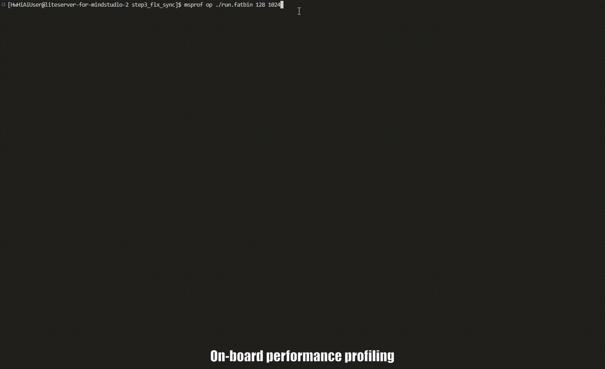

<h1 align="center">MindStudio Ops Profiler</h1>

<b>昇腾 AI 算子调优工具</b>

      

## ✨ 最新消息

🔹 **[2025.12.31]**：MindStudio Ops Profiler 项目全面开源

## ️ ℹ️ 简介

MindStudio Ops Profiler（算子调优工具，msOpProf）用于采集与分析运行在昇腾AI处理器上的算子关键性能指标，用户可基于输出的性能数据快速定位算子在软件或硬件层面的性能瓶颈，显著提升性能分析效率。当前支持多种运行模式（真机部署或仿真）及多种输入形式（可执行文件或算子二进制 .o 文件）下的性能数据采集与自动解析。

  <h4>▶️ 核心能力快速演示</h4>
  
  
图示：算子上板、仿真调优性能采集过程演示

## ⚙️ 功能介绍

包含msOpProf和msOpProf simulator两种使用模式：

| 功能名称 | 功能描述 |
|---------|--------|
| **msOpProf 模式** | 适用于实际运行环境中的性能分析，可直接分析运行中的算子，无需额外配置，帮助用户快速定位算子的内存与性能瓶颈，尤其适合板端环境。 |
| **msOpProf simulator 模式** | 需配置环境变量和编译选项，适用于仿真环境中对算子行为进行详细、深入的性能分析。 |

## 🚀 快速入门

快速体验核心功能，请参见《[msOpProf 快速入门](./docs/zh/quick_start/msopprof_quick_start.md)》。

## 📦 安装指南

msOpProf工具安装操作请参见《[msOpProf 安装指南](./docs/zh/install_guide/msopprof_install_guide.md)》。

## 📘 使用指南

工具的详细使用方法，请参见《[msOpProf 使用指南](./docs/zh/user_guide/msopprof_user_guide.md)》或《[msOpProf simulator模式使用指南](./docs/zh/user_guide/msopprof_simulator_user_guide.md)》。

## 💡 典型案例

msOpProf通过一些典型案例帮助您理解并使用工具，具体案例请参见《[msOpProf 典型案例](./docs/zh/best_practices/typical_cases.md)》。

## 🌌 智能检索

为提升文档查阅效率，我们提供多种高效检索方式：  
🔹 [AI 问答（DeepWiki）](https://deepwiki.com/mindstudio-docs/master)：自然语言问答，快速把握项目架构与模块关系。   
🔹 [AI 问答（ZRead）](https://zread.ai/mindstudio-docs/master)：中文问答体验更优，精准定位功能用法与细节。   
🔹 [精确搜索（ReadTheDocs）](https://mindstudio-operator-tools-docs.readthedocs.io/zh-cn/latest/)：关键词全文检索，直达接口、参数与报错等信息。  

## 🛠️ 贡献指南

欢迎参与项目贡献，请参见《[贡献指南](./docs/zh/contributing/contributing_guide.md)》。

## ⚖️ 相关说明

🔹《[版本说明](./docs/zh/release_notes/release_notes.md)》  
🔹《[许可证声明](./docs/zh/legal/license_notice.md)》  
🔹《[安全声明](./docs/zh/legal/security_statement.md)》  
🔹《[免责声明](./docs/zh/legal/disclaimer.md)》   

## 🤝 建议与交流

欢迎大家为社区做贡献。如果有任何疑问或建议，请提交 [Issues](https://gitcode.com/Ascend/mskpp/issues)，我们会尽快回复。感谢您的支持。

|                                                                            即时互动（微信群）                                                                             |                                                                                  官方资讯（公众号）                                                                                   | 深度支持（助手/论坛）                                                                                                                                                                                                                                                                                                                                                                                                                                                                                                 |
|:------------------------------------------------------------------------------------------------------------------------------------------------------------------:|:------------------------------------------------------------------------------------------------------------------------------------------------------------------------------:|:--------------------------------------------------------------------------------------------------------------------------------------------------------------------------------------------------------------------------------------------------------------------------------------------------------------------------------------------------------------------------------------------------------------------------------------------------------------------------------------------------------------|
|  *扫码加入技术交流群* |  *扫码关注官方公众号* | 扫码入群并关注公众号，直达 MindStudio 用户与开发者最快捷的交流平台：  **快速提问：** 与社区小伙伴即时探讨技术问题 **掌握动态：** 第一时间获取版本发布与功能更新通知  **经验共享：** 与广大开发者交流最佳实践与实战心得      **更多支持渠道**：👉 昇腾助手： 👉 昇腾论坛： |

## 🙏 致谢

本工具由华为公司的下列部门联合贡献：    
🔹 昇腾计算MindStudio开发部  
🔹 昇腾计算生态使能部  
🔹 华为云昇腾云服务  
🔹 2012编译器实验室  
🔹 2012马尔科夫实验室  
感谢来自社区的每一个 PR，欢迎贡献！
