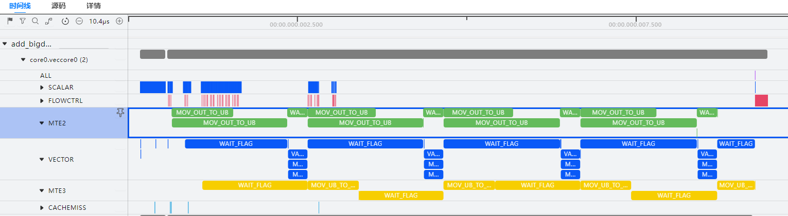

# **Typical Cases**

## Collecting Profile Data of Ascend C Operators

**Overview**

This section demonstrates how to use msOpProf to tune a Vector operator on the board. The Vector operator can add two vectors and output the result. The following uses the scenario where the kernel launch operator is called as an example.

The procedures for collecting profile data are basically the same for kernel launch, single-operator API calling, and PyTorch framework scenarios.

**Preparations**

- Obtain the [sample project](https://gitee.com/ascend/samples/tree/master/operator/ascendc/0_introduction/3_add_kernellaunch/AddKernelInvocationNeo) to prepare for onboard and simulation tuning.

    > [!NOTE]NOTE
    > 
    > - This sample project does not support <term>Atlas A3 training products</term>.
    > - When downloading the code sample, run the following command to specify the branch version:
    > 
    >    ```shell
    >    git clone https://gitee.com/ascend/samples.git -b v1.9-8.3.RC1
    >    ```

- Configure relevant environment variables by referring to [Preparations](../user_guide/msopprof_user_guide.md#preparations) in the *msopprof Mode User Guide* and [Preparations](../user_guide/msopprof_simulator_user_guide.md#preparations) in the *msopprof Simulator Mode User Guide*.

**Procedure**

1. Prepare for operator compilation according to the sample project description and by referring to **Kernel Launch Operator Development** > [Kernel Launch](<>) in the *Ascend C Operator Development Guide*.
2. Build a single-operator executable file.

    Take the Add operator as an example. In the `${git_clone_path}/samples/operator/ascendc/0_introduction/3_add_kernellaunch/AddKernelInvocationNeo` directory of the sample project, run the following commands to build the executable file.

    ```shell
    bash run.sh -r npu -v <soc_version> # Operator running on Ascend devices
    bash run.sh -r sim -v <soc_version> # Operator running on the simulator
    ```

    After the one-click compilation and execution script is complete, the NPU-side executable file `ascendc_kernels_bbit` is generated in the project directory.

    > [!NOTE]NOTE
    > 
    > - The name of the executable file (`ascendc_kernels_bbit`) in this example is for demonstration only. Use the actual compiled file in the project script.
    > - Run the `npu-smi info` command on the server where the Ascend AI Processor is installed to obtain **Chip Name**. The actual value is `AscendChip Name`. For example, if **Chip Name** is *xxxyy*, the actual value is `Ascendxxxyy`.

3. Import environment variables.

    ```shell
    export LD_LIBRARY_PATH=${git_clone_path}/samples/operator/ascendc/0_introduction/3_add_kernellaunch/AddKernelInvocationNeo/out/lib/:$LD_LIBRARY_PATH
    ```

4. Collect operator profile data.
    - For operators running on Ascend devices, run the following command to collect the msopprof profile data and refined tuning data:

        ```shell
        msprof op ascendc_kernels_bbit
        ```

    - For operators running on the simulator, run the following command to collect the msopprof simulator profile data, pipeline data, and hot spot data:

        ```shell
        msprof op simulator --soc-version=Ascendxxxyy ascendc_kernels_bbit   # xxxyy indicates the type of the processor used by the user.
        ```

5. View the operator profile data.

## Optimizing Operators Using Instruction Pipeline Chart

**Overview**

This section demonstrates how to use the instruction pipeline charts of the msOpProf tool to analyze operator bottlenecks and optimize the performance of Vector operators.

**Procedure**

1. Import the `visualize_data.bin` file obtained from the operator simulation profile to MindStudio Insight by referring to the [msOpProf Simulator User Guide](../user_guide/msopprof_simulator_user_guide.md). For details, see [Importing Profile Data](https://gitcode.com/Ascend/msinsight/blob/master/docs/zh/user_guide/basic_operations.md#%E5%AF%BC%E5%85%A5%E6%95%B0%E6%8D%AE) in the *MindStudio Insight User Guide*. <a id="import-data"></a>
2. View the operator instruction pipeline chart.

    It can be found that the MTE2 pipeline does not execute the transfer instruction during VADD computation, making it the performance bottleneck of the operator. To optimize operator performance, the transfer efficiency of the MTE2 pipeline needs to be improved.

    

3. Enable the double buffer mechanism of Ascend C operators to improve the MTE2 transfer efficiency.

    For example, in the sample operator kernel function, you can enable double buffering by changing the second parameter (`BUFFER_NUM`) of `InitBuffer` in `TPipe` from 1 to 2. For details about `InitBuffer`, see **Base API** > **Memory Management and Synchronization Control** > **TPipe** > [InitBuffer](<>) in the *Ascend C Operator Development API*.

    ```shell
    constexpr int32_t BUFFER_NUM = 2;        # tensor num for each queue
    ...
    pipe.InitBuffer(inQueueY, BUFFER_NUM, 1024 * sizeof(half));
    ...
    ```

4. Perform [1](#import-data) again and view the optimized instruction pipeline chart.

    It can be observed that the MTE2 pipeline executes the transfer instruction during VADD computation, resulting in more efficient data transfer.

    

## Collecting Profile Data of MC2 Operators

**Overview**

This section shows how to use msOpProf to tune an MC2 operator on the board and generate a communication and computing pipeline chart.

This example uses AscendCL single-operator call as an example. For other call scenarios, see the [*Ascend C Operator Development Guide*](<>).

**Preparations**

- The MC2 operator has been developed.
- Configure related environment variables by referring to [Preparations](../user_guide/msopprof_user_guide.md#preparations) in the *msopprof Mode User Guide*.

**Procedure**

1. Compile and deploy the operator by referring to [Operator Compilation and Deployment](<>).
    1. Add the following compilation options to the `CMakeLists.txt` file in the `op_kernel` directory of the operator build file to enable the AIC instrumentation and code line mapping functions of the MC2 operator.

        ```shell
        add_ops_compile_options(ALL OPTIONS -DASCENDC_TIME_STAMP_ON -g)
        ```

    2. Go to the custom operator project directory and compile and deploy the operator.

        ```shell
        ./build_out/custom_opp_<target_os>_<target_architecture>.run
        ```

2. Use msOpProf to collect the profile data of the MC2 operator.

    ```shell
    msprof op --output=$HOME/projects/output $HOME/projects/MyApp blockdim 1   # "--output" is an optional parameter, "$HOME/projects/MyApp" is the application, and "blockdim 1" is an optional parameter of the application.
    ```

3. The following directory structure and profile data files are generated. For details, see the [*msopprof User Guide*] (../user_guide/msopprof_user_guide.md).
4. Import the `trace.json` or `visualize_data.bin` file into MindStudio Insight for visual presentation. For details, see [Computing Memory Heatmap](../user_guide/msopprof_user_guide.md#computing-memory-heatmap), [Communication and Computing Pipeline chart](../user_guide/msopprof_user_guide.md#communication-and-computing-pipeline-chart), and [Roofline Bottleneck Analysis diagram](../user_guide/msopprof_user_guide.md#roofline-bottleneck-analysis-chart) in the msopprof User Guide.

## Performing Range-Level Replay with mstx APIs

**Overview**

This section demonstrates how to use the msOpProf tool and the mstx APIs to implement range-level replay to retain the L2 cache information in the context during operator execution.

**Preparations**

Prepare the operator project and add mstx extended APIs to the operator code to define the range for range-level replay. For details, see [mstx Extended Functions](../user_guide/extended_functions.md#mstx-extended-functions) and the [MindStudio mstx API Reference](https://www.hiascend.com/document/detail/zh/mindstudio/82RC1/API/mstxAPIReference/msprof_tx_0001.html).

> [!NOTE]NOTE
> 
> - The `mstxRangeStartA` and `mstxRangeEnd` APIs must be called in pairs and cannot be nested across. The operators contained in each pair of mstx APIs form a replay range. The streams of the operators in the replay range cannot be changed.
> - The number of operators that can be collected in each replay range is limited by the number of operator block dims in [OpBasicInfo (Basic Operator Information)](../user_guide/msopprof_performance_data.md#opbasicinfo-basic-operator-information). It is recommended that the number be less than or equal to 50.
> - This function cannot be enabled together with `--aic-metrics=MemoryDetail`, `--aic-metrics=TimelineDetail`, or `--aic-metrics=Source`. You are advised not to enable this function together with `--kill=on` because it may result in missing operator data.
> - During range-level replay, the `SynchronizeStream` operator may fail to be executed. You are advised to execute the operator after the `mstxRangeEnd` API call ends.
> - This function applies only to <term>Atlas A3 training products, Atlas A3 inference products</term>, <term>Atlas A2 training products, and A2 inference products</term>.

**Precautions**

When collecting basic information about shmem operators, select the `range` mode. Note the following:

1. For shmem operators with older versions of drivers, using the tool may cause operator precision deviations, but this does not affect the accuracy of profile data. You can still use the tool to view profile data.
2. You are advised to manually add synchronization statements before calling operators that require synchronization. Otherwise, unsynchronized execution may occur. In severe cases, the operators may hang.

**Example**

The Python API (`test.py` file) is used as an example to describe how msOpProf works with mstx APIs to implement range-level replay.

```python
import mstx
import torch
import torch_npu
 
x = torch.Tensor([1,2,3,4]).npu()
y = torch.Tensor([1,2,3,4]).npu()

a = x + y
range1_id = mstx.range_start("range1", None)
b = a - x
c = a * x
mstx.range_end(range1_id)
range2_id = mstx.range_start("range2", None)
d = x / y
range3_id = mstx.range_start("range3", None)
e = torch.abs(y)
mstx.range_end(range3_id)
f = x + e
mstx.range_end(range2_id)
```

**Procedure**

- Single-range replay
    1. Run the following command to enable a single mstx API range. The following command performs range-level replay for "range1."

        ```shell
        msprof op --replay-mode=range --mstx=on --mstx-include="range1" --launch-count=10 python3 test.py
        ```

    2. The tool generates the tuning data of the `Sub` and `Mul` operators, and the L2 cache information between the two operators is retained. For details about the profile files, see [Table 2 msopprof files](../user_guide/msopprof_user_guide.md#usage-description).

        ```tex
        OPPROF_{timestamp}_XXX
        ├── Mul_XXX  // Mul_XXX is the name of the collected operator.
        │   └── 0
        │       ├── dump
                        ...
        │       └── visualize_data.bin
        └── Sub_XXX
            └── 0
                ├── dump
                       ...
                └── visualize_data.bin
        ```

- Multi-range replay
    1. Run the following command to enable all mstx APIs:

        ```shell
        msprof op --replay-mode=range --mstx=on --launch-count=10 python3 test.py
        ```

    2. The tool executes range-level replay for "range1" and "range2" sequentially, generating tuning data for `Sub`, `Mul`, `Div`, `Abs`, and `Add` operators. The L2 cache information during each replay is retained, but the L2 cache information during two replays is independent of each other. However, because "range2" and "range3 overlap, only the first range takes effect, and "range3" is invalid. For details about the profile files, see [Table 2 msopprof files](../user_guide/msopprof_user_guide.md#usage-description).

        ```tex
        OPPROF_{timestamp}_XXX
        ├── Abs_XXX // Abs_XXX is the name of the collected operator.
        │   └── 0
        │       ├── dump
                        ...
        │       └── visualize_data.bin
        ├── Add_XXX
        │   └── 0
        │       ├── dump
                        ...
        │       └── visualize_data.bin
        ├── Mul_XXX
        │   └── 0
        │       ├── dump
                        ...
        │       └── visualize_data.bin
        ├── RealDiv_XXX
        │   └── 0
        │       ├── dump
                        ...
        │       └── visualize_data.bin
        └── Sub_XXX
            └── 0
                ├── dump
                       ...
                └── visualize_data.bin
        ```
