# MindStudio Ops Profiler Architecture Design Specifications

## 1. Overview

As a critical part of the operator development toolchain, the operator tuning component is the primary tool for operator developers to obtain performance data and optimization directions. Based on the operator execution environment and purpose, operator performance data is categorized into two types: operator simulation and on-board profiling.
Operator simulation: Runs on the Ascend simulator to output detailed operator performance data, such as pipeline charts and code hot spot maps, through instruction-level simulation.
On-board profiling: Performance data results of operators running on real Ascend devices. This reflects the true performance of the operator on the hardware and is the most reliable source of operator performance data.
The operator tuning tool is mainly intended for Ascend operator developers, including customer operator development engineers and internal operator development engineers.
The purpose of this document is to design the modules for the operator development tool, define the main data structures and key processing procedures, and serve as input for the coding phase and guidance for coding and testing personnel.

## 2. Service/Component Function List

**The function list is presented in the table format.**

| Type             | Function                                                   | Description                                                                                                                                                                                                                             | Supported Tuning Type             |
| ---------------- | ---------------------------------------------------------- | --------------------------------------------------------------------------------------------------------------------------------------------------------------------------------------------------------------------------------------- | --------------------------------- |
| Service function | Computing memory heatmap                                   | Displays basic operator information, compute workload analysis, and memory workload analysis data by resource.                                                                                                                          | On-board tuning                   |
| Service function | Roofline bottleneck analysis chart                         | Constructs a performance model to quickly evaluate the theoretical performance limit of an operator.                                                                                                                                    | On-board tuning                   |
| Service function | Cache heatmap                                              | Visualizes the cache heatmap and displays corresponding instruction information to help optimize L2 cache hit rates.                                                                                                                    | On-board tuning                   |
| Service function | Communication and computing pipeline chart (MC2 operators) | Visually presents the communication-computing execution and instruction latency of MC2 operators to help identify bottlenecks.                                                                                                          | On-board tuning                   |
| Service function | Instruction pipeline chart                                 | Displays timing relationship by instruction and associates with the call stack to quickly trace bottlenecks.                                                                                                                            | Simulation tuning                 |
| Service function | Operator code hot spot map                                 | Displays the mapping between operator source code and instructions, as well as the time consumption. This helps developers identify hot spot code distribution and analyze the feasibility of hot spot function optimization.           | On-board tuning/Simulation tuning |
| Service function | Profile data files                                         | Displays instruction latency, L2 cache hit rate, memory read/write bandwidth rate, L0 read/write bandwidth rate, UB read/write bandwidth rate, basic operator information, compute/MTE unit latency ratio, and resource conflict ratio. | On-board tuning                   |
| Service function | Transfer bandwidth chart                                   | Displays bandwidth charts for data transfers between GM<->L1, GM<->UB, and GM<->others.                                                                                                                                                 | Simulation tuning                 |
| DFX function     | Ctrl+C support                                             | Terminates the operator process early. The tool can parse results based on currently collected data.                                                                                                                                    | On-board tuning/Simulation tuning |
| DFX function     | Early process termination                                  | Allows users to end the operator process at a scheduled time.                                                                                                                                                                           | On-board tuning                   |
| DFX function     | Specified simulator version                                | Allows users to set the simulator version directly.                                                                                                                                                                                     | Simulation tuning                 |

 **Detailed features of the code hot spot map**

| Feature                                                                            | msOpProf      | msOpProf Simulator |
| ---------------------------------------------------------------------------------- | ------------- | ------------------ |
| Displaying the register usage (Gpr Count)                                          | Not supported | Supported          |                   
| Simulating the L2 cache hit ratio in the code line and instruction dimensions      | Supported     | Not supported      |                   
| Displaying the data transfer volume related to GM (Process Bytes)                  | Supported     | Supported          |                   
| Read and write conflicts of vector instructions on the UB Bank                     | Not supported | Supported          |                   
| Vector unit utilization                                                            | Not supported | Supported          |                   
| Displaying the time consumed by the operator source code and instructions (cycles) | Not supported | Supported          |                   
| Displaying the execution count of operator source code and instructions            | Supported     | Supported          |                   
| Displaying the mapping between the operator source code and instruction set        | Supported     | Supported          |                   
| Displaying source code, instruction program counter (PC) address, pipe, and source | Supported     | Supported          |                   
| Displaying core information                                                        | Not supported | Supported          |                   

## 3. Implementation Objectives and Key Elements of Software Design

### 3.1 Overall Objectives

Based on the functions and services required for this tool, the following overall design objectives must be achieved:

1. Profile data accuracy: The accuracy of PMU data collection order and transfer interface parsing (dynamic instrumentation and simulator instruction parsing) must strictly follow the chip manual.
2. High extensibility: Includes data collection, parsing methods, new deliverables, operator access methods, and so on.
3. Support for operator access methods: Different operator access methods may require invocation. Profile data collection is performed by hijacking runtime interfaces.
4. Support for multiple operator calling modes: Multi-operator, multi-process, and multi-card parallel calling.
5. Latency: Divided into collection and parsing. The collection part should reduce drive writing by utilizing communication transmission, while the parsing part utilizes multi-threaded parallel parsing.

### 3.2 Key Element Design

| Key Element          | Design Objective                                                                                                                                                                                                                                                                                                              |
| -------------------- | ----------------------------------------------------------------------------------------------------------------------------------------------------------------------------------------------------------------------------------------------------------------------------------------------------------------------------- |
| Implementation model | 1. Profile data accuracy: The accuracy of PMU data collection order and transfer interface parsing (dynamic instrumentation and simulator instruction parsing) must strictly follow the chip manual.<br>2. Extensibility: Abstract parsing and collection modules to ensure future support for new features and chip signals. |
| Interaction model    | The tool side must correctly transmit parameters input by users to the basic component side to implement corresponding collection functions.                                                                                                                                                                                  |
| Concurrency model    | High parsing concurrency: Implement parallel processing for parsing.                                                                                                                                                                                                                                                          |

## 4. Development View

### 4.1 Implementation Model

Operator tuning context view

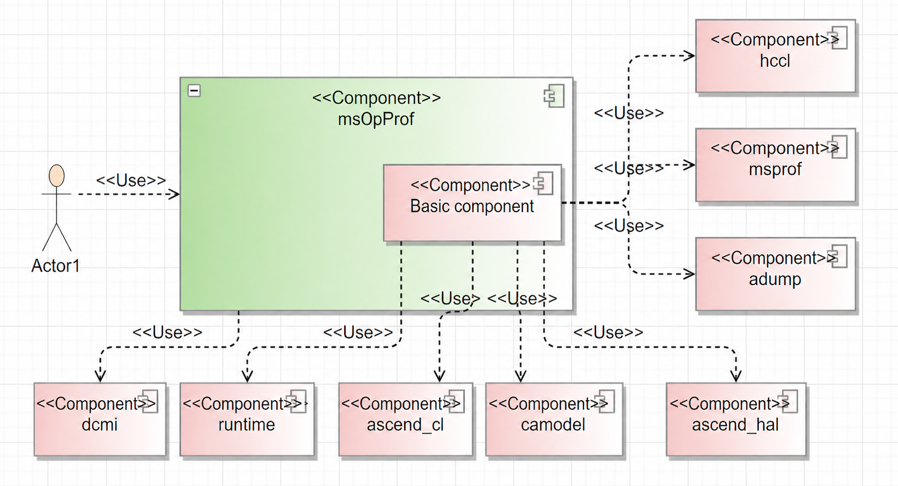

#### 4.1.1 Collection Module

##### 4.1.1.1 Overview

The primary function of this module is to collect performance data for user operators.

##### 4.1.1.2 Context View

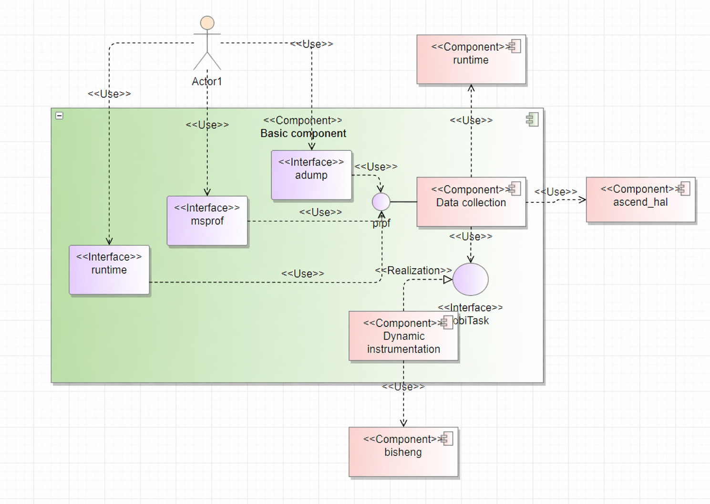

The basic component provides intercept functions, presenting interfaces such as `runtime`, `ascendcl`, `adump`, and `msprof`. Once the user operator starts and calls these interfaces, the logic shifts to the basic component.

###### 1. Interface Hijacking

The basic component executes logic within these interfaces to achieve specific goals.
Hijacking `ascendcl_impl` and `runtime` is for collecting operator performance data. (The current version is compatible with both `runtime` and `aclrt` startup methods. Hijacking and calling of the `runtime` interface can be removed once it is deprecated.)
Hijacking `adump` allows for capturing and recording operator context information.
Hijacking `msprof` is to obtain marking information for MC2 operators.

###### 2. Data Collection

Data collection is divided into on-board and simulation parts. Simulation tuning uses the simulator to directly obtain profile data. Once generated, the profile data files are stored in the specified operator directory.
On-board tuning retrieves corresponding information from hardware interfaces.

###### 3. Dynamic Instrumentation

This involves dynamically replacing operator .o files during runtime, leveraging the capabilities of the BiSheng Compiler.

##### 4.1.1.3 Logical View

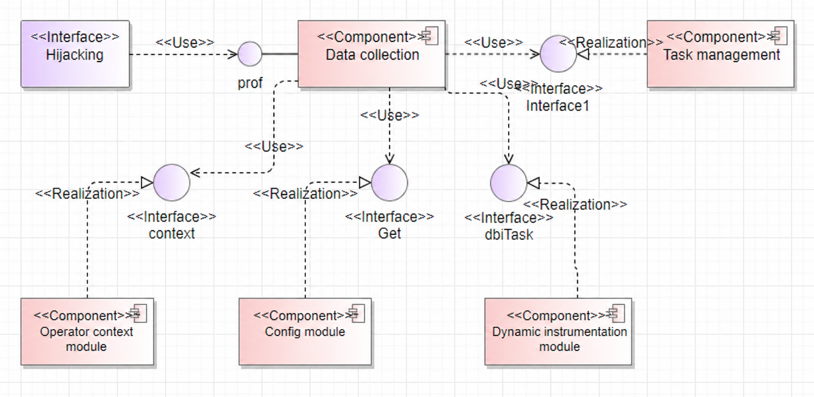

The software unit list is presented in the table format.

| Software Unit           | Description                                                                                  | External Interface                 | Internal Interface                                    | Relationship Description                                                                                                                                 |
| ----------------------- | -------------------------------------------------------------------------------------------- | ---------------------------------- | ----------------------------------------------------- | -------------------------------------------------------------------------------------------------------------------------------------------------------- |
| Hijacking               | Includes `runtime`, `adump`, and `msprof` interfaces.                                        | Corresponding component interfaces | Hijackedxxx                                           | Exposes component interfaces. Calls to these interfaces create `Hijackedxxx` objects for hijacking logic.                                                |
| Data collection         | Orchestrates all data collection logic, including on-board replay and simulation collection. | ProfInit, ProfData                 | KernelReplay, SaveBasicInfo, HandleDumpLogAfterLaunch | After hijacking, `ProfInit` and `ProfData` are called. Different scenarios call different internal logic, such as `KernelReplay` for on-board profiling. |
| Operator context        | Records operator context and .o information.                                                 | Save, ParseMetaDataFromBinary      | GetMetaSection, ParseKernelArgs                       | Records and analyzes context during runtime and calls the `Save` function to store context upon completion.                                              |
| Config module           | Records configuration information from the tool side.                                        | Get, Set                           |                                                       | Stores configuration information from the tool side. The runtime calls this to selectively collect profile data.                                         |
| Task management         | Creates and controls on-board collection tasks.                                              | Start, Stop                        | FftsTask, StarsTask, AiCoreTask                       | Starts or stops corresponding tasks based on the current scenario.                                                                                       |
| Dynamic instrumentation | Controls the dynamic instrumentation process, including custom stubs and BBCount stubs.      | RunDBITask                         | GetOrCreate, Run                                      | Externally calls `RunDBITask` to create objects by type, then calls the `Run` interface to interact with the compiler for .o file replacement.           |

The software unit list table describes the decomposition relationships of software design elements and the implementation/usage relationships between external interfaces and internal elements, facilitating digital parsing and asset traceability.

##### 4.1.1.4 Software Implementation Unit Design

This module is primarily used for collecting operator profile data and implementing required functions on the operator side.


1. `ProfDataCollect`: Profile data collection class. The `runtime` interface calls its methods for data collection. Each `runtime` interface call creates a `ProfDataCollect` object to ensure independent `rtKernelLaunch` execution.
2. `ProfConfig`: A singleton class that globally records information from the tool side, such as PMU values.
3. `DataCollectInDevice`: Responsible for on-board data collection, with `kernelReplay` as a main function.
4. `MemoryContext`: Responsible for data backup during the replay process.
5. `ProTask`: Dependency for on-board data collection, responsible for opening channels and collecting data. Different chips correspond to different classes, following the original collection module logic.
6. `DataCollectWithSimulator`: Responsible for simulation data collection.
7. `DBITask`: Responsible for dynamic instrumentation features, currently used for custom stubs and BBCount stubs.
   Instrumentation involves three interfaces: `runtime`, `msprof`, and `adump`. The `msprof` interface retrieves MC2 operator marking information for pipeline charts. The `adump` interface retrieves operator input information (for example, workspace length).
   *Describes the context view of software implementation elements, treating them as black boxes and describing their relationships with external environments and systems.*

Based on the architecture design, the tool can be divided into the following functional modules.

#### 4.1.2 Parsing Module

##### 4.1.2.1 Overview

The primary function of this module is to parse user operator tuning data. Data for individual operators is written to the drive in folders partitioned by user-specified directories. Deliverables are calculated and presented from various dimensions: computing memory heat map, Roofline bottleneck analysis chart, instruction pipeline chart, code hot spot map, and profile data file. Common intermediate data during parsing is partitioned by basic operator information, raw PMU data, and code line mapping.

##### 4.1.2.2 Context View

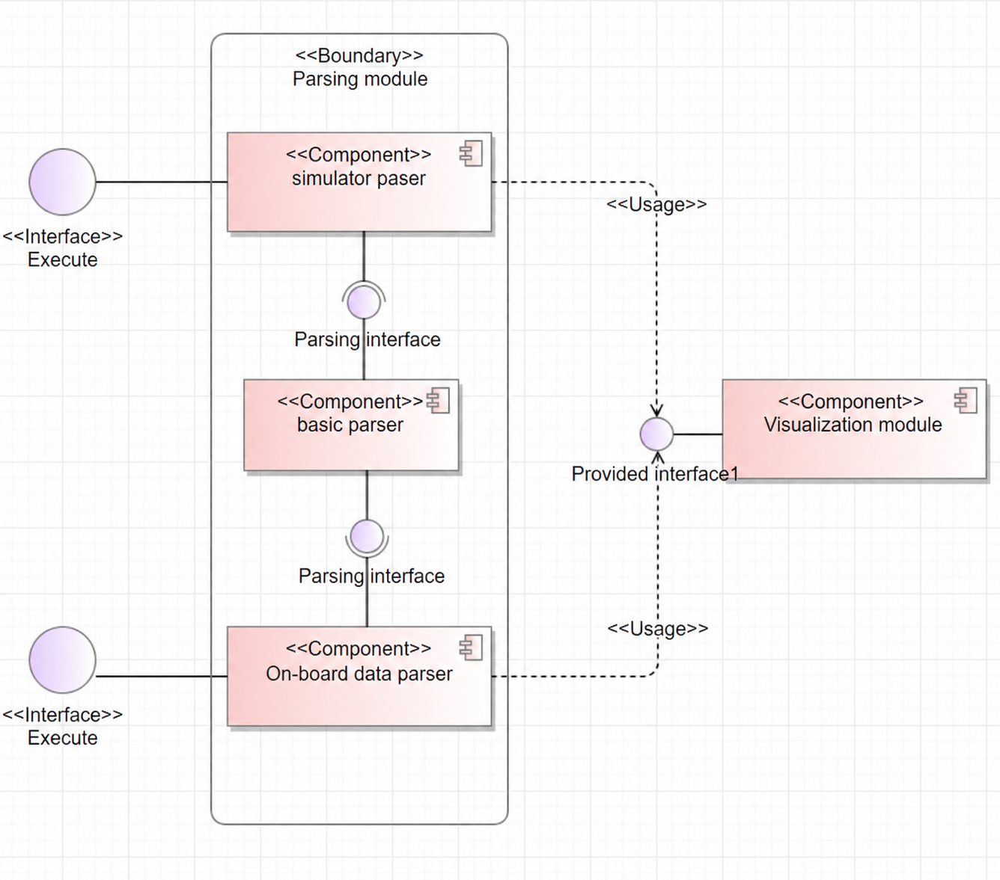

In the original design, on-board and simulation parsing were independent. A major change in the current version is the modularization of shared features into a base parsing class, such as the `pc2code` code line mapping function, which is used in both on-board and simulation code hot spot maps. Future evolution of data volume displays and other related classes will not be limited to either simulation or on-board modes.

##### 4.1.2.3 Logical View

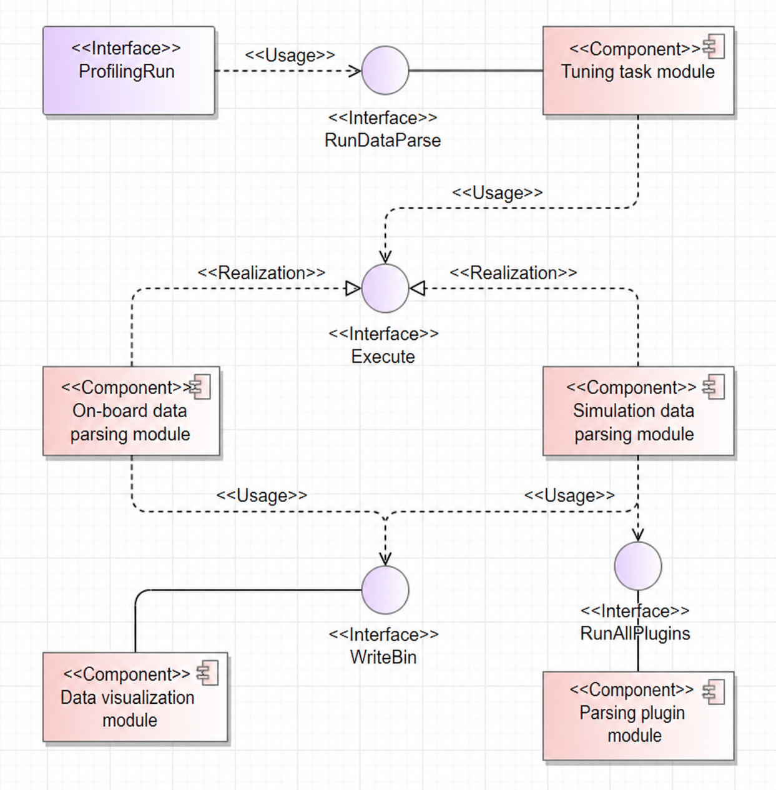

The software unit list is presented in the table format.

| Software Unit      | Description                                                                           | External Interface       | Internal Interface                   | Relationship Description                                                                                                                                  |
| ------------------ | ------------------------------------------------------------------------------------- | ------------------------ | ------------------------------------ | --------------------------------------------------------------------------------------------------------------------------------------------------------- |
| Tuning task        | Task management module responsible for on-board and simulation execution and parsing. | RunDataParse             | N/A                                  | Calls on-board or simulation parsing subclass interfaces based on the task mode.                                                                          |
| On-board parsing   | Parses tuning data for operators running in on-board mode.                            | Execute                  | ParserInit, ParseExactKernelData     | Reads profile data from drivers and instrumentation to generate cache heatmaps, computing memory heatmaps, and Roofline bottleneck analysis charts.       |
| Simulation parsing | Parses tuning data for operators running in simulation mode.                          | Execute                  | ParseExportDumpFile, ParseKernelFile | Reads simulation dump data and uses multi-threaded tasks to generate instruction pipeline charts and code hot spot maps.                                  |
| Data visualization | Presents parsing results as visual deliverables.                                      | WriteBin                 | N/A                                  | Forms the tuning result product `visualize_data.bin` based on the agreed data structure with the visualization module and writes it to the drive.         |
| Parsing plugin     | Registers and calculates categorized parsing data in a plugin-based format.           | AddPlugin, RunAllPlugins | Run                                  | Currently, only the instruction parsing part of simulation parsing is implemented as a plugin. Other metrics will be migrated to the plugin architecture. |

##### 4.1.2.4 Software Implementation Unit Design

##### 4.1.2.4.1 On-board Parsing

This module is primarily used to parse and extract specified operator tuning data, generating normalized results and analysis in a user-specified directory. Two analysis modules handle data for on-board and simulation launch methods, respectively.
On-board parsing involves numerous raw data types and output deliverables with complex correlations and dependencies. This model illustrates the data flow and dependencies for on-board parsing.
The interaction model for on-board tuning data parsing is as follows.


1. `DeviceDataParse`: Profile data parsing class. This is the entry point for profile data parsing. `ParseExactKernelData` is called for each operator, creating objects like `DataHandler` and `OpBasicInfo` to ensure independent parsing.
2. `DataHandler`: Data loading class used to read raw PMU and STARS data from the driver. It processes and calculates metrics, writing them as CSV files (part of the deliverables). It also extracts and concatenates useful information from raw data and exposes some basic metric data via `Get` methods.
3. `*Bean`: Driver data classes used for parsing raw PMU and STARS data.
4. `HotSpotFunctionGenerator`: Hot spot function class. This part is the base parsing class for both on-board and simulation parsing, used for LLVM disassembly and code line mapping.
5. `OpBasicInfo`: Contains basic operator data such as name and type.
6. `BasicPmu`: Contains PMU data for each block and memory information.
7. `PmuCalculator`: Contains a large number of PMU metric calculation formulas.
8. `CachelineHeatMap`/`MC2TimelineParser`/`StorageAccess` Layer: Metric-specific classes that generate results for cache heatmaps, MC2 pipeline charts, and computing memory heatmaps using common base data.
9. `DataVisualize`: Populates and displays profile data for various metrics according to the data structure of the visualization module, producing `visualize_data.bin` for display in MindStudio Insight.

##### 4.1.2.4.1 Simulation Parsing

##### 4.1.2.4.1.1 Parsing dump Files

Simulation parsing is divided into three steps: parsing, calculation, and visualization. Data is parsed and calculated per core, with each core data stored in a separate `DataCenter` object. After calculation, data from all cores is merged into a single `DataCenter` object for visualization. Since Insight requires a pipeline chart to parse correctly, the pipeline chart (for the whole core and individual cores) is calculated first, followed by the hot spot map.

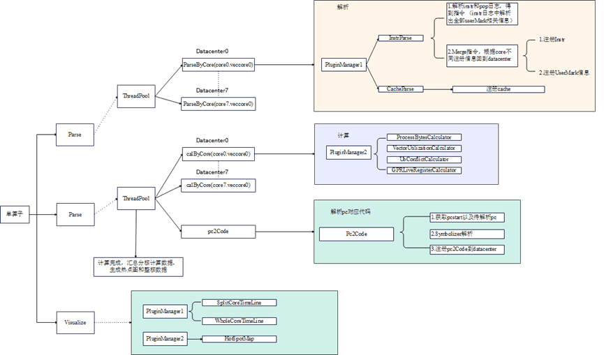

##### 4.1.2.4.1.2 Real-time Parsing

A `DataStream` class is added with `push` and `pop` methods. Producers call `push` to store data, and consumers call `pop` to receive it. `DataCenter` holds the `DataStream` class. Each `Plugin` class holds a `DataCenter` object.
The figure below uses MTE data parsing as an example (other classes are similar): `MteParser` is the controller for MTE parsing. It holds an `MtePlugin` object and manages its lifecycle, startup and shutdown, data transmission, and pre/post-processing for MTE parsing. The primary role of `MtePlugin` is to receive data and perform processing and calculation.


#### 4.1.3 Data Visualization Module

##### 4.1.3.1 Overview

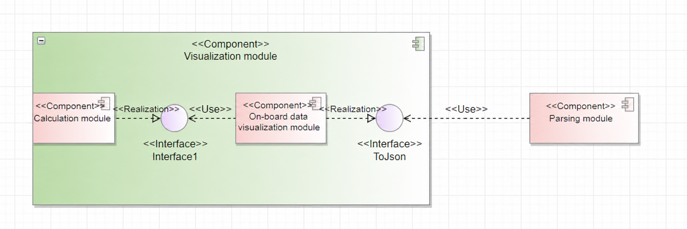

This module is primarily used to save parsed data to the drive in a specific format.

##### 4.1.3.2 Context View

##### 4.1.3.3 Logical View

##### 4.1.3.4 Software Implementation Unit Design

**Code hot spot map**
The hot spot map performs three main tasks:

1. Writing the integrated code hot spot map to the `visualize_data.bin` file
2. Writing per-core code execution details to `code_exe.csv`
3. Writing per-core instruction execution details to `instr_exe.csv`
`SimPcToCode` parses instruction durations, updates instruction status, and generates `instr_exe.csv`. It also updates details for `set` and `wait` flag instructions and returns the execution counts for PC instructions on different cores for the right side of the hot spot map.
`SimCodeToPc` parses the cycles and duration for each code line and generates `code_exe.csv`. It also aggregates PC information for each line, returns PC range information for the left side of the hot spot map, and writes the source code files to `visualize_data.bin`.
`HotSpotMapVisualizer` integrates data from `SimPcToCode` and `SimCodeToPc`, writes results to `visualize_data.bin`, calculates compute duration per core, and prints the results sorted by `coreName`.


**Per-core pipeline chart**
The per-core pipeline chart generates a corresponding JSON file for each core. The processing logic for `UserMark` is modified to parse `UserMark` data separately from `DataCenter` and generate per-core JSON files directly in the corresponding core directories.

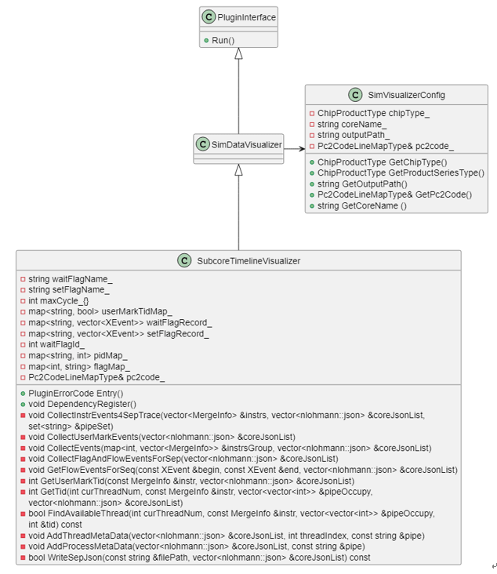

**Integrated core pipeline chart**


The logic for the integrated core pipeline chart is similar to the per-core version, but it writes pipeline data to both an integrated JSON file and `visualize_data.bin`. It also handles `UserMark` data separately and checks the `PMSampling` switch. If the switch is enabled, MTE bandwidth charts are included in the JSON file and `visualize_data.bin`.

#### 4.1.4 Plugin Module

##### 4.1.4.1 Overview

The plugin module is primarily used in dynamic instrumentation. Currently, it compiles device-side code using the Cube-based Computing Engine Compiler (CCEC) and links it with host-side `msbit` code to generate dynamic libraries.

##### 4.1.4.2 Context View

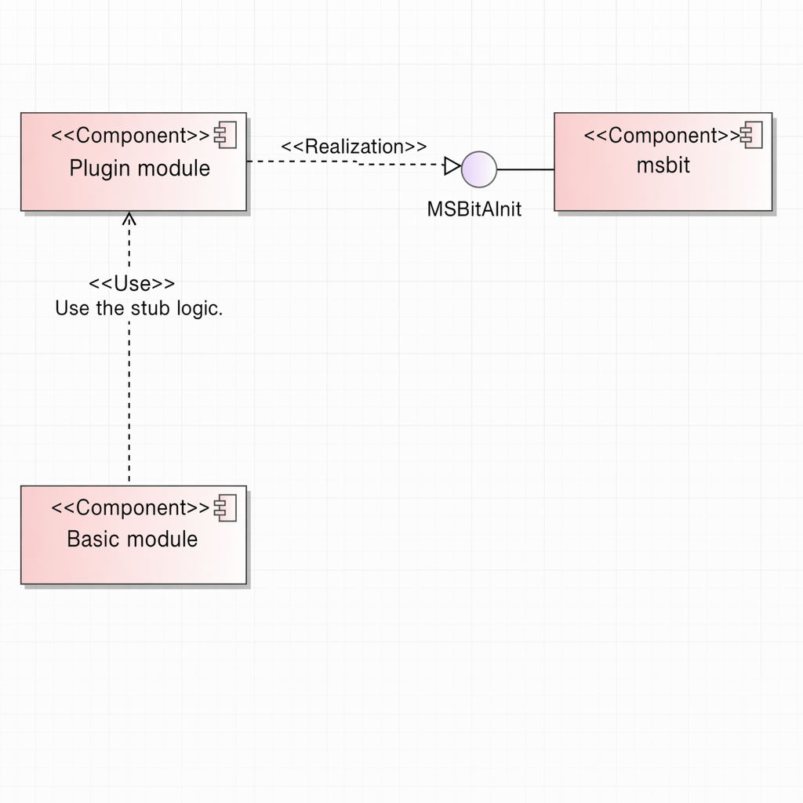

When the `msopt` repository is compiled, `libprofplugin_memorychart.so` is generated. The basic component uses this library to implement dynamic instrumentation features. For details, see the following sections.

##### 4.1.4.3 Logical View

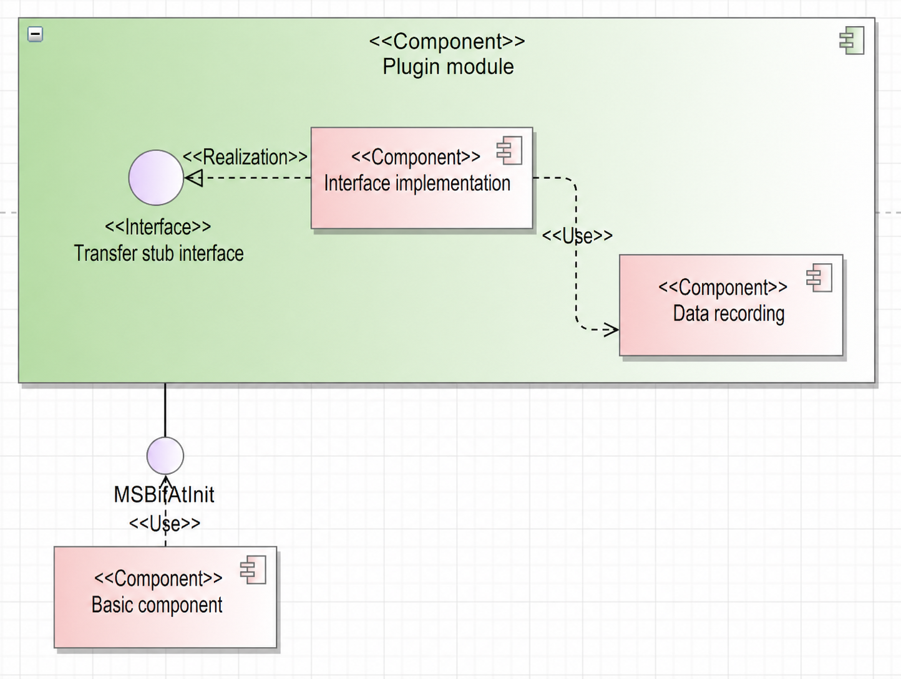

1. Stub interfaces: Define required transfer interfaces according to the agreement with the compiler.
2. Interface implementation: Stub interfaces record original behaviors of transfer instructions. Different interface types use different structures, as defined in section 4.3.1.
3. Data recording: Primarily records memory data in a specific format. For details about the format of data stored in the GM, see section 4.3.1.

#### 4.1.5 Communication Module

##### 4.1.5.1 Overview

Responsible for data transmission and communication between basic components (operator side) and the `msopt` side.

##### 4.1.5.2 Context View

##### 4.1.5.3 Logical View

##### 4.1.5.4 Software Implementation Unit Design

Before starting each task, `msopt` defines an `InjectEvent` class to manage requests from the operator side. It calls communication interface methods to receive messages and constructs a `packet` object based on the message type. `InjectEvent` provides a registration interface for external classes to register `Process` methods. When a message is parsed, the corresponding `packet` object is passed to the registered `Process` method for handling.


### 4.2 Interfaces

#### 4.2.1 Plugin Module

#### 4.2.1.1 Overall Design

The plugin module implements hijacking for transfer interfaces, recording their original behavior.

**Interface list**

```C++
// All GM-related interfaces
void MSBitAtInit()
{
    // ccec type, stub function name, stub function args index
    // DMA_MOV
    Bind(InstrType::COPY_GM_TO_UBUF, "__msopprof_report_copy_gm_to_ubuf", {0, 1, 2});
    Bind(InstrType::COPY_UBUF_TO_GM, "__msopprof_report_copy_ubuf_to_gm", {0, 1, 2});
    Bind(InstrType::COPY_UBUF_TO_GM_BYTE, "__msopprof_report_copy_ubuf_to_gm_byte", {0, 1, 2, 3});
    Bind(InstrType::COPY_GM_TO_CBUF, "__msopprof_report_copy_gm_to_cbuf", {0, 1, 2, 3});
    Bind(InstrType::COPY_CBUF_TO_GM, "__msopprof_report_copy_cbuf_to_gm", {0, 1, 2});

    // MOV_ALIGN
    Bind(InstrType::COPY_GM_TO_UBUF_ALIGN_B16, "__msopprof_report_copy_gm_to_ubuf_align_b16", {0, 1, 2, 3});
    Bind(InstrType::COPY_GM_TO_UBUF_ALIGN_B32, "__msopprof_report_copy_gm_to_ubuf_align_b32", {0, 1, 2, 3});
    Bind(InstrType::COPY_GM_TO_UBUF_ALIGN_B8, "__msopprof_report_copy_gm_to_ubuf_align_b8", {0, 1, 2, 3});
    Bind(InstrType::COPY_UBUF_TO_GM_ALIGN_B16, "__msopprof_report_copy_ubuf_to_gm_align_b16", {0, 1, 2, 3});
    Bind(InstrType::COPY_UBUF_TO_GM_ALIGN_B32, "__msopprof_report_copy_ubuf_to_gm_align_b32", {0, 1, 2, 3});
    Bind(InstrType::COPY_UBUF_TO_GM_ALIGN_B8, "__msopprof_report_copy_ubuf_to_gm_align_b8", {0, 1, 2, 3});

    // LOAD_2D
    Bind(InstrType::LOAD_GM_TO_CA, "__msopprof_report_load_gm_to_ca", {0, 1, 2, 3});
    Bind(InstrType::LOAD_GM_TO_CB, "__msopprof_report_load_gm_to_cb", {0, 1, 2, 3});
    Bind(InstrType::LOAD_GM_TO_CBUF, "__msopprof_report_load_gm_to_cbuf", {0, 1, 2, 3});

    // DMA_MOV_ND2NZ
    Bind(InstrType::COPY_GM_TO_CBUF_MULTI_ND2NZ_B8,
         "__msopprof_report_copy_gm_to_cbuf_multi_nd2nz_b8", {0, 1, 2, 3});
    Bind(InstrType::COPY_GM_TO_CBUF_MULTI_ND2NZ_B16,
         "__msopprof_report_copy_gm_to_cbuf_multi_nd2nz_b16", {0, 1, 2, 3});
    Bind(InstrType::COPY_GM_TO_CBUF_MULTI_ND2NZ_B32S,
         "__msopprof_report_copy_gm_to_cbuf_multi_nd2nz_b32s", {0, 1, 2, 3});

    // MOV_FP
    Bind(InstrType::COPY_MATRIX_CC_TO_GM_F32,
         "__msopprof_report_copy_matrix_cc_to_gm_f32", {0, 1, 2, 3});
    Bind(InstrType::COPY_MATRIX_CC_TO_GM_S32,
         "__msopprof_report_copy_matrix_cc_to_gm_s32", {0, 1, 2, 3});
    Bind(InstrType::SET_ND_PARA,
         "__msopprof_report_set_nd_para", {0});
}
```

```C++
// Current record types. Each type defines its own storage structure based on interface behavior.
enum class RecordType : uint8_t {
    DMA_MOV,
    MOV_ALIGN,
    LOAD_2D,
    DMA_MOV_ND2NZ,
    MOV_FP,
};
```

#### 4.2.1.2 Design Objectives

Include all GM-related interfaces.

#### 4.2.1.3 Design Constraints

The code must be compiled by CCEC and thus follow CCEC coding constraints.

#### 4.2.1.4 Technology Selection

N/A

#### 4.2.2 Collection Module

#### 4.2.2.1 Overall Design

The collection module focuses on interfaces for external interaction, such as interfaces with the simulator.

**Interface list**

```C++
void DvcSetLogLevel(const uint32_t file_print_level, const uint32_t screen_print_level, const uint32_t flush_level)
void DvcAttachLogCallback(DvcLogType_t log_type, DvcLogCbFnUnion_t fn_union);
```

```C++
typedef union DvcLogCbFnUnion {
    DvcInstrLogCb_t instrLogCb;
    DvcMteLogCb_t mteLogCb;
    DvcIcacheLogCb_t icacheLogCb;
    DvcIfuLogCb_t ifuLogCb;
} DvcLogCbFnUnion_t;
```

#### 4.2.2.2 Design Objectives

Meet current requirements and performance standards while remaining closed to modification and open to extension.

#### 4.2.2.3 Design Constraints

Align with components like the simulator. Registration of callback interfaces requires a specific function and log type. Adding a new interface requires adding a type to the `Union` (for example, adding `ifu` logs via `DvcIfuLogCb_t ifuLogCb`) and registering it with the `DvcAttachLogCallback` interface, without modifying existing logic.

#### 4.2.2.4 Technology Selection

N/A

### 4.3 Data Model

#### 4.3.1 Plugin Module

#### 4.3.1.1 Design Objectives

1. Accuracy of data recording.
2. Code reuse, consistent type definitions and formatting: Reuse code as much as possible, as interface recording shares logic and definitions with the tool side.

#### 4.3.1.2 Design Constraints

The code must be compiled by CCEC and thus follow CCEC coding constraints.

#### 4.3.1.3 Design Selection

N/A

#### 4.3.1.4 Data Model Design

1. Device-side records

```C++
// DMA_MOV: DMA transfer record structure
struct DmaMovRecord {
    uint64_t dst;
    uint64_t src;
    uint64_t pc;
    uint16_t nBurst;
    uint16_t lenBurst;
    uint16_t srcStride;
    uint16_t dstStride;
    uint16_t coreID;
    MemType dstMemType;
    MemType srcMemType;
    PadMode padMode;
    ByteMode byteMode;
};
```

```C++
// MOV_ALIGN: Move Align record structure
struct MovAlignRecord {
    uint64_t dst;
    uint64_t src;
    uint64_t pc;
    uint32_t srcGap;
    uint32_t dstGap;
    uint32_t lenBurst;
    uint16_t nBurst;
    uint16_t coreID;
    MemType dstMemType;
    MemType srcMemType;
    DataType dataType;
    uint8_t leftPaddingNum;
    uint8_t rightPaddingNum;
};
```

```C++
// LOAD_2D series
struct Load2DRecord {
    uint64_t dst;
    uint64_t src;
    uint64_t pc;
    uint16_t coreID;
    uint16_t baseIdx;
    uint16_t srcStride;
    uint16_t dstStride;
    uint8_t repeat;
    MemType dstMemType;
    MemType srcMemType;
    AddrCalMode addrCalMode;
};
```

```C++
// DMA_MOV_ND2NZ
struct DmaMovNd2nzRecord {
    uint64_t dst;
    uint64_t src;
    uint64_t pc;
    uint16_t ndNum;
    uint16_t nValue;
    uint16_t dValue;
    uint16_t srcNdMatrixStride;
    uint16_t srcDValue;
    uint16_t dstNzC0Stride;
    uint16_t dstNzNStride;
    uint16_t dstNzMatrixStride;
    uint16_t coreID;

    MemType srcMemType;
    MemType dstMemType;
    DataType dataType;
};
```

```C++
// MOV_FP
struct MovFpRecord {
    uint64_t dst;
    uint64_t src;
    uint64_t pc;
    uint32_t dstStride;
    uint16_t srcStride;
    uint16_t nSize;
    uint16_t mSize;
    uint16_t coreID;
    uint16_t ndNum;
    uint16_t dstNdStride;
    uint16_t srcNdStride;
    uint16_t quantPreBits;
    bool enUnitFlag;
    bool int8ChannelMerge;
    bool int4ChannelMerge;
    bool channelSplit;
    bool enNZ2ND;
};
```

Current dynamic instrumentation primarily covers GM-related transfer instructions. It collects:
**a.** Data transfer volume for each channel (for memory heatmap).
**b.** b. Memory access records (for L2 cache visualization).
The plugin records original interface information on the device and stores it in GM. The host copies this to GM and then to the drive for tool parsing. The tool parses raw data into atomic memory records.

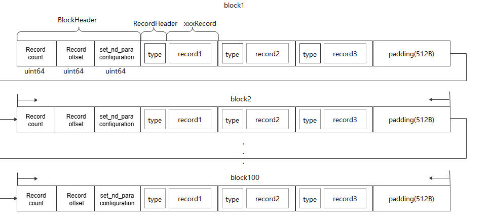

**a.** Records are grouped by block, with each block recording its own data. The first 8 bytes of each block indicate the total number of records, with each additional record incrementing the count by 1, followed by *n* memory records.
**b.** To ensure successful writing to GM, each block requires 512 bytes of padding.
**c.** A maximum of 100 blocks of data can be stored.
Note: The `set_nd_para` bit is set for some special interfaces, such as `copy_matrix_cc_to_gm_f32`. Before calling `copy_matrix_cc_to_gm_f32`, a user calls `set_nd_para` to set the pre-information. All subsequent calls to `copy_matrix_cc_to_gm_f32` will use this pre-information. The logic here is to reserve the `nd_para` position. Once the user calls the `set_nd_para` interface, the information is recorded. If the interface is called again, the information is updated.

### 4.3.2 Parsing Module

#### 4.3.2.1 Design Objectives

1. Reuse shared logic.
2. Design generic intermediate data to ensure that raw data is parsed only once.

#### 4.3.2.2 Design Constraints

1. Ensure single-pass parsing for all features with dynamic instrumentation (for example, data transfer volume and L2 cache modeling) to prevent performance degradation.

#### 4.3.2.3 Design Selection

N/A

#### 4.3.2.4 Data Model Design

#### 4.3.2.4.1 On-board Parsing

Each instruction call must be decomposed into individual memory access records.

```C++
struct MemRecord {
    uint64_t srcAddr;
    uint64_t dstAddr;
    uint64_t srcMemSize;
    uint64_t dstMemSize;
    uint64_t pc;
    uint32_t recordId;
    uint16_t blockId;
    Common::MemType src;
    Common::MemType dst;
};
```

1. Each record includes a `Type` (`Load` or `Store`).
2. `src` and `dst` represent source and destination units, including GM, UB, L0A, L0B, and L0C.
3. `recordId` is a sequence number. Multiple `MemRecord` entries for a single instruction share the same `recordId`.
4. `addr` is the address read from `src`.
5. `memSize` is the size of the transferred memory.
6. `pc` is the actual PC of the instruction, used for code mapping.

Implementation:

Use a table-driven approach where each `Type` maps to a specific parsing function `map<RecordType, Func>`.

```C++
using bool (*fun)(const std::vector<char> &buffer, uint32_t &index, size_t recordId, uint16_t blockId)
class DBIParser {
public:
    const std::vector<Common::MemRecord>& GetMemRecord();
    void ParseMemoryChart(const std::string &filePath)
private:
    ...
};
```

### 4.3.3 Visualization Module

#### 4.3.3.1 Design Objectives

Outputs use the JSON format for extensibility and compatibility. Consider visualization parsing time.

#### 4.3.3.2 Design Constraints

1. Ensure easy extensibility and compatibility.
2. Consider visualization parsing time and centralize data to reduce visualization data loading time.

#### 4.3.3.3 Design Selection

N/A

#### 4.3.3.4 Data Model Design

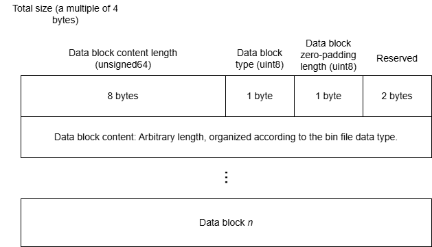

A single binary file is output for visualization, containing the code hot spot map, instruction pipeline chart, and so on. Each diagram consists of a header and a data block.

| enum | Data Type                                                         |
| ---- | ----------------------------------------------------------------- |
| 0x00 | Invalid data block                                                |
| 0x01 | Code file                                                         |
| 0x02 | Pipeline chart `tracing.json` (including the MTE bandwidth chart) |
| 0x03 | `files` section in the hot spot mapping file `api.json`           |
| 0x04 | `instructions` section in the hot spot mapping file `api.json`    |
| 0x07 | Compute workload table                                            |
| 0x08 | Memory access heatmap                                             |
| 0x09 | Memory access table                                               |
| 0x0C | Inter-core load                                                   |
| 0x0D | Rooftline model                                                   |
| 0x0E | Cache heatmap                                                     |

##### 4.3.4 Collection Module

#### 4.3.4.1 Design Objectives

// To be determined

#### 4.3.4.2 Design Constraints

// To be determined

#### 4.3.4.3 Design Selection

N/A

#### 4.3.4.4 Data Model Design

1. `msopt` currently uses `Type`, MC2 AI Core timestamps, and MC2 communication task timestamps.

The MC2 AI Core timestamp data is as follows:

```C++
struct MsprofAicTimeStampInfo {
     uint64_t syscyc;
     uint32_t blockId;
     uint32_t descId;
     uint64_t curPc;
 };
```

MC2 communication task timestamp data:

```C++
struct MsprofAicpuHcclTaskInfo {
    uint32_t localRank;
    uint32_t remoteRank;
    uint32_t planeID;
    uint32_t ctxId;
    uint64_t notifyID;
    double durationEstimated;
    uint64_t srcAddr;
    uint64_t dstAddr;
    uint64_t dataSize; // bytes
    uint32_t dataType; // data type {0: INT8, 1: INT16, 2: INT32, 3: FP16, 4:FP32, 5:INT64, 6:UINT64}
    uint32_t linkType; // link type {0: 'OnChip', 1: 'HCCS', 2: 'PCIe', 3: 'RoCE'}
    uint32_t transportType; // transport type {0: SDMA, 1: RDMA, 2:LOCAL}
    uint32_t rdmaType; // RDMA type {0: RDMASendNotify, 1:RDMASendPayload}
    uint32_t taskId;
    uint16_t streamId;
};
```

##### 4.3.5 Parameter Parsing Module

#### 4.3.5.1 Design Objectives

1. Provide command line parameters to capture user intent and implement corresponding functions.

#### 4.3.5.2 Design Constraints

1. Validate input file paths and permissions for command line inputs. Avoid security or functional issues from out-of-bounds parameters.
2. Define security requirements for external file inputs and ensure correct file permissions.

#### 4.3.5.3 Design Selection

N/A

#### 4.3.5.4 Data Model Design

| Parameter                  | Data Type                                                                                                           | Constraints                                                                                                                                                                                                                                                            | Remarks                 |
| -------------------------- | ------------------------------------------------------------------------------------------------------------------- | ---------------------------------------------------------------------------------------------------------------------------------------------------------------------------------------------------------------------------------------------------------------------- | ----------------------- |
| --application              | Executable file                                                                                                     | The execute permission is required.                                                                                                                                                                                                                                    | On-board and simulation |
| --config                   | Absolute or relative path of the binary file `*.o` generated after operator compilation                             | The file permission must be ensured.                                                                                                                                                                                                                                   | On-board and simulation |
| --kernel-name              | Name of the operator to collect                                                                                     | The value can contain a maximum of 1024 characters from letters, numbers, and underscore (_).                                                                                                                                                                          | On-board and simulation |
| --launch-count             | Number of operators to collect                                                                                      | The value is an integer ranging from 1 to 100.                                                                                                                                                                                                                         | On-board and simulation |
| --launch-skip-before-match | Number of operators to skip                                                                                         | The value is an integer ranging from 1 to 1001.                                                                                                                                                                                                                        | On-board                |
| --aic-metrics              | Enables collection of operator performance metrics.                                                                 | The meanings vary by on-board and simulation mode.                                                                                                                                                                                                                     | On-board and simulation |
| --kill                     | Automatically stops the user program after the number of operators set by `--launch-count` is collected.            | The value can be `on` or `off`.                                                                                                                                                                                                                                        | On-board and simulation |
| --mstx                     | Specifies whether the operator tuning component enables the mstx APIs used in the user code program.                | The value can be `on` or `off`.                                                                                                                                                                                                                                        | On-board and simulation |
| --mstx-include             | Enables only the mstx APIs specified by the user.                                                                   | This parameter must be used with `--mstx`. The message can only contain letters, digits, and underscores (_). Use vertical bars (\|) to combine multiple messages.                                                                                                     | On-board and simulation |
| --replay-mode              | This option specifies the replay mode of operator data collection.                                                  | The value can be `kernel` or `application`.                                                                                                                                                                                                                            | On-board                |
| --warm-up                  | Number of warm-up times.                                                                                            | The default value is 5. The value range is [0, 500].                                                                                                                                                                                                                   | On-board                |
| --output                   | Path for storing the collected profile data. By default, the profile data is stored in the current directory.       | Ensure that users in the group and other groups do not have the write permission on the parent directory of the path specified by `--output`. In addition, ensure that the owner of the parent directory of the directory specified by `--output` is the current user. | On-board and simulation |
| --dump                     | Specifies whether to generate the dump file of the simulator.                                                       | The value can be `on` or `off`.                                                                                                                                                                                                                                        | On-board and simulation |
| --export                   | Specifies the folder that contains the single-operator simulation result. The simulation result is directly parsed. | The specified folder can store only multi-core data and the operator kernel function file `aicore_binary.o`. Therefore, you need to manually change the binary file name (`*.o`) configured in `--config` to `aicore_binary.o`.                                        | Simulation              |
| --core-id                  | Specifies the IDs of some logical cores.                                                                            | The value range is [0,49].                                                                                                                                                                                                                                             | On-board and simulation |
| --timeout                  | Set `--timeout` to reduce running duration and capture necessary pipeline information.                              | The value is an integer ranging from 1 to 2880, in minutes.                                                                                                                                                                                                            | Simulation              |
| --soc-version              | Specifies the simulator version.                                                                                    | For details about the value range, see the simulator types in the `${INSTALL_DIR}/tools/simulator` directory.                                                                                                                                                          | Simulation              |

**Parameters of `--aic-metrics`**

| Parameter                                                                                          | Function                                                                                                                                                                                                                                                                                                                                                                           | Remarks    |
| -------------------------------------------------------------------------------------------------- | ---------------------------------------------------------------------------------------------------------------------------------------------------------------------------------------------------------------------------------------------------------------------------------------------------------------------------------------------------------------------------------- | ---------- |
| ArithmeticUtilization, MemoryUB, Memory, MemoryL0, L2Cache, PipeUtilization, ResourceConflictRatio | Generates the corresponding CSV file.                                                                                                                                                                                                                                                                                                                                              | On-board   |
| Occupancy                                                                                          | Compute workload chart                                                                                                                                                                                                                                                                                                                                                             | On-board   |
| TimelineDetail                                                                                     | Generates simulation and on-board profile data.                                                                                                                                                                                                                                                                                                                                    | On-board   |
| KernelScale                                                                                        | Specifies the collection range.                                                                                                                                                                                                                                                                                                                                                    | On-board   |
| Source                                                                                             | Generates on-board code hot map.                                                                                                                                                                                                                                                                                                                                                   | On-board   |
| MemoryDetail                                                                                       | Generates cache-related profile data and displays more detailed data paths in the memory heatmap.                                                                                                                                                                                                                                                                                  | On-board   |
| Default                                                                                            | Generates all data in the first row, which is used together with other parameters.                                                                                                                                                                                                                                                                                                 | On-board   |
| PMSampling                                                                                         | Generates bandwidth charts for GM<->L1, GM<->UB, and GM<->others.                                                                                                                                                                                                                                                                                                                  | Simulation |
| PipeUtilization, ResourceConflictRatio                                                             | These parameters relate to the display of set/wait flag lines. When `ResourceConflictRatio` and `PipeUtilization` are used together, the behavior is consistent with `ResourceConflictRatio` or omitting the parameter entirely, enabling both the pipeline chart and set/wait display. `PipeUtilization` alone enables only the pipeline chart without displaying set/wait lines. | Simulation |

### 4.4 Algorithm Implementation

#### 4.4.1 Parsing Module

#### 4.4.1.1 Design Objectives

Minimize algorithm time complexity.

#### 4.4.1.2 Design Constraints

Current simulator `instr_log` follows PC instruction order rather than temporal order.

#### 4.4.1.3 Technology Selection

N/A

#### 4.4.1.4 Algorithm Implementation

#### 4.4.1.4.1 Register Statistics Algorithm

Registers must be distinguished between destination (DST) and source (SRC) for each instruction. DST refers to registers used for result saving, and SRC refers to registers used for data dependency. The formula for the number of registers occupied is:
`Number of occupied registers = Unique(previous occupied registers + DST registers + SRC registers)`
Example: If register `Xa` in current instruction `x` is only used in DST and was previously occupied by instruction `y`, then `Xa` is considered released for instructions between `y+1` and `x-1`.

The algorithm flow is shown in the figure, with a complexity of `O(N × M)`, where `N` is the number of instructions and `M` is the average number of instructions searched upwards.

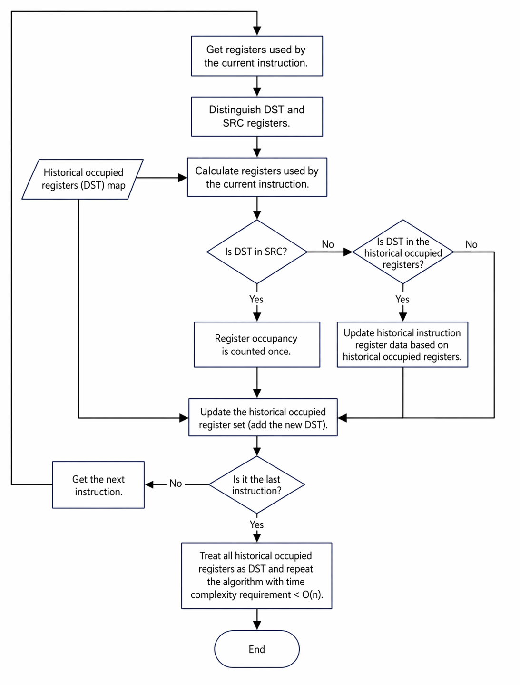

**Constraints**

1. The register limit is 32 for Atlas inference products and Atlas A2 training/inference products.
2. Assume that only instructions in the Scalar pipeline contain DST. Others contain only SRC.

Visualization calculation:

1. The new column name is **GPR Count**.
2. The register count per code line equals register occupancy of all instructions within that line.
3. The instruction column uses the actual register occupancy of the instruction.

#### 4.4.1.4.2 MTE Bandwidth Chart Algorithm

Currently, only GM-related instructions are parsed, focusing on BRIF (GM read) and BWIF (GM write) log entries. Key attributes include instruction end time, transferred data volume, and read/write module.

1. Locate the BRIF/BWIF instruction and its transfer type, `req_id`, and `instr_id`.
2. Find the last occurrence of the `req_id`, record its tick time, and regard it as a data transfer event at `floor(t)`.
3. If `instr_id` corresponds to L1WIF/UBWIF instead of BR/BW, record L1/UB as the other end of the transfer.
   By identifying the SRC/DST, data volume, and timestamp of transfer events, bandwidth is calculated at 1 µs intervals for GM<->L1, GM<->UB, and GM<->others within (t-1, t]. This results in six bandwidth charts.

### 4.5 Security Design

#### 4.5.1 Security Design Objectives

msOpProf must not tamper with unrelated environment files or permissions. It must not launch processes that affect the environment. Output file permissions must be set to prevent unauthorized modification.

#### 4.5.2 Security Design Context

msOpProf interacts with the simulator, hardware, and runtime. Security risks arise from external inputs and component information files.
Proper permissions for launched processes and secure coding practices are essential.
Communication files with basic components must have strict permission controls.

#### 4.5.3 Identification of High-Risk Modules

##### 4.5.3.1 Identification of High-Risk Modules

| Module                   | Interface Description                                                                              | Security Measure                                                                                                  | Code Directory                                                                                |
| ------------------------ | -------------------------------------------------------------------------------------------------- | ----------------------------------------------------------------------------------------------------------------- | --------------------------------------------------------------------------------------------- |
| Parameter parsing module | Parses and records command line parameters.                                                        | Validate paths, permissions, and nature of input files and processes.                                             | src/op_profiling/argparser/arg_checker.cpp                                                    |
| Data parsing module      | Parses raw profile data from the collection module and writes the final profile data to the drive. | Validate raw data file permissions and content. Implement strict permission controls on output performance files. | src/op_profiling/profiling/device/data_parse; src/op_profiling/profiling/simulator/data_parse |
| Communication module     | Manages communication between basic components and the tool side.                                  | Uses anonymous sockets so that socket files are not written to the drive.                                         | src/op_profiling/communication                                                                |

##### 4.5.3.2 Identification of High-Risk APIs

> The following table lists the APIs identified as high-risk and explains the rationale.

| API               | API Description              | Security Measure                                                                                                              | Code Directory                                  | Language | Remarks |
| ----------------- | ---------------------------- | ----------------------------------------------------------------------------------------------------------------------------- | ----------------------------------------------- | -------- | ------- |
| ArgChecker::Check | Parses all input parameters. | Implement comprehensive check on all parameters because different types of input parameters have different validation points. | src/op_profiling/argparser/arg_checker.cpp->L56 | C++      |         |

#### 4.5.4 Implementation of Security Defenses

**1. Data protection**
N/A

**2. Module dependencies and third-party libraries**
Tool parameters are centrally validated by the `argsChecker` module. Any newly added input must have validation logic implemented in this module.

**3. Error handling**
The system validates input file paths, permissions, symbolic links, illegal characters, write permission, and ownership. If the validation fails, the process terminates immediately.
Output files are written to the drive with permissions of at least 750 for directories, 640 for files, and 400 for read-only files. If drive writing fails, an error log is generated.

**4. Logging and auditing**

1. Do not print file paths in logs.
2. Do not print ERROR level information during normal operation.
3. Be cautious with log frequency in loops to avoid flooding.
4. Limit the quantity of DEBUG logs to prevent masking important information (for example, specific communication content).

### 4.6 Developer Testing Model

#### 4.6.1 Design Objectives

Defines the key element model for msOpProf developer testing (DT) as a Layer 0 public design. This includes software testability design and layered testing strategies. It covers DT environments, test project design, general and domain-specific frameworks, and DFX testing for various layers.

#### 4.6.2 Design Constraints

Architectural design principles and constraints.

#### 4.6.3 Testability Design

UT: Covers all interfaces with 80% code line coverage and 60% branch coverage.
ST: Verifies correct generation of deliverables in all scenarios and tests all msOpProf functions.
IT: Performs assembly testing of software units (functional modules) according to the design specification for modules, subsystems, and the system to ensure technical requirements are met. Current focus is on instrumentation, collection, and parsing modules.
FUZZ: Performs fuzz testing on all external interfaces.

#### 4.6.4 Layered Testing

| Layer | Test Type        | Test Object                                          | Test Value                                                                                                                  |
| ----- | ---------------- | ---------------------------------------------------- | --------------------------------------------------------------------------------------------------------------------------- |
| UT    | Unit test        | All internal functions and classes of the interfaces | Verifies that the minimal implementation units work as expected.                                                            |
| IT    | Integration test | Instrumentation module                               | Ensures that the instrumentation module works correctly across all operators and records memory information.                |
| IT    | Integration test | Collection module                                    | Verifies the integrity and correctness of collected data.                                                                   |
| IT    | Integration test | Parsing module                                       | Tests whether the parsing module correctly parses raw data and generates deliverables.                                      |
| ST    | System test      | Operator typee                                       | Covers scenarios for PyTorch, aclnn, and so on, ensuring that performance files are generated correctly.                    |
| ST    | System test      | Launch modes                                         | Ensures correct data file generation for multi-operator, multi-process, and single-process multi-threaded launch scenarios. |

#### 4.6.5 Key Testing Solutions

1. Test project design

    UT: GoogleTest is used, and mockcpp is used for instrumentation.

2. Physical design
   UT and FUZZ tests are located in the repository. `execute_test_case.sh` runs UT cases, and `execute_fuzz_case.sh` runs FUZZ cases.

    ```text
    ├── src
    │   ├── CMakeLists.txt
    │   ├── __init__.py
    │   ├── op_profiling
    │   ├── op_runner
    │   └── utils
    └── test
        ├── CMakeLists.txt
        ├── fuzz
        ├── init_scripts
        └── ut
    ```

    The UT directory structure matches the source code structure:

    ```text
    ├── build_output
    │   ├── CMakeLists.txt
    │   └── test_build_output.cpp
    ├── CMakeLists.txt
    ├── op_profiling
    │   ├── argparser
    │   ├── CMakeLists.txt
    │   ├── common
    │   ├── communication
    │   ├── interface
    │   ├── parse
    │   ├── profiling
    │   └── prof_injection
    ├── op_runner
    │   ├── CMakeLists.txt
    │   ├── test_op_runner.cpp
    │   └── test_runtime_api.cpp
    ├── resources
    │   ├── config_json
    │   ├── dump
    │   ├── op_profiling
    │   └── op_test
    └── utils
        ├── CMakeLists.txt
        ├── cpputils
        └── pyutils
    ```

3. Runtime environment

    UT requires x86 machines due to mockcpp version limits.
    ST must run on supported devices: Atlas A2 training/inference products, Atlas A3 training/inference products, and Atlas inference products.

## 5. Runtime View

### 5.1 Interaction Model

#### 5.1.1 Collection Module

##### 5.1.1.1 Design Objectives

Collect specific information according to tool-side instructions. Operator accuracy must not be affected, and specific data files must be written to the drive.

##### 5.1.1.2 Design Constraints

Pay attention to file permissions, memory usage, and execution time during on-board profiling.

##### 5.1.1.3 Interaction Model Design

##### 5.1.1.3.1 On-board Profiling

**Hijacking logic**
The main hijacked functions (runtime interfaces corresponding to `aclrt` interfaces) are listed.

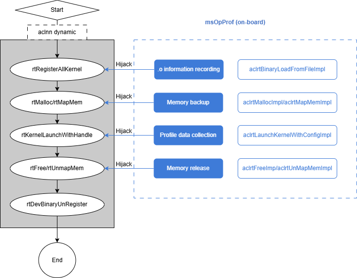

Note: For Atlas inference products, the runtime channel must be opened before hardware interfaces are enabled. The design aligns with msProf by using `dlopen` on `libprof.so` and passing the open command.
**Handling process**
The tuning tool depends on `libmsopprof_injection.so`. The tool side must notify the child process whether to start simulation or on-board profiling before launching the operator process. (The simulation mode is used as an example.)

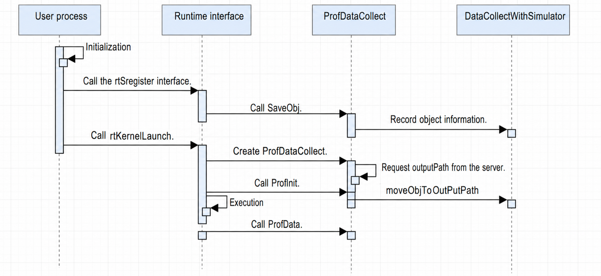

1. When the user process starts, injection initialization occurs automatically. It identifies the mode (on-board or simulation) and opens the corresponding .so file (`runtime.so` for on-board, `camodel_runtime.so` for simulation, plus `profapi.so` for msProf). Different libraries are hijacked in the basic components, and the code needs to be written in different folders. Currently, the `runtime` and `profapi` folders contain the stub code for the two libraries.
2. The user calls interfaces like `rtSetDevice` or `rtMalloc`. Kernel-related information is stored in `KernelContext`.
3. The user calls the `rtRegisterAllKernel` interface. For simulation, `.o` information is recorded. Currently, `.o` files are written to drive, and `map<const void *, std::string>` tracks their locations. One handle corresponds to one `.o` file address.
4. The user calls `KernelLaunch*`. The stub creates a `ProfDataCollect` object and requests a storage path from the server. If collection is required, the `.o` data corresponding to the handle is copied to the specified path. `rtKernelLaunch` continues, and simulator profile data is also copied to that path.
   On-board profiling follows a similar flow but without recording `.o` information. In the `ProfData` interface, instead of copying data, `KernelReplay` is executed.

**Replay process**
Currently, there are kernel-level replay, application-level replay, and range-level replay.

1. Kernel-level replay:
   Launches the operator process once. During `kernelLaunch`, multiple launches occur, each collecting different PMU data. Memory must be backed up and restored for each launch. Replays include repeated operator warm-up and L2 cache clearing.
   
   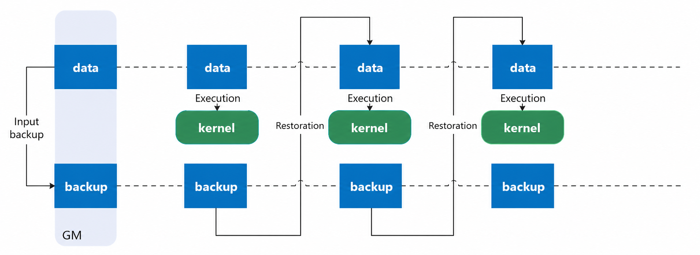
2. Application-level replay:
   Retains L2 cache state from previous operators. Each process launch collects one round of PMU data. Since multiple process launches are used, no memory backup is required.
3. Range-level replay:
   Enabled via `--replay-mode=range --mstx=on`. The operator range is defined by `mstxRangeStartA` and `mstxRangeEnd`. The target operators within this range are executed multiple times (replayed). Implementation uses `aclmdlRICaptureBegin`, `aclmdlRICaptureEnd`, and `aclmdlRIExecuteAsync`. The tool (basic component) calls `aclmdlRICaptureBegin` when the user calls `mstxRangeStartA`, and calls `aclmdlRICaptureEnd` when the user calls `mstxRangeEnd` to start capturing operators. The tool then runs the task using `aclmdlRIExecuteAsync` and repeatedly calls `aclmdlRIExecuteAsync` to implement replay.
   
   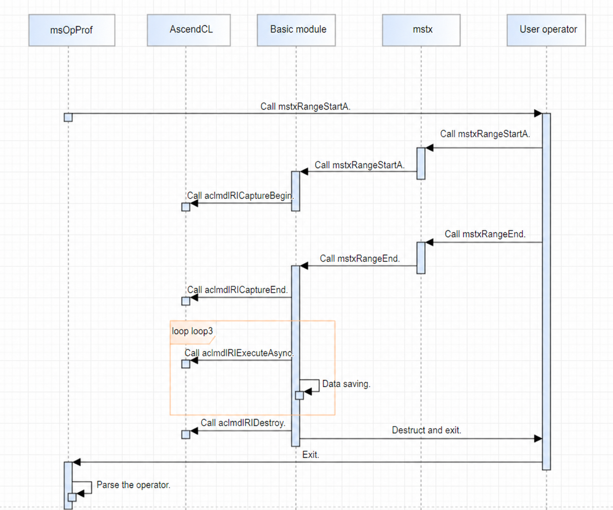

##### 5.1.1.3.1 Simulation Collection

**Hijacking logic**

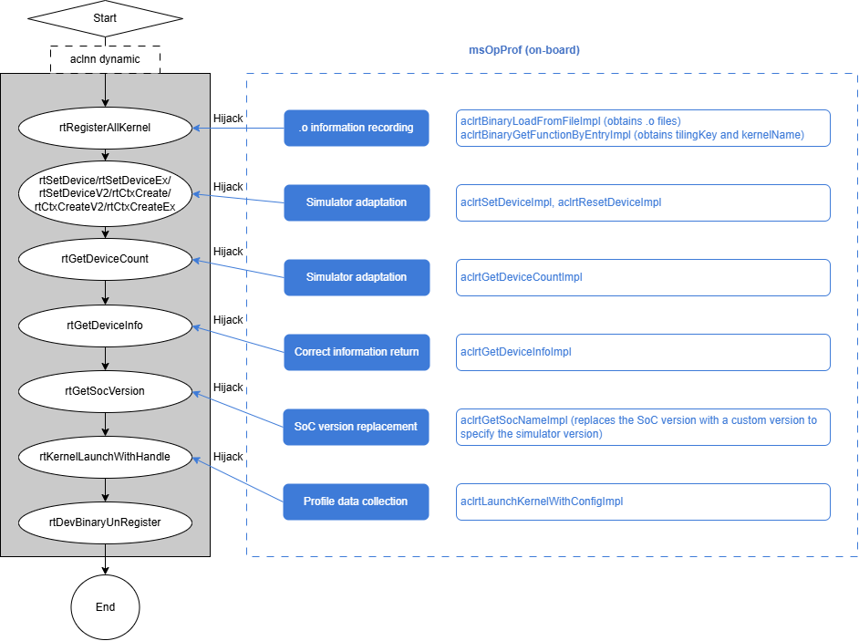

Simulation library dependencies:

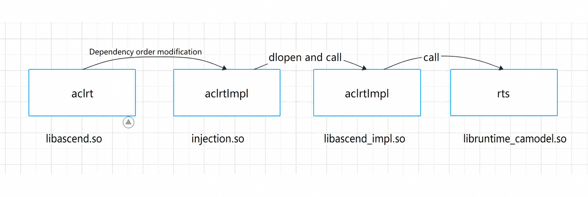

**Processing logic**

1. Interaction with Camodel
   The `msopt` tool launches the operator, which calls runtime interfaces. This enters the hijacking logic implemented in `func_injection`, which calls runtime interfaces provided by Camodel. Camodel automatically writes profile data to drive after `rtKernelLaunch`. Camodel now supports registration of callback functions. By registration before execution, profile data is passed directly to the interface. This allows for serial execution without drive writing, reducing I/O pressure and tool read times.
   
   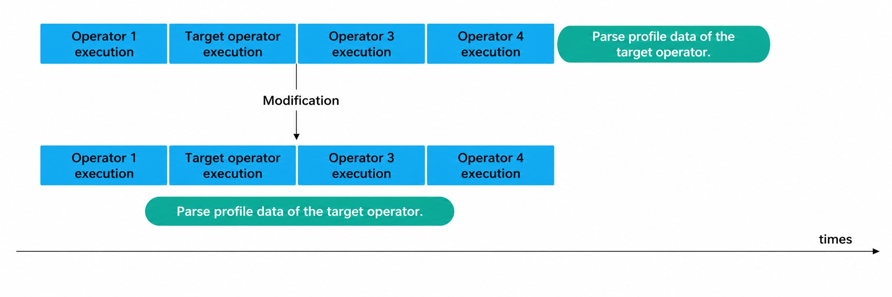
2. Interaction with the tool
   a. Profile data is sent back to the tool side for parsing. A queue mechanism and a dedicated thread are used for transmission to minimize latency from large data volumes.
   b. For multiple operators, only one is parsed at a time to manage memory. Communication requests can be used to parse target operators while unrelated operators are running, reducing end-to-end time.
   The sequence diagram shows high parallelism between the tool, operator, and simulator.
   
   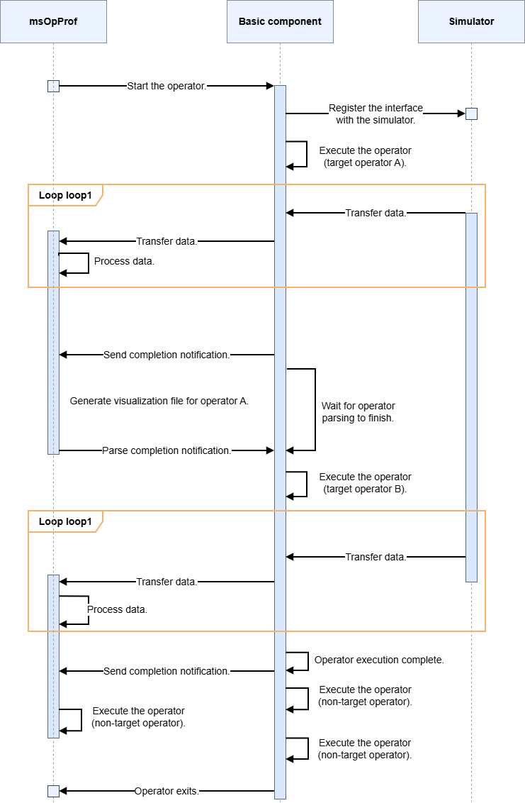

**Dynamic instrumentation**
Function call relationships:

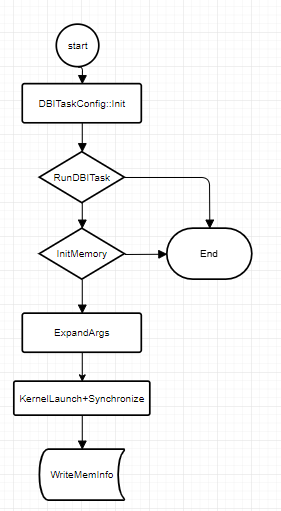

The `DBITask` class provides the primary functionality for dynamic instrumentation. The call flow is as follows: when the `Init` and `RunTask` methods of the `DBITask` interface are called, they internally interact with `bisheng-tune` to obtain a new `.o` file, which is then registered in the runtime. Then, `ExpandArgs` is called to append GM memory to the `args`. Finally, `rtKernelLaunch` is called to run the operator. After execution, the content at the GM address is written to a file for recording.

The tuning component requires multiple instrumentation passes to implement different functions. Currently, two instrumentation passes are needed:

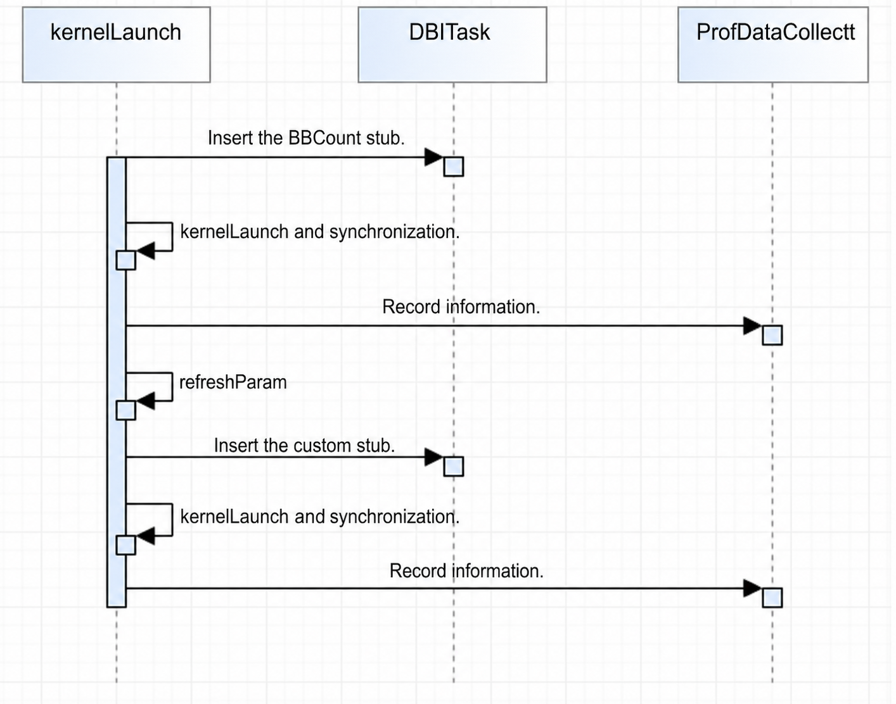

1. Code hot spot map: Requires BBCount stubs to count BB block executions and obtain the call count for each PC.
2. Custom stubs: Currently used for the data transfer volume display in the memory heatmap and for L2 cache related features.
   The multi-pass instrumentation solution targets a single process launch, where two stubs are inserted during each `kernelLaunch` (launching once for each stub is time-consuming and is not currently used).
   The current solution is to first insert the BBCount stub, run `kernelLaunch` and synchronization to record the required information, then refresh all parameters, and re-run `kernelLaunch` and synchronization with the second stub.

**MC2 operator task pipeline rendering**

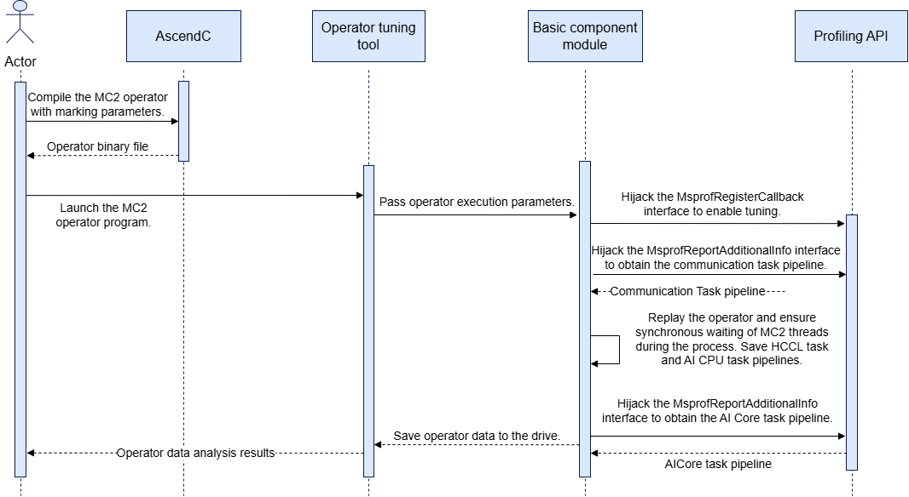

1. The operator tuning component launches the MC2 operator program. Before the operator main program executes, it first calls the `MsprofRegisterCallBack` interface in `profapi.so`. The basic component needs to hijack this interface to register the tuning switch callback function, enabling the reporting of MC2 AI Core tasks and communication tasks.
2. Communication tasks are reported by calling the `MsprofReportAdditionalInfo` interface in `profapi.so`. The tool needs to hijack this and save the communication task pipeline binary file.
3. Operator kernel function replay is performed, ensuring thread synchronization across all cards at the beginning and end of each replay. During the final replay, the binary file containing HCCL pipeline and AI CPU task pipeline data is recorded.
4. After the operator kernel function replay, the AI Core task pipeline is reported by calling the `MsprofReportAddtionalInfo` interface in `profapi.so`. The tool needs to hijack this and save the AI Core task pipeline binary file.

#### 5.1.2 Parsing Module

##### 5.1.2.1 Design Objectives

The parsing module should correctly parse raw profile data files, achieve independence and reusability between functions, and support multi-threaded parsing.

##### 5.1.2.2 Design Constraints

Ensure that the permissions of the files written to the drive comply with security specifications. Monitor memory occupancy and running time during data parsing.

##### 5.1.2.3 Interaction Model Design

##### 5.1.2.3.1 On-board

**Simulation code hot spot map**

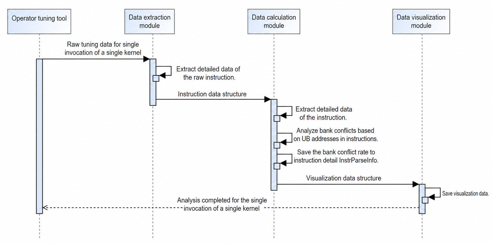

Visualization calculation:

1. New column **Processed Bytes**: The resource usage for each code line in the code bar is the sum of data transfer volume of all instructions contained in that line. The instruction bar uses the actual data volume of the instruction itself.
2. New column **GPR Count**: The number of registers occupied per code line in the code bar is the value of registers occupied by all instructions contained in that line.
3. New columns **UB Conflict Read** and **UB Conflict Write**: Read/write conflicts per code line in the code bar is the sum of read/write conflicts of all instructions contained in that line. The instruction bar uses the actual data volume of the instruction itself.

**MC2 instruction pipeline rendering**

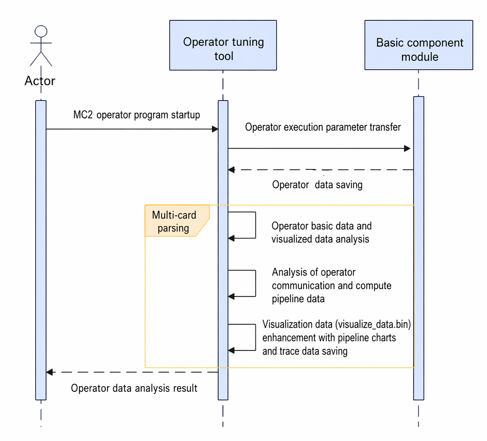

MC2 operators run on multiple cards. Therefore, the artifacts collected by the basic component are displayed partitioned by device, and the data for each operator is parsed and a communication and computing pipeline chart is rendered.

1. MC2 operators also contain AI Core basic data. Therefore, the basic operator information, metric data presented in CSV, and data presented in `visualize_data.bin` still need to be parsed. This part is almost identical to common operators. Note that MC2 operators need to use the `DeviceProf.bin` from the final replay to calculate performance metrics.
2. Parse AI Core task marking information. Each record contains the start/stop time of one type of pipeline, and two records are combined into one pipeline data entry. Each pipeline includes a PC address. If the operator contains debug information, the code line call stack information can be resolved and presented. This part of the pipeline chart is partitioned as a whole by `blockID`, which can be obtained from the data details.
3. Parse AI CPU task marking information, which is similarly combined into pipeline data entries.
4. Parse HCCL marking information based on the STARS data in `duration.bin`. This part of the pipeline chart is partitioned as a whole by `streamID`, which can be obtained from the data details.
5. Parse communication task marking information. This part of the pipeline chart is partitioned as a whole by `planeID`, which can be obtained from the data details.

##### 5.1.2.3.2 On-board

**Real-time parsing**

1. When a task is started, the `MteParser` object is initialized, and the `MtePlugin` and `DataCenter` objects are constructed accordingly.

2. After the operator side starts, it sends a Start message, indicating that collection of the current operator begins. `MteParser` clears the data in the current plugin and starts the plugin. Once the plugin is started, it calls the methods in the `DataStream` class and waits for performance data to arrive. The `DataStream` class has already encapsulated the mechanism for waiting for data and waking up from the wait. Producers call the `Push` method to add data, and consumers call the `Pop` method to retrieve data. The plugin waits for data and is awakened when data is available.

3. After performance data is received, parsing begins. This step is repeated throughout operator execution.

4. When the operator execution ends, a Stop message is sent. Upon receipt, the `Shutdown` function is called to close the data wait, at which point the plugin stops waiting for new data and performs subsequent operations.
   
   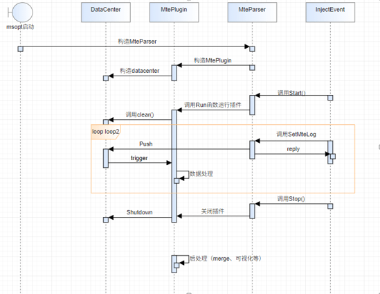
   
   **Dump file parsing**
   The overall process can be viewed as three stages: parsing, calculation, and visualization. After the input data is validated, the file is first parsed with core granularity, and the data on each core is parsed and registered into `DataCenter`. After this step, `DataCenter` contains complete instruction, ICache, and `userMark` data information.
   In the plugin-based calculation, further calculations are performed on the instruction details in each `DataCenter` to obtain data such as `gpr` and `ubread`, and the corresponding data values in the `DataCenter` are updated. After this step, all information for subsequent visualization is available.
   The visualization step parses the data in the `DataCenter`, extracts the corresponding data, and calculates the hot spot map and pipeline chart. Currently, MindStudio Insight has constraints requiring that the pipeline chart be rendered before the hot spot map for correct display.
   
   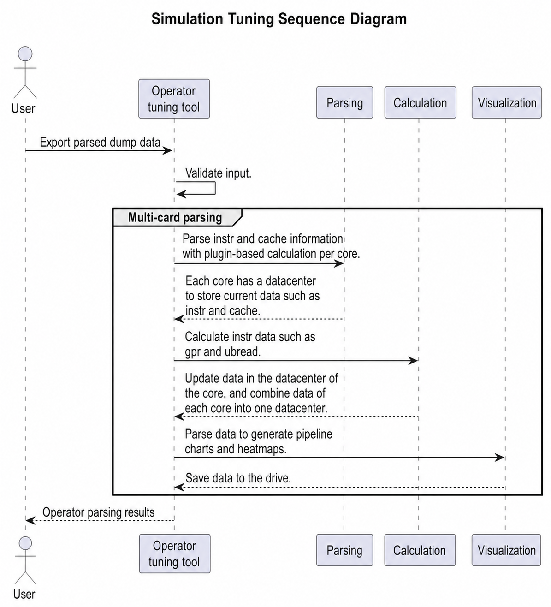

### 5.2 Concurrency Model

#### 5.2.1 Collection Module

##### 5.2.1.1 Design Objectives

Since the operator tuning component already supports single-process multi-threaded scenarios (multi-card simultaneous operation), such as MC2 operators, it must ensure that it does not affect the operator logic. For example, it cannot break the concurrency of the operator, must not affect the operator accuracy, and must correctly collect the operator profile data.

##### 5.2.1.2 Design Constraints

In the multi-card model, the data between cards and between operators must not affect each other.

##### 5.2.1.3 Concurrency Model Design

1. The performance collection instances must have `kernelLaunch` granularity. Each `kernelLaunch` generates a new collection object, where the `outputPath` and other parameters must be globally unique. The classes in this collection module must not be designed as singletons or other shareable types.
2. `MemoryContext` and `DeviceContext` are set to have one instance per device, ensuring that data between devices does not affect each other.
3. `ProConfig` records information from the tool side, such as the PMU to be collected, which is shared by all operators, so only one global instance is needed.
   
   

#### 5.2.2 Parsing Module

##### 5.2.2.1 Design Objectives

Implement parallel parsing of unrelated parsing items to speed up parsing.

##### 5.2.2.2 Design Constraints

Avoid multi-thread competition and read/write conflicts.

##### 5.2.2.3 Concurrency Model Design

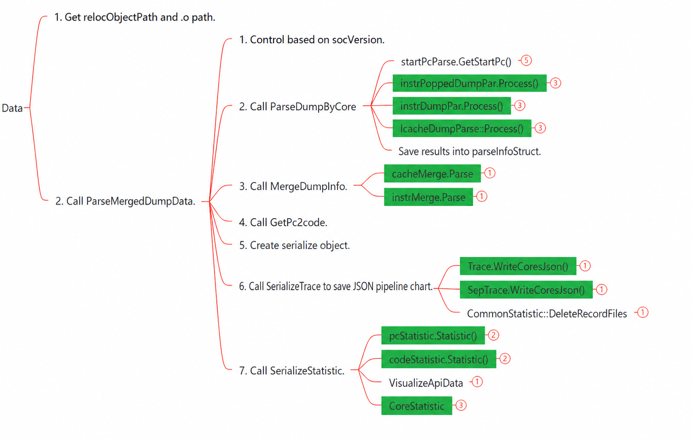

##### 6. Code Directory Structure

```text
├── cmake                              # Project build directory
├── csrc                               # Source code
├── docs                               # Project documentation
├── example                            # Project example code
├── package                            # Scripts for run package installation, uninstallation, and upgrade
├── test                               # Unit tests
├── thirdparty                         # Third-party dependencies
```
