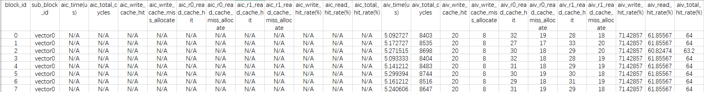
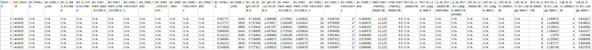
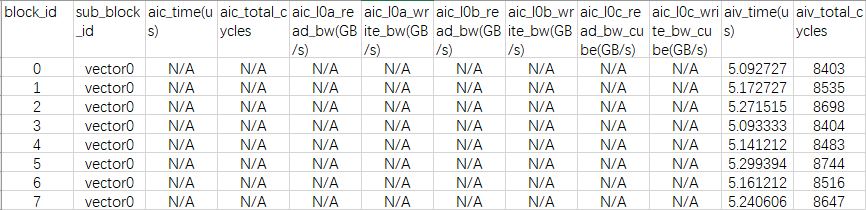
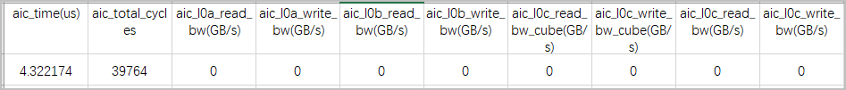
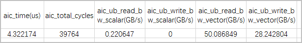
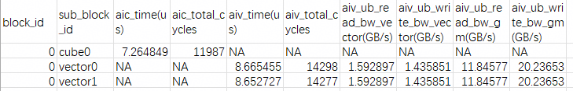
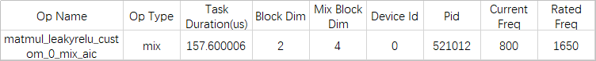
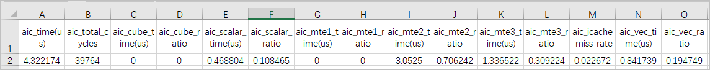
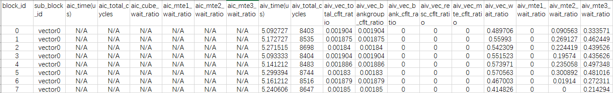
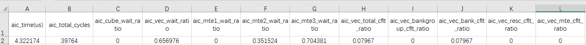

# **msopprof Profile Data**

## ArithmeticUtilization (Execution Time and Ratios of Cube and Vector Instructions)

`ArithmeticUtilization.csv` stores the cycle ratio data of Cube and Vector instructions. You are advised to optimize the operator logic to reduce redundant computing instructions. For details, see the field description in the following table.

**<term>Atlas A3 training products, Atlas A3 inference products</term>, <term>Atlas A2 training products, and Atlas A2 inference products</term>**

**Figure 1** ArithmeticUtilization.csv file 

The key fields are as follows.

**Table 1** Field description

|Field|Description|
|---|---|
|block_id|Number of running task blocks, which corresponds to the number of cores configured during task running.|
|sub_block_id|ID of the Vector/Cube core within the block.|
|aic_time(us)|Execution time of each AI Cube Core compute unit after the task is allocated to the unit, in microseconds (μs).|
|aic_total_cycles|Total number of cycles executed on each AI Cube Core compute unit after the task is allocated to the unit.|
|aiv_time(us)|Execution time of each AI Vector Core compute unit after the task is allocated to the unit, in μs.|
|aiv_total_cycles|Total number of cycles executed on each AI Vector Core compute unit after the task is allocated to the unit.|
|aic_cube_ratio|Ratio of cycles taken to execute Cube instructions to the total cycles.|
|aic_cube_fp16_ratio|Ratio of cycles taken to execute Cube fp16 instructions to the total cycles.|
|aic_cube_int8_ratio|Ratio of cycles taken to execute Cube int8 instructions to the total cycles.|
|aic_cube_fops|Floating-point operations (**fops** in the field name) of the Cube type, indicating the computing workload. This field can be used to measure the complexity of an algorithm or model.|
|aic_cube_total_instr_number|Total number of Cube instructions, including the fp and int types.|
|aic_cube_fp_instr_number|Total number of Cube fp instructions.|
|aic_cube_int_instr_number|Total number of Cube int instructions.|
|aiv_vec_ratio|Ratio of cycles taken to execute Vector instructions to the total cycles.|
|aiv_vec_fp32_ratio|Ratio of cycles taken to execute Vector fp32 instructions to the total cycles.|
|aiv_vec_fp16_ratio|Ratio of cycles taken to execute Vector fp16 instructions to the total cycles.|
|aiv_vec_int32_ratio|Ratio of cycles taken to execute Vector int32 instructions to the total cycles.|
|aiv_vec_int16_ratio|Ratio of cycles taken to execute Vector int16 instructions to the total cycles.|
|aiv_vec_misc_ratio|Ratio of cycles taken to execute Vector misc instructions to the total cycles.|
|aiv_vec_fops|Floating-point operations (**fops** in the field name) of the Vector type, indicating the computing workload. This field can be used to measure the complexity of an algorithm or model.|

**<term>Atlas inference products</term>**

**Figure 2** ArithmeticUtilization.csv file 

The key fields are as follows.

**Table 2** Field description

|Field|Description|
|---|---|
|aic_time(us)|Execution time of each AI Core compute unit after the task is allocated to the unit, in μs.|
|aic_total_cycles|Total number of cycles executed on each AI Core compute unit after the task is allocated to the unit.|
|aic_cube_ratio|Ratio of cycles taken to execute Cube instructions to the total cycles.|
|aic_cube_fp16_ratio|Ratio of cycles taken to execute Cube fp16 instructions to the total cycles.|
|aic_cube_int8_ratio|Ratio of cycles taken to execute Cube int8 instructions to the total cycles.|
|aic_cube_fops|Floating-point operations (**fops** in the field name) of the Cube type, indicating the computing workload. This field can be used to measure the complexity of an algorithm or model.|
|aic_cube_total_instr_number|Total number of Cube instructions, including the fp and int types.|
|aic_vec_ratio|Ratio of cycles taken to execute Vector instructions to the total cycles.|
|aic_vec_fp32_ratio|Ratio of cycles taken to execute Vector fp32 instructions to the total cycles.|
|aic_vec_fp16_ratio|Ratio of cycles taken to execute Vector fp16 instructions to the total cycles.|
|aic_vec_int32_ratio|Ratio of cycles taken to execute Vector int32 instructions to the total cycles.|
|aic_vec_int16_ratio|Ratio of cycles taken to execute Vector int16 instructions to the total cycles.|
|aic_vec_misc_ratio|Ratio of cycles taken to execute Vector misc instructions to the total cycles.|
|aic_vec_fops|Floating-point operations (**fops** in the field name) of the Vector type, indicating the computing workload. This field can be used to measure the complexity of an algorithm or model.|

**<term>Ascend 950 products</term>**

**Figure 3** ArithmeticUtilization.csv file 

The key fields are as follows.

**Table 3** Field description

|Field|Description|
|---|---|
|block_id|Number of running task blocks, which corresponds to the number of cores configured during task running.|
|sub_block_id|ID of the Vector/Cube core within the block.|
|aic_time(us)|Execution time of each AI Cube Core compute unit after the task is allocated to the unit, in microseconds (μs).|
|aic_total_cycles|Total number of cycles executed on each AI Cube Core compute unit after the task is allocated to the unit.|
|aic_cube_ratio|Ratio of cycles taken to execute Cube instructions to the total cycles.|
|aic_cube_fp_ratio|Ratio of cycles taken to execute Cube fp instructions to the total cycles.|
|aic_cube_int_ratio|Ratio of cycles taken to execute Cube int instructions to the total cycles.|
|aic_cube_total_instr_number|Total number of Cube instructions, including the fp and int types.|
|aic_cube_fp_instr_number|Total number of Cube fp instructions.|
|aic_cube_int_instr_number|Total number of Cube int instructions.|
|aiv_time(us)|Execution time of each AI Vector Core compute unit after the task is allocated to the unit, in μs.|
|aiv_total_cycles|Total number of cycles executed on each AI Vector Core compute unit after the task is allocated to the unit.|
|aiv_vec_ratio|Ratio of cycles taken to execute Vector instructions to the total cycles.|
|aiv_vec_vf_ratio|Ratio of cycles taken to execute Vector VF instructions to the total cycles.|
|aiv_vec_sfu_ratio|Ratio of cycles taken to execute Vector SFU instructions to the total cycles.|
|aiv_vec_simt_vf_ratio|Ratio of cycles taken to execute Vector SIMT VF instructions to the total cycles.|

## L2Cache (L2 Cache Hit Rate)

The L2 cache hit rate data is saved in the `L2Cache.csv` file, which affects the memory transfer engine (MTE2). You are advised to properly plan the data transfer logic to increase the hit rate. For details, see the field description in the following table.

**<term>Atlas A3 training products, Atlas A3 inference products</term>, <term>Atlas A2 training products, and Atlas A2 inference products</term>**

**Figure 1** L2Cache.csv file 

The key fields are as follows.

**Table 1** Field description

|Field|Description|
|---|---|
|block_id|Number of running task blocks, which corresponds to the number of cores configured during task running.|
|sub_block_id|Name and sequence number of each block used for task running.|
|aic_time(us)|Execution time of each AI Cube Core compute unit after the task is allocated to the unit, in microseconds (μs).|
|aic_total_cycles|Total number of cycles executed on each AI Cube Core compute unit after the task is allocated to the unit.|
|aiv_time(us)|Execution time of each AI Vector Core compute unit after the task is allocated to the unit, in μs.|
|aiv_total_cycles|Total number of cycles executed on each AI Vector Core compute unit after the task is allocated to the unit.|
|ai*_write_cache_hit|Write cache hits.|
|ai*_write_cache_miss_allocate|Cache re-allocations upon write cache missing.|
|ai*_r*_read_cache_hit|Read cache hits in the `r*` channel.|
|ai*_r*_read_cache_miss_allocate|Cache re-allocations upon read cache missing in the `r*` channel.|
|ai*_write_hit_rate(%)|Write cache hit rate.|
|ai*_read_hit_rate(%)|Read cache hit rate.|
|ai*_total_hit_rate(%)|Read/Write cache hit rate.|

**<term>Atlas inference products</term>**

**Figure 2** L2Cache.csv file 

The key fields are as follows.

**Table 2** Field description

|Field|Description|
|---|---|
|aic_l2_cache_hit_rate(%)|Ratio of the number of times that memory access requests hit L2 to the total number of memory access requests.|

**<term>Ascend 950 products</term>**

**Figure 3** L2Cache.csv file 

The key fields are as follows.

**Table 3** Field description

| Field                | Description                                                              |
|------------------------|------------------------------------------------------------------------|
| block_id               | Number of running task blocks, which corresponds to the number of cores configured during task running.                          |
| sub_block_id           | Name and sequence number of each block used for task running.                                   |
| aic_time(us)           | Execution time of each AI Cube Core compute unit after the task is allocated to the unit, in microseconds (μs).|
| aic_total_cycles       | Total number of cycles executed on each AI Cube Core compute unit after the task is allocated to the unit. |
| aiv_time(us)           | Execution time of each AI Vector Core compute unit after the task is allocated to the unit, in μs.|
| aiv_total_cycles       | Total number of cycles executed on each AI Vector Core compute unit after the task is allocated to the unit. |
| ai*_read_close_hit     | Number of read close cache hits.                                               |
| ai*_read_close_miss    | Number of read close cache misses.                                               |
| ai*_read_close_victim  | Number of read close cache evictions.                                               |
| ai*_read_far_hit       | Number of read far cache hits.                                                 |
| ai*_read_far_miss      | Number of read far cache misses.                                                 |
| ai*_read_far_victim    | Number of read far cache evictions.                                                 |
| ai*_read_hit_rate(%)   | Read cache hit rate.                                                       |
| ai*_write_close_hit    | Number of write close cache hits.                                               |
| ai*_write_close_miss   | Number of write close cache misses.                                               |
| ai*_write_close_victim | Number of write close cache evictions.                                               |
| ai*_write_far_hit      | Number of read far cache hits.                                                 |
| ai*_write_far_miss     | Number of write far cache misses.                                                 |
| ai*_write_far_victim   | Number of write far cache evictions.                                                 |
| ai*_write_hit_rate(%)  | Write cache hit rate.                                                       |

## Memory (Memory Read/Write Bandwidth Rate)

The memory read/write bandwidth rate data collected from the UB, L1, L2, and main memory is saved in `Memory.csv`. For details, see the field description in the following table.

The unit is GB/s, indicating that 1 GB data is transmitted per second.

**<term>Atlas A3 training products, Atlas A3 inference products</term>, <term>Atlas A2 training products, and Atlas A2 inference products</term>**

**Figure 1** Memory.csv file 

The key fields are as follows.

**Table 1** Field description

|Field|Description|
|---|---|
|block_id|Number of running task blocks, which corresponds to the number of cores configured during task running.|
|sub_block_id|Name and sequence number of each block used for task running.|
|aic_time(us)|Execution time of each AI Cube Core compute unit after the task is allocated to the unit, in microseconds (μs).|
|aic_total_cycles|Total number of cycles executed on each AI Cube Core compute unit after the task is allocated to the unit.|
|aiv_time(us)|Execution time of each AI Vector Core compute unit after the task is allocated to the unit, in μs.|
|aiv_total_cycles|Total number of cycles executed on each AI Vector Core compute unit after the task is allocated to the unit.|
|aiv_ub_to_gm_bw(GB/s)|Bandwidth of data written from UB to GM corresponding to the total cycles, in GB/s.|
|aiv_gm_to_ub_bw(GB/s)|Bandwidth of data written from GM to UB corresponding to the total cycles, in GB/s.|
|aic_l1_read_bw(GB/s)|Bandwidth of data read from all other units by the L1 unit in the operator corresponding to the total cycles, in GB/s.|
|aic_l1_write_bw(GB/s)|Bandwidth of data written to all other units by the L1 unit in the operator corresponding to the total cycles, in GB/s.|
|ai*_main_mem_read_bw(GB/s)|Bandwidth of data read from all other units by the main memory corresponding to the total cycles, in GB/s.|
|ai*_main_mem_write_bw(GB/s)|Bandwidth of data written to all other units by the main memory corresponding to the total cycles, in GB/s.|
|aic_mte1_instructions|Number of MTE1 instructions.|
|aic_mte1_ratio|Ratio of cycles taken to execute MTE1 instructions to the total cycles.|
|ai*_mte2_instructions|Number of MTE2 instructions.|
|ai*_mte2_ratio|Ratio of cycles taken to execute MTE2 instructions to the total cycles.|
|ai*_mte3_instructions|Number of MTE3 instructions.|
|ai*_mte3_ratio|Ratio of cycles taken to execute MTE3 instructions to the total cycles.|
|read_main_memory_datas(KB)|Total amount of data read from the main memory.|
|write_main_memory_datas(KB)|Total amount of data written to the main memory.|
|GM_to_L1_datas(KB)|Amount of data transferred from GM to L1.|
|L1_to_GM_datas(KB)(estimate)|Estimated amount of data transferred from L1 to GM.|
|L0C_to_L1_datas(KB)|Amount of data transferred from L0C to L1.|
|L0C_to_GM_datas(KB)|Amount of data transferred from L0C to GM.|
|GM_to_UB_datas(KB)|Amount of data transferred from GM to UB.|
|UB_to_GM_datas(KB)|Amount of data transferred from UB to GM.|
|GM_to_L1_bw_usage_rate(%)|Bandwidth usage of the channel from GM to L1.|
|L1_to_GM_bw_usage_rate(%)(estimate)|Estimated bandwidth usage of the channel from L1 to GM.|
|L0C_to_L1_bw_usage_rate(%)|Bandwidth usage of the channel from L0C to L1.|
|L0C_to_GM_bw_usage_rate(%)|Bandwidth usage of the channel from L0C to GM.|
|GM_to_UB_bw_usage_rate(%)|Bandwidth usage of the channel from GM to UB.|
|UB_to_GM_bw_usage_rate(%)|Bandwidth usage of the channel from UB to GM.|

**<term>Atlas inference products</term>**

**Figure 2** Memory.csv file 

The key fields are as follows.

**Table 2** Field description

|Field|Description|
|---|---|
|aic_time(us)|Execution time of each AI Core compute unit after the task is allocated to the unit, in μs.|
|aic_total_cycles|Total number of cycles executed on each AI Core compute unit after the task is allocated to the unit.|
|aic_ub_to_gm_bw(GB/s)|Bandwidth of data written from UB to GM corresponding to the total cycles, in GB/s.|
|aic_gm_to_ub_bw(GB/s)|Bandwidth of data written from GM to UB corresponding to the total cycles, in GB/s.|
|aic_l1_read_bw(GB/s)|Bandwidth of data read from all other units by the L1 unit in the operator corresponding to the total cycles, in GB/s.|
|aic_l1_write_bw(GB/s)|Bandwidth of data written to all other units by the L1 unit in the operator corresponding to the total cycles, in GB/s.|
|aic_main_mem_read_bw(GB/s)|Bandwidth of data read from all other units by the main memory corresponding to the total cycles, in GB/s.|
|aic_main_mem_write_bw(GB/s)|Bandwidth of data written to all other units by the main memory corresponding to the total cycles, in GB/s.|
|aic_mte1_instructions|Number of MTE1 instructions.|
|aic_mte1_ratio|Ratio of cycles taken to execute MTE1 instructions to the total cycles.|
|aic_mte2_instructions|Number of MTE2 instructions.|
|aic_mte2_ratio|Ratio of cycles taken to execute MTE2 instructions to the total cycles.|
|aic_mte3_instructions|Number of MTE3 instructions.|
|aic_mte3_ratio|Ratio of cycles taken to execute MTE3 instructions to the total cycles.|

**<term>Ascend 950 products</term>**

**Figure 3** Memory.csv file 

The key fields are as follows.

**Table 3** Field description

|Field|Description|
|--|--|
|block_id|Number of running task blocks, which corresponds to the number of cores configured during task running.|
|sub_block_id|Name and sequence number of each block used for task running.|
|aic_time(us)|Execution time of each AI Cube Core compute unit after the task is allocated to the unit, in microseconds (μs).|
|aic_total_cycles|Total number of cycles executed on each AI Cube Core compute unit after the task is allocated to the unit.|
|aiv_time(us)|Execution time of each AI Vector Core compute unit after the task is allocated to the unit, in μs.|
|aiv_total_cycles|Total number of cycles executed on each AI Vector Core compute unit after the task is allocated to the unit.|
|aiv_ub_to_gm_bw(GB/s)|Bandwidth of data written from UB to GM corresponding to the total cycles, in GB/s.|
|aiv_gm_to_ub_bw(GB/s)|Bandwidth of data written from GM to UB corresponding to the total cycles, in GB/s.|
|aic_l1_read_bw(GB/s)|Bandwidth of data read from all other units by the L1 unit in the operator corresponding to the total cycles, in GB/s.|
|aic_l1_write_bw(GB/s)|Bandwidth of data written to all other units by the L1 unit in the operator corresponding to the total cycles, in GB/s.|
|ai*_main_mem_read_bw(GB/s)|Bandwidth of data read from all other units by the main memory corresponding to the total cycles, in GB/s.|
|ai*_main_mem_write_bw(GB/s)|Bandwidth of data written to all other units by the main memory corresponding to the total cycles, in GB/s.|
|aic_mte1_instructions|Number of MTE1 instructions.|
|aic_mte1_ratio|Ratio of cycles taken to execute MTE1 instructions to the total cycles.|
|ai*_mte2_instructions|Number of MTE2 instructions.|
|ai*_mte2_ratio|Ratio of cycles taken to execute MTE2 instructions to the total cycles.|
|ai*_mte3_instructions|Number of MTE3 instructions.|
|ai*_mte3_ratio|Ratio of cycles taken to execute MTE3 instructions to the total cycles.|
|read_main_memory_datas(KB)|Total amount of data read from the main memory.|
|write_main_memory_datas(KB)|Total amount of data written to the main memory.|
|GM_to_L1_datas(KB)|Amount of data transferred from GM to L1.|
|L0C_to_L1_datas(KB)|Amount of data transferred from L0C to L1.|
|L0C_to_GM_datas(KB)|Amount of data transferred from L0C to GM.|
|GM_to_UB_datas(KB)|Amount of data transferred from GM to UB.|
|GM_to_L1_bw_usage_rate(%)|Bandwidth usage of the channel from GM to L1.|
|L0C_to_L1_bw_usage_rate(%)|Bandwidth usage of the channel from L0C to L1.|
|L0C_to_GM_bw_usage_rate(%)|Bandwidth usage of the channel from L0C to GM.|
|GM_to_UB_bw_usage_rate(%)|Bandwidth usage of the channel from GM to UB.|

## MemoryL0 (L0 Read/Write Bandwidth Rate)

`MemoryL0.csv` stores the collected L0A, L0B, and L0C memory read/write bandwidth rate data. For details, see the field description in the following table.

The unit is GB/s, indicating that 1 GB data is transmitted per second.

**<term>Atlas A3 training products, Atlas A3 inference products</term>, <term>Atlas A2 training products, Atlas A2 inference products</term>, and <term>Ascend 950 products</term>**

**Figure 1** MemoryL0.csv file 

The key fields are as follows.

**Table 1** Field description

|Field|Description|
|--|--|
|block_id|Number of running task blocks, which corresponds to the number of cores configured during task running.|
|sub_block_id|Name and sequence number of each block used for task running.|
|aic_time(us)|Execution time of each AI Cube Core compute unit after the task is allocated to the unit, in microseconds (μs).|
|aic_total_cycles|Total number of cycles executed on each AI Cube Core compute unit after the task is allocated to the unit.|
|aiv_time(us)|Execution time of each AI Vector Core compute unit after the task is allocated to the unit, in μs.|
|aiv_total_cycles|Total number of cycles executed on each AI Vector Core compute unit after the task is allocated to the unit.|
|aic_l0a_read_bw(GB/s)|Bandwidth of data read from all other units by the L0A unit in the operator corresponding to the total cycles, in GB/s.|
|aic_l0a_write_bw(GB/s)|Bandwidth of data written to all other units by the L0A unit in the operator corresponding to the total cycles, in GB/s.|
|aic_l0b_read_bw(GB/s)|Bandwidth of data read from all other units by the L0B unit in the operator corresponding to the total cycles, in GB/s.|
|aic_l0b_write_bw(GB/s)|Bandwidth of data written to all other units by the L0B unit in the operator corresponding to the total cycles, in GB/s.|
|aic_l0c_read_bw_cube(GB/s)|Bandwidth of data read from the L0C unit by Cube corresponding to the total cycles, in GB/s.|
|aic_l0c_write_bw_cube(GB/s)|Bandwidth of data written to the L0C unit by Cube corresponding to the total cycles, in GB/s.|

**<term>Atlas inference products</term>**

**Figure 2** MemoryL0.csv file 

The key fields are as follows.

**Table 2** Field description

|Field|Description|
|--|--|
|aic_time(us)|Execution time of each AI Core compute unit after the task is allocated to the unit, in μs.|
|aic_total_cycles|Total number of cycles executed on each AI Core compute unit after the task is allocated to the unit.|
|aic_l0a_read_bw(GB/s)|Bandwidth of data read from all other units by the L0A unit in the operator corresponding to the total cycles, in GB/s.|
|aic_l0a_write_bw(GB/s)|Bandwidth of data written to all other units by the L0A unit in the operator corresponding to the total cycles, in GB/s.|
|aic_l0b_read_bw(GB/s)|Bandwidth of data read from all other units by the L0B unit in the operator corresponding to the total cycles, in GB/s.|
|aic_l0b_write_bw(GB/s)|Bandwidth of data written to all other units by the L0B unit in the operator corresponding to the total cycles, in GB/s.|
|aic_l0c_read_bw_cube(GB/s)|Bandwidth of data read from the L0C unit by Cube corresponding to the total cycles, in GB/s.|
|aic_l0c_write_bw_cube(GB/s)|Bandwidth of data written to the L0C unit by Cube corresponding to the total cycles, in GB/s.|
|aic_l0c_read_bw(GB/s)|Bandwidth of data read from the L0C unit by Vector corresponding to the total cycles, in GB/s.|
|aic_l0c_write_bw(GB/s)|Bandwidth of data written to the L0C unit by Vector corresponding to the total cycles, in GB/s.|

## MemoryUB (UB Read/Write Bandwidth Rate)

`MemoryUB.csv` stores the collected MTE, Vector, and Scalar UB read/write bandwidth rate data. For details, see the field description in the following table.

The unit is GB/s, indicating that 1 GB data is transmitted per second.

**<term>Atlas A3 training products, Atlas A3 inference products</term>, <term>Atlas A2 training products, and Atlas A2 inference products</term>**

**Figure 1** MemoryUB.csv file 

The key fields are as follows.

**Table 1** Field description

|Field|Description|
|--|--|
|block_id|Number of running task blocks, which corresponds to the number of cores configured during task running.|
|sub_block_id|Name and sequence number of each block used for task running.|
|aic_time(us)|Execution time of each AI Cube Core compute unit after the task is allocated to the unit, in microseconds (μs).|
|aic_total_cycles|Total number of cycles executed on each AI Cube Core compute unit after the task is allocated to the unit.|
|aiv_time(us)|Execution time of each AI Vector Core compute unit after the task is allocated to the unit, in μs.|
|aiv_total_cycles|Total number of cycles executed on each AI Vector Core compute unit after the task is allocated to the unit.|
|aiv_ub_read_bw_vector(GB/s)|Bandwidth of data read from UB by Vector corresponding to the total cycles, in GB/s.|
|aiv_ub_write_bw_vector(GB/s)|Bandwidth of data written to UB by Vector corresponding to the total cycles, in GB/s.|
|aiv_ub_read_bw_scalar(GB/s)|Bandwidth of data read from UB by Scalar corresponding to the total cycles, in GB/s.|
|aiv_ub_write_bw_scalar(GB/s)|Bandwidth of data written to UB by Scalar corresponding to the total cycles, in GB/s.|

**<term>Atlas inference products</term>**

**Figure 2** MemoryUB.csv file 

The key fields are as follows.

**Table 2** Field description

|Field|Description|
|--|--|
|aic_time(us)|Execution time of each AI Core compute unit after the task is allocated to the unit, in μs.|
|aic_total_cycles|Total number of cycles executed on each AI Core compute unit after the task is allocated to the unit.|
|aic_ub_read_bw_vector(GB/s)|Bandwidth of data read from UB by Vector corresponding to the total cycles, in GB/s.|
|aic_ub_write_bw_vector(GB/s)|Bandwidth of data written to UB by Vector corresponding to the total cycles, in GB/s.|
|aic_ub_read_bw_scalar(GB/s)|Bandwidth of data read from UB by Scalar corresponding to the total cycles, in GB/s.|
|aic_ub_write_bw_scalar(GB/s)|Bandwidth of data written to UB by Scalar corresponding to the total cycles, in GB/s.|

**<term>Ascend 950 products</term>**

**Figure 3** MemoryUB.csv file 

The key fields are as follows.

**Table 3** Field description

|Field|Description|
|--|--|
|block_id|Number of running task blocks, which corresponds to the number of cores configured during task running.|
|sub_block_id|Name and sequence number of each block used for task running.|
|aic_time(us)|Execution time of each AI Cube Core compute unit after the task is allocated to the unit, in microseconds (μs).|
|aic_total_cycles|Total number of cycles executed on each AI Cube Core compute unit after the task is allocated to the unit.|
|aiv_time(us)|Execution time of each AI Vector Core compute unit after the task is allocated to the unit, in μs.|
|aiv_total_cycles|Total number of cycles executed on each AI Vector Core compute unit after the task is allocated to the unit.|
|aiv_ub_read_bw_vector(GB/s)|Bandwidth of data read from UB by Vector corresponding to the total cycles, in GB/s.|
|aiv_ub_write_bw_vector(GB/s)|Bandwidth of data written to UB by Vector corresponding to the total cycles, in GB/s.|
|aiv_ub_write_bw_gm(GB/s)|Bandwidth of data written to UB by GM corresponding to the total cycles, in GB/s.|
|aiv_ub_read_bw_gm(GB/s)|Bandwidth of data read from UB by GM corresponding to the total cycles, in GB/s.|

## OpBasicInfo (Basic Operator Information)

`OpBasicInfo.csv` stores the basic operator information, including the operator names, operator types, block dim, and time consumptions. For details, see the field description in the following table.

**Figure 1** OpBasicInfo.csv file 

The key fields are as follows.

**Table 1** Field description

|Field|Description|
|--|--|
|Op Name|Operator name.|
|Op Type|Operator type.|
|Task Duration(us)|Task duration, including the time for scheduling a task to the AI processor, execution time on the AI processor, and response completion time. The unit is μs.|
|Block Dim|Number of task splits, which corresponds to the number of cores used for task running and the number of logical cores for operator execution set by the developer.|
|Mix Block Dim|For operators that execute simultaneously on both Cube and Vector cores, `blockDim` of the primary AI processor is recorded in the `Block Dim` field, which indicates the number of Cube cores, while `blockDim` of the secondary AI processor is recorded here, which indicates the number of Vector cores. **N/A** indicates that the operator is a non-mixed fusion operator. This parameter applies only to Atlas A3 training products, Atlas A3 inference series, Atlas A2 training products, Atlas A2 inference products, and Ascend 950 products.|
|Device ID|ID of the AI processor used for running.|
|PID|ID of the process used for running the operator.|
|Current Freq|Current operating frequency of the AI processor.|
|Rated Freq|Theoretical frequency of the AI processor.|

## PipeUtilization (Execution Time and Ratios of Compute Units and MTEs)

The time consumption and percentage data of compute units and MTEs are collected in `PipeUtilization.csv`. You are advised to optimize the data transfer logic to improve bandwidth utilization. For details, see the field description in the following table.

> [!NOTE]NOTE
> 
> - The unit is GB/s, indicating that 1 GB data is transmitted per second.
> - In the table, `total cycle` used for each ratio refers to the number of cycles on the Cube core or Vector core. `ai*` is a collective term for `aic` (Cube) and `aiv` (Vector).

**<term>Atlas A3 training products, Atlas A3 inference products</term>, <term>Atlas A2 training products, and Atlas A2 inference products</term>**

**Figure 1** PipeUtilization.csv file 

The key fields are as follows.

**Table 1** Field description

|Field|Description|
|--|--|
|block_id|Number of running task blocks, which corresponds to the number of cores configured during task running.|
|sub_block_id|Name and sequence number of each block used for task running.|
|aic_time(us)|Execution time of each AI Cube Core compute unit after the task is allocated to the unit, in microseconds (μs).|
|aic_total_cycles|Total number of cycles executed on each AI Cube Core compute unit after the task is allocated to the unit.|
|aiv_time(us)|Execution time of each AI Vector Core compute unit after the task is allocated to the unit, in μs.|
|aiv_total_cycles|Total number of cycles executed on each AI Vector Core compute unit after the task is allocated to the unit.|
|aiv_vec_time(us)|Time taken to execute Vector instructions.|
|aiv_vec_ratio|Ratio of cycles taken to execute Vector instructions to the total cycles.|
|aic_cube_time(us)|Time taken to execute Cube instructions (fp16 and s16).|
|aic_cube_ratio|Ratio of cycles taken to execute Cube instructions (fp16 and s16) to the total cycles.|
|ai*_scalar_time(us)|Time taken to execute Scalar instructions.|
|ai*_scalar_single_time(us)|Instruction time for single-issue scalar instructions (one instruction issued per cycle).|
|ai*_scalar_dual_time(us)|Instruction time for dual-issue scalar instructions (two instructions issued per cycle).|
|ai*_scalar_wait_time(us)|Blockage time caused by intra-core wait instructions within Scalar operations.|
|ai*_scalar_wait_id*_time(us)|Blockage time caused by inter-core wait instructions for IDs within Scalar operations. `id*` is a placeholder, which can correspond to any core ID from ID0 to ID15. Inter-core synchronization metrics (`ai*_scalar_wait_id0_time` through `ai*_scalar_wait_id15_time`) are displayed only when relevant data is available.|
|aic_scalar_mte1_stall_time(us)|Scalar instruction blockage time caused by a full MTE1 instruction queue (IQ).|
|ai*_scalar_mte2_stall_time(us)|Scalar instruction blockage time caused by a full MTE2 IQ.|
|ai*_scalar_mte3_stall_time(us)|Scalar instruction blockage time caused by a full MTE3 IQ.|
|aic_scalar_cube_stall_time(us)|Scalar instruction blockage time caused by a full Cube IQ.|
|aic_scalar_vector_stall_time(us)|Scalar instruction blockage time caused by a full Vector IQ.|
|ai*_scalar_wait_ib_time(us)|Time spent by Scalar instructions waiting for iCache via the instruction buffer (IB).|
|aic_scalar_stall_by_ub_time(us)|Scalar instruction blockage time caused by the UB.|
|ai*_scalar_ratio|Ratio of cycles taken to execute Scalar instructions to the total cycles.|
|aic_fixpipe_time(us)|Time taken to execute fixpipe instructions (L0C-to-GM/L1 data transfer).|
|aic_fixpipe_ratio|Ratio of cycles taken to execute fixpipe instructions (L0C-to-GM/L1 data transfer) to the total cycles.|
|aic_mte1_time(us)|Time taken to execute MTE1 instructions (L1-to-L0A/L0B data transfer), excluding the transfer wait time.|
|aic_mte1_ratio|Ratio of cycles taken to execute MTE1 instructions (L1-to-L0A/L0B data transfer) to the total cycles.|
|ai*_mte2_time(us)|Time taken to execute MTE2 instructions (GM-to-AI Core data transfer).|
|ai*_mte2_ratio|Ratio of cycles taken to execute MTE2 instructions (GM-to-AI Core data transfer) to the total cycles.|
|ai*_mte3_time(us)|Time taken to execute MTE3 instructions (AI Core-to-GM data transfer).|
|ai*_mte3_ratio|Ratio of cycles taken to execute MTE3 instructions (AI Core-to-GM data transfer) to the total cycles.|
|ai*_icache_miss_rate|iCache miss rate, that is, L1 cache that does not hit instructions. The smaller the value, the better.|
|aic_mte3_active_bw(GB/s)|Active bandwidth of MTE3 instructions (AI Core-to-DDR Cube data transfer) corresponding to the active cycles.|
|aiv_mte3_active_bw(GB/s)|Active bandwidth of MTE3 instructions (AI Core-to-DDR AIV data transfer) corresponding to the active cycles.|
|aic_fixpipe_active_bw(GB/s)|Active bandwidth of fixpipe instructions (L0C-to-OUT/L1 data transfer) corresponding to the active cycles.|
|aiv_mte2_active_bw(GB/s)|Active bandwidth of MTE2 instructions (DDR-to-AI Core AIV data transfer) corresponding to the active cycles.|
|aic_mte1_active_bw(GB/s)|Active bandwidth of MTE1 in the Cube unit corresponding to the active cycles, specifically involving L1-to-L0A and L1-to-L0B channels. For Atlas A3 training products, Atlas A3 inference products, Atlas A2 training products, and Atlas A2 inference products, this is only displayed when dynamic instrumentation is enabled (when `--aic-metrics=MemoryDetail` is set).|
|aic_mte2_active_bw(GB/s)|Active bandwidth of MTE2 in the Cube unit corresponding to the active cycles, specifically involving GM-to-L1, GM-to-L0A, and GM-to-L0B channels. For Atlas A3 training products, Atlas A3 inference products, Atlas A2 training products, and Atlas A2 inference products, this is only displayed when dynamic instrumentation is enabled (when `--aic-metrics=MemoryDetail` is set).|

**<term>Atlas inference products</term>**

**Figure 2** PipeUtilization.csv file 

The key fields are as follows.

**Table 2** Field description

|Field|Description|
|--|--|
|aic_time(us)|Execution time of each AI Core compute unit after the task is allocated to the unit, in μs.|
|aic_total_cycles|Total number of cycles executed on each AI Core compute unit after the task is allocated to the unit.|
|aic_cube_time(us)|Time taken to execute Cube instructions (fp16 and s16).|
|aic_cube_ratio|Ratio of cycles taken to execute Cube instructions (fp16 and s16) to the total cycles.|
|aic_scalar_time(us)|Time taken to execute Scalar instructions.|
|aic_scalar_ratio|Ratio of cycles taken to execute Scalar instructions to the total cycles.|
|aic_mte1_time(us)|Time taken to execute MTE1 instructions (L1-to-L0A/L0B data transfer), excluding the transfer wait time.|
|aic_mte1_ratio|Ratio of cycles taken to execute MTE1 instructions (L1-to-L0A/L0B data transfer) to the total cycles.|
|aic_mte2_time(us)|Time taken to execute MTE2 instructions (GM-to-AI Core data transfer).|
|aic_mte2_ratio|Ratio of cycles taken to execute MTE2 instructions (GM-to-AI Core data transfer) to the total cycles.|
|aic_mte3_time(us)|Time taken to execute MTE3 instructions (AI Core-to-GM data transfer).|
|aic_mte3_ratio|Ratio of cycles taken to execute MTE3 instructions (AI Core-to-GM data transfer) to the total cycles.|
|aic_icache_miss_rate|iCache miss rate, that is, L1 cache that does not hit instructions. The smaller the value, the better.|
|aic_vec_time(us)|Time taken to execute Vector instructions.|
|aic_vec_ratio|Ratio of cycles taken to execute Vector instructions to the total cycles.|

**<term>Ascend 950 products</term>**

**Figure 3** PipeUtilization.csv file 

The key fields are as follows.

**Table 3** Field description

|Field|Description|
|--|--|
|block_id|Number of running task blocks, which corresponds to the number of cores configured during task running.|
|sub_block_id|Name and sequence number of each block used for task running.|
|aic_time(us)|Execution time of each AI Cube Core compute unit after the task is allocated to the unit, in microseconds (μs).|
|aic_total_cycles|Total number of cycles executed on each AI Cube Core compute unit after the task is allocated to the unit.|
|aiv_time(us)|Execution time of each AI Vector Core compute unit after the task is allocated to the unit, in μs.|
|aiv_total_cycles|Total number of cycles executed on each AI Vector Core compute unit after the task is allocated to the unit.|
|aiv_vec_time(us)|Time taken to execute Vector instructions.|
|aiv_vec_ratio|Ratio of cycles taken to execute Vector instructions to the total cycles.|
|aic_cube_time(us)|Time taken to execute Cube instructions (fp16 and s16).|
|aic_cube_ratio|Ratio of cycles taken to execute Cube instructions (fp16 and s16) to the total cycles.|
|ai*_scalar_time(us)|Time taken to execute Scalar instructions.|
|ai*_scalar_ratio|Ratio of cycles taken to execute Scalar instructions to the total cycles.|
|aic_fixpipe_time(us)|Time taken to execute fixpipe instructions (L0C-to-GM/L1 data transfer).|
|aic_fixpipe_ratio|Ratio of cycles taken to execute fixpipe instructions (L0C-to-GM/L1 data transfer) to the total cycles.|
|aic_mte1_time(us)|Time taken to execute MTE1 instructions (L1-to-L0A/L0B data transfer), excluding the transfer wait time.|
|aic_mte1_ratio|Ratio of cycles taken to execute MTE1 instructions (L1-to-L0A/L0B data transfer) to the total cycles.|
|ai*_mte2_time(us)|Time taken to execute MTE2 instructions (GM-to-AI Core data transfer).|
|ai*_mte2_ratio|Ratio of cycles taken to execute MTE2 instructions (GM-to-AI Core data transfer) to the total cycles.|
|ai*_mte3_time(us)|Time taken to execute MTE3 instructions (AI Core-to-GM data transfer).|
|ai*_mte3_ratio|Ratio of cycles taken to execute MTE3 instructions (AI Core-to-GM data transfer) to the total cycles.|
|ai*_icache_miss_rate|iCache miss rate, that is, L1 cache that does not hit instructions. The smaller the value, the better.|
 |aic_mte3_active_bw(GB/s)|Active bandwidth for MTE3 instructions (AI Core-to-DDR Cube data transfer).|
 |aiv_mte3_active_bw(GB/s)|Active bandwidth for MTE3 instructions (AI Core-to-DDR AIV data transfer).|
 |aic_fixpipe_active_bw(GB/s)|Active bandwidth for fixpipe instructions (L0C-to-OUT/L1 data transfer).|
 |aiv_mte2_active_bw(GB/s)|Active bandwidth for MTE2 instructions (DDR-to-AI Core AIV data transfer).|
 |aic_mte1_active_bw(GB/s)|Active bandwidth of MTE1 in the Cube unit, specifically involving L1-to-L0A and L1-to-L0B channels. For Atlas A3 training products, Atlas A3 inference products, Atlas A2 training products, and Atlas A2 inference products, this is only displayed when dynamic instrumentation is enabled (when `--aic-metrics=MemoryDetail` is set).|
 |aic_mte2_active_bw(GB/s)|Active bandwidth of MTE2 in the Cube unit, specifically involving GM-to-L1, GM-to-L0A, and GM-to-L0B channels. For Atlas A3 training products, Atlas A3 inference products, Atlas A2 training products, and Atlas A2 inference products, this is only displayed when dynamic instrumentation is enabled (when `--aic-metrics=MemoryDetail` is set).|

## ResourceConflictRatio (Resource Conflict Ratio)

The data of ratios of bank groups, bank conflicts, and resource conflicts in the UB to all instructions is saved in `ResourceConflictRatio.csv`. You are advised to reduce read/write conflicts on the same bank or read/read conflicts on a bank group.

A bank group is a group of banks in the UB. Each bank group contains multiple banks. A bank conflict refers to the competition between multiple threads that access the same bank at the same time in the UB.

For details, see the field description in the following table.

**<term>Atlas A3 training products, Atlas A3 inference products</term>, <term>Atlas A2 training products, and Atlas A2 inference products</term>**

**Figure 1** ResourceConflictRatio.csv file 

The key fields are as follows.

**Table 1** Field description

|Field|Description|
|--|--|
|block_id|Number of running task blocks, which corresponds to the number of cores configured during task running.|
|sub_block_id|Name and sequence number of each block used for task running.|
|aic_time(us)|Execution time of each AI Cube Core compute unit after the task is allocated to the unit, in microseconds (μs).|
|aic_total_cycles|Total number of cycles executed on each AI Cube Core compute unit after the task is allocated to the unit.|
|aiv_time(us)|Execution time of each AI Vector Core compute unit after the task is allocated to the unit, in μs.|
|aiv_total_cycles|Total number of cycles executed on each AI Vector Core compute unit after the task is allocated to the unit.|
|aic_cube_wait_ratio|Ratio of cycles in which Cube units are blocked to the total cycles of instructions.|
|aiv_vec_total_cflt_ratio|Ratio of cycles in which Vector instructions are blocked to the total cycles of instructions.|
|aiv_vec_bankgroup_cflt_ratio|Ratio of cycles in which Vector instructions are blocked by bankgroup conflicts to the total cycles of instructions. The bankgroup conflicts arise because the block stride of Vector instructions is improperly set.|
|aiv_vec_bank_cflt_ratio|Ratio of cycles in which Vector instructions are blocked by bank conflicts to the total cycles of instructions. The bank conflicts arise because the read/write pointer address of the Vector instruction operand is improper.|
|aiv_vec_resc_cflt_ratio|Ratio of cycles in which Vector instructions are blocked by execution unit resource conflicts to the total cycles of instructions. If an operator involves multiple compute units, ensure that they are concurrently scheduled. When a compute unit is working, but the operator logic still delivers instructions to it, the overall computing power is not fully utilized.|
|aiv_vec_mte_cflt_ratio|Ratio of cycles in which Vector instructions are blocked by MTE conflicts to the total cycles of instructions.|
|aiv_vec_wait_ratio|Ratio of cycles in which Vector units are blocked to the total cycles of instructions.|
|aic_mte1_wait_ratio|Ratio of cycles in which MTE1 is blocked to the total cycles of instructions.|
|ai*_mte2_wait_ratio|Ratio of cycles in which MTE2 is blocked to the total cycles of instructions.|
|ai*_mte3_wait_ratio|Ratio of cycles in which MTE3 is blocked to the total cycles of instructions.|

**<term>Atlas inference products</term>**

**Figure 2** ResourceConflictRatio.csv file 

The key fields are as follows.

**Table 2** Field description

|Field|Description|
|--|--|
|aic_time(us)|Execution time of each AI Core compute unit after the task is allocated to the unit, in μs.|
|aic_total_cycles|Total number of cycles executed on each AI Core compute unit after the task is allocated to the unit.|
|aic_cube_wait_ratio|Ratio of cycles in which Cube units are blocked to the total cycles of instructions.|
|aic_vec_total_cflt_ratio|Ratio of cycles in which Vector instructions are blocked to the total cycles of instructions.|
|aic_vec_bankgroup_cflt_ratio|Ratio of cycles in which Vector instructions are blocked by bankgroup conflicts to the total cycles of instructions. The bankgroup conflicts arise because the block stride of Vector instructions is improperly set.|
|aic_vec_bank_cflt_ratio|Ratio of cycles in which Vector instructions are blocked by bank conflicts to the total cycles of instructions. The bank conflicts arise because the read/write pointer address of the Vector instruction operand is improper.|
|aic_vec_resc_cflt_ratio|Ratio of cycles in which Vector instructions are blocked by execution unit resource conflicts to the total cycles of instructions. If an operator involves multiple compute units, ensure that they are concurrently scheduled. When a compute unit is working, but the operator logic still delivers instructions to it, the overall computing power is not fully utilized.|
|aic_vec_mte_cflt_ratio|Ratio of cycles in which Vector instructions are blocked by MTE conflicts to the total cycles of instructions.|
|aic_vec_wait_ratio|Ratio of cycles in which Vector units are blocked to the total cycles of instructions.|
|aic_mte1_wait_ratio|Ratio of cycles in which MTE1 is blocked to the total cycles of instructions.|
|aic_mte2_wait_ratio|Ratio of cycles in which MTE2 is blocked to the total cycles of instructions.|
|aic_mte3_wait_ratio|Ratio of cycles in which MTE3 is blocked to the total cycles of instructions.|

> [!NOTE]NOTE 
> `aic` in the preceding table refers to the AI core.

**<term>Ascend 950 products</term>**

**Figure 3** ResourceConflictRatio.csv file 

The key fields are as follows.

**Table 3** Field description

|Field|Description|
|--|--|
|block_id|Number of running task blocks, which corresponds to the number of cores configured during task running.|
|sub_block_id|Name and sequence number of each block used for task running.|
|aic_time(us)|Execution time of each AI Cube Core compute unit after the task is allocated to the unit, in microseconds (μs).|
|aic_total_cycles|Total number of cycles executed on each AI Cube Core compute unit after the task is allocated to the unit.|
|aic_cube_wait_ratio|Ratio of cycles in which Cube units are blocked to the total cycles of instructions.|
|aic_mte1_wait_ratio|Ratio of cycles in which MTE1 is blocked to the total cycles of instructions.|
|aic_mte2_wait_ratio|Ratio of cycles in which MTE2 is blocked to the total cycles of instructions.|
|aic_mte3_wait_ratio|Ratio of cycles in which MTE3 is blocked to the total cycles of instructions.|
|aiv_time(us)|Execution time of each AI Vector Core compute unit after the task is allocated to the unit, in μs.|
|aiv_total_cycles|Total number of cycles executed on each AI Vector Core compute unit after the task is allocated to the unit.|
|aiv_vec_stu_cflt_ratio|Ratio of cycles in which Vector instructions are blocked by set conflicts to the total cycles of instructions.|
|aiv_vec_ldu_cflt_ratio|Ratio of cycles in which Vector instructions are blocked by load conflicts to the total cycles of instructions.|
|aiv_vec_sfu_cflt_ratio|Ratio of cycles in which Vector instructions are blocked by read/write conflicts to the total cycles of instructions.|
|aiv_vec_wait_ratio|Ratio of cycles in which Vector units are blocked to the total cycles of instructions.|
|aiv_mte2_wait_ratio|Ratio of cycles in which MTE2 is blocked to the total cycles of instructions.|
|aiv_mte3_wait_ratio|Ratio of cycles in which MTE3 is blocked to the total cycles of instructions.|
