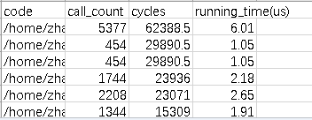

# **msopprof Simulator Mode Performance Data**

## Overview

The msOpProf simulator mode performs instruction-level performance simulation of operators. After the collection is complete, a folder named `OPPROF_{timestamp}_XXX` is generated in the specified `--output` directory, containing the following performance data files.

**Output directory structure:**

```text
OPPROF_{timestamp}_XXX
├── dump                                        // Folder for storing raw simulation dump data.
└── simulator                                   // Folder for storing dump data analysis results.
    ├── core0.veccore0                          // Data file directories for each core.
    │   ├── core0.veccore0_code_exe.csv         // Code line time consumption data file for this core.
    │   ├── core0.veccore0_instr_exe.csv        // Code instruction information file for this core.
    │   └── trace.json                          // Simulation instruction pipeline chart file for this core.
    ├── core0.veccore1
    │   ├── core0.veccore1_code_exe.csv
    │   ├── core0.veccore1_instr_exe.csv
    │   └── trace.json
    ├── ...
    ├── visualize_data.bin                      // Visualization file for simulation pipeline charts and hot spot functions.
    └── trace.json                              // Summary simulation instruction pipeline chart file for all cores.
```

> **NOTE:**
> - Directories are organized in the format `core*.veccore*` (Vector Core) or `core*.cubecore*` (Cube Core) to store data for each compute unit.
> - In multi-operator scenarios, CSV file names include a timestamp suffix, for example, `core*_code_exe_20240429111143146.csv`.
> - In single-operator scenarios, `visualize_data.bin` and the summary `trace.json` are located in the root of the `simulator/` directory.

---

## Code Line Time Consumption Data Files

The code line time consumption data files are `core*_code_exe.csv`, where * represents the core number (0 to n). These files store the execution time consumption information for each code line on each compute unit, helping you quickly locate the most time-consuming parts of the code.

**Figure 1** core*_code_exe.csv file



**Table 1** Field description

|Field|Description|
|-----|-----------|
|code|Code line. The format is *code file path:line number*.|
|call_count|Number of calls to instructions involved in a code line.|
|cycles|Total number of cycles in which instructions involved in a code line are executed on the AI Vector Core/AI Cube Core.|
|running_time(us)|Valid execution time of a code line, in μs.|

---

## Code Instruction Information Files

The detailed code instruction information files are `core*_instr_exe.csv`, where * represents the core number (0 to n). These files store detailed execution information for each instruction on each compute unit, helping you identify the most time-consuming single instructions.

**Figure 2** core*_instr_exe.csv file


**Table 2** Field description

|Field|Description|
|-----|-----------|
|instr|Name of a code instruction.|
|addr|PC address corresponding to a code instruction.|
|pipe|PIPE type, including instruction queues (MTE1/MTE2/MTE3) and compute units (VEC/CUBE).|
|call_count|Number of times that an instruction is called.|
|cycles|Total number of cycles in which an instruction is executed on the AI Vector Core/AI Cube Core.|
|running_time(us)|Valid execution time of an instruction, in μs.|
|detail|Detailed parameters for executing an instruction, such as source/destination address, length, and stride of data transfer.|

---

## Visualization Data File (visualize_data.bin)

The `visualize_data.bin` file is used for visualizing simulation performance data and must be viewed through MindStudio Insight. After import, the following content can be displayed:

|Feature|Description|
|-------|-----------|
|Instruction pipeline chart|Displays timing relationships by instruction and associates with the call stack to quickly locate bottlenecks.|
|Operator code hot spot map|Displays the mapping between operator source code and instructions, as well as time consumption, helping you identify hot spot code.|

**Figure 3** Operator code hot spot map example


For details about the MindStudio Insight import operation, see the [Importing Profile Data](https://gitcode.com/Ascend/msinsight/blob/master/docs/en/user_guide/basic_operations.md#%E5%AF%BC%E5%85%A5%E6%95%B0%E6%8D%AE) chapter in the *MindStudio Insight User Guide*.

---

## Instruction Pipeline Chart File (trace.json)

The `trace.json` files are the raw data files for simulation instruction pipeline charts, including per-core sub-files (located under `core*.veccore*/` or `core*.cubecore*/` directories) and the summary file for all cores (located in the root of the `simulator/` directory).

`trace.json` can be viewed in the following two ways:

- **Chrome browser**: Enter `chrome://tracing` in the Chrome address bar and drag the `trace.json` file into the window for viewing.

    **Figure 4** Viewing the instruction pipeline chart in the Chrome browser

    

    Use keyboard shortcuts (W: zoom in, S: zoom out, A: move left, D: move right) to navigate.
- **MindStudio Insight**: Import `trace.json` into MindStudio Insight for visual presentation, including instruction pipeline timing and the execution status of each PIPE.

> **NOTE:**
> - The per-core `trace.json` file displays the instruction pipeline for that specific core only.
> - The summary `trace.json` file displays the aggregated instruction pipeline for all cores.
> - If you only need to focus on the performance of specific operators, call the `TRACE_START` and `TRACE_STOP` APIs within a single core and add `-DASCENDC_TRACE_ON` to the compilation configuration file to generate pipeline chart information for the specified range. For details about these APIs, see the [Operator Debugging APIs](https://www.hiascend.com/document/detail/en/canncommercial/850/API/ascendcopapi/atlasascendc_api_07_1212.html) in the *Ascend C Operator Development API*.
