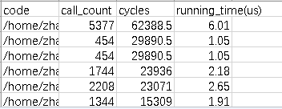
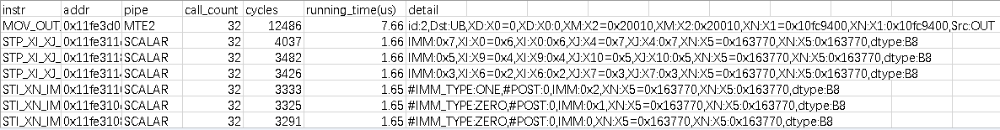
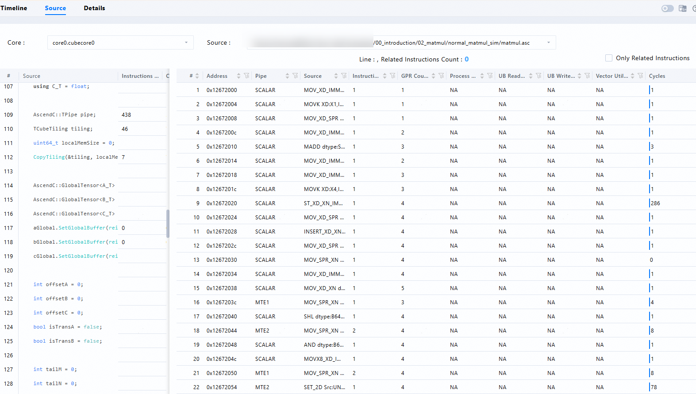
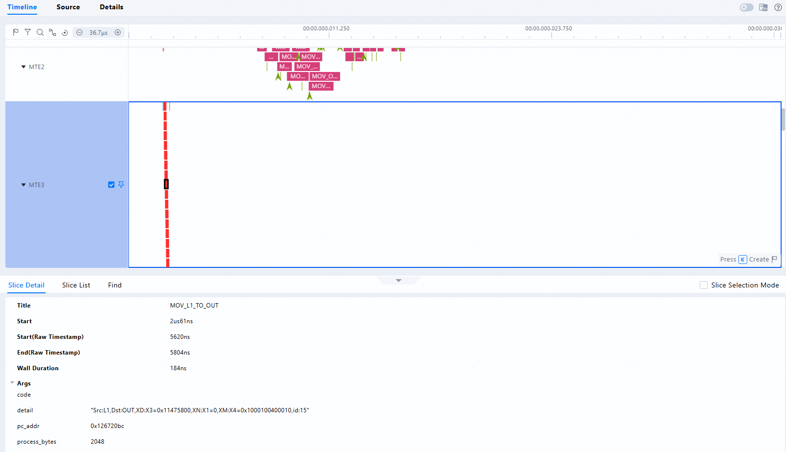

# msOpProf Simulator Mode Performance Data

## Overview

The msOpProf simulator mode uses a simulator to perform instruction-level performance simulation on operators. After the collection is complete, a folder named `OPPROF_{timestamp}_XXX` is generated in the specified `--output` directory, and the following performance data files are output.

**Output directory structure:**

```text
OPPROF_{timestamp}_XXX
├── dump                                        // Folder for storing raw simulation dump data
└── simulator                                   // Folder for storing dump data parsing results
    ├── core0.veccore0                          // Directory for storing data files of each core
    │   ├── core0.veccore0_code_exe.csv         // Code line time consumption data file of this core
    │   ├── core0.veccore0_instr_exe.csv        // Code instruction information file of this core
    │   └── trace.json                          // Simulation instruction pipeline chart file of this core
    ├── core0.veccore1
    │   ├── core0.veccore1_code_exe.csv
    │   ├── core0.veccore1_instr_exe.csv
    │   └── trace.json
    ├── ...
    ├── visualize_data.bin                      // Visualization file for the simulation pipeline chart and hot spot functions
    └── trace.json                              // Aggregated simulation instruction pipeline chart file of all cores
```

> **Note:**
>
> - The data of each compute unit is stored in directories named in the `core*.veccore*` (Vector Core) or `core*.cubecore*` (Cube Core) format.
> - In multi-operator scenarios, a timestamp suffix is added to the CSV file names, for example, `core*_code_exe_20240429111143146.csv`.
> - In single-operator scenarios, `visualize_data.bin` and the summary `trace.json` are located in the `simulator/` root directory.

---

## Code Line Time Consumption Data Files

The code line time consumption data file is `core*_code_exe.csv`, where * represents the core number (0 to n). The file stores the execution time consumption information of each code line on each compute unit, helping you quickly locate the most time-consuming part of the code.

**Figure 1** core*_code_exe.csv file



**Table 1** Field description

| Field | Description |
|-------|-------------|
| code | Code line. The format is `code file path:line number`. |
| call_count | Number of calls to instructions involved in a code line. |
| cycles | Total number of cycles in which instructions involved in a code line are executed on the AI Vector Core/AI Cube Core. |
| running_time(us) | Valid execution time of a code line, in μs. |

---

## Code Instruction Information Files

The detailed code instruction information file is `core*_instr_exe.csv`, where * represents the core number (0 to n). The file stores the detailed execution information of each instruction on each compute unit, helping you identify the single most time-consuming instruction.

**Figure 2** core*_instr_exe.csv file



**Table 2** Field description

| Field | Description |
|-------|-------------|
| instr | Name of a code instruction|
| addr | PC address corresponding to a code instruction|
| pipe | PIPE type, including the instruction queue (MTE1/MTE2/MTE3) and compute unit (VEC/CUBE)|
| call_count | Number of times that an instruction is called|
| cycles | Total number of cycles in which an instruction is executed on the AI Vector Core/AI Cube Core|
| running_time(us) | Valid execution time of an instruction, in μs|
| detail | Detailed parameters for executing an instruction, for example, the source/destination address, length, and stride of data movement|

---

## Visualization Data File (`visualize_data.bin`)

The `visualize_data.bin` file is a visualization file for presenting simulation performance data. You need to import it into MindStudio Insight for viewing. After the import, the following content can be displayed:

| Function | Description |
|----------|-------------|
| Instruction pipeline chart | Displays the timing relationship by instruction and associates with the call stack to quickly locate bottlenecks. |
| Operator code hot spot map | Displays the mapping relationship between the operator source code and the instruction set, as well as the time consumption, helping you identify hot spot code. |

**Figure 3** Example of an operator code hot spot map



For the import operation in MindStudio Insight, see [Importing Profile Data](https://gitcode.com/Ascend/msinsight/blob/26.1.0/docs/en/user_guide/basic_operations.md#importing-data) in the *MindStudio Insight User Guide*.

---

## Instruction Pipeline Chart File (`trace.json`)

The `trace.json` file is the raw data file of the simulation instruction pipeline chart, including the sub-files of each core (in the `core*.veccore*/` or `core*.cubecore*/` directories) and the summary file of all cores (in the `simulator/` root directory).

The `trace.json` file can be viewed in the following ways:

- **Chrome browser**: Enter `chrome://tracing` in the Chrome address bar, and drag the `trace.json` file into the window to view it.

    **Figure 4** Viewing the instruction pipeline chart in Chrome

    

    Use the shortcut keys (W: zoom in, S: zoom out, A: move left, D: move right) to browse.
- **MindStudio Insight**: Import the `trace.json` file into MindStudio Insight for visualization. The displayed content includes the instruction pipeline timing relationship and the execution status of each PIPE.

> **Note:**
>
> - The `trace.json` file of a single core displays only the instruction pipeline of that core.
> - The summary `trace.json` file displays the instruction pipeline chart summary of all cores.
> - If you only need to focus on the performance of some operators, invoke the `TRACE_START` and `TRACE_STOP` interfaces in a single core and add `-DASCENDC_TRACE_ON` to the compilation configuration file. This generates pipeline chart information in the specified range. For details about the interfaces, see [Operator Debugging APIs](https://www.hiascend.com/document/detail/zh/CANNCommunityEdition/910/API/ascendcopapi/docs/api/Utils-API/%E8%B0%83%E6%B5%8B%E6%8E%A5%E5%8F%A3/TRACE_START.md) in the *Ascend C Operator Development API*.
