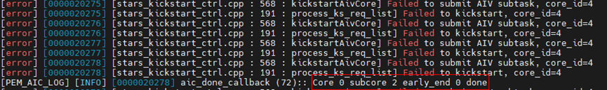
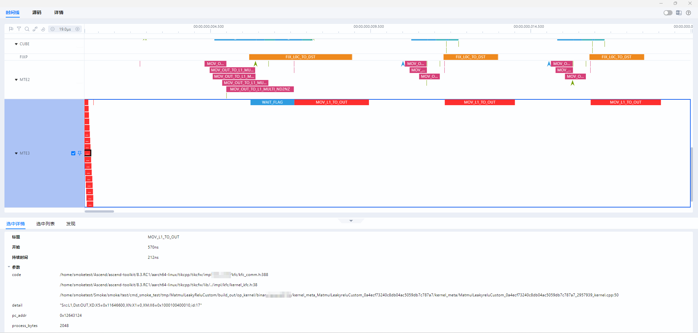
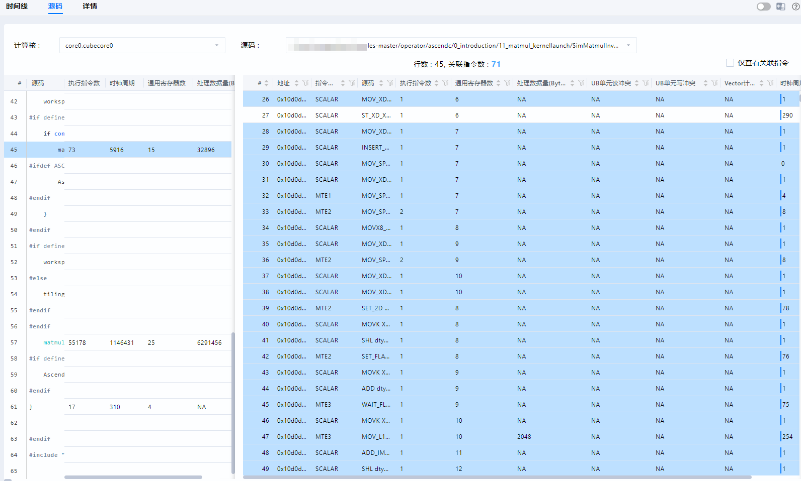

# **msOpProf Simulator Mode User Guide**

## Overview

MindStudio Ops Profiler (msOpProf, an operator tuning tool) is used to collect and analyze the key performance metrics of operators running on AI Processors. Based on the output profile data, you can quickly locate the hardware and software performance bottlenecks of operators, improving the efficiency of operator performance analysis.

Currently, profile data for different file formats (executable files or operator binary .o files) can be collected and automatically parsed in on-board (msopprof) and simulator (msopprof simulator) modes. This document describes how to use the msopprof simulator mode.

**Features**

msOpProf demonstrates single-operator tuning capabilities such as instruction pipeline chart, operator code hot spot maps, memory channel throughput waveform charts, and profile data files through MindStudio Insight. For details, see [**Table 1** msopprof simulator mode features](#simulator-mode-features).

**Table 1** msopprof simulator mode features<a id="simulator-mode-features"></a>

|Feature|Link|
|---|---|
|Instruction pipeline chart|[Instruction Pipeline Chart](#instruction-pipeline-chart)|
|Operator code hot spot map|[Operator Code Hot Spot Map](#operator-code-hot-spot-map)|
|Memory channel throughput waveform chart|[Memory Channel Throughput Waveform Chart](#memory-channel-throughput-waveform-chart)|
|Profile data files|[msopprof Simulator Profile Data](./msopprof_simulator_performance_data.md)|

**Scenarios**

The following scenarios are supported. For details, see [Collecting Profile Data of Ascend C Operators](../best_practices/typical_cases.md#collecting-profile-data-of-ascend-c-operators) and [Collecting Profile Data of MC2 Operators](../best_practices/typical_cases.md#collecting-profile-data-of-mc2-operators).

> [!NOTE]NOTE
> 
> Refer to <a href="https://gitcode.com/Ascend/msot/blob/master/docs/en/quick_start/get_chip_soc_type.md" target="_blank">Chip SoC Type Acquisition Method</a> to obtain the chip type, and use it as the value of the `--soc-version` parameter.

- Kernel launch operator development: kernel launch
    - In the kernel launch scenario, for details, see [Kernel Launch Operator Development](https://www.hiascend.com/document/detail/en/canncommercial/850/opdevg/Ascendcopdevg/atlas_ascendc_10_0056.html) in the *Ascend C Operator Development Guide*.
    - In the kernel launch scenario, configure the prerequisites and then run the following command:

        ```shell
        msprof op simulator --soc-version=Ascendxxxyy ./main # main indicates the name of the user operator program, including the program name of the operator to be tuned. xxxyy indicates the type of the processor used by the user.
        ```

    - If you need to perform simulation-based tuning on an operator that runs on the board without recompilation, perform the following steps:
        - Create a soft link named `libruntime.so` pointing to `libruntime_camodel.so` in any directory.

            ```shell
            ln -s /{simulator_path}/lib/libruntime_camodel.so /{so_path}/libruntime.so  
             # For example, if the CANN package is installed in the default path of the root user, simulator_path is /usr/local/Ascend/cann/tools/simulator/Ascendxxxyy.
            ```

        - Add the parent directory of the created soft link to the environment variable `LD_LIBRARY_PATH`.

            ```shell
            export LD_LIBRARY_PATH={so_path}:$LD_LIBRARY_PATH
            ```

- Project-based operator development: single-operator API calling
    - In the single-operator API execution scenario, see the **Project-based Operator Development** > [Single-Operator API Execution](https://www.hiascend.com/document/detail/en/canncommercial/850/opdevg/Ascendcopdevg/atlas_ascendc_10_0070.html) in the *Ascend C Operator Development Guide*.
    - In the single-operator API execution scenario, configure the prerequisites and then run the following command:

        ```shell
        msprof op simulator --soc-version=Ascendxxxyy ./main # main indicates the name of the user operator program, including the program name of the operator to be tuned. xxxyy indicates the type of the processor used by the user.
        ```

- AI framework operator adaptation: PyTorch framework
    - When msOpProf is used for simulated tuning of the operators in the PyTorch script on <term>Atlas inference products</term>, only the Kernels-based operator package calling mode is supported. Refer to the content related to Kernels operator package installation in the [Installing CANN](https://www.hiascend.com/document/detail/en/canncommercial/850/softwareinst) of the *CANN Software Installation Guide*. Install the binary Kernels operator package, and modify the script entry file (such as main`.py`) by adding the bold information below `import torch_npu` to ensure that the operators in the Kernels operator package are used.

        ```python
        import torch
        import torch_npu
        torch_npu.npu.set_compile_mode(jit_compile=False)
        ......
        ```

    - In the single-operator calling scenario through the PyTorch framework, for details, see the OpPlugin in [Ascend-developed Plugins](https://www.hiascend.com/document/detail/en/Pytorch/720/modthirdparty/modparts/thirdpart_0009.html) of the *Ascend Extension for PyTorch Suite and Third-party Library Support List*.
    - When the PyTorch framework is used to call a single-operator, configure the prerequisites and then run the following command:

        ```shell
        msprof op simulator --soc-version=Ascendxxxyy python a.py   # a.py indicates the name of the user operator program, including the program name of the operator to be tuned. xxxyy indicates the type of the processor used by the user.
        ```

- Triton operator development: Triton operator calling
    - Install and configure Triton and the Triton-Ascend plug-in. For details, see [Triton Ascend](https://gitcode.com/Ascend/triton-ascend/blob/main/README.md).
    - The Triton operator calling scenario does not apply to <term>Atlas inference products</term>.

## Preparations

**Preparing the environment**

Configure related environment variables by referring to the [MindStudio Ops Profiler Installation Guide](../install_guide/msopprof_install_guide.md).

- To use MindStudio Insight for viewing, install the MindStudio Insight software package separately. For download links, see the [MindStudio Insight Installation Guide](https://gitcode.com/Ascend/msinsight/blob/master/docs/en/user_guide/mindstudio_insight_install_guide.md).
- For <term>Atlas A2 training products/Atlas A2 inference products</term>, if you want to use the [template library](https://gitcode.com/cann/catlass/blob/master/scripts/build.sh) for simulation, add the `--simulator` option to the compilation script to compile the operator in simulator mode. For details, see this [link](https://gitcode.com/cann/docs/1_Practice/evaluation_tools/performance_tools.md).

    ```shell
    bash scripts/build.sh --simulator 00_basic_matmul
    ```

**Constraints**

- You are advised to collect profile data within 5 minutes and ensure that the set memory size is greater than 20 GB (for example, container configuration `docker run --memory=20g container_name`).
- Ensure that the profile data is stored in the current user directory that does not contain soft links. Otherwise, security issues may occur.

## Precautions

- msOpProf depends on the msopprof executable file in the CANN package. The API usage in this file is the same as that in msopprof. This file is provided by the CANN package and does not need to be installed separately.
- After you press `CTRL+C`, the operator execution stops, and the tool generates a profile data file based on existing information. If you do not need to generate the file, press `Ctrl+C` again.
- If the `--output` option is not specified, ensure that other users do not have the write permission on the upper-level directory of the current path.
- Before using msopprof simulator, ensure that the application functions properly.
- Do not initiate more than one profile data collection task on the same device.
- The simulation result of msopprof simulator in the document is for reference only. The actual running status of the operator is subject to the actual simulation data.
- You need to ensure the execution security of executable files or applications.
    - You are advised to restrict the operation permission on executable files or applications to avoid privilege escalation risks.
    - Avoid high-risk operations (such as deleting files, deleting directories, changing passwords, and running privilege escalation commands) to prevent security risks.

## Command Reference

Log in to the operating environment, use msopprof simulator to enable the operator simulation and tuning function, and use the optional simulation parameters and the program to be tuned (`blockdim 1`) for tuning. For details about the optional simulation parameters, see [**Table 1** Optional msopprof simulator parameters](#optional-msopprof-simulator-parameters). Refer to <a href="https://gitcode.com/Ascend/msot/blob/master/docs/en/quick_start/get_chip_soc_type.md" target="_blank">Chip SoC Type Acquisition Method</a> to obtain the chip type, and use it as the value of the `--soc-version` parameter. An example command is as follows:

```shell
msprof op simulator --soc-version=Ascendxxxyy --output=/home/projects/output /home/projects/MyApp/out/main blockdim 1   # --output is an optional parameter, /home/projects/MyApp/out/main is the used app, blockdim 1 is an optional parameter of the user application, and xxxyy is the type of the processor used by the user.
```

**Table 1** Optional msopprof simulator parameters<a id="optional-msopprof-simulator-parameters"></a>

<table><thead align="left"><tr id="zh-cn_topic_0000002016036877_row81111934143314"><th class="cellrowborder" valign="top" width="25.232523252325233%" id="mcps1.2.4.1.1"><p id="zh-cn_topic_0000002016036877_p0110173411337">Optional Parameter</p>
</th>
<th class="cellrowborder" valign="top" width="63.02630263026302%" id="mcps1.2.4.1.2"><p id="zh-cn_topic_0000002016036877_p161111334143318">Description</p>
</th>
<th class="cellrowborder" valign="top" width="11.741174117411742%" id="mcps1.2.4.1.3"><p id="zh-cn_topic_0000002016036877_p3111163418335">Mandatory</p>
</th>
</tr>
</thead>
<tbody><tr id="zh-cn_topic_0000002016036877_row01114348338"><td class="cellrowborder" valign="top" width="25.232523252325233%" headers="mcps1.2.4.1.1 "><p id="zh-cn_topic_0000002016036877_p41111934143316">--application</p>
</td>
<td class="cellrowborder" valign="top" width="63.02630263026302%" headers="mcps1.2.4.1.2 "><p id="zh-cn_topic_0000002016036877_p1411115342333">Specifies th e executable file to profile. You are advised to use <code>msprof op simulator <span>--soc-version=Ascendxxxyy</span> [<em id="zh-cn_topic_0000002016036877_i188155416131">msopprof  simulator parameters</em>] ./app</code>, where <code>xxxyy</code> indicates the processor type and <code>./app</code> is a user-specified executable file path. If no path is provided, the current directory is used.</p>
<p id="p3606523135915"> When using <code>./app</code>, add msopprof simulator parameters before <code>./app</code> to ensure that the related functions take effect.</p>
<p id="p12488132815597">Currently, this command is compatible with <code>./app [arguments]</code>. In the future, it will be changed to <code>./app [arguments]</code>.</p>
</td>
<td class="cellrowborder" rowspan="3" valign="top" width="11.741174117411742%" headers="mcps1.2.4.1.3 "><p id="zh-cn_topic_0000002016036877_p1511143418339">Yes. Choose one of <code>--application</code>, <code>--config</code>, or <code>--export</code>.</p>
</td>
</tr>
<tr id="zh-cn_topic_0000002016036877_row7113153443317"><td class="cellrowborder" valign="top" headers="mcps1.2.4.1.1 "><p id="zh-cn_topic_0000002016036877_p1411213413339">--config</p>
</td>
<td class="cellrowborder" valign="top" headers="mcps1.2.4.1.2 "><p id="zh-cn_topic_0000002016036877_p011233417332"><span>Specifies the absolute or relative path of the binary file </span><code id="zh-cn_topic_0000002016036877_b695415337500">*.o</code><span> generated after operator compilation</span>. <span>For details, see </span><a href="./extended_functions.md#json-configuration-file-description">JSON Configuration File Description</a><span>.</span></p>
<p id="zh-cn_topic_0000002016036877_p1611218349332">Before operator tuning, you can obtain the operator binary <code id="zh-cn_topic_0000002016036877_b1845814318519"><span>*.</span>o</code> file in either of the following ways:</p>
<ul id="zh-cn_topic_0000002016036877_ul81131345339"><li>Refer to <strong>Modifying and Executing One-Click Compilation and Execution Script</strong> in <strong>Kernel Launch Operator Development</strong> &gt; <a href="https://www.hiascend.com/document/detail/zh/canncommercial/83RC1/opdevg/Ascendcopdevg/atlas_ascendc_10_0052.html" target="_blank" rel="noopener noreferrer"><strong>Kernel Launch</strong></a> of the <span id="zh-cn_topic_0000002016036877_ph20112143419334"><em>Ascend C Operator Development Guide</em></span> to obtain the NPU executable file, and then manually extract the <span></span>.o file from the executable file.</li><li>Refer to <a href="https://www.hiascend.com/document/detail/zh/mindstudio/82RC1/ODtools/Operatordevelopmenttools/atlasopdev_16_0024.html" target="_blank" rel="noopener noreferrer">Operator Compilation and Deployment</a>. The <strong id="zh-cn_topic_0000002016036877_b17819952105016">.o</strong> file is automatically generated during operator compilation.</li></ul>
<p id="p811246204">Ensure that users in the group and other groups do not have the write permission on the JSON file specified by <code>--config</code> and its parent directory. In addition, ensure that the owner of the parent directory of the JSON file is the current user.</p>
<div class="p" id="p20157517201"> You need to use the <code>LD_LIBRARY_PATH</code> environment variable to set the simulator type. <pre class="screen" id="screen011316904">export LD_LIBRARY_PATH=${INSTALL_DIR}/tools/simulator/Ascendxxxyy/lib:$LD_LIBRARY_PATH // xxxyy indicates the type of the processor used by the user.</pre>
</div>
</td>
</tr>
<tr id="zh-cn_topic_0000002016036877_row187671719318"><td class="cellrowborder" valign="top" headers="mcps1.2.4.1.1 "><p id="zh-cn_topic_0000002016036877_p57603310145">--export</p>
</td>
<td class="cellrowborder" valign="top" headers="mcps1.2.4.1.2 "><p id="zh-cn_topic_0000002016036877_p17896565218">Specifies a folder containing single-operator simulation results, which will be directly parsed for <span id="zh-cn_topic_0000002016036877_ph8210104144115">MindStudio Insight</span> to display the single-core or multi-core instruction pipeline chart of a single operator.</p>
<p id="p216011111118">Note:</p>
<ul id="ul57064715117"><li>The specified folder should only contain multi-core data and operator kernel file <code>aicore_binary.o</code>. Rename the binary file specified in <code>--config</code> (<code>*.o</code>) to <code>aicore_binary.o</code>. </li><li>If only dump files are provided, code line mapping cannot be generated in the instruction pipeline chart. To view code lines, store the operator kernel file <code>aicore_binary.o</code> in the dump. </li><li>Ensure that users in the group and other groups do not have the write permission on the directory specified by <code>--export</code> and all files in the directory. In addition, ensure that the owner of the specified directory is the current user.</li></ul>
</td>
</tr>
<tr id="zh-cn_topic_0000002016036877_row5113434173311"><td class="cellrowborder" valign="top" width="25.232523252325233%" headers="mcps1.2.4.1.1 "><p id="zh-cn_topic_0000002016036877_p13113153423318">--kernel-name</p>
</td>
<td class="cellrowborder" valign="top" width="63.02630263026302%" headers="mcps1.2.4.1.2 "><p id="zh-cn_topic_0000002016036877_p144881915145316">Specifies the operator name to collect. Fuzzy matching using operator name prefixes is supported. If this option is not specified, only data of the first operator scheduled during program running is collected.</p>
<p id="p1096710195115">Note:</p>
<ul id="zh-cn_topic_0000002016036877_ul1548815153532"><li>This option must be used with <code>--application</code>. The value can contain a maximum of 1,024 characters, restricted to <strong id="zh-cn_topic_0000002016036877_b098232112217">letters, digits, and underscores (_)</strong>. </li><li>If multiple operators need to be collected, use vertical bars (|) to combine them. For example, <code>--kernel-name="add|abs"</code> indicates that operators whose prefixes are <code>add</code> and <code>abs</code> are collected. The number of operators collected is determined by the value of <code>--launch-count</code>. </li><li>Wildcards (<code>*</code>) can be used match strings of any length.</li></ul>
</td>
<td class="cellrowborder" valign="top" width="11.741174117411742%" headers="mcps1.2.4.1.3 "><p id="zh-cn_topic_0000002016036877_p14113143410333">No</p>
</td>
</tr>
<tr id="zh-cn_topic_0000002016036877_row13114183413339"><td class="cellrowborder" valign="top" width="25.232523252325233%" headers="mcps1.2.4.1.1 "><p id="zh-cn_topic_0000002016036877_p211313417339">--launch-count</p>
</td>
<td class="cellrowborder" valign="top" width="63.02630263026302%" headers="mcps1.2.4.1.2 "><p id="zh-cn_topic_0000002016036877_p511416349331">Sets the maximum number of operators that can be collected. The default value is 1, and the value is an integer ranging from 1 to 5000.</p>
</td>
<td class="cellrowborder" valign="top" width="11.741174117411742%" headers="mcps1.2.4.1.3 "><p id="zh-cn_topic_0000002016036877_p21141343331">No</p>
</td>
</tr>
<tr id="zh-cn_topic_0000002016036877_row11115934143315"><td class="cellrowborder" valign="top" width="25.232523252325233%" headers="mcps1.2.4.1.1 "><p id="zh-cn_topic_0000002016036877_p611493416337">--aic-metrics</p>
</td>
<td class="cellrowborder" valign="top" width="63.02630263026302%" headers="mcps1.2.4.1.2 "><div class="p" id="zh-cn_topic_0000002016036877_p217535311423">Enables operator performance metric collection. The following performance metrics can be collected. <ul id="zh-cn_topic_0000002016036877_ul17160143219116"><li><code>PipeUtilization</code> (collected by default): computing and transfer instruction pipelines. <p id="p1253172210219">When <code>--aic-metrics=PipeUtilization</code> is configured, <code>ResourceConflictRatio</code> is disabled. That is, only the instruction pipeline is displayed, and the details of synchronization event instructions are not included.</p>
</li><li><code>ResourceConflictRatio</code> (collected by default): displays details about synchronization event instructions. <ul id="ul12706651330"><li><span id="zh-cn_topic_0000002016036877_zh-cn_topic_0000001740005657_ph38331631115919">For <term id="term5706951931">Atlas A3 training products</term>, <term id="term770615512314">Atlas A3 inference products</term></span>, <span id="zh-cn_topic_0000002016036877_ph9610350151414"><term id="term18706155236">Atlas A2 training products</term>, and <term id="term5706551037">Atlas A2 inference products</term></span>, <code>SET_FLAG</code> and <code>WAIT_FLAG</code> instructions are displayed. </li><li><span id="zh-cn_topic_0000002016036877_ph12187735121517">For <term id="term1670618515315">Atlas inference products</term></span>, <code>set_event</code> and <code>wait_event</code> instruction are displayed.</li></ul>
</li></ul>
</div>
<ul id="zh-cn_topic_0000002016036877_ul21140347333"><li><code>PMSampling</code>: enables and visualizes the memory channel throughput waveform, for example, <code>--aic-metrics=PMSampling</code>. For details, see <a href="#memory-channel-throughput-waveform-chart">Memory Channel Throughput Waveform Chart</a> <ul id="zh-cn_topic_0000002016036877_ul536462164812"><li><code>--core-id</code> does not take effect for the <code>PMSampling</code> parameter. <code>PMSampling</code> parses all cores. </li><li>This feature is disabled by default.</li></ul>
</li></ul>
</td>
<td class="cellrowborder" valign="top" width="11.741174117411742%" headers="mcps1.2.4.1.3 "><p id="zh-cn_topic_0000002016036877_p4115163416335">No</p>
</td>
</tr>
<tr id="zh-cn_topic_0000002016036877_row61391251175519"><td class="cellrowborder" valign="top" width="25.232523252325233%" headers="mcps1.2.4.1.1 "><p id="zh-cn_topic_0000002016036877_p8263535194219">--core-id</p>
</td>
<td class="cellrowborder" valign="top" width="63.02630263026302%" headers="mcps1.2.4.1.2 "><p id="zh-cn_topic_0000002016036877_p6422922184820">This parameter is used when the operators are evenly distributed. You can use <code>--core-id</code> to specify the IDs of some logical cores to parse their simulation data.</p>
<p id="zh-cn_topic_0000002016036877_p12184631113">The core ID range is [0,49].</p>
<p id="p64136401232">If the simulation data of multiple cores needs to be parsed, use vertical bars (|) to combine them. For example, <code>--core-id="0|31"</code> parses simulation data of cores whose IDs are 0 and 31.</p>
<p id="p112723421038"><code>--core-id</code> does not take effect for the <code>PMSampling</code> parameter. <code>PMSampling</code> parses all cores.</p>
</td>
<td class="cellrowborder" valign="top" width="11.741174117411742%" headers="mcps1.2.4.1.3 "><p id="zh-cn_topic_0000002016036877_p141391351105514">No</p>
</td>
</tr>
<tr id="zh-cn_topic_0000002016036877_row1776724510349"><td class="cellrowborder" valign="top" width="25.232523252325233%" headers="mcps1.2.4.1.1 "><p id="zh-cn_topic_0000002016036877_p18767164517348">--timeout</p>
</td>
<td class="cellrowborder" valign="top" width="63.02630263026302%" headers="mcps1.2.4.1.2 "><p id="zh-cn_topic_0000002016036877_p146394291703"> This parameter is applicable to operators with a large amount of data and repetitive computation. Running such operators to completion takes significant time, but partial pipeline data provides sufficient information. Set <code>--timeout</code> to reduce running duration and capture necessary pipeline information. The implementation is as follows:</span></p>
<ul id="zh-cn_topic_0000002016036877_ul12129256185219"><li>When simulation duration reaches the <code>--timeout</code> value, <span>msOpProf</span> terminates the simulation process and begins parsing. Only the simulated data is analyzed. At the same time, <span>msOpProf</span> displays: <pre class="code_wrap" codetype="ColdFusion" id="zh-cn_topic_0000002016036877_screen104875352479">[INFO]  The timeout has reached and the application will be forcibly killed.</pre>
</li><li>If the process completes normally before reaching the timeout, the simulation ends and parsing proceeds.</li></ul>
<p id="zh-cn_topic_0000002016036877_p05905923811">The value is an integer ranging from 1 to 2880, in minutes. An example is as follows:</p>
<pre class="code_wrap" id="zh-cn_topic_0000002016036877_screen697132914484">msprof op simulator<strong id="zh-cn_topic_0000002016036877_b17229142131210"> </strong><span>--soc-version=Ascendxxxyy</span> --timeout=1 ./add_custom <span>/</span><span>/</span><strong id="zh-cn_topic_0000002016036877_b77321496128"><em id="zh-cn_topic_0000002016036877_i0732549181213"> </em></strong>xxxyy indicates the type of the processor used by the user.</pre>
</td>
<td class="cellrowborder" valign="top" width="11.741174117411742%" headers="mcps1.2.4.1.3 "><p id="zh-cn_topic_0000002016036877_p177687454344">No</p>
</td>
</tr>
<tr id="zh-cn_topic_0000002016036877_row17115153411335"><td class="cellrowborder" valign="top" width="25.232523252325233%" headers="mcps1.2.4.1.1 "><p id="zh-cn_topic_0000002016036877_p151151034143316">--mstx</p>
</td>
<td class="cellrowborder" valign="top" width="63.02630263026302%" headers="mcps1.2.4.1.2 "><p id="zh-cn_topic_0000002016036877_p197151054181117">Determines whether the operator tuning tool enables the mstx APIs used in the user code program.</p>
<p id="zh-cn_topic_0000002016036877_p161151134173317">The default value is <code>off</code>, indicating that the mstx APIs are disabled.</p>
<p id="zh-cn_topic_0000002016036877_p18115834193315">When <code>--mstx=on</code> is set, the operator tuning tool enables the mstx API used in the user program.</p>
<p id="zh-cn_topic_0000002016036877_p151157346336">For example:</p>
<pre class="code_wrap" id="zh-cn_topic_0000002016036877_screen811523463318">msprof op simulator --soc-version=Ascendxxxyy --mstx=on ./add_custom <span>// </span>xxxyy indicates the type of the processor used by the user.</pre>
<p id="zh-cn_topic_0000002016036877_p1776694422415"></p>The <code>mstxRangeStartA</code> and <code>mstxRangeEnd</code> interfaces in the mstx API are supported, allowing for the enabling of operator tuning in specified ranges. For details about parameters, see the <span id="zh-cn_topic_0000002016036877_ph2878123711242"><a href="https://www.hiascend.com/document/detail/zh/mindstudio/82RC1/API/mstxAPIReference/atlasopdev_16_0117.html" target="_blank" rel="noopener noreferrer">mstxRangeStartA</a></span> and <span id="zh-cn_topic_0000002016036877_ph137651944162412"><a href="https://www.hiascend.com/document/detail/zh/mindstudio/82RC1/API/mstxAPIReference/atlasopdev_16_0118.html" target="_blank" rel="noopener noreferrer">mstxRangeEnd</a></span> interfaces in the <span id="zh-cn_topic_0000002016036877_ph1583812516245"><em>MindStudio mstx API Reference</em></span>.
</td>
<td class="cellrowborder" valign="top" width="11.741174117411742%" headers="mcps1.2.4.1.3 "><p id="zh-cn_topic_0000002016036877_p131151034163318">No</p>
</td>
</tr>
<tr id="zh-cn_topic_0000002016036877_row51167346334"><td class="cellrowborder" valign="top" width="25.232523252325233%" headers="mcps1.2.4.1.1 "><p id="zh-cn_topic_0000002016036877_p191169342330">--mstx-include</p>
</td>
<td class="cellrowborder" valign="top" width="63.02630263026302%" headers="mcps1.2.4.1.2 "><p id="zh-cn_topic_0000002016036877_p20116734123316">Enables the specified mstx APIs in <span>msOpProf</span>.</p>
<p id="zh-cn_topic_0000002016036877_p17496184815597"> If this parameter is not set, all mstx APIs used in user code are enabled by default.</p>
<p id="zh-cn_topic_0000002016036877_p21163341332"> If this parameter is set, only the specified mstx APIs are enabled. The input of <code>--mstx-include</code> is the message character string transferred when the user calls the <code>mstx</code> function. Multiple character strings must be separated by vertical bars (|).</p>
<p id="zh-cn_topic_0000002016036877_p15116334153320">For example:</p>
<pre class="code_wrap" id="zh-cn_topic_0000002016036877_screen171163344333">--mstx=on --mstx-include="hello|hi" // This enables only mstx APIs where the message parameter is "hello" or "hi".</pre>
<p id="p101653252417">This parameter must be used with <code>--mstx</code>.</p>
<p id="p1943922619417">The message can only contain letters, digits, and underscores (_). Use vertical bars (|) to combine multiple messages.</p>
</td>
<td class="cellrowborder" valign="top" width="11.741174117411742%" headers="mcps1.2.4.1.3 "><p id="zh-cn_topic_0000002016036877_p2116334183316">No</p>
</td>
</tr>
<tr id="zh-cn_topic_0000002016036877_row14335144923717"><td class="cellrowborder" valign="top" width="25.232523252325233%" headers="mcps1.2.4.1.1 "><p id="zh-cn_topic_0000002016036877_p13335144910371">--soc-version</p>
</td>
<td class="cellrowborder" valign="top" width="63.02630263026302%" headers="mcps1.2.4.1.2 "><p id="zh-cn_topic_0000002016036877_p3169521144911">Use this parameter or the <code>LD_LIBRARY_PATH</code> environment variable to specify the simulator type. The details are as follows: </p>
<ul id="zh-cn_topic_0000002016036877_ul137711927194111"><li><code>--soc-version</code>: specifies the simulator type in <code>--application</code> and <code>--export</code> modes. For details about the value range, see the simulator type in the <code><span id="ph15854163318419">${INSTALL_DIR}</span>/tools/simulator</code> directory. </li><li><code>LD_LIBRARY_PATH</code> environment variable: specifies the emulator type in <code>--config</code> mode or when <code>--soc-version</code> is not used.<pre class="code_wrap" id="zh-cn_topic_0000002016036877_zh-cn_topic_0000001752643572_screen1774042011344">export LD_LIBRARY_PATH=<span id="ph585510335411">${INSTALL_DIR}</span>/tools/simulator/Ascend<em id="i6855163310419">xxxyy</em>/lib:$LD_LIBRARY_PATH </pre>
<p id="p18405124210413">Replace <code>${INSTALL_DIR}</code> with the file storage path after the CANN software is installed. For example, if the installation is performed by the <code>root</code> user, the default file storage path is <code>/usr/local/Ascend/cann</code>.</p>
</li></ul>
</td>
<td class="cellrowborder" valign="top" width="11.741174117411742%" headers="mcps1.2.4.1.3 "><p id="zh-cn_topic_0000002016036877_p17199526163813">No</p>
</td>
</tr>
<tr id="zh-cn_topic_0000002016036877_row111793417331"><td class="cellrowborder" valign="top" width="25.232523252325233%" headers="mcps1.2.4.1.1 "><p id="zh-cn_topic_0000002016036877_p011616341337">--output</p>
</td>
<td class="cellrowborder" valign="top" width="63.02630263026302%" headers="mcps1.2.4.1.2 "><p id="zh-cn_topic_0000002016036877_p15116133412338">Specifies the path for storing the collected performance data, which defaults to the current directory.</p>
<p id="p3317358548">Ensure that users in the group and other groups do not have the write permission on the parent directory of the path specified by <code>--output</code>. In addition, ensure that the owner of the parent directory of the directory specified by <code>--output</code> is the current user.</p>
</td>
<td class="cellrowborder" valign="top" width="11.741174117411742%" headers="mcps1.2.4.1.3 "><p id="zh-cn_topic_0000002016036877_p1911711342338">No</p>
</td>
</tr>
<tr id="zh-cn_topic_0000002016036877_row104315393543"><td class="cellrowborder" valign="top" width="25.232523252325233%" headers="mcps1.2.4.1.1 "><p id="zh-cn_topic_0000002016036877_p102401740175414">--dump</p>
</td>
<td class="cellrowborder" valign="top" width="63.02630263026302%" headers="mcps1.2.4.1.2 "><p id="zh-cn_topic_0000002016036877_p18606195017712">Specifies whether to generate the dump file of the simulator.</p>
<p id="zh-cn_topic_0000002016036877_p3562736122116">The value can be <code>on</code> or <code>off</code>. The default value is <code>off</code>, indicating that the simulator dump file is not generated.</p>
<p id="p195771271259">Note:</p>
<ul id="ul537191457"><li>This parameter is valid only for <span id="zh-cn_topic_0000002016036877_ph8606165015710"><term id="zh-cn_topic_0000002016036877_zh-cn_topic_0000001312391781_term11962195213215">Atlas A2 training products</term>, <term id="zh-cn_topic_0000002016036877_zh-cn_topic_0000001312391781_term184716139811">Atlas A2 inference products</term></span>, <span id="zh-cn_topic_0000002016036877_ph96063504712"><term id="zh-cn_topic_0000002016036877_zh-cn_topic_0000001312391781_term1253731311225">Atlas A3 training products</term>, and <term id="zh-cn_topic_0000002016036877_zh-cn_topic_0000001312391781_term131434243115">Atlas A3 inference products</term></span>. For <span id="zh-cn_topic_0000002016036877_zh-cn_topic_0000001740005657_ph548418373598"><term id="zh-cn_topic_0000002016036877_zh-cn_topic_0000001312391781_term4363218112215">Atlas inference products</term></span>, this parameter does not take effect. The dump files are saved to drives as usual. </li><li>This parameter applies only to the single-process scenario and does not support the scenario where two operators run at the same time.</li></ul>
</td>
<td class="cellrowborder" valign="top" width="11.741174117411742%" headers="mcps1.2.4.1.3 "><p id="zh-cn_topic_0000002016036877_p182411240125415">No</p>
</td>
</tr>
<tr id="zh-cn_topic_0000002016036877_row6117143443315"><td class="cellrowborder" valign="top" width="25.232523252325233%" headers="mcps1.2.4.1.1 "><p id="zh-cn_topic_0000002016036877_p1611719348335">-h, --help</p>
</td>
<td class="cellrowborder" valign="top" width="63.02630263026302%" headers="mcps1.2.4.1.2 "><p id="zh-cn_topic_0000002016036877_p161171134103311">Outputs help information.</p>
</td>
<td class="cellrowborder" valign="top" width="11.741174117411742%" headers="mcps1.2.4.1.3 "><p id="zh-cn_topic_0000002016036877_p1411753416333">No</p>
</td>
</tr>
</tbody>
</table>

## Usage

msOpProf assists in identifying exceptions in the operator memory, code, and instructions, enabling comprehensive operator tuning. For details about the usage, see [**Table 1** msopprof simulator functions](#simulator-functions).

**Table 1** msopprof simulator functions<a id="simulator-functions"></a>

|Scenario|Usage|Displayed Graphs|
|---|---|---|
|It is applicable to the development and debugging phases for detailed simulation tuning, allowing you to analyze operator instructions and code hotspots.|Configure environment variables (such as `LD_LIBRARY_PATH`) and compilation options (such as `-g` to generate debugging information) as detailed in [msopprof simulator configuration](#simulator-configuration). This enables detailed analysis of operator behavior in a simulated environment.|[Instruction Pipeline Chart](#instruction-pipeline-chart)<br> [Operator Code Hot Spot Map](#operator-code-hot-spot-map)<br> [Memory Channel Throughput Waveform Chart](#memory-channel-throughput-waveform-chart)|

**msopprof simulator configuration**<a id="simulator-configuration"></a>

> [!NOTE]NOTE  
> The simulation function of the msOpProf tool only supports single-device scenarios and cannot simulate multi-device environments.
> Refer to <a href="https://gitcode.com/Ascend/msot/blob/master/docs/en/quick_start/get_chip_soc_type.md" target="_blank">Chip SoC Type Acquisition Method</a> to obtain the chip type, and use it as the value of the `--soc-version` parameter.

- Before using msOpProf to perform operator simulation-based tuning in `--config` mode, run the following command to configure environment variables:

    ```shell
    export LD_LIBRARY_PATH=${INSTALL_DIR}/tools/simulator/Ascendxxxyy/lib:$LD_LIBRARY_PATH 
    ```

    Modify the preceding environment variables based on the actual installation path of the CANN package and the AI processor type.

- Add the `-g` compilation option to enable the operator code hot spot map and code call stack features.

    > [!NOTE]NOTE
    > 
    > - If the `-g` compilation option is added, the generated binary file contains debugging information. You are advised to restrict access to user programs with debugging information to authorized personnel only.
    > - If the functions provided by the llvm-symbolizer component are not used, do not include `-g` when compiling the program that is input to msOpProf. In this case, msOpProf does not call the functions of the llvm-symbolizer component.

    - For an operator project created by referring to the msOpGen tool, edit the `CMakeLists.txt` file in the `op_kernel` directory of the operator project. For details, see [Creating an Operator Project](https://www.hiascend.com/document/detail/zh/mindstudio/82RC1/ODtools/Operatordevelopmenttools/atlasopdev_16_0021.html).

        ```shell
        add_ops_compile_options(ALL OPTIONS -g)
        ```

    - For a project created by referring to the complete example, for example, the sample [here](https://gitee.com/ascend/samples/tree/master/operator/ascendc/0_introduction/3_add_kernellaunch/AddKernelInvocationNeo), add the following code to the `cmake/npu_lib.cmake` file in the sample project directory.

        >[!NOTE]NOTE
        > 
        > - This sample project does not support <term>Atlas A3 training products</term>.
        > - When downloading the code sample, run the following command to specify the branch version:
        > 
        >    ```shell
        >    git clone https://gitee.com/ascend/samples.git -b v1.9-8.3.RC1
        >    ```

        ```shell
        ascendc_compile_options(ascendc_kernels_${RUN_MODE} PRIVATE
        -g
        -O2
        )
        ```

    - - For Triton operators, add `-g` by configuring the following environment variable.

        ```shell
        export TRITON_DISABLE_LINE_INFO=0
        ```

- When msOpProf is used to perform simulation-based tuning on the operator of the PyTorch script, the built-in `print` function of Python cannot print the variables and values on the device.
- For the simulators of the <term>Atlas A3 training products, Atlas A3 inference products</term>, <term>Atlas A2 training products, and Atlas A2 inference products</term>, if the simulated `blockdim` exceeds the number of physical cores during running, the simulator may report the following error. You can resolve this issue by configuring the `core_ostd_num` parameter in the `pem_config_cloud.toml` file. The path to the `pem_config_cloud.toml` file is `$\{INSTALL\_DIR\}/tools/simulator/Ascendxxxyy/lib/pem_config_cloud.toml`.

    

    ```shell
    [ARCH]
        cube_core_num           = 1
        vec_core_num            = 2
        core_ostd_num           = 2             # 2 early end  1 normal mode
    ```

- When using the msProf tool for operator simulation and tuning on Ascend 950 products, you need to change the `flush_level` parameter in the `config.json` file to the `info` level. That is, change `"flush_level": 3` to `"flush_level": 2` in the file. The path of the `config.json` file is `${INSTALL_DIR}/tools/simulator/Ascendxxxyy/lib/config.json`.

**Startup**

Configure msopprof simulator, and then perform the following steps to enable the simulation-based tuning function of the msOpProf tool. The operator tuning tool supports profile data collection and automatic parsing in a simulation environment.

> [!NOTE]NOTE
> 
> - Currently, msOpProf does not support the `-O0` compilation option.
> - The collection of MC2 and HCCL operators is not supported in the simulation environment.
> - The number of simulation cores set by the user cannot exceed the number of physical cores.
> - If you only need to focus on the performance of specific operators, invoke the `TRACE_START` and `TRACE_STOP` APIs within a single core on <term>Atlas A3 training products, Atlas A3 inference products</term>, <term>Atlas inference products</term>, <term>Atlas A2 training products, and Atlas A2 inference products</term>. These interfaces are described in the "Operator Debugging APIs" section of the *Ascend C Operator Development API*. Additionally, add `-DASCENDC_TRACE_ON` to the compilation configuration file. For details, see the [method for adding `-DASCENDC_TRACE_ON`](#adding-dascendc-trace-on). Only after this can pipeline chart information for the specified range be generated. For details on the pipeline chart content, see [Instruction Pipeline Chart](#instruction-pipeline-chart).
> - Add `-DASCENDC_TRACE_ON` to the compilation configuration file. For details, see the following sample project. <a id="adding-dascendc-trace-on"></a>
>    For the [AddKernelInvocationNeo Operator Project](https://gitee.com/ascend/samples/tree/master/operator/ascendc/0_introduction/3_add_kernellaunch/AddKernelInvocationNeo/cmake), add the following code to the `$\{git\_clone\_path\}/samples/operator/ascendc/0\_introduction/3\_add\_kernellaunch/AddKernelInvocationNeo/cmake/npu\_lib.cmake` file.
>
>    ```shell
>    ascendc_compile_definitions
>    (
>        ...
>        -DASCENDC_TRACE_ON
>    )
>    ```

1. Log in to the operating environment. Use msopprof simulator to start operator simulation and tuning, combined with the optional simulation parameters and the program to be tuned (`app [arguments]`). For details about the optional simulation parameters, see [Command Reference](#command-reference). You can use either of the following methods for operator simulation-based tuning:
    - Based on an executable file
        - Single-operator scenario (using `test` as an example)
            > [!NOTE]NOTE  
            > The executable file name `test` in the example is for demonstration only. Use the actual name of the executable file generated by compilation in the current project.

            ```shell
            msprof op simulator --soc-version=Ascendxxxyy --output=./output_data ./test # xxxyy indicates the type of the processor used by the user.
            ```

        - Multi-operator scenario

            If the `test` executable contains `Add`, `MatMul`, and `Sub` operators, you can use `--launch-count` and `--kernel-name` to specify collecting data for the `Add` and `Sub` operators only.

            ```shell
            msprof op simulator --soc-version=Ascendxxxyy --launch-count=10 --kernel-name="Add|Sub" --output=./output_data ./test # xxxyy indicates the type of the processor used by the user. ./test must be placed at the end of the command.
            ```

    - Based on a JSON configuration file of the input operator binary file `*.o`

        > [!NOTE]NOTE  
        > --When using `--config`, you can import environment variables only via `LD_LIBRARY_PATH`. The `--soc-version` parameter is not supported.

        ```shell
        export LD_LIBRARY_PATH=${INSTALL_DIR}/tools/simulator/Ascendxxxyy/lib:$LD_LIBRARY_PATH # xxxyy indicates the type of the processor used by the user.
        msprof op simulator --config=./add_test.json --output=./output_data
        ```

2. After the command is executed, a folder named `OPPROF__{timestamp}___XXX_` is generated in the specified `--output` directory. An example of the folder structure is as follows:

    - Collecting data of a single-operator

        ```text
        OPPROF_{timestamp}_XXX
        ├── dump
        └── simulator
            ├── core0.veccore0 // Stores data files for each core in directories named "core*.veccore*" or "core*.cubecore*".
            │   ├── core0.veccore0_code_exe.csv
            │   ├── core0.veccore0_instr_exe.csv
            │   └── trace.json     // Simulation instruction pipeline chart file of this core.
            ├── core0.veccore1
            │   ├── core0.veccore1_code_exe.csv
            │   ├── core0.veccore1_instr_exe.csv
            │   └── trace.json
            ├── core1.veccore0
            │   ├── core1.veccore0_code_exe.csv
            │   ├── core1.veccore0_instr_exe.csv
            │   └── trace.json
            ├── ... 
            ├── visualize_data.bin 
            └── trace.json // Simulation instruction pipeline chart file for all cores.
        ```

    - Collecting data of multiple operators

        ```text
        └──OPPROF_{timestamp}_XXX
        ├── OpName1           // "OpName1" is the name of the operator to be collected.
        │ ├── 0              // Sequence in which the operator is scheduled.
        │ │ ├── dump          // Folder storing intermediate files, which functions in the same way as in single-operator collection.
        │ │ ├── simulator     // The content is the same as that in the single-operator simulator scenario, but the .csv files in the simulator folder have timestamp suffixes added, for example, core*_code_exe_20240429111143146.csv.
        │ ├── 1
        │ │ ├── dump        
        │ │ └──simulator
        │ ├── dump          // Folder storing intermediate files.
        ├── OpName2         
        │ ├── 0
        │ │ ├── dump       
        │ │ └── simulator
        │ ├── dump  
        ```

    **Table 2** msopprof simulator files

    <table><thead align="left"><tr id="zh-cn_topic_0000002144027017_row8219526113"><th class="cellrowborder" colspan="2" valign="top" id="mcps1.2.4.1.1"><p id="zh-cn_topic_0000002144027017_p15221952121112">Name</p>
    </th>
    <th class="cellrowborder" valign="top" id="mcps1.2.4.1.2"><p id="zh-cn_topic_0000002144027017_p1922652121118">Description</p>
    </th>
    </tr>
    </thead>
    <tbody><tr id="zh-cn_topic_0000002144027017_row182255221112"><td class="cellrowborder" colspan="2" valign="top" headers="mcps1.2.4.1.1 "><p id="zh-cn_topic_0000002144027017_p037962814161">dump folder</p>
    </td>
    <td class="cellrowborder" valign="top" headers="mcps1.2.4.1.2 "><p id="zh-cn_topic_0000002144027017_p14377142810166"> Folder for storing dump data generated by the simulation.</p>
    </td>
    </tr>
    <tr id="zh-cn_topic_0000002144027017_row18221352191112"><td class="cellrowborder" rowspan="4" valign="top" width="16.88%" headers="mcps1.2.4.1.1 "><p id="zh-cn_topic_0000002144027017_p23691328171619">simulator folder (storing analysis results of dump data files)</p>
    </td>
    <td class="cellrowborder" valign="top" width="20.52%" headers="mcps1.2.4.1.1 "><p id="zh-cn_topic_0000002144027017_p11704163191717">core*_code_exe.csv</p>
    </td>
    <td class="cellrowborder" valign="top" width="62.6%" headers="mcps1.2.4.1.2 "><p id="zh-cn_topic_0000002144027017_p28821358181817"> Code line time consumption. The asterisk (*) represents cores 0 to n, allowing for quick identification of the most time-consuming sections of the code. For details, see <a href="./msopprof_simulator_performance_data.md#code-line-time-consumption-data-files">Code Line Time Consumption Data Files</a>.</p>
    </td>
    </tr>
    <tr id="zh-cn_topic_0000002144027017_row42213527116"><td class="cellrowborder" valign="top" headers="mcps1.2.4.1.1 "><p id="zh-cn_topic_0000002144027017_p7704831101717">core*_instr_exe.csv</p>
    </td>
    <td class="cellrowborder" valign="top" headers="mcps1.2.4.1.1 "><p id="zh-cn_topic_0000002144027017_p1336120282165"> Records detailed code instruction information. The asterisk (*) represents cores 0 to n, allowing for quick identification of the most time-consuming instructions. For details, see <a href="./msopprof_simulator_performance_data.md#code-instruction-information-files">Code Instruction Information Files</a>.</p>
    </td>
    </tr>
    <tr id="zh-cn_topic_0000002144027017_row122210529111"><td class="cellrowborder" valign="top" headers="mcps1.2.4.1.1 "><p id="zh-cn_topic_0000002144027017_p16704831191719">visualize_data.bin</p>
    </td>
    <td class="cellrowborder" valign="top" headers="mcps1.2.4.1.1 "><p id="zh-cn_topic_0000002144027017_p1868245716246">Visualization file for information such as the simulation pipeline chart and simulation hot spot functions.</p>
    </td>
    </tr>
    <tr id="zh-cn_topic_0000002144027017_row0967102412137"><td class="cellrowborder" valign="top" headers="mcps1.2.4.1.1 "><p id="zh-cn_topic_0000002144027017_p870473141716">trace.json</p>
    </td>
    <td class="cellrowborder" valign="top" headers="mcps1.2.4.1.1 "><p id="zh-cn_topic_0000002144027017_p96302521194">Simulation instruction pipeline chart file, including sub-files for each core and a summary file for all cores.</p>
    </td>
    </tr>
    </tbody>
    </table>

3. After the `visualize_data.bin` file is imported to MindStudio Insight, the [instruction pipeline chart](#instruction-pipeline-chart), [operator code hot spot map](#operator-code-hot-spot-map), and [memory channel throughput waveform chart](#memory-channel-throughput-waveform-chart) are displayed.
4. After the `trace.json` file is imported to the Chrome browser or MindStudio Insight, the [instruction pipeline chart](#instruction-pipeline-chart) and [Memory channel throughput waveform chart](#memory-channel-throughput-waveform-chart) are displayed.

## Instruction Pipeline Chart

### Description

Visualizes the `visualize_data.bin` or `trace.json` files generated by msopprof simulator. The instruction pipeline chart displays timing relationship by instruction and associates with the call stack to quickly locate bottlenecks.

**Precautions**

- For detailed MindStudio Insight operations and field explanations, see [Timeline](https://gitcode.com/Ascend/msinsight/blob/master/docs/en/user_guide/operator_tuning.md#%E6%97%B6%E9%97%B4%E7%BA%BF%EF%BC%88timeline%EF%BC%89) in *MindStudio Insight Operator Tuning*.
- If the `-g` compilation option is added, the generated binary file contains debugging information. You are advised to restrict access to user programs with debugging information to authorized personnel only.
- If the functions provided by the llvm-symbolizer component are not used, do not include `-g` when compiling the program that is input to msOpProf. In this case, msOpProf does not call the functions of the llvm-symbolizer component.
- If you only need to focus on the performance of specific operators, invoke the `TRACE_START` and `TRACE_STOP` APIs within a single core on <term>Atlas A3 training products, Atlas A3 inference products</term>, <term>Atlas inference products</term>, <term>Atlas A2 training products, and Atlas A2 inference products</term>. These interfaces are described in the "Operator Debugging APIs" section of the *Ascend C Operator Development API*. Additionally, add `-DASCENDC_TRACE_ON` to the compilation configuration file. For details, see the [method for adding `-DASCENDC_TRACE_ON`](#adding-dascendc-trace-on). Only after this can pipeline chart information for the specified range be generated.

### Usage Instructions

The `trace.json` file can be visualized using either the Chrome browser or MindStudio Insight, while the `visualize_data.bin` file can be visualized only using MindStudio Insight.

- Chrome

    Enter `chrome://tracing` in the address box, drag and drop the instruction pipeline chart file (`trace.json`) generated by msopprof simulator into the blank area to view the file. Use the keyboard shortcuts to navigate: `W` (zoom in), `S` (zoom out), `A` (pan left), and `D` (pan right). For details about the key fields, see [**Table 1** Key fields](#key-fields).

    **Table 1** Key fields<a id="key-fields"></a>

    |Field|Description|
    |---|---|
    |VECTOR|Vector unit.|
    |SCALAR|Scalar unit.|
    |Cube|Cube unit.|
    |MTE1|Pipeline of data transfer from L1 to {L0A/L0B, UBUF}.|
    |MTE2|Pipeline of data transfer from {DDR/GM, L2} to {L1, L0A/B, UBUF}.|
    |MTE3|Pipeline of data transfer from UBUF to {DDR/GM, L2, L1} or L1 to {DDR/L2}.|
    |FIXP|Pipeline of data transfer from FIXPIPE L0C to OUT/L1 (displayed only for <term>Atlas A2 training products and Atlas A2 inference products)</term>.|
    |FLOWCTRL|Control flow instruction.|
    |CACHEMISS|iCache miss.|
    |USEMASK|Custom instrumentation range. If there are nested ranges within the same USEMASK, or if there is only `TRACE_START` but no `TRACE_STOP`, the instruction pipeline chart cannot be drawn correctly.|
    |ALL|Indicates that instructions in this channel are executed in all channels.|
    |PUSHQ|VF/SMIT_VF instructions.|
    |RVECLP|Vector register LOOP instructions.|
    |RVECSU|Vector register ASU instructions, including jumps and scalar data processing.|
    |RVECLD|Vector register LOAD instructions.|
    |RVECEX|Vector register EXECUTE instructions.|
    |RVECST|Vector register SET instructions.|

- MindStudio Insight

    Visualizes the generated `trace.json` or `visualize_data.bin` files.

    MindStudio Insight provides a timeline view of instruction execution on Ascend AI Processors. You can identify the timing optimization opportunities of micro instructions by analyzing the instruction details, execution times, call stacks of the code associated with the instruction, and synchronization lines between instructions and pipelines. By observing pipeline arrangements on the timeline, you can identify potential performance issues during operator execution, such as ineffective parallelization between instructions.

    **Figure 1** Timeline page 
    

    - Shows the execution duration of each instruction within each pipeline and the instruction dependencies across different pipelines, helping you to identify potential performance optimization opportunities of pipelines.
    - Associates pipeline instruction information with code to guide you through code-based pipeline layout optimization.
    - Displays the data transfer volume for instructions related to GM in the selected details.

## Operator Code Hot Spot Map

### Description

Visualizes the `visualize_data.bin` files generated by msopprof simulator. On the page, you can view the mapping between operator source code and instructions, as well as the time consumption. This helps developers identify hot spot code distribution and analyze the feasibility of hot spot function optimization.

**Precautions**

- For detailed MindStudio Insight operations and field explanations, see [Source](https://gitcode.com/Ascend/msinsight/blob/master/docs/en/user_guide/operator_tuning.md#%E6%BA%90%E7%A0%81%EF%BC%88source%EF%BC%89) in *MindStudio Insight Operator Tuning*.
- If the `-g` compilation option is added, the generated binary file contains debugging information. You are advised to restrict access to user programs with debugging information to authorized personnel only.
- The operator program must be compiled with the `-g` option. Otherwise, msOpProf will not display the hot spot map and will not call the relevant functions of the llvm-symbolizer component to implement code-to-PC mapping.
- Operator code hotspot maps cannot be generated for MC2 or LCCL operators.

### Usage Instructions

The following figure shows the operator code hotspot map.

**Figure 1** msopprof simulator source code page 


- On the top of the page, you can switch between compute units and kernel function files.
- The left pane displays the time consumed by each line of code of the operator kernel, register usage, read and write conflicts of vector instructions on the UB Bank, Vector unit usage, and GM-related data transfer along with the number of corresponding instructions, helping developers quickly locate bottlenecks.
- The right pane displays the time consumed by each instruction, register usage, GM-related data transfer, read and write conflicts of vector instructions on the UB Bank, Vector unit usage, execution counts, and code associations, helping developers further analyze the cause of long code execution times.

> [!NOTE]NOTE
> 
> - The maximum number of general-purpose registers is 32. When the number of used registers reaches 32, the simulation can be performed only after the registers in use are released.
> - Register usage for certain operators using the `TRACE_START` and `TRACE_STOP` APIs cannot be displayed.
> - "NA" is displayed if no GM-related unit is involved when Process Bytes is checked.

- For details about the features supported by msopprof simulator, see [**Table 1** msopprof simulator hot spot map features](#simulator-hot-spot-map-features).

    **Table 1** msopprof simulator hot spot map features<a id="simulator-hot-spot-map-features"></a>;

    |Column|<term>Atlas A2 training products/Atlas A2 inference products</term>|<term>Atlas A3 training products/Atlas A3 inference products</term>:|<term>Atlas inference products</term>|<term>Ascend 950 products</term>|Description|
    |---|---|---|---|---|---|
    |Source Code|Supported|Supported|Supported|Supported|-|
    |Instruction PC Address|Supported|Supported|Supported|Supported|-|
    |Pipeline|Supported|Supported|Supported|Supported|-|
    |Execution Cycles|Supported|Supported|Supported|Supported|Execution time (cycles) of operator source code and instructions.|
    |Execution Count|Supported|Supported|Supported|Supported|Execution count of operator source code and instructions.|
    |GPR Count|Supported|Supported|Supported|Not supported|Register usage.<br>Register usage for certain operators using the `TRACE_START` and `TRACE_STOP` APIs cannot be displayed.|
    |UB Bank Conflict|Supported|Supported|Supported|Not supported|-|
    |Vector Unit Utilization|Supported|Supported|Supported|Not supported|-|
    |Process Bytes|Supported|Supported|Not supported|Not supported|GM-related data transfer volume.|
    |Stall_Cycles (NOP Stall)|Not supported|Not supported|Not supported|Supported|Ratio chart comparing expected stalls with actual stalls. A stall refers to the waiting time incurred during instruction execution due to resource conflicts, data dependencies, or other reasons.|

## Memory Channel Throughput Waveform Chart

### Description

Visualizes the `visualize_data.bin` files generated by msopprof simulator. On the page, you can view the statistical analysis of the memory bandwidth of the operator MTE log channel over time, helping you identify the bandwidth usage of the operator during different operator stages and evaluate the feasibility of bandwidth optimization.

**Precautions**

- For detailed MindStudio Insight operations and field explanations, see [Timeline](https://gitcode.com/Ascend/msinsight/blob/master/docs/en/user_guide/operator_tuning.md#%E6%97%B6%E9%97%B4%E7%BA%BF%EF%BC%88timeline%EF%BC%89) in *MindStudio Insight Operator Tuning*.
- Memory channel throughput waveform charts can only be displayed for <term>Atlas A2 training products, Atlas A2 inference products</term>, <term>Atlas A3 training products, and Atlas A3 inference products</term>.
- This feature is disabled by default. The `--core-id` setting has no effect on this feature.

### Usage Instructions

The following figure shows the memory channel throughput waveform chart.

**Figure 1** Memory channel throughput waveform chart 


- Displays the data throughput (in MB/s) for various types of memory channels (currently limited to `GM_TO_L1`, `GM_TO_TOTAL`, `GM_TO_UB`, `L1_TO_GM`, `TOTAL_TO_GM`, and `UB_TO_GM`). For example, `GM_TO_UB` represents the throughput from GM to UB, while `GM_TO_TOTAL` represents the throughput from GM to each memory unit.
- By combining this with MTE-related instructions, you can observe the throughput during execution of related commands to help identify operator performance issues.

    > [!NOTE]NOTE
    > - The data used for throughput calculation corresponds to the completion of multiple requests for a specific instruction.
    > - The throughput waveform may appear within the time range between the start and end of an instruction (inclusive). For example, for an instruction with a duration of 1 to 3 µs, the throughput data might be distributed across three bar charts covering the 1 to 2 µs, 2 to 3 µs, and 3 to 4 µs intervals.
