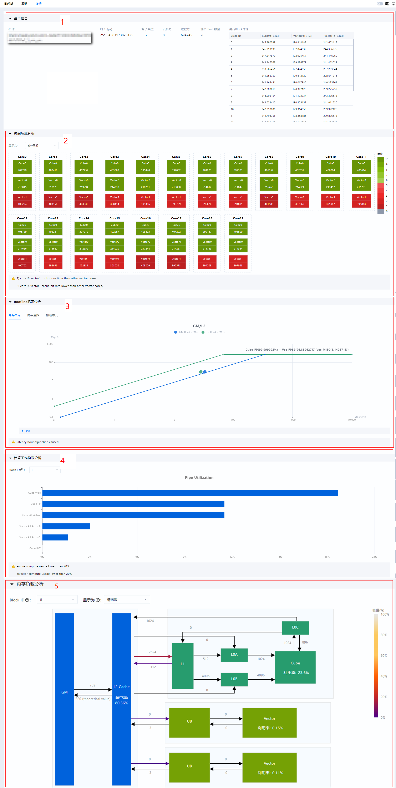
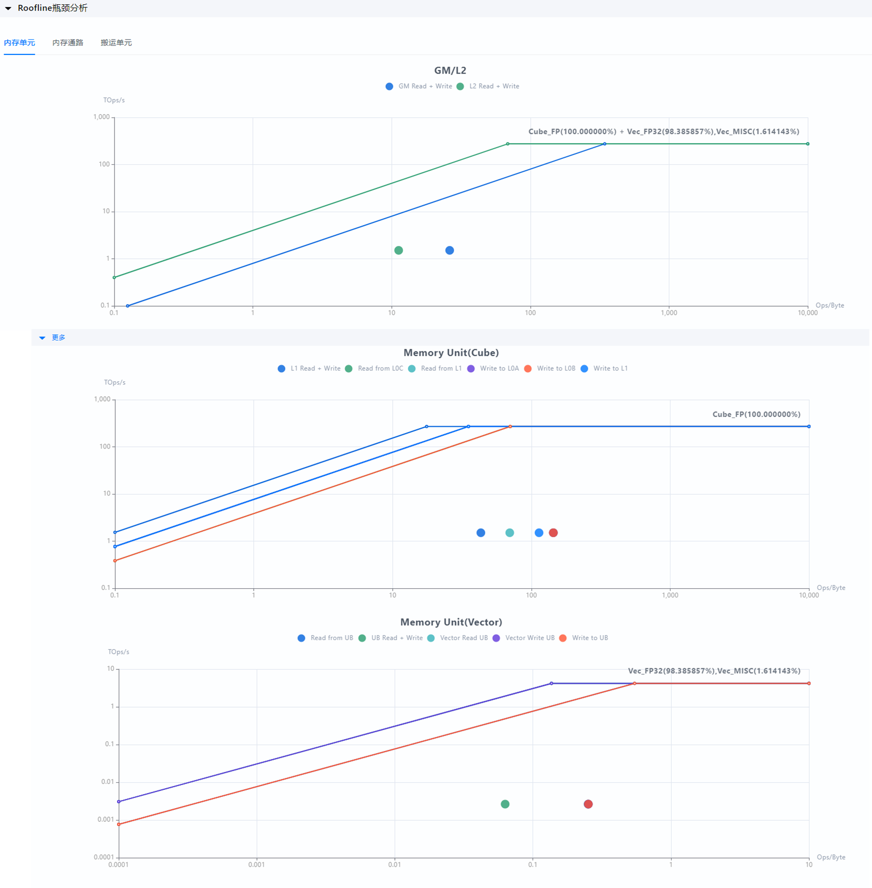
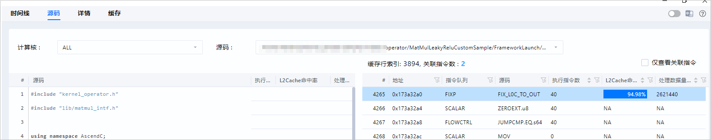
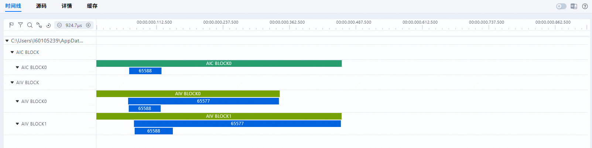
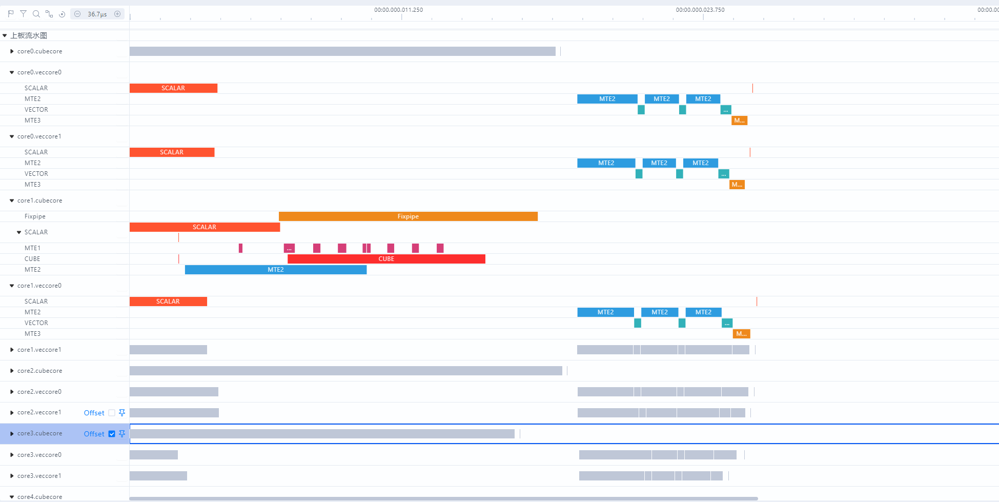
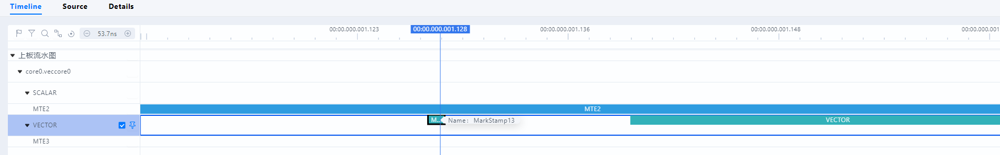

# **msOpProf Mode User Guide**

## Overview

MindStudio Ops Profiler (msOpProf, an operator tuning tool) is used to collect and analyze the key performance metrics of operators running on AI Processors. Based on the output profile data, you can quickly locate the hardware and software performance bottlenecks of operators, improving the efficiency of operator performance analysis.

Currently, profile data for different file formats (executable files or operator binary .o files) can be collected and automatically parsed in on-board (msOpProf) and simulator (msOpProf simulator) modes.

This document describes how to use the msOpProf mode.

**Features**

msOpProf demonstrates single-operator tuning capabilities such as the computing memory heatmap, Roofline bottleneck analysis chart, cache heatmap, communication and computing pipeline chart (for MC2 operators), pipeline chart, operator code hot spot map, and profile data files through MindStudio Insight. For details, see [**Table 1** msOpProf mode features](#msopprof-mode-features).

**Table 1** msOpProf mode features <a id="msopprof-mode-features"></a>

|Function|Link|
|---|---|
|Computing memory heatmap|[Computing Memory Heatmap](#computing-memory-heatmap)|
|Roofline Bottleneck Analysis Chart|[Roofline Bottleneck Analysis Chart](#roofline-bottleneck-analysis-chart)|
|Cache Heatmap|[Cache Heatmap](#cache-heatmap)|
|Communication and Computing Pipeline Chart|[Communication and Computing Pipeline Chart](#communication-and-computing-pipeline-chart)|
|Pipeline Chart|[Pipeline Chart](#pipeline-chart)|
|Operator Code Hot Spot Map|[Operator Code Hot Spot Map](#operator-code-hot-spot-map)|
|Profile data files|[msopprof Profile Data](./msopprof_performance_data.md)|

**Scenarios**

The following scenarios are supported. For details, see [Collecting Performance Data of Ascend C Operators](../best_practices/typical_cases.md#collecting-profile-data-of-ascend-c-operators) and [Collecting Performance Data of MC2 Operators](../best_practices/typical_cases.md#collecting-profile-data-of-mc2-operators).

- Kernel launch operator development: kernel launch

    - In the kernel launch scenario, for details, see [Kernel Launch Operator Development](<>) in the *Ascend C Operator Development Guide*.
    - In the kernel launch scenario, configure the [prerequisites](#preparations) and then run the following command:

        ```shell
        msprof op ./main  # main indicates the name of the user operator program, including the program name of the operator to be tuned.
        ```

- Project-based operator development: single-operator API calling

    - In the single-operator API execution scenario, see the **Project-based Operator Development** > [Single-Operator API Execution](<>) in the *Ascend C Operator Development Guide*.
    - In the single-operator API calling scenario, configure the [prerequisites](#preparations) and then run the following command:

        ```shell
        msprof op ./main  # main indicates the name of the user operator program, including the program name of the operator to be tuned.
        ```

- AI framework operator adaptation: PyTorch framework

    - When msOpProf is used for simulated tuning of the operators in the PyTorch script on <term>Atlas inference products</term>, only the Kernels-based operator package calling mode is supported. Refer to the content related to Kernels operator package installation in the [Installing CANN](<>) of the *CANN Software Installation Guide*. Install the binary Kernels operator package, and modify the script entry file (such as `main.py`) by adding the bold information below `import torch_npu` to ensure that the operators in the Kernels operator package are used.

        ```python
        import torch
        import torch_npu
        torch_npu.npu.set_compile_mode(jit_compile=False)
        ......
        ```

    - In the single-operator calling scenario through the PyTorch framework, for details, see the OpPlugin in [Ascend-developed Plugins](<>) of the *Ascend Extension for PyTorch Suite and Third-party Library Support List*.
    - When the PyTorch framework is used to call a single-operator, configure the [prerequisites](#preparations) and then run the following command:

        ```shell
        msprof op python a.py  # a.py indicates the name of the user operator program, including the program name of the operator to be tuned.
        ```

- Triton operator development: Triton operator calling

    - Install and configure Triton and the Triton-Ascend plug-in. For details, see [Triton Ascend](https://gitcode.com/Ascend/triton-ascend/blob/main/README.md).
    - The Triton operator calling scenario does not apply to <term>Atlas inference products</term>.

## Preparations

**Environment Preparation**

- Configure related environment variables by referring to the MindStudio Ops Profiler Installation Guide (see../install_guide/msopprof_install_guide.md).

- To use MindStudio Insight for viewing, install the MindStudio Insight software package separately. For download links, see the [MindStudio Insight Installation Guide](https://gitcode.com/Ascend/msinsight/blob/master/docs/en/user_guide/mindstudio_insight_install_guide.md).

**Constraints**

- You are advised to collect profile data within 5 minutes and ensure that the set memory size is greater than 20 GB (for example, container configuration `docker run --memory=20g container_name`).
- Ensure that the profile data is stored in the current user directory that does not contain soft links. Otherwise, security issues may occur.

## Precautions

- msOpProf depends on the msOpProf executable file in the CANN package. The API usage in this file is the same as that in msOpProf. This file is provided by the CANN package and does not need to be installed separately.
- After you press `CTRL+C`, the operator execution stops, and the tool generates a profile data file based on existing information. If you do not need to generate the file, press `Ctrl+C` again.
- If the `--output` option is not specified, ensure that other users do not have the write permission on the upper-level directory of the current path.
- Before using msOpProf, ensure that the application functions properly.
- Do not initiate more than one profile data collection task on the same device.
- You need to ensure the execution security of executable files or applications.
    - You are advised to restrict the operation permission on executable files or applications to avoid privilege escalation risks.
    - Avoid high-risk operations (such as deleting files, deleting directories, changing passwords, and running privilege escalation commands) to prevent security risks.

## Command Reference

Log in to the operating environment and run the `msprof op optional parameter app [arguments]` command. For details about the optional parameters, see **Table 1** Optional parameters of msOpProf (#Optional parameters of msOpProf). An example command is as follows:

```shell
msprof op --output=$HOME/projects/output $HOME/projects/MyApp/out/main blockdim 1    # "--output" is an optional parameter, "$HOME/projects/MyApp/out/main" is the application, and "blockdim 1" is an optional parameter of the application.
```

**Table 1** msOpProf Optional Parameters<a id="msopprof-optional-parameters"></a>

|Option|Description|Mandatory or Not (Y/N)|
|------|-------|-------|
|--application|You are advised to use `msprof op [msOpProf parameters] ./app` for launching, where `app` is the specified executable file. If no path is specified for app, the current path is used by default.<br>When using `./app`, add msOpProf parameters before.`/app` to ensure that the related functions take effect.<br>Currently, this command is compatible with `./app [arguments]`. In the future, it will be changed to `./app [arguments]`.|Yes. Select either the specified executable file or **--config**.|
|--config|Specifies the absolute or relative path of the binary file `*.o` generated after operator compilation. For details, see [JSON Configuration File Description](./extended_functions.md#json-configuration-file-description).<br>Before operator tuning, you can obtain the operator binary *.o file in either of the following ways: <ul><li>Refer to **Kernel Launch Operator Development** > [Kernel Launch](https://www.hiascend.com/document/detail/zh/canncommercial/850/opdevg/Ascendcopdevg/atlas_ascendc_10_0056.html) in the Ascend C Operator Development Guide to modify and execute the one-click compilation and execution script. Obtain the NPU executable file, and then manually extract the *.o file from it. </li><li>Refer to [Operator Compilation and Deployment](https://gitcode.com/Ascend/msopgen/blob/master/docs/zh/user_guide/msopgen_user_guide.md#%E7%AE%97%E5%AD%90%E7%BC%96%E8%AF%91%E9%83%A8%E7%BD%B2). The *.o file is automatically generated during operator compilation. </li></ul>Ensure that users in the group and other groups do not have the write permission on the JSON file specified by `--config` and its parent directory. In addition, ensure that the owner of the parent directory of the JSON file is the current user.|Yes. Choose one of the specified executable file or `--config`.|
|--kernel-name|This option specifies the name of the operator whose data is to be collected. Fuzzy match using the operator name prefix is supported. If this parameter is not specified, only data of the first operator scheduled during program running is collected.<br>Note:<li>This option must be used with `--application`. The value can contain a maximum of 1,024 characters, restricted to **letters, digits, and underscores (_)**. </li><li>If multiple operators need to be collected, you can use the vertical bar (\|) to combine them. For example, --kernel-name="add\|abs" indicates that the operators whose prefix names are add and abs are collected. The number of operators collected is determined by the value of <code>--launch-count</code>. </li><li>Wildcards (<code>*</code>) can be used match strings of any length.</li>|No|
|--launch-count|Sets the maximum number of operators that can be collected. The default value is 1, and the value is an integer ranging from 1 to 5000.|No|
|--launch-skip-before-match|Sets the number of operators for which data does not need to be collected. Collection starts only after the specified number of operators, starting from the first operator.<br>Note: <ul><li>The counter increases regardless of whether `--launch-skip-before-match` matches the operator specified in `kernel-name`, and the operator data is not collected. </li><li>The value is an integer ranging from 0 to 1000.</li></ul>|No|
|--aic-metrics|Enables collection of operator performance metrics. <ul><li>Enables the capability of collecting one or more operator performance metrics (ArithmeticUtilization, L2Cache, Memory, MemoryL0, MemoryUB, PipeUtilization, ResourceConflictRatio, and Default). If multiple metrics are selected, separate them with commas (,), for example, `--aic-metrics=Memory,MemoryL0`. </li><li>`Default` is enabled by default, collecting metrics `ArithmeticUtilization`, `L2Cache`, `Memory`, `MemoryL0`, `MemoryUB`, `PipeUtilization`, and `ResourceConflictRatio`. For example, `--aic-metrics=Default`. </li><li>Enables the collection of metrics within a specified code segment on the operator kernel (<code>KernelScale</code>).<br>`KernelScale` can be used to tune specified code segments on the operator kernel side. You need to configure --aic-metrics=KernelScale first, and then select one or more operator performance metrics. If multiple metrics are selected, separate them with commas (,), for example, `--aic-metrics=KernelScale,Memory,MemoryL0`.<br>By default, all operator performance metrics are selected for collection, for example, `--aic-metrics=KernelScale`.<br>When specifying a code segment, you need to set it before and after the corresponding code segment on the operator kernel side. For details, see [MetricsProfStart](<>) and [MetricsProfStop](<>) in the "Operator Debugging APIs" section of the *Ascend C Operator Development API*.<br>This function is supported only by Atlas A3 training/inference products, Atlas A2 training/inference products, and Ascend 950 products. </li><li>`Roofline`: enables generation of Roofline bottleneck analysis charts and visualization via MindStudio Insight, for example, `--aic-metrics=Roofline`. For details, see [Roofline Bottleneck Analysis Chart](#roofline-bottleneck-analysis-chart). `Roofline` is bound with `Default`. Enabling `Roofline` simultaneously enables `Roofline` and `Default` modes. </li><li>TimelineDetail: enables the generation of the instruction pipeline chart and operator code hotspot chart for visualized display, for example, `--aic-metrics=TimelineDetail`. For details, see [Instruction Pipeline Chart](./msopprof_simulator_user_guide.md#instruction-pipeline-chart) and [Operator Code Hot Spot Map](#operator-code-hot-spot-map).<br>To enable this function, see [Preparations](#preparations).<br>This function is supported only by Atlas A2 training/inference products and Atlas A3 training/inference products.<br>This function supports only the third-party (Python) framework operator call scenario where PyTorch framework and single-operator APIs are used to call operators internally.<br>This function does not support collection of level-2 pointer operators, Triton operators, and communication-compute fusion operators. It cannot be enabled together with **--replay-mode=application/range**.<br>To generate a CSV file or display the [computing memory heatmap](#computing-memory-heatmap), enable Default when launching the operator, for example: `msprof op --aic-metrics=TimelineDetail,Default`.</li><li>`PipeTimeline`: After the operator is tuned, the generated trace.json and visualize_data.bin files can be visualized via MindStudio Insight to intuitively see the running status of each Pipe of the operator and help developers identify operator bottlenecks. For example, `--aic-metrics=PipeTimeline`. For details, see [Pipeline Chat](#pipeline-chart).<br>This function is supported only by Ascend 950 products. </li><li>Occupancy: enables the generation of inter-core load analysis charts and visualizes the charts using MindStudio Insight, for example, `--aic-metrics=Occupancy`. For details, see [core occupancy view](#computing-memory-heatmap).<br>Comparisons are made between physical cores based on time consumption, data throughput, and cache hit rate. If the difference between the maximum and minimum values is greater than 10%, the load is unbalanced, and the CLI will provide tuning suggestions.<br>This function is supported only by Atlas A3 training/inference products, Atlas A2 training/inference products, and Ascend 950 products. </li><li>MemoryDetail: for example, `--aic-metrics=MemoryDetail`. </li><ul><li>After this function is enabled, L2 cache-related functions (the L2 cache-L0A/L0B connection in the [compute workload analysis chart](#computing-memory-heatmap), and L2 cache hit rate and GM-related data transfer volume in the [cache heatmap](#cache-heatmap) and [operator code hot spot map](#operator-code-hot-spot-map)) are enabled. </li></ul><ul><li>When MemoryDetail is enabled, the active bandwidth of MTE1 and MTE2 in the Cube unit on the AI Core is displayed in the memory workload analysis chart. If MemoryDetail fails, the corresponding fields in the memory load analysis chart are displayed as NA, and aic_mte1_active_bw(GB/s) and aic_mte2_active_bw(GB/s) are not displayed in PipeUtilization (execution time and ratios of compute units and MTEs).<br>This function cannot be enabled together with `--replay-mode=range`.<br>`MemoryDetail` is bound with `Default`. Enabling `MemoryDetail` simultaneously enables `MemoryDetail` and `Default` modes.<br>This function is supported only by Atlas A2 training/inference products and Atlas A3 training/inference products. </li></ul><li>BasicInfo: enables the basic information collection. Only the basic information of the operators flushed to the drive is collected, for example, `--aic-metrics=BasicInfo`. For details, see [OpBasicInfo (Basic Operator Information)](./msopprof_performance_data.md#opbasicinfo-basic-operator-information). </li><li><code>Source</code>: enables the operator code hot spot map, for example, <code>--aic-metrics=Source</code>. For details, see [Operator code hot spot map](#operator-code-hot-spot-map).<br>To view the code call stack, add the `-g` compilation option when compiling operators. For details, see [Adding the -g Compilation Option](#preparations).<br>This function cannot be enabled together with `--replay-mode=range`.<br>Only <term>Atlas A3 training products, Atlas A3 inference products</term>, <term>Atlas A2 training products, Atlas A2 inference products</term>, and <term>Ascend 950 products</term> support this function. </li><li><code>PcSampling</code>: displays stall information of SIMT operators running on the board. Example: `--aic-metrics=PcSampling`. For details, see [Operator code hot spot map](#operator-code-hot-spot-map).<br>This function is supported only by <term>Ascend 950 products</term>.</li></ul>|No|
|--kill|The value can be `on` or `off`. The default value is `off`, indicating that the function is disabled.<br>If `--kill=on` is set to enable this function, the user program will automatically stop after the number of operators set by `--launch-count` is collected.<br>Notes:<br>After `--kill=on` is configured, error logs may occur due to the early termination of the user program. You need to evaluate whether to use this function. </li><li>For a multi-process program, the <code>--kill</code> parameter configuration takes effect only for subprocesses. </li><li>Using this parameter prevents the last executed communication-compute fusion operator from properly obtaining the API call pipeline. For details, see [Communication and Computing Pipeline Chart](#communication-and-computing-pipeline-chart). </li><li>You are not advised to enable this function together with `--replay-mode=range`. Otherwise, the collected operator data may be missing.</li></ul>|No|
|--mstx|Determines whether the operator tuning tool enables the mstx APIs used in the user code program.<br>The default value is `off`, indicating that the mstx APIs are disabled.<br>When `--mstx=on` is set, the operator tuning tool enables the mstx API used in the user program. The following is an example: `msprof op --mstx=on ./add_custom`<br>Note: <ul><li>Currently, the mstxRangeStartA and mstxRangeEnd APIs in the mstx API are supported. These APIs are used to enable the specified range for operator tuning. For details about the parameters, see the [mstxRangeStartA](https://gitcode.com/Ascend/mstx/blob/master/docs/zh/api_reference/Common/mstxRangeStartA.md) and [mstxRangeEnd](https://gitcode.com/Ascend/mstx/blob/master/docs/zh/api_reference/Common/mstxRangeEnd.md) APIs in the MindStudio mstx API Reference. </li><li>When used with `--replay-mode=range`, the mstxRangeStartA and mstxRangeEnd APIs must be called in pairs and cannot be called in a cross manner. The operators contained in each pair of mstx APIs form a replay range. The streams of the operators in the replay range cannot be changed. In addition, the number of operators that can be collected is limited by the number of operator block dims in [OpBasicInfo (Basic Operator Information)](./msopprof_performance_data.md#opbasicinfo-basic-operator-information) (it is recommended that the number be less than or equal to 50).</li></ul>|No|
|--mstx-include|Enables the specified mstx APIs when mstx APIs are enabled in the operator tuning tool.<br>If this parameter is not set, all mstx APIs used in user code are enabled by default.<br>If this parameter is set, only the specified mstx APIs are enabled. The input of --mstx-include is the message string transferred when the user calls the mstx function. Multiple strings are concatenated using "\|" For example, `--mstx=on --mstx-include="hello\|hi" // Only the mstx APIs whose message parameters in the mstx function are hello and hi are enabled.`<br>Note: <ul><li>This parameter must be used with `--mstx`. </li><li>Only the characters A-Z, a-z, 0-9, and _ are supported. Use "\|" to concatenate them.</li></ul>|No|
|--replay-mode|Replay mode for operator data collection. Options include `kernel`, `application`, and `range`. The default value is `kernel`. If set to `application`, the entire application is replayed multiple times.<br>In `application` mode, separately enabling some `aic-metrics` may lead to missing data in the `visualize_data.bin` file. To view complete `visualize_data.bin` data, you are advised to add `Default` to `--aic-metrics`. </li><li>If the value set to <code>kernel</code>, the kernel function of a single operator within the specified collection range is replayed multiple times. </li><li>If the value is set to <code>range</code>, multiple operators within the specified range are replayed multiple times as a whole. Multiple ranges can be specified, and ranges are independent of each other. </li>Note: <li>`application` mode is not supported in multi-device multi-operator scenarios. </li><li>Range-level replay must be used together with `--mstx=on` and is applicable only to the Atlas A3 training products, Atlas A3 inference products, Atlas A2 training products, and Atlas A2 inference products. </li><li>Range-level replay does not support collection of MC2 and LCCL operators and cannot be enabled together with <code>--kill=on</code>, <code>--aic-metrics=MemoryDetail</code>, <code>--aic-metrics=TimelineDetail</code>, and <code>--aic-metrics=Source</code>.</li></ul>|No|
|--warm-up|When some operators are collected using msOpProf, they may fail to reach the minimum task time consumption for processor frequency increasing, resulting in frequency reduction, which affects the results. In this case, you can use **`--warm-up`** to specify the number of warm-up times to increase the running frequency of the AI Processor in advance, so that the data on the board is more accurate.<br>Note: <ul><li>The default value is 5, and the value range is [0, 500]. </li><li>This parameter does not take effect for the MC2 operator. </li><li>When range-level replay is enabled, the number of warm-up times must be at least 1 and cannot be set to `--warm-up=0`.</li></ul>|No|
|--output|Path for storing the collected profile data. By default, the profile data is stored in the current directory.<br>Ensure that users in the group and other groups do not have the write permission on the parent directory of the path specified by `--output`. In addition, ensure that the owner of the parent directory of the directory specified by **--output** is the current user.|No|
|--dump|Specifies whether to generate the dump file of the simulator.<br>The value can be `on` or `off`. The default value is `off`, indicating that the simulator dump file is not generated.<br>Note: <ul><li>This parameter is valid only when `--aic-metrics=TimelineDetail` is used. It takes effect only for Atlas A2 training/inference products and Atlas A3 training/inference products. It does not take effect for Atlas inference products. </li><li>This parameter applies only to the single-process scenario and does not support the scenario where two operators run at the same time.</li></ul>|No|
|--core-id|This parameter is used when the operators are evenly distributed. You can use `--core-id` to specify the IDs of some logical cores to parse their simulation data.<br>The core ID range is [0, 49].<br>Note: <ul><li>If you want to parse the simulation data of multiple cores, use the symbol "\|" to combine the core IDs. For example, --core-id="0\|31" indicates that the simulation data of cores 0 and 31 is parsed. </li><li>This parameter is valid only when the `--aic-metrics=TimelineDetail` option is used. It is valid only for the [instruction pipeline chart](./msopprof_simulator_user_guide.md#instruction-pipeline-chart) and operator code hotspot diagram (#operator code hotspot diagram). This parameter is applicable only to the Atlas A2 training series products/Atlas A2 inference series products and Atlas A3 training series products/Atlas A3 inference series products.</li></ul>|No|
|-h, --help|Outputs help information.|No|

## Tool Usage

msOpProf assists in identifying exceptions in the operator memory, code, and instructions, enabling comprehensive operator tuning. For details, see [**Table 1** msOpProf functions](#msopprof-functions).

**Table 1** msOpProf functions<a id="msopprof-functions"></a>

|Application Scenario|Usage|Displayed Graphs|
|---|---|---|
|It is suitable for performance analysis in the actual operating environment and allows users to locate operator memory and performance bottlenecks.|It analyzes running operators without additional configuration, which is suitable for quickly locating operator performance issues in the board environment.|[Computing Memory Heatmap](#computing-memory-heatmap)<br> [Roofline Bottleneck Analysis Chart](#roofline-bottleneck-analysis-chart)<br> [Cache Heatmap](#cache-heatmap)<br> [Communication and Computing Pipeline Chart](#communication-and-computing-pipeline-chart)<br> [Pipeline Chart](#pipeline-chart)<br> [Operator Code Hot Spot Map](#operator-code-hot-spot-map)|

**msOpProf segment-based tuning principles**

1. Use the `--launch-skip-before-match` command to filter the operator tuning range. The filtering principles are as follows:<a id="1"></a>

    - If `--launch-skip-before-match` is configured, collection starts only after the specified number of operators, starting from the first operator.
    - If no range is configured, no filtering is performed.

2. Based on [1](#1), use the `--mstx` command to filter the operator tuning range. The filtering principles are as follows:<a id="2"></a>
    - If `--mstx` is configured, only operators within the range enabled by the `mstxRangeStartA` and `mstxRangeEnd` interfaces are collected.
    - If no range is configured, no filtering is performed.

3. Based on [2](#2), use the `--kernel-name` command to filter the operator tuning range. The filtering principles are as follows:<a id="3"></a>
    - If `--kernel-name` is configured, only operators within the `--kernel-name` range are collected.
    - If `--kernel-name` is not configured, only the first operator scheduled during program execution is collected.

4. Based on [3](#3), use the `--aic-metrics` command to filter the operator tuning data collection items. The filtering principles are as follows:<a id="4"></a>
    - If `--aic-metrics` is configured, select the collection items for operator performance metrics.
    - If `--aic-metrics` is not configured, operator performance metrics in the Default section are collected by default. Performance metrics in the KernelScale, TimelineDetail, Roofline, and Occupancy sections cannot be collected.

5. Through layer-by-layer filtering from [1](#1) to [4](#4), you can obtain the actual number of tuned operators and the collection range of performance metrics.
6. With `--kill=on`, compare the actual number of tuned operators with the value of `--launch-count` to determine whether to automatically stop the program.<br>If the number of tuned operators is less than or equal to the value of `--launch-count`, go to the next step. Otherwise, the program automatically stops when the number of tuned operators reaches the value specified by `--launch-count`.

**msOpProf configuration**

To implement the [cache heatmap jump](#cache-heatmap) function, perform the following operations:

1. Add the `-g` compilation option when compiling operators. For details, see [Adding the `-g` to compilation option](./msopprof_simulator_user_guide.md#usage).
2. Enable the `Source` option for the `--aic-metrics` parameter.

**Starting the tool**

> [!NOTE]NOTE  
> Currently, msOpProf does not support the `-O0` compilation option.

1. Log in to the operating environment and run the `msprof op optional parameter app [arguments]` command to enable operator tuning on the board. For details about the optional parameters, see [Command Reference](#command-reference). An example command is as follows:

    ```shell
    msprof op --output=$HOME/projects/output $HOME/projects/MyApp/out/main    # --output is an optional parameter. $HOME/projects/MyApp/out/main is the application used.
    ```

2. Perform operator tuning in either of the following ways:
    - Based on an executable file
        - Single-operator scenario (using `test` as an example)
            > [!NOTE]NOTE  
            > The executable file name `test` in the example is for reference only. The actual name is subject to the executable file generated during compilation in the current project.

            Example 1:

            ```shell
            msprof op ./test
            ```

            Example 2:

            ```shell
            msprof op --aic-metrics=<select_metrics> --output=./output_data ./test 
            ```

        - Multi-operator scenario

            If the `test` executable contains `Add`, `MatMul`, and `Sub` operators, you can use `--launch-count` and `--kernel-name` to specify collecting data for the `Add` and `Sub` operators only.

            ```shell
            msprof op --launch-count=10 --kernel-name="Add|Sub" --output=./output_data ./test    # "./test" is the user binary file and should be placed at the end of the command.
            ```

    - Based on the .json configuration file the input operator binary file *.o. For details, see [JSON Configuration File Description](./extended_functions.md#json-configuration-file-description).

        ```shell
        msprof op --config=./add_test.json --aic-metrics=<select_metrics> --output=./output_data
        ```

3. After the command is executed, a folder named `OPPROF_{timestamp}_XXX` is generated in the default path or the specified `--output` directory. When all `--aic-metrics` are enabled, the structure is as follows:

    - Collecting data in the multi-device multi-operator scenario

        > [!NOTE]NOTE  
        > When tuning MC2 or LCCL operators in multi-device parallel mode, several subdirectories named after device IDs will exist in the result directory, depending on the specified number of NPUs. The tuning results of each NPU are stored in the corresponding device ID directory.

        ```tex
        └──OPPROF_{timestamp}_XXX
        ├── device0                  // ID of the AI processor used during running.
        └── device1                
          ├── OpName0                  // Name of the operator collected.
          │ ├── 0                     // Sequence in which operators are scheduled.
          │ │ ├──dump                // Folder for storing the process files. The meaning of this parameter is the same as that in single-operator collection.
           │ │ └──xxx_yyy.csv        // xxx is the metric type name, for example, L2Cache. For metric types, see Table 2. yyy is the time sequence suffix, for example, L2Cache_20240603022812284.csv
          │ │ └──visualize_data.bin 
          ├── OpName1               
          │ ├── 0
          │ │ ├──dump 
          │ │ └──xxx_yyy.csv
          │ │ └──visualize_data.bin 
           ├── OpName2         
          │ ├── 0
          │ │ ├── dump  
          │ │ └── xxx_yyy.csv
          │ │ └──visualize_data.bin 
          │ │ └── trace.json         // Applicable only to MC2 and LCCL operators. 
        ```

    - Collecting data in the single-device multi-operator scenario

        ```tex
        └──OPPROF_{timestamp}_XXX
        ├── OpName0                  // Name of the operator collected.
        │ ├── 0                     // Sequence in which operators are scheduled.
        │ │ ├── dump                // Folder for storing the process files. The meaning of this parameter is the same as that in single-operator collection.
        │ │ └── xxx_yyy.csv          // xxx is the metric type name, for example, L2Cache. For metric types, see Table 2. yyy is the time sequence suffix, for example, L2Cache_20240603022812284.csv
        │ │ └──visualize_data.bin 
        │ ├── 1
        │ │ ├──dump 
        │ │ └──xxx_yyy.csv
        │ │ └──visualize_data.bin 
        ├── OpName1         
        │ ├── 0
        │ │ ├── dump  
        │ │ └── xxx_yyy.csv
        │ │ └── visualize_data.bin 
        ```

    - Collecting data in the single-device single-operator scenario

        ```tex
        OPPROF_{timestamp}_XXX
        ├── dump
        ├── ArithmeticUtilization.csv
        ├── L2Cache.csv
        ├── Memory.csv
        ├── MemoryL0.csv
        ├── MemoryUB.csv
        ├── OpBasicInfo.csv
        ├── PipeUtilization.csv
        ├── ResourceConflictRatio.csv
        ├── visualize_data.bin 
        ```

    **Table 2** msOpProf mode files

    |Name|Description|
    |---|---|
    |dump|Raw profile data, which does not require attention.|
    |ArithmeticUtilization.csv|Execution time and ratios of cube and vector instructions. See [ArithmeticUtilization (Execution Time and Ratios of Cube and Vector Instructions)](./msopprof_performance_data.md#arithmeticutilization-execution-time-and-ratios-of-cube-and-vector-instructions).|
    |L2Cache.csv|L2 Cache hit rate. See [L2Cache (L2 Cache Hit Rate)](./msopprof_performance_data.md#l2cache-l2-cache-hit-rate).|
    |Memory.csv|UB/L1/L2/main memory read/write bandwidth rate. See [Memory (Memory Read/Write Bandwidth Rate)](./msopprof_performance_data.md#memory-memory-readwrite-bandwidth-rate).|
    |MemoryL0.csv|L0A/L0B/L0C read/write bandwidth rate. See [MemoryL0 (L0 Read/Write Bandwidth Rate)](./msopprof_performance_data.md#memoryl0-l0-readwrite-bandwidth-rate).|
    |MemoryUB.csv|MTE/vector/scalar UB read/write bandwidth rate. See [MemoryUB (UB Read/Write Bandwidth Rate)](./msopprof_performance_data.md#memoryub-ub-readwrite-bandwidth-rate).|
    |PipeUtilization.csv|Execution time and ratios of compute units and MTEs. See [PipeUtilization (Execution Time and Ratios of Compute Units and MTEs)](./msopprof_performance_data.md#pipeutilization-execution-time-and-ratios-of-compute-units-and-mtes).|
    |ResourceConflictRatio.csv|Ratio of bank group conflict, bank conflict, and resource conflict on UB in all instructions. See [ResourceConflictRatio (Resource Conflict Ratio)](./msopprof_performance_data.md#resourceconflictratio-resource-conflict-ratio).|
    |OpBasicInfo.csv|Basic operator information, including operator name, block dim, and time consumption. See [OpBasicInfo (Basic Operator Information)](./msopprof_performance_data.md#opbasicinfo-basic-operator-information).|
    |visualize_data.bin|Visualized file that displays basic operator information, computing unit load, hot spot functions, and Roofline bottleneck analysis.|
    |trace.json|Visualized MC2 pipeline file.|

    > [!NOTE]NOTE
    > 
    > - visualize_data.bin can be visualized using MindStudio Insight. For details, see [MindStudio Insight Operator Tuning](https://gitcode.com/Ascend/msinsight/blob/master/docs/en/user_guide/operator_tuning.md).
    > - The hot spot function function of msOpProf is supported only by <term>Atlas A2 training products and Atlas A2 inference products</term>.
    > - Currently, [communication and computing pipeline chart](#communication-and-computing-pipeline-chart) can be generated only for MC2 and LCCL operators.
    > - [Cache heatmaps](#cache-heatmap) or [operator code hot spot maps](#operator-code-hot-spot-map) cannot be generated for MC2 or LCCL operators or for <term>Atlas inference products</term>
    > - The unit is GB/s, indicating that 1 GB data is transmitted per second.

4. After the `visualize_data.bin` file is imported into MindStudio Insight, [Computing memory heatmap](#computing-memory-heatmap), [Roofline bottleneck analysis chart](#roofline-bottleneck-analysis-chart), [Cache heatmap](#cache-heatmap), [communication and computing pipeline chart](#communication-and-computing-pipeline-chart), and [Operator code hot spot map](#operator-code-hot-spot-map) are displayed.
5. After the `trace.json` file is imported into the Chrome browser or MindStudio Insight, the [communication and computing pipeline chart](#communication-and-computing-pipeline-chart) is displayed.

## Computing Memory Heatmap

### Function Description

Visualizes the `visualize_data.bin` file generated in msOpProf. The page presents basic operator information, computing workload analysis data, and memory workload analysis data by resource, allowing developers to identify resource bottlenecks from a comprehensive perspective.

For details about MindStudio Insight operations, see the [Details](https://gitcode.com/Ascend/msinsight/blob/master/docs/en/user_guide/operator_tuning.md#%E8%AF%A6%E6%83%85%EF%BC%88details%EF%BC%89) section in *MindStudio Insight Operator Tuning*.

### Usage Description

The following shows the MindStudio Insight page of the `visualize_data.bin` file.

**Figure 1** Details page 1 


- Core Occupancy displays the time consumption, total data throughput, and cache hit ratio of each physical core in a data pane, allowing developers to improve the usage efficiency of physical cores.

    > [!NOTE]NOTE
    > 
    > - Only <term>Atlas A3 training products, Atlas A3 inference products</term>, <term>Atlas A2 training products, Atlas A2 inference products</term>, and <term>Ascend 950 products</term> support this function.
    > - The number of cores displayed depends on the hardware.

- Roofline bottleneck analysis chart. For details, see [Roofline Bottleneck Analysis Chart](#roofline Bottleneck Analysis Chart).
- Compute Workload Analysis displays computing workload data in bar charts and data tables, helping developers analyze whether Cube/Vector computing resources are fully utilized.
- Memory workload analysis displays the active bandwidth of each MTE channel. (If MemoryDetail is not enabled, the active bandwidth of MTE1 and MTE2 channels on the Cube is not displayed.) The memory heatmap and data pane display the number of requests, transfer bandwidth, and usage of each channel. This helps developers analyze channels that may have bottlenecks.

    > [!NOTE]NOTE
    > 
    > - The content displayed in data panes varies depending on the operator type.
    > - The active bandwidth value function does not apply to <term>Atlas inference products</term>.
    > - <term>Atlas A3 training products or Atlas A3 inference products</term> does not support peak value (maximum bandwidth ratio) display.
    > - For <term>Ascend 950 products</term>, data display for UB read/write VEC units is currently not supported for operators containing the SIMD architecture.

## Roofline Bottleneck Analysis Chart

### Function Description

Visualizes the `visualize_data.bin` file generated in msOpProf. The roofline bottleneck analysis chart can be used to build a processor performance model. A Roofline bottleneck analysis chart can be used to build a processor performance model, which can be used to quickly evaluate the theoretical performance limit of an operator, allowing developers to quickly identify bottlenecks.

For details about MindStudio Insight operations, see the [Details](https://gitcode.com/Ascend/msinsight/blob/master/docs/en/user_guide/operator_tuning.md#%E8%AF%A6%E6%83%85%EF%BC%88details%EF%BC%89) section in *MindStudio Insight Operator Tuning*.

### Usage Description

**Page introduction**

The generated `visualize_data.bin` file can be visualized using MindStudio Insight. Different Roofline analysis charts are generated for different hardware and operator types.

- The Roofline bottleneck analysis chart of <term>Atlas inference products</term> contains only the memory unit view.

    **Figure 1** Roofline bottleneck analysis chart of <term>Atlas inference products</term> 
    

- For <term>Atlas A3 training products, Atlas A3 inference products</term>, <term>Atlas A2 training products, and Atlas A2 inference products</term>, different views are generated based on the operator type. For details, see [**Table 1** Roofline chart support for Atlas A3 training products, Atlas A3 inference products, Atlas A2 training products, and Atlas A2 inference products](#a2-a3-roofline-chart-support).

    **Figure 2** Roofline bottleneck analysis chart for <term>Atlas A3 training products, Atlas A3 inference products</term>, <term>Atlas A2 training products, and Atlas A2 inference products</term> 
    
    

    **Table 1** Roofline chart support for Atlas A3 training products, Atlas A3 inference products, Atlas A2 training products, and Atlas A2 inference products<a id="a2-a3-roofline-chart-support"></a>

    <table><thead align="left"><tr id="zh-cn_topic_0000002037945009_row1347917355615"><th class="cellrowborder" valign="top" width="24.97%" id="mcps1.2.5.1.1"><p id="zh-cn_topic_0000002037945009_p1447915351616">Roofline View Type</p>
    </th>
    <th class="cellrowborder" valign="top" width="23.54%" id="mcps1.2.5.1.2"><p id="zh-cn_topic_0000002037945009_p647910358615">Vector Operator</p>
    </th>
    <th class="cellrowborder" valign="top" width="26.490000000000002%" id="mcps1.2.5.1.3"><p id="zh-cn_topic_0000002037945009_p18491135615919">Cube Operator</p>
    </th>
    <th class="cellrowborder" valign="top" width="25%" id="mcps1.2.5.1.4"><p id="zh-cn_topic_0000002037945009_p24801335163">Mix Operator</p>
    </th>
    </tr>
    </thead>
    <tbody><tr id="zh-cn_topic_0000002037945009_row248016358610"><td class="cellrowborder" valign="top" width="24.97%" headers="mcps1.2.5.1.1 "><p id="zh-cn_topic_0000002037945009_p126391453776">GM/L2 chart</p>
    </td>
    <td class="cellrowborder" valign="top" width="23.54%" headers="mcps1.2.5.1.2 "><p id="zh-cn_topic_0000002037945009_p848012358611">√</p>
    </td>
    <td class="cellrowborder" valign="top" width="26.490000000000002%" headers="mcps1.2.5.1.3 "><p id="zh-cn_topic_0000002037945009_p13480035663">√</p>
    </td>
    <td class="cellrowborder" valign="top" width="25%" headers="mcps1.2.5.1.4 "><p id="zh-cn_topic_0000002037945009_p1913416816108">√</p>
    </td>
    </tr>
    <tr id="zh-cn_topic_0000002037945009_row6480735162"><td class="cellrowborder" valign="top" width="24.97%" headers="mcps1.2.5.1.1 "><p id="zh-cn_topic_0000002037945009_p449045611592">Vector memory unit view</p>
    </td>
    <td class="cellrowborder" valign="top" width="23.54%" headers="mcps1.2.5.1.2 "><p id="zh-cn_topic_0000002037945009_p44801335968">√</p>
    </td>
    <td class="cellrowborder" valign="top" width="26.490000000000002%" headers="mcps1.2.5.1.3 "><p id="zh-cn_topic_0000002037945009_p448016351617">-</p>
    </td>
    <td class="cellrowborder" valign="top" width="25%" headers="mcps1.2.5.1.4 "><p id="zh-cn_topic_0000002037945009_p2346141312108">√</p>
    </td>
    </tr>
    <tr id="zh-cn_topic_0000002037945009_row14480203520614"><td class="cellrowborder" valign="top" width="24.97%" headers="mcps1.2.5.1.1 "><p id="zh-cn_topic_0000002037945009_p1135801418814">Vector memory channel view</p>
    </td>
    <td class="cellrowborder" valign="top" width="23.54%" headers="mcps1.2.5.1.2 "><p id="zh-cn_topic_0000002037945009_p1248018351269">√</p>
    </td>
    <td class="cellrowborder" valign="top" width="26.490000000000002%" headers="mcps1.2.5.1.3 "><p id="zh-cn_topic_0000002037945009_p6480163515617">-</p>
    </td>
    <td class="cellrowborder" valign="top" width="25%" headers="mcps1.2.5.1.4 "><p id="zh-cn_topic_0000002037945009_p17481144100">√</p>
    </td>
    </tr>
    <tr id="zh-cn_topic_0000002037945009_row145071720980"><td class="cellrowborder" valign="top" width="24.97%" headers="mcps1.2.5.1.1 "><p id="zh-cn_topic_0000002037945009_p23042355814">Vector pipeline view</p>
    </td>
    <td class="cellrowborder" valign="top" width="23.54%" headers="mcps1.2.5.1.2 "><p id="zh-cn_topic_0000002037945009_p205081820887">√</p>
    </td>
    <td class="cellrowborder" valign="top" width="26.490000000000002%" headers="mcps1.2.5.1.3 "><p id="zh-cn_topic_0000002037945009_p350811201483">-</p>
    </td>
    <td class="cellrowborder" valign="top" width="25%" headers="mcps1.2.5.1.4 "><p id="zh-cn_topic_0000002037945009_p08312151104">√</p>
    </td>
    </tr>
    <tr id="zh-cn_topic_0000002037945009_row18508112018810"><td class="cellrowborder" valign="top" width="24.97%" headers="mcps1.2.5.1.1 "><p id="zh-cn_topic_0000002037945009_p636013402810">Cube memory unit view</p>
    </td>
    <td class="cellrowborder" valign="top" width="23.54%" headers="mcps1.2.5.1.2 "><p id="zh-cn_topic_0000002037945009_p155086202820">-</p>
    </td>
    <td class="cellrowborder" valign="top" width="26.490000000000002%" headers="mcps1.2.5.1.3 "><p id="zh-cn_topic_0000002037945009_p6508132014812">√</p>
    </td>
    <td class="cellrowborder" valign="top" width="25%" headers="mcps1.2.5.1.4 "><p id="zh-cn_topic_0000002037945009_p1913418871011">√</p>
    </td>
    </tr>
    <tr id="zh-cn_topic_0000002037945009_row175087201382"><td class="cellrowborder" valign="top" width="24.97%" headers="mcps1.2.5.1.1 "><p id="zh-cn_topic_0000002037945009_p1244016452081">Cube memory channel view</p>
    </td>
    <td class="cellrowborder" valign="top" width="23.54%" headers="mcps1.2.5.1.2 "><p id="zh-cn_topic_0000002037945009_p1550820201483">-</p>
    </td>
    <td class="cellrowborder" valign="top" width="26.490000000000002%" headers="mcps1.2.5.1.3 "><p id="zh-cn_topic_0000002037945009_p17508112010812">√</p>
    </td>
    <td class="cellrowborder" valign="top" width="25%" headers="mcps1.2.5.1.4 "><p id="zh-cn_topic_0000002037945009_p171340813107">√</p>
    </td>
    </tr>
    <tr id="zh-cn_topic_0000002037945009_row122665261188"><td class="cellrowborder" valign="top" width="24.97%" headers="mcps1.2.5.1.1 "><p id="zh-cn_topic_0000002037945009_p8147115019820">Cube pipeline view</p>
    </td>
    <td class="cellrowborder" valign="top" width="23.54%" headers="mcps1.2.5.1.2 "><p id="zh-cn_topic_0000002037945009_p102667261987">-</p>
    </td>
    <td class="cellrowborder" valign="top" width="26.490000000000002%" headers="mcps1.2.5.1.3 "><p id="zh-cn_topic_0000002037945009_p3266142618810">√</p>
    </td>
    <td class="cellrowborder" valign="top" width="25%" headers="mcps1.2.5.1.4 "><p id="zh-cn_topic_0000002037945009_p12135138201011">√</p>
    </td>
    </tr>
    </tbody>
    </table>

- For <term>Ascend 950 products</term>, different views are generated based on the operator type. For details, see [**Table 2** Roofline chart support for <term>Ascend 950 products</term>](#a5-roofline-chart-support).

    **Figure 3** Roofline bottleneck analysis chart for <term>Ascend 950 products</term> 
    
    

    **Table 2** Roofline chart support for <term>Ascend 520 products</term><a id="a5-roofline-chart-support"></a>

    <table><thead align="left"><tr id="zh-cn_topic_0000002037945009_row1660731475010"><th class="cellrowborder" valign="top" width="24.97%" id="mcps1.2.5.1.1"><p id="zh-cn_topic_0000002037945009_p1760741418509">Roofline View Type</p>
    </th>
    <th class="cellrowborder" valign="top" width="23.54%" id="mcps1.2.5.1.2"><p id="zh-cn_topic_0000002037945009_p186071414155020">Vector Operator</p>
    </th>
    <th class="cellrowborder" valign="top" width="26.490000000000002%" id="mcps1.2.5.1.3"><p id="zh-cn_topic_0000002037945009_p18607181418505">Cube Operator</p>
    </th>
    <th class="cellrowborder" valign="top" width="25%" id="mcps1.2.5.1.4"><p id="zh-cn_topic_0000002037945009_p16071014125010">Mix Operator</p>
    </th>
    </tr>
    </thead>
    <tbody><tr id="zh-cn_topic_0000002037945009_row0607151413505"><td class="cellrowborder" valign="top" width="24.97%" headers="mcps1.2.5.1.1 "><p id="zh-cn_topic_0000002037945009_p1860716146506">GM/L2 view</p>
    </td>
    <td class="cellrowborder" valign="top" width="23.54%" headers="mcps1.2.5.1.2 "><p id="zh-cn_topic_0000002037945009_p196071514125012">√</p>
    </td>
    <td class="cellrowborder" valign="top" width="26.490000000000002%" headers="mcps1.2.5.1.3 "><p id="zh-cn_topic_0000002037945009_p16607171413503">√</p>
    </td>
    <td class="cellrowborder" valign="top" width="25%" headers="mcps1.2.5.1.4 "><p id="zh-cn_topic_0000002037945009_p14607141435013">√</p>
    </td>
    </tr>
    <tr id="zh-cn_topic_0000002037945009_row126076142500"><td class="cellrowborder" valign="top" width="24.97%" headers="mcps1.2.5.1.1 "><p id="zh-cn_topic_0000002037945009_p3607111475010">Vector memory unit view</p>
    </td>
    <td class="cellrowborder" valign="top" width="23.54%" headers="mcps1.2.5.1.2 "><p id="zh-cn_topic_0000002037945009_p960791412508">√</p>
    </td>
    <td class="cellrowborder" valign="top" width="26.490000000000002%" headers="mcps1.2.5.1.3 "><p id="zh-cn_topic_0000002037945009_p960741418503">-</p>
    </td>
    <td class="cellrowborder" valign="top" width="25%" headers="mcps1.2.5.1.4 "><p id="zh-cn_topic_0000002037945009_p1960721419501">√</p>
    </td>
    </tr>
    <tr id="zh-cn_topic_0000002037945009_row3608414155013"><td class="cellrowborder" valign="top" width="24.97%" headers="mcps1.2.5.1.1 "><p id="zh-cn_topic_0000002037945009_p260821411506">Cube memory unit view</p>
    </td>
    <td class="cellrowborder" valign="top" width="23.54%" headers="mcps1.2.5.1.2 "><p id="zh-cn_topic_0000002037945009_p1608201418505">-</p>
    </td>
    <td class="cellrowborder" valign="top" width="26.490000000000002%" headers="mcps1.2.5.1.3 "><p id="zh-cn_topic_0000002037945009_p26081014145020">√</p>
    </td>
    <td class="cellrowborder" valign="top" width="25%" headers="mcps1.2.5.1.4 "><p id="zh-cn_topic_0000002037945009_p156081414125019">√</p>
    </td>
    </tr>
    <tr id="zh-cn_topic_0000002037945009_row66082144505"><td class="cellrowborder" valign="top" width="24.97%" headers="mcps1.2.5.1.1 "><p id="zh-cn_topic_0000002037945009_p4608201415015">Cube memory channel view</p>
    </td>
    <td class="cellrowborder" valign="top" width="23.54%" headers="mcps1.2.5.1.2 "><p id="zh-cn_topic_0000002037945009_p19608141410506">-</p>
    </td>
    <td class="cellrowborder" valign="top" width="26.490000000000002%" headers="mcps1.2.5.1.3 "><p id="zh-cn_topic_0000002037945009_p156081142508">√</p>
    </td>
    <td class="cellrowborder" valign="top" width="25%" headers="mcps1.2.5.1.4 "><p id="zh-cn_topic_0000002037945009_p0608121425015">√</p>
    </td>
    </tr>
    <tr id="zh-cn_topic_0000002037945009_row960821445015"><td class="cellrowborder" valign="top" width="24.97%" headers="mcps1.2.5.1.1 "><p id="zh-cn_topic_0000002037945009_p4608191420508">Cube pipeline view</p>
    </td>
    <td class="cellrowborder" valign="top" width="23.54%" headers="mcps1.2.5.1.2 "><p id="zh-cn_topic_0000002037945009_p18608111416506">-</p>
    </td>
    <td class="cellrowborder" valign="top" width="26.490000000000002%" headers="mcps1.2.5.1.3 "><p id="zh-cn_topic_0000002037945009_p86083143506">√</p>
    </td>
    <td class="cellrowborder" valign="top" width="25%" headers="mcps1.2.5.1.4 "><p id="zh-cn_topic_0000002037945009_p1560831413509">√</p>
    </td>
    </tr>
    </tbody>
    </table>

    > [!NOTE]NOTE  
    > The vector memory unit view of Ascend 950 products supports only the SIMT view.

**Usage Instruction**

The Roofline performance analysis result of each unit or channel consists of a horizontal axis, a vertical axis, a roofline, a bandwidth slope, and actual running coordinates. For details, see [**Figure 4** Roofline chart](#roofline-chart).

**Figure 4** Roofline chart<a id="roofline-chart"></a>


- Horizontal axis: arithmetic intensity, which is the ratio of total floating-point operations to total accessed data in a unit or channel, in Ops/Byte.
- Vertical axis: performance, which is the number of floating-point operations executable per second, in TOps/s.
- Roofline: The horizontal line at the top of the chart, representing the theoretical maximum computing performance of the NPU. Regardless of how the arithmetic intensity is improved, the actual performance cannot exceed the hardware limit.
- Bandwidth slope: slope line that intersects with the roofline. Its intersection with the vertical axis depends on the theoretical maximum bandwidth. When the theoretical maximum bandwidth multiplied by the arithmetic intensity is less than the theoretical maximum computing performance of the NPU, the maximal computing power increases linearly with the arithmetic intensity.

    > [!NOTE]NOTE  
    > The roofline and bandwidth slope together form the theoretical maximum computing power of an operator, which can be summarized as `min(NPU theoretical maximum computing performance, Theoretical maximum bandwidth * Actual arithmetic intensity)`.

- For parameters of actual running coordinates, see [**Table 3** Actual running coordinate parameters](#actual-running-coordinate-parameters).

    **Table 3** Actual running coordinate parameters<a id="actual-running-coordinate-parameters"></a>

    |Coordinate Parameter|Description |
    |---|---|
    |Bandwidth|Theoretical maximum bandwidth of the unit or channel.|
    |Arithmetic Intensity|Actual arithmetic intensity during operator running (horizontal coordinate).|
    |Performance|Actual computing performance during operator running (vertical coordinate).|
    |Performance Ratio|Ratio of actual computing performance to the theoretical maximum performance under current data volume (`a/b` in the figure expressed as a percentage).|

The Roofline analysis chart analyzes the performance percentage of operators and provides the following objective analysis results:

- If the operator performance percentage is greater than 80%, a message is displayed based on the region.
    - **Compute Bound**: computing bottleneck.
    - **Memory Bound**: memory bottleneck.

- If the operator performance percentage is less than 80% and the bound type is latency bound.
    - If the maximum pipeline ratio is less than 80%, the message "latency bound:pipeline caused" is displayed.
    - If the maximum pipeline ratio is greater than 80%, identify the type of the maximum pipeline ratio.
        - If the type of the maximum pipeline ratio is compute pipeline (cube ratio, vector ratio, or scalar ratio), the message "latency bound:compute caused" is displayed.

            > [!NOTE]NOTE 
            > <term>Ascend 950 products</term> support only the cube ratio and scalar ratio types.

        - If the type of the maximum pipeline ratio is memory pipeline (MTE1 ratio, MTE2 ratio, or MTE3 ratio), the message "latency bound:memory caused" is displayed.

## Cache Heatmap

### Function Description

Displays the L2 cache heatmap using the L2 cache access data of kernel functions recorded by msOpProf. The heatmap displays the instruction information, allowing users to optimize the cache hit ratio and operator programs.

**Precautions**

- For detailed MindStudio Insight operations and field explanations, see [Cache](https://gitcode.com/Ascend/msinsight/blob/master/docs/en/user_guide/operator_tuning.md#%E7%BC%93%E5%AD%98%EF%BC%88cache%EF%BC%89) in *MindStudio Insight Operator Tuning*.
- If the `-g` compilation option is added, the generated binary file contains debugging information. You are advised to restrict access to user programs with debugging information to authorized personnel only.
- If the functions provided by the llvm-symbolizer component are not used, do not include `-g` when compiling the program that is input to msOpProf. In this case, msOpProf does not call the functions of the llvm-symbolizer component.
- The cache heatmap function does not apply to <term>Atlas inference products</term>.
- The MC2 and LCCL operators do not support the generation of cache heatmaps.

### Usage Description

The following figure shows the cache heat map.

**Figure 1** Cache heatmap 


- **Hit** indicates the cacheline hits, and **Miss** indicates the cacheline misses, allowing you to analyze the L2 cache usage.
- On the **Cache** tab page, select a hit or miss event graph and click to enlarge the event graph. In the enlarged event graph, right-click the selected memory cell and choose **Show Instructions in Source** from the shortcut menu. The **Source** page is displayed, and the related instruction line is highlighted.

    **Figure 2** Operator code hot spot map corresponding to a cacheline  
    

    > [!NOTE]NOTE  
    > To jump from the cache heatmap to the operator code hot spot map, configure msopprof in advance as described in [msOpProf Configuration](#tool-usage).

## Communication and Computing Pipeline Chart

### Function Description

Visualizes the `trace.json` and `visualize_data.bin` files generated after an MC2 operator is tuned under the msOpProf mode. You can intuitively see operator running status and instruction time consumption, which helps identify operator bottlenecks. Performance annotation is supported through Ascend C APIs to collect actual execution time of code on operator blocks, used for analysis and optimization of communication and compute operators performance. Currently, only MC2 and LCCL operators and ASC operators are supported.

**Precautions**

- For detailed MindStudio Insight operations and field explanations, see [Timeline](https://gitcode.com/Ascend/msinsight/blob/master/docs/en/user_guide/operator_tuning.md#%E6%97%B6%E9%97%B4%E7%BA%BF%EF%BC%88timeline%EF%BC%89) in *MindStudio Insight Operator Tuning*.
- If the `-g` compilation option is added, the generated binary file contains debugging information. You are advised to restrict access to user programs with debugging information to authorized personnel only.
- When the on-board pipeline chart function is used in the KFC scenario, comply with the related API usage rules. In some scenarios, data on the Cube cannot be displayed. You need to view the operator marking data based on the KFC API principles.

### Usage Description

The `trace.json` file can be visualized using either the Chrome browser or MindStudio Insight, while the `visualize_data.bin` file can be visualized only using MindStudio Insight. For details about how to use the AscendC API for performance profiling, see **Debugging APIs** > **On-board Printing** > [PrintTimeStamp](<>) in *Ascend C Operator Development API*.

- Chrome

    Enter **chrome://tracing** in the address box of Chrome, drag the generated instruction pipeline file (`trace.json`) to the blank area to view the file. Use the keyboard shortcuts to navigate: `W` (zoom in), `S` (zoom out), `A` (pan left), and `D` (pan right). For details about the key fields, see [**Table 1** Key fields](#key-fields).

    **Table 1** Key fields<a id="key-fields"></a>

    |Field|Description|MC2 Operator|LCCL Operator|ASC Operator|
    |---|---|---|---|--------|
    |AI CORE|Overall running status of the operator on the AI Core.|Supported.|Supported|Not supported|
    |AI CPU|Overall running status of the operator on the AICPU.|Supported|Not supported|Not supported|
    |TURN|Pipeline of the operator on the AICPU at different communication rounds.|Supported|Not supported|Not supported|
    |AIC BLOCK|Overall running status and key API calls of the operator on each Cube core of the AI Core.|Supported|Supported|Supported|
    |AIV BLOCK|Overall running status and key API calls of the operator on each Vector core of the AI Core.|Supported|Supported|Supported|
    |HCCL|Collective communication pipeline between multiple devices for operators communicating via HCCL.|Supported|Not supported|Not supported|
    |HCCL TASK|Collective communication task execution pipeline between multiple devices for operators communicating via HCCL.|Supported|Not supported|Not supported|
    |AscendC API|Execution time of user Ascend C API calls on each block|Supported|Not supported|Supported|

- MindStudio Insight

    Visualizes the generated `trace.json` or `visualize_data.bin` files.

    **Figure 1** Communication and computing pipeline chart 
    
    

    - Displays the time consumption masking of the operator on the AICPU and AI Core to assess the MC2 operator performance.
    - Displays the pipeline of operators on the AICPU at different communication rounds.
    - Displays the running time and key API call pipeline of the operator on each block.
    - Displays collective communication pipeline and task pipeline during multi-device running of operators communicating via HCCL.

        > [!NOTE]NOTE
        > 
        > - The MC2 operator can call the AllReduce, AllGather, ReduceScatter, and AlltoAll interfaces of the <term>Atlas A2 training products and Atlas A2 inference products</term> and the AllGather, ReduceScatter, and AlltoAllV interfaces of the <term>Atlas A3 training products and Atlas A3 inference products</term>. For details, see Advanced API \> Hccl \> [APIs on the HCCL Kernel Side](<>) in the _Ascend C Operator Development API_. After the `-g` compilation option is added, click a specific API to associate the code call stack.
        > - For support of MC2, LCCL, and common operators, see [**Table 1** Key Fields](#key-fields).

    **Figure 2**  Operator execution time diagram

    

    By using the profiling API with the same `descid` to make two marks on the operator kernel side, the tool will plot the operator execution time for each block between these two marks.

## Pipeline Chart

### Function Description

Visualizes the `trace.json` and `visualize_data.bin` files generated after an operator is tuned. You can intuitively see the running status of each pipeline, which helps identify operator bottlenecks.

For detailed MindStudio Insight operations and field explanations, see [Timeline](https://gitcode.com/Ascend/msinsight/blob/master/docs/en/user_guide/operator_tuning.md#%E6%97%B6%E9%97%B4%E7%BA%BF%EF%BC%88timeline%EF%BC%89) in *MindStudio Insight Operator Tuning*.

### Usage Description

- The generated `visualize_data.bin` file can be visualized using MindStudio Insight. The following figure shows the active status of each AI Core unit of the operator.
- The pipeline chart feature is implemented based on sampling and is not directly related to the number of cores enabled by the user. Even if all cores are enabled, only the data of six cores is displayed.
- If data loss occurs when MarkStamp is used for for marking, you are advised to reduce the number and density of mark points.

**Figure 1** Pipeline chart 



You can use the [AscendC::MarkStamp API](https://www.hiascend.com/document/detail/zh/CANNCommunityEdition/900beta2/API/ascendcopapi/atlasascendc_api_07_00264.html) to perform pipeline marking at any point in the operator kernel code to identify the pipeline range. If a point with ID 13 is marked on the Vector core using this API, **MarkStamp13** will be displayed on the Scalar and Vector units in the chart. For details, see [**Figure 2** Custom Marking Chart](#custom-marking-chart).

**Figure 2** Custom marking chart<a id="custom-marking-chart"></a> 


> [!NOTE]NOTE  
> 
>- Marking on the Scalar unit generates only one record, representing both issuing and execution. Marking on other units generates two records: one on the Scalar unit for issuing and one on the corresponding unit for execution.
>- SIMT functions do not support marking.

## Operator Code Hot Spot Map

### Function Description

Visualizes the `visualize_data.bin` files generated by msOpProf. On the page, you can view the mapping between operator source code and instructions, as well as the time consumption. This helps developers identify hot spot code distribution and analyze the feasibility of hot spot function optimization.

**Precautions**

- For detailed MindStudio Insight operations and field explanations, see [Source](https://gitcode.com/Ascend/msinsight/blob/master/docs/en/user_guide/operator_tuning.md#%E6%BA%90%E7%A0%81%EF%BC%88source%EF%BC%89) in *MindStudio Insight Operator Tuning*.
- If the `-g` compilation option is added, the generated binary file contains debugging information. You are advised to restrict access to user programs with debugging information to authorized personnel only.
- The operator program must be compiled with the `-g` option. Otherwise, msOpProf will not display the hot spot map and will not call the relevant functions of the llvm-symbolizer component to implement code-to-PC mapping.
- This function does not apply to <term>Atlas inference products</term>.
- Operator code hotspot maps cannot be generated for MC2 or LCCL operators.

### Usage Description

The following figure shows the operator code hotspot map.

**Figure 1** msOpProf source code page  


- On the top of the page, you can switch between compute units and kernel function files.
- The left pane shows the L2 cache hit ratio, GM-related data transfer, and instruction count for each line of the operator kernel function code, making it easier to identify bottlenecks.
- The right pane shows the L2 cache hit ratio, GM-related data transfer, runtimes, and code associations by instruction, helping developers find out why code runs slowly.
- For differences between L2 cache hit rate on timeline and details pages of MindStudio Insight, see [**Table 1** Comparison of L2 cache hit rate in MindStudio Insight](#l2cache-hit-rate-comparison-table).

    **Table 1** Comparison of L2 cache hit rate in MindStudio Insight<a id="l2cache-hit-rate-comparison-table"></a>

    |Page|Data Source|Dimension|
    |---|---|---|
    |Timeline|Tool simulation|Code lines and instructions|
    |Details|Real data|Kernel|

    > [!NOTE]NOTE 
    > "NA" is displayed if no GM-related unit is involved when Process Bytes is checked.

- For details about the features supported by msOpProf, see [**Table 2** msOpProf hot spot map features](#msopprof-hot-spot-map-features) and [**Table 3** Stall description](#stall-description).

    **Table 2** msOpProf hot spot map features<a id="msopprof-hot-spot-map-features"></a>

    |Column|Atlas A2 training products/Atlas A2 inference products|Atlas A3 training products/Atlas A3 inference products|Atlas inference products|Ascend 950 products|Description |
    |-------|-------|------|-------|-------|--------|
    |Source Code|Supported|Supported|Not supported|Supported|-|
    |Instruction PC Address|Supported|Supported|Not supported|Supported|-|
    |PIPE|Supported|Supported|Not supported|Supported|-|
    |Execution Times|Supported|Supported|Not supported|Supported|Execution count of operator source code and instructions.|
    |GPR Count|Not supported|Not supported|Not supported|Supported|Register usage.<br>Register usage for certain operators using the `TRACE_START` and `TRACE_STOP` APIs cannot be displayed.|
    |GPR Status|Not supported|Not supported|Not supported|Supported|Register usage status.<br>Currently, there are five register states: `Space=0` (not displayed in the visualization tool), `Read=1` (right hollow arrow), `Write=2` (left solid arrow), `ReadAndWrite=3` (left solid arrow and right hollow arrow), and `InUsed=4` (vertical line).|
    |L2 Cache Hit Rate|Supported|Supported|Not supported|Not supported|Simulated results in dimensions of code lines and instructions.|
    |Process Bytes|Supported|Supported|Not supported|Supported|GM-related data transfer volume.|
    |Stall Sampling(All Samples)|Not supported|Not supported|Not supported|Supported|Number of waiting times incurred during instruction execution due to resource conflicts, data dependencies, or other reasons, including `active`.|
    |Stall Sampling(Not Issue)|Not supported|Not supported|Not supported|Supported|Number of waiting times incurred during instruction execution due to resource conflicts, data dependencies, or other reasons, excluding `active`.|

    **Table 3** Stall description<a id="stall-description"></a>

    |Name|Description |
    |-------|-------|
    |Stall_Cycles (NOP Stall)|Stall cycles caused by NOP instructions.|
    |Stall_Divergence_Stack_Spill (Divergence Stack Overflow Stall)|Pipeline stall cycles caused by inconsistent predicted and actual execution paths due to insufficient stack space or branch paths during branch instruction execution.|
    |Stall_IBuf_Empty (IBuf Empty Stall)|Pipeline stall cycles caused by failure to obtain the next instruction when IBuf is empty.|
    |Stall_Others (Other Stalls)|Pipeline stall cycles triggered by other exceptions or control logic except identified reasons.|
    |Stall_Register_bank_conflict (Register Conflict Stall)|Stall cycles where the pipeline pauses to avoid data errors when instructions access the same register bank at the same time.|
    |Stall_Resource_conflict (Resource Conflict Stall)|Pipeline stall cycles where multiple instructions compete for the same hardware resource and cannot be executed in parallel.|
    |Stall_Scoreboard_Not_Ready (Scoreboard Not Ready Stall)|Pipeline stall where the current instruction cannot proceed because the Scoreboard status is not ready (for example, previous instructions are still occupying resources or registers).|
    |Stall_Warp_Level_Sync (Warp-Level Sync Stall)|Instruction execution stall used to ensure thread synchronization and consistency in a Warp during multi-thread execution when synchronization conditions are not met.|
    |active|Number of times that instructions are successfully issued without stalls.|
