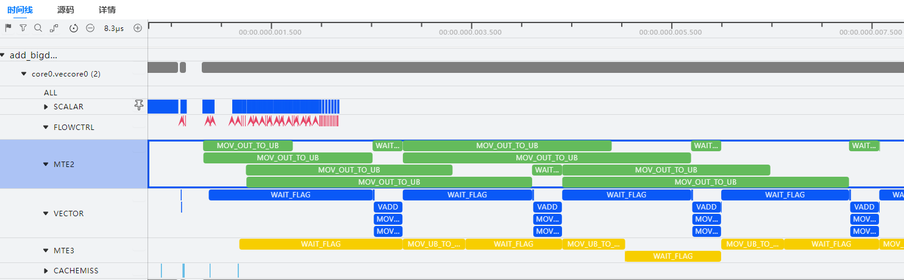

# **典型案例**

## 通过指令流水图优化算子

**概述**

展示如何通过msOpProf工具的指令流水图特性，分析算子的瓶颈点，并实现算子的性能优化。

**操作步骤**

1. 参考[msopprof simulator用户指南](../user_guide/msopprof_simulator_user_guide.md)，将算子仿真性能数据采集得到的visualize\_data.bin文件导入MindStudio Insight，具体导入操作请参考《MindStudio Insight用户指南》的“[导入性能数据](https://gitcode.com/Ascend/msinsight/blob/master/docs/zh/user_guide/basic_operations.md#%E5%AF%BC%E5%85%A5%E6%95%B0%E6%8D%AE)”章节。<a id="导入数据"></a>
2. 以一个Vector算子片段为例，查看算子指令流水图。

    可以发现MTE2流水在VADD计算时，没有执行搬运指令，且MTE2流水为该算子的性能瓶颈，需提高MTE2的搬运效率以实现算子性能优化。

    

3. 对于MTE2搬运效率的提升有多种方式，此处以开启Ascend C算子的double buffer机制为例。

    算子核函数中，可通过将TPipe中InitBuffer的第二个参数（BUFFER\_NUM）值从1修改为2，开启double buffer，InitBuffer的使用可参考《Ascend C算子开发接口》中的“基础API \> 内存管理与同步控制 \> TPipe \>  [InitBuffer](https://www.hiascend.com/document/detail/zh/canncommercial/83RC1/API/ascendcopapi/atlasascendc_api_07_0110.html)”章节。

    ```shell
    constexpr int32_t BUFFER_NUM = 2;        # tensor num for each queue
    ...
    pipe.InitBuffer(inQueueY, BUFFER_NUM, 1024 * sizeof(half));
    ...
    ```

4. 重新执行[1](#导入数据)，查看优化后的指令流水图。

    在VADD指令计算时，MTE2上的搬运指令也同步执行，实现了更高效的数据搬运。

    

## 配合mstx接口实现范围级重放

**概述**

展示如何使用msOpProf工具配合mstx接口实现范围级重放，以保留算子执行时上下文的L2Cache信息。

**前期准备**

准备算子工程，并在算子代码中添加mstx扩展接口确定范围级重放的范围，具体请参见[mstx扩展功能](../user_guide/extended_functions.md#mstx扩展功能)和《[MindStudio mstx API参考](https://www.hiascend.com/document/detail/zh/mindstudio/82RC1/API/mstxAPIReference/msprof_tx_0001.html)》。

> [!NOTE] 
> 
> - mstxRangeStartA和mstxRangeEnd接口需成对调用，不支持交叉调用。每一对mstx API中包含的算子为一个重放范围，该重放范围内算子的Stream不能改变。
> - 每一个重放范围能采集的算子数量受[OpBasicInfo（算子基础信息）](../user_guide/./msopprof_performance_data.md#opbasicinfo算子基础信息)中算子Block Dim数量限制，建议不超过50个。
> - 使用该功能时，不支持与--aic-metrics=MemoryDetail、--aic-metrics=TimelineDetail及--aic-metrics=Source同时使能；不建议与--kill=on同时使能，否则可能导致采集的算子数据缺失。
> - 在进行范围级重放时，执行算子SynchronizeStream可能会失败，建议在mstxRangeEnd接口调用结束后再执行。
> - 该功能仅适用于Atlas A3 训练系列产品/Atlas A3 推理系列产品、Atlas A2 训练系列产品/Atlas A2 推理系列产品以及Atlas 350 加速卡。

**注意事项**

采集shmem算子基础信息时，应选择range模式，需要注意的是：

1. 对于老版本驱动的shmem算子，使用工具可能会造成算子精度出现偏差，但这不影响性能数据的准确性，仍可正常使用工具查看性能情况。
2. 建议用户在需要同步的算子调用前，自行加入同步语句。否则可能会出现不同步的情况，严重时可能会造成算子卡死。

**调用示例**

以Python API接口方式（test.py文件）为例，说明msOpProf工具如何配合mstx接口实现范围级重放。

```python
import mstx
import torch
import torch_npu
 
x = torch.Tensor([1,2,3,4]).npu()
y = torch.Tensor([1,2,3,4]).npu()

a = x + y
range1_id = mstx.range_start("range1", None)
b = a - x
c = a * x
mstx.range_end(range1_id)
range2_id = mstx.range_start("range2", None)
d = x / y
range3_id = mstx.range_start("range3", None)
e = torch.abs(y)
mstx.range_end(range3_id)
f = x + e
mstx.range_end(range2_id)
```

**操作步骤**

- 单range范围级重放
    1. 执行以下命令，使能单一mstx API范围，以下命令将执行“range1”范围级重放。

        ```shell
        msprof op --replay-mode=range --mstx=on --mstx-include="range1" --launch-count=10 python3 test.py
        ```

    2. 工具生成Sub、Mul算子的调优数据，且两个算子之间的L2Cache信息会保留。具体性能文件介绍请参考[表2 msopprof模式文件介绍](../user_guide/msopprof_user_guide.md#工具使用)。

        ```tex
        OPPROF_{timestamp}_XXX
        ├── Mul_XXX  // Mul_XXX为采集算子名称
        │   └── 0
        │       ├── dump
                        ...
        │       └── visualize_data.bin
        └── Sub_XXX
            └── 0
                ├── dump
                       ...
                └── visualize_data.bin
        ```

- 多range范围级重放
    1. 执行以下命令，使能所有mstx API范围。

        ```shell
        msprof op --replay-mode=range --mstx=on --launch-count=10 python3 test.py
        ```

    2. 工具将会先后执行“range1”和“range2”范围级重放，生成Sub、Mul、Div、Abs、Add算子的调优数据，每次重放算子之间的L2Cache信息会保留，但两次重放的L2Cache信息互相独立。但因为“range2”和“range3”存在范围交叉，则仅第一个范围生效，“range3”将无效。具体性能文件介绍请参考[表2 msopprof模式文件介绍](../user_guide/msopprof_user_guide.md#工具使用)。

        ```tex
        OPPROF_{timestamp}_XXX
        ├── Abs_XXX  // Abs_XXX为采集算子名称
        │   └── 0
        │       ├── dump
                        ...
        │       └── visualize_data.bin
        ├── Add_XXX
        │   └── 0
        │       ├── dump
                        ...
        │       └── visualize_data.bin
        ├── Mul_XXX
        │   └── 0
        │       ├── dump
                        ...
        │       └── visualize_data.bin
        ├── RealDiv_XXX
        │   └── 0
        │       ├── dump
                        ...
        │       └── visualize_data.bin
        └── Sub_XXX
            └── 0
                ├── dump
                       ...
                └── visualize_data.bin
        ```
