# MindStudio Ops Profiler 架构设计说明书

## 1. 概述

算子调优组件作为算子开发工具链的关键一环，是算子开发者获取性能数据和优化方向的主要工具。根据算子运行的环境和目的，算子性能数据可划分为以下两类：算子仿真和算子上板。
算子仿真：运行在昇腾仿真器上，通过仿真器对于指令级性能的详细仿真输出详细的算子性能数据，例如流水图和代码热点图。
算子上板：开发者所开发的算子运行在真实昇腾设备上的性能数据结果，反映的是算子在硬件设备上的真实性能，是算子性能最可靠的数据。
针对算子的调优工具，主要用户群体是昇腾算子的开发人员，包括客户算子开发工程师，公司内部算子开发工程师。
本文目的是对算子开发工具进行模块设计，明确主要数据结构和主要处理过程，作为今后的编码阶段的输入和编码人员、测试人员的指导。

## 2. 服务/组件功能清单

**功能清单以表格形式输出**

| 类型                                        | 功能清单              | 功能描述                                                                                                                           | 支撑的调优类型    |
| --------------------------------------------- | ----------------------- | ------------------------------------------------------------------------------------------------------------------------------------ | ------------------- |
| 业务功能                                    | 计算内存热力图        | 以资源维度展示算子基础信息、计算负载分析和内存负载分析的数据                                                                       | 上板调优          |
| 业务功能                                    | Roofline瓶颈分析图    | 构建出性能模型，然后利用该性能模型快速评估出算子的理论性能极限                                                             | 上板调优          |
| 业务功能                                    | Cache热力图           | 可视化呈现Cache热力图，可显示对应指令信息，以便用户优化L2Cache命中率                                                              | 上板调优          |
| 业务功能                                    | 通算流水图（MC2算子） | 直观看到MC2算子的通算运行情况、指令耗时等信息，协助开发者识别通算瓶颈                                                              | 上板调优          |
| 业务功能                                    | 指令流水图            | 以指令维度展示时序关系并关联调用栈快速追踪瓶颈位置                                                                                 | 仿真调优          |
| 业务功能                                    | 算子代码热点图        | 支持查看算子源码与指令集的映射关系、耗时情况等功能，可协助开发者识别热点代码分布，并分析热点函数优化的可行性                       | 上板调优/仿真调优 |
| 业务功能                                    | 性能数据文件          | 展示指令耗时情况、L2cache命中率、内存带宽读写速率、L0读写带宽率、UB读写带宽速率、算子基础信息、计算/搬运单元耗时占比、资源冲突占比 | 上板调优          |
| 业务功能                                    | 搬运带宽图            | 展示GM<->L1,GM<->UB,GM<->other间数据搬运的带宽图                                                                                   | 仿真调优          |
| dfx功能                                     | Ctrl+C功能            | 提前终止算子进程，工具可根据当前已采集的数据解析结果                                                                                   | 上板调优/仿真调优 |
| dfx功能                                     | 提前终止进程            | 用户可定时结束算子进程                                                                                                             | 上板调优          |
| dfx功能                                     | 指定仿真器版本        | 用户可直接设置仿真器版本                                                                                                           | 仿真调优          |

 **代码热点图详细功能列举** 

| 特性名称| msprof op| msprof op simulator|
| -------- | --------- | -------------------  |
| 查看寄存器使用情况（Gpr Count）  | 不支持   | 支持  |
| 模拟代码行和指令维度的 L2Cache命中率  | 支持  | 不支持 |
| 查看与GM有关的数据搬运量（Process Bytes）| 支持  | 支持 |
| Vector计算类指令在UB Bank上读和写的冲突情况 | 不支持 | 支持  |
| Vector计算单元利用率 | 不支持 | 支持 |
| 查看算子源码与指令的耗时情况（cycles）| 不支持 | 支持  |
| 查看算子源码与指令的执行次数  | 支持 | 支持  |
| 查看算子源码与指令集的映射关系 | 支持 | 支持 |
| 查看源码、指令PC地址、Pipe、Source  | 支持  | 支持   |
| 查看core信息  | 不支持 | 支持   |

## 3. 软件实现设计目标分析与关键要素设计

### 3.1 整体设计目标分析

根据本工具需要提供的功能和服务，需实现以下整体设计目标：

1. 性能数据准确性：PMU数据采集顺序、搬运类接口（动态插桩和仿真器指令解析）解析的准确性，需要严格按照芯片手册解析。
2. 具备易扩展性：包括数据采集、解析方式、新增交付件、算子接入方式等。
3. 算子接入方式支持：不同的算子接入方式可能需要调用，通过劫持 Runtime 接口来执行性能数据采集。
4. 支持多种算子调用方式：多算子调用、多进程调用、多卡并行调用。
5. 耗时：分为采集、解析。采集部分应减少落盘改为通信传输，解析部分使用多线程并行解析。

### 3.2 关键要素设计

| 关键要素 | 设计目标                                                                                                                                                                                                 |
| ---------- | ---------------------------------------------------------------------------------------------------------------------------------------------------------------------------------------------------------- |
| 实现模型 | 1. 性能数据准确性：PMU数据采集顺序、搬运类接口（动态插桩和仿真器指令解析）解析的准确性，同时需要严格按照芯片手册解析<br/>2. 解析、采集易于扩展：解析、采集模块需要做合适的抽象，保证以后功能的扩展和芯片信号的扩展 |
| 交互模型 | 工具侧需要正确地将用户输入的参数传输给基础组件侧，实现相应的采集功能。                                                                                                                                   |
| 并发模型 | 解析高并发：实现解析并行处理。                                                                                                                                                                           |

## 4.开发视图

### 4.1 实现模型

算子调优上下文视图

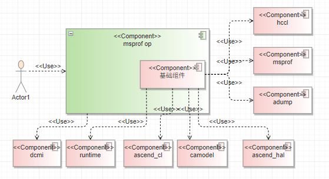

#### 4.1.1采集模块

##### 4.1.1.1 概述

本模块主要功能为对用户算子进行性能数据采集。

##### 4.1.1.2 上下文视图

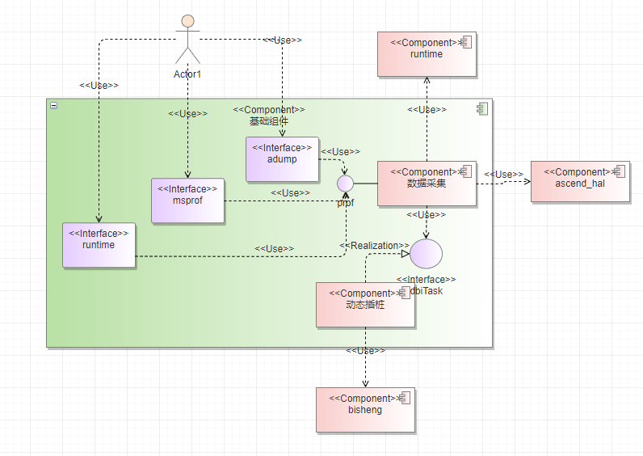

基础组件中提供拦截功能，对外呈现runtime、ascendcl、adump、msprof接口，用户算子启动后一旦调用相关接口就会走到基础组件的逻辑中。

###### 1. 劫持接口

基础组件在这些接口里会做相应的逻辑以达到相应的目的。
其中劫持ascendcl_impl、runtime目的是为了采集算子的性能数据；（当前版本兼容runtime和aclrt两种启动方式，当rt接口下线后则可以删除对runtime接口的劫持和调用）
劫持adump为了能够拿到并记录算子的上下文信息；
劫持msprof为了能够拿到MC2算子的打点信息。

###### 2. 数据采集

数据采集当前分为上板和仿真两部分，仿真调优利用仿真器可直接获取性能数据，性能数据生成后将生成的性能数据文件存储到指定算子目录下即可。
上板调优从硬件接口中获取相应信息。

###### 3. 动态插桩

在算子运行时将算子.o进行动态替换，其中借助了bisheng编译器的能力。

##### 4.1.1.3 逻辑视图

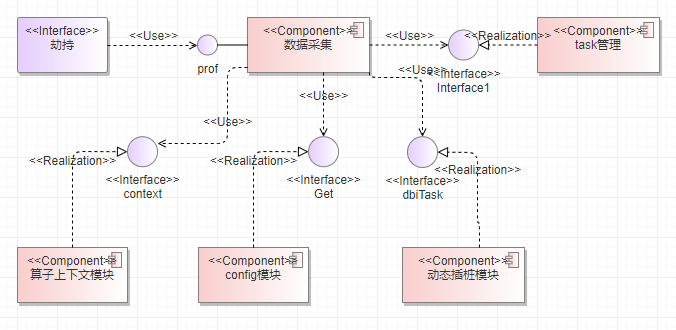

以表格形式输出软件单元清单：

| 软件单元       | 描述                                             | 外部接口                      | 内部接口                                              | 关系描述                                                                                              |
| ---------------- | -------------------------------------------------- | ------------------------------- | ------------------------------------------------------- | ------------------------------------------------------------------------------------------------------- |
| 劫持           | 包括runtime\\adump\\msprof接口                   | 相应组件接口                  | Hijackedxxx                                           | 对外暴露相应组件接口，当调用该接口时会创造Hijackedxxx对象进行劫持逻辑。                               |
| 数据采集       | 串联所有数据采集的逻辑包括上板的重放、仿真的采集 | ProfInit\\ProfData            | KernelReplay\\SaveBasicInfo\\HandleDumpLogAfterLaunch | 进入劫持后会主动调用profInit,ProfData，不同的场景会调用内部不同的逻辑，例如上板会调用KernelReplay函数 |
| 算子上下文模块 | 记录算子的上下文，.o信息                         | Save，ParseMetaDataFromBinary | GetMetaSection、ParseKernelArgs                       | 算子运行时会记录、分析算子上下文，在全部记录完成时可以调用Save函数保存上下文                          |
| config模块     | 记录由工具侧传来的配置信息                       | Get/Set                       |                                                       | 会记录由工具侧传来的配置信息，运行时会调用获取该信息选择性采集性能数据                                |
| task管理       | 创建、控制上板采集task                           | Start、Stop                   | FftsTask，StarsTask，AiCoreTask                       | 采集模块会根据当前不同的场景机器启动、停止相应的task                                                  |
| 动态插桩模块   | 控制动态插桩流程的模块，包括自定义桩、BBCount桩  | RunDBITask                    | GetOrCreate，Run                                      | 首先外部调用RunDBITask函数，该函数中会根据类型建立相应对象，之后会调用Run接口与编译器交互，进行.o替换     |

通过以上逻辑视图软件单元清单表，可以清晰地描述软件设计元素的分解关系、外部接口到内部元素的实现/使用关系，用于数字化软件单元清单数字化的解析和资产衔接追溯。

##### 4.1.1.4 软件实现单元设计

本模块主要用于算子性能数据的采集，以及在算子侧需要实现的功能。

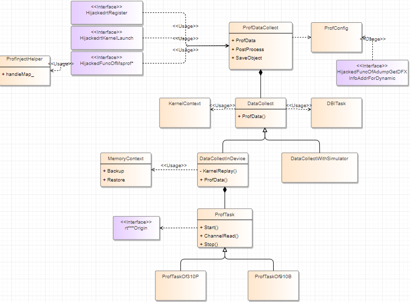

1. ProfDataCollect：性能数据采集类，rt接口直接调用其中接口对数据进行采集，每次rt接口调用均会创建一个ProfDataCollect对象，保证rtKernelLaunch调用独立。
2. ProfConfig：单例类，全局唯一，记录从工具侧传来的信息，例如PMU值等。
3. DataCollectInDevice：负责上板数据采集，主要函数有kernelReplay。
4. MemoryContext：负责重放过程中的数据备份
5. ProTask：上板数据采集依赖，负责开启通道、采集数据，不同芯片对应不同类，此处逻辑与原采集模块逻辑相同。
6. DataCollectWithSimulator：负责仿真数据采集。
7. DBITask：负责动态插桩相关功能，当前调优用到的有插自定义桩，和bbcount桩。
   打桩包含三种接口：runtime接口、msprof接口和adump接口。其中，msprof接口用于获取mc2算子的打点信息以展示流水图；adump接口用于获取算子输入信息（如workspace长度）。
   *描述软件实现元素上下文视图，将软件实现元素当做黑盒，描述其与外部的环境、系统关系*

根据架构设计，工具可分为以下几个功能模块进行模块设计：

#### 4.1.2 解析模块

##### 4.1.2.1 概述

本模块主要功能为对用户算子调优数据进行解析，单个算子数据按照用户指定目录划分文件夹写入磁盘。从计算内存热力图、Roofline瓶颈分析图、指令流水图、代码热点图、性能数据文件等不同指标维度计算并呈现交付件，解析过程中公共的中间数据以算子基础信息、PMU原始数据、代码行映射关系等维度划分。

##### 4.1.2.2 上下文视图

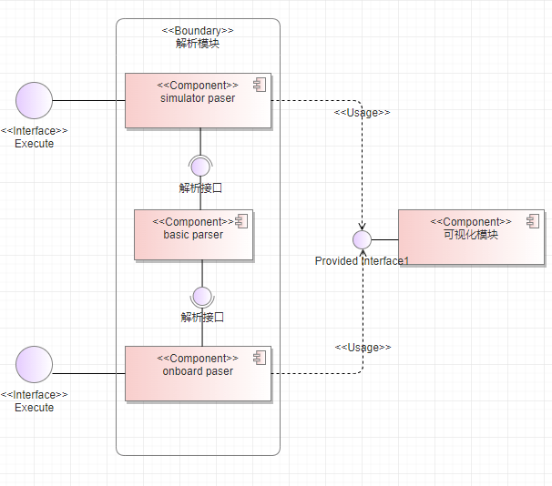

原有设计结构上板解析和仿真解析独立为两块内容，当前版本变动较大的是，在此基础上会将一些上板、仿真同时用到的功能独立化至基础解析类，例如算子代码行映射pc2code功能，在上板与仿真代码热点图中均会使用。后续演进时迁移数据量展示等相关类都不局限于仿真或上板。

##### 4.1.2.3 逻辑视图

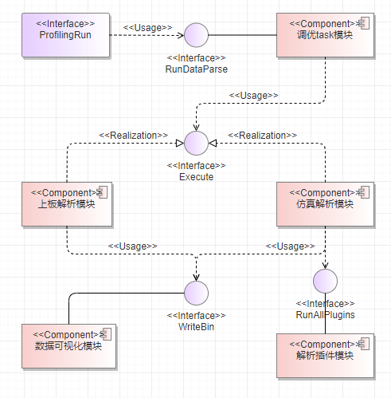

以表格形式输出软件单元清单：

| 软件单元   | 描述                                         | 外部接口                 | 内部接口                             | 关系描述                                                                                     |
| ------------ | ---------------------------------------------- | -------------------------- | -------------------------------------- | ---------------------------------------------------------------------------------------------- |
| 调优task   | 任务管理模块，负责上板、仿真的运行和解析任务 | RunDataParse             | /                                    | 根据任务模式的不同，调用上板或仿真解析子类接口                                               |
| 上板解析   | 解析以上板模式运行算子的调优数据             | Execute                  | ParserInit, ParseExactKernelData     | 读取驱动及插桩生成的性能数据，解析生成Cache热力图、计算内存热力图、RoofLine瓶颈分析图等      |
| 仿真解析   | 解析以仿真模式运行算子的调优数据             | Execute                  | ParseExportDumpFile, ParseKernelFile | 读取仿真dump数据，按核以多线程任务解析生成指令流水图、代码热点图等                           |
| 数据可视化 | 将解析结果以可视化交付件形式呈现             | WriteBin                 | /                                    | 根据与Visualize约定的数据结构，形成调优数据结果产物visualize_data.bin并按照用户指定目录落盘 |
| 解析插件   | 将解析数据分类以插件化形式注册并计算         | AddPlugin, RunAllPlugins | Run                                  | 当前版本仅仿真解析的指令解析部分以插件形式完成，后续各类指标维度将陆续迁移至插件化           |

##### 4.1.2.4 软件实现单元设计

##### 4.1.2.4.1 上板解析

本模块主要用于解析和提取用户指定的算子调优数据，生成归一化和分析的结果到用户指定目录，在上板和仿真两种拉起方式中，分为两个分析模块处理数据。
上板解析原始数据类型与产物呈现模块较多，数据之间存在较多的关联与依赖。该模型用于展示上板解析的数据流向与依赖关系。
上板调优数据解析交互模型如下所示：

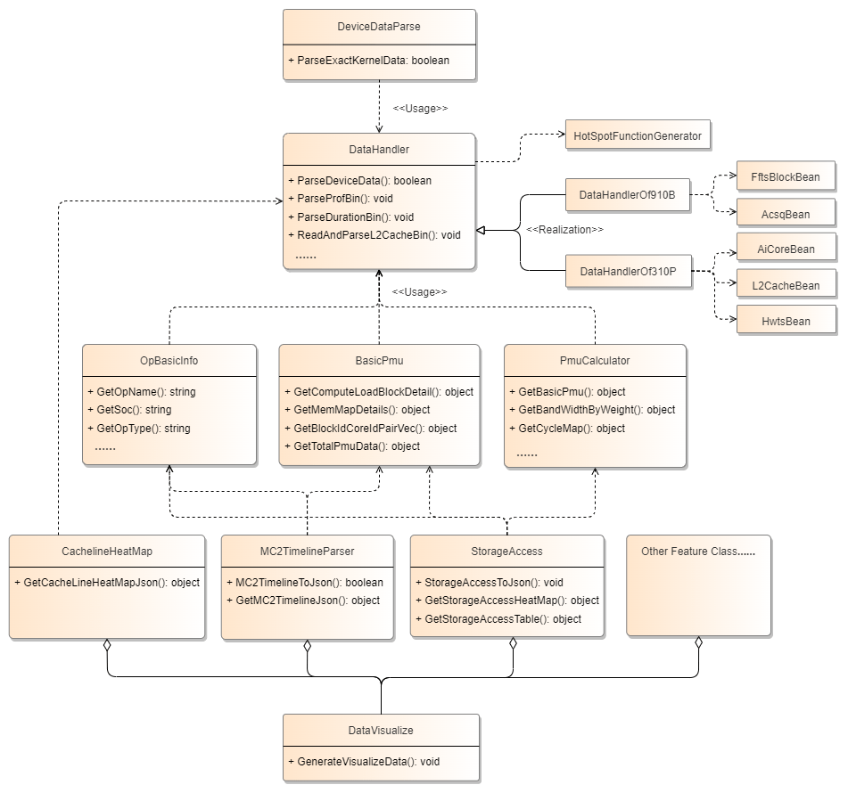

1. DeviceDataParse：性能数据解析类，作为解析的入口，每个算子的解析都会调用一次ParseExactKernelData方法，在其中创建DataHandler、OpBasicInfo等对象，保证每个算子数据独立解析。
2. DataHandler：数据加载类，用于读取驱动上报的原始PMU数据、stars数据等，并将指标数据经过处理、计算后以csv表格的形式落盘，作为交付件的一部分。同时从原始数据中提取、拼接有用信息，以Get方法的形式对外暴露部分基础指标数据。
3. *Bean：驱动数据类，用于解析原始PMU数据、stars数据。
4. HotSpotFunctionGenerator：热点函数类，该部分为上板解析和仿真解析的基础解析类，用于llvm反汇编解析代码行映射信息。
5. OpBasicInfo：包含算子的基础信息数据：算子名称、算子类型等。
6. BasicPmu：包含各block的PMU数据、内存信息等。
7. PmuCalculator：包含大量PMU指标计算公式。
8. CachelineHeatMap/MC2TimelineParser/StorageAccess层：各类指标维度类，根据需要呈现的具体指标
9. Cache热力图、MC2通算流水图、计算内存热力图等，从公共基础数据中获取、计算并组装呈现结果。
10. DataVisualize：根据与可视化模块约定的数据结构，将各类指标维度的性能数据进行填充及展示，最后形成结果产物visualize_data.bin，并可用MindStudio-Insight工具展示。

##### 4.1.2.4.1 仿真解析

##### 4.1.2.4.1.1 解析dump文件

将仿真解析按照解析、计算、可视化三个步骤分开，按照core为粒度，每一个core的数据单独保存在一个DataCenter中分别解析计算。计算完成后将每个core中的数据再进行合并，组装数据到同一个DataCenter中，便于后续可视化计算。当前insight的显示必须先有流水图才能正常解析，因此先进行整核和分核的流水图计算，后续在解析热点图。


##### 4.1.2.4.1.2 实时解析

增加DataStream类，类中主要接口有push和pop方法，生产者调用push接口存放数据，消费者使用pop接口接收数据。DataCenter持有DataStream类，DataCenter为存储数据的类，每个Plugin类中都持有DataCenter对象。
下图以Mte数据解析为例，其他类方法相似：MteParser是Mte解析的控制类，持有MtePlugin对象，MteParser控制Plugin的生命周期、启停、数据传输、以及MTE解析的后处理、预处理动作。MtePlugin的主要方法为接收数据并进行数据的处理、计算操作

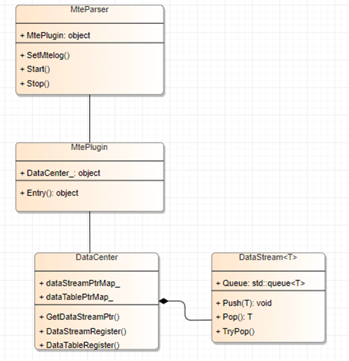

#### 4.1.3 数据可视化模块

##### 4.1.3.1 概述

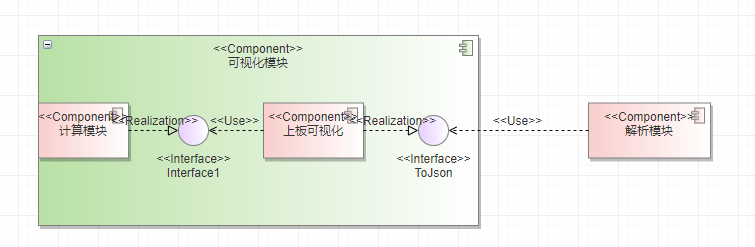

该模块主要用于将已解析的数据按照一定格式落盘保存。

##### 4.1.3.2 上下文视图

##### 4.1.3.3 逻辑视图

##### 4.1.3.4 软件实现单元设计

**代码热点图**
热点图需要完成一共3项任务：
1.写入整合的代码热点图到visualize_data.bin文件
2.写入分核code_exe.csv代码执行情况
3.写入分核instr_exe.csv指令执行情况
SimPcToCode解析指令计算时长并更新指令的状态，负责生成instr_exe.csv。同时将set和wait flag的指令名称细节进行更新，最后返回热点图右侧pc指令对应具体在不同的core上的执行数量。
SimCodeToPc解析每行代码的cycle和时长等，负责生成code_exe.csv。同时将每行代码对应的pc进行统计，最后返回热点图左侧的代码文件对应的pc范围信息，并将热点图的代码文件写入到visualize_data.bin文件中。
HotSpotMapVisualizer负责整合SimPcToCode和SimCodeToPc的数据信息并将结果写入到visualize_data.bin。同时统计每个core上的计算时长等信息，最后按照coreName排序打印显示出来。

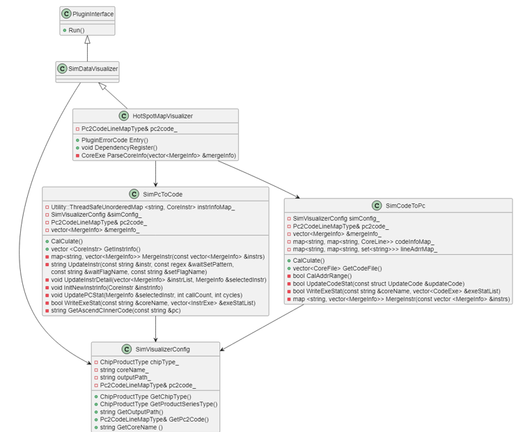

**分核流水图**
分核流水图只需要在每个core下面生成对应流水图JSON文件即可，在指令处理这里修改了UserMark的处理逻辑，单独从Datacenter中取出UserMark的数据单独解析，最后直接在对应的core目录下生成分核JSON文件。


**整核流水图**

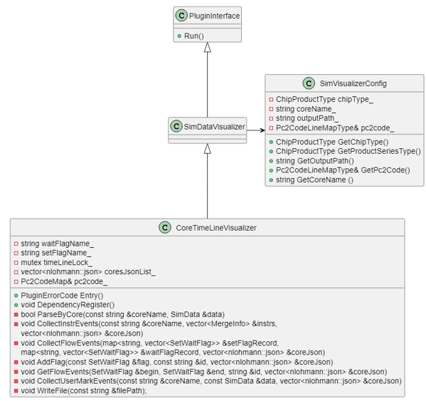

整核流水图与分核流水图逻辑类似，但是需要将流水数据分别写入整核JSON和visualize_data.bin文件。指令处理同样单独对UserMark的数据解析，同时需要判断用户是否开启PMSampling开关，开启则将这部分MTE解析的图一起写入到JSON和visualize_data.bin。

#### 4.1.4 插件模块

##### 4.1.4.1 概述

插件模块主要在动态插桩相关功能中用到，当前会使用ccec编译器编译Device侧的代码，再链接host侧msbit代码生成动态库

##### 4.1.4.2 上下文视图

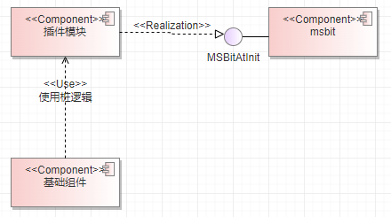

msopt仓编译时会生成libprofplugin_memorychart.so,基础组件使用该库实现动态插桩相关功能，具体操作详见下文。

##### 4.1.4.3 逻辑视图

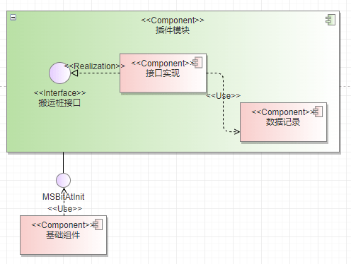

1. 桩接口：根据与编译器的约定，定义所需的搬运类接口。
2. 接口实现：桩接口中需要记录搬运类指令的原始操作，当前不同类型的接口定义了不同的结构体，结构体具体定义见4.3.1章节内容。
3. 数据记录：主要功能为按照特定的数据格式记录内存数据信息。在GM中存储的具体格式见4.3.1章节内容。

#### 4.1.5 通信模块

##### 4.1.5.1 概述

负责基础组件（算子侧）与msopt侧的数据传输、通信工作。

##### 4.1.5.2 上下文视图

##### 4.1.4.3 逻辑视图

##### 4.1.4.4 软件实现单元设计

msopt每次启动Task前，都会定义一个InjectEvent类，管理算子侧请求，它会调用通信类的接口接收消息，接到消息后会构造一个packet类，packet会根据不同的消息类型调用不同的解析函数解析，解析完成后将数据存在自己的类变量中。InjectEvent类向外部提供注册接口，外部类可以调用此接口注册对应的Process方法，当InjectEvent类解析到相应消息后会将packet对象传入到外部注册的Process方法里，Process中会取packet对象中的数据，并进行相应的处理。

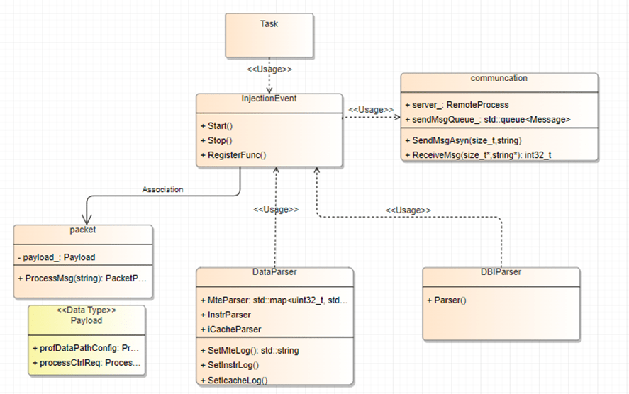

### 4.2 接口

#### 4.2.1 插件模块

#### 4.2.1.1 总体设计

插件模块实现搬运类接口劫持功能，在劫持中记录接口原始行为。

**接口清单**

```C++
GM相关的所有接口
void MSBitAtInit()
{
    // ccec type, stub function name, stub function args index
    // DMA_MOV
    Bind(InstrType::COPY_GM_TO_UBUF, "__msopprof_report_copy_gm_to_ubuf", {0, 1, 2});
    Bind(InstrType::COPY_UBUF_TO_GM, "__msopprof_report_copy_ubuf_to_gm", {0, 1, 2});
    Bind(InstrType::COPY_UBUF_TO_GM_BYTE, "__msopprof_report_copy_ubuf_to_gm_byte", {0, 1, 2, 3});
    Bind(InstrType::COPY_GM_TO_CBUF, "__msopprof_report_copy_gm_to_cbuf", {0, 1, 2, 3});
    Bind(InstrType::COPY_CBUF_TO_GM, "__msopprof_report_copy_cbuf_to_gm", {0, 1, 2});

    // MOV_ALIGN
    Bind(InstrType::COPY_GM_TO_UBUF_ALIGN_B16, "__msopprof_report_copy_gm_to_ubuf_align_b16", {0, 1, 2, 3});
    Bind(InstrType::COPY_GM_TO_UBUF_ALIGN_B32, "__msopprof_report_copy_gm_to_ubuf_align_b32", {0, 1, 2, 3});
    Bind(InstrType::COPY_GM_TO_UBUF_ALIGN_B8, "__msopprof_report_copy_gm_to_ubuf_align_b8", {0, 1, 2, 3});
    Bind(InstrType::COPY_UBUF_TO_GM_ALIGN_B16, "__msopprof_report_copy_ubuf_to_gm_align_b16", {0, 1, 2, 3});
    Bind(InstrType::COPY_UBUF_TO_GM_ALIGN_B32, "__msopprof_report_copy_ubuf_to_gm_align_b32", {0, 1, 2, 3});
    Bind(InstrType::COPY_UBUF_TO_GM_ALIGN_B8, "__msopprof_report_copy_ubuf_to_gm_align_b8", {0, 1, 2, 3});

    // LOAD_2D
    Bind(InstrType::LOAD_GM_TO_CA, "__msopprof_report_load_gm_to_ca", {0, 1, 2, 3});
    Bind(InstrType::LOAD_GM_TO_CB, "__msopprof_report_load_gm_to_cb", {0, 1, 2, 3});
    Bind(InstrType::LOAD_GM_TO_CBUF, "__msopprof_report_load_gm_to_cbuf", {0, 1, 2, 3});

    // DMA_MOV_ND2NZ
    Bind(InstrType::COPY_GM_TO_CBUF_MULTI_ND2NZ_B8,
         "__msopprof_report_copy_gm_to_cbuf_multi_nd2nz_b8", {0, 1, 2, 3});
    Bind(InstrType::COPY_GM_TO_CBUF_MULTI_ND2NZ_B16,
         "__msopprof_report_copy_gm_to_cbuf_multi_nd2nz_b16", {0, 1, 2, 3});
    Bind(InstrType::COPY_GM_TO_CBUF_MULTI_ND2NZ_B32S,
         "__msopprof_report_copy_gm_to_cbuf_multi_nd2nz_b32s", {0, 1, 2, 3});

    // MOV_FP
    Bind(InstrType::COPY_MATRIX_CC_TO_GM_F32,
         "__msopprof_report_copy_matrix_cc_to_gm_f32", {0, 1, 2, 3});
    Bind(InstrType::COPY_MATRIX_CC_TO_GM_S32,
         "__msopprof_report_copy_matrix_cc_to_gm_s32", {0, 1, 2, 3});
    Bind(InstrType::SET_ND_PARA,
         "__msopprof_report_set_nd_para", {0});
}
```

```C++
当前涉及的所有记录类型，每个类型根据接口行为不同定义自己的存储结构体。
enum class RecordType : uint8_t {
    DMA_MOV,
    MOV_ALIGN,
    LOAD_2D,
    DMA_MOV_ND2NZ,
    MOV_FP,
};
```

#### 4.2.1.2 设计目标

需要包含所有GM相关的接口

#### 4.2.1.3 设计约束

该代码需要ccec编译器编译，因此需要按照ccec的约束进行编码。

#### 4.2.1.4 技术选型

不涉及

#### 4.2.2 采集模块

#### 4.2.2.1 总体设计

采集模块主要涉及到与外部交互的接口，例如需要设计与仿真器交互接口。

**接口清单**

```C++
void DvcSetLogLevel(const uint32_t file_print_level, const uint32_t screen_print_level, const uint32_t flush_level)
void DvcAttachLogCallback(DvcLogType_t log_type, DvcLogCbFnUnion_t fn_union);
```

```C++
typedef union DvcLogCbFnUnion {
    DvcInstrLogCb_t instrLogCb;
    DvcMteLogCb_t mteLogCb;
    DvcIcacheLogCb_t icacheLogCb;
    DvcIfuLogCb_t ifuLogCb;
} DvcLogCbFnUnion_t;
```

#### 4.2.2.2 设计目标

能够满足当前需求，能够满足性能要求，满足对修改封闭，对扩展开放

#### 4.2.2.3 设计约束

需要与仿真器等交互组件对齐，向仿真器注册Callback接口需要注册具体函数以及日志类型，当前类型如下，以后如需新增接口需要在下列Union中新增一个类型，如新增ifu日志，只需在此Union中新增DvcIfuLogCb_t ifuLogCb，并注册到DvcAttachLogCallback接口，无需改动现有代码。

#### 4.2.2.4 技术选型

不涉及

### 4.3 数据模型

#### 4.3.1 插件模块

#### 4.3.1.1 设计目标

1. 数据记录的准确性
2. 代码复用、类型定义复用、代码形式一致：接口记录中存在一些相同的行为逻辑，与工具侧有大量的相同定义，针对上述情况要尽量复用代码，代码形式保持一致。

#### 4.3.1.2 设计约束

该代码需要ccec编译器编译，因此需要按照ccec的约束进行编码。

#### 4.3.1.3 设计选型

不涉及

#### 4.3.1.4 数据模型设计

1. Device侧记录

```C++
// DMA_MOV： DMA 搬运记录结构体
struct DmaMovRecord {
    uint64_t dst;
    uint64_t src;
    uint64_t pc;
    uint16_t nBurst;
    uint16_t lenBurst;
    uint16_t srcStride;
    uint16_t dstStride;
    uint16_t coreID;
    MemType dstMemType;
    MemType srcMemType;
    PadMode padMode;
    ByteMode byteMode;
};
```

```C++
// MOV_ALIGN： Move Align 搬运记录结构体
struct MovAlignRecord {
    uint64_t dst;
    uint64_t src;
    uint64_t pc;
    uint32_t srcGap;
    uint32_t dstGap;
    uint32_t lenBurst;
    uint16_t nBurst;
    uint16_t coreID;
    MemType dstMemType;
    MemType srcMemType;
    DataType dataType;
    uint8_t leftPaddingNum;
    uint8_t rightPaddingNum;
};
```

```C++
// LOAD_2D： LOAD_2D系列
struct Load2DRecord {
    uint64_t dst;
    uint64_t src;
    uint64_t pc;
    uint16_t coreID;
    uint16_t baseIdx;
    uint16_t srcStride;
    uint16_t dstStride;
    uint8_t repeat;
    MemType dstMemType;
    MemType srcMemType;
    AddrCalMode addrCalMode;
};
```

```C++
// DMA_MOV_ND2NZ
struct DmaMovNd2nzRecord {
    uint64_t dst;
    uint64_t src;
    uint64_t pc;
    uint16_t ndNum;
    uint16_t nValue;
    uint16_t dValue;
    uint16_t srcNdMatrixStride;
    uint16_t srcDValue;
    uint16_t dstNzC0Stride;
    uint16_t dstNzNStride;
    uint16_t dstNzMatrixStride;
    uint16_t coreID;

    MemType srcMemType;
    MemType dstMemType;
    DataType dataType;
};
```

```C++
// MOV_FP
struct MovFpRecord {
    uint64_t dst;
    uint64_t src;
    uint64_t pc;
    uint32_t dstStride;
    uint16_t srcStride;
    uint16_t nSize;
    uint16_t mSize;
    uint16_t coreID;
    uint16_t ndNum;
    uint16_t dstNdStride;
    uint16_t srcNdStride;
    uint16_t quantPreBits;
    bool enUnitFlag;
    bool int8ChannelMerge;
    bool int4ChannelMerge;
    bool channelSplit;
    bool enNZ2ND;
};
```

当前动态插桩主要覆盖和 GM 相关的搬运指令，此处对此类指令进行梳理。当前动态插桩需要获得两类信息：
**a.** 每个通路的搬运数据量。 // 内存热力图
**b.** 内存访问记录。 // l2cache相关展示
插件模块需要先在Device上记录原始操作接口信息，并记录到GM上，host侧再将记录copy到GM上并落盘，等待工具侧解析。工具侧需要读出原始数据，拆成原子化的内存记录。

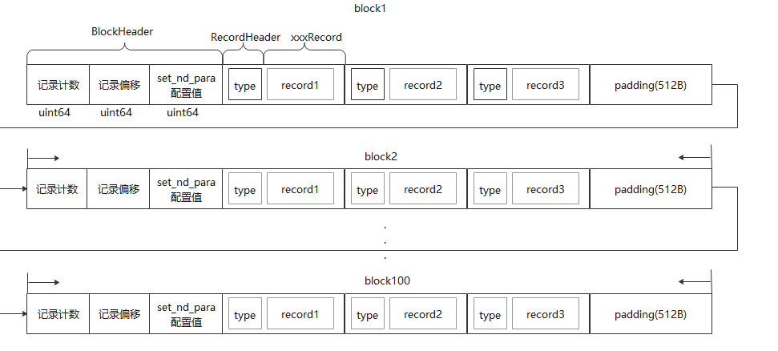

**a.** 按照block分块，每个block记录自己的数据，每个block内的前8个字节为本block内的记录总数，每多一条记录就+1。紧跟着n条内存记录，解析模块按照记录计数挨个解析。
**b.** 为了能够成功写入GM，每个block内都需要有一个padding，padding为512B。
**c.** 最多存储100个block的数据。
注：set_nd_para位的设置，是为了一些特殊类型接口，例如copy_matrix_cc_to_gm_f32，调用copy_matrix_cc_to_gm_f32前用户会先调用 set_nd_para接口设置预信息，之后调用的所有copy_matrix_cc_to_gm_f32接口，都会使用该预信息。此处的逻辑是预留nd_para位置，一旦用户调用set_nd_para接口则记录该信息，若再次调用则刷新。

### 4.3.2 解析模块

#### 4.3.2.1 设计目标

1. 共用相同逻辑
2. 中间数据设计要注意通用，做到只解析一次原始数据

#### 4.3.2.2 设计约束

1. 由于当前动态插桩实现的功能有多个（如数据搬运量显示、L2缓存建模），应确保单次解析获取所有数据，避免多次解析导致性能下降。

#### 4.3.2.3 设计选型

不涉及

#### 4.3.2.4 数据模型设计

#### 4.3.2.4.1 上板解析

需要将每一次指令调用拆解成单条的内存访问记录

```C++
struct MemRecord {
    uint64_t srcAddr;
    uint64_t dstAddr;
    uint64_t srcMemSize;
    uint64_t dstMemSize;
    uint64_t pc;
    uint32_t recordId;
    uint16_t blockId;
    Common::MemType src;
    Common::MemType dst;
};
```

1. 每条内存记录中包括了当前内存操作的Type，当前Type为Load\\Store，表示存储或读取。
2. src、dst表示源单元和目标单元，当前包括GM, UB, L0A, L0B, L0C
3. recordId，表示的为当前记录的序号，如果是一条指令有多条内存搬运记录，则需要分多个MemRecord记录，但是recordId保持相同。
4. addr为当前从src读的地址
5. memSize表示当前搬运的内存大小。
6. pc为当前指令的真实pc，通过此pc做代码的映射。

具体实现：

由于不同的Type对应不同的解析流程，可以使用表驱动的方式，解析时一个Type对应一个解析函数，map<RecordType，Func>;

```C++
using bool (*fun)(const std::vector<char> &buffer, uint32_t &index, size_t recordId, uint16_t blockId)
class DBIParser {
public:
    const std::vector<Common::MemRecord>& GetMemRecord();
    void ParseMemoryChart(const std::string &filePath)
private:
    ...
};
```

### 4.3.3 可视化模块

#### 4.3.3.1 设计目标

输出文件都用JSON文件形式数据，需满足方便扩展，前后兼容。需要考虑可视化解析时间

#### 4.3.3.2 设计约束

1. 做到方便扩展，前后兼容。
2. 需要考虑可视化解析时间，尽量通过做到数据集中来减少可视化读取数据时间。

#### 4.3.3.3 设计选型

不涉及

#### 4.3.3.4 数据模型设计

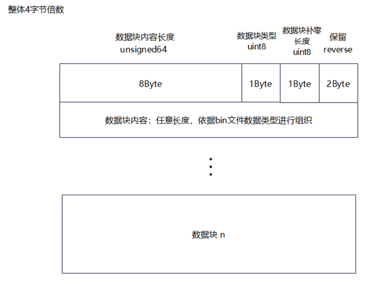

算子调优输出给可视化的数据文件只有1个bin文件。bin文件包括代码热点图、指令流水图等，每个图在bin文件中的格式都由头部和数据块组成，格式如上图所示。

| enum | 数据类型                                   |
| ------ | -------------------------------------------- |
| 0x00 | 数据块无效                                 |
| 0x01 | 代码文件                                   |
| 0x02 | 流水图tracing.json（包括MTE带宽图）。      |
| 0x03 | 热点图映射文件api.json的files部分。        |
| 0x04 | 热点图映射文件api.json的instructions部分。 |
| 0x07 | 计算负载表格。                             |
| 0x08 | 访存热力图。                               |
| 0x09 | 访存表格。                                 |
| 0x0C | 核间负载。                                 |
| 0x0D | Rooftline模型。                             |
| 0x0E | cache热力图                                |

##### 4.3.4 采集模块

#### 4.3.4.1 设计目标

// todo 暂无内容

#### 4.3.4.2 设计约束

// todo 暂无内容

#### 4.3.4.3 设计选型

本模块不涉及设计选型

#### 4.3.4.4 数据模型设计

1. 当前msopt用到Type、MC2 AICore时间戳数据、MC2 通信Task时间戳数据。

其中MC2 AICore时间戳数据：

```C++
struct MsprofAicTimeStampInfo {
     uint64_t syscyc;
     uint32_t blockId;
     uint32_t descId;
     uint64_t curPc;
 };
```

MC2 通信Task时间戳数据：

```C++
struct MsprofAicpuHcclTaskInfo {
    uint32_t localRank;
    uint32_t remoteRank;
    uint32_t planeID;
    uint32_t ctxId;
    uint64_t notifyID;
    double durationEstimated;
    uint64_t srcAddr;
    uint64_t dstAddr;
    uint64_t dataSize; // bytes
    uint32_t dataType; // data type {0: INT8, 1: INT16, 2: INT32, 3: FP16, 4:FP32, 5:INT64, 6:UINT64}
    uint32_t linkType; // link type {0: 'OnChip', 1: 'HCCS', 2: 'PCIe', 3: 'RoCE'}
    uint32_t transportType; // transport type {0: SDMA, 1: RDMA, 2:LOCAL}
    uint32_t rdmaType; // RDMA type {0: RDMASendNotify, 1:RDMASendPayload}
    uint32_t taskId;
    uint16_t streamId;
};
```

##### 4.3.5 参数解析模块

#### 4.3.5.1 设计目标

1. 向用户提供命令行参数，获取用户运行意图，实现相应功能。

#### 4.3.5.2 设计约束

1. 命令行作为外部输入时，需注意输入范围是否合法。设计时应考虑场景，避免读入超出限制的参数导致安全或功能问题'。
2. 命令行为外部输入需要注意文件权限是否正确，设计时需明确安全要求，并确保文件权限正确。

#### 4.3.5.3 设计选型

不涉及

#### 4.3.5.4 数据模型设计

| 参数                       | 数据类型                                                             | 限制                                                                                                                               | 备注       |
| ---------------------------- | ---------------------------------------------------------------------- | ------------------------------------------------------------------------------------------------------------------------------------ | ------------ |
| --application              | 用户输入的可执行文件                                                 | 需要有可执行权限                                                                                                                   | 上板、仿真 |
| --config                   | 配置为输入算子编译得到的二进制文件*.o，可配置为绝对路径或者相对路径 | 需要保证文件权限                                                                                                                   | 上板、仿真 |
| --kernel-name              | 指定要采集的算子名称                                                 | 限制长度为1024，仅支持A-Za-z0-9_中的一个或多个字符                                                                                | 上板、仿真 |
| --launch-count             | 设置可以采集算子的数量                                           | 取值范围为1\~100之间的整数                                                                                                         | 上板、仿真 |
| --launch-skip-before-match | 用于设置不需要采集数据的算子数量                                     | 0\~1000之间的整数                                                                                                                  | 上板       |
| --aic-metrics              | 使能算子性能指标的采集能力和算子采集能力指标                         | 上板仿真字段含义不一样                                                                                                             | 上板、仿真 |
| --kill                     | 用户程序将会在采集完--launch-count设置的算子数量后，自动停止程序     | 选项包括开启（on）和关闭（off）                                                                                                    | 上板、仿真 |
| --mstx                     | 算子调优组件是否使能用户代码程序中使用的mstx API                     | 取值范围为on、off                                                                                                                  | 上板、仿真 |
| --mstx-include             | 仅使能用户指定mstx API                                               | 不可单独配置，需要与--mstx配合使用，仅支持message为A-Z a-z 0-9 _这些字符，使用"|"进行拼接                                         | 上板、仿真 |
| --replay-mode              | 算子数据采集的重放模式，可配置为kernel或application                  | 取值为kernel或application                                                                                                          | 上板       |
| --warm-up                  | 指定预热次数                                                         | 默认值为5，取值范围为[0,500]                                                                                                       | 上板       |
| --output                   | 收集到的性能数据的存放路径，默认在当前目录下保存性能数据             | 需确保群组和其他组的用户不具备--output指定输出路径的上一级目录的写入权限。同时，需要确保--output指定目录的上一级目录属主为当前用户 | 上板、仿真 |
| --dump                     | 控制仿真器dump文件是否生成                                           | 取值范围为on、off                                                                                                                  | 上板、仿真 |
| --export                   | 指定包含单算子仿真结果文件夹，直接对该仿真结果进行解析               | 该指定文件夹只允许存放多核数据及算子核函数文件aicore_binary.o，所以需要将--config中配置的二进制文件名称（*.o）手动修改为aicore_binary.o                                                                                                         | 仿真       |
| --core-id                  | 可使用--core-id参数指定部分逻辑核的id                                | 取值范围为[0,49]                                                                                                                   | 上板、仿真 |
| --timeout                  | 设置--timeout参数缩短算子运行时长并获取必要流水信息                  | 参数取值范围为1~2880之间的整数，单位分钟                                                                                                         | 仿真       |
| --soc-version              | 指定仿真器版本                                                       | 选取范围可参考${INSTALL_DIR}/tools/simulator路径下的仿真器类型                                                                   | 仿真       |

**--aic-metrics参数解释说明**

| 参数                                                                                                     | 对应功能                                                                                                                                                                                                                                      | 备注 |
| ---------------------------------------------------------------------------------------------------------- | ----------------------------------------------------------------------------------------------------------------------------------------------------------------------------------------------------------------------------------------------- | ------ |
| ArithmeticUtilization / MemoryUB / Memory / MemoryL0 / L2Cache / PipeUtilization / ResourceConflictRatio | 生成对应csv文件                                                                                                                                                                                                                               | 上板 |
| Occupancy                                                                                                | 计算负载图                                                                                                                                                                                                                                    | 上板 |
| TimelineDetail                                                                                           | 算子生成仿真+上板性能数据                                                                                                                                                                                                                     | 上板 |
| KernelScale                                                                                              | 指定采集范围                                                                                                                                                                                                                                  | 上板 |
| Source                                                                                                   | 生成上板代码热点                                                                                                                                                                                                                              | 上板 |
| MemoryDetail                                                                                             | 生成cache相关性能数据+内存热力图中数据通路显示更详细                                                                                                                                                                                          | 上板 |
| Default                                                                                                  | 生成第一行所有数据，配合其他非第一行参数使用                                                                                                                                                                                                  | 上板 |
| PMSampling                                                                                               | 生成GM<->L1,GM<->UB,GM<->other带宽图                                                                                                                                                                                                          | 仿真 |
| PipeUtilization / ResourceConflictRatio                                                                  | 与set/wait flag连线显示有关，--aic-metrics=ResourceConflictRatio、PipeUtilization与--aic-metrics=ResourceConflictRatio与不加--aic-metrics一致，为打开流水图和set/wait展示， 而--aic-metrics=PipeUtilization为只打开流水图，不展示set/wait连线 | 仿真 |

### 4.4 算法实现

#### 4.4.1 解析模块

#### 4.4.1.1 设计目标

算法的时间复杂度尽可能低。

#### 4.4.1.2 设计约束

当前使用仿真器instr_log，所有指令当前按照pc指令排布，而不是时间序排布。

#### 4.4.1.3 技术选型

不涉及

#### 4.4.1.4 算法实现

#### 4.4.1.4.1 寄存器统计算法

每个指令需要区分DST和SRC使用的寄存器，其中DST指的是指令结果保存的寄存器，SRC指的是使用/数据依赖的寄存器。当指令寄存器使用数量公式为：
`占用寄存器数量 = 去重（上一个指令占用寄存器 + DST寄存器 + SRC寄存器）`
举例：若当前指令x用到的Xa寄存器仅在当前指令的DST中使用且在历史占用寄存器中存在Xa，历史使用的Xa寄存器的指令y，则从指令y+1到x-1的指令使用的Xa寄存器均视为被释放。

算法流程参考如下图，复杂度为O(N * M)，N为指令数量，M为平均指令向上搜索数量

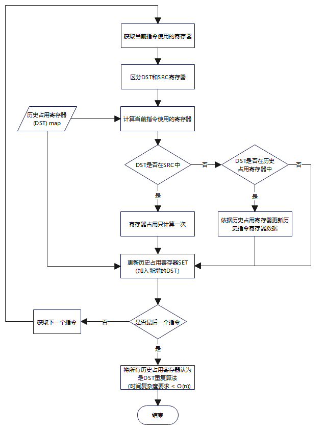

**限制**

1. Atlas 推理系列产品, Atlas A2 训练系列产品/Atlas A2 推理系列产品中寄存器上限为32
2. 基于只有Scalar流水中的指令中会包含DST，其他指令认为只包含SRC

可视化计算部分

1. 新增列名为：GPR Count
2. 代码栏每行代码占用寄存器数量 = 使用当前行所包含所有指令占用寄存器的值
3. 指令栏采用实际指令本身的寄存器占用了

#### 4.4.1.4.2 MTE带宽图算法

当前仅解析GM相关的指令，主要关注BRIF（GM读）、BWIF（GM写）字样的仿真器日志，需要关注指令结束的时间，该条指令搬运的数据量以及该条指令的读写模块。

1. 找到BRIF、BWIF指令，关注这条指令的数据搬运类，以及req_id、instr_id。
2. 找到这个req_id最后一次出现的位置，记录其tick时间，记为floor(t)产生的数据搬运事件。
3. 当前instr_id对应的不是BR/BW相关的指令，可能是L1WIF\\UBWIF，记录L1\\UB，代表这个搬运事件的另一个端为UB\\L1。
   通过1,2,3的操作即可得到一个搬运事件的src/dst,搬运的数据量以及时间。这里以1us为时间间隔，计算(t-1, t]时间内的GM<->L1,Gm<->UB,GM<->other的数据搬运量，最后除以时间，得到带宽值。画出6张带宽图。

### 4.5 安全实现设计

#### 4.5.1 安全设计目标

msprof op运行中应确保不对环境上的任何无关文件进行篡改，对环境上的权限不篡改，不得拉起对环境有影响的进程，工具生成的文件也要注意权限，不可被第三方修改。

#### 4.5.2 安全设计上下文

msprof op需要按照用户指令生成性能数据，其中会用到仿真器，会与硬件、runtime进行交互，因此安全风险主要来源于外部输入，外部组件的信息文件。
msprof op会拉起进程要注意权限问题，软件中实现中要注意编码安全性。
msprof op会与基础组件进行通信，需要对通信文件进行严格的权限设置。

#### 4.5.3 高风险模块识别

##### 4.5.3.1 高风险模块识别

| 模块名称     | 接口说明                                               | 设计域高风险模块分析                                                             | 对应代码目录                                                                                      |
| -------------- | -------------------------------------------------------- | ---------------------------------------------------------------------------------- | --------------------------------------------------------------------------------------------------- |
| 参数解析模块 | 解析并记录命令行参数                                   | 对输入的文件进行路径、权限等校验，对输入的进程路径进行权限、性质校验             | src/op_profiling/argparser/arg_checker.cpp                                                      |
| 数据解析模块 | 解析采集模块生成的原始性能数据，以及写入磁盘最终的性能数据 | 对输入的原始数据文件进行权限、内容等校验，对输出的最终性能文件进行严格的权限控制 | src/op_profiling/profiling/device/data_parse；src/op_profiling/profiling/simulator/data_parse |
| 通信模块     | 负责基础组件和工具端的通信操作                         | 使用匿名socket，不会落盘socket文件                                               | src/op_profiling/communication                                                                   |

##### 4.5.3.2 高风险API识别

> 列出被认为高风险的API，并描述为什么它们被认为是高风险的。

| 高风险API         | 接口说明           | 高风险接口函数分析                                 | 对应代码目录                                      | 语言类型 | 备注 |
| ------------------- | -------------------- | ---------------------------------------------------- | --------------------------------------------------- | ---------- | ------ |
| ArgChecker::Check | 负责所有入参的解析 | 不同类型的入参检测点不同，因此需要无遗漏地检测各个参数 | src/op_profiling/argparser/arg_checker.cpp->L56 | C++      |      |
| ……              | ……               | ……                                               | ……                                              | ……     | …… |

#### 4.5.4 代码实现安全防范处理

**1. 数据保护**
不涉及

**2. 模块依赖和第三方库**
当前会对工具入参做统一的校验，由argsChecker模块承载。后续新增任意输入项都需要在参数校验模块中加入对该参数的校验逻辑。

**3. 错误处理**
如果会校验输入文件的路径、权限、是否为软链接、是否包含非法字符、是否可写、属组、属主是否正确。若校验失败则进程退出，不进行后续操作。
落盘文件是会最少按照文件夹750、文件640、只读文件400权限落盘。如果落盘失败，工具会输出日志提示当前异常。

**4.日志审计**

1. 当前日志中不可打印文件路径
2. 不可在功能正常的情况下打印ERROR等级信息
3. 在一些循环逻辑中需要注意日志打印，不可造成刷屏。
4. 需要注意debug等级的日志的数量，不可打印海量日志掩盖重要信息（如通信具体内容的打印）。

### 4.6 开发者测试模型

#### 4.6.1 设计目标

本文档用于定义msprof op的开发者测试关键要素模型，作为0层的DT公共设计，包括软件可测试性设计和测试分层策略，其中针对不同的分层，进行DT环境、测试工程设计、基础通用
框架和领域专用框架设计、DFX专项测试等。

#### 4.6.2 设计约束

架构设计的原则和约束限制。

#### 4.6.3 可测试性设计

UT：覆盖全部接口，行覆盖率达80%，分支覆盖率达60%
ST：测试全部场景下交付件是否生成正确；测试msprof op各个功能是否正确。
IT：将软件的各单元（功能模块）按照概要设计说明书针对模块、子系统、系统的组装测试，以此来检验系统的各部分是否能满足相应的技术指标和要求，当前需要对各个子模块例如插桩模块、采集模块、 解析模块做IT测试。
FUZZ：当前对所有对外接口都进行FUZZ测试

#### 4.6.4 分层测试

| 分层 | 测试类型 | 测试对象                 | 测试价值                                                                                           |
| ------ | ---------- | -------------------------- | ---------------------------------------------------------------------------------------------------- |
| UT   | 单元测试 | 以上全部接口内部函数、类 | 验证最小实现单元工作是否符合预期                                                                   |
| IT   | 集成测试 | 插桩模块                 | 保证插桩模块可以在所有算子下正常工作，记录内存信息                                                 |
| IT   | 集成测试 | 采集模块                 | 验证采集模块采集的数据完整性，正确性                                                               |
| IT   | 集成测试 | 解析模块                 | 测试解析模块是否可以正确解析原始性能数据，按规定生成交付件                                         |
| ST   | 系统测试 | 算子类型                 | 当前支持的算子类型有<<<>>>、pytorch、aclnn等，需要覆盖全场景，保证支持的算子可以正常的生成性能文件 |
| ST   | 系统测试 | 拉起类型                 | 当前支持多算子拉起、多进程、单进程多线程场景，需要保证这些拉起场景可以正常生成数据文件             |

#### 4.6.5 关键测试技术方案

1. 测试工程设计

    UT: 使用googleTest，打桩使用mockcpp;

2. 物理设计
   当前UT和FUZZ测试在代码仓下，build中的execute_test_case.sh会运行所有的UT用例，execute_fuzz_case.sh脚本会运行所有的FUZZ用例。

    ```text
    ├── src
    │   ├── CMakeLists.txt
    │   ├── __init__.py
    │   ├── op_profiling
    │   ├── op_runner
    │   └── utils
    └── test
        ├── CMakeLists.txt
        ├── fuzz
        ├── init_scripts
        └── ut
    ```

    UT目录如下，与代码目录一一对应

    ```text
    ├── build_output
    │   ├── CMakeLists.txt
    │   └── test_build_output.cpp
    ├── CMakeLists.txt
    ├── op_profiling
    │   ├── argparser
    │   ├── CMakeLists.txt
    │   ├── common
    │   ├── communication
    │   ├── interface
    │   ├── parse
    │   ├── profiling
    │   └── prof_injection
    ├── op_runner
    │   ├── CMakeLists.txt
    │   ├── test_op_runner.cpp
    │   └── test_runtime_api.cpp
    ├── resources
    │   ├── config_json
    │   ├── dump
    │   ├── op_profiling
    │   └── op_test
    └── utils
        ├── CMakeLists.txt
        ├── cpputils
        └── pyutils
    ```

3. 运行环境

    由于当前仓中mockcpp版本限制，因此UT需要在x86机器上进行
    由于当前支持的机器类型有Atlas A2 训练系列产品/Atlas A2 推理系列产品、Atlas A3 训练系列产品/Atlas A3 推理系列产品、Atlas 推理系列产品，所有ST需要在这三类机器上运行。

## 5. 运行视图

### 5.1 交互模型

#### 5.1.1 采集模块

##### 5.1.1.1 设计目标

按照工具侧的指令采集特定信息。需要做到不影响算子精度、并落盘特定的数据文件。

##### 5.1.1.2 设计约束

注意落盘文件权限，上板采集时注意内存占用以及运行时间。

##### 5.1.1.3 交互模型设计

##### 5.1.1.3.1 上板采集

**劫持逻辑**
列举主要的劫持函数（runtime接口对应的aclrt接口）。

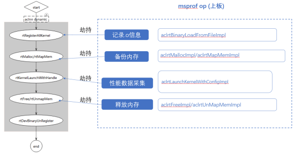

注：对于Atlas 推理系列产品需要在开启硬件接口前打开runtime通道，当前设计为与msprof保持一致，直接dlopen libprof.so，传入开启的command，由prof调用开关打开通道。
**处理流程**
当前调优工具只依赖一个so，即libmsopprof_injection.so，当前工具侧需要启动算子进程前告知子进程当前需要启动仿真采集或者上板采集的操作。（仿真为例）

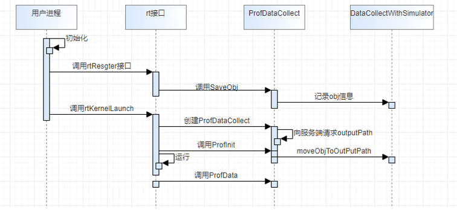

1. 用户进程启动时自动进行injection初始化动作，获取当前需要上板还是仿真，并打开对应so。上板对应runtime.so，仿真对应camodel_runtime.so，当前也需要打开msprof的profapi.so。基础组件中劫持不同的库，代码需要写在不同的文件夹下，当前runtime、profapi文件夹下对应的是两个库的打桩代码。
2. 用户调用接口，例如rtSetDevice，rtMalloc等。一些kernel相关的信息记录在KernelContext中。
3. 用户调用rtRegisterAllKernel接口。此时仿真采集需要记录.o信息。当前先将.o落盘，并使用 map\<const void *, std::string\> 记录.o信息，一个hdl对应一个.o落盘地址。
4. 用户调用KernelLaunch*接口，进入桩函数后构造ProfDataCollect对象，并发送请求给服务端，请求当前采集数据的存放路径。如果当前需要采集则将该hdl对应的.o数据拷贝到服务端传过来的存放路径下。继续运行rtKernelLaunch，将仿真器生成的性能数据拷贝到存放路径下。
   上板采集流程相似，但不记录.o信息。ProfData接口中，仿真采集将数据拷贝到路径下，而上板采集则执行KernelReplay，流程与之前相同。

**重放流程**
当前分为kernel级重放、应用级重放、范围级重放。

1. kernel级重放
   拉起一次算子进程，在算子下发时（kernelLaunch接口中），完成n次拉起，每次采集不同的PMU数据。kernel级重放需要做内存备份，在每次来拉起时需要对内存进行恢复、并且会通过反复拉起算子做预热，也会对L2cache进行清理。
   
   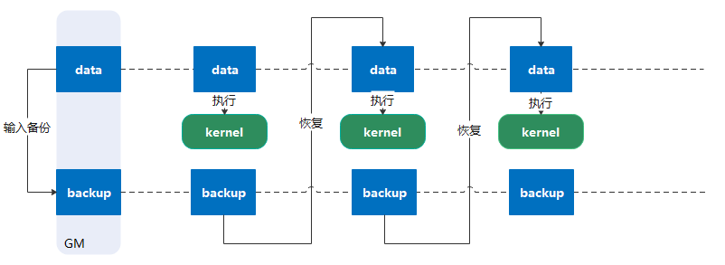
2. 应用级重放
   kernel级重放会刷l2cache，而应用级重放会保留前面算子的l2cache状态，应用级重放一次拉起采集一轮PMU，因为通过多次启动算子进程采集全部PMU，所以不需要做内存备份。
3. 范围级重放
   开启--replay-mode=range --mstx=on命令，并使用mstxRangeStartA和mstxRangeEnd接口框定算子范围，在此范围中的目标算子会整体执行多次（重放）。使用aclmdlRICaptureBegin、aclmdlRICaptureEnd、aclmdlRIExecuteAsync实现范围级重放。工具（基础组件）在用户调用mstxRangeStartA时调用aclmdlRICaptureBegin，开启捕获算子在mstxRangeEnd时调用aclmdlRICaptureEnd，并且通过aclmdlRIExecuteAsync运行任务，反复调用aclmdlRIExecuteAsync接口实现重放。
   
   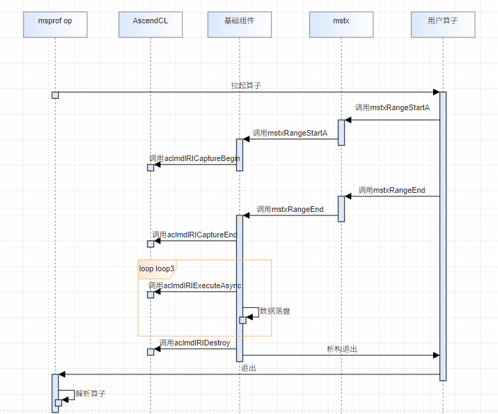

##### 5.1.1.3.1 仿真采集

**劫持逻辑

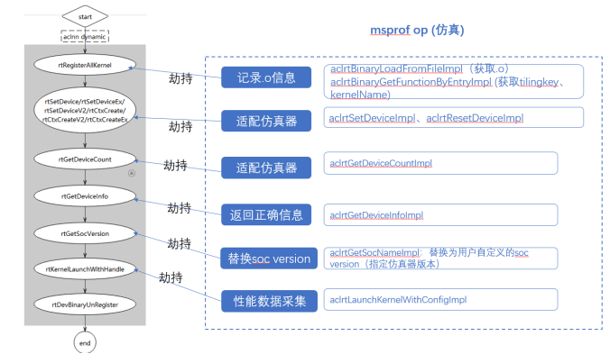

仿真库间的依赖：

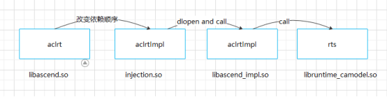

**处理逻辑**

1. 与Camodel交互
   Msopt工具侧拉起算子，算子调用rt接口，进入劫持逻辑，劫持方法在func_injection中实现，func_injection中会调用Camodel提供的rt接口，当算子调用rtKernelLaunch后，Camodel会自动落盘性能数据。现在Camodel提供注册接口，算子执行前注册回调函数给Camodel，当性能数据产生时Camodel会将性能数据直接传给此接口。增加Camodel交互方式为串行运行的前提，Camodel文件不落盘减少了磁盘压力、落盘时间以及工具读取时间。
   
   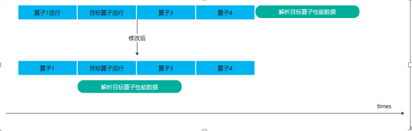
2. 与工具侧交互
   a. 当性能数据产生后需要将性能数据回传至工具侧进行解析，当前采用了队列机制，数据产生后直接加入队列，数据发送由一个单独的线程操作，减少由数据量大导致的时延问题，提升效率。
   b. 多算子情况下，考虑到内存使用情况，一个时刻只有一个算子进行解析，但整网中客户一般只会采集一个算子，所以对于此种场景下，可以通过通信请求控制在跑无关算子时解析目标算子，从而减少端到端时间。
   该时序图为工具侧、算子侧、仿真器侧的行为，可以直观的看到并行度大大提高。
   
   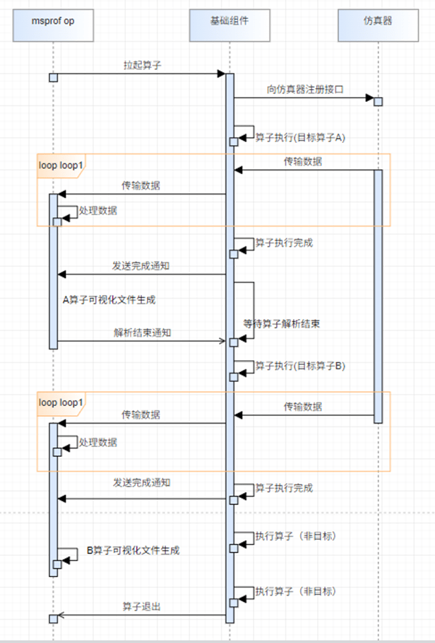

**动态插桩**
函数调用关系：

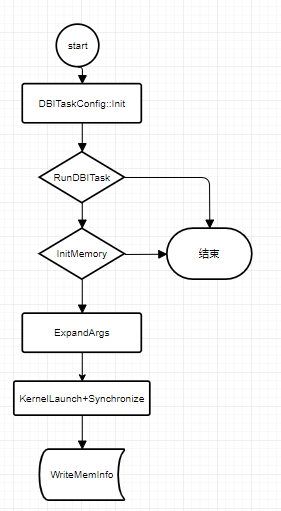

DBITask类提供动态插桩的主要功能，调用流程如下：调用DBITask接口Init、RunTask方法时内部会与bisheng-tune交互获得新的.o，再将新的.o 注册到rt中。之后调用ExpandArgs将gm内存拼接到args后面，最后调用rtKernelLaunch运行算子，运行完将gm地址下的内容写到文件中记录。

调优组件需要多次插桩实现不同的功能，当前需要两次插桩：

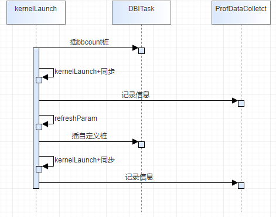

1. 代码热点图需要Bbcount桩，对bb块进行计数，得到每个pc的调用次数
2. 自定义桩：当前内存热力图显示部分通路的搬运数据量以及l2cache的相关功能。
   多次插桩的方案定位一次拉起进程，每次kernelLaunch时插入两个桩（每次拉起插一个桩比较耗时，暂时不使用）
   当前的方案为先插bbcount桩，运行kernelLaunch+同步，记录所需信息，再刷新所有的需要用到的参数，再次重跑kernelLaunch+同步。

**MC2算子任务流水绘制**

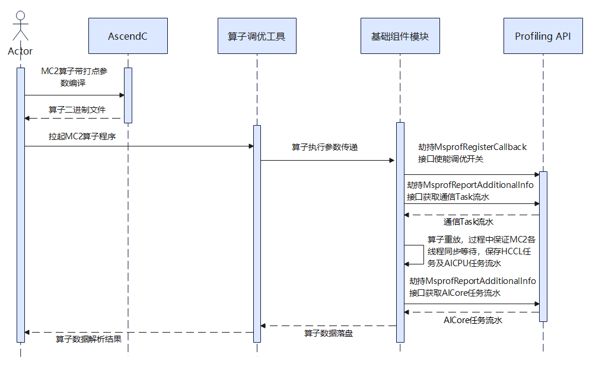

1、算子调优组件拉起MC2算子程序，在算子主程序执行之前，首先调用profapi.so中的MsprofRegisterCallBack接口，基础组件需要劫持该接口注册调优开关回调函数，使能MC2 AiCore任务及通信Task任务的上报。
2、通信Task任务通过调用profapi.so中的MsprofReportAdditionalInfo接口上报，工具需要劫持并保存通信Task流水的bin文件。
3、进行算子核函数的重放，在每次重放开始和结束时需要保证每张卡上的线程同步。在最后一次重放时，记录包含HCCL流水及AICPU任务流水的bin文件。
4、在算子核函数重放之后，AICore任务流水通过调用profapi.so中的MsprofReportAddtionalInfo接口上报，工具需要劫持并保存AICore任务流水的bin文件。

#### 5.1.2 解析模块

##### 5.1.2.1 设计目标

解析模块应正确解析原始性能文件，实现功能间独立可复用，支持多线程解析。

##### 5.1.2.2 设计约束

应确保落盘文件权限符合安全规范，解析数据时需要注意内存占用以及运行时间。

##### 5.1.2.3 交互模型设计

##### 5.1.2.3.1 上板

**仿真代码热点图**

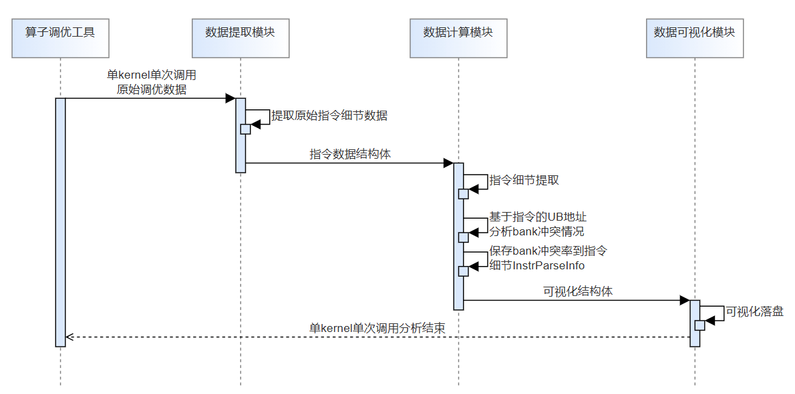

可视化计算部分：

1. 新增列名为：Processed Bytes，代码栏每行代码指令的资源使用情况 = SUM(使用当前行所包含所有指令的数据搬运量)，指令栏采用实际指令本身的数据量
2. 新增列名为：GPR Count，代码栏每行代码占用寄存器数量 = 使用当前行所包含所有指令占用寄存器的值
3. 新增列名为：UB Conflict Read，UB Conflict Write，代码栏每行代码读/写冲突 = SUM(使用当前行所包含所有指令的读/写冲突)，指令栏采用实际指令本身的数据量

**MC2指令流水图绘制**

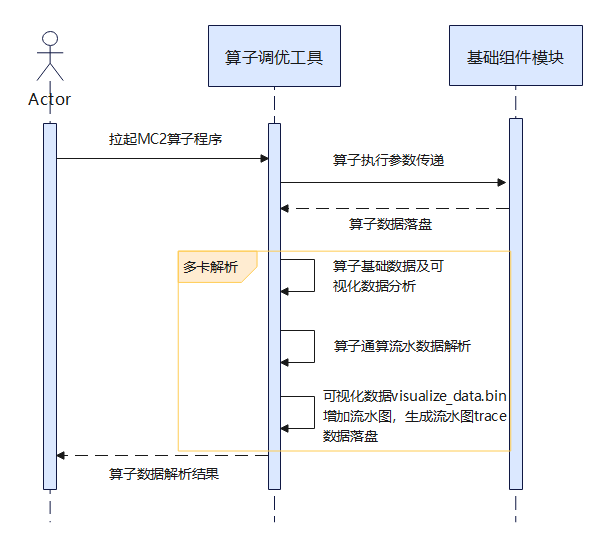

MC2算子会运行在多卡上，因此会以多个Device划分展示基础组件采集的产物，分别对每个算子的数据进行解析并绘制通算流水图。
1、MC2算子也包含AICore基础数据，因此算子基础信息、csv呈现的指标数据以及visualize_data.bin文件呈现的数据依然需要解析，该部分几乎等同于普通算子，需要注意的是MC2算子需使用最后一次的重放数据DeviceProf.bin计算性能指标。
2、解析AICore任务打点信息，每条数据包含一种类型的流水起/止时间，两两组合成一条流水数据。每条流水包含一个PC地址，若算子包含debug信息，可反解出代码行调用栈信息并呈现。该部分流水图整体以blockID作划分，blockID可从数据详情中获取。
3、解析AICPU任务打点信息，同样两两组合成一条流水数据。
4、根据duration.bin的stars数据解析HCCL打点信息，该部分流水图整体以streamID作划分，streamID可从数据详情中获取。
5、解析通信Task打点信息，该部分流水图整体以planeID作划分，planeID可从数据详情中获取。

##### 5.1.2.3.2 上板

**实时解析**

1. 进程启动任务时会初始化MteParser对象相应的也会构造MtePlugin、DataCenter对象。

2. 算子侧启动后会发送Start信息，表示开始采集当前算子，MteParser会清空当前插件内的数据，并启动插件。插件启动后会调用DataStream类中方法，等待性能数据的到达。DataStream类中已经封装好了等待数据、唤醒等待的机制，生产者调用Push方法添加数据，消费者调用Pop方法取数据。插件中会等待数据，有数据后会被唤醒。

3. 收到性能数据后，则开始解析。算子运行过程中会一直重复此步骤。

4. 当算子运行结束后会发送Stop信息，收到后会调用Shutdown函数，关闭数据等待，此时插件会停止等待新数据并进行后续操作。
   
   
   
   **dump文件解析**
   总体可以视为3个流程，解析，计算，可视化。在校验完输入数据后，首先对文件进行以core为力度的解析，将每个core上的数据解析注册到DataCenter中，这一步结束后，DataCenter中已经存在组合完毕的instr信息，icache信息，以及userMark的数据信息。
   插件化计算中每个DataCenter中会对instr的指令细节再进行进一步的计算，得到gpr，ubread等数据并更新DataCenter中相应数据值，这一步结束后，已经拥有后续可视化的全部信息，计算完成后将每个核的数据汇总到一个DataCenter中，便于可视化计算。
   可视化步骤会按照将DataCenter中数据进行解析，取出其中相应的数据，进行热点图以及流水图的计算，目前insight有约束限制，必须先绘制流水图再绘制热点图才能正常显示。
   
   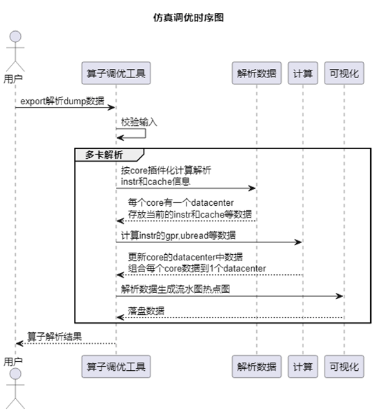

### 5.2 并发模型

#### 5.2.1 采集模块

##### 5.2.1.1 设计目标

由于算子调优组件已经支撑单进程多线程（多卡同时运行）的场景，例如MC2算子；需要保证不影响算子本身逻辑例如不能破坏算子本身的并发性，不能影响算子的精度，要正确采集算子的性能数据。

##### 5.2.1.2 设计约束

多卡模型下卡间、算子间的数据不得相互影响。

##### 5.2.1.3 并发模型设计

1. 对于性能采集实例需要按照kernelLaunch为粒度。每次kernelLaunch会生成一个全新的采集对象，其中的outputPath等需要全局唯一，此采集模块中的类不可设计为单例等可共用的类型。
2. MemoryContext、DeviceContext中设置为每个Device一个实例，Device间的数据不会相互影响。
3. ProConfig记录工具侧的信息，例如需要采集的PMU所有算子共用，所有全局只需要一个。
   
   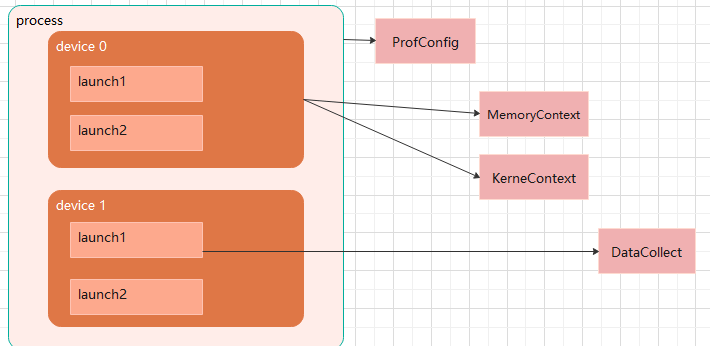

#### 5.2.2 解析模块

##### 5.2.2.1 设计目标

实现无关联的解析项并行解析，加快解析速度

##### 5.2.2.2 设计约束

应避免多线程竞争、读写冲突

##### 5.2.2.3 并发模型设计

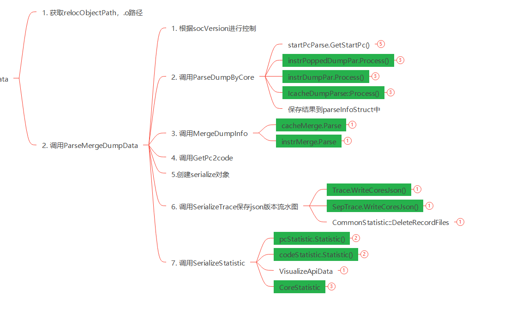

##### 6 代码目录结构

```text
├── cmake                              # 项目工程编译目录 
├── csrc                               # 源码
├── docs                               # 项目文档介绍 
├── example                            # 项目示例代码
├── package                            # run包安装、卸载及升级相关脚本 
├── test                               # UT测试 
├── thirdparty                         # 三方依赖
```
