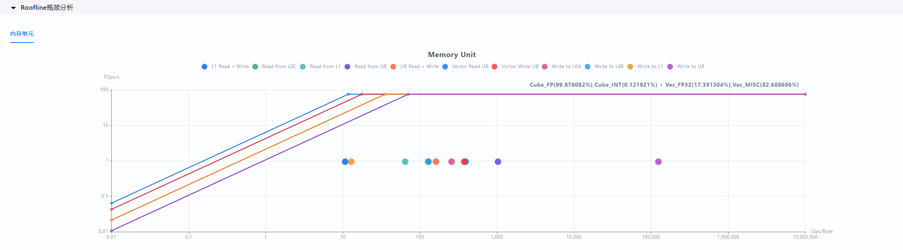
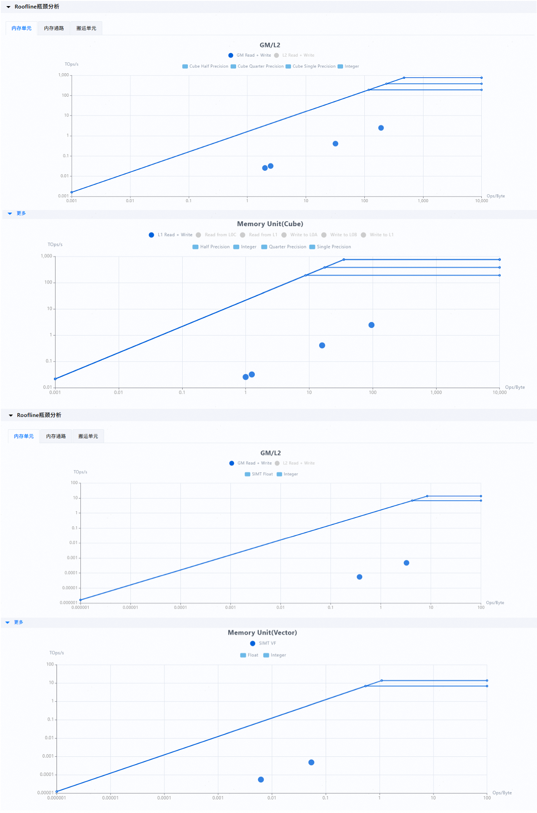
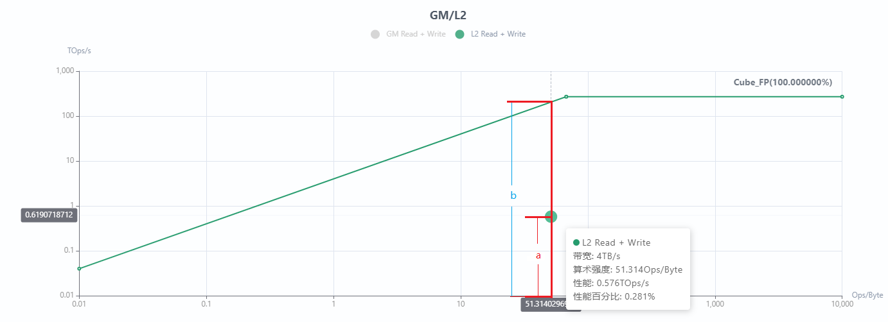
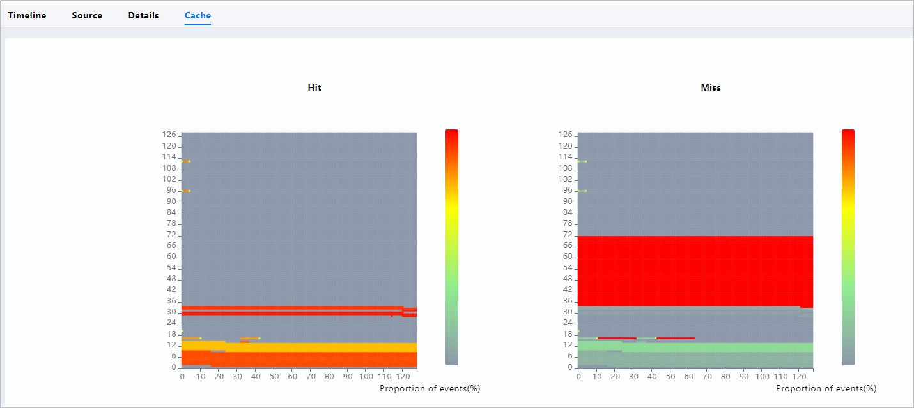
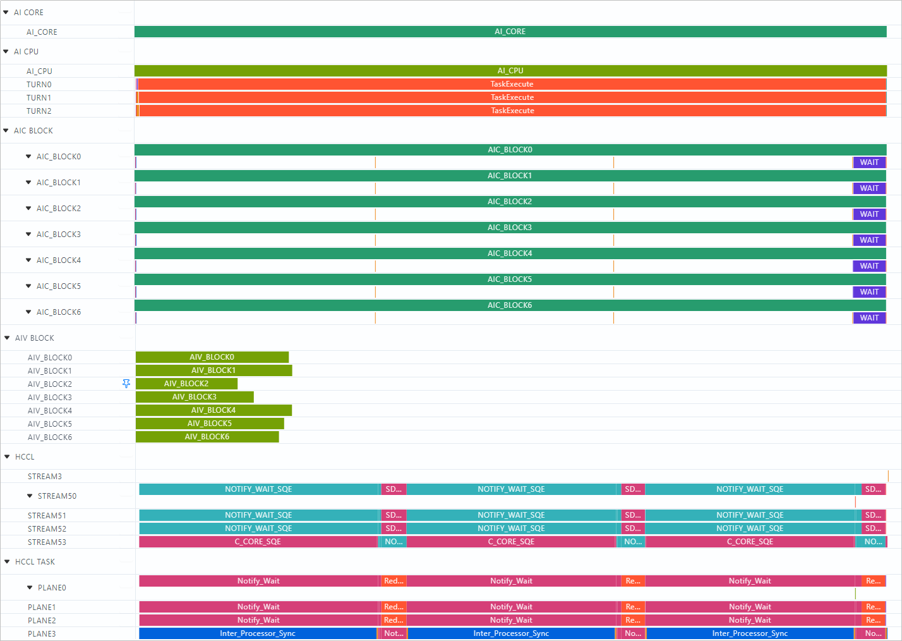
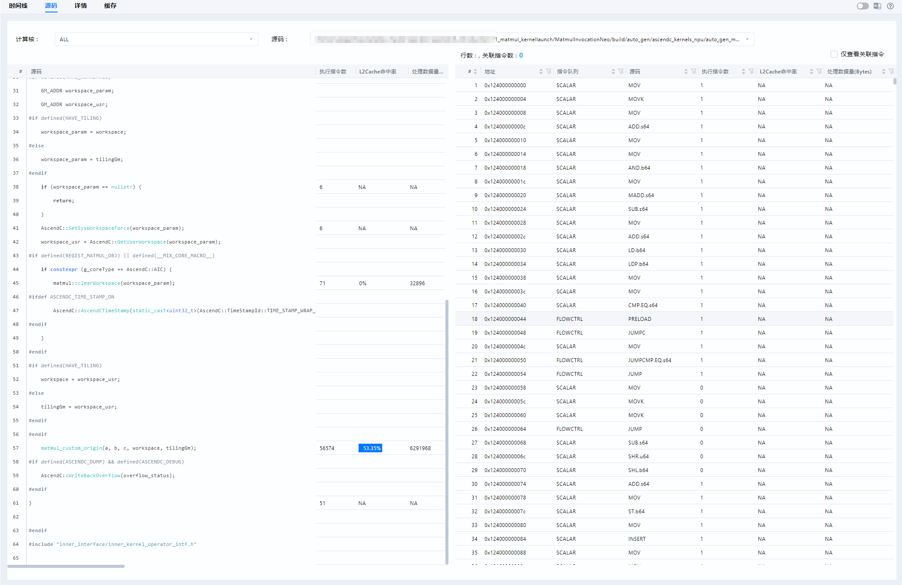

# **msopprof模式用户指南**

## 简介

MindStudio Ops Profiler（算子调优工具，msOpProf）用于采集和分析运行在AI处理器上算子的关键性能指标，用户可根据输出的性能数据，快速定位算子的软、硬件性能瓶颈，提升算子性能的分析效率。

当前支持基于上板（msopprof）或仿真（msopprof simulator）运行模式和不同文件形式（可执行文件或算子二进制**.o**文件）进行性能数据的采集和自动解析。

本文档介绍msopprof运行模式的使用方法。

**功能特性**

通过MindStudio Insight展示计算内存热力图、Roofline瓶颈分析图、通算流水图（通算融合算子）、Pipe流水图、算子代码热点图以及性能数据文件等单算子调优能力，具体请参考[**表 1**  msopprof模式功能特性](#msopprof模式功能特性)。

**表 1**  msopprof模式功能特性<a id="msopprof模式功能特性"></a>

|功能|链接|
|---|---|
|计算内存热力图|[计算内存热力图](#计算内存热力图)|
|Roofline瓶颈分析图|[Roofline瓶颈分析图](#roofline瓶颈分析图)|
|通算流水图|[通算流水图](#通算流水图)|
|Pipe流水图|[Pipe流水图](#pipe流水图)|
|算子代码热点图|[算子代码热点图](#算子代码热点图)|
|性能数据文件|[性能数据文件](./msopprof_performance_data.md)|

**调用场景**

支持如下调用算子的场景，具体操作请参见[采集Ascend C算子的性能数据](./typical_cases.md#采集ascend-c算子的性能数据)和[采集MC2算子的性能数据](./typical_cases.md#采集mc2算子的性能数据)。

- Kernel直调算子开发：Kernel直调。

    - Kernel直调场景，详细信息可参考《Ascend C算子开发指南》中“[Kernel直调算子开发](https://www.hiascend.com/document/detail/zh/canncommercial/83RC1/opdevg/Ascendcopdevg/atlas_ascendc_10_0052.html)”章节。
    - Kernel直调的场景，需先配置好前置条件，然后执行以下命令：

        ```shell
        msprof op simulator --soc-version=Ascendxxxyy ./main  # main为用户算子程序名称，包含待调优算子的程序名，xxxyy为用户实际使用的具体芯片类型
        ```

    - 若算子已在上板运行模式下，但用户又需要在不重新编译的情况下，对其进行仿真调优，可通过以下操作步骤实现。
        - 在任意目录下，创建一个指向libruntime\_camodel.so的软连接，名称为libruntime.so。

            ```shell
            ln -s /{simulator_path}/lib/libruntime_camodel.so /{so_path}/libruntime.so  
            # 例如,若使用root用户默认路径安装CANN包,simulator_path为/usr/local/Ascend/cann/tools/simulator/Ascendxxxyy
            ```

        - 将创建的软链接的父目录加入到环境变量LD\_LIBRARY\_PATH中。

            ```shell
            export LD_LIBRARY_PATH={so_path}:$LD_LIBRARY_PATH
            ```

- 工程化算子开发：单算子API调用。

    - 单算子API调用的场景，可参考《Ascend C算子开发指南》中“工程化算子开发 \>  [单算子API调用](https://www.hiascend.com/document/detail/zh/canncommercial/83RC1/opdevg/Ascendcopdevg/atlas_ascendc_10_0070.html)”章节。
    - 单算子API执行的场景，需先配置好前置条件，然后执行以下命令：

        ```shell
        msprof op simulator --soc-version=Ascendxxxyy ./main  # main为用户算子程序名称,包含待调优算子的程序名，xxxyy为用户实际使用的具体芯片类型
        ```

- AI框架算子适配：PyTorch框架。

    - 在<term>Atlas 推理系列产品</term>上使用msOpProf工具对PyTorch脚本的算子进行仿真调优时，仅支持基于Kernels算子包调用方式。用户需参考《CANN 软件安装指南》中的“[安装CANN](https://www.hiascend.com/document/detail/zh/canncommercial/83RC1/softwareinst/instg/instg_0093.html?Mode=PmIns&InstallType=netconda&OS=openEuler&Software=cannToolKit)”章节中的“安装Kernels算子包”内容，安装二进制Kernels算子包，并修改脚本入口文件例如main.py文件，在import torch\_npu下方添加加粗字体信息，以确保使用的是Kernels算子包中算子。

        ```python
        import torch
        import torch_npu
        torch_npu.npu.set_compile_mode(jit_compile=False)
        ......
        ```

    - 通过PyTorch框架进行单算子调用的场景，详细信息可参考《Ascend Extension for PyTorch 套件与三方库支持清单》中“[昇腾自研插件](https://www.hiascend.com/document/detail/zh/Pytorch/720/modthirdparty/modparts/thirdpart_0009.html)”章节中OpPlugin插件。
    - 通过PyTorch框架进行单算子调用的场景，需先配置好前置条件，然后执行以下命令：

        ```shell
        msprof op simulator --soc-version=Ascendxxxyy python a.py  # a.py为用户算子程序名称,包含待调优算子的程序名，xxxyy为用户实际使用的具体芯片类型
        ```

- Triton算子开发：Triton算子调用。

    - 已完成Triton及Triton-Ascend插件的安装和配置，具体操作请参见[链接](https://gitcode.com/Ascend/triton-ascend)。
    - Triton算子调用场景不适用于<term>Atlas 推理系列产品</term>。

## 使用前准备

**环境准备**

- 请参考[MindStudio Ops Profiler安装指南](./msopprof_install_guide.md)，完成相关环境变量的配置。

- 若要使用MindStudio Insight进行查看时，需要单独安装MindStudio Insight软件包，具体下载链接请参见[MindStudio Insight安装指南](https://gitcode.com/Ascend/msinsight/blob/master/docs/zh/user_guide/mindstudio_insight_install_guide.md)。

- 针对<term>Atlas A2 训练系列产品/Atlas A2 推理系列产品</term>，若要使用[模板库](https://gitcode.com/cann/catlass/blob/master/scripts/build.sh)进行仿真，编译脚本需增加选项--simulator，以simulator模式编译算子。具体操作请参见[链接](https://gitcode.com/cann/catlass/blob/master/docs/tools/performance_tools.md)。

    ```shell
    bash scripts/build.sh --simulator 00_basic_matmul
    ```

**使用约束**

- 性能数据采集时间建议在5min以内，同时推荐用户设置的内存大小在20G以上（例如容器配置：docker run --memory=20g  _容器名_）。
- 请确保性能数据保存在不含软链接的当前用户目录下，否则可能引起安全问题。

## 注意事项

- msOpProf工具的使用依赖CANN包中的msopprof可执行文件，该文件中的接口使用和msopprof一致，该文件为CANN包自带，无需单独安装。
- 通过键盘输入“CTRL+C”后，算子执行将会被停止，工具会根据当前已有信息生成性能数据文件。若不需要生成该文件，可再次键盘输入“CTRL+C”指令。
- 若未指定--output参数，需确保其他用户不具备当前路径的上一级目录的写入权限。
- 使用msopprof之前，用户需保证app功能正常。
- 不支持在同一个Device侧同时拉起多个性能采集任务。
- 用户需自行保证可执行文件或用户程序（_application_）执行的安全性。
    - 建议限制对可执行文件或用户程序（_application_）的操作权限，避免提权风险。
    - 不建议进行高危操作（删除文件、删除目录、修改密码及提权命令等），避免安全风险。

## 命令参考

登录运行环境，使用```msprof op 可选参数  app [arguments]```格式调用，可选参数的具体情况请参考[**表 1**  msopprof可选参数表](#msopprof可选参数表)。具体命令示例如下：

```shell
msprof op --output=$HOME/projects/output $HOME/projects/MyApp/out/main blockdim 1    # --output为可选参数,$HOME/projects/MyApp/out/main为使用的app,blockdim 1为用户app的可选参数 
```

**表 1**  msopprof可选参数表<a id="msopprof可选参数表"></a>

<table><thead align="left"><tr id="zh-cn_topic_0000002016036877_row8624748111318"><th class="cellrowborder" valign="top" width="21.01%" id="mcps1.2.4.1.1"><p id="zh-cn_topic_0000002016036877_p1138172432419">可选参数</p>
</th>
<th class="cellrowborder" valign="top" width="68.30000000000001%" id="mcps1.2.4.1.2"><p id="zh-cn_topic_0000002016036877_p3354166101419">描述</p>
</th>
<th class="cellrowborder" valign="top" width="10.69%" id="mcps1.2.4.1.3"><p id="zh-cn_topic_0000002016036877_p1196682319">是否必选</p>
</th>
</tr>
</thead>
<tbody><tr id="zh-cn_topic_0000002016036877_row10587125515137"><td class="cellrowborder" valign="top" width="21.01%" headers="mcps1.2.4.1.1 "><p id="zh-cn_topic_0000002016036877_p1250193013241">--application</p>
</td>
<td class="cellrowborder" valign="top" width="68.30000000000001%" headers="mcps1.2.4.1.2 "><p id="zh-cn_topic_0000002016036877_p723342521312">建议使用<strong id="b1293111147129">msprof op [<em id="zh-cn_topic_0000002016036877_i13507833131320"><span>msopprof </span>参数</em>] ./app</strong>进行拉取，其中app为指定的可执行文件，如果app未指定路径，默认为使用当前路径。</p>
<p id="p156072494010">使用./app时，需将<span>msopprof</span>的相关参数添加到./app前，以确保相关功能生效。</p>
<p id="p3574105913419">当前与./app [arguments]兼容，后期将修改为./app [arguments]。</p>
</td>
<td class="cellrowborder" rowspan="2" valign="top" width="10.69%" headers="mcps1.2.4.1.3 "><p id="zh-cn_topic_0000002016036877_p5346182131011">是，指定的可执行文件和--config二选一</p>
</td>
</tr>
<tr id="zh-cn_topic_0000002016036877_row17435415142"><td class="cellrowborder" valign="top" headers="mcps1.2.4.1.1 "><p id="zh-cn_topic_0000002016036877_p8138924102411">--config</p>
</td>
<td class="cellrowborder" valign="top" headers="mcps1.2.4.1.2 "><p id="zh-cn_topic_0000002016036877_p035518616149">配置为输入算子编译得到的二进制文件<strong id="zh-cn_topic_0000002016036877_b1315495854916">*.o</strong>，<span>可配置为绝对路径或者相对路径</span>。<span>具体可参考</span><a href="./extended_functions.md#json配置文件说明">json配置文件说明</a><span>。</span></p>
<p id="zh-cn_topic_0000002016036877_p4504171402">进行算子调优之前，可通过以下两种方式获取算子二进制<strong id="zh-cn_topic_0000002016036877_b721820955013">*.o</strong>文件。</p>
<ul id="ul19324205219310"><li>参考<span id="zh-cn_topic_0000002016036877_ph2051917206">《Ascend C算子开发指南》</span>中的“Kernel直调算子开发 &gt; <a href="https://www.hiascend.com/document/detail/zh/canncommercial/83RC1/opdevg/Ascendcopdevg/atlas_ascendc_10_0056.html" target="_blank" rel="noopener noreferrer">Kernel直调</a>”章节中的“修改并执行一键式编译运行脚本”，获取NPU侧可执行文件，并需要用户自行从可执行文件中提取<span>*</span>.o文件。</li><li>参考<a href="https://www.hiascend.com/document/detail/zh/mindstudio/82RC1/ODtools/Operatordevelopmenttools/atlasopdev_16_0024.html" target="_blank" rel="noopener noreferrer">算子编译部署</a>，算子编译时会自动生成<strong id="zh-cn_topic_0000002016036877_b1771616125012">*.o</strong>文件。</li></ul>
<p id="p272010297411">需确保群组和其他组的用户不具备--config指定的json文件及上一级目录的写入权限。同时，需要确保json文件的上一级目录属主为当前用户。</p>
</td>
</tr>
<tr id="zh-cn_topic_0000002016036877_row3714102095014"><td class="cellrowborder" valign="top" width="21.01%" headers="mcps1.2.4.1.1 "><p id="zh-cn_topic_0000002016036877_p10636154010241">--kernel-name</p>
</td>
<td class="cellrowborder" valign="top" width="68.30000000000001%" headers="mcps1.2.4.1.2 "><p id="zh-cn_topic_0000002016036877_p18490162020510">指定要采集的算子名称，支持使用算子名前缀进行模糊匹配。如果不指定，则只对程序运行过程中调度的第一个算子进行采集。</p>
<p id="p1646517132076">注意事项：</p>
<ul id="ul18481193017712"><li>需与--application配合使用，限制长度为1024，仅支持<strong id="zh-cn_topic_0000002016036877_b2918817181816">A-Za-z0-9_</strong>中的一个或多个字符。</li><li>需要采集多个算子时，支持使用符号"|"进行拼接。例如，--kernel-name="add|abs"表示采集前缀名为add和abs的算子。</li><li>具体采集的算子数量由--launch-count参数值决定。</li><li>支持使用通配符（*）匹配任意长度字符。</li></ul>
</td>
<td class="cellrowborder" valign="top" width="10.69%" headers="mcps1.2.4.1.3 "><p id="zh-cn_topic_0000002016036877_p1149002025112">否</p>
</td>
</tr>
<tr id="zh-cn_topic_0000002016036877_row13386192612273"><td class="cellrowborder" valign="top" width="21.01%" headers="mcps1.2.4.1.1 "><p id="zh-cn_topic_0000002016036877_p9480153621110">--launch-count</p>
</td>
<td class="cellrowborder" valign="top" width="68.30000000000001%" headers="mcps1.2.4.1.2 "><p id="zh-cn_topic_0000002016036877_p13480103631112">设置可以采集算子的最大数量，默认值为1，取值范围为1~5000之间的整数。</p>
</td>
<td class="cellrowborder" valign="top" width="10.69%" headers="mcps1.2.4.1.3 "><p id="zh-cn_topic_0000002016036877_p44801736191113">否</p>
</td>
</tr>
<tr id="zh-cn_topic_0000002016036877_row3881172501210"><td class="cellrowborder" valign="top" width="21.01%" headers="mcps1.2.4.1.1 "><p id="zh-cn_topic_0000002016036877_p1588214252129">--launch-skip-before-match</p>
</td>
<td class="cellrowborder" valign="top" width="68.30000000000001%" headers="mcps1.2.4.1.2 "><p id="zh-cn_topic_0000002016036877_p179861481613">用于设置不需要采集数据的算子数量，从第一个算子开始到指定数目的算子不进行采集，仅对指定数目之后的算子开始采集。</p>
<p id="p87932140811">注意事项：</p>
<ul id="ul091962417820"><li>无论--launch-skip-before-match参数是否命中kernel-name中指定的算子，该项的计数都会增加，且不采集该算子。</li><li>此参数的取值范围为0~1000之间的整数。</li></ul>
</td>
<td class="cellrowborder" valign="top" width="10.69%" headers="mcps1.2.4.1.3 "><p id="zh-cn_topic_0000002016036877_p174255414124">否</p>
</td>
</tr>
<tr id="zh-cn_topic_0000002016036877_row155322034113813"><td class="cellrowborder" valign="top" width="21.01%" headers="mcps1.2.4.1.1 "><p id="zh-cn_topic_0000002016036877_p199628716257">--aic-metrics</p>
</td>
<td class="cellrowborder" valign="top" width="68.30000000000001%" headers="mcps1.2.4.1.2 "><p id="zh-cn_topic_0000002016036877_p928716227577">使能算子性能指标的采集能力和算子采集能力指标。</p>
<ul id="zh-cn_topic_0000002016036877_ul95827326718"><li>使能算子性能指标的采集能力（ArithmeticUtilization、L2Cache、Memory、MemoryL0、MemoryUB、PipeUtilization、ResourceConflictRatio和Default），可选其中的一项或多项性能指标，选多项时用英文逗号隔开，例如：<strong id="zh-cn_topic_0000002016036877_b2039125084617">--aic-metrics=Memory,MemoryL0</strong>。</li><li>默认使能<strong id="zh-cn_topic_0000002016036877_b4948710114019">Default</strong>，采集以下性能指标（ArithmeticUtilization、L2Cache、Memory、MemoryL0、MemoryUB、PipeUtilization、ResourceConflictRatio）。例如：<strong id="zh-cn_topic_0000002016036877_b2040182411406">--aic-metrics=Default</strong>。</li><li>使能算子Kernel侧指定代码段范围内的性能指标采集（KernelScale）。<p id="zh-cn_topic_0000002016036877_p1829421642414">KernelScale可对算子Kernel侧指定代码段范围进行调优。需先配置--aic-metrics=KernelScale，然后选其中的一项或多项算子性能指标，选多项时用英文逗号隔开，例如：<strong id="zh-cn_topic_0000002016036877_b20860632139">--aic-metrics=KernelScale,Memory,MemoryL0</strong>。</p>
<p id="zh-cn_topic_0000002016036877_p536115793619">默认选择全部算子性能指标进行采集，例如：<strong id="zh-cn_topic_0000002016036877_b82026325155">--aic-metrics=KernelScale</strong>。</p>
<p id="p42020391083">指定代码段范围时，需要在算子Kernel侧对应的代码段前后进行设置，具体设置请参见<span id="ph18282744088">《Ascend C算子开发接口》</span>的“算子调测API”章节的<a href="https://www.hiascend.com/document/detail/zh/canncommercial/83RC1/API/ascendcopapi/atlasascendc_api_07_1214.html" target="_blank" rel="noopener noreferrer">MetricsProfStart</a>和<a href="https://www.hiascend.com/document/detail/zh/canncommercial/83RC1/API/ascendcopapi/atlasascendc_api_07_1215.html" target="_blank" rel="noopener noreferrer">MetricsProfStop</a>接口。</p>
<p id="p1428217465811">仅<span id="ph102283500810"><term id="term1922812501584">Atlas A3 训练系列产品</term>/<term id="term10228050484">Atlas A3 推理系列产品</term></span>和<span id="ph1228150183"><term id="term12281350083">Atlas A2 训练系列产品</term>/<term id="term1422816501387">Atlas A2 推理系列产品</term></span>以及<span id="ph1822895012814">昇腾950 AI处理器</span>支持该功能。</p>
</li><li>Roofline：使能生成Roofline瓶颈分析图，并通过<span id="zh-cn_topic_0000002016036877_ph74436924118">MindStudio Insight</span>进行可视化呈现，例如：<strong id="zh-cn_topic_0000002016036877_b31507514487">--aic-metrics=Roofline</strong>。具体请参见<a href="#roofline瓶颈分析图">Roofline瓶颈分析图</a>。<p id="p8995118171013">Roofline与Default已绑定，使能Roofline即同时启用了Roofline和Default模式。</p>
</li><li>TimelineDetail：使能生成指令流水图和算子代码热点图，进行可视化呈现，例如：<strong id="zh-cn_topic_0000002016036877_b353715420329">--aic-metrics=TimelineDetail</strong>。具体呈现内容请参见<a href="./msopprof_simulator_user_guide.md#指令流水图">指令流水图</a>和<a href="#算子代码热点图">算子代码热点图</a>。<p id="p14979010111110">若要使能此功能，需要参考<a href="#使用前准备">使用前准备.md#zh-cn_topic_0000001979357428_section15215201620113</a>进行配置。</p>
<p id="p18125612191110">仅<span id="ph81361117141112"><term id="term14136111712113">Atlas A2 训练系列产品</term>/<term id="term1913681741119">Atlas A2 推理系列产品</term></span>和<span id="ph15136201781116"><term id="term8136917131110">Atlas A3 训练系列产品</term>/<term id="term313661715114">Atlas A3 推理系列产品</term></span>支持该功能。</p>
<p id="p14277131818119">此功能仅支持第三方框架算子调用：PyTorch框架的场景且内部使用单算子API方式调起算子的场景。</p>
<p id="p93471824171118">此功能不支持采集二级指针类算子，Triton算子及通算融合类算子。且不支持与--replay-mode=application/range同时使能。</p>
<div class="p" id="p143401946151116">若要生成csv文件或展示<a href="#计算内存热力图">计算内存热力图</a>，拉起算子时，需使能Default，示例如下：<pre class="code_wrap" id="screen576923510119">msprof op --aic-metrics=TimelineDetail,Default</pre>
</div>
</li><li>Occupancy：使能生成核间负载分析图，并通过<span id="zh-cn_topic_0000002016036877_ph6359512104117">MindStudio Insight</span>进行可视化呈现，例如：<strong id="zh-cn_topic_0000002016036877_b787235214513">--aic-metrics=Occupancy</strong>。具体请参见<a href="#计算内存热力图">核间负载分析图</a>。<p id="zh-cn_topic_0000002016036877_p921464143014">各物理核之间，会针对耗时、数据吞吐量及Cache命中率分别进行对比，<span>若最大值和最小值的差距大于</span><span>10%</span><span>，则说明负载不均衡，命令行界面会给出相应的调优建议</span>。</p>
<p id="p15756165401119">仅<span id="ph161466588112"><term id="term12146135810118">Atlas A3 训练系列产品</term>/<term id="term8146115891111">Atlas A3 推理系列产品</term></span>和<span id="ph81461858101113"><term id="term1146145814117">Atlas A2 训练系列产品</term>/<term id="term6146145814110">Atlas A2 推理系列产品</term></span>以及<span id="ph10146155814111">昇腾950 AI处理器</span>支持该功能。</p>
</li><li>MemoryDetail：例如：<strong id="zh-cn_topic_0000002016036877_b1384174012294">--aic-metrics=MemoryDetail</strong>。<ul id="zh-cn_topic_0000002016036877_ul1961165645011"><li>使能该命令后，会开启L2 Cache相关功能（<a href="#计算内存热力图">计算负载分析图</a>中的L2 Cache-L0A/L0B连线，<a href="#cache热力图">Cache热力图</a>、<a href="#算子代码热点图">算子代码热点图</a>中的L2Cache命中率以及与GM有关的数据搬运量）。</li><li>使能动态插桩时，会在<a href="#计算内存热力图">内存负载分析图</a>中展示aicore上Cube单元中MTE1和MTE2的活跃带宽。若插桩失败，则内存负载分析图中相应栏位会展示为NA，<a href="./msopprof_performance_data.md#pipeutilization计算单元和搬运单元耗时占比">PipeUtilization（计算单元和搬运单元耗时占比）</a>中不展示aic_mte1_active_bw(GB/s)和aic_mte2_active_bw(GB/s)。<p id="p12406112161211">不支持与--replay-mode=range同时使能。</p>
<p id="p147991313201215">MemoryDetail与Default已绑定，使能MemoryDetail即同时启用了MemoryDetail和Default模式。</p>
<p id="p1030312209121">仅<span id="ph6387523131211"><term id="term15387823161212">Atlas A3 训练系列产品</term>/<term id="term2387162317127">Atlas A3 推理系列产品</term></span>和<span id="ph14387623201218"><term id="term20387182314126">Atlas A2 训练系列产品</term>/<term id="term10387142321216">Atlas A2 推理系列产品</term></span>支持该功能。</p>
</li></ul>
</li><li>BasicInfo：使能基础信息采集，仅落盘算子基础信息，例如：<strong id="zh-cn_topic_0000002016036877_b10463134002318">--aic-metrics=BasicInfo</strong>，具体落盘内容请参考<a href="./msopprof_performance_data.md#opbasicinfo算子基础信息">OpBasicInfo（算子基础信息）</a>。</li><li>Source：使能算子代码热点图，例如：--aic-metrics=Source。具体请参见<a href="#算子代码热点图">算子代码热点图</a>。<p id="p4455183417121">若需要查看代码调用栈，需在编译算子时添加-g编译选项，具体操作请参见<a href="#使用前准备">编译选项需添加-g</a>。</p>
<p id="p5238113619127">不支持与--replay-mode=range同时使能。</p>
<p id="p1671364061217">仅<span id="ph175541945161219"><term id="term15541445151214">Atlas A3 训练系列产品</term>/<term id="term45541245181217">Atlas A3 推理系列产品</term></span>和<span id="ph125541245121218"><term id="term95541545111216">Atlas A2 训练系列产品</term>/<term id="term205541045171213">Atlas A2 推理系列产品</term></span>支持该功能。</p>
</li><li>PcSampling：展示simt算子上板运行的stall 信息。例如：--aic-metrics=PcSampling。具体请参见<a href="#算子代码热点图">算子代码热点图</a>。<p id="p51971722134">仅<span id="zh-cn_topic_0000002016036877_ph121761411164015"><term id="term749918001314">Atlas A3 训练系列产品</term>/<term id="term249950131316">Atlas A3 推理系列产品</term></span>和<span id="zh-cn_topic_0000002016036877_ph1917620118408"><term id="term2049917010136">Atlas A2 训练系列产品</term>/<term id="term749911061313">Atlas A2 推理系列产品</term></span>支持该功能。</p>
</li></ul>
</td>
<td class="cellrowborder" valign="top" width="10.69%" headers="mcps1.2.4.1.3 "><p id="zh-cn_topic_0000002016036877_p1188302313718">否</p>
</td>
</tr>
<tr id="zh-cn_topic_0000002016036877_row9356945171"><td class="cellrowborder" valign="top" width="21.01%" headers="mcps1.2.4.1.1 "><p id="zh-cn_topic_0000002016036877_p55327341384">--kill</p>
</td>
<td class="cellrowborder" valign="top" width="68.30000000000001%" headers="mcps1.2.4.1.2 "><p id="zh-cn_topic_0000002016036877_p16219139195412">选项包括开启（on）和关闭（off），默认情况下设置为关闭（off），关闭该功能。</p>
<p id="zh-cn_topic_0000002016036877_p106197108568">若用户配置--kill=on使能该功能，用户程序将会在采集完--launch-count设置的算子数量后，自动停止程序。</p>
<p id="p1468914413131">注意事项：</p>
<ul id="zh-cn_topic_0000002016036877_ul204724874619"><li>配置--kill=on后，可能会出现因用户程序提前结束而引发的错误日志，用户需自行评估是否使用该功能。</li><li>若用户程序为多进程，--kill参数的配置只对子进程生效。</li><li>使用该参数会造成最后一个被执行的通算融合算子无法正常获取接口调用流水，具体请参见<a href="#通算流水图">通算流水图</a>。</li><li>不建议与--replay-mode=range同时使能，否则可能导致采集的算子数据缺失。</li></ul>
</td>
<td class="cellrowborder" valign="top" width="10.69%" headers="mcps1.2.4.1.3 "><p id="zh-cn_topic_0000002016036877_p1153213349387">否</p>
</td>
</tr>
<tr id="zh-cn_topic_0000002016036877_row12172749203210"><td class="cellrowborder" valign="top" width="21.01%" headers="mcps1.2.4.1.1 "><p id="zh-cn_topic_0000002016036877_p12840321131716">--mstx</p>
</td>
<td class="cellrowborder" valign="top" width="68.30000000000001%" headers="mcps1.2.4.1.2 "><p id="zh-cn_topic_0000002016036877_p124312113619">该参数决定算子调优工具是否使能用户代码程序中使用的mstx API。</p>
<p id="zh-cn_topic_0000002016036877_p811232312712">默认为off，表示关闭对mstx API的使能。</p>
<p id="zh-cn_topic_0000002016036877_p156681936151617">若用户配置--mstx=on，算子调优工具将会使能用户代码程序中使用的mstx API。</p>
<p id="zh-cn_topic_0000002016036877_p726649182">具体举例如下：</p>
<pre class="code_wrap" id="zh-cn_topic_0000002016036877_screen13540174592014">msprof op --mstx=on ./add_custom</pre>
<p id="p179171501413">注意事项：</p>
<ul id="ul11260141341416"><li>当前已支持mstx API中的mstxRangeStartA和mstxRangeEnd接口，功能为使能算子调优的指定区间，具体参数介绍请参见<span id="zh-cn_topic_0000002016036877_ph20401816355">《MindStudio mstx API参考》</span>中的<span id="zh-cn_topic_0000002016036877_ph85901356121619"><a href="https://www.hiascend.com/document/detail/zh/mindstudio/82RC1/API/mstxAPIReference/atlasopdev_16_0117.html" target="_blank" rel="noopener noreferrer">mstxRangeStartA</a></span>和<span id="zh-cn_topic_0000002016036877_ph959019563161"><a href="https://www.hiascend.com/document/detail/zh/mindstudio/82RC1/API/mstxAPIReference/atlasopdev_16_0118.html" target="_blank" rel="noopener noreferrer">mstxRangeEnd</a></span>接口。</li><li>配合--replay-mode=range使用时，mstxRangeStartA和mstxRangeEnd接口需成对调用，不支持交叉调用。每一对mstx API中包含的算子为一个重放范围，该重放范围内算子的Stream不能改变。同时，能采集的算子数量受<a href="./msopprof_performance_data.md#opbasicinfo算子基础信息">OpBasicInfo（算子基础信息）</a>中算子Block Dim数量限制（建议不超过50个）。</li></ul>
</td>
<td class="cellrowborder" valign="top" width="10.69%" headers="mcps1.2.4.1.3 "><p id="zh-cn_topic_0000002016036877_p901157181610">否</p>
</td>
</tr>
<tr id="zh-cn_topic_0000002016036877_row870964313219"><td class="cellrowborder" valign="top" width="21.01%" headers="mcps1.2.4.1.1 "><p id="zh-cn_topic_0000002016036877_p1835612461715">--mstx-include</p>
</td>
<td class="cellrowborder" valign="top" width="68.30000000000001%" headers="mcps1.2.4.1.2 "><p id="zh-cn_topic_0000002016036877_p17643154011137">该参数支持在算子调优工具使能mstx API的情况下，仅使能用户指定mstx API</p>
<p id="zh-cn_topic_0000002016036877_p1042495691713">若不配置，则默认使能所有用户代码中使用的mstx API。</p>
<p id="zh-cn_topic_0000002016036877_p2559105310233">若配置，--mstx-include只使能用户指定的mstx API。--mstx-include的输入为用户调用mstx函数时传入的message字符串，使用"|"拼接多个字符串。</p>
<p id="zh-cn_topic_0000002016036877_p18545161143">具体举例如下：</p>
<pre class="code_wrap" id="zh-cn_topic_0000002016036877_screen1945155817262">--mstx=on --mstx-include="hello|hi" //仅使能用户传入mstx函数中message参数为hello和hi的mstx API</pre>
<p id="p7581421101415">注意事项：</p>
<ul id="zh-cn_topic_0000002016036877_ul1059105414280"><li>不可单独配置，需要与--mstx配合使用。</li><li>仅支持message为A-Z a-z 0-9 _这些字符，使用"|"进行拼接。</li></ul>
</td>
<td class="cellrowborder" valign="top" width="10.69%" headers="mcps1.2.4.1.3 "><p id="zh-cn_topic_0000002016036877_p835644171712">否</p>
</td>
</tr>
<tr id="zh-cn_topic_0000002016036877_row224643051615"><td class="cellrowborder" valign="top" width="21.01%" headers="mcps1.2.4.1.1 "><p id="zh-cn_topic_0000002016036877_p36435810298">--replay-mode</p>
</td>
<td class="cellrowborder" valign="top" width="68.30000000000001%" headers="mcps1.2.4.1.2 "><p id="zh-cn_topic_0000002016036877_p183512146330">算子数据采集的重放模式，可配置为kernel/application/range，默认为kernel。</p>
<ul id="zh-cn_topic_0000002016036877_ul20221018113717"><li>若配置为application，代表是应用级重放，整个应用会进行多次重放。<p id="p2264194041413">application模式下，单独使能部分aic-metrics可能会导致visualize_data.bin文件中部分数据丢失，若需要查看完整的visualize_data.bin数据，建议添加Default到--aic-metrics以采集完整的可视化数据。</p>
</li><li>若配置为kernel，代表是核函数级重放，指定采集范围的单个算子的核函数进行多次重放。</li><li>若配置为range，代表是范围级重放，指定范围内的多算子整体进行多次重放。可以指定多个范围，范围之间相互独立。</li></ul>
<p id="p2968559191415">注意事项：</p>
<ul id="ul184970781516"><li>多卡多算子的场景不支持配置为application。</li><li>范围级重放需配合--mstx=on一起使用，且仅适用于<span id="zh-cn_topic_0000002016036877_ph150363054613"><term id="term1849797121512">Atlas A3 训练系列产品</term>/<term id="term1349767181516">Atlas A3 推理系列产品</term></span>和<span id="zh-cn_topic_0000002016036877_ph105035306469"><term id="term104971073153">Atlas A2 训练系列产品</term>/<term id="term1349797121511">Atlas A2 推理系列产品</term></span>。</li><li>范围级重放不支持采集MC2和LCCL类型的通算融合算子，且不支持与--kill=on、--aic-metrics=MemoryDetail、--aic-metrics=TimelineDetail及--aic-metrics=Source同时使能。</li></ul>
</td>
<td class="cellrowborder" valign="top" width="10.69%" headers="mcps1.2.4.1.3 "><p id="zh-cn_topic_0000002016036877_p16643148162920">否</p>
</td>
</tr>
<tr id="zh-cn_topic_0000002016036877_row13671616191313"><td class="cellrowborder" valign="top" width="21.01%" headers="mcps1.2.4.1.1 "><p id="zh-cn_topic_0000002016036877_p9672171651311">--warm-up</p>
</td>
<td class="cellrowborder" valign="top" width="68.30000000000001%" headers="mcps1.2.4.1.2 "><p id="zh-cn_topic_0000002016036877_p18601418148">当部分算子使用<span>msopprof</span>采集时，会达不到芯片提频的最小任务耗时产生降频，从而会对交付件的结果产生一定影响。在该情况下，可用--warm-up指定预热次数，提前提升<strong id="zh-cn_topic_0000002016036877_b10914121642713"><span id="zh-cn_topic_0000002016036877_ph69141167279">AI处理器</span></strong>的运行频率，使上板数据更准确。</p>
<p id="p467811818153">注意事项：</p>
<ul id="ul4628125191518"><li>默认值为5，取值范围为[0,500]。</li><li>此参数对MC2算子不生效。</li></ul>
</td>
<td class="cellrowborder" valign="top" width="10.69%" headers="mcps1.2.4.1.3 "><p id="zh-cn_topic_0000002016036877_p11876183813328">否</p>
</td>
</tr>
<tr id="zh-cn_topic_0000002016036877_row1243358121311"><td class="cellrowborder" valign="top" width="21.01%" headers="mcps1.2.4.1.1 "><p id="zh-cn_topic_0000002016036877_p1831210032510">--output</p>
</td>
<td class="cellrowborder" valign="top" width="68.30000000000001%" headers="mcps1.2.4.1.2 "><p id="zh-cn_topic_0000002016036877_p1223322124113">收集到的性能数据的存放路径，默认在当前目录下保存性能数据。</p>
<p id="p1055953131510">需确保群组和其他组的用户不具备--output指定输出路径的上一级目录的写入权限。同时，需要确保--output指定目录的上一级目录属主为当前用户。</p>
</td>
<td class="cellrowborder" valign="top" width="10.69%" headers="mcps1.2.4.1.3 "><p id="zh-cn_topic_0000002016036877_p1919715823112">否</p>
</td>
</tr>
<tr id="zh-cn_topic_0000002016036877_row12541133616512"><td class="cellrowborder" valign="top" width="21.01%" headers="mcps1.2.4.1.1 "><p id="zh-cn_topic_0000002016036877_p16541153610517">--dump</p>
</td>
<td class="cellrowborder" valign="top" width="68.30000000000001%" headers="mcps1.2.4.1.2 "><p id="zh-cn_topic_0000002016036877_p17112259521">控制仿真器dump文件是否生成。</p>
<p id="zh-cn_topic_0000002016036877_p125418368513">选项包括开启（on）和关闭（off），默认情况下设置为关闭（off），即不生成仿真器dump文件。</p>
<p id="p3625183911155">注意事项：</p>
<ul id="ul74671649131520"><li>此参数仅在使用--aic-metrics=TimelineDetail选项时有效，且仅针对<span id="zh-cn_topic_0000002016036877_ph1642714586115"><term id="term646813497153">Atlas A2 训练系列产品</term>/<term id="term9468114951516">Atlas A2 推理系列产品</term></span>及<span id="zh-cn_topic_0000002016036877_ph16427115816116"><term id="term124681349161512">Atlas A3 训练系列产品</term>/<term id="term204681749151516">Atlas A3 推理系列产品</term></span>生效，对<span id="zh-cn_topic_0000002016036877_ph0648102013310"><term id="zh-cn_topic_0000002016036877_zh-cn_topic_0000001312391781_term4363218112215">Atlas 推理系列产品</term></span>不生效。</li><li>此参数仅适用于单进程场景，不支持两个算子同时运行的场景。</li></ul>
</td>
<td class="cellrowborder" valign="top" width="10.69%" headers="mcps1.2.4.1.3 "><p id="zh-cn_topic_0000002016036877_p4541153625111">否</p>
</td>
</tr>
<tr id="zh-cn_topic_0000002016036877_row193231936132716"><td class="cellrowborder" valign="top" width="21.01%" headers="mcps1.2.4.1.1 "><p id="zh-cn_topic_0000002016036877_p1851818376274">--core-id</p>
</td>
<td class="cellrowborder" valign="top" width="68.30000000000001%" headers="mcps1.2.4.1.2 "><p id="zh-cn_topic_0000002016036877_p1731532682816">该参数适用于算子分布均匀的情况时，可使用--core-id参数指定部分逻辑核的id，解析部分核的仿真数据。</p>
<p id="zh-cn_topic_0000002016036877_p55189372274">核id的取值范围为[0,49]。</p>
<p id="p1148617554158">注意事项：</p>
<ul id="zh-cn_topic_0000002016036877_ul8518337112715"><li>若要解析多个核的仿真数据时，需要使用符号"|"进行拼接。例如，--core-id="0|31"表示解析核id为0和31的仿真数据。</li><li>此参数仅在使用--aic-metrics=TimelineDetail选项时有效，仅作用于<a href="#">指令流水图</a>和<a href="#算子代码热点图">算子代码热点图</a>，仅适用于<span id="zh-cn_topic_0000002016036877_ph85263552275"><term id="zh-cn_topic_0000002016036877_zh-cn_topic_0000001312391781_term11962195213215">Atlas A2 训练系列产品</term>/<term id="zh-cn_topic_0000002016036877_zh-cn_topic_0000001312391781_term184716139811">Atlas A2 推理系列产品</term></span>及<span id="zh-cn_topic_0000002016036877_ph19526125516273"><term id="zh-cn_topic_0000002016036877_zh-cn_topic_0000001312391781_term1253731311225">Atlas A3 训练系列产品</term>/<term id="zh-cn_topic_0000002016036877_zh-cn_topic_0000001312391781_term131434243115">Atlas A3 推理系列产品</term></span>。</li></ul>
</td>
<td class="cellrowborder" valign="top" width="10.69%" headers="mcps1.2.4.1.3 "><p id="zh-cn_topic_0000002016036877_p10518153722715">否</p>
</td>
</tr>
<tr id="zh-cn_topic_0000002016036877_row7625348131315"><td class="cellrowborder" valign="top" width="21.01%" headers="mcps1.2.4.1.1 "><p id="zh-cn_topic_0000002016036877_p65418314254">-h，--help</p>
</td>
<td class="cellrowborder" valign="top" width="68.30000000000001%" headers="mcps1.2.4.1.2 "><p id="zh-cn_topic_0000002016036877_p1035515631415">输出帮助信息。</p>
</td>
<td class="cellrowborder" valign="top" width="10.69%" headers="mcps1.2.4.1.3 "><p id="zh-cn_topic_0000002016036877_p81971481311">否</p>
</td>
</tr>
</tbody>
</table>

## 工具使用

msOpProf工具协助用户定位算子内存、算子代码以及算子指令的异常，实现全方位的算子调优。使用方式的详细说明请参考[**表 1**  msopprof模式功能说明表](#msopprof模式功能说明表)。

**表 1**  msopprof模式功能说明表<a id="msopprof模式功能说明表"></a>

|适用场景|使用方式|展示的图形|
|---|---|---|
|适用于实际运行环境中的性能分析，可协助用户定位算子内存和性能瓶颈。|直接分析运行中的算子，无需额外配置，适合在板环境中快速定位算子性能问题。|[计算内存热力图](#计算内存热力图) <br> [Roofline瓶颈分析图](#roofline瓶颈分析图) <br> [Cache热力图](#cache热力图) <br> [通算流水图](#通算流水图) <br> [Pipe流水图](#pipe流水图) <br> [算子代码热点图](#算子代码热点图) |

**msopprof分段调优原则**

1. 使用--launch-skip-before-match命令筛选算子调优范围，筛选原则如下：<a id="1"></a>

    - 若已配置--launch-skip-before-match，从第一个算子开始到指定数目的算子不进行采集，仅对指定数目之后的算子开始采集。
    - 若未配置，不进行筛选。

2. 在[1](#1)的基础上，使用--mstx命令筛选算子调优范围，筛选原则如下：<a id="2"></a>
    - 若已配置--mstx，只采集mstxRangeStartA和mstxRangeEnd接口使能范围内的算子。
    - 若未配置，不进行筛选。

3. 在[2](#2)的基础上，使用--kernel-name命令筛选算子调优范围，筛选原则如下：<a id="3"></a>
    - 若已配置--kernel-name，只采集--kernel-name范围内的算子。
    - 若未配置--kernel-name，则只对程序运行过程中调度的第一个算子进行采集。

4. 在[3](#3)的基础上，使用--aic-metrics命令筛选算子调优数据的采集项，筛选原则如下：<a id="4"></a>
    - 若已配置--aic-metrics，选择算子性能指标的采集项。
    - 若未配置--aic-metrics，默认采集Default部分的算子性能指标，KernelScale、TimelineDetail、Roofline、Occupancy部分的算子性能指标将无法采集。

5. 通过[1](#1)至[4](#4)逐层过滤，可获得实际的调优算子数量以及性能指标的采集范围。
6. 使能--kill=on功能的情况下，将实际调优的算子数量与--launch-count值进行对比，从而决定是否需要自动停止程序。<br>若实际已调优算子数量小于等于--launch-count值，则继续执行。否则，实际已调优算子数量达到--launch-count设置的算子数值时，会自动停止程序。

**msopprof配置**

若要实现[Cache热力图跳转](#cache热力图)功能，需要执行以下操作：

1. 在编译算子时添加-g编译选项，具体操作请参见[编译选项需添加-g](./msopprof_simulator_user_guide.md#工具使用)。
2. --aic-metrics参数使能Source选项。

**启动工具**

> [!NOTE] 说明   
> 当前msOpProf不支持-O0编译选项。

1. 登录运行环境，使用```msprof op 可选参数 app [arguments]```格式开启算子上板调优，可选参数的具体情况请参考[命令参考](#命令参考)。具体命令示例如下：

    ```shell
    msprof op --output=$HOME/projects/output $HOME/projects/MyApp/out/main    # --output为可选参数  $HOME/projects/MyApp/out/main为使用的app 
    ```

2. 通过以下两种方式执行算子调优：
    - 基于可执行文件
        - 单算子场景，以*test*为例。
            > [!NOTE] 说明   
            > 示例中的可执行文件名称`test`仅作为示例展示，实际名称请以当前工程中编译生成的可执行文件为准。

            示例一：

            ```shell
            msprof op ./test
            ```

            示例二：

            ```shell
            msprof op --aic-metrics=<select_metrics> --output=./output_data ./test 
            ```

        - 多算子场景。

            若test中有Add，MatlMul，Sub算子，可配合--launch-count和--kernel-name使用，可以指定采集Add和Sub算子。

            ```shell
            msprof op --launch-count=10 --kernel-name="Add|Sub" --output=./output_data ./test    # ./test为用户二进制文件，需放置在命令末尾
            ```

    - 基于输入算子二进制文件*.o的配置文件.json，具体请参见[json配置文件说明](./extended_functions.md#json配置文件说明)。

        ```shell
        msprof op --config=./add_test.json --aic-metrics=<select_metrics> --output=./output_data
        ```

3. 命令完成后，会在默认路径或指定的“--output”目录下生成以“OPPROF\__\{timestamp\}_\__XXX_”命名的文件夹，在“--aic-metrics”全部开启时，结构示例如下：

    - 采集多卡多算子的场景。

        > [!NOTE] 说明   
        > 对多卡并行的通算融合算子（MC2或LCCL算子）进行调优时，结果目录下会存在若干以Device ID为名的子目录，这取决于定义时指定的NPU数量，每个NPU的调优结果会分别存放在对应的Device ID目录下。

        ```tex
        └──OPPROF_{timestamp}_XXX
        ├── device0                  // 运行时使用AI处理器的ID
        └── device1                
          ├── OpName0                // OpName0为采集算子名称
          │ ├── 0                    // 表示算子调度顺序
          │ │ ├──dump                // 与单算子含义一致，存放过程件的文件夹
           │ │ └──xxx_yyy.csv        // xxx代表该算子生成的指标种类名,例如L2Cache,具体指标种类可参考[表2](#zh-cn_topic_0000002144027017_table056510168348)中的csv文件介绍,yyy为csv文件的时序后缀,例如L2Cache_20240603022812284.csv
          │ │ └──visualize_data.bin 
          ├── OpName1               
          │ ├── 0
          │ │ ├──dump 
          │ │ └──xxx_yyy.csv
          │ │ └──visualize_data.bin 
           ├── OpName2         
          │ ├── 0
          │ │ ├── dump  
          │ │ └── xxx_yyy.csv
          │ │ └──visualize_data.bin 
          │ │ └── trace.json         // 此文件仅适用于MC2和LCCL类型通算融合算子  
        ```

    - 采集单卡多算子场景。

        ```tex
        └──OPPROF_{timestamp}_XXX
        ├── OpName0                  // OpName0为采集算子名称
        │ ├── 0                      // 表示算子调度顺序
        │ │ ├── dump                 // 与单算子含义一致，存放过程件的文件夹
        │ │ └── xxx_yyy.csv          // xxx代表该算子生成的指标种类名,例如L2Cache,具体指标种类可参考[表2](#zh-cn_topic_0000002144027017_table056510168348)中的csv文件介绍,yyy为csv文件的时序后缀,例如L2Cache_20240603022812284.csv
        │ │ └──visualize_data.bin 
        │ ├── 1
        │ │ ├──dump 
        │ │ └──xxx_yyy.csv
        │ │ └──visualize_data.bin 
        ├── OpName1         
        │ ├── 0
        │ │ ├── dump  
        │ │ └── xxx_yyy.csv
        │ │ └── visualize_data.bin 
        ```

    - 采集单卡单算子场景。

        ```tex
        OPPROF_{timestamp}_XXX
        ├── dump
        ├── ArithmeticUtilization.csv
        ├── L2Cache.csv
        ├── Memory.csv
        ├── MemoryL0.csv
        ├── MemoryUB.csv
        ├── OpBasicInfo.csv
        ├── PipeUtilization.csv
        ├── ResourceConflictRatio.csv
        ├── visualize_data.bin 
        ```

    **表 2**  msopprof模式文件介绍

    |名称|说明|
    |---|---|
    |dump文件夹|原始的性能数据，用户无需关注。|
    |ArithmeticUtilization.csv|Cube和Vector类型的指令耗时和占比，可参考[ArithmeticUtilization（Cube及Vector类型指令耗时和占比）](./msopprof_performance_data.md#arithmeticutilizationcube及vector类型指令耗时和占比)。|
    |L2Cache.csv|L2 Cache命中率，可参考[L2Cache（L2 Cache命中率）](./msopprof_performance_data.md#l2cachel2-cache命中率).|
    |Memory.csv|UB/L1/L2/主存储器采集内存读写带宽速率，可参考[Memory（内存读写带宽速率）](./msopprof_performance_data.md#memory内存读写带宽速率)。|
    |MemoryL0.csv|L0A/L0B/L0C采集内存读写带宽速率，可参考[MemoryL0（L0读写带宽速率）](./msopprof_performance_data.md#memoryl0l0读写带宽速率)。|
    |MemoryUB.csv|mte/vector/scalar采集ub读写带宽速率，可参考[MemoryUB（UB读写带宽速率）](./msopprof_performance_data.md#memoryubub读写带宽速率)。|
    |PipeUtilization.csv|采集计算单元和搬运单元耗时和占比，可参考[PipeUtilization（计算单元和搬运单元耗时占比）](./msopprof_performance_data.md#pipeutilization计算单元和搬运单元耗时占比)。|
    |ResourceConflictRatio.csv|UB上的bank group、bank conflict和资源冲突在所有指令中的占比，可参考[ResourceConflictRatio（资源冲突占比）](./msopprof_performance_data.md#resourceconflictratio资源冲突占比)。|
    |OpBasicInfo.csv|算子基础信息，包含算子名称、block dim和耗时等信息，可参考[OpBasicInfo（算子基础信息）](./msopprof_performance_data.md#opbasicinfo算子基础信息)。|
    |visualize_data.bin|算子基础信息、计算单元负载、热点函数和Roofline瓶颈分析等信息的可视化呈现文件。|
    |trace.json|通算流水可视化呈现文件。|

    > [!NOTE] 说明
    > 
    > - visualize\_data.bin可通过MindStudio Insight工具进行可视化展示，具体使用方法请参考[MindStudio Insight算子调优](https://gitcode.com/Ascend/msinsight/blob/master/docs/zh/user_guide/operator_tuning.md)。
    > - msopprof的热点函数功能仅支持<term>Atlas A2 训练系列产品/Atlas A2 推理系列产品</term>。
    > - 当前，仅支持生成MC2和LCCL类型通算融合算子的[通算流水图](#通算流水图)。
    > - MC2和LCCL类型通算融合算子不支持生成[Cache热力图](#cache热力图)和[算子代码热点图](#算子代码热点图)，且不支持<term>Atlas 推理系列产品</term>。
    > - 单位GB/s表示每秒传输1GB的数据量。

4. 将visualize\_data.bin文件导入MindStudio Insight后，将会展示[计算内存热力图](#计算内存热力图)、[Roofline瓶颈分析图](#roofline瓶颈分析图)、[Cache热力图](#cache热力图)、[通算流水图](#通算流水图)和[算子代码热点图](#算子代码热点图)。
5. 将trace.json文件导入Chrome浏览器或MindStudio Insight后，将会展示[通算流水图](#通算流水图)。

## 计算内存热力图

### 功能说明

通过msopprof运行模式生成的visualize\_data.bin文件可通过MindStudio Insight进行可视化呈现，界面将会以资源维度展示算子基础信息、计算负载分析和内存负载分析的数据，协助开发者以全局视角识别资源瓶颈。

MindStudio Insight具体操作请参考《MindStudio Insight算子调优》的“[详情（Details）](https://gitcode.com/Ascend/msinsight/blob/master/docs/zh/user_guide/operator_tuning.md#%E8%AF%A6%E6%83%85%EF%BC%88details%EF%BC%89)”章节。

### 使用说明

visualize\_data.bin文件通过MindStudio Insight工具展示的界面如下。

**图 1**  详情界面1  


- 提供核间负载分析图（Core Occupancy），以数据窗格的方式呈现各物理单核的耗时、总数据吞吐量及Cache命中率，帮助开发人员提升物理核的使用效率。

    > [!NOTE] 说明
    > 
    > - 仅<term>Atlas A3 训练系列产品/Atlas A3 推理系列产品</term>和<term>Atlas A2 训练系列产品/Atlas A2 推理系列产品</term>以及<term>昇腾910\_95 AI处理器</term>支持该功能。
    > - 具体展示的核数与实际使用的硬件有关。

- Roofline瓶颈分析图（Roofline），具体介绍请参见[Roofline瓶颈分析图](#roofline瓶颈分析图)。
- 提供计算负载分析（Compute Workload Analysis），以柱状图和数据表格的方式呈现计算负载数据，帮助开发人员分析Cube/Vector计算资源是否得到了充分利用。
- 提供内存负载分析（Memory Workload Analysis），支持展示MTE各通路的活跃带宽值（未开启动态插桩不显示Cube上的MTE1和MTE2通路的活跃带宽）。通过内存热力图和数据窗格，直观呈现各通路的请求数、搬运带宽与利用率。帮助开发人员分析可能存在瓶颈的通路。

    > [!NOTE] 说明
    > 
    > - 数据窗格呈现的内容会随算子类型而变化。
    > - 活跃带宽值的功能不适用于<term>Atlas 推理系列产品</term>。
    > - <term>Atlas A3 训练系列产品/Atlas A3 推理系列产品</term>暂不支持峰值（最大带宽占比）展示。

## Roofline瓶颈分析图

### 功能说明

通过msopprof运行模式生成的visualize\_data.bin文件可通过MindStudio Insight进行可视化呈现，Roofline瓶颈分析图可构建出处理器的性能模型，然后利用该性能模型快速评估出算子的理论性能极限，协助开发者快速识别瓶颈类型。

MindStudio Insight具体操作请参考《MindStudio Insight算子调优》的“[详情（Details）](https://gitcode.com/Ascend/msinsight/blob/master/docs/zh/user_guide/operator_tuning.md#%E8%AF%A6%E6%83%85%EF%BC%88details%EF%BC%89)”章节。

### 使用说明

**界面介绍**

生成的visualize\_data.bin文件可导入MindStudio Insight进行可视化呈现，并针对不同的硬件以及算子类型会生成不同的Roofline分析视图。

- <term>Atlas 推理系列产品</term>的Roofline瓶颈分析图中仅有内存单元视图。

    **图 1** <term>Atlas 推理系列产品</term>  Roofline瓶颈分析图  
    

- <term>Atlas A3 训练系列产品/Atlas A3 推理系列产品</term>和<term>Atlas A2 训练系列产品/Atlas A2 推理系列产品</term>根据算子类型不同而产生不同的视图，具体请参见[**表 1** <term>Atlas A3 训练系列产品/Atlas A3 推理系列产品</term>和<term>Atlas A2 训练系列产品/Atlas A2 推理系列产品</term>支持Roofline视图情况列表](#A2-A3支持Roofline视图情况)。

    **图 2** <term>Atlas A3 训练系列产品/Atlas A3 推理系列产品</term>和<term>Atlas A2 训练系列产品/Atlas A2 推理系列产品</term>  Roofline瓶颈分析图  
    
    

    **表 1** <term>Atlas A3 训练系列产品/Atlas A3 推理系列产品</term>和<term>Atlas A2 训练系列产品/Atlas A2 推理系列产品</term>支持Roofline视图情况列表<a id="A2-A3支持Roofline视图情况"></a>

    <table><thead align="left"><tr id="zh-cn_topic_0000002037945009_row1347917355615"><th class="cellrowborder" valign="top" width="24.97%" id="mcps1.2.5.1.1"><p id="zh-cn_topic_0000002037945009_p1447915351616">Roofline视图类型</p>
    </th>
    <th class="cellrowborder" valign="top" width="23.54%" id="mcps1.2.5.1.2"><p id="zh-cn_topic_0000002037945009_p647910358615">Vector算子</p>
    </th>
    <th class="cellrowborder" valign="top" width="26.490000000000002%" id="mcps1.2.5.1.3"><p id="zh-cn_topic_0000002037945009_p18491135615919">Cube算子</p>
    </th>
    <th class="cellrowborder" valign="top" width="25%" id="mcps1.2.5.1.4"><p id="zh-cn_topic_0000002037945009_p24801335163">Mix算子</p>
    </th>
    </tr>
    </thead>
    <tbody><tr id="zh-cn_topic_0000002037945009_row248016358610"><td class="cellrowborder" valign="top" width="24.97%" headers="mcps1.2.5.1.1 "><p id="zh-cn_topic_0000002037945009_p126391453776">GM/L2视图</p>
    </td>
    <td class="cellrowborder" valign="top" width="23.54%" headers="mcps1.2.5.1.2 "><p id="zh-cn_topic_0000002037945009_p848012358611">√</p>
    </td>
    <td class="cellrowborder" valign="top" width="26.490000000000002%" headers="mcps1.2.5.1.3 "><p id="zh-cn_topic_0000002037945009_p13480035663">√</p>
    </td>
    <td class="cellrowborder" valign="top" width="25%" headers="mcps1.2.5.1.4 "><p id="zh-cn_topic_0000002037945009_p1913416816108">√</p>
    </td>
    </tr>
    <tr id="zh-cn_topic_0000002037945009_row6480735162"><td class="cellrowborder" valign="top" width="24.97%" headers="mcps1.2.5.1.1 "><p id="zh-cn_topic_0000002037945009_p449045611592">Vector内存单元视图</p>
    </td>
    <td class="cellrowborder" valign="top" width="23.54%" headers="mcps1.2.5.1.2 "><p id="zh-cn_topic_0000002037945009_p44801335968">√</p>
    </td>
    <td class="cellrowborder" valign="top" width="26.490000000000002%" headers="mcps1.2.5.1.3 "><p id="zh-cn_topic_0000002037945009_p448016351617">-</p>
    </td>
    <td class="cellrowborder" valign="top" width="25%" headers="mcps1.2.5.1.4 "><p id="zh-cn_topic_0000002037945009_p2346141312108">√</p>
    </td>
    </tr>
    <tr id="zh-cn_topic_0000002037945009_row14480203520614"><td class="cellrowborder" valign="top" width="24.97%" headers="mcps1.2.5.1.1 "><p id="zh-cn_topic_0000002037945009_p1135801418814">Vector内存通路视图</p>
    </td>
    <td class="cellrowborder" valign="top" width="23.54%" headers="mcps1.2.5.1.2 "><p id="zh-cn_topic_0000002037945009_p1248018351269">√</p>
    </td>
    <td class="cellrowborder" valign="top" width="26.490000000000002%" headers="mcps1.2.5.1.3 "><p id="zh-cn_topic_0000002037945009_p6480163515617">-</p>
    </td>
    <td class="cellrowborder" valign="top" width="25%" headers="mcps1.2.5.1.4 "><p id="zh-cn_topic_0000002037945009_p17481144100">√</p>
    </td>
    </tr>
    <tr id="zh-cn_topic_0000002037945009_row145071720980"><td class="cellrowborder" valign="top" width="24.97%" headers="mcps1.2.5.1.1 "><p id="zh-cn_topic_0000002037945009_p23042355814">Vector Pipeline视图</p>
    </td>
    <td class="cellrowborder" valign="top" width="23.54%" headers="mcps1.2.5.1.2 "><p id="zh-cn_topic_0000002037945009_p205081820887">√</p>
    </td>
    <td class="cellrowborder" valign="top" width="26.490000000000002%" headers="mcps1.2.5.1.3 "><p id="zh-cn_topic_0000002037945009_p350811201483">-</p>
    </td>
    <td class="cellrowborder" valign="top" width="25%" headers="mcps1.2.5.1.4 "><p id="zh-cn_topic_0000002037945009_p08312151104">√</p>
    </td>
    </tr>
    <tr id="zh-cn_topic_0000002037945009_row18508112018810"><td class="cellrowborder" valign="top" width="24.97%" headers="mcps1.2.5.1.1 "><p id="zh-cn_topic_0000002037945009_p636013402810">Cube内存单元视图</p>
    </td>
    <td class="cellrowborder" valign="top" width="23.54%" headers="mcps1.2.5.1.2 "><p id="zh-cn_topic_0000002037945009_p155086202820">-</p>
    </td>
    <td class="cellrowborder" valign="top" width="26.490000000000002%" headers="mcps1.2.5.1.3 "><p id="zh-cn_topic_0000002037945009_p6508132014812">√</p>
    </td>
    <td class="cellrowborder" valign="top" width="25%" headers="mcps1.2.5.1.4 "><p id="zh-cn_topic_0000002037945009_p1913418871011">√</p>
    </td>
    </tr>
    <tr id="zh-cn_topic_0000002037945009_row175087201382"><td class="cellrowborder" valign="top" width="24.97%" headers="mcps1.2.5.1.1 "><p id="zh-cn_topic_0000002037945009_p1244016452081">Cube内存通路视图</p>
    </td>
    <td class="cellrowborder" valign="top" width="23.54%" headers="mcps1.2.5.1.2 "><p id="zh-cn_topic_0000002037945009_p1550820201483">-</p>
    </td>
    <td class="cellrowborder" valign="top" width="26.490000000000002%" headers="mcps1.2.5.1.3 "><p id="zh-cn_topic_0000002037945009_p17508112010812">√</p>
    </td>
    <td class="cellrowborder" valign="top" width="25%" headers="mcps1.2.5.1.4 "><p id="zh-cn_topic_0000002037945009_p171340813107">√</p>
    </td>
    </tr>
    <tr id="zh-cn_topic_0000002037945009_row122665261188"><td class="cellrowborder" valign="top" width="24.97%" headers="mcps1.2.5.1.1 "><p id="zh-cn_topic_0000002037945009_p8147115019820">Cube Pipeline视图</p>
    </td>
    <td class="cellrowborder" valign="top" width="23.54%" headers="mcps1.2.5.1.2 "><p id="zh-cn_topic_0000002037945009_p102667261987">-</p>
    </td>
    <td class="cellrowborder" valign="top" width="26.490000000000002%" headers="mcps1.2.5.1.3 "><p id="zh-cn_topic_0000002037945009_p3266142618810">√</p>
    </td>
    <td class="cellrowborder" valign="top" width="25%" headers="mcps1.2.5.1.4 "><p id="zh-cn_topic_0000002037945009_p12135138201011">√</p>
    </td>
    </tr>
    </tbody>
    </table>

- <term>昇腾910\_95 AI处理器</term>根据算子类型不同而产生不同的视图，具体请参见[**表 2** <term>昇腾910\_95 AI处理器</term>支持Roofline视图情况列表](#A5支持Roofline视图情况)。

    **图 3** <term>昇腾910\_95 AI处理器</term>Roofline瓶颈分析图  
    
    

    **表 2** <term>昇腾910\_95 AI处理器</term>支持Roofline视图情况列表<a id="A5支持Roofline视图情况"></a>

    <table><thead align="left"><tr id="zh-cn_topic_0000002037945009_row1660731475010"><th class="cellrowborder" valign="top" width="24.97%" id="mcps1.2.5.1.1"><p id="zh-cn_topic_0000002037945009_p1760741418509">Roofline视图类型</p>
    </th>
    <th class="cellrowborder" valign="top" width="23.54%" id="mcps1.2.5.1.2"><p id="zh-cn_topic_0000002037945009_p186071414155020">Vector算子</p>
    </th>
    <th class="cellrowborder" valign="top" width="26.490000000000002%" id="mcps1.2.5.1.3"><p id="zh-cn_topic_0000002037945009_p18607181418505">Cube算子</p>
    </th>
    <th class="cellrowborder" valign="top" width="25%" id="mcps1.2.5.1.4"><p id="zh-cn_topic_0000002037945009_p16071014125010">Mix算子</p>
    </th>
    </tr>
    </thead>
    <tbody><tr id="zh-cn_topic_0000002037945009_row0607151413505"><td class="cellrowborder" valign="top" width="24.97%" headers="mcps1.2.5.1.1 "><p id="zh-cn_topic_0000002037945009_p1860716146506">GM/L2视图</p>
    </td>
    <td class="cellrowborder" valign="top" width="23.54%" headers="mcps1.2.5.1.2 "><p id="zh-cn_topic_0000002037945009_p196071514125012">√</p>
    </td>
    <td class="cellrowborder" valign="top" width="26.490000000000002%" headers="mcps1.2.5.1.3 "><p id="zh-cn_topic_0000002037945009_p16607171413503">√</p>
    </td>
    <td class="cellrowborder" valign="top" width="25%" headers="mcps1.2.5.1.4 "><p id="zh-cn_topic_0000002037945009_p14607141435013">√</p>
    </td>
    </tr>
    <tr id="zh-cn_topic_0000002037945009_row126076142500"><td class="cellrowborder" valign="top" width="24.97%" headers="mcps1.2.5.1.1 "><p id="zh-cn_topic_0000002037945009_p3607111475010">Vector内存单元视图</p>
    </td>
    <td class="cellrowborder" valign="top" width="23.54%" headers="mcps1.2.5.1.2 "><p id="zh-cn_topic_0000002037945009_p960791412508">√</p>
    </td>
    <td class="cellrowborder" valign="top" width="26.490000000000002%" headers="mcps1.2.5.1.3 "><p id="zh-cn_topic_0000002037945009_p960741418503">-</p>
    </td>
    <td class="cellrowborder" valign="top" width="25%" headers="mcps1.2.5.1.4 "><p id="zh-cn_topic_0000002037945009_p1960721419501">√</p>
    </td>
    </tr>
    <tr id="zh-cn_topic_0000002037945009_row3608414155013"><td class="cellrowborder" valign="top" width="24.97%" headers="mcps1.2.5.1.1 "><p id="zh-cn_topic_0000002037945009_p260821411506">Cube内存单元视图</p>
    </td>
    <td class="cellrowborder" valign="top" width="23.54%" headers="mcps1.2.5.1.2 "><p id="zh-cn_topic_0000002037945009_p1608201418505">-</p>
    </td>
    <td class="cellrowborder" valign="top" width="26.490000000000002%" headers="mcps1.2.5.1.3 "><p id="zh-cn_topic_0000002037945009_p26081014145020">√</p>
    </td>
    <td class="cellrowborder" valign="top" width="25%" headers="mcps1.2.5.1.4 "><p id="zh-cn_topic_0000002037945009_p156081414125019">√</p>
    </td>
    </tr>
    <tr id="zh-cn_topic_0000002037945009_row66082144505"><td class="cellrowborder" valign="top" width="24.97%" headers="mcps1.2.5.1.1 "><p id="zh-cn_topic_0000002037945009_p4608201415015">Cube内存通路视图</p>
    </td>
    <td class="cellrowborder" valign="top" width="23.54%" headers="mcps1.2.5.1.2 "><p id="zh-cn_topic_0000002037945009_p19608141410506">-</p>
    </td>
    <td class="cellrowborder" valign="top" width="26.490000000000002%" headers="mcps1.2.5.1.3 "><p id="zh-cn_topic_0000002037945009_p156081142508">√</p>
    </td>
    <td class="cellrowborder" valign="top" width="25%" headers="mcps1.2.5.1.4 "><p id="zh-cn_topic_0000002037945009_p0608121425015">√</p>
    </td>
    </tr>
    <tr id="zh-cn_topic_0000002037945009_row960821445015"><td class="cellrowborder" valign="top" width="24.97%" headers="mcps1.2.5.1.1 "><p id="zh-cn_topic_0000002037945009_p4608191420508">Cube Pipeline视图</p>
    </td>
    <td class="cellrowborder" valign="top" width="23.54%" headers="mcps1.2.5.1.2 "><p id="zh-cn_topic_0000002037945009_p18608111416506">-</p>
    </td>
    <td class="cellrowborder" valign="top" width="26.490000000000002%" headers="mcps1.2.5.1.3 "><p id="zh-cn_topic_0000002037945009_p86083143506">√</p>
    </td>
    <td class="cellrowborder" valign="top" width="25%" headers="mcps1.2.5.1.4 "><p id="zh-cn_topic_0000002037945009_p1560831413509">√</p>
    </td>
    </tr>
    </tbody>
    </table>

**使用说明**

每个单元/通路的Roofline性能分析结果由横轴、纵轴、屋顶线、带宽斜线和实际运行坐标点组成，具体请参见[**图 4**  Roofline示意图](#Roofline示意图)。

**图 4**  Roofline示意图<a id="Roofline示意图"> </a> 


- 横轴：代表算术强度（Arithmetic Intensity），即某一单元或通路中总的浮点运算次数与总的访存数据量之比，单位为Ops/Byte。
- 纵轴：表示计算性能（Performance），即每秒可执行的浮点操作数，单位为TOps/s。
- 屋顶线：指图中顶部的水平线，代表NPU的理论最大计算性能。无论算术强度如何提高，应用的实际性能都不可能超过硬件上限。
- 带宽斜线：指图中与屋顶线相交的斜线，其与纵轴的交点取决于理论最大带宽。当理论最大带宽乘以算术强度小于NPU理论最大计算性能时，能达到的最大算力随算术强度的增加而线性增长。

    > [!NOTE] 说明   
    > 屋顶线和带宽斜线组合成算子能达到的理论最大算力，可以概括为min（NPU理论最大计算性能，理论最大带宽\*实际算术强度）。

- 实际运行坐标点的参数构成请参见[**表 3**  实际运行坐标点说明](#实际运行坐标点说明)。

    **表 3**  实际运行坐标点说明<a id="实际运行坐标点说明"></a>

    |坐标参数|说明|
    |---|---|
    |带宽（Bandwidth）|该单元/通路的理论最大带宽。|
    |算术强度（Arithmetic Intensity）|算子实际运行时的算术强度，即横轴坐标值。|
    |性能（Performance）|算子实际运行时的计算性能，即纵轴坐标值。|
    |性能百分比（Performance Ratio）|算子实际运行时的计算性能与当前数据量下的理论最大计算性能比值，即图中a/b的百分比。|

Roofline分析视图分析算子的性能百分比，并提供以下客观分析结果：

- 算子性能百分比大于80%时，按照所在区域进行提示，有以下两种情况。
    - Compute Bound：计算瓶颈。
    - Memory Bound：内存瓶颈。

- 算子性能百分比小于80%，Bound类型为Latency Bound，有以下三种情况：
    - 若最大的pipeline ratio小于80%，提示latency bound:pipeline caused。
    - 若最大的pipeline ratio大于80%，需识别最大pipeline ratio的类型。
        - 若最大pipeline ratio的类型是compute pipeline \(cube ratio、vector ratio、scalar ratio\)，提示latency bound:compute caused。

            > [!NOTE] 说明  
            > <term>昇腾910\_95 AI处理器</term>只支持cube ratio、scalar ratio类型。

        - 若最大pipeline ratio的类型是memory pipeline\(MTE1 ratio、MTE2 ratio、MTE3 ratio\)，提示latency bound:memory caused。

## Cache热力图

### 功能说明

针对用户程序Kernel函数内的L2 Cache访问情况，msOpProf工具可以记录并通过MindStudio Insight工具进行可视化呈现Cache热力图，该热力图可显示对应指令信息，以便用户优化L2Cache命中率，从而优化算子程序。

**注意事项**

- MindStudio Insight具体操作和详细字段解释请参考《MindStudio Insight算子调优》的“[缓存（Cache）](https://gitcode.com/Ascend/msinsight/blob/master/docs/zh/user_guide/operator_tuning.md#%E7%BC%93%E5%AD%98%EF%BC%88cache%EF%BC%89)”章节。
- 添加-g编译选项会在生成的二进制文件中附带调试信息，建议限制带有调试信息的用户程序的访问权限，确保只有授权人员可以访问该二进制文件。
- 若不使用llvm-symbolizer组件提供的相关功能，输入msOpProf的程序编译时不包含-g即可，msOpProf工具则不会调用llvm-symbolizer组件的相关功能。
- Cache热力图功能不适用于<term>Atlas 推理系列产品</term>。
- MC2算子和LCCL算子均不支持生成Cache热力图。

### 使用说明

Cache热力图界面显示如下。

**图 1**  Cache热力图  


- Hit展示Cacheline的命中情况，Miss展示Cacheline未命中情况，以便用户分析L2Cache的使用情况，
- 在缓存（Cache）界面，选择命中和未命中事件图，单击放大，在放大的事件图中右键单击所选内存单元格，选择“显示指令”，可跳转至源码（Source）界面，并高亮显示相关指令行。

    **图 2**  Cacheline对应的算子代码热点图  
    

    > [!NOTE] 说明   
    > 若要使用Cache热力图跳转至算子代码热点图功能，需参考[msopprof配置](#工具使用)，提前进行配置。

## 通算流水图

### 功能说明

通过msopprof运行模式对通算融合算子进行调优后，生成的trace.json和visualize\_data.bin文件可通过MindStudio Insight进行可视化呈现，能够直观看到通算运行情况、指令耗时等信息，协助开发者识别通算瓶颈。当前仅支持MC2和LCCL类型的通算融合算子。

**注意事项**

- MindStudio Insight具体操作和详细字段解释请参考《MindStudio Insight算子调优》的“[时间线（Timeline）](https://gitcode.com/Ascend/msinsight/blob/master/docs/zh/user_guide/operator_tuning.md#%E6%97%B6%E9%97%B4%E7%BA%BF%EF%BC%88timeline%EF%BC%89)”章节。
- 添加-g编译选项会在生成的二进制文件中附带调试信息，建议限制带有调试信息的用户程序的访问权限，确保只有授权人员可以访问该二进制文件。

### 使用说明

trace.json文件可分别通过Chrome浏览器和MindStudio Insight展示，visualize\_data.bin文件仅可通过MindStudio Insight展示。

- Chrome浏览器

    在Chrome浏览器中输入“chrome://tracing”地址，并将生成的通算流水图文件（trace.json）拖到空白处打开，键盘上输入快捷键（W：放大，S：缩小，A：左移，D：右移）可进行查看。关键字段说明如[**表 1**  关键字段说明](#关键字段说明)。

    **表 1**  关键字段说明<a id="关键字段说明"></a>

    |字段名|字段功能|MC2算子|LCCL算子|
    |---|---|---|---|
    |AI CORE|算子在AI CORE上的整体运行情况。|支持|支持|
    |AI CPU|算子在AI CPU上的整体运行情况。|支持|不支持|
    |TURN|算子在AI CPU上不同通信轮次的流水。|支持|不支持|
    |AIC BLOCK|算子在AI CORE各Cube核上的整体运行情况和关键接口调用情况。|支持|支持|
    |AIV BLOCK|算子在AI CORE各Vector核上的整体运行情况和关键接口调用情况。|支持|支持|
    |HCCL|通过HCCL通信的算子在多卡间的集合通信流水。|支持|不支持|
    |HCCL TASK|通过HCCL通信的算子在多卡间的集合通信任务执行流水。|支持|不支持|

- MindStudio Insight

    将生成的trace.json文件或visualize\_data.bin文件可导入MindStudio Insight进行可视化呈现。

    **图 1**  通算流水图  
    
    

    - 展示算子在AI CPU和AI CORE的耗时掩盖情况，用于评估通算融合算子的性能。
    - 展示算子在AI CPU上的不同通信轮次的流水。
    - 展示算子在各BLOCK上的运行时间及关键接口调用流水。
    - 展示通过HCCL通信的算子在多卡间运行时的集合通信流水及集合通信任务流水。

        > [!NOTE] 说明
        > 
        > - MC2算子支持对<term>Atlas A2 训练系列产品/Atlas A2 推理系列产品</term>的AllReduce、AllGather、ReduceScatter、AlltoAll等接口及<term>Atlas A3 训练系列产品/Atlas A3 推理系列产品</term>的AllGather、ReduceScatter、AlltoAllV等接口进行调用，具体介绍请参见《Ascend C算子开发接口》中的“高阶API \> Hccl \>  [Hccl Kernel侧接口](https://www.hiascend.com/document/detail/zh/canncommercial/83RC1/API/ascendcopapi/atlasascendc_api_07_0869.html)”章节，添加-g编译选项后，单击具体接口将会关联代码行调用栈。
        > - MC2算子和LCCL算子的支持情况请参考[**表 1**  关键字段说明](#关键字段说明)。

## Pipe流水图

### 功能说明

对算子进行调优后，生成的trace.json和visualize\_data.bin文件可通过MindStudio Insight进行可视化呈现，能够直观看到算子各个Pipe的运行情况，协助开发者识别算子瓶颈。

MindStudio Insight具体操作和详细字段解释请参考《MindStudio Insight算子调优》的“[时间线（Timeline）](https://gitcode.com/Ascend/msinsight/blob/master/docs/zh/user_guide/operator_tuning.md#%E6%97%B6%E9%97%B4%E7%BA%BF%EF%BC%88timeline%EF%BC%89)”章节。

### 使用说明

生成的visualize\_data.bin文件可导入MindStudio Insight进行可视化呈现，展示算子在各个AI CORE各单元的活跃情况，界面如下。

Pipe流水图特性是基于采样实现的，和用户开启的核数没有直接关系。若用户开启全部的核，最终也只会展示6个核的数据。

**图 1**  Pipe流水图  


支持用户通过AscendC::MarkStampImpl接口在算子kernel侧任意代码处进行流水图打点，用以标识流水范围。使用接口在vector打上一个id为13的点，会在图上的scalar单元和vector单元展示MarkStamp13，具体请参见[**图 2**  自定义打点图](#自定义打点图)。

**图 2**  自定义打点图<a id="自定义打点图"></a>  


> [!NOTE] 说明   
> 在scalar上进行打点，只会产生一条打点数据，既表示下发也表示执行。在其他单元上进行打点，会产生两条数据，一条是scalar上的点，表示打点指令下发，一条是对应单元上的点，表示打点指令执行。

## 算子代码热点图

### 功能说明

通过msopprof运行模式生成的visualize\_data.bin文件可通过MindStudio Insight进行可视化呈现。界面支持查看算子源码与指令集的映射关系、耗时情况等功能，可协助开发者识别热点代码分布，并分析热点函数优化的可行性。

**注意事项**

- MindStudio Insight具体操作和详细字段解释请参考《MindStudio Insight算子调优》的“[源码（Source）](https://gitcode.com/Ascend/msinsight/blob/master/docs/zh/user_guide/operator_tuning.md#%E6%BA%90%E7%A0%81%EF%BC%88source%EF%BC%89)”章节。
- 添加-g编译选项会在生成的二进制文件中附带调试信息，建议限制带有调试信息的用户程序的访问权限，确保只有授权人员可以访问该二进制文件。
- 算子程序编译时需要包含-g，否则msOpProf不会展示热点图，也不调用llvm-symbolizer组件的相关功能实现代码-PC映射。
- msopprof算子代码热点图功能不适用于<term>Atlas 推理系列产品</term>。
- MC2算子和LCCL算子均不支持生成算子代码热点图。

### 使用说明

算子代码热点图界面如下。

**图 1**  msopprof源码界面  


- 在界面顶部，可切换计算单元和核函数文件。
- 在左侧界面，提供算子核函数各行代码模拟L2Cache命中率、与GM有关的数据搬运量及对应的指令数，帮助开发者快速定位瓶颈代码行。
- 在右侧界面，提供具体的指令维度模拟L2Cache命中率、与GM有关的数据搬运量、执行次数及与代码相关联，帮助开发者进一步分析代码耗时长的原因。
- MindStudio Insight时间线和详情页面中L2Cache命中率的差异请参见[**表 1** MindStudio Insight L2Cache命中率对比表](#L2Cache命中率对比表)。

    **表 1** MindStudio Insight L2Cache命中率对比表<a id="L2Cache命中率对比表"></a>

    |页面位置|数据来源|维度|
    |---|---|---|
    |时间线|工具模拟|代码行和指令维度。|
    |详情|真实存在|核维度。|

    > [!NOTE] 说明  
    > 查看与GM有关的数据搬运量（Process Bytes）时，不涉及GM单元的情况都显示为NA。

- msopprof具体特性支持情况请参见[**表 2**  msopprof热点图的功能介绍](#msopprof热点图的功能介绍)。

    **表 2**  msopprof热点图的功能介绍<a id="msopprof热点图的功能介绍"></a>

    <table><thead align="left"><tr id="zh-cn_topic_0000001979517132_row2066013361113"><th class="cellrowborder" valign="top" width="26.337366263373664%" id="mcps1.2.7.1.1"><p id="zh-cn_topic_0000001979517132_p666093618115">列名</p>
    </th>
    <th class="cellrowborder" valign="top" width="11.46885311468853%" id="mcps1.2.7.1.2"><p id="zh-cn_topic_0000001979517132_p13121104951517"><span id="zh-cn_topic_0000001979517132_ph1292674871116"><term id="zh-cn_topic_0000001979517132_zh-cn_topic_0000001312391781_term11962195213215">Atlas A2 训练系列产品</term>/<term id="zh-cn_topic_0000001979517132_zh-cn_topic_0000001312391781_term184716139811">Atlas A2 推理系列产品</term></span></p>
    </th>
    <th class="cellrowborder" valign="top" width="11.0988901109889%" id="mcps1.2.7.1.3"><p id="zh-cn_topic_0000001979517132_p973819704319"><span id="zh-cn_topic_0000001979517132_ph867211535110"><term id="zh-cn_topic_0000001979517132_zh-cn_topic_0000001312391781_term1253731311225">Atlas A3 训练系列产品</term>/<term id="zh-cn_topic_0000001979517132_zh-cn_topic_0000001312391781_term131434243115">Atlas A3 推理系列产品</term></span></p>
    </th>
    <th class="cellrowborder" valign="top" width="10.598940105989401%" id="mcps1.2.7.1.4"><p id="zh-cn_topic_0000001979517132_p147601034111619"><span id="zh-cn_topic_0000001979517132_ph10443172965913"><term id="zh-cn_topic_0000001979517132_zh-cn_topic_0000001312391781_term4363218112215">Atlas 推理系列产品</term></span></p>
    </th>
    <th class="cellrowborder" valign="top" width="20.027997200279973%" id="mcps1.2.7.1.5"><p id="zh-cn_topic_0000001979517132_p434612561391"><span id="zh-cn_topic_0000001979517132_ph2272194216543">昇腾950 AI处理器</span></p>
    </th>
    <th class="cellrowborder" valign="top" width="20.46795320467953%" id="mcps1.2.7.1.6"><p id="zh-cn_topic_0000001979517132_p17371655141515">说明</p>
    </th>
    </tr>
    </thead>
    <tbody><tr id="zh-cn_topic_0000001979517132_row1466013671111"><td class="cellrowborder" valign="top" width="26.337366263373664%" headers="mcps1.2.7.1.1 "><p id="zh-cn_topic_0000001979517132_p966033671116">源码</p>
    </td>
    <td class="cellrowborder" valign="top" width="11.46885311468853%" headers="mcps1.2.7.1.2 "><p id="zh-cn_topic_0000001979517132_p1166012364113">支持</p>
    </td>
    <td class="cellrowborder" valign="top" width="11.0988901109889%" headers="mcps1.2.7.1.3 "><p id="zh-cn_topic_0000001979517132_p8853135013118">支持</p>
    </td>
    <td class="cellrowborder" valign="top" width="10.598940105989401%" headers="mcps1.2.7.1.4 "><p id="zh-cn_topic_0000001979517132_p111321374361">不支持</p>
    </td>
    <td class="cellrowborder" valign="top" width="20.027997200279973%" headers="mcps1.2.7.1.5 "><p id="zh-cn_topic_0000001979517132_p1366083691115">支持</p>
    </td>
    <td class="cellrowborder" valign="top" width="20.46795320467953%" headers="mcps1.2.7.1.6 "><p id="zh-cn_topic_0000001979517132_p3371185531514">-</p>
    </td>
    </tr>
    <tr id="zh-cn_topic_0000001979517132_row146602036111112"><td class="cellrowborder" valign="top" width="26.337366263373664%" headers="mcps1.2.7.1.1 "><p id="zh-cn_topic_0000001979517132_p2066063617112">指令PC地址</p>
    </td>
    <td class="cellrowborder" valign="top" width="11.46885311468853%" headers="mcps1.2.7.1.2 "><p id="zh-cn_topic_0000001979517132_p13660203615112">支持</p>
    </td>
    <td class="cellrowborder" valign="top" width="11.0988901109889%" headers="mcps1.2.7.1.3 "><p id="zh-cn_topic_0000001979517132_p17510155412311">支持</p>
    </td>
    <td class="cellrowborder" valign="top" width="10.598940105989401%" headers="mcps1.2.7.1.4 "><p id="zh-cn_topic_0000001979517132_p71859385366">不支持</p>
    </td>
    <td class="cellrowborder" valign="top" width="20.027997200279973%" headers="mcps1.2.7.1.5 "><p id="zh-cn_topic_0000001979517132_p18660153612118">支持</p>
    </td>
    <td class="cellrowborder" valign="top" width="20.46795320467953%" headers="mcps1.2.7.1.6 "><p id="zh-cn_topic_0000001979517132_p5372195516159">-</p>
    </td>
    </tr>
    <tr id="zh-cn_topic_0000001979517132_row1966073601113"><td class="cellrowborder" valign="top" width="26.337366263373664%" headers="mcps1.2.7.1.1 "><p id="zh-cn_topic_0000001979517132_p169447492316">PIPE</p>
    </td>
    <td class="cellrowborder" valign="top" width="11.46885311468853%" headers="mcps1.2.7.1.2 "><p id="zh-cn_topic_0000001979517132_p166193691112">支持</p>
    </td>
    <td class="cellrowborder" valign="top" width="11.0988901109889%" headers="mcps1.2.7.1.3 "><p id="zh-cn_topic_0000001979517132_p1890215573120">支持</p>
    </td>
    <td class="cellrowborder" valign="top" width="10.598940105989401%" headers="mcps1.2.7.1.4 "><p id="zh-cn_topic_0000001979517132_p5181439143610">不支持</p>
    </td>
    <td class="cellrowborder" valign="top" width="20.027997200279973%" headers="mcps1.2.7.1.5 "><p id="zh-cn_topic_0000001979517132_p66612367114">支持</p>
    </td>
    <td class="cellrowborder" valign="top" width="20.46795320467953%" headers="mcps1.2.7.1.6 "><p id="zh-cn_topic_0000001979517132_p1337212551151">-</p>
    </td>
    </tr>
    <tr id="zh-cn_topic_0000001979517132_row566112365111"><td class="cellrowborder" valign="top" width="26.337366263373664%" headers="mcps1.2.7.1.1 "><p id="zh-cn_topic_0000001979517132_p95545184239">执行次数</p>
    </td>
    <td class="cellrowborder" valign="top" width="11.46885311468853%" headers="mcps1.2.7.1.2 "><p id="zh-cn_topic_0000001979517132_p566123651119">支持</p>
    </td>
    <td class="cellrowborder" valign="top" width="11.0988901109889%" headers="mcps1.2.7.1.3 "><p id="zh-cn_topic_0000001979517132_p185131057183119">支持</p>
    </td>
    <td class="cellrowborder" valign="top" width="10.598940105989401%" headers="mcps1.2.7.1.4 "><p id="zh-cn_topic_0000001979517132_p5816133919366">不支持</p>
    </td>
    <td class="cellrowborder" valign="top" width="20.027997200279973%" headers="mcps1.2.7.1.5 "><p id="zh-cn_topic_0000001979517132_p9661536141114">支持</p>
    </td>
    <td class="cellrowborder" valign="top" width="20.46795320467953%" headers="mcps1.2.7.1.6 "><p id="zh-cn_topic_0000001979517132_p11372355191520">查看算子源码与指令的执行次数。</p>
    </td>
    </tr>
    <tr id="zh-cn_topic_0000001979517132_row666133681117"><td class="cellrowborder" valign="top" width="26.337366263373664%" headers="mcps1.2.7.1.1 "><p id="zh-cn_topic_0000001979517132_p1366153631115">GPR Count</p>
    </td>
    <td class="cellrowborder" valign="top" width="11.46885311468853%" headers="mcps1.2.7.1.2 "><p id="zh-cn_topic_0000001979517132_p86611936171111">不支持</p>
    </td>
    <td class="cellrowborder" valign="top" width="11.0988901109889%" headers="mcps1.2.7.1.3 "><p id="zh-cn_topic_0000001979517132_p1367946123717">不支持</p>
    </td>
    <td class="cellrowborder" valign="top" width="10.598940105989401%" headers="mcps1.2.7.1.4 "><p id="zh-cn_topic_0000001979517132_p19844340153611">不支持</p>
    </td>
    <td class="cellrowborder" valign="top" width="20.027997200279973%" headers="mcps1.2.7.1.5 "><p id="zh-cn_topic_0000001979517132_p2661163613116">支持</p>
    </td>
    <td class="cellrowborder" valign="top" width="20.46795320467953%" headers="mcps1.2.7.1.6 "><p id="zh-cn_topic_0000001979517132_p53721355191512">查看寄存器使用情况。</p>
    <p id="p9525151043411">不支持使用<span id="zh-cn_topic_0000001979517132_ph46615360118">TRACE_START和TRACE_STOP接口</span>查看部分算子的寄存器使用情况。</p>
    </td>
    </tr>
    <tr id="zh-cn_topic_0000001979517132_row15661113681116"><td class="cellrowborder" valign="top" width="26.337366263373664%" headers="mcps1.2.7.1.1 "><p id="zh-cn_topic_0000001979517132_p1466143621115">L2Cache命中率</p>
    </td>
    <td class="cellrowborder" valign="top" width="11.46885311468853%" headers="mcps1.2.7.1.2 "><p id="zh-cn_topic_0000001979517132_p176611236151113">支持</p>
    </td>
    <td class="cellrowborder" valign="top" width="11.0988901109889%" headers="mcps1.2.7.1.3 "><p id="zh-cn_topic_0000001979517132_p143637267329">支持</p>
    </td>
    <td class="cellrowborder" valign="top" width="10.598940105989401%" headers="mcps1.2.7.1.4 "><p id="zh-cn_topic_0000001979517132_p18136342153612">不支持</p>
    </td>
    <td class="cellrowborder" valign="top" width="20.027997200279973%" headers="mcps1.2.7.1.5 "><p id="zh-cn_topic_0000001979517132_p13661736121117">不支持</p>
    </td>
    <td class="cellrowborder" valign="top" width="20.46795320467953%" headers="mcps1.2.7.1.6 "><p id="zh-cn_topic_0000001979517132_p14372155511154">模拟代码行和指令维度。</p>
    </td>
    </tr>
    <tr id="zh-cn_topic_0000001979517132_row966103612113"><td class="cellrowborder" valign="top" width="26.337366263373664%" headers="mcps1.2.7.1.1 "><p id="zh-cn_topic_0000001979517132_p1266193619111">Process Bytes</p>
    </td>
    <td class="cellrowborder" valign="top" width="11.46885311468853%" headers="mcps1.2.7.1.2 "><p id="zh-cn_topic_0000001979517132_p866123641111">支持</p>
    </td>
    <td class="cellrowborder" valign="top" width="11.0988901109889%" headers="mcps1.2.7.1.3 "><p id="zh-cn_topic_0000001979517132_p84541627113211">支持</p>
    </td>
    <td class="cellrowborder" valign="top" width="10.598940105989401%" headers="mcps1.2.7.1.4 "><p id="zh-cn_topic_0000001979517132_p9853124213361">不支持</p>
    </td>
    <td class="cellrowborder" valign="top" width="20.027997200279973%" headers="mcps1.2.7.1.5 "><p id="zh-cn_topic_0000001979517132_p1166133614112">支持</p>
    </td>
    <td class="cellrowborder" valign="top" width="20.46795320467953%" headers="mcps1.2.7.1.6 "><p id="zh-cn_topic_0000001979517132_p63721955121514">查看与GM有关的数据搬运量。</p>
    </td>
    </tr>
    <tr id="zh-cn_topic_0000001979517132_row15661113613117"><td class="cellrowborder" valign="top" width="26.337366263373664%" headers="mcps1.2.7.1.1 "><p id="zh-cn_topic_0000001979517132_p52903476281">Stall_Cycles（nop阻塞）</p>
    </td>
    <td class="cellrowborder" valign="top" width="11.46885311468853%" headers="mcps1.2.7.1.2 "><p id="zh-cn_topic_0000001979517132_p766115366113">不支持</p>
    </td>
    <td class="cellrowborder" valign="top" width="11.0988901109889%" headers="mcps1.2.7.1.3 "><p id="zh-cn_topic_0000001979517132_p1367211223712">不支持</p>
    </td>
    <td class="cellrowborder" valign="top" width="10.598940105989401%" headers="mcps1.2.7.1.4 "><p id="zh-cn_topic_0000001979517132_p1475713119378">不支持</p>
    </td>
    <td class="cellrowborder" valign="top" width="20.027997200279973%" headers="mcps1.2.7.1.5 "><p id="zh-cn_topic_0000001979517132_p1966193617111">支持</p>
    </td>
    <td class="cellrowborder" valign="top" width="20.46795320467953%" headers="mcps1.2.7.1.6 "><p id="zh-cn_topic_0000001979517132_p1537215515150">展示“预期阻塞”与“实际阻塞”对比的比例图。“阻塞”是指令在执行过程中，由于资源冲突、数据依赖等原因而产生的等待时间。</p>
    </td>
    </tr>
    <tr id="zh-cn_topic_0000001979517132_row1769541152920"><td class="cellrowborder" valign="top" width="26.337366263373664%" headers="mcps1.2.7.1.1 "><p id="zh-cn_topic_0000001979517132_p56953114293">Stall_Divergence_Stack_Spill（Divergence栈溢出阻塞）</p>
    </td>
    <td class="cellrowborder" valign="top" width="11.46885311468853%" headers="mcps1.2.7.1.2 "><p id="zh-cn_topic_0000001979517132_p1922284573614">不支持</p>
    </td>
    <td class="cellrowborder" valign="top" width="11.0988901109889%" headers="mcps1.2.7.1.3 "><p id="zh-cn_topic_0000001979517132_p11316961374">不支持</p>
    </td>
    <td class="cellrowborder" valign="top" width="10.598940105989401%" headers="mcps1.2.7.1.4 "><p id="zh-cn_topic_0000001979517132_p141511116376">不支持</p>
    </td>
    <td class="cellrowborder" valign="top" width="20.027997200279973%" headers="mcps1.2.7.1.5 "><p id="zh-cn_topic_0000001979517132_p35483234379">支持</p>
    </td>
    <td class="cellrowborder" valign="top" width="20.46795320467953%" headers="mcps1.2.7.1.6 "><p id="zh-cn_topic_0000001979517132_p156967112917">指在执行分支指令时，由于栈空间不足或分支路径导致的预测与实际执行路径不一致，从而引发的流水线阻塞周期。</p>
    </td>
    </tr>
    <tr id="zh-cn_topic_0000001979517132_row81919285293"><td class="cellrowborder" valign="top" width="26.337366263373664%" headers="mcps1.2.7.1.1 "><p id="zh-cn_topic_0000001979517132_p21911628122919">Stall_IBuf_Empty（IBuf空阻塞）</p>
    </td>
    <td class="cellrowborder" valign="top" width="11.46885311468853%" headers="mcps1.2.7.1.2 "><p id="zh-cn_topic_0000001979517132_p14108154613363">不支持</p>
    </td>
    <td class="cellrowborder" valign="top" width="11.0988901109889%" headers="mcps1.2.7.1.3 "><p id="zh-cn_topic_0000001979517132_p132193720375">不支持</p>
    </td>
    <td class="cellrowborder" valign="top" width="10.598940105989401%" headers="mcps1.2.7.1.4 "><p id="zh-cn_topic_0000001979517132_p6462131118372">不支持</p>
    </td>
    <td class="cellrowborder" valign="top" width="20.027997200279973%" headers="mcps1.2.7.1.5 "><p id="zh-cn_topic_0000001979517132_p174492318379">支持</p>
    </td>
    <td class="cellrowborder" valign="top" width="20.46795320467953%" headers="mcps1.2.7.1.6 "><p id="zh-cn_topic_0000001979517132_p1719212819291">指IBuf为空时，因无法获取下一条指令而导致的流水线阻塞周期。</p>
    </td>
    </tr>
    <tr id="zh-cn_topic_0000001979517132_row185112033013"><td class="cellrowborder" valign="top" width="26.337366263373664%" headers="mcps1.2.7.1.1 "><p id="zh-cn_topic_0000001979517132_p175113020303">Stall_Others（其他阻塞）</p>
    </td>
    <td class="cellrowborder" valign="top" width="11.46885311468853%" headers="mcps1.2.7.1.2 "><p id="zh-cn_topic_0000001979517132_p46695464368">不支持</p>
    </td>
    <td class="cellrowborder" valign="top" width="11.0988901109889%" headers="mcps1.2.7.1.3 "><p id="zh-cn_topic_0000001979517132_p956910811372">不支持</p>
    </td>
    <td class="cellrowborder" valign="top" width="10.598940105989401%" headers="mcps1.2.7.1.4 "><p id="zh-cn_topic_0000001979517132_p1992411113717">不支持</p>
    </td>
    <td class="cellrowborder" valign="top" width="20.027997200279973%" headers="mcps1.2.7.1.5 "><p id="zh-cn_topic_0000001979517132_p954215222379">支持</p>
    </td>
    <td class="cellrowborder" valign="top" width="20.46795320467953%" headers="mcps1.2.7.1.6 "><p id="zh-cn_topic_0000001979517132_p151113014306">指除已明确分类的阻塞原因外，由其他异常或控制逻辑触发的流水线暂停周期。</p>
    </td>
    </tr>
    <tr id="zh-cn_topic_0000001979517132_row17566122143017"><td class="cellrowborder" valign="top" width="26.337366263373664%" headers="mcps1.2.7.1.1 "><p id="zh-cn_topic_0000001979517132_p35674224307">Stall_Register_bank_conflict（寄存器冲突阻塞）</p>
    </td>
    <td class="cellrowborder" valign="top" width="11.46885311468853%" headers="mcps1.2.7.1.2 "><p id="zh-cn_topic_0000001979517132_p17532149103714">不支持</p>
    </td>
    <td class="cellrowborder" valign="top" width="11.0988901109889%" headers="mcps1.2.7.1.3 "><p id="zh-cn_topic_0000001979517132_p20615918372">不支持</p>
    </td>
    <td class="cellrowborder" valign="top" width="10.598940105989401%" headers="mcps1.2.7.1.4 "><p id="zh-cn_topic_0000001979517132_p7501312153713">不支持</p>
    </td>
    <td class="cellrowborder" valign="top" width="20.027997200279973%" headers="mcps1.2.7.1.5 "><p id="zh-cn_topic_0000001979517132_p468122211372">支持</p>
    </td>
    <td class="cellrowborder" valign="top" width="20.46795320467953%" headers="mcps1.2.7.1.6 "><p id="zh-cn_topic_0000001979517132_p1856712223303">指由于指令访问同一组寄存器时发生冲突，导致流水线暂停以避免数据错误的阻塞周期。</p>
    </td>
    </tr>
    <tr id="zh-cn_topic_0000001979517132_row4727037203016"><td class="cellrowborder" valign="top" width="26.337366263373664%" headers="mcps1.2.7.1.1 "><p id="zh-cn_topic_0000001979517132_p1372863714306">Stall_Resource_conflict（资源冲突阻塞）</p>
    </td>
    <td class="cellrowborder" valign="top" width="11.46885311468853%" headers="mcps1.2.7.1.2 "><p id="zh-cn_topic_0000001979517132_p1859971615374">不支持</p>
    </td>
    <td class="cellrowborder" valign="top" width="11.0988901109889%" headers="mcps1.2.7.1.3 "><p id="zh-cn_topic_0000001979517132_p11184116123713">不支持</p>
    </td>
    <td class="cellrowborder" valign="top" width="10.598940105989401%" headers="mcps1.2.7.1.4 "><p id="zh-cn_topic_0000001979517132_p918981323710">不支持</p>
    </td>
    <td class="cellrowborder" valign="top" width="20.027997200279973%" headers="mcps1.2.7.1.5 "><p id="zh-cn_topic_0000001979517132_p19625192113372">支持</p>
    </td>
    <td class="cellrowborder" valign="top" width="20.46795320467953%" headers="mcps1.2.7.1.6 "><p id="zh-cn_topic_0000001979517132_p19728103719306">指由于多个指令同时竞争同一硬件资源而无法并行执行，导致流水线暂停的阻塞周期。</p>
    </td>
    </tr>
    <tr id="zh-cn_topic_0000001979517132_row1959220474306"><td class="cellrowborder" valign="top" width="26.337366263373664%" headers="mcps1.2.7.1.1 "><p id="zh-cn_topic_0000001979517132_p9592124773019">Stall_Scoreboard_Not_Ready（ScoreBoard未准备阻塞）</p>
    </td>
    <td class="cellrowborder" valign="top" width="11.46885311468853%" headers="mcps1.2.7.1.2 "><p id="zh-cn_topic_0000001979517132_p843151710373">不支持</p>
    </td>
    <td class="cellrowborder" valign="top" width="11.0988901109889%" headers="mcps1.2.7.1.3 "><p id="zh-cn_topic_0000001979517132_p10698161543710">不支持</p>
    </td>
    <td class="cellrowborder" valign="top" width="10.598940105989401%" headers="mcps1.2.7.1.4 "><p id="zh-cn_topic_0000001979517132_p96241513173714">不支持</p>
    </td>
    <td class="cellrowborder" valign="top" width="20.027997200279973%" headers="mcps1.2.7.1.5 "><p id="zh-cn_topic_0000001979517132_p135213206373">支持</p>
    </td>
    <td class="cellrowborder" valign="top" width="20.46795320467953%" headers="mcps1.2.7.1.6 "><p id="zh-cn_topic_0000001979517132_p45922475307">指由于ScoreBoard状态尚未就绪（如前序指令仍在占用相关资源或寄存器），当前指令无法继续执行而导致的流水线阻塞。</p>
    </td>
    </tr>
    <tr id="zh-cn_topic_0000001979517132_row7328413153114"><td class="cellrowborder" valign="top" width="26.337366263373664%" headers="mcps1.2.7.1.1 "><p id="zh-cn_topic_0000001979517132_p0328171323114">Stall_Warp_Level_Sync（Warp Level同步阻塞）</p>
    </td>
    <td class="cellrowborder" valign="top" width="11.46885311468853%" headers="mcps1.2.7.1.2 "><p id="zh-cn_topic_0000001979517132_p10434171743712">不支持</p>
    </td>
    <td class="cellrowborder" valign="top" width="11.0988901109889%" headers="mcps1.2.7.1.3 "><p id="zh-cn_topic_0000001979517132_p723511563718">不支持</p>
    </td>
    <td class="cellrowborder" valign="top" width="10.598940105989401%" headers="mcps1.2.7.1.4 "><p id="zh-cn_topic_0000001979517132_p207971214103713">不支持</p>
    </td>
    <td class="cellrowborder" valign="top" width="20.027997200279973%" headers="mcps1.2.7.1.5 "><p id="zh-cn_topic_0000001979517132_p21641121113718">支持</p>
    </td>
    <td class="cellrowborder" valign="top" width="20.46795320467953%" headers="mcps1.2.7.1.6 "><p id="zh-cn_topic_0000001979517132_p93281413123117">指在多线程执行中，为确保同Warp内线程的同步与一致性，在未满足同步条件时对指令执行进行的阻塞。</p>
    </td>
    </tr>
    </tbody>
    </table>
