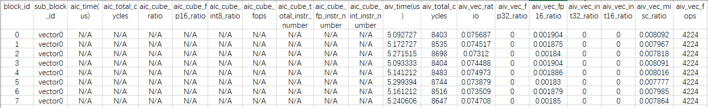
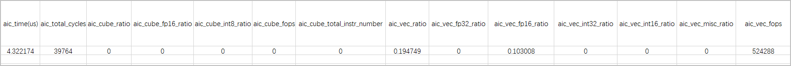
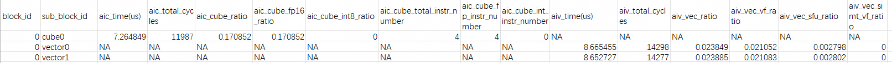
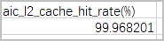
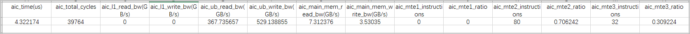
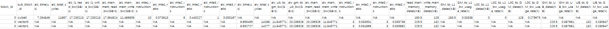
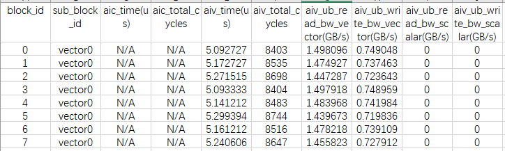
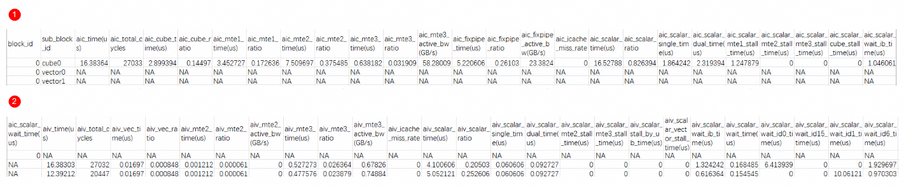
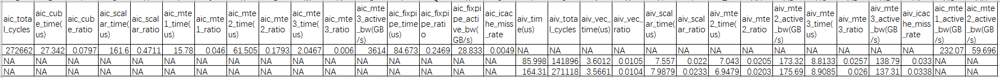
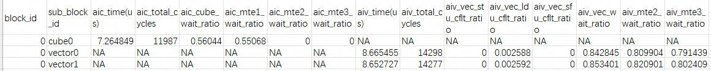

# msopprof模式性能数据

## ArithmeticUtilization（Cube及Vector类型指令耗时和占比）

Cube及Vector类型指令的cycle占比数据ArithmeticUtilization.csv，建议优化算子逻辑，减少冗余计算指令。详情介绍请参见下表中的字段说明。

**<term>Atlas A3 训练系列产品/Atlas A3 推理系列产品</term>及<term>Atlas A2 训练系列产品/Atlas A2 推理系列产品</term>**

**图 1**  ArithmeticUtilization.csv文件  

关键字段说明如下。

**表 1**  字段说明

|字段名|字段解释|
|---|---|
|block_id|Task运行切分数量，对应Task运行时配置的核数。|
|sub_block_id|Block上Vector\Cube核的ID。|
|aic_time(us)|该Task被分配到每个AI Cube Core计算单元上后，每个AI Cube Core计算单元上的执行时间，单位us。|
|aic_total_cycles|该Task被分配到每个AI Cube Core计算单元上后，每个AI Cube Core计算单元上的执行的cycle总数。|
|aiv_time(us)|该Task被分配到每个AI Vector Core计算单元上后，每个AI Vector Core计算单元上的执行时间，单位us。|
|aiv_total_cycles|该Task被分配到每个AI Vector Core计算单元上后，每个AI Vector Core计算单元上的执行的cycle总数。|
|aic_cube_ratio|代表Cube单元指令的cycle数在total cycle数中的占用比。|
|aic_cube_fp16_ratio|代表Cube fp16类型指令的cycle数在total cycle数中的占用比。|
|aic_cube_int8_ratio|代表Cube int8类型指令的cycle数在total cycle数中的占用比。|
|aic_cube_fops|代表Cube类型的浮点运算数，即计算量，可用于衡量算法/模型的复杂度，其中fops表示floating point operations。|
|aic_cube_total_instr_number|代表Cube指令的总条数，包括fp和int类型。|
|aic_cube_fp_instr_number|代表Cube fp类型指令的总条数。|
|aic_cube_int_instr_number|代表Cube int类型指令的总条数。|
|aiv_vec_ratio|代表Vec单元指令的cycle数在total cycle数中的占用比。|
|aiv_vec_fp32_ratio|代表Vec fp32类型指令的cycle数在total cycle数中的占用比。|
|aiv_vec_fp16_ratio|代表Vec fp16类型指令的cycle数在total cycle数中的占用比。|
|aiv_vec_int32_ratio|代表Vec int32类型指令的cycle数在total cycle数中的占用比。|
|aiv_vec_int16_ratio|代表Vec int16类型指令的cycle数在total cycle数中的占用比。|
|aiv_vec_misc_ratio|代表Vec misc类型指令的cycle数在total cycle数中的占用比。|
|aiv_vec_fops|代表Vector类型浮点运算数，即计算量，可用于衡量算法/模型的复杂度，其中fops表示floating point operations。|

**<term>Atlas 推理系列产品</term>**

**图 2**  ArithmeticUtilization.csv文件  

关键字段说明如下。

**表 2**  字段说明

|字段名|字段解释|
|---|---|
|aic_time(us)|该Task被分配到每个AI Core计算单元上后，每个AI Core计算单元上的执行时间，单位us。|
|aic_total_cycles|该Task被分配到每个AI Core计算单元上后，每个AI Core计算单元上的执行的cycle总数。|
|aic_cube_ratio|代表Cube单元指令的cycle数在total cycle数中的占用比。|
|aic_cube_fp16_ratio|代表Cube fp16类型指令的cycle数在total cycle数中的占用比。|
|aic_cube_int8_ratio|代表Cube int8类型指令的cycle数在total cycle数中的占用比。|
|aic_cube_fops|代表Cube类型的浮点运算数，即计算量，可用于衡量算法/模型的复杂度，其中fops表示floating point operations。|
|aic_cube_total_instr_number|代表Cube指令的总条数，包括fp和int类型。|
|aic_vec_ratio|代表Vec单元指令的cycle数在total cycle数中的占用比。|
|aic_vec_fp32_ratio|代表Vec fp32类型指令的cycle数在total cycle数中的占用比。|
|aic_vec_fp16_ratio|代表Vec fp16类型指令的cycle数在total cycle数中的占用比。|
|aic_vec_int32_ratio|代表Vec int32类型指令的cycle数在total cycle数中的占用比。|
|aic_vec_int16_ratio|代表Vec int16类型指令的cycle数在total cycle数中的占用比。|
|aic_vec_misc_ratio|代表Vec misc类型指令的cycle数在total cycle数中的占用比。|
|aic_vec_fops|代表Vector类型浮点运算数，即计算量，可用于衡量算法/模型的复杂度，其中fops表示floating point operations。|

**Ascend 950 系列产品**

**图 3**  ArithmeticUtilization.csv文件  

关键字段说明如下。

**表 3**  字段说明

|字段名|字段解释|
|---|---|
|block_id|Task运行切分数量，对应Task运行时配置的核数。|
|sub_block_id|Block上Vector\Cube核的ID。|
|aic_time(us)|该Task被分配到每个AI Cube Core计算单元上后，每个AI Cube Core计算单元上的执行时间，单位us。|
|aic_total_cycles|该Task被分配到每个AI Cube Core计算单元上后，每个AI Cube Core计算单元上的执行的cycle总数。|
|aic_cube_ratio|代表Cube单元指令的cycle数在total cycle数中的占用比。|
|aic_cube_fp_ratio|代表Cube fp类型指令的cycle数在total cycle数中的占用比。|
|aic_cube_int_ratio|代表Cube int类型指令的cycle数在total cycle数中的占用比。|
|aic_cube_total_instr_number|代表Cube指令的总条数，包括fp和int类型。|
|aic_cube_fp_instr_number|代表Cube fp类型指令的总条数。|
|aic_cube_int_instr_number|代表Cube int类型指令的总条数。|
|aiv_time(us)|该Task被分配到每个AI Vector Core计算单元上后，每个AI Vector Core计算单元上的执行时间，单位us。|
|aiv_total_cycles|该Task被分配到每个AI Vector Core计算单元上后，每个AI Vector Core计算单元上的执行的cycle总数。|
|aiv_vec_ratio|代表Vec单元指令的cycle数在total cycle数中的占用比。|
|aiv_vec_vf_ratio|代表Vec vf类型指令的cycle数在total cycle数中的占用比。|
|aiv_vec_sfu_ratio|代表Vec sfu类型指令的cycle数在total cycle数中的占用比。|
|aiv_vec_simt_vf_ratio|代表Vec simt vf类型指令的cycle数在total cycle数中的占用比。|

## L2Cache（L2 Cache命中率）

L2 Cache命中率数据L2Cache.csv，影响MTE2（Memory Transfer Engine，数据搬入单元），建议合理规划数据搬运逻辑，增加命中率。详情介绍请参见下表中的字段说明。

**<term>Atlas A3 训练系列产品/Atlas A3 推理系列产品</term>和<term>Atlas A2 训练系列产品/Atlas A2 推理系列产品</term>**

**图 1**  L2Cache.csv文件  

关键字段说明如下。

**表 1**  字段说明

|字段名|字段解释|
|---|---|
|block_id|Task运行切分数量，对应Task运行时配置的核数。|
|sub_block_id|Task运行使用的每个block名称和序号。|
|aic_time(us)|该Task被分配到每个AI Cube Core计算单元上后，每个AI Cube Core计算单元上的执行时间，单位us。|
|aic_total_cycles|该Task被分配到每个AI Cube Core计算单元上后，每个AI Cube Core计算单元上的执行的cycle总数。|
|aiv_time(us)|该Task被分配到每个AI Vector Core计算单元上后，每个AI Vector Core计算单元上的执行时间，单位us。|
|aiv_total_cycles|该Task被分配到每个AI Vector Core计算单元上后，每个AI Vector Core计算单元上的执行的cycle总数。|
|ai*_write_cache_hit|写cache命中的次数。|
|ai*_write_cache_miss_allocate|写cache缺失后重新分配缓存的次数。|
|ai*_r*_read_cache_hit|读r*通道cache命中次数。|
|ai*_r*_read_cache_miss_allocate|读r*通道cache缺失后重新分配的次数。|
|ai*_write_hit_rate(%)|写cache命中率。|
|ai*_read_hit_rate(%)|读cache命中率。|
|ai*_total_hit_rate(%)|读/写cache命中率。|

**<term>Atlas 推理系列产品</term>**

**图 2**  L2Cache.csv文件  

关键字段说明如下。

**表 2**  字段说明

|字段名|字段解释|
|---|---|
|aic_l2_cache_hit_rate(%)|内存访问请求命中L2次数与总次数的比值。|

**Ascend 950 系列产品**

**图 3**  L2Cache.csv文件  

关键字段说明如下。

**表 3**  字段说明

| 字段名                 | 字段解释                                                               |
|------------------------|------------------------------------------------------------------------|
| block_id               | Task运行切分数量，对应Task运行时配置的核数。                           |
| sub_block_id           | Task运行使用的每个block名称和序号。                                    |
| aic_time(us)           | 该Task被分配到每个AI Cube Core计算单元上后，每个AI Cube Core计算单元上的执行时间，单位us。 |
| aic_total_cycles       | 该Task被分配到每个AI Cube Core计算单元上后，每个AI Cube Core计算单元上的执行的cycle总数。  |
| aiv_time(us)           | 该Task被分配到每个AI Vector Core计算单元上后，每个AI Vector Core计算单元上的执行时间，单位us。 |
| aiv_total_cycles       | 该Task被分配到每个AI Vector Core计算单元上后，每个AI Vector Core计算单元上的执行的cycle总数。  |
| ai*_read_close_hit     | 读close cache命中次数。                                                |
| ai*_read_close_miss    | 读close cache缺失次数。                                                |
| ai*_read_close_victim  | 读close cache驱逐次数。                                                |
| ai*_read_far_hit       | 读far cache命中次数。                                                  |
| ai*_read_far_miss      | 读far cache缺失次数。                                                  |
| ai*_read_far_victim    | 读far cache驱逐次数。                                                  |
| ai*_read_hit_rate(%)   | 读cache命中率。                                                        |
| ai*_write_close_hit    | 写close cache命中次数。                                                |
| ai*_write_close_miss   | 写close cache缺失次数。                                                |
| ai*_write_close_victim | 写close cache驱逐次数。                                                |
| ai*_write_far_hit      | 写far cache命中次数。                                                  |
| ai*_write_far_miss     | 写far cache缺失次数。                                                  |
| ai*_write_far_victim   | 写far cache驱逐次数。                                                  |
| ai*_write_hit_rate(%)  | 写cache命中率。                                                        |

## Memory（内存读写带宽速率）

UB/L1/L2/主存储器采集内存读写带宽速率数据Memory.csv。详情介绍请参见下表中的字段说明。

单位GB/s表示每秒传输1GB的数据量。

**<term>Atlas A3 训练系列产品/Atlas A3 推理系列产品</term>及<term>Atlas A2 训练系列产品/Atlas A2 推理系列产品</term>**

**图 1**  Memory.csv文件  

关键字段说明如下。

**表 1**  字段说明

|字段名|字段解释|
|---|---|
|block_id|Task运行切分数量，对应Task运行时配置的核数。|
|sub_block_id|Task运行使用的每个block名称和序号。|
|aic_time(us)|该Task被分配到每个AI Cube Core计算单元上后，每个AI Cube Core计算单元上的执行时间，单位us。|
|aic_total_cycles|该Task被分配到每个AI Cube Core计算单元上后，每个AI Cube Core计算单元上的执行的cycle总数。|
|aiv_time(us)|该Task被分配到每个AI Vector Core计算单元上后，每个AI Vector Core计算单元上的执行时间，单位us。|
|aiv_total_cycles|该Task被分配到每个AI Vector Core计算单元上后，每个AI Vector Core计算单元上的执行的cycle总数。|
|aiv_ub_to_gm_bw(GB/s)|代表ub向gm写入的数据量对应total cycle的带宽速率，单位GB/s。|
|aiv_gm_to_ub_bw(GB/s)|代表gm向ub写入的数据量对应total cycle的带宽速率，单位GB/s。|
|aic_l1_read_bw(GB/s)|代表本算子中l1单元读取其他所有单元数据时，对应的total cycle的带宽速率，单位GB/s。|
|aic_l1_write_bw(GB/s)|代表本算子中l1单元写入其他所有单元数据时，对应的total cycle的带宽速率，单位GB/s。|
|ai*_main_mem_read_bw(GB/s)|代表主存储器读取其他所有单元数据时，对应的total cycle的带宽速率，单位GB/s。|
|ai*_main_mem_write_bw(GB/s)|代表主存储器写入其他所有单元数据时，对应的total cycle的带宽速率，单位GB/s。|
|aic_mte1_instructions|代表MTE1类型指令条数。|
|aic_mte1_ratio|代表MTE1类型指令的cycle数在total cycle数中的占用比。|
|ai*_mte2_instructions|代表MTE2类型指令条数。|
|ai*_mte2_ratio|代表MTE2类型指令的cycle数在total cycle数中的占用比。|
|ai*_mte3_instructions|代表MTE3类型指令条数。|
|ai*_mte3_ratio|代表MTE3类型指令的cycle数在total cycle数中的占用比。|
|read_main_memory_datas(KB)|读主存储器数据总量。|
|write_main_memory_datas(KB)|写主存储器数据总量。|
|GM_to_L1_datas(KB)|GM到L1的数据搬运量。|
|L1_to_GM_datas(KB)(estimate)|L1到GM的数据搬运量，估算值。|
|L0C_to_L1_datas(KB)|L0C到L1的数据搬运量。|
|L0C_to_GM_datas(KB)|L0C到GM的数据搬运量。|
|GM_to_UB_datas(KB)|GM到UB的数据搬运量。|
|UB_to_GM_datas(KB)|UB到GM的数据搬运量。|
|GM_to_L1_bw_usage_rate(%)|GM到L1通路带宽使用率。|
|L1_to_GM_bw_usage_rate(%)(estimate)|L1到GM通路带宽使用率，估算值。|
|L0C_to_L1_bw_usage_rate(%)|L0C到L1通路带宽使用率。|
|L0C_to_GM_bw_usage_rate(%)|L0C到GM通路带宽使用率。|
|GM_to_UB_bw_usage_rate(%)|GM到UB通路带宽使用率。|
|UB_to_GM_bw_usage_rate(%)|UB到GM通路带宽使用率。|

**<term>Atlas 推理系列产品</term>**

**图 2**  Memory.csv文件  

关键字段说明如下。

**表 2**  字段说明

|字段名|字段解释|
|---|---|
|aic_time(us)|该Task被分配到每个AI Core计算单元上后，每个AI Core计算单元上的执行时间，单位us。|
|aic_total_cycles|该Task被分配到每个AI Core计算单元上后，每个AI Core计算单元上的执行的cycle总数。|
|aic_ub_to_gm_bw(GB/s)|代表ub向gm写入的数据量对应total cycle的带宽速率，单位GB/s。|
|aic_gm_to_ub_bw(GB/s)|代表gm向ub写入的数据量对应total cycle的带宽速率，单位GB/s。|
|aic_l1_read_bw(GB/s)|代表本算子中l1单元读取其他所有单元数据时，对应的total cycle的带宽速率，单位GB/s。|
|aic_l1_write_bw(GB/s)|代表本算子中l1单元写入其他所有单元数据时，对应的total cycle的带宽速率，单位GB/s。|
|aic_main_mem_read_bw(GB/s)|代表主存储器读取其他所有单元数据时，对应的total cycle的带宽速率，单位GB/s。|
|aic_main_mem_write_bw(GB/s)|代表主存储器写入其他所有单元数据时，对应的total cycle的带宽速率，单位GB/s。|
|aic_mte1_instructions|代表MTE1类型指令条数。|
|aic_mte1_ratio|代表MTE1类型指令的cycle数在total cycle数中的占用比。|
|aic_mte2_instructions|代表MTE2类型指令条数。|
|aic_mte2_ratio|代表MTE2类型指令的cycle数在total cycle数中的占用比。|
|aic_mte3_instructions|代表MTE3类型指令条数。|
|aic_mte3_ratio|代表MTE3类型指令的cycle数在total cycle数中的占用比。|

**Ascend 950 系列产品**

**图 3**  Memory.csv文件  

关键字段说明如下。

**表 3**  字段说明

|字段名|字段解释|
|--|--|
|block_id|Task运行切分数量，对应Task运行时配置的核数。|
|sub_block_id|Task运行使用的每个block名称和序号。|
|aic_time(us)|该Task被分配到每个AI Cube Core计算单元上后，每个AI Cube Core计算单元上的执行时间，单位us。|
|aic_total_cycles|该Task被分配到每个AI Cube Core计算单元上后，每个AI Cube Core计算单元上的执行的cycle总数。|
|aiv_time(us)|该Task被分配到每个AI Vector Core计算单元上后，每个AI Vector Core计算单元上的执行时间，单位us。|
|aiv_total_cycles|该Task被分配到每个AI Vector Core计算单元上后，每个AI Vector Core计算单元上的执行的cycle总数。|
|aiv_ub_to_gm_bw(GB/s)|代表ub向gm写入的数据量对应total cycle的带宽速率，单位GB/s。|
|aiv_gm_to_ub_bw(GB/s)|代表gm向ub写入的数据量对应total cycle的带宽速率，单位GB/s。|
|aic_l1_read_bw(GB/s)|代表本算子中l1单元读取其他所有单元数据时，对应的total cycle的带宽速率，单位GB/s。|
|aic_l1_write_bw(GB/s)|代表本算子中l1单元写入其他所有单元数据时，对应的total cycle的带宽速率，单位GB/s。|
|ai*_main_mem_read_bw(GB/s)|代表主存储器读取其他所有单元数据时，对应的total cycle的带宽速率，单位GB/s。|
|ai*_main_mem_write_bw(GB/s)|代表主存储器写入其他所有单元数据时，对应的total cycle的带宽速率，单位GB/s。|
|aic_mte1_instructions|代表MTE1类型指令条数。|
|aic_mte1_ratio|代表MTE1类型指令的cycle数在total cycle数中的占用比。|
|ai*_mte2_instructions|代表MTE2类型指令条数。|
|ai*_mte2_ratio|代表MTE2类型指令的cycle数在total cycle数中的占用比。|
|ai*_mte3_instructions|代表MTE3类型指令条数。|
|ai*_mte3_ratio|代表MTE3类型指令的cycle数在total cycle数中的占用比。|
|read_main_memory_datas(KB)|读主存储器数据总量。|
|write_main_memory_datas(KB)|写主存储器数据总量。|
|GM_to_L1_datas(KB)|GM到L1的数据搬运量。|
|L0C_to_L1_datas(KB)|L0C到L1的数据搬运量。|
|L0C_to_GM_datas(KB)|L0C到GM的数据搬运量。|
|GM_to_UB_datas(KB)|GM到UB的数据搬运量。|
|UB_to_GM_datas(KB)|UB到GM的数据搬运量。|
|GM_to_L1_bw_usage_rate(%)|GM到L1通路带宽使用率。|
|L0C_to_L1_bw_usage_rate(%)|L0C到L1通路带宽使用率。|
|L0C_to_GM_bw_usage_rate(%)|L0C到GM通路带宽使用率。|
|GM_to_UB_bw_usage_rate(%)|GM到UB通路带宽使用率。|
|UB_to_GM_bw_usage_rate(%)|UB到GM通路带宽使用率。|

## MemoryL0（L0读写带宽速率）

L0A/L0B/L0C采集内存读写带宽速率数据MemoryL0.csv。详情介绍请参见下表中的字段说明。

单位GB/s表示每秒传输1GB的数据量。

**Atlas A3 训练系列产品/Atlas A3 推理系列产品和Atlas A2 训练系列产品/Atlas A2 推理系列产品以及Ascend 950 系列产品**

**图 1**  MemoryL0.csv文件  

关键字段说明如下。

**表 1**  字段说明

|字段名|字段解释|
|--|--|
|block_id|Task运行切分数量，对应Task运行时配置的核数。|
|sub_block_id|Task运行使用的每个block名称和序号。|
|aic_time(us)|该Task被分配到每个AI Cube Core计算单元上后，每个AI Cube Core计算单元上的执行时间，单位us。|
|aic_total_cycles|该Task被分配到每个AI Cube Core计算单元上后，每个AI Cube Core计算单元上的执行的cycle总数。|
|aiv_time(us)|该Task被分配到每个AI Vector Core计算单元上后，每个AI Vector Core计算单元上的执行时间，单位us。|
|aiv_total_cycles|该Task被分配到每个AI Vector Core计算单元上后，每个AI Vector Core计算单元上的执行的cycle总数。|
|aic_l0a_read_bw(GB/s)|代表本算子中l0a读取其他所有单元数据时，对应的total cycle的带宽速率，单位GB/s。|
|aic_l0a_write_bw(GB/s)|代表本算子中l0a写入其他所有单元数据时，对应的total cycle的带宽速率，单位GB/s。|
|aic_l0b_read_bw(GB/s)|代表本算子中l0b读取其他所有单元数据时，对应的total cycle的带宽速率，单位GB/s。|
|aic_l0b_write_bw(GB/s)|代表本算子中l0b写入其他所有单元数据时，对应的total cycle的带宽速率，单位GB/s。|
|aic_l0c_read_bw_cube(GB/s)|代表Cube从l0c读取的数据量对应total cycle的带宽速率，单位GB/s。|
|aic_l0c_write_bw_cube(GB/s)|代表Cube向l0c写入的数据量对应total cycle的带宽速率，单位GB/s。|

**<term>Atlas 推理系列产品</term>**

**图 2**  MemoryL0.csv文件  

关键字段说明如下。

**表 2**  字段说明

|字段名|字段解释|
|--|--|
|aic_time(us)|该Task被分配到每个AI Core计算单元上后，每个AI Core计算单元上的执行时间，单位us。|
|aic_total_cycles|该Task被分配到每个AI Core计算单元上后，每个AI Core计算单元上的执行的cycle总数。|
|aic_l0a_read_bw(GB/s)|代表本算子中l0a单元读取其他所有单元数据时，对应的total cycle的带宽速率，单位GB/s。|
|aic_l0a_write_bw(GB/s)|代表本算子中l0a单元写入其他所有单元数据时，对应的total cycle的带宽速率，单位GB/s。|
|aic_l0b_read_bw(GB/s)|代表本算子中l0b单元读取其他所有单元数据时，对应的total cycle的带宽速率，单位GB/s。|
|aic_l0b_write_bw(GB/s)|代表本算子中l0b单元写入其他所有单元数据时，对应的total cycle的带宽速率，单位GB/s。|
|aic_l0c_read_bw_cube(GB/s)|代表Cube从l0c读取的数据量对应total cycle的带宽速率，单位GB/s。|
|aic_l0c_write_bw_cube(GB/s)|代表Cube向l0c写入的数据量对应total cycle的带宽速率，单位GB/s。|
|aic_l0c_read_bw(GB/s)|代表Vector从l0c读取的数据量对应total cycle的带宽速率，单位GB/s。|
|aic_l0c_write_bw(GB/s)|代表Vector向l0c写入的数据量对应total cycle的带宽速率，单位GB/s。|

## MemoryUB（UB读写带宽速率）

mte/vector/scalar采集ub读写带宽速率数据MemoryUB.csv。详情介绍请参见下表中的字段说明。

单位GB/s表示每秒传输1GB的数据量。

**<term>Atlas A3 训练系列产品/Atlas A3 推理系列产品</term>及<term>Atlas A2 训练系列产品/Atlas A2 推理系列产品</term>**

**图 1**  MemoryUB.csv文件  

关键字段说明如下。

**表 1**  字段说明

|字段名|字段解释|
|--|--|
|block_id|Task运行切分数量，对应Task运行时配置的核数。|
|sub_block_id|Task运行使用的每个block名称和序号。|
|aic_time(us)|该Task被分配到每个AI Cube Core计算单元上后，每个AI Cube Core计算单元上的执行时间，单位us。|
|aic_total_cycles|该Task被分配到每个AI Cube Core计算单元上后，每个AI Cube Core计算单元上的执行的cycle总数。|
|aiv_time(us)|该Task被分配到每个AI Vector Core计算单元上后，每个AI Vector Core计算单元上的执行时间，单位us。|
|aiv_total_cycles|该Task被分配到每个AI Vector Core计算单元上后，每个AI Vector Core计算单元上的执行的cycle总数。|
|aiv_ub_read_bw_vector(GB/s)|代表Vector从UB读取的数据量对应total cycle的带宽速率，单位GB/s。|
|aiv_ub_write_bw_vector(GB/s)|代表Vector向UB写入的数据量对应total cycle的带宽速率，单位GB/s。|
|aiv_ub_read_bw_scalar(GB/s)|代表Scalar从UB读取的数据量对应total cycle的带宽速率，单位GB/s。|
|aiv_ub_write_bw_scalar(GB/s)|代表Scalar向UB写入的数据量对应total cycle的带宽速率，单位GB/s。|

**<term>Atlas 推理系列产品</term>**

**图 2**  MemoryUB.csv文件  

关键字段说明如下。

**表 2**  字段说明

|字段名|字段解释|
|--|--|
|aic_time(us)|该Task被分配到每个AI Core计算单元上后，每个AI Core计算单元上的执行时间，单位us。|
|aic_total_cycles|该Task被分配到每个AI Core计算单元上后，每个AI Core计算单元上的执行的cycle总数。|
|aic_ub_read_bw_vector(GB/s)|代表Vector从UB读取的数据量对应total cycle的带宽速率，单位GB/s。|
|aic_ub_write_bw_vector(GB/s)|代表Vector向UB写入的数据量对应total cycle的带宽速率，单位GB/s。|
|aic_ub_read_bw_scalar(GB/s)|代表Scalar从UB读取的数据量对应total cycle的带宽速率，单位GB/s。|
|aic_ub_write_bw_scalar(GB/s)|代表Scalar向UB写入的数据量对应total cycle的带宽速率，单位GB/s。|

**Ascend 950 系列产品**

**图 3**  MemoryUB.csv文件  

关键字段说明如下。

**表 3**  字段说明

|字段名|字段解释|
|--|--|
|block_id|Task运行切分数量，对应Task运行时配置的核数。|
|sub_block_id|Task运行使用的每个block名称和序号。|
|aic_time(us)|该Task被分配到每个AI Cube Core计算单元上后，每个AI Cube Core计算单元上的执行时间，单位us。|
|aic_total_cycles|该Task被分配到每个AI Cube Core计算单元上后，每个AI Cube Core计算单元上的执行的cycle总数。|
|aiv_time(us)|该Task被分配到每个AI Vector Core计算单元上后，每个AI Vector Core计算单元上的执行时间，单位us。|
|aiv_total_cycles|该Task被分配到每个AI Vector Core计算单元上后，每个AI Vector Core计算单元上的执行的cycle总数。|
|aiv_ub_read_bw_vector(GB/s)|代表Vector从UB读取的数据量对应total cycle的带宽速率，单位GB/s。|
|aiv_ub_write_bw_vector(GB/s)|代表Vector向UB写入的数据量对应total cycle的带宽速率，单位GB/s。|
|aiv_ub_write_bw_gm(GB/s)|代表GM向UB写入的数据量对应total cycle的带宽速率，单位GB/s。|
|aiv_ub_read_bw_gm(GB/s)|代表GM向UB读取的数据量对应total cycle的带宽速率，单位GB/s。|

## OpBasicInfo（算子基础信息）

算子基础信息数据OpBasicInfo.csv，包含算子名称，算子类型，Block Dim和耗时等信息。详情介绍请参见下表中的字段说明。

**图 1**  OpBasicInfo.csv文件  

关键字段说明如下。

**表 1**  字段说明

|字段名|字段解释|
|--|--|
|Op Name|算子名称。|
|Op Type|算子类型。|
|Task Duration(us)|Task耗时，包含调度到AI处理器的时间、AI处理器上的执行时间以及结束响应时间，单位us。|
|Block Dim|Task运行切分数量，对应Task运行时核数，开发者设置的算子执行逻辑核数。|
|Mix Block Dim|部分算子在Cube Core和Vector Core上同时执行，主AI处理器的blockDim在“Block Dim”字段中描述，可理解为Cube Core的数量，而从AI处理器的blockDim在本字段中描述，则可理解为Vector Core的数量。显示为N/A表示为非Mix融合算子。此参数仅适用于Atlas A3 训练系列产品/Atlas A3 推理系列产品和Atlas A2 训练系列产品/Atlas A2 推理系列产品以及Ascend 950 系列产品。|
|Device ID|运行时使用AI处理器的ID。|
|PID|算子运行时的进程号。|
|Current Freq|AI处理器当前运行的频率。|
|Rated Freq|AI处理器的理论频率。|

## PipeUtilization（计算单元和搬运单元耗时占比）

采集计算单元和搬运单元耗时和占比数据PipeUtilization.csv。建议优化数据搬运逻辑，提高带宽利用率。详情介绍请参见下表中的字段说明。

> [!NOTE] 
> 
> - 单位GB/s表示每秒传输1GB的数据量。
> - 表中的字段说明里每一个ratio的total cycle表示的是cube核或者vector核上的cycle数，其中ai*分为aic和aiv，aic指的是cube，aiv指的是vector。

**<term>Atlas A3 训练系列产品/Atlas A3 推理系列产品</term>和<term>Atlas A2 训练系列产品/Atlas A2 推理系列产品</term>**

**图 1**  PipeUtilization.csv文件  

关键字段说明如下。

**表 1**  字段说明

|字段名|字段解释|
|--|--|
|block_id|Task运行切分数量，对应Task运行时配置的核数。|
|sub_block_id|Task运行使用的每个block名称和序号。|
|aic_time(us)|该Task被分配到每个AI Cube Core计算单元上后，每个AI Cube Core计算单元上的执行时间，单位us。|
|aic_total_cycles|该Task被分配到每个AI Cube Core计算单元上后，每个AI Cube Core计算单元上的执行的cycle总数。|
|aiv_time(us)|该Task被分配到每个AI Vector Core计算单元上后，每个AI Vector Core计算单元上的执行时间，单位us。|
|aiv_total_cycles|该Task被分配到每个AI Vector Core计算单元上后，每个AI Vector Core计算单元上的执行的cycle总数。|
|aiv_vec_time(us)|代表vec类型指令（向量类运算指令）耗时。|
|aiv_vec_ratio|代表vec类型指令（向量类运算指令）的cycle数在total cycle数中的占用比。|
|aic_cube_time(us)|代表Cube类型指令（fp16及s16矩阵类运算指令）耗时。|
|aic_cube_ratio|代表Cube类型指令（fp16及s16矩阵类运算指令）的cycle数在total cycle数中的占用比。|
|ai*_scalar_time(us)|代表scalar类型指令（标量类运算指令）耗时。|
|ai*_scalar_single_time(us)|代表scalar类型指令（标量类运算指令）的单发（一拍发射一条指令）指令时间。|
|ai*_scalar_dual_time(us)|代表scalar类型指令（标量类运算指令）的双发（一拍发射两条指令）指令时间。|
|ai*_scalar_wait_time(us)|代表scalar类型指令（标量类运算指令）的核内wait指令阻塞的时间。|
|ai*_scalar_wait_id*_time(us)|代表scalar类型指令（标量类运算指令）的核间wait指令ID阻塞的时间。 “id*”为占位符，实际可对应ID0到ID15的任意核编号。 核间同步指标ai*_scalar_wait_id0_time到ai*_scalar_wait_id15_time仅在有数据的时候进行展示。|
|aic_scalar_mte1_stall_time(us)|代表scalar类型指令（标量类运算指令）因MTE1 IQ队列已满所造成的阻塞时间。|
|ai*_scalar_mte2_stall_time(us)|代表scalar类型指令（标量类运算指令）因MTE2 IQ队列已满所造成的阻塞时间。|
|ai*_scalar_mte3_stall_time(us)|代表scalar类型指令（标量类运算指令）因MTE3 IQ队列已满所造成的阻塞时间。|
|aic_scalar_cube_stall_time(us)|代表scalar类型指令（标量类运算指令）因CUBE IQ队列已满所造成的阻塞时间。|
|aiv_scalar_vector_stall_time(us)|代表scalar类型指令（标量类运算指令）因VECTOR IQ队列已满所造成的阻塞时间。|
|ai*_scalar_wait_ib_time(us)|代表scalar类型指令（标量类运算指令）的IB等待Icache时间。|
|aiv_scalar_stall_by_ub_time(us)|代表scalar类型指令（标量类运算指令）被UB阻塞的时间。|
|ai*_scalar_ratio|代表scalar类型指令（标量类运算指令）的cycle数在total cycle数中的占用比。|
|aic_fixpipe_time(us)|代表fixpipe类型指令（L0C->GM/L1搬运类指令）耗时。|
|aic_fixpipe_ratio|代表fixpipe类型指令（L0C->GM/L1搬运类指令）的cycle数在total cycle数中的占用比。|
|aic_mte1_time(us)|代表MTE1类型指令（L1->L0A/L0B搬运类指令）耗时，不包括搬运等待时间。|
|aic_mte1_ratio|代表MTE1类型指令（L1->L0A/L0B搬运类指令）的cycle数在total cycle数中的占用比。|
|ai*_mte2_time(us)|代表MTE2类型指令（GM->AICORE搬运类指令）耗时。|
|ai*_mte2_ratio|代表MTE2类型指令（GM->AICORE搬运类指令）的cycle数在total cycle数中的占用比。|
|ai*_mte3_time(us)|代表MTE3类型指令（AICORE->GM搬运类指令）耗时。|
|ai*_mte3_ratio|代表MTE3类型指令（AICORE->GM搬运类指令）的cycle数在total cycle数中的占用比。|
|ai*_icache_miss_rate|代表ICache缺失率，即未命中instruction的L1 cache，数值越小越好。|
|aic_mte3_active_bw(GB/s)|代表MTE3类型指令（AICORE->DDR CUBE搬运类指令）数据量对应active cycle的活跃带宽。|
|aiv_mte3_active_bw(GB/s)|代表MTE3类型指令（AICORE->DDR AIV搬运类指令）数据量对应active cycle的活跃带宽。|
|aic_fixpipe_active_bw(GB/s)|代表fixpipe类型指令（L0C->OUT/L1搬运类指令）数据量对应active cycle的活跃带宽。|
|aiv_mte2_active_bw(GB/s)|代表MTE2类型指令（DDR->AICORE AIV搬运类指令）数据量对应active cycle的活跃带宽。|
|aic_mte1_active_bw(GB/s)|代表Cube单元MTE1数据量对应active cycle的活跃带宽，具体涉及L1->L0A、L1->L0B这2个部分的通路数据。Atlas A3 训练系列产品/Atlas A3 推理系列产品和Atlas A2 训练系列产品/Atlas A2 推理系列产品仅开启动态插桩（设置--aic-metrics=MemoryDetail时）会显示。|
|aic_mte2_active_bw(GB/s)|代表Cube单元MTE2数据量对应active cycle的活跃带宽，具体涉及GM->L1、GM->L0A、GM->L0B这3条通路的数据。Atlas A3 训练系列产品/Atlas A3 推理系列产品和Atlas A2 训练系列产品/Atlas A2 推理系列产品仅开启动态插桩（设置--aic-metrics=MemoryDetail时）会显示。|

**<term>Atlas 推理系列产品</term>**

**图 2**  PipeUtilization.csv文件  

关键字段说明如下。

**表 2**  字段说明

|字段名|字段解释|
|--|--|
|aic_time(us)|该Task被分配到每个AI Core计算单元上后，每个AI Core计算单元上的执行时间，单位us。|
|aic_total_cycles|该Task被分配到每个AI Core计算单元上后，每个AI Core计算单元上的执行的cycle总数。|
|aic_cube_time(us)|代表Cube类型指令（fp16及s16矩阵类运算指令）耗时。|
|aic_cube_ratio|代表Cube类型指令（fp16及s16矩阵类运算指令）的cycle数在total cycle数中的占用比。|
|aic_scalar_time(us)|代表scalar类型指令（标量类运算指令）耗时。|
|aic_scalar_ratio|代表scalar类型指令（标量类运算指令）的cycle数在total cycle数中的占用比。|
|aic_mte1_time(us)|代表MTE1类型指令（L1->L0A/L0B搬运类指令）耗时，不包括搬运等待时间。|
|aic_mte1_ratio|代表MTE1类型指令（L1->L0A/L0B搬运类指令）的cycle数在total cycle数中的占用比。|
|aic_mte2_time(us)|代表MTE2类型指令（GM->AICORE搬运类指令）耗时。|
|aic_mte2_ratio|代表MTE2类型指令（GM->AICORE搬运类指令）的cycle数在total cycle数中的占用比。|
|aic_mte3_time(us)|代表MTE3类型指令（AICORE->GM搬运类指令）耗时。|
|aic_mte3_ratio|代表MTE3类型指令（AICORE->GM搬运类指令）的cycle数在total cycle数中的占用比。|
|aic_icache_miss_rate|代表ICache缺失率，即未命中instruction的L1 cache，数值越小越好。|
|aic_vec_time(us)|代表Vec类型指令（向量类运算指令）耗时。|
|aic_vec_ratio|代表Vec类型指令（向量类运算指令）的cycle数在total cycle数中的占用比。|

**Ascend 950 系列产品**

**图 3**  PipeUtilization.csv文件  

关键字段说明如下。

**表 3**  字段说明

|字段名|字段解释|
|--|--|
|block_id|Task运行切分数量，对应Task运行时配置的核数。|
|sub_block_id|Task运行使用的每个block名称和序号。|
|aic_time(us)|该Task被分配到每个AI Cube Core计算单元上后，每个AI Cube Core计算单元上的执行时间，单位us。|
|aic_total_cycles|该Task被分配到每个AI Cube Core计算单元上后，每个AI Cube Core计算单元上的执行的cycle总数。|
|aiv_time(us)|该Task被分配到每个AI Vector Core计算单元上后，每个AI Vector Core计算单元上的执行时间，单位us。|
|aiv_total_cycles|该Task被分配到每个AI Vector Core计算单元上后，每个AI Vector Core计算单元上的执行的cycle总数。|
|aiv_vec_time(us)|代表vec类型指令（向量类运算指令）耗时。|
|aiv_vec_ratio|代表vec类型指令（向量类运算指令）的cycle数在total cycle数中的占用比。|
|aic_cube_time(us)|代表Cube类型指令（fp16及s16矩阵类运算指令）耗时。|
|aic_cube_ratio|代表Cube类型指令（fp16及s16矩阵类运算指令）的cycle数在total cycle数中的占用比。|
|ai*_scalar_time(us)|代表scalar类型指令（标量类运算指令）耗时。|
|ai*_scalar_ratio|代表scalar类型指令（标量类运算指令）的cycle数在total cycle数中的占用比。|
|aic_fixpipe_time(us)|代表fixpipe类型指令（L0C->GM/L1搬运类指令）耗时。|
|aic_fixpipe_ratio|代表fixpipe类型指令（L0C->GM/L1搬运类指令）的cycle数在total cycle数中的占用比。|
|aic_mte1_time(us)|代表MTE1类型指令（L1->L0A/L0B搬运类指令）耗时，不包括搬运等待时间。|
|aic_mte1_ratio|代表MTE1类型指令（L1->L0A/L0B搬运类指令）的cycle数在total cycle数中的占用比。|
|ai*_mte2_time(us)|代表MTE2类型指令（GM->AICORE搬运类指令）耗时。|
|ai*_mte2_ratio|代表MTE2类型指令（GM->AICORE搬运类指令）的cycle数在total cycle数中的占用比。|
|ai*_mte3_time(us)|代表MTE3类型指令（AICORE->GM搬运类指令）耗时。|
|ai*_mte3_ratio|代表MTE3类型指令（AICORE->GM搬运类指令）的cycle数在total cycle数中的占用比。|
|ai*_icache_miss_rate|代表ICache缺失率，即未命中instruction的L1 cache，数值越小越好。|
 |aic_mte3_active_bw(GB/s)|代表MTE3类型指令（AICORE->DDR CUBE搬运类指令）的活跃带宽。|
 |aiv_mte3_active_bw(GB/s)|代表MTE3类型指令（AICORE->DDR AIV搬运类指令）的活跃带宽。|
 |aic_fixpipe_active_bw(GB/s)|代表fixpipe类型指令（L0C->OUT/L1搬运类指令）的活跃带宽。|
 |aiv_mte2_active_bw(GB/s)|代表MTE2类型指令（DDR->AICORE AIV搬运类指令）的活跃带宽。|
 |aic_mte1_active_bw(GB/s)|代表Cube单元MTE1的活跃带宽，具体涉及L1->L0A、L1->L0B这2个部分的通路数据。|
 |aic_mte2_active_bw(GB/s)|代表Cube单元MTE2的活跃带宽，具体涉及GM->L1、GM->L0A、GM->L0B这3条通路的数据。|

## ResourceConflictRatio（资源冲突占比）

UB上的bank group、bank conflict和资源冲突在所有指令中的占比数据ResourceConflictRatio.csv，建议减少对于同一个bank的读写冲突或bank group的读读冲突。

bank group是指UB中的一组bank，每个bank group包含多个bank。bank conflict是指在UB中同时访问相同bank的多个线程之间的竞争。

详情介绍请参见下表中的字段说明。

**<term>Atlas A3 训练系列产品/Atlas A3 推理系列产品</term>及<term>Atlas A2 训练系列产品/Atlas A2 推理系列产品</term>**

**图 1**  ResourceConflictRatio.csv文件  

关键字段说明如下。

**表 1**  字段说明

|字段名|字段解释|
|--|--|
|block_id|Task运行切分数量，对应Task运行时配置的核数。|
|sub_block_id|Task运行使用的每个block名称和序号。|
|aic_time(us)|该Task被分配到每个AI Cube Core计算单元上后，每个AI Cube Core计算单元上的执行时间，单位us。|
|aic_total_cycles|该Task被分配到每个AI Cube Core计算单元上后，每个AI Cube Core计算单元上的执行的cycle总数。|
|aiv_time(us)|该Task被分配到每个AI Vector Core计算单元上后，每个AI Vector Core计算单元上的执行时间，单位us。|
|aiv_total_cycles|该Task被分配到每个AI Vector Core计算单元上后，每个AI Vector Core计算单元上的执行的cycle总数。|
|aic_cube_wait_ratio|代表Cube单元被阻塞的cycle数在所有指令执行cycle数中占比。|
|aiv_vec_total_cflt_ratio|代表所有Vector执行的指令被阻塞的cycle数在所有指令执行cycle数中占比。|
|aiv_vec_bankgroup_cflt_ratio|代表Vector执行的指令被bankgroup冲突阻塞的cycle数在所有指令执行cycle数中占比。由于Vector指令的block stride的值设置不合理，造成bankgroup冲突。|
|aiv_vec_bank_cflt_ratio|代表Vector执行的指令被bank冲突阻塞的cycle数在所有指令执行cycle数中占比。由于Vector指令操作数的读写指针地址不合理，造成bank冲突。|
|aiv_vec_resc_cflt_ratio|代表Vector执行的指令被执行单元资源冲突阻塞的cycle数在所有指令执行cycle数中占比。当算子中涉及多个计算单元，应该尽量保证多个单元并发调度。当某个计算单元正在运行，但算子逻辑仍然往该单元下发指令，就会造成整体的算力没有得到充分应用。|
|aiv_vec_mte_cflt_ratio|代表Vector执行的指令被MTE冲突阻塞的cycle数在所有指令执行cycle数中占比。|
|aiv_vec_wait_ratio|代表Vector单元被阻塞的cycle数在所有指令执行cycle数中占比。|
|aic_mte1_wait_ratio|代表MTE1被阻塞的cycle数在所有指令执行cycle数中占比。|
|ai*_mte2_wait_ratio|代表MTE2被阻塞的cycle数在所有指令执行cycle数中占比。|
|ai*_mte3_wait_ratio|代表MTE3被阻塞的cycle数在所有指令执行cycle数中占比。|

**<term>Atlas 推理系列产品</term>**

**图 2**  ResourceConflictRatio.csv文件  

关键字段说明如下。

**表 2**  字段说明

|字段名|字段解释|
|--|--|
|aic_time(us)|该Task被分配到每个AI Core计算单元上后，每个AI Core计算单元上的执行时间，单位us。|
|aic_total_cycles|该Task被分配到每个AI Core计算单元上后，每个AI Core计算单元上的执行的cycle总数。|
|aic_cube_wait_ratio|代表Cube单元被阻塞的cycle数在所有指令执行cycle数中占比。|
|aic_vec_total_cflt_ratio|代表所有Vector执行的指令被阻塞的cycle数在所有指令执行cycle数中占比。|
|aic_vec_bankgroup_cflt_ratio|代表Vector执行的指令被bankgroup冲突阻塞的cycle数在所有指令执行cycle数中占比。由于Vector指令的block stride的值设置不合理，造成bankgroup冲突。|
|aic_vec_bank_cflt_ratio|代表Vector执行的指令被bank冲突阻塞的cycle数在所有指令执行cycle数中占比。由于Vector指令操作数的读写指针地址不合理，造成bank冲突。|
|aic_vec_resc_cflt_ratio|代表Vector执行的指令被执行单元资源冲突阻塞的cycle数在所有指令执行cycle数中占比。当算子中涉及多个计算单元，应该尽量保证多个单元并发调度。当某个计算单元正在运行，但算子逻辑仍然往该单元下发指令，就会造成整体的算力没有得到充分应用。|
|aic_vec_mte_cflt_ratio|代表Vector执行的指令被MTE冲突阻塞的cycle数在所有指令执行cycle数中占比。|
|aic_vec_wait_ratio|代表Vector单元被阻塞的cycle数在所有指令执行cycle数中占比。|
|aic_mte1_wait_ratio|代表MTE1被阻塞的cycle数在所有指令执行cycle数中占比。|
|aic_mte2_wait_ratio|代表MTE2被阻塞的cycle数在所有指令执行cycle数中占比。|
|aic_mte3_wait_ratio|代表MTE3被阻塞的cycle数在所有指令执行cycle数中占比。|

> [!NOTE]   
> 上表字段中的aic指的是AI Core。

**Ascend 950 系列产品**

**图 3**  ResourceConflictRatio.csv文件  

关键字段说明如下。

**表 3**  字段说明

|字段名|字段解释|
|--|--|
|block_id|Task运行切分数量，对应Task运行时配置的核数。|
|sub_block_id|Task运行使用的每个block名称和序号。|
|aic_time(us)|该Task被分配到每个AI Cube Core计算单元上后，每个AI Cube Core计算单元上的执行时间，单位us。|
|aic_total_cycles|该Task被分配到每个AI Cube Core计算单元上后，每个AI Cube Core计算单元上的执行的cycle总数。|
|aic_cube_wait_ratio|代表Cube单元被阻塞的cycle数在所有指令执行cycle数中占比。|
|aic_mte1_wait_ratio|代表MTE1被阻塞的cycle数在所有指令执行cycle数中占比。|
|aic_mte2_wait_ratio|代表MTE2被阻塞的cycle数在所有指令执行cycle数中占比。|
|aic_mte3_wait_ratio|代表MTE3被阻塞的cycle数在所有指令执行cycle数中占比。|
|aiv_time(us)|该Task被分配到每个AI Vector Core计算单元上后，每个AI Vector Core计算单元上的执行时间，单位us。|
|aiv_total_cycles|该Task被分配到每个AI Vector Core计算单元上后，每个AI Vector Core计算单元上的执行的cycle总数。|
|aiv_vec_stu_cflt_ratio|代表Vector执行的指令set值时阻塞的cycle数在所有指令执行cycle数中占比。|
|aiv_vec_ldu_cflt_ratio|代表Vector执行的指令load值时阻塞的cycle数在所有指令执行cycle数中占比。|
|aiv_vec_sfu_cflt_ratio|代表Vector执行的指令读、写冲突阻塞的cycle数在所有指令执行cycle数中占比。|
|aiv_vec_wait_ratio|代表Vector单元被阻塞的cycle数在所有指令执行cycle数中占比。|
|aiv_mte2_wait_ratio|代表MTE2被阻塞的cycle数在所有指令执行cycle数中占比。|
|aiv_mte3_wait_ratio|代表MTE3被阻塞的cycle数在所有指令执行cycle数中占比。|
