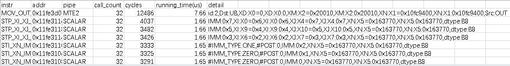

# msopprof simulator模式性能数据

## 概述

msOpProf simulator运行模式通过仿真器对算子进行指令级性能仿真，采集完成后会在指定的`--output`目录下生成以`OPPROF_{timestamp}_XXX`命名的文件夹，输出以下性能数据文件。

**输出目录结构：**

```text
OPPROF_{timestamp}_XXX
├── dump                                        // 原始仿真dump数据存放文件夹
└── simulator                                   // dump数据解析结果存放文件夹
    ├── core0.veccore0                          // 各核的数据文件目录
    │   ├── core0.veccore0_code_exe.csv         // 该核的代码行耗时数据文件
    │   ├── core0.veccore0_instr_exe.csv        // 该核的代码指令信息文件
    │   └── trace.json                          // 该核的仿真指令流水图文件
    ├── core0.veccore1
    │   ├── core0.veccore1_code_exe.csv
    │   ├── core0.veccore1_instr_exe.csv
    │   └── trace.json
    ├── ...
    ├── visualize_data.bin                      // 仿真流水图和热点函数可视化文件
    └── trace.json                              // 全部核的仿真指令流水图汇总文件
```

> **说明：**
> 
> - 目录按`core*.veccore*`（Vector Core）或`core*.cubecore*`（Cube Core）格式存放各计算单元的数据。
> - 多算子场景下，csv 文件名会增加时序后缀，如`core*_code_exe_20240429111143146.csv`。
> - 单算子场景下，`visualize_data.bin`和汇总`trace.json`位于`simulator/`根目录。

---

## 代码行耗时数据文件

代码行耗时数据文件为`core*_code_exe.csv`，*代表核编号（0~n），存放各计算单元上每条代码行的执行耗时信息，协助用户快速定位代码中最耗时的部分。

**图 1** core*_code_exe.csv文件


**表 1** 字段说明

| 字段名 | 字段解释 |
|--------|----------|
| code | 代码行，格式为`代码文件路径:行号`。 |
| call_count | 对应代码行所涉及指令的调用次数。 |
| cycles | 该代码行所涉及的指令在AI Vector Core/AI Cube Core上执行的cycle总数。 |
| running_time(us) | 代码行的有效执行时间，单位μs。 |

---

## 代码指令信息文件

代码指令详细信息文件为`core*_instr_exe.csv`，*代表核编号（0~n），存放各计算单元上每条指令的详细执行信息，协助用户识别最耗时的单条指令。

**图 2** core*_instr_exe.csv文件



**表 2** 字段说明

| 字段名 | 字段解释 |
|--------|----------|
| instr | 代码指令名称。 |
| addr | 代码指令对应的PC地址。 |
| pipe | PIPE类型，包括指令队列（MTE1/MTE2/MTE3）和计算单元（VEC/CUBE）。 |
| call_count | 该指令的调用次数。 |
| cycles | 该指令在AI Vector Core/AI Cube Core上执行的cycle总数。 |
| running_time(us) | 指令的有效执行时间，单位μs。 |
| detail | 指令执行的详细参数，如数据搬运的源/目的地址、长度、步幅等。 |

---

## 可视化数据文件（visualize_data.bin）

`visualize_data.bin`文件为仿真性能数据的可视化呈现文件，需导入MindStudio Insight进行查看。导入后可展示以下内容：

| 功能 | 说明 |
|------|------|
| 指令流水图 | 以指令维度展示时序关系，并关联调用栈快速定位瓶颈。 |
| 算子代码热点图 | 展示算子源码与指令集的映射关系及耗时情况，协助识别热点代码。 |

**图 3** 算子代码热点图示例


关于MindStudio Insight的导入操作，请参见《MindStudio Insight用户指南》的"[导入性能数据](https://gitcode.com/Ascend/msinsight/blob/master/docs/zh/user_guide/basic_operations.md#%E5%AF%BC%E5%85%A5%E6%95%B0%E6%8D%AE)"章节。

---

## 指令流水图文件（trace.json）

`trace.json`文件为仿真指令流水图的原始数据文件，包括各核的子文件（位于`core*.veccore*/`或`core*.cubecore*/`目录下）以及全部核的汇总文件（位于`simulator/`根目录下）。

`trace.json`可通过以下两种方式查看：

- **Chrome浏览器**：在Chrome地址栏输入`chrome://tracing`，将`trace.json`文件拖入窗口即可查看。

    **图 4** Chrome浏览器查看指令流水图

    

    使用快捷键（W：放大，S：缩小，A：左移，D：右移）可进行浏览。
- **MindStudio Insight**：将`trace.json`导入MindStudio Insight进行可视化呈现，展示内容包括指令流水时序以及各PIPE的执行状态。

> **说明：**
> 
> - 单核的`trace.json`文件仅展示该核的指令流水。
> - 汇总的`trace.json`文件展示所有核的指令流水汇总。
> - 若用户仅需关注部分算子性能，可在单核内调用`TRACE_START`和`TRACE_STOP`接口，并在编译配置文件中添加`-DASCENDC_TRACE_ON`，即可生成指定范围内的流水图信息。具体接口参见《Ascend C算子开发接口》中的"[算子调测API](https://www.hiascend.com/document/detail/zh/canncommercial/83RC1/API/ascendcopapi/atlasascendc_api_07_1212.html)"。
