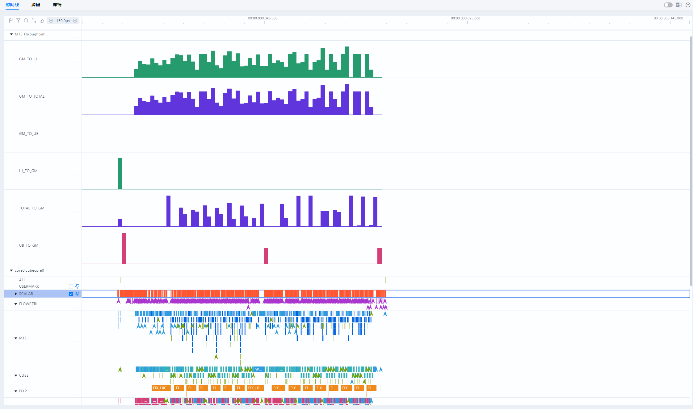

# msopprof simulator模式用户指南

## 简介

MindStudio Ops Profiler（算子调优工具，msOpProf）用于采集和分析运行在AI处理器上算子的关键性能指标，用户可根据输出的性能数据，快速定位算子的软、硬件性能瓶颈，提升算子性能的分析效率。

当前支持基于上板（msopprof）或仿真（msopprof simulator）运行模式和不同文件形式（可执行文件或算子二进制.o文件）进行性能数据的采集和自动解析。本文档介绍msopprof simulator运行模式的使用。

**功能特性**

通过MindStudio Insight展示指令流水图、算子代码热点图、内存通路吞吐率波形图以及性能数据文件等单算子调优能力，具体请参考[**表 1**  msopprof simulator模式功能特性](#simulator模式功能特性)。

**表 1**  msopprof simulator模式功能特性<a id="simulator模式功能特性"></a>

|功能|链接|
|---|---|
|指令流水图|[指令流水图](#指令流水图)|
|算子代码热点图|[算子代码热点图](#算子代码热点图)|
|内存通路吞吐率波形图|[内存通路吞吐率波形图](#内存通路吞吐率波形图)|
|性能数据文件|[msopprof simulator性能数据](./msopprof_simulator_performance_data.md)|

**调用场景**

| 调用场景 | 参考章节 |
| --- | --- |
| Kernel直调场景 | [Kernel直调场景](https://gitcode.com/Ascend/msopprof/blob/master/docs/zh/user_guide/msopprof_usage.md#采集kernel直调方式ascend-c算子的性能数据) |
| 单算子API调用场景 | [单算子API调用场景](https://gitcode.com/Ascend/msopprof/blob/master/docs/zh/user_guide/msopprof_usage.md#采集API调用单算子的性能数据) |
| PyTorch 框架接入算子 | [PyTorch 框架算子调用场景](https://gitcode.com/Ascend/msopprof/blob/master/docs/zh/user_guide/msopprof_usage.md#采集PyTorch框架算子的性能数据) |
| Triton-Ascend 算子 | [Triton 算子调用场景](https://gitcode.com/Ascend/msopprof/blob/master/docs/zh/user_guide/msopprof_usage.md#采集triton算子的性能数据) |
| catlass算子 | [catlass算子调用场景](https://gitcode.com/Ascend/msopprof/blob/master/docs/zh/user_guide/msopprof_usage.md#采集catlass算子的性能数据) |

## 使用前准备

**环境准备**

- 请参考[MindStudio Ops Profiler安装指南](../install_guide/msopprof_install_guide.md)，完成相关环境变量的配置。
- 若要使用MindStudio Insight进行查看时，需要单独安装MindStudio Insight软件包，具体下载链接请参见[MindStudio Insight安装指南](https://gitcode.com/Ascend/msinsight/blob/master/docs/zh/user_guide/mindstudio_insight_install_guide.md)。
- 针对<term>Atlas A2 训练系列产品/Atlas A2 推理系列产品</term>，若要使用[模板库](https://gitcode.com/cann/catlass/blob/master/scripts/build.sh)进行仿真，编译脚本需增加选项--simulator，以simulator模式编译算子。具体操作请参见[链接](https://gitcode.com/cann/docs/1_Practice/evaluation_tools/performance_tools.md)。

    ```shell
    bash scripts/build.sh --simulator 00_basic_matmul
    ```

**使用约束**

- 性能数据采集时间建议在5min以内，同时推荐用户设置的内存大小在20G以上（例如容器配置：docker run --memory=20g  _容器名_）。
- 请确保性能数据保存在不含软链接的当前用户目录下，否则可能引起安全问题。

## 注意事项

- msOpProf工具的使用依赖CANN包中的msopprof可执行文件，该文件中的接口使用和msopprof一致，该文件为CANN包自带，无需单独安装。
- 通过键盘输入“CTRL+C”后，算子执行将会被停止，工具会根据当前已有信息生成性能数据文件。若不需要生成该文件，可再次键盘输入“CTRL+C”指令。
- 若未指定--output参数，需确保其他用户不具备当前路径的上一级目录的写入权限。
- 使用msopprof simulator之前，用户需保证app功能正常。
- 不支持在同一个Device侧同时拉起多个性能采集任务。
- 资料中的msopprof simulator的仿真结果仅供参考，算子真实的运行情况以用户的实际仿真数据为准。
- 用户需自行保证可执行文件或用户程序（_application_）执行的安全性。
    - 建议限制对可执行文件或用户程序（_application_）的操作权限，避免提权风险。
    - 不建议进行高危操作（删除文件、删除目录、修改密码及提权命令等），避免安全风险。

## 命令参考

登录运行环境，使用msopprof simulator开启算子仿真调优功能，并配合使用仿真可选参数和用户待调优程序（blockdim 1）进行调优，仿真可选参数请参考[**表 1**  msopprof simulator可选参数说明](#simulator可选参数说明)。

> [!NOTE]说明
> 参数 `--soc-version` 的值可通过执行以下命令获取：`python3 -c "import acl; print(acl.get_soc_name())"`。

```shell
msprof op simulator --soc-version=Ascendxxxyy --output=/home/projects/output /home/projects/MyApp/out/main blockdim 1   # --output为可选参数,/home/projects/MyApp/out/main为使用的app,blockdim 1为用户app的可选参数,xxxyy为用户实际使用的具体芯片类型
```

**表 1**  msopprof simulator可选参数说明<a id="simulator可选参数说明"></a>

<table><thead align="left"><tr id="zh-cn_topic_0000002016036877_row81111934143314"><th class="cellrowborder" valign="top" width="25.232523252325233%" id="mcps1.2.4.1.1"><p id="zh-cn_topic_0000002016036877_p0110173411337">可选参数</p>
</th>
<th class="cellrowborder" valign="top" width="63.02630263026302%" id="mcps1.2.4.1.2"><p id="zh-cn_topic_0000002016036877_p161111334143318">描述</p>
</th>
<th class="cellrowborder" valign="top" width="11.741174117411742%" id="mcps1.2.4.1.3"><p id="zh-cn_topic_0000002016036877_p3111163418335">是否必选</p>
</th>
</tr>
</thead>
<tbody><tr id="zh-cn_topic_0000002016036877_row01114348338"><td class="cellrowborder" valign="top" width="25.232523252325233%" headers="mcps1.2.4.1.1 "><p id="zh-cn_topic_0000002016036877_p41111934143316">--application</p>
</td>
<td class="cellrowborder" valign="top" width="63.02630263026302%" headers="mcps1.2.4.1.2 "><p id="zh-cn_topic_0000002016036877_p1411115342333">建议使用msprof op simulator <span>--soc-version=Ascendxxxyy</span> [<em id="zh-cn_topic_0000002016036877_i188155416131">msopprof  simulator参数</em>] ./app进行拉取，其中app为用户指定的可执行文件，如果app未指定路径，默认为使用当前路径，xxxyy为用户实际使用的具体芯片类型。</p>
<p id="p3606523135915">使用./app时，需将msopprof simulator的相关参数添加到./app前，以确保相关功能生效。</p>
<p id="p12488132815597">当前与./app [arguments]兼容，后期将修改为./app [arguments]。</p>
</td>
<td class="cellrowborder" rowspan="3" valign="top" width="11.741174117411742%" headers="mcps1.2.4.1.3 "><p id="zh-cn_topic_0000002016036877_p1511143418339">是，指定的可执行文件、--config和--export三选一</p>
</td>
</tr>
<tr id="zh-cn_topic_0000002016036877_row7113153443317"><td class="cellrowborder" valign="top" headers="mcps1.2.4.1.1 "><p id="zh-cn_topic_0000002016036877_p1411213413339">--config</p>
</td>
<td class="cellrowborder" valign="top" headers="mcps1.2.4.1.2 "><p id="zh-cn_topic_0000002016036877_p011233417332"><span>配置为算子编译得到的二进制文件</span><strong id="zh-cn_topic_0000002016036877_b695415337500">*.o</strong><span>，可配置为绝对路径或者相对路径</span>。<span>具体可参考</span><a href="./extended_functions.md#json配置文件说明">json配置文件说明</a><span>。</span></p>
<p id="zh-cn_topic_0000002016036877_p1611218349332">进行算子调优之前，可通过以下两种方式获取算子二进制<strong id="zh-cn_topic_0000002016036877_b1845814318519"><span>*.</span>o</strong>文件。</p>
<ul id="zh-cn_topic_0000002016036877_ul81131345339"><li>参考<span id="zh-cn_topic_0000002016036877_ph20112143419334">《Ascend C算子开发指南》</span>中的“Kernel直调算子开发 &gt; <a href="https://www.hiascend.com/document/detail/zh/canncommercial/83RC1/opdevg/Ascendcopdevg/atlas_ascendc_10_0056.html" target="_blank" rel="noopener noreferrer">Kernel直调</a> ”章节中的“修改并执行一键式编译运行脚本”，获取NPU侧可执行文件，并需要用户自行从可执行文件中提取<span>*</span>.o文件。</li><li>参考<a href="https://www.hiascend.com/document/detail/zh/mindstudio/82RC1/ODtools/Operatordevelopmenttools/atlasopdev_16_0024.html" target="_blank" rel="noopener noreferrer">算子编译部署</a>，算子编译时会自动生成<strong id="zh-cn_topic_0000002016036877_b17819952105016">*.o</strong>文件。</li></ul>
<p id="p811246204">需确保群组和其他组的用户不具备--config指定的json文件及上一级目录的写入权限。同时，需要确保json文件的上一级目录属主为当前用户。</p>
<div class="p" id="p20157517201">需要使用LD_LIBRARY_PATH环境变量设置仿真器类型。<pre class="screen" id="screen011316904">export LD_LIBRARY_PATH=${INSTALL_DIR}/tools/simulator/Ascendxxxyy/lib:$LD_LIBRARY_PATH // xxxyy为用户实际使用的具体芯片类型</pre>
</div>
</td>
</tr>
<tr id="zh-cn_topic_0000002016036877_row187671719318"><td class="cellrowborder" valign="top" headers="mcps1.2.4.1.1 "><p id="zh-cn_topic_0000002016036877_p57603310145">--export</p>
</td>
<td class="cellrowborder" valign="top" headers="mcps1.2.4.1.2 "><p id="zh-cn_topic_0000002016036877_p17896565218">指定包含单算子仿真结果文件夹，直接对该仿真结果进行解析，并通过<span id="zh-cn_topic_0000002016036877_ph8210104144115">MindStudio Insight</span>展示单算子单核或多核的指令流水图。</p>
<p id="p216011111118">注意事项：</p>
<ul id="ul57064715117"><li>该指定文件夹只允许存放多核数据及算子核函数文件aicore_binary.o，所以需要将--config中<span>配置的二进制文件名称（*.o）</span>手动修改为aicore_binary.o。</li><li>若用户仅提供dump文件，则指令流水图中将无法生成代码行映射，如需查看代码行，则需要在dump中存放aicore_binary.o名称的算子核函数文件。</li><li>需确保群组和其他组的用户不具备--export指定目录以及--export指定目录内所有文件的写入权限。同时，需要确保指定目录属主为当前用户。</li></ul>
</td>
</tr>
<tr id="zh-cn_topic_0000002016036877_row5113434173311"><td class="cellrowborder" valign="top" width="25.232523252325233%" headers="mcps1.2.4.1.1 "><p id="zh-cn_topic_0000002016036877_p13113153423318">--kernel-name</p>
</td>
<td class="cellrowborder" valign="top" width="63.02630263026302%" headers="mcps1.2.4.1.2 "><p id="zh-cn_topic_0000002016036877_p144881915145316">指定要采集的算子名称，支持使用算子名前缀进行模糊匹配。如果不指定，则只对程序运行过程中调度的第一个算子进行采集。</p>
<p id="p1096710195115">注意事项：</p>
<ul id="zh-cn_topic_0000002016036877_ul1548815153532"><li>需与--application配合使用，限制长度为1024，仅支持<strong id="zh-cn_topic_0000002016036877_b098232112217">A-Za-z0-9</strong>_中的一个或多个字符。</li><li>需要采集多个算子时，支持使用符号"|"进行拼接。例如，--kernel-name="add|abs"表示采集前缀名为add和abs的算子。</li><li>具体采集的算子数量由--launch-count参数值决定。</li><li>支持使用通配符（*）匹配任意长度字符。</li></ul>
</td>
<td class="cellrowborder" valign="top" width="11.741174117411742%" headers="mcps1.2.4.1.3 "><p id="zh-cn_topic_0000002016036877_p14113143410333">否</p>
</td>
</tr>
<tr id="zh-cn_topic_0000002016036877_row13114183413339"><td class="cellrowborder" valign="top" width="25.232523252325233%" headers="mcps1.2.4.1.1 "><p id="zh-cn_topic_0000002016036877_p211313417339">--launch-count</p>
</td>
<td class="cellrowborder" valign="top" width="63.02630263026302%" headers="mcps1.2.4.1.2 "><p id="zh-cn_topic_0000002016036877_p511416349331">设置可以采集算子的最大数量，默认值为1，取值范围为1~5000之间的整数。</p>
</td>
<td class="cellrowborder" valign="top" width="11.741174117411742%" headers="mcps1.2.4.1.3 "><p id="zh-cn_topic_0000002016036877_p21141343331">否</p>
</td>
</tr>
<tr id="zh-cn_topic_0000002016036877_row11115934143315"><td class="cellrowborder" valign="top" width="25.232523252325233%" headers="mcps1.2.4.1.1 "><p id="zh-cn_topic_0000002016036877_p611493416337">--aic-metrics</p>
</td>
<td class="cellrowborder" valign="top" width="63.02630263026302%" headers="mcps1.2.4.1.2 "><div class="p" id="zh-cn_topic_0000002016036877_p217535311423">使能算子性能指标采集。支持以下性能指标采集项。<ul id="zh-cn_topic_0000002016036877_ul17160143219116"><li>PipeUtilization（默认采集）：计算和搬运指令流水。<p id="p1253172210219">当配置--aic-metrics=PipeUtilization时会关闭ResourceConflictRatio，即只显示指令流水，不包括同步事件指令细节。</p>
</li><li>ResourceConflictRatio（默认采集）：开启可查看同步事件指令细节。<ul id="ul12706651330"><li><span id="zh-cn_topic_0000002016036877_zh-cn_topic_0000001740005657_ph38331631115919"><term id="term5706951931">Atlas A3 训练系列产品</term>/<term id="term770615512314">Atlas A3 推理系列产品</term></span>和<span id="zh-cn_topic_0000002016036877_ph9610350151414"><term id="term18706155236">Atlas A2 训练系列产品</term>/<term id="term5706551037">Atlas A2 推理系列产品</term></span>展示为SET_FLAG/WAIT_FLAG指令。</li><li><span id="zh-cn_topic_0000002016036877_ph12187735121517"><term id="term1670618515315">Atlas 推理系列产品</term></span>展示为set_event/wait_event指令。</li></ul>
</li></ul>
</div>
<ul id="zh-cn_topic_0000002016036877_ul21140347333"><li>PMSampling：使能内存通路吞吐率波形图，并进行可视化呈现，例如：<strong id="zh-cn_topic_0000002016036877_b1368923464413">--aic-metrics=PMSampling</strong>。具体呈现内容请参见<a href="#内存通路吞吐率波形图">内存通路吞吐率波形图</a>。<ul id="zh-cn_topic_0000002016036877_ul536462164812"><li>--core-id设置对PMSampling参数不生效，PMSampling参数解析全部核。</li><li>此功能默认不开启。</li></ul>
</li></ul>
</td>
<td class="cellrowborder" valign="top" width="11.741174117411742%" headers="mcps1.2.4.1.3 "><p id="zh-cn_topic_0000002016036877_p4115163416335">否</p>
</td>
</tr>
<tr id="zh-cn_topic_0000002016036877_row61391251175519"><td class="cellrowborder" valign="top" width="25.232523252325233%" headers="mcps1.2.4.1.1 "><p id="zh-cn_topic_0000002016036877_p8263535194219">--core-id</p>
</td>
<td class="cellrowborder" valign="top" width="63.02630263026302%" headers="mcps1.2.4.1.2 "><p id="zh-cn_topic_0000002016036877_p6422922184820">该参数适用于算子分布均匀的情况时，可使用--core-id参数指定部分逻辑核的id，解析部分核的仿真数据。</p>
<p id="zh-cn_topic_0000002016036877_p12184631113">核id的取值范围为[0,49]。</p>
<p id="p64136401232">若要解析多个核的仿真数据时，需要使用符号"|"进行拼接。例如，--core-id="0|31"表示解析核id为0和31的仿真数据。</p>
<p id="p112723421038">--core-id设置对PMSampling参数不生效，PMSampling参数解析全部核。</p>
</td>
<td class="cellrowborder" valign="top" width="11.741174117411742%" headers="mcps1.2.4.1.3 "><p id="zh-cn_topic_0000002016036877_p141391351105514">否</p>
</td>
</tr>
<tr id="zh-cn_topic_0000002016036877_row1776724510349"><td class="cellrowborder" valign="top" width="25.232523252325233%" headers="mcps1.2.4.1.1 "><p id="zh-cn_topic_0000002016036877_p18767164517348">--timeout</p>
</td>
<td class="cellrowborder" valign="top" width="63.02630263026302%" headers="mcps1.2.4.1.2 "><p id="zh-cn_topic_0000002016036877_p146394291703">该参数适用于数据量大且计算重复的算子，完整运行该类算子将会耗时很长，部分流水图即可获取必要信息。可通过设置--timeout参数缩短算子运行时长并获取必要流水信息<span>。具体实现如下：</span></p>
<ul id="zh-cn_topic_0000002016036877_ul12129256185219"><li>当仿真运行时间达到--timeout值时，<span>msOpProf</span>工具将会终止仿真进程并进入解析过程，只对已仿真的部分数据进行分析。同时，<span>msOpProf</span>工具将会展示以下打印信息：<pre class="code_wrap" codetype="ColdFusion" id="zh-cn_topic_0000002016036877_screen104875352479">[INFO]  The timeout has reached and the application will be forcibly killed.</pre>
</li><li>若进程正常结束时未达到timeout值，正常结束仿真程序并进入解析过程。</li></ul>
<p id="zh-cn_topic_0000002016036877_p05905923811">参数取值范围为1~2880之间的整数，单位为分钟。具体示例如下：</p>
<pre class="code_wrap" id="zh-cn_topic_0000002016036877_screen697132914484">msprof op simulator<strong id="zh-cn_topic_0000002016036877_b17229142131210"> </strong><span>--soc-version=Ascendxxxyy</span> --timeout=1 ./add_custom <span>/</span><span>/</span><strong id="zh-cn_topic_0000002016036877_b77321496128"><em id="zh-cn_topic_0000002016036877_i0732549181213"> </em></strong>xxxyy为用户实际使用的具体芯片类型</pre>
</td>
<td class="cellrowborder" valign="top" width="11.741174117411742%" headers="mcps1.2.4.1.3 "><p id="zh-cn_topic_0000002016036877_p177687454344">否</p>
</td>
</tr>
<tr id="zh-cn_topic_0000002016036877_row17115153411335"><td class="cellrowborder" valign="top" width="25.232523252325233%" headers="mcps1.2.4.1.1 "><p id="zh-cn_topic_0000002016036877_p151151034143316">--mstx</p>
</td>
<td class="cellrowborder" valign="top" width="63.02630263026302%" headers="mcps1.2.4.1.2 "><p id="zh-cn_topic_0000002016036877_p197151054181117">该参数决定算子调优工具是否使能用户代码程序中使用的mstx API。</p>
<p id="zh-cn_topic_0000002016036877_p161151134173317">默认为off，表示关闭对mstx API的使能。</p>
<p id="zh-cn_topic_0000002016036877_p18115834193315">当配置--mstx=on，算子调优工具将会使能用户代码程序中使用的mstx API。</p>
<p id="zh-cn_topic_0000002016036877_p151157346336">具体举例如下：</p>
<pre class="code_wrap" id="zh-cn_topic_0000002016036877_screen811523463318">msprof op simulator --soc-version=Ascendxxxyy --mstx=on ./add_custom <span>// </span>xxxyy为用户实际使用的具体芯片类型</pre>
<p id="zh-cn_topic_0000002016036877_p1776694422415">当前已支持mstx API中的mstxRangeStartA和mstxRangeEnd接口，功能为使能算子调优的指定区间，具体参数介绍请参见<span id="zh-cn_topic_0000002016036877_ph1583812516245">《MindStudio mstx API参考》</span>中的<span id="zh-cn_topic_0000002016036877_ph2878123711242"><a href="https://www.hiascend.com/document/detail/zh/mindstudio/82RC1/API/mstxAPIReference/atlasopdev_16_0117.html" target="_blank" rel="noopener noreferrer">mstxRangeStartA</a></span>和<span id="zh-cn_topic_0000002016036877_ph137651944162412"><a href="https://www.hiascend.com/document/detail/zh/mindstudio/82RC1/API/mstxAPIReference/atlasopdev_16_0118.html" target="_blank" rel="noopener noreferrer">mstxRangeEnd</a></span>接口。</p>
</td>
<td class="cellrowborder" valign="top" width="11.741174117411742%" headers="mcps1.2.4.1.3 "><p id="zh-cn_topic_0000002016036877_p131151034163318">否</p>
</td>
</tr>
<tr id="zh-cn_topic_0000002016036877_row51167346334"><td class="cellrowborder" valign="top" width="25.232523252325233%" headers="mcps1.2.4.1.1 "><p id="zh-cn_topic_0000002016036877_p191169342330">--mstx-include</p>
</td>
<td class="cellrowborder" valign="top" width="63.02630263026302%" headers="mcps1.2.4.1.2 "><p id="zh-cn_topic_0000002016036877_p20116734123316">该参数支持在<span>msOpProf</span>工具使能用户指定mstx API。</p>
<p id="zh-cn_topic_0000002016036877_p17496184815597">若不配置，则默认使能所有用户代码中使用的mstx API。</p>
<p id="zh-cn_topic_0000002016036877_p21163341332">若配置，--mstx-include仅使能用户指定的mstx API。--mstx-include的输入为用户调用mstx函数时传入的message字符串，多个字符串需使用"|"拼接。</p>
<p id="zh-cn_topic_0000002016036877_p15116334153320">具体举例如下：</p>
<pre class="code_wrap" id="zh-cn_topic_0000002016036877_screen171163344333">--mstx=on --mstx-include="hello|hi" //仅使能用户传入mstx函数中message参数为hello和hi的mstx API</pre>
<p id="p101653252417">不可单独配置，需要与--mstx配合使用。</p>
<p id="p1943922619417">仅支持message为A-Z a-z 0-9 _这些字符，使用"|"进行拼接。</p>
</td>
<td class="cellrowborder" valign="top" width="11.741174117411742%" headers="mcps1.2.4.1.3 "><p id="zh-cn_topic_0000002016036877_p2116334183316">否</p>
</td>
</tr>
<tr id="zh-cn_topic_0000002016036877_row14335144923717"><td class="cellrowborder" valign="top" width="25.232523252325233%" headers="mcps1.2.4.1.1 "><p id="zh-cn_topic_0000002016036877_p13335144910371">--soc-version</p>
</td>
<td class="cellrowborder" valign="top" width="63.02630263026302%" headers="mcps1.2.4.1.2 "><p id="zh-cn_topic_0000002016036877_p3169521144911">可以通过--soc-version或设置LD_LIBRARY_PATH环境变量来指定仿真器类型，两者必须二选一，具体介绍如下：</p>
<ul id="zh-cn_topic_0000002016036877_ul137711927194111"><li>--soc-version：用于在--application和--export模式下指定仿真器类型，选取范围可参考<span id="ph15854163318419">${INSTALL_DIR}</span>/tools/simulator路径下的仿真器类型。</li><li>设置LD_LIBRARY_PATH环境变量：用于在--config的模式下或未使用--soc-version的情况下指定仿真器的类型。<pre class="code_wrap" id="zh-cn_topic_0000002016036877_zh-cn_topic_0000001752643572_screen1774042011344">export LD_LIBRARY_PATH=<span id="ph585510335411">${INSTALL_DIR}</span>/tools/simulator/Ascend<em id="i6855163310419">xxxyy</em>/lib:$LD_LIBRARY_PATH </pre>
<p id="p18405124210413">${INSTALL_DIR}请替换为CANN软件安装后文件存储路径。以root用户安装为例，安装后文件默认存储路径为：/usr/local/Ascend/cann。</p>
</li></ul>
</td>
<td class="cellrowborder" valign="top" width="11.741174117411742%" headers="mcps1.2.4.1.3 "><p id="zh-cn_topic_0000002016036877_p17199526163813">否</p>
</td>
</tr>
<tr id="zh-cn_topic_0000002016036877_row111793417331"><td class="cellrowborder" valign="top" width="25.232523252325233%" headers="mcps1.2.4.1.1 "><p id="zh-cn_topic_0000002016036877_p011616341337">--output</p>
</td>
<td class="cellrowborder" valign="top" width="63.02630263026302%" headers="mcps1.2.4.1.2 "><p id="zh-cn_topic_0000002016036877_p15116133412338">收集到的性能数据的存放路径，默认在当前目录下保存性能数据。</p>
<p id="p3317358548">需确保群组和其他组的用户不具备--output指定输出路径的上一级目录的写入权限。同时，需要确保--output指定目录的上一级目录属主为当前用户。</p>
</td>
<td class="cellrowborder" valign="top" width="11.741174117411742%" headers="mcps1.2.4.1.3 "><p id="zh-cn_topic_0000002016036877_p1911711342338">否</p>
</td>
</tr>
<tr id="zh-cn_topic_0000002016036877_row104315393543"><td class="cellrowborder" valign="top" width="25.232523252325233%" headers="mcps1.2.4.1.1 "><p id="zh-cn_topic_0000002016036877_p102401740175414">--dump</p>
</td>
<td class="cellrowborder" valign="top" width="63.02630263026302%" headers="mcps1.2.4.1.2 "><p id="zh-cn_topic_0000002016036877_p18606195017712">控制仿真器dump文件是否生成。</p>
<p id="zh-cn_topic_0000002016036877_p3562736122116">选项包括开启（on）和关闭（off），默认情况下设置为关闭（off），即不生成仿真器dump文件。</p>
<p id="p195771271259">注意事项：</p>
<ul id="ul537191457"><li>此参数仅对<span id="zh-cn_topic_0000002016036877_ph8606165015710"><term id="zh-cn_topic_0000002016036877_zh-cn_topic_0000001312391781_term11962195213215">Atlas A2 训练系列产品</term>/<term id="zh-cn_topic_0000002016036877_zh-cn_topic_0000001312391781_term184716139811">Atlas A2 推理系列产品</term></span>及<span id="zh-cn_topic_0000002016036877_ph96063504712"><term id="zh-cn_topic_0000002016036877_zh-cn_topic_0000001312391781_term1253731311225">Atlas A3 训练系列产品</term>/<term id="zh-cn_topic_0000002016036877_zh-cn_topic_0000001312391781_term131434243115">Atlas A3 推理系列产品</term></span>生效。对<span id="zh-cn_topic_0000002016036877_zh-cn_topic_0000001740005657_ph548418373598"><term id="zh-cn_topic_0000002016036877_zh-cn_topic_0000001312391781_term4363218112215">Atlas 推理系列产品</term></span>不生效，dump文件会按照正常流程落盘。</li><li>此参数仅适用于单进程场景，不支持两个算子同时运行的场景。</li></ul>
</td>
<td class="cellrowborder" valign="top" width="11.741174117411742%" headers="mcps1.2.4.1.3 "><p id="zh-cn_topic_0000002016036877_p182411240125415">否</p>
</td>
</tr>
<tr id="zh-cn_topic_0000002016036877_row6117143443315"><td class="cellrowborder" valign="top" width="25.232523252325233%" headers="mcps1.2.4.1.1 "><p id="zh-cn_topic_0000002016036877_p1611719348335">-h，--help</p>
</td>
<td class="cellrowborder" valign="top" width="63.02630263026302%" headers="mcps1.2.4.1.2 "><p id="zh-cn_topic_0000002016036877_p161171134103311">输出帮助信息。</p>
</td>
<td class="cellrowborder" valign="top" width="11.741174117411742%" headers="mcps1.2.4.1.3 "><p id="zh-cn_topic_0000002016036877_p1411753416333">否</p>
</td>
</tr>
</tbody>
</table>

## 工具使用

msOpProf工具协助用户定位算子内存、算子代码以及算子指令的异常，实现全方位的算子调优。使用方式的详细说明请参考[**表 1**  msopprof simulator功能说明表](#simulator功能说明表)。

**表 1**  msopprof simulator功能说明表<a id="simulator功能说明表"></a>

|适用场景|使用方式|展示的图形|
|---|---|---|
|适用于开发和调试阶段，进行详细仿真调优，可协助用户分析算子指令和代码热点问题。|需要参考[msopprof simulator配置](#simulator配置)，配置环境变量（如LD_LIBRARY_PATH）和编译选项（如添加-g生成调试信息），适合在仿真环境中详细分析算子行为。|[指令流水图](#指令流水图) <br> [算子代码热点图](#算子代码热点图) <br> [内存通路吞吐率波形图](#内存通路吞吐率波形图)|

**msopprof simulator配置**<a id="simulator配置"></a>

> [!NOTE]    
> 
> - msOpProf工具的仿真功能仅支持单卡场景，无法仿真多卡环境。
> - 参数 `--soc-version` 的值可通过执行以下命令获取：`python3 -c "import acl; print(acl.get_soc_name())"`。

- msOpProf工具使用--config模式进行算子仿真调优之前，需执行如下命令配置环境变量。

    ```shell
    export LD_LIBRARY_PATH=${INSTALL_DIR}/tools/simulator/Ascendxxxyy/lib:$LD_LIBRARY_PATH 
    ```

    请根据CANN软件包实际安装路径和AI处理器的型号对以上环境变量进行修改。

- 编译选项需添加-g，使能算子代码热点图和代码调用栈功能。

    > [!NOTE]   
    > 
    > - 添加-g编译选项会在生成的二进制文件中附带调试信息，建议限制带有调试信息的用户程序的访问权限，确保只有授权人员可以访问该二进制文件。
    > - 若不使用llvm-symbolizer组件提供的相关功能，输入msOpProf的程序编译时不包含-g即可，msOpProf工具则不会调用llvm-symbolizer组件的相关功能。

    - 若参考msOpGen工具创建的算子工程，需编辑算子工程op\_kernel目录下的CMakeLists.txt文件，可参考[创建算子工程](https://www.hiascend.com/document/detail/zh/mindstudio/82RC1/ODtools/Operatordevelopmenttools/atlasopdev_16_0021.html)。

        ```shell
        add_ops_compile_options(ALL OPTIONS -g)
        ```

    - 若参考完整样例，以[链接](https://gitee.com/ascend/samples/tree/master/operator/ascendc/0_introduction/3_add_kernellaunch/AddKernelInvocationNeo)为例，需在样例工程目录下的“cmake/npu\_lib.cmake”文件中新增以下代码。

        >[!NOTE] 
        > 
        > - 此样例工程不支持<term>Atlas A3 训练系列产品</term>。
        > - 下载代码样例时，需执行以下命令指定分支版本。
        > 
        >    ```shell
        >    git clone https://gitee.com/ascend/samples.git -b v1.9-8.3.RC1
        >    ```

        ```shell
        ascendc_compile_options(ascendc_kernels_${RUN_MODE} PRIVATE
        -g
        -O2
        )
        ```

    - 若是Triton算子，需通过配置以下环境变量添加-g。

        ```shell
        export TRITON_DISABLE_LINE_INFO=0
        ```

- 使用msOpProf工具对PyTorch脚本的算子进行仿真调优时，不支持Python内置的print函数打印Device侧上的变量和值。
- <term>Atlas A3 训练系列产品/Atlas A3 推理系列产品</term>和<term>Atlas A2 训练系列产品/Atlas A2 推理系列产品</term>的仿真器在运行过程中，当仿真blockdim大于物理核数时，仿真器可能会出现以下报错，可以通过配置pem\_config\_cloud.toml文件中的core\_ostd\_num参数解决该问题。pem\_config\_cloud.toml文件的路径为$\{INSTALL\_DIR\}/tools/simulator/Ascendxxxyy/lib/pem\_config\_cloud.toml。

    

    ```shell
    [ARCH]
        cube_core_num           = 1
        vec_core_num            = 2
        core_ostd_num           = 2             # 2 early end  1 normal mode
    ```

- Atlas 350 加速卡使用msProf工具进行算子仿真调优时，需将config.json文件中的flush_level参数修改为info级，也就是将文件中的"flush_level": 3修改为"flush_level" : 2。config.json文件的路径为${INSTALL_DIR}/tools/simulator/Ascendxxxyy/lib/config.json。

**启动工具**

请先完成msopprof simulator配置，然后根据以下操作步骤使能msOpProf工具的仿真调优功能。算子调优工具支持仿真环境下的性能数据采集和自动解析。

> [!NOTE] 
> 
> - 当前msOpProf不支持-O0编译选项。
> - 仿真环境不支持采集MC2和HCCL类型的算子。
> - 用户设置的仿真核数不能超过物理核数。
> - 若用户仅需关注部分算子性能时，可在<term>Atlas A3 训练系列产品/Atlas A3 推理系列产品</term>、<term>Atlas 推理系列产品</term>和<term>Atlas A2 训练系列产品/Atlas A2 推理系列产品</term>的单核内调用《Ascend C算子开发接口》中的“算子调测API”章节的TRACE\_START和TRACE\_STOP接口。并在编译配置文件中添加-DASCENDC\_TRACE\_ON，具体操作请参见[添加-DASCENDC\_TRACE\_ON的方法](#添加-DASCENDC_TRACE_ON)。然后，才能生成该范围内的流水图信息，具体流水图显示内容可参考[指令流水图](#指令流水图)。
> - 用户需在编译配置文件中添加-DASCENDC\_TRACE\_ON，具体修改方法可参考以下样例工程。<a id="添加-DASCENDC_TRACE_ON"></a>
>    [AddKernelInvocationNeo算子工程](https://gitee.com/ascend/samples/tree/master/operator/ascendc/0_introduction/3_add_kernellaunch/AddKernelInvocationNeo/cmake)，需在$\{git\_clone\_path\}/samples/operator/ascendc/0\_introduction/3\_add\_kernellaunch/AddKernelInvocationNeo/cmake/npu\_lib.cmake文件中新增以下代码。
>
>    ```shell
>    ascendc_compile_definitions
>    (
>        ...
>        -DASCENDC_TRACE_ON
>    )
>    ```

1. 登录运行环境，需要使用msopprof simulator开启算子仿真调优，并配合使用仿真可选参数和用户待调优程序（app \[arguments\]）进行调优，仿真可选参数请参考[命令参考](#命令参考)。算子仿真调优可以通过以下两种方式执行：
    - 基于可执行文件
        - 单算子场景，以*test*为例
            > [!NOTE]    
            > 示例中的可执行文件名称`test`仅作为示例展示，实际名称请以当前工程中编译生成的可执行文件为准。

            ```shell
            msprof op simulator --soc-version=Ascendxxxyy --output=./output_data ./test    # xxxyy为用户实际使用的具体芯片类型
            ```

        - 多算子场景

            若test中有Add，MatlMul，Sub算子，可配合--launch-count和--kernel-name使用，可以指定采集Add和Sub算子。

            ```shell
            msprof op simulator --soc-version=Ascendxxxyy --launch-count=10 --kernel-name="Add|Sub" --output=./output_data ./test    # xxxyy为用户实际使用的具体芯片类型，./test需要放置在命令末尾
            ```

    - 基于输入算子二进制文件*.o的配置文件.json

        > [!NOTE]    
        > --config场景下，仅支持使用LD\_LIBRARY\_PATH导入环境变量，不支持使用--soc-version参数。

        ```shell
        export LD_LIBRARY_PATH=${INSTALL_DIR}/tools/simulator/Ascendxxxyy/lib:$LD_LIBRARY_PATH  # xxxyy为用户实际使用的具体芯片类型
        msprof op simulator --config=./add_test.json --output=./output_data
        ```

2. 命令完成后，会在指定的“--output”目录下生成以“OPPROF\__\{timestamp\}_\__XXX_”命名的文件夹，结构示例如下：

    - 采集单个算子场景。

        ```text
        OPPROF_{timestamp}_XXX
        ├── dump
        └── simulator
            ├── core0.veccore0       // 按照core*.veccore*或core*.cubecore*目录存放各核的数据文件
            │   ├── core0.veccore0_code_exe.csv
            │   ├── core0.veccore0_instr_exe.csv
            │   └── trace.json       // 该核的仿真指令流水图文件
            ├── core0.veccore1
            │   ├── core0.veccore1_code_exe.csv
            │   ├── core0.veccore1_instr_exe.csv
            │   └── trace.json
            ├── core1.veccore0
            │   ├── core1.veccore0_code_exe.csv
            │   ├── core1.veccore0_instr_exe.csv
            │   └── trace.json
            ├── ... 
            ├── visualize_data.bin 
            └── trace.json           // 全部核的仿真指令流水图文件
        ```

    - 采集多个算子场景。

        ```text
        └──OPPROF_{timestamp}_XXX
        ├── OpName1           // OpName1为采集算子名称
        │ ├── 0               // 表示算子调度到的顺序
        │ │ ├── dump          // 与单算子含义一致，存放过程件的文件夹
        │ │ └──simulator      // 与单算子simulator文件夹内容一致,但simulator文件夹中的csv文件均会增加时序后缀,例如core*_code_exe_20240429111143146.csv
        │ ├── 1
        │ │ ├── dump        
        │ │ └──simulator
        │ ├── dump            // 存放过程件的文件夹
        ├── OpName2         
        │ ├── 0
        │ │ ├── dump       
        │ │ └── simulator
        │ ├── dump  
        ```

    **表 2**  msopprof simulator文件介绍

    <table><thead align="left"><tr id="zh-cn_topic_0000002144027017_row8219526113"><th class="cellrowborder" colspan="2" valign="top" id="mcps1.2.4.1.1"><p id="zh-cn_topic_0000002144027017_p15221952121112">名称</p>
    </th>
    <th class="cellrowborder" valign="top" id="mcps1.2.4.1.2"><p id="zh-cn_topic_0000002144027017_p1922652121118">说明</p>
    </th>
    </tr>
    </thead>
    <tbody><tr id="zh-cn_topic_0000002144027017_row182255221112"><td class="cellrowborder" colspan="2" valign="top" headers="mcps1.2.4.1.1 "><p id="zh-cn_topic_0000002144027017_p037962814161">dump文件夹</p>
    </td>
    <td class="cellrowborder" valign="top" headers="mcps1.2.4.1.2 "><p id="zh-cn_topic_0000002144027017_p14377142810166">原始仿真生成的dump数据存放文件夹。</p>
    </td>
    </tr>
    <tr id="zh-cn_topic_0000002144027017_row18221352191112"><td class="cellrowborder" rowspan="4" valign="top" width="16.88%" headers="mcps1.2.4.1.1 "><p id="zh-cn_topic_0000002144027017_p23691328171619">simulator文件夹（dump数据文件分析结果存放文件夹。）</p>
    </td>
    <td class="cellrowborder" valign="top" width="20.52%" headers="mcps1.2.4.1.1 "><p id="zh-cn_topic_0000002144027017_p11704163191717">core*_code_exe.csv</p>
    </td>
    <td class="cellrowborder" valign="top" width="62.6%" headers="mcps1.2.4.1.2 "><p id="zh-cn_topic_0000002144027017_p28821358181817">代码行耗时，*代表0~n核，以便用户快速确定编写的代码中最耗时的部分，可参考<a href="./msopprof_simulator_performance_data.md#代码行耗时数据文件">代码行耗时数据文件</a>。</p>
    </td>
    </tr>
    <tr id="zh-cn_topic_0000002144027017_row42213527116"><td class="cellrowborder" valign="top" headers="mcps1.2.4.1.1 "><p id="zh-cn_topic_0000002144027017_p7704831101717">core*_instr_exe.csv</p>
    </td>
    <td class="cellrowborder" valign="top" headers="mcps1.2.4.1.1 "><p id="zh-cn_topic_0000002144027017_p1336120282165">代码指令详细信息，*代表0~n核，以便用户快速确定最耗时的指令，可参考<a href="./msopprof_simulator_performance_data.md#代码指令信息文件">代码指令信息文件</a>。</p>
    </td>
    </tr>
    <tr id="zh-cn_topic_0000002144027017_row122210529111"><td class="cellrowborder" valign="top" headers="mcps1.2.4.1.1 "><p id="zh-cn_topic_0000002144027017_p16704831191719">visualize_data.bin</p>
    </td>
    <td class="cellrowborder" valign="top" headers="mcps1.2.4.1.1 "><p id="zh-cn_topic_0000002144027017_p1868245716246">仿真流水图和仿真热点函数等信息可视化呈现文件。</p>
    </td>
    </tr>
    <tr id="zh-cn_topic_0000002144027017_row0967102412137"><td class="cellrowborder" valign="top" headers="mcps1.2.4.1.1 "><p id="zh-cn_topic_0000002144027017_p870473141716">trace.json</p>
    </td>
    <td class="cellrowborder" valign="top" headers="mcps1.2.4.1.1 "><p id="zh-cn_topic_0000002144027017_p96302521194">仿真指令流水图文件，包括每个核的子文件以及全部核的汇总文件。</p>
    </td>
    </tr>
    </tbody>
    </table>

3. 将visualize\_data.bin文件导入MindStudio Insight后，将会展示[指令流水图](#指令流水图)、[算子代码热点图](#算子代码热点图)和[内存通路吞吐率波形图](#内存通路吞吐率波形图)。
4. 将trace.json文件导入Chrome浏览器或MindStudio Insight后，将会展示[指令流水图](#指令流水图)和[内存通路吞吐率波形图](#内存通路吞吐率波形图)。

## 指令流水图

### 功能说明

通过msopprof  simulator运行模式生成的visualize\_data.bin文件或trace.json文件，并进行可视化呈现。指令流水图以指令维度展示时序关系，并关联调用栈快速定位瓶颈位置。

**注意事项**

- MindStudio Insight具体操作和详细字段解释请参考《MindStudio Insight算子调优》的“[时间线（Timeline）](https://gitcode.com/Ascend/msinsight/blob/master/docs/zh/user_guide/operator_tuning.md#%E6%97%B6%E9%97%B4%E7%BA%BF%EF%BC%88timeline%EF%BC%89)”章节。
- 添加-g编译选项会在生成的二进制文件中附带调试信息，建议限制带有调试信息的用户程序的访问权限，确保只有授权人员可以访问该二进制文件。
- 若不使用llvm-symbolizer组件提供的相关功能，输入msOpProf的程序编译时不包含-g即可，msOpProf工具则不会调用llvm-symbolizer组件的相关功能。
- 若用户仅需关注部分算子性能时，可在<term>Atlas A3 训练系列产品/Atlas A3 推理系列产品</term>、<term>Atlas 推理系列产品</term>和<term>Atlas A2 训练系列产品/Atlas A2 推理系列产品</term>的单核内调用《Ascend C算子开发接口》中的“[算子调测API](https://www.hiascend.com/document/detail/zh/canncommercial/83RC1/API/ascendcopapi/atlasascendc_api_07_0192.html)”章节的TRACE\_START和TRACE\_STOP接口。并在编译配置文件中添加-DASCENDC\_TRACE\_ON，具体操作请参见[添加-DASCENDC\_TRACE\_ON的方法](#添加-DASCENDC_TRACE_ON)。然后，才能生成该范围内的流水图信息。

### 使用说明

trace.json文件可分别通过Chrome浏览器和MindStudio Insight展示，visualize\_data.bin文件仅可通过MindStudio Insight展示。

- Chrome浏览器

    在Chrome浏览器中输入“chrome://tracing”地址，并将通过msopprof simulator运行模式生成指令流水图文件（trace.json）拖到空白处打开，键盘上输入快捷键（W：放大，S：缩小，A：左移，D：右移）可进行查看。关键字段说明如[**表 1**  关键字段说明](#关键字段说明)。

    **表 1**  关键字段说明<a id="关键字段说明"></a>

    |字段名|字段含义|
    |---|---|
    |VECTOR|向量运算单元。|
    |SCALAR|标量运算单元。|
    |Cube|矩阵乘运算单元。|
    |MTE1|数据搬运流水，数据搬运方向为：L1 ->{L0A/L0B, UBUF}。|
    |MTE2|数据搬运流水，数据搬运方向为：{DDR/GM, L2} ->{L1, L0A/B, UBUF}。|
    |MTE3|数据搬运流水，数据搬运方向为：UBUF -> {DDR/GM, L2, L1}、L1->{DDR/L2}。|
    |FIXP|数据搬运流水，数据搬运方向为：FIXPIPE L0C -> OUT/L1。（仅<term>Atlas A2 训练系列产品/Atlas A2 推理系列产品</term>支持展示）|
    |FLOWCTRL|控制流指令。|
    |CACHEMISS|未命中ICache。|
    |USEMASK|自定义打点范围。若同一个USEMASK内存在范围嵌套或只有TRACE_START无TRACE_STOP时，不能正常绘制指令流水图。|
    |ALL|表示在这个通道的指令在所有通道都执行。|
    |PUSHQ|VF/SMIT_VF类指令。|
    |RVECLP|vector寄存器LOOP指令。|
    |RVECSU|vector寄存器ASU指令，包含跳转和标量数据处理。|
    |RVECLD|vector寄存器LOAD指令。|
    |RVECEX|vector寄存器EXECUTE指令。|
    |RVECST|vector寄存器SET指令。|

- MindStudio Insight

    将生成的trace.json文件或visualize\_data.bin文件可导入MindStudio Insight进行可视化呈现。

    MindStudio Insight工具以时序图方式为用户提供指令在昇腾AI处理器上的运行情况，用户可通过分析时序图中的指令详情、指令执行时间、指令关联代码的调用栈及指令/流水间同步连线等信息，识别微观指令的时序优化点。通过观察Timeline的流水排布等信息判断算子运行过程中可能存在的性能问题，如指令间未能有效并行等。

    **图 1**  时间线界面  
    

    - 展示各PIPE中各指令的运行时长以及不同PIPE间的指令依赖关系，帮助用户分析流水排布间可能存在的性能优化点。
    - 支持将流水指令信息与代码关联，指导用户如何基于代码去优化流水排布。
    - 支持在选中详情展示与GM有关指令的数据搬运量。

## 算子代码热点图

### 功能说明

通过msopprof simulator运行模式生成的visualize\_data.bin文件可通过MindStudio Insight进行可视化呈现。界面支持查看算子源码与指令集的映射关系、耗时情况等功能，可协助开发者识别热点代码分布，并分析热点函数优化的可行性。

**注意事项**

- MindStudio Insight具体操作和详细字段解释请参考《MindStudio Insight算子调优》的“[源码（Source）](https://gitcode.com/Ascend/msinsight/blob/master/docs/zh/user_guide/operator_tuning.md#%E6%BA%90%E7%A0%81%EF%BC%88source%EF%BC%89)”章节。
- 添加-g编译选项会在生成的二进制文件中附带调试信息，建议限制带有调试信息的用户程序的访问权限，确保只有授权人员可以访问该二进制文件。
- 算子程序编译时需要包含-g，否则msOpProf不会展示热点图，也不调用llvm-symbolizer组件的相关功能实现代码-PC映射。
- MC2算子和LCCL算子均不支持生成算子代码热点图。

### 使用说明

算子代码热点图界面如下。

**图 1**  msopprof simulator源码界面  


- 在界面顶部，可切换计算单元和核函数文件。
- 在左侧界面，提供算子核函数各行代码对应的耗时、寄存器使用情况、Vector计算类指令在UB Bank上读和写的冲突情况、Vector计算单元利用率、与GM有关的数据搬运量及对应的指令数，帮助开发者快速定位瓶颈代码行。
- 在右侧界面，提供具体的指令耗时、寄存器使用情况、与GM有关的数据搬运量、Vector计算类指令在UB Bank上读和写的冲突情况、Vector计算单元利用率、执行次数及与代码相关联，帮助开发者进一步分析代码耗时长的原因。

> [!NOTE] 
> 
> - 通用寄存器的最大数量为32，当寄存器的使用数量达到32时，仿真过程需等到使用中的寄存器释放后才能运行。
> - 不支持使用TRACE\_START和TRACE\_STOP接口查看部分算子的寄存器使用情况。
> - 查看与GM有关的数据搬运量（Process Bytes）时，不涉及GM单元的情况都显示为NA。

- msopprof simulator具体特性支持情况请参见[**表 1**  msopprof simulator热点图的功能介绍](#simulator热点图的功能介绍)。

    **表 1**  msopprof simulator热点图的功能介绍<a id="simulator热点图的功能介绍"></a>

    |列名|<term>Atlas A2 训练系列产品/Atlas A2 推理系列产品</term>|<term>Atlas A3 训练系列产品/Atlas A3 推理系列产品</term>|<term>Atlas 推理系列产品</term>|Atlas 350 加速卡|说明|
    |------|-------|-------|-------|--------|--------|
    |源码|支持|支持|支持|支持|-|
    |指令PC地址|支持|支持|支持|支持|-|
    |PIPE|支持|支持|支持|支持|-|
    |耗时cycle|支持|支持|支持|支持|查看算子源码与指令的耗时情况。|
    |执行次数|支持|支持|支持|支持|查看算子源码与指令的执行次数。|
    |GPR Count|支持|支持|支持|不支持|查看寄存器使用情况。<br>不支持使用TRACE_START和TRACE_STOP接口查看部分算子的寄存器使用情况。|
    |UB Bank冲突|支持|支持|支持|不支持|-|
    |vec计算单元利用率|支持|支持|支持|不支持|-|
    |Process Bytes|支持|支持|不支持|不支持|查看与GM有关的数据搬运量。|
    |真实阻塞时钟数|不支持|不支持|不支持|支持|展示实际阻塞的Cycles数。“阻塞”是指令在执行过程中，由于资源冲突、数据依赖等原因而产生的等待时间。|

## 内存通路吞吐率波形图

### 功能说明

通过msopprof simulator运行模式生成的visualize\_data.bin文件可通过MindStudio Insight进行可视化呈现。界面支持查看算子MTE日志通路的内存带宽在时序上的统计分析能力，可协助开发者识别算子各阶段的带宽使用状况，并分析带宽优化的可行性。

**注意事项**

- MindStudio Insight具体操作和详细字段解释请参考《MindStudio Insight算子调优》的“[时间线（Timeline）](https://gitcode.com/Ascend/msinsight/blob/master/docs/zh/user_guide/operator_tuning.md#%E6%97%B6%E9%97%B4%E7%BA%BF%EF%BC%88timeline%EF%BC%89)”章节。
- 内存通路吞吐率波形图功能仅适用于<term>Atlas A2 训练系列产品/Atlas A2 推理系列产品</term>和<term>Atlas A3 训练系列产品/Atlas A3 推理系列产品</term>。
- 此功能默认不开启，--core-id设置对该功能不生效。

### 使用说明

内存通路吞吐率波形图如下。

**图 1**  内存通路吞吐率波形图  



- 展示各种类型内存通路（当前仅展示GM\_TO\_L1、GM\_TO\_TOTAL、GM\_TO\_UB、L1\_TO\_GM、TOTAL\_TO\_GM、UB\_TO\_GM六个通路）的数据吞吐率（单位为MB/s）。例如，GM\_TO\_UB表示从GM搬运到UB的吞吐率，GM\_TO\_TOTAL表示从GM搬运到各内存单元的吞吐率。
- 结合MTE相关指令，观察执行相关命令时的吞吐率，协助用户识别算子性能问题。

    > [!NOTE]    
    > - 吞吐率计算所采用的数据是某一个指令多次请求结束时的数据。
    > - 吞吐率波形图可能出现在某指令的起始时间和结束时间范围内（包含起始时间和结束时间）。例如，持续时间为1\~3微秒的指令，吞吐率数据可能分散在1\~2微秒、2\~3微秒及3\~4微秒三个柱状图内。
