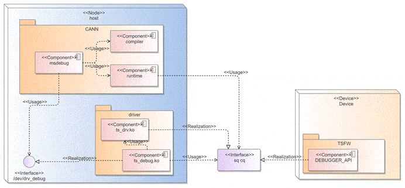
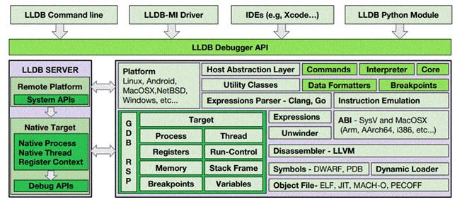
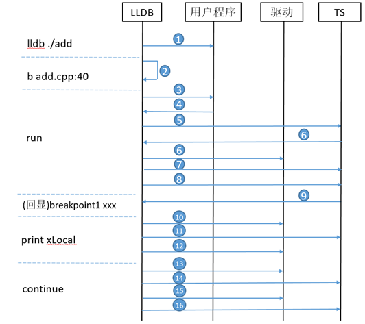
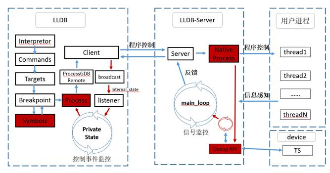
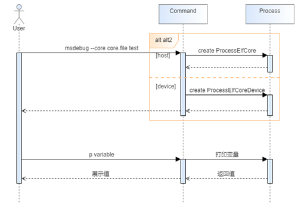
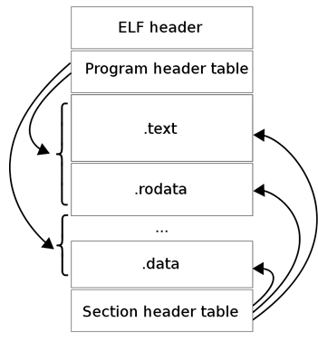
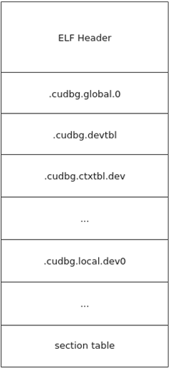
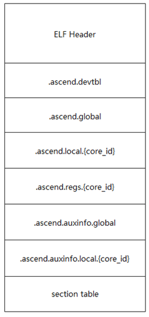

# **算子调试工具功能设计文档**

<table>
    <tr>
        <td>所属SIG组:</td>
        <td>msOT</td>
    </tr>
    <tr>
        <td>落入版本:</td>
        <td>MindStudio 26.0.0</td>
    </tr>
    <tr>
        <td>设计人员:</td>
        <td>gong-siwei</td>
    </tr>
    <tr>
        <td>日期:</td>
        <td>2026.01.23</td>
    </tr>
</table>

**Copyright © 2022 openGauss Community**

您对&quot;本文档&quot;的复制，使用，修改及分发受知识共享(Creative Commons)署名—相同方式共享4.0国际公共许可协议(以下简称&quot;CC BY-SA 4.0&quot;)的约束。
为了方便用户理解，您可以通过访问<https://creativecommons.org/licenses/by-sa/4.0/>了解CC BY-SA 4.0的概要 (但不是替代)。
CC BY-SA 4.0的完整协议内容您可以访问如下网址获取：<https://creativecommons.org/licenses/by-sa/4.0/legalcode>。

**改版记录**

<table>
    <tr>
        <th>日期</th>
        <th>修订版本</th>
        <th>修订描述</th>
        <th>作者</th>
        <th>审核</th>
    </tr>
    <tr>
        <td>2026.01.23</td>
        <td>1.0.0</td>
        <td>初版</td>
        <td>gong-siwei</td>
        <td>gong-siwei</td>
    </tr>
</table>

**目录**

1.特性概述

1.1范围

1.2特性需求列表

2.需求场景分析

2.1特性需求来源与价值概述

2.2特性场景分析

2.3特性影响分析

2.3.1硬件限制

2.3.2技术限制

2.3.3对License的影响分析

2.3.4对系统性能规格的影响分析

2.3.5对系统可靠性规格的影响分析

2.3.6对系统兼容性的影响分析

2.3.7与其他重大特性的交互性，冲突性的影响分析

2.4同类社区/商用软件实现方案分析

3.特性/功能实现原理(可分解出来多个Use Case)

3.1目标

3.2总体方案

4.Use Case一实现

4.1设计思路

4.2约束条件

4.3详细实现(从用户入口的模块级别或进程级别消息序列图)

4.4子系统间接口(主要覆盖模块接口定义)

4.5子系统详细设计

4.6DFX属性设计

4.6.1性能设计

4.6.2升级与扩容设计

4.6.3异常处理设计

4.6.4资源管理相关设计

4.6.5小型化设计

4.6.6可测性设计

4.6.7安全设计

4.7系统外部接口

4.8自测用例设计

5.Use Case二实现

6.可靠性&amp;可用性设计

6.1冗余设计

6.2故障管理

6.3过载控制设计

6.4升级不中断业务

6.5人因差错设计

6.6故障预测预防设计

7.安全设计

7.1Low Level威胁分析

7.1.1 2层数据流图

7.1.2业务场景及信任边界说明

7.1.3外部交互方分析

7.1.4数据流分析

7.1.5处理过程分析

7.1.6数据存储分析

7.1.7缺陷列表

7.2敏感数据分析

7.2.1敏感数据清单

7.2.2敏感操作检查

7.3 Use Case实现

7.3.1设计思路

7.3.2详细实现

8.特性非功能性质量属性相关设计

8.1可测试性

8.2可服务性

8.3可演进性

8.4开放性

8.5兼容性

8.6可伸缩性/可扩展性

8.7 可维护性

8.8 资料

9.数据结构设计（可选）

10.参考资料清单

# 1.特性概述

本文档是算子调试工具的功能域设计文档。

## 1.1范围

本文档包含算子调试工具各功能特性设计。

## 1.2特性需求列表

特性需求列表。

<table>
    <tr>
        <th>需求编号</th>
        <th>需求名称</th>
        <th>特性描述</th>
        <th>备注</th>
    </tr>
    <tr>
        <td>1</td>
        <td>msdebug支持算子coredump文件解析</td>
        <td>msdebug支持算子coredump文件解析</td>
        <td></td>  
    </tr>
</table>

# 2.需求场景分析

## 2.1特性需求来源与价值概述

算子在板单步调试工具msdebug，也是与业内友商cuda-gdb对标的工具。编译器建立了人类与机器之间的语言，使得我们能指挥机器按照我们的意图工作，而调试就是让我们理解机器的行为，建立了机器与我们之间的反馈渠道。只有编译和调试协同，才能让我们与设备有更好的协作，才能让我们的指挥更加顺畅。

## 2.2特性场景分析

coredump是定位现网挂死问题的一个关键能力。调试器通过支持coredump的信息加载，在信息加载后，后续的查询类命令都基于加载的数据进行展示，实现在任何场景下无需复现就可以分析问题场景，避免了重复复现环境的难题。

## 2.3特性影响分析

Ascend C上板调试功能涉及调试器、编译器、驱动、RTS等多个周边组件，本调试模块msdebug属于调试器，部署于CANN架构元素中，配合编译器提供的调试信息，依赖runtime动态库，并使用ts_debug.ko提供的驱动接口向device侧的TSFW下发调试命令，或借助PCIe接口向device侧内存下发断点指令，TSFW接收到调试通知后触发对应的DEBUGGER_API启用调试功能，完成调试后向ts_debug.ko返回处理结果，并返回消息至msdebug，完成一次标准的上板单步调试命令流。通过对DEBUGGER_API的扩展，可分别实现断点设置、恢复运行、单步运行、内存读取、寄存器读取等业务功能，并支持对新功能的扩展。



### 2.3.1硬件限制

支持A2、A3、310P、A5。

### 2.3.2技术限制

上板调试能力受限于Driver、RTS提供的能力，以及编译器能够提供的DWARF信息。

### 2.3.3对License的影响分析

不涉及。

### 2.3.4对系统性能规格的影响分析

需系统内存足以加载coredump文件至内存中。

### 2.3.5对系统可靠性规格的影响分析

### 2.3.6对系统兼容性的影响分析

不涉及。

### 2.3.7与其他重大特性的交互性，冲突性的影响分析

设计上暂无与其他工具配合使用的场景。

# 3.特性/功能实现原理

## 3.1目标

Ascend C支持上板单步调试。

## 3.2总体方案

_该章节主要阐述该特性的详细设计，包括选择什么硬件、使用什么算法、架构如何布局等_

_从整体流程上，根据场景分析和系统分解，将特性实现分为多个关键场景（ __Use Case__ ）_

_定义对接的原则_

_方案整体架构图_

调试器复用LLDB的设计，整体如下：



LLDB Debugger API及之上是调试工具对外的接口，比如：常见的命令行接口，与IDE对接的接口等。

LLDB Client(右下角) 会将人工输入的命令转换为机器识别的语言

- Interpreter：用来解析输入的命令，将其转换为特定的Commands。
- Commands：对应LLDB中的基础操作的抽象。
- Data Formatters:用于将数据依照内置数据结构进行展示，比如：vector这种结构，用户关注的是内部存储的内容，需要支持这种格式展示。
- Target所在的大框：被调试对象在客户端的代理，在客户端操作target后，其会通过GDB RSP协议将操作指令发给LLDB Server。
- 其他：客户端还有反汇编，二进制/符号解析等功能，用以辅助对程序的栈控制，运行状态控制，寄存器/内存读写，断点设置等系列功能。

LLDB Server：与被调试程序进行交互的主体，通过调用debug api实现功能。

整体方案中，除了调试器部分，现有CANN软件栈中缺乏debug API，需要在RTS中设计相关交互方案，实现调试器与昇腾芯片的交互。

结合具体的业务流程，组件间的协同关系如下：



过程说明：

1：拉起用户进程，在子进程中设置LD_PRELOAD，使能桩函数，并阻塞(原生机制)子进程

2：用户在LLDB中设置断点，并保存信息（此时未真正下发断点到设备）

3： LLDB通知用户程序运行（原生机制）

4：当用户运行到set device时，通过接口的劫持，使得device Id上报到了LLDB

5：LLDB通过SQCQ通道给TS下发set debug，使得TS进入debug模式

6：当TS在debug模式下收到task时，通过SQCQ通道上报event，并返回base地址和deviceId

6：LLDB通过驱动的共享空间在device的kernel上覆写软断点指令

7: LLDB通过SQCQ通知TS断点设置行为，TS需要设置icache的缓存失效

8：LLDB通知TS继续执行

9：TS通过SQCQ上报**断点命中信息**，并停止对应核的指令调度

10：LLDB通过驱动申请GM内存

11：LLDB通过SQCQ通道通知TS将片上内存搬运到其申请的GM内存

12：LLDB将GM内存中的信息拷贝到host侧，并显示

13：LLDB将原断点指令恢复

14：LLDB通过SQCQ通知TS进行single step

15：LLDB通过驱动接口重新覆写软断点

16：LLDB通过SQCQ通知TS程序继续运行



# 4.支持coredump使能实现

## 4.1设计思路

参考友商使能coredump命令：`(cuda-gdb) target cudacore core.file`

通过命令入参输入区分上板使能与coredump使能，后者命令行如下：

`msdebug --core core.file`或`(msdebug) target create --core core.file`



1. 用户使用--core参数加载coredump file
2. 命令行识别到存在coredump file后，需通过识别core file elf header结构，会创建cpu 上的ProcessElfCore实例，还是npu上的ProcessElfCore实例，ProcessElfCore自身会对coredump file进行解析加载，恢复进程现场，后续ProcessElfCore自身会对coredump file进行解析加载，恢复进程现场

## 4.2约束条件

coredump文件解析可在无NPU驱动环境上运行。

## 4.3详细实现

cpu架构上，通常的ELF文件段示例如下：



1. ELF header用户来识别这个文件类型信息，比如在什么机器架构上执行，是哪种类别的ELF
2. .text, .data等是存放对应数据的段，比如代码指段，数据段等

参考友商coredump file结构：



基于上述结构，我们可以对npu device上的coredump file定义类似的结构：coredump file文件整体结构下图所示，新增.ascend.xxx段等5个Section，



如下为新增段的简要介绍。

| 段名                            | 简要含义                                                     |
| ------------------------------- | ------------------------------------------------------------ |
| elf header                      | 其中应包含能识别是否npu  device架构的信息                    |
| .ascend.devtbl                  | 全局设备信息，考虑到不同架构上的寄存器，内存类型可能不同，这里需要保存当时的设备类型，用到哪些ai core等信息 |
| .ascend.global                  | 用于记录kernel 在gm上占用的内存信息                          |
| .ascend.local.{core_id}         | 用于记录每个ai  core在local  memory的内容，内存类型不同也会分不同段，内存类型的描述在auxinfo里 |
| .ascend.regs.{core_id}          | 用于记录每个ai  core拥有的寄存器的值，                       |
| .ascend.auxinfo.global          | 用于描述每段global内存的业务属性                             |
| .ascend.auxinfo.local.{core_id} | 用于描述每段local内存的业务属性                              |

下面对.ascend.devtbl段信息做介绍，基于coredump场景如下功能考虑：

1. 不同npu设备上的寄存器列表不一样，内存类型、范围也可能不一
2. 不同kernel 运行时使用的aic core, aiv core数量等不一样
3. 友商coredump file里device table段里包含devType, numSMs, numWarpsPerSM等信息
4. 考虑以后可能同个类型核超过64个，需要多个bitmap

所以.ascend.devtbl段内信息如下。

```cpp
struct DevInfo {
 // 当前kernel用了哪些ai core，bit位置1表示用了
  uint64_t aic_bitmap0; 
  uint64_t aic_bitmap1;
  uint64_t aiv_bitmap0;
  uint64_t aiv_bitmap1;
  uint32_t dev_id;
  DevdrvChipType chip_type; // 设备类型
};

enum DevdrvChipType : uint32_t {
    CHIP_BEGIN = 0,
    CHIP_MINI = CHIP_BEGIN,
    CHIP_CLOUD,
    CHIP_MDC,
    CHIP_LHISI,
    CHIP_DC,
    CHIP_CLOUD_V2 = 5,  // xxxB/C
    CHIP_RESERVED = 6,
    CHIP_MINI_V3 = 7,
    CHIP_TINY_V1 = 8,
    CHIP_NANO_V1 = 9,
    CHIP_KUNPENG920F = 10,
    CHIP_AS31XM1 = 11,
    CHIP_610LITE = 12,
    CHIP_CLOUD_V3 = 13,
    CHIP_END
};
```

内存/寄存器的信息用于后续命令查询使用。涉及段如下

| 段名                            | 简要含义                                                     |
| ------------------------------- | ------------------------------------------------------------ |
| .ascend.global                  | 用于记录kernel 在gm上占用的内存信息                          |
| .ascend.local.{core_id}         | 用于记录每个ai  core在local  memory的内容，内存类型不同也会分不同段，内存类型的描述在auxinfo里 |
| .ascend.regs.{core_id}          | 用于记录每个ai  core拥有的寄存器的值，                       |
| .ascend.auxinfo.global          | 用于描述每段global内存的业务属性                             |
| .ascend.auxinfo.local.{core_id} | 用于描述每段local内存的业务属性                              |

.ascend.global段和.ascend.auxinfo.global段基于如下考虑设计：

1. kernel占用的gm内存可能是不连续的
2. 将来可能调试时需要拿到kernel的输入等信息

所以把数据和业务属性分开保存。每个.ascend.global是多个section，每个section是连续的内存，.ascend.auxinfo.global有索引执行对应的.ascend.gloabl段，然后保存描述信息。描述信息的结构体见接口设计里的GlobalMemInfo 结构体。

.ascend.local.{core_id}和.ascend.auxinfo.local.{core_id}段中，每个.ascend.local也是纯放连续内存数据，其描述信息保存在.ascend.auxinfo.local里，后者保存着指向前者索引。描述信息的结构体见接口设计里的LocalMemInfo 结构体。

对.ascend.local段，每一个core，全量解析数据，存储不同内存类型的数据，方便后续查询接口根据core_id, core_type, mem_type, addr返回数据内容，基于如下考虑：

1. 每个ai core上有自己的内存，且拥有内存虚拟地址都是0开始，可以省略addr字段
2. 每个ai core上有多种不同类型的内存
3. 减少重复的数据，节约空间，比如core_id只需出现一次

所以直接存一个section，由辅助section来关联。

寄存器信息解析时，对.ascend.regs 段进行解析，全量读取解析后，根据全局npu设备信号信息，和上板场景下的寄存器数据结构相同格式存储，同时需基于以下考虑：

1. 寄存器的大小可能不同。
2. 寄存器的地址都是全局唯一的。

所以该段由多个REG_Entry结构体组成，每个REG_Entry见实现接口设计里的RegInfo 结构体。

PC寄存器的计算

coredump时，pc寄存器的值可能不正确，需要额外结合ERR寄存器进行计算，这里工具可以内部计算好准确的PC。

1. 先查询AIC_ERROR_0/1/2/3/4/5的值，获取其bit位，判断是mte/ifu/cube/ccu/vec/fixp 中哪种类型。每次只会命中一种错误，如果多种，目前就选择任意一种。
2. 再查询类型名对应寄存器，{MTE/IFU/CUBE/CCU/VEC/FIXP}_ERR_INFO寄存器，替换当前PC寄存器里的某几位。比如INFO寄存器里的0-7替换PC寄存器里的0-7，16-23替换16-23位。

## 4.4子系统间接口(主要覆盖模块接口定义)

```cpp
// .ascend.devtbl Section
struct DevInfo { 
 // 当前kernel用了哪些ai core，bit位置1表示用了 
  uint64_t aic_bitmap0;  
  uint64_t aic_bitmap1; 
  uint64_t aiv_bitmap0; 
  uint64_t aiv_bitmap1; 
  uint32_t dev_id; 
  DevdrvChipType chip_type; // 设备类型 
}; 
 
enum DevdrvChipType : uint32_t { 
    CHIP_BEGIN = 0, 
    CHIP_MINI = CHIP_BEGIN, 
    CHIP_CLOUD, 
    CHIP_MDC, 
    CHIP_LHISI, 
    CHIP_DC, 
    CHIP_CLOUD_V2 = 5,  // xxxB/C 
    CHIP_RESERVED = 6, 
    CHIP_MINI_V3 = 7, 
    CHIP_TINY_V1 = 8, 
    CHIP_NANO_V1 = 9, 
    CHIP_KUNPENG920F = 10, 
    CHIP_AS31XM1 = 11, 
    CHIP_610LITE = 12, 
    CHIP_CLOUD_V3 = 13, 
    CHIP_END 
};

// .ascend.global 单段连续内存
// .ascend.local.{core_id} 单段连续内存

// .ascend.regs.{core_id}
struct RegInfo { 
  uint64_t addr; 
  uint8_t invalid; 
  uint8_t reserve[6]; 
  uint8_t reg_size; // byte 
  uint8_t value[16]; 
};

// .ascend.auxinfo.global
struct GlobalMemInfo { 
    uint64_t addr; // 虚拟地址 
    uint64_t size;  // 内存大小 
    uint32_t section_index; // 对应哪个.ascend.global section 
    GlobalDataType type; // 内存是input/output/workspace/stack等类型 
    uint16_t reserve; 
    union { 
        struct { 
            uint16_t coreId; 
        } coreInfo;                // stack 类型的内存区分不同core 
        struct { 
            uint32_t dim; // tensor shape 
            uint32_t reserve; 
            uint64_t dim_size[25]; 
        } shape;                    // input、output 
    }; 
}; 

// 记录这片GM数据类型 
enum GlobalDataType : uint16_t { 
    INVALID_TENSOR = 0, 
    GENERAL_TENSOR = 1, 
    INPUT_TENSOR = 2, 
    OUTPUT_TENSOR = 3, 
    WORKSPACE_TENSOR, 
    TILING_DATA = 7,        // 上面的类型与编译器定义保持一致 
    ARGS = 101,           // args以下都是新增的，中间预留，从32开始定义 
    STACK = 102, 
    DEVICE_KERNEL_OBJECT = 103,   // device侧GM中算子.o数据 
};

// ascend.auxinfo.local.{core_id}
struct LocalMemInfo { 
  uint64_t size; //内存大小 
  uint32_t section_index; // 对应哪个.ascend.local section 
  uint32_t global_section_index; //对应哪个.ascend.gloabl section， 只有dcache有效 
  MemoryType mem_type; // L0AL1等 
  uint32_t reserve; 
} 
 
typedef enum MemoryType { 
    L0A = 1, 
    L0B = 2, 
    L0C = 3, 
    UB = 4, 
    L1 = 5, 
    DCACHE = 10, // 分args, tiling data, stack 
    ICACHE = 11, 
    REGISTER = 101, 
    MAX, 
} rtDebugMemoryType_t;
```

## 4.5子系统详细设计

见4.4章。

## 4.6DFX属性设计

### 4.6.1性能设计

本身作为调试功能，性能不敏感。这里保证用户可接受的时间(秒级)回显即可。

### 4.6.2升级与扩容设计

不涉及。

### 4.6.3异常处理设计

coredump文件格式异常时，提示用户。

### 4.6.4资源管理相关设计

不涉及。

### 4.6.5小型化设计

不涉及。

### 4.6.6可测性设计

不涉及。

### 4.6.7 安全设计

#### 4.6.7.1 安全设计确认

*参考安全设计checklist进行确认*

| 安全属性     | 检查项                                                       | 检查项详细说明                                               | 是否涉及 | 是否满足 |
| ------------ | ------------------------------------------------------------ | ------------------------------------------------------------ | -------- | -------- |
| 访问通道控制 | 是否新增侦听端口                                             | 新增侦听端口需刷新通信矩阵                                   | 不涉及   |          |
| 访问通道控制 | 是否新增进程或组件间通信                                     | 新增进程或组件间通信刷新通信矩阵                             | 不涉及   |          |
| 访问通道控制 | 是否新增认证方式                                             | 新增认证方式需刷新通信矩阵及产品文档                         | 不涉及   |          |
| 权限控制     | 是否涉及创建文件或目录                                       | 创建文件或目录须显式指定文件或目录的访问权限                 | 不涉及   |          |
| 权限控制     | 账号权限是否满足"权限最小化原则"                             | 系统中各账号应赋予最小权限                                   | Y        | Y        |
| 权限控制     | 是否存在用户权限提升                                         | 禁止出现用户非法权限提升                                     | Y        | Y        |
| 未公开接口   | 是否新增GUC参数                                              | 新增GUC参数需刷新产品文档                                    | 不涉及   |          |
| 未公开接口   | 是否新增或修改函数、视图、系统表                             | 新增或修改函数、视图、系统表需刷新产品文档，考虑权限控制     | Y        | Y        |
| 未公开接口   | 是否新增SQL语法                                              | 新增SQL语法需刷新产品文档，支持记录审计日志                  | 不涉及   |          |
| 未公开接口   | 是否新增内部工具                                             | 新增内部工具需刷新产品文档                                   | 不涉及   |          |
| 未公开接口   | 脚本中是否存在注释代码                                       | Shell/Python等解释性语言禁止注释代码，注释代码需要删除       | 不涉及   |          |
| 未公开接口   | 是否存在隐藏命令、参数、端口等接入方式                       | 对于现网维护期间不会使用的命令/参数、端口等接入方式（包括但不限于产品的生产、调测、维护用途），必须删除（如通过编译宏） | 不涉及   |          |
| 未公开接口   | 系统是否存在隐藏后门                                         | 禁止系统预留任何的未公开账号，所有账号必须可被系统管理，并在资料中予以说明 | 不涉及   |          |
| 未公开接口   | 禁止在产品对外部用户发布的软件（包含软件包/补丁包）中提供破解类、网络嗅探类工具。 | 1、禁止在产品对外部用户发布的软件（包含软件包/补丁包）中提供可修改任意用户口令、具有“口令破解能力”（指口令暴力破解、利用系统/算法漏洞恶意破解口令）、对包含敏感数据的文件（如包含密钥的配置文件、数据库）进行解密的功能或工具。2、禁止在系统中保留第三方的网络嗅探工具tcpdump、gdb、strace、readelf网络、进程调试工具，cpp、gcc、dexdump、mirror、JDK开发/编译工具和仅在调测阶段使用的自研调试工具/脚本（例如：仅在调试阶段使用的加解密脚本、调测功能、可以提权的命令），由于业务需要必须保留的，需要进行严格的访问控制。同时在资料中说明保留的原因、使用的场景、风险。 | 不涉及   |          |
| 敏感数据保护 | 认证凭据不允许明文存储在系统中，应该加密保护。               | 认证凭据（如口令/私钥等）不允许明文存储在系统中，应该加密保护。 | 不涉及   |          |
| 敏感数据保护 | 用于敏感数据传输加密的密钥，不能硬编码在代码中。             | 禁止口令和密钥硬编码。                                       | 不涉及   |          |
| 敏感数据保护 | 是否明文打印口令或密钥等敏感信息                             | 禁止在系统中存储的日志、调试信息、错误提示及ps命令等信息打印明文敏感信息（口令/私钥/预共享密钥）。 | 不涉及   |          |
| 敏感数据保护 | 是否明文回显口令                                             | 禁止明文回显口令。                                           | 不涉及   |          |
| 敏感数据保护 | 是否使用第三方和开源软件的缺省口令                           | 禁止使用第三方和开源软件的缺省口令，参考安全设计指南第1.5章节。 | 不涉及   |          |
| 敏感数据保护 | 是否将密码明文存储在配置文件中                               | 明文密码不允许写入配置文件（命令行工具安装部署及使用时必需配置密码的场景除外）。 | 不涉及   |          |
| 敏感数据保护 | 是否使用不安全的加密算法                                     | 禁止使用私有的或业界已知不安全的加密算法。推荐加密算法安全设计指南6.2章节。 | 不涉及   |          |
| 敏感数据保护 | 口令等敏感信息是否使用安全的传输通道                         | 在非信任网络之间进行敏感信息传输须采用安全传输通道或者加密后传输。参考安全设计指南第10章。 | 不涉及   |          |
| 敏感数据保护 | 内存中口令或密钥等敏感信息使用后是否销毁                     | 内存中的口令或密钥等信息使用完毕后立即清0。                  | 不涉及   |          |
| 敏感数据保护 | 密码算法中使用到的随机数必须是密码学意义上的安全随机数。     | 密码算法中使用到的随机数必须是密码学意义上的安全随机数，参考安全设计指南6.3章节。 | 不涉及   |          |
| 敏感数据保护 | 资料中是否存在不安全的示例                                   | 资料中的示例需要是安全的，对用户进行正确的引导，若示例中存在潜在的风险，要在资料中进行说明。 | 不涉及   |          |
| 认证         | 是否提供认证机制                                             | 新系统需要提供认证机制并缺省开启。                           | 不涉及   |          |
| 认证         | 认证是否在服务端进行                                         | 认证处理过程需要在服务端进行。                               | 不涉及   |          |
| 认证         | 认证失败后服务端是否返回有效信息                             | 认证失败后，服务端返回信息不能提供详细的、可用于判断具体错误原因的提示。 | 不涉及   |          |
| 外部参数校验 | 是否对外部输入进行合法性校验                                 | 1、使用外部输入数据作为循环终止条件、数组下标、内存分配大小参数等，可能导致系统出现死循环、缓冲区溢出、内存越界、拒绝服务等一系列行为。2、文件路径等外部输入应进行合法性校验，防止注入风险 | Y        | Y        |
| 三方件引入   | 是否新引入三方组件                                           | 1.新增三方组件需要通过安全编译选项、病毒、漏洞、开源片段引用、license合规、开源组件扫描，参考版本发布网络安全质量要求。2.新增三方组件需保证来源可信。 | 不涉及   |          |

#### 4.6.7.2 敏感数据分析

##### 1. 敏感数据清单

不涉及。

##### 2. 敏感操作检查

不涉及。

#### 4.6.7.3 设计实现

不涉及。

## 4.7系统外部接口

core文件加载接口：

`msdebug --core {core.file}`

## 4.8自测用例设计

NA。

# 6.可靠性&amp;可用性设计

## 6.1冗余设计

不涉及。

## 6.2故障管理

不涉及。

## 6.3过载控制设计

不涉及。

## 6.4升级不中断业务

不涉及。

## 6.5人因差错设计

不涉及。

## 6.6故障预测预防设计

不涉及。

# 7.特性非功能性质量属性相关设计

## 7.1可测试性

基于llvm-lit实现ST测试。

## 7.2可服务性

开发态工具，不涉及。

## 7.3可演进性

不涉及。

## 7.4开放性

不涉及。

## 7.5兼容性

新特性与旧特性全量兼容。

## 7.6可伸缩性/可扩展性

不涉及。

## 7.7可维护性

不涉及。

## 7.8资料

资料新增coredump加载接口介绍。

# 8.数据结构设计（可选）

不涉及。

# 9.参考资料清单
