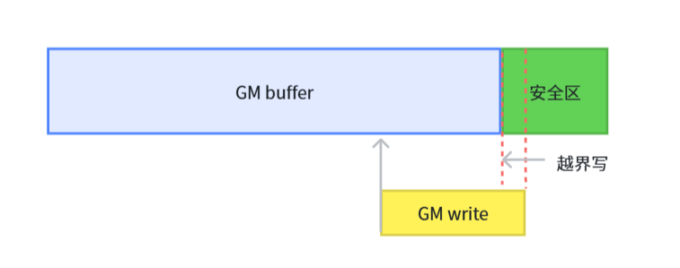
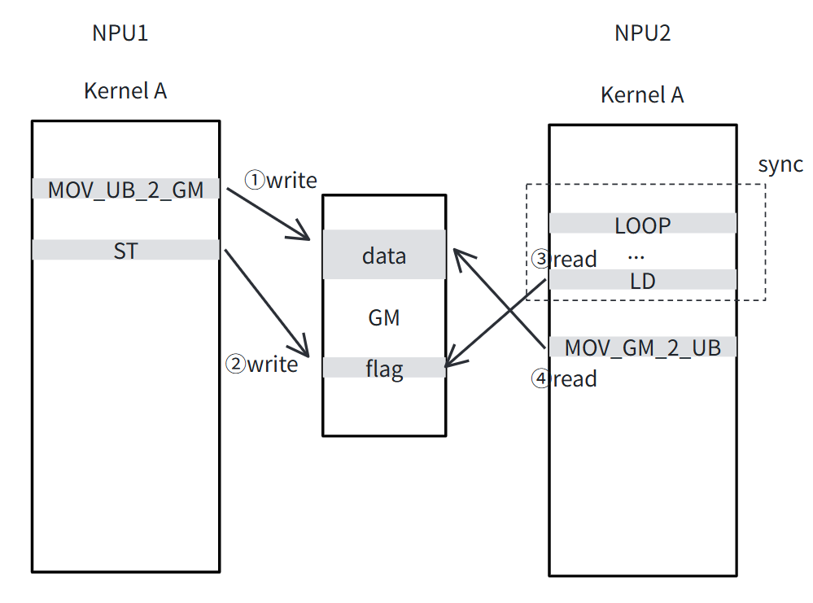

# MindStudio Sanitizer 功能设计文档

状态 (Status):  Reviewing  
作者 (Authors): @gong-siwei  
创建日期 (Created): 2026-05-08  
更新日期 (Updated): 2026-05-08  
相关 Issue/PR: 

---

# 1. 概述

## 1.1 简介

昇腾芯片本身内部有多个核心，基于昇腾芯片的开发需要小心地处理各个核心负责的内存块，同时，片上内存有对齐的要求，容易产生内存踩踏、内存对齐、内存初始化、流水竞争等问题。本工具提供内存检测、竞争检测等检测功能，帮助用户快速识别并定位此类问题。

本次需新支持的功能如下：

- 支持检测aicpu tiling函数越界写
- 支持shmem算子卡间共享内存竞争检测
- 支持配合msTx接口指定内存属性检测
- 950代际支持同步检测
- 950代际支持初始化检测
- 同步检测支持死锁检测

## 1.2 动机

### 1.2.1 支持检测aicpu tiling函数越界写

AscendC支持了通过<<<>>>写法把大tiling函数计算下发到aicpu进行，tiling函数中可以对GM buffer直接读写，若出现越界写GM buffer时，开发者较难快速发现出现了越界，若越界写到aicore kernel所用的GM buffer，会引起其他连锁问题，因此需要mssanitizer对此场景进行越界写检测。

### 1.2.2 支持shmem算子卡间共享内存竞争检测

shmem库支持同一个kernel下发至多个卡上运行并进行卡间同步，卡间同步流程设计时需考虑全面，否则易出现卡间的共享内存数据竞争问题，非常难定位，为解决此问题，需要mssanitizer支持同一个kernel在不同卡上的竞争检测。

### 1.2.3 支持配合msTx接口指定内存属性检测

进行内存检测时，有时需要标识内存的属性，比如标识为“共享内存”供卡间共享内存竞争检测使用，或标识为“只读”，检查算子是否访问了预期之外的内存，内存属性需要支持通过msTx接口进行配置，mssanitizer工具根据msTx接口的上报信息完成检测。

### 1.2.4 950代际支持同步检测

针对新一代硬件实现相同能力的同步检测功能，以及新硬件SIMT架构下的同步检测功能。

### 1.2.5 950代际支持初始化检测

针对新一代硬件实现相同能力的初始化检测功能，以及新硬件SIMT架构下的初始化检测功能。

### 1.2.6 同步检测支持死锁检测

当算子因同步指令编排不当，导致出现卡死在wait_flag中时，难以快速定位，需mssanitizer提供卡死代码位置。

## 1.3 目标

- aicpu tiling函数越界写，因编译器未支持aicpu指令插桩，仅在tiling函数运行结束后检测是否存在越界写行为，不像aicore kernel函数一样提示到代码行。
- 卡间竞争检测的目标：不同卡上，相同kernel对标记为“共享内存”的buffer的读写指令，进行竞争检测。
- 配合msTx接口识别内存属性范围：只读、只可写、可读写、不可读写、可读写共享内存。
- 同步检测支持检测冗余的set_flag，950硬件SIMT架构下支持检测每个sync_threads是否被所有线程执行。
- 初始化检测支持950硬件SIMT架构下的指令访问未初始化内存行为的识别。
- 死锁检测支持检测卡死在wait_flag的场景，无法检测其他场景比如陷入while死循环。

# 2. 用例分析

## 2.1 支持检测aicpu tiling函数越界写

tiling函数下发到aicpu执行方式参考此用例：https://gitcode.com/cann/asc-devkit/blob/master/examples/01_simd_cpp_api/02_features/04_aicpu/aicpu_device_tiling/README.md

tiling函数中可对GM buffer直接进行指针解引用完成读写，若出现越界写，mssanitizer工具可在tiling函数执行结束后识别，并提示此aicpu kernel出现越界写行为。

## 2.2 支持shmem算子卡间共享内存竞争检测

shmem算子样例可参考：https://gitcode.com/cann/shmem/blob/master/examples/allgather_matmul/README.md

shmem库支持同一个kernel下发至多个卡上运行并进行卡间同步，当出现卡间的共享内存数据竞争问题，mssanitizer可识别并提示竞争类型、出现问题的kernel名、device id、出现数据竞争的指令代码行。

## 2.3 支持配合msTx接口指定内存属性检测

使用msTx接口可指定以下几种属性：

- 只读
- 只可写
- 可读写
- 不可读写
- 可读写共享内存，仅用于卡间共享内存竞争检测

当读写行为不满足内存属性时，提示 illegal read/write。

## 2.4 950代际支持同步检测

950代际硬件上运行mssanitizer，支持识别：

1. 冗余set_flag未被wait_flag配对，在kernel运行结束后提示出现此问题。
2. SIMT代码中若出现sync_threads未被所有线程执行，在kernel运行结束后提示sync_threads具体代码行。

## 2.5 950代际支持初始化检测

950代际硬件上运行mssanitizer，支持识别：

1. kernel读未初始化的内存区域，在kernel运行结束后提示读初始化问题，并展示读指令对应的代码行。

## 2.6 同步检测支持死锁检测

当算子因同步指令编排不当，导致出现卡死在wait_flag中时，mssanitizer支持设置超时时间，超时后可识别到卡死在哪个wait_flag指令，并展示对应的代码行。

# 3.方案设计

## 3.1 总体方案

### 3.1.1 支持检测aicpu tiling函数越界写

aicpu属于CPU架构，与aicore不同，编译器暂未支持对aicpu架构的指令进行插桩，在不依赖指令插桩的情况下实现此功能，可通过在GM buffer前后增加安全区的方式完成，如下图所示。

当每个kernel运行结束时，遍历所有GM buffer检查安全区是否被污染，若出现污染则进行提示，执行下一个kernel前，还原安全区。

### 3.1.2 支持shmem算子卡间共享内存竞争检测

算子在卡间进行共享内存协作的场景如下图所示，NPU1所在kernel A向GM共享内存中写入数据后，修改flag标志位通知NPU2，NPU2上的相同kernel A通过不断轮询flag识别NPU1是否已完成数据搬运，利用软同步的形式完成卡间同步，当软同步②使用不对时，①与④会出现读后写竞争问题。

因为软同步由LD、ST指令组合而成，指令本身不携带同步语义，因此需要算子使用msTx接口完成同步语义上报。因为卡间仅共享内存会出现数据竞争，非共享内存的buffer读写行为可直接过滤。竞争检测算法需扩展至多卡，扩展形式借鉴核间竞争，把不同卡上的kernel运行记录按照多核形式展开，把各卡的记录同时纳入竞争检测算法中。

### 3.2.3 支持配合msTx接口指定内存属性检测

msTx接口提供内存属性配置接口，mssanitizer进行msTx接口实现，把获取到的buffer属性，添加到内存检测的内存区间属性中用于合法性判断。

### 3.2.4 950代际支持同步检测

冗余set_flag识别算法可直接沿用A2/A3代际。

950代际硬件的SIMT编程模型中的 sync_threads 指令，其约束必须在分支代码中被每个分支调用，因此需要检查每条 sync_threads 指令是否被每个线程遍历，不满足要求则告警。

### 3.2.5 950代际支持初始化检测

识别读未初始化内存的算法可直接沿用A2/A3代际，需额外注意950代际硬件的SIMT模块与算法的结合，可通过在线shadow memory检测算法把SIMT模块中的内存读写行为完整记录，插入到外部SIMD的检测流程中。

### 3.2.6 同步检测支持死锁检测

死锁检测需要支持设置算子超时时间与ctrl c退出两种机制。超时时间设置可通过劫持流同步接口配置超时时间实现，ctrl c退出可设置sigint信号量捕获，强制终止算子所在stream实现。算子退出后根据已记录的指令，进行同步指令的重放，当出现无法正常实现调度时，就表示当前出现了卡死现象，此时遍历各pipe检查是否存在wait_flag无法调度，发现后抛出死锁告警。

## 3.2 技术选型（可选）

方案设计简单，不涉及多重选型。

## 3.3 安全隐私与DFX设计

*结合场景用例，对本提案所涉及的安全隐私及DFX（兼容性、可维护性、可测试性、可靠性...）等属性影响进行设计。*

### 3.3.1 支持检测aicpu tiling函数越界写

兼容性：作为额外选项启用，与原内存检测不冲突。

可靠性：算法设计简单，不依赖编译器进行指令插桩即可对aicpu <<<>>>调用进行检测，若越界首地址较大，也可通过调整安全区大小进行动态配置。

### 3.3.2 支持shmem算子卡间共享内存竞争检测

兼容性：作为额外选项启用，与原竞争检测不冲突。

可靠性：为降低检测复杂度，仅考虑不同卡上的相同kernel间进行检测，同时过滤掉非共享内存的指令记录。

### 3.3.3 支持配合msTx接口指定内存属性检测

兼容性：当没有使用msTx接口指定内存属性时，内存属性默认指定为可读写，以保证兼容性。

### 3.3.4 950代际支持同步检测

兼容性：950代际同步检测类型应覆盖A2/A3代际。

### 3.3.5 950代际支持初始化检测

兼容性：950代际初始化检测类型应覆盖A2/A3代际。

### 3.3.6 同步检测支持死锁检测

可靠性：算子卡死采用超时时间与ctrl c两种机制保证算子可退出卡死状态，以进行算法检测，同步指令记录至日志中，可支持维护查询。

## 3.4 编程与调用设计

### 3.4.1 编程模型基本设计

mssanitizer提供命令行cli，未新增API调用，开发环境直接使用CANN环境。

### 3.4.2 接口定义与设计

### 3.4.2.1 支持检测aicpu tiling函数越界写

- 命令行参数：`--padding <size>` 默认值：32

#### 3.4.2.2 支持shmem算子卡间共享内存竞争检测

- 命令行参数：`--cross-npu-check <yes/no>` ，默认值：`no`

### 3.4.3 使用说明

以上新增参数均不影响原有参数使用。

# 4.测试设计

*介绍该功能的测试方法以及测试用例设计，包括单元测试（unit test），集成测试（integration test），端到端测试（e2e test）等。*

## 4. 1 单元测试

按照原UT测试框架满足覆盖率要求即可。

## 4.2 端到端测试

- 算子类型：mix、cube、vec、simt
- 编程语言：AscendC、Triton、CATLASS、SHMEM
- 调起方式 ：<<<>>>、ACLNN、PTA
- 款型：A2/A3/950

### 4.2.1 支持检测aicpu tiling函数越界写

参考aicpu下发tiling函数的用例，构造tiling函数中越界写GM buffer的代码，不涉及算子类型。

### 4.3.2 支持shmem算子卡间共享内存竞争检测

参考shmem算子仓allgather_matmul用例，修改卡间同步接口，构造卡间数据竞争。

### 4.3.3 支持配合msTx接口指定内存属性检测

构造使用msTx接口的算子用例进行测试，需覆盖vector、cube、mix算子类型。

### 4.3.4 950代际支持同步检测

构造set_flag冗余的场景，需覆盖vector、cube、mix算子类型。

构造sync_threads仅在某些线程分支生效的场景，需覆盖vector、cube、mix算子类型。

### 4.3.5 950代际支持初始化检测

构造读未初始化内存的场景，需覆盖vector、cube、mix算子类型。

### 3.3.6 同步检测支持死锁检测

构造因wait_flag卡死的算子，需覆盖vector、cube、mix算子类型。

# 5.缺点和风险（可选）

无。

# 6.现有技术（可选）

内存检测算法参考valgrind，采用shadow memory维护内存状态。

# 7.未解决问题（可选）

无。

---

附录

* **参考资料链接**
* **术语表**
* **文档更新计划**       
