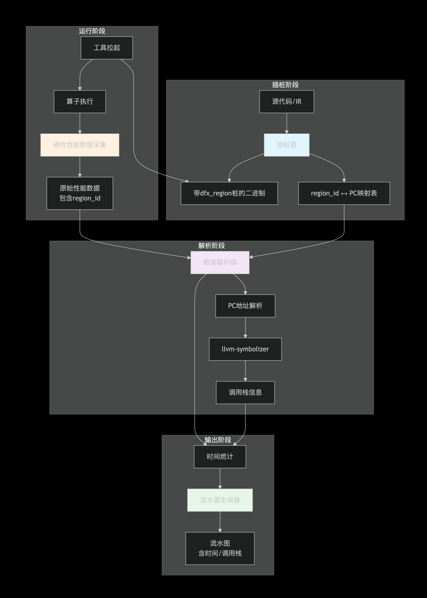
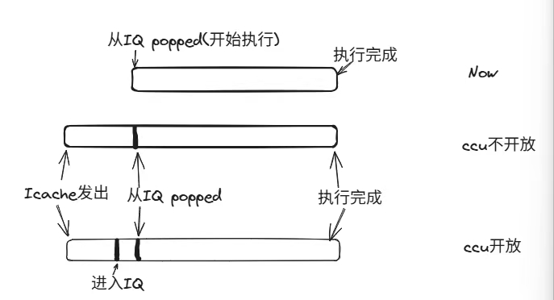

# MindStudio Ops Profiler 功能设计说明书

状态 (Status): Approved  
作者 (Authors): @MTQ  
创建日期 (Created): 2026-5-7  
更新日期 (Updated): 2026-5-7  
相关 Issue/PR: #76

---

# 1. 概述

## 1.1 简介

算子调优是算子开发工具链的关键一环。本工具根据算子运行的环境和目的将数据划分为以下两类：算子仿真和算子上板。 算子仿真：运行在昇腾仿真器上，通过仿真器对于指令级性能的详细仿真输出详细的算子性能数据，例如流水图和代码热点图。 算子上板：开发者所开发的算子运行在真实昇腾设备上的性能数据结果，反映的是算子在硬件设备上的真实性能，是算子性能最可靠的数据。

## 1.2 动机

算子调优作为算子开发工具链的关键一环，是算子开发者获取性能数据和优化方向的主要工具，算子调优工具主要用户群体是昇腾算子的开发人员，包括客户算子开发工程师，公司内部算子开发工程师。用户可根据工具提供的性能指标评估当前算子的性能瓶颈，当前工具也会根据采集的性能指标通过建模、专家系统的方式直接告知用户性能瓶颈，以帮助用户优化其算子。

## 1.3 目标

本文目的是对算子开发工具进行功能设计，明确算子调优工具主要功能及方案，作为今后的编码阶段的输入和编码人员、测试人员的指导。

# 2. 用例分析

| 类型                                        | 功能清单              | 功能描述                                                                                                                           | 支撑的调优类型    |
| --------------------------------------------- | ----------------------- | ------------------------------------------------------------------------------------------------------------------------------------ | ------------------- |
| 业务功能                                    | 计算内存热力图        | 以资源维度展示算子基础信息、计算负载分析和内存负载分析的数据                                                                       | 上板调优          |
| 业务功能                                    | Roofline瓶颈分析图    | 构建出性能模型，然后利用该性能模型快速评估出算子的理论性能极限                                                             | 上板调优          |
| 业务功能                                    | Cache热力图           | 可视化呈现Cache热力图，可显示对应指令信息，以便用户优化L2Cache命中率                                                              | 上板调优          |
| 业务功能                                    | 通算流水图（MC2算子） | 直观看到MC2算子的通算运行情况、指令耗时等信息，协助开发者识别通算瓶颈                                                              | 上板调优          |
| 业务功能                                    | 指令流水图            | 以指令维度展示时序关系并关联调用栈快速追踪瓶颈位置，展示信息为指令发射时长以及执行时长。在simt算子中会detail中会显示simt vf信息例如线程数、warpId、schId等。 | 仿真调优          |
| 业务功能                                    | 算子代码热点图        | 支持查看算子源码与指令集的映射关系、耗时情况等功能，可协助开发者识别热点代码分布，并分析热点函数优化的可行性                       | 上板调优/仿真调优 |
| 业务功能                                    | 性能数据文件          | 展示指令耗时情况、L2cache命中率、内存带宽读写速率、L0读写带宽率、UB读写带宽速率、算子基础信息、计算/搬运单元耗时占比、资源冲突占比 | 上板调优          |
| 业务功能                                    | 搬运带宽图            | 展示GM<->L1,GM<->UB,GM<->other间数据搬运的带宽图                                                                                   | 仿真调优          |
| 业务功能 | 指令流水图(上板) | 以指令维度展示时序关系并关联调用栈 | 上板调优 |
| 业务功能 | warp耗时展示 | simt算子展示每个 warp运行的起始、终止时间 | 上板调优 |
| 业务功能 | warp基本信息展示 | 展示simt vf IPC信息、simt vf state信息、 warp执行时长等信息 | 上板调优 |
| dfx功能                                     | Ctrl+C功能            | 提前终止算子进程，工具可根据当前已采集的数据解析结果                                                                                   | 上板调优/仿真调优 |
| dfx功能                                     | 提前终止进程            | 用户可定时结束算子进程                                                                                                             | 上板调优          |
| dfx功能                                     | 指定仿真器版本        | 用户可直接设置仿真器版本                                                                                                           | 仿真调优          |

***约束说明：***

1. 上板流水图功能

   a. 中无法显示simt vf和simd vf的指令细节，

   b. 当前只有A5代际提供该功能、A2/A3未提供此功能。

   c. 该功能依赖编译器，要求工具与编译器(cann)版本配套。

   d. 当前指令流水信息由硬件返回，若硬件有信息丢失工具需要提醒用户。

2. warp耗时展示

   a. 该功能依赖编译器，要求工具与编译器(cann)版本配套。

 **代码热点图详细功能列举** 

| 特性名称                                    | msprof op | msprof op simulator |
| ------------------------------------------- | --------- | ------------------- |
| 查看寄存器使用情况 （Gpr Count）            | 不支持    | 支持                |
| 模拟代码行和指令维度的 L2Cache命中率        | 支持      | 不支持              |
| 查看与GM有关的数据搬运量（Process Bytes）   | 支持      | 支持                |
| Vector计算类指令在UB Bank上读和写的冲突情况 | 不支持    | 支持                |
| Vector计算单元利用率                        | 不支持    | 支持                |
| 查看算子源码与指令的耗时情况（cycles）      | 不支持    | 支持                |
| 查看算子源码与指令的执行次数                | 支持      | 支持                |
| 查看算子源码与指令集的映射关系              | 支持      | 支持                |
| 查看源码、指令PC地址、Pipe、Source          | 支持      | 支持                |
| 查看core信息                                | 不支持    | 支持                |

# 3.方案设计

## 3.1 总体方案

### 3.1.1 上板

#### 3.1.1.1 指令流水图

A5代际下硬件提供dfx_region功能，可在对应的pipe上打点（而非A2/A3代际的scalar打点）获取准确的执行时间，故当前方案为将计算类、搬运类指令的前后加入dfx_region指令，拉起算子时硬件会返回该指令的执行时间。工具获取硬件返回的数据并解析生成所有搬运类、计算类指令的流水信息。

**其中涉及组件 :**

编译器：负责插dfx_region桩，并返回每个region_id与pc的对应情况（便于工具将dfx_region与pc对应起来，流水图中显示pc对应的执行时间以及调用栈）

硬件：负责返回数据

工具：负责拉起编译器插桩得到目标二进制、拉起算子、从硬件获取数据、解析数据并调用llvm-symbolizer完成调用栈的生成。

| 阶段         | 角色             | 关键动作                                                     | 时序关系                       |
| ------------ | ---------------- | ------------------------------------------------------------ | ------------------------------ |
| **前置插桩** | 编译器           | 对程序执行`dfx_region`插桩，植入监控点；返回region_id与pc的对应情况 | 发生在算子下发**之前**         |
| **运行算子** | 工具（基础组件） | 拉起已插桩的程序 → 程序运行时自动产出所需数据                | 运行插桩生效后的算子           |
| **数据返回** | 硬件             | 接收原始数据 → 格式化处理 → 返回给C                          | 算子结束后触发                 |
| **最终展示** | 工具（解析侧）   | 获取格式化数据并完成展示（包括解析硬件返回的指令执行时间信息以及调用栈信息） | 最后一步，解析侧解析并展示数据 |



#### 3.1.1.2 warp耗时展示

默认在流水图中显示每个warp的开始时间和终止时间。

本功能需要编译器提供在simt vf 的开始和结尾提供插桩功能，工具会将桩插入到算子simt vf 的开始和结尾处，桩中的功能为记录当前的warp信息和时刻信息。运行时动态获取这些信息，并将信息记录到GM中。工具解析侧获取每个warp的执行时间信息，并画出流水图，呈现在当前代码流水图界面上。

```markdown
│    ┌────────────────────────────────────────────────────────────────┐      │
│    │                    插桩工具 (Instrumentation)                   │      │
│    │   - 识别 SIMT VF 区域边界                                       │      │
│    │   - 在 BEGIN 处插入: 记录 warp_id + start_timestamp            │      │
│    │   - 在 END   处插入: 记录 warp_id + end_timestamp              │      │
│    └────────────────────────────────────────────────────────────────┘      │
│                                    │                                        │
│                                    ▼                                        │
│    ┌────────────────────────────────────────────────────────────────┐      │
│    │                 插桩后 Kernel (带桩代码)                         │      │
│    │   ...                                                          │      │
│    │   BEGIN_STUB:                                                  │      │
│    │      warp_id = getWarpId();                                    │      │
│    │      start_ts = readCycle();                                   │      │
│    │      storeToGM(warp_id, start_ts);  // 写入 Global Memory      │      │
│    │   SIMT_VF_BEGIN:                                               │      │
│    │      // 原始计算逻辑                                            │      │
│    │   SIMT_VF_END:                                                 │      │
│    │   END_STUB:                                                    │      │
│    │      warp_id = getWarpId();                                    │      │
│    │      end_ts = readCycle();                                     │      │
│    │      storeToGM(warp_id, end_ts);                               │      │
│    │   ...                                                          │      │
│    └────────────────────────────────────────────────────────────────┘      │
│                                    │                                        │
│                                    ▼                                        │
│   ┌─────────────────────────────────────────────────────────────────┐      │
│   │                           硬件                                  │      │
│   │  ┌──────────┐  ┌──────────┐  ┌──────────┐  ┌──────────┐       │      │
│   │  │ Warp 0   │  │ Warp 1   │  │ Warp 2   │  │ Warp N   │       │      │
│   │  │ 执行VF    │  │ 执行VF   │  │ 执行VF    │  │ 执行VF    │       │      │
│   │  └────┬─────┘  └────┬─────┘  └────┬─────┘  └────┬─────┘       │      │
│   │       │             │             │             │             │      │
│   │       ▼             ▼             ▼             ▼             │      │
│   │  ┌─────────────────────────────────────────────────────────┐  │      │
│   │  │              Global Memory (GM)                          │  │      │
│   │  │  ┌────────────────────────────────────────────────────┐ │  │      │
│   │  │  │ Warp Record Table                                  │ │  │      │
│   │  │  ├─────────┬───────────────────┬───────────────────┤ │  │      │
│   │  │  │ Warp ID │ Start Timestamp   │ End Timestamp     │ │  │      │
│   │  │  ├─────────┼───────────────────┼───────────────────┤ │  │      │
│   │  │  │ 0       │ 1000              │ 2500              │ │  │      │
│   │  │  │ 1       │ 1100              │ 2600              │ │  │      │
│   │  │  │ 2       │ 1020              │ 2520              │ │  │      │
│   │  │  │ ...     │ ...               │ ...               │ │  │      │
│   │  │  └─────────┴───────────────────┴───────────────────┘ │  │      │
│   │  └─────────────────────────────────────────────────────────┘  │      │
│   └─────────────────────────────────────────────────────────────────┘      │
```

#### 3.1.1.3 warp基本信息展示

需要在detail信息中展示warp总的IPC信息，以及warp stall的top排序。

warp stall的top排序通过采样得到，硬件通过在采样周期内轮询着对每个warp做pc采样，获取当前的stall信息。工具通过这个信息获取当前所有的stall信息，并进行排序、显示。

### 3.1.2 仿真

#### 3.1.2.1 指令流水图

**仿真流水图展示某指令在scalar上经历的时间**

   a. 当前没有ccu日志，所以只能增加显示指令从icache->IQ pop的时间，若未来仿真器有开放计划可以增加显示进入IQ的时刻（从IB弹出的时刻）。

   b. 涉及到的日志有icache.log

   c. 需要注意的是仿真日志同步传输场景和落盘场景都需要适配。

   d. 当前仅支持A2/A3



**imt算子增加显示使用的线程信息**

   a. 仿真流水图中增加显示当前的timeline所用到的线程数。

   b. 使用instr.log中的prdctMask和execMask，两者相与得到线程数。

## 3.2 技术选型（可选）

/

## 3.3 安全隐私与DFX设计

### 3.3.1 上板

#### 3.3.1.1 指令流水图

**DFX设计**

**可靠性**

1. 由于scalar指令多且对算子优化帮助不大，所以当前不插scalar pipe指令，即不显示纯scalar指令流水。当前仅仅关注simd vf/simt vf/MTE1/MTE2/MTE3/CUBE(PIPE_M)/FIXP(PIPE_F)

2. 由于dfx_region使用数目有限制（当前每个Pipe仅能用512个），故存在极端情况某个Pipe指令数超过512个，发生时需要让用户感知。当前设计为编译器插桩时如果感知到有超过512的情况时会通过返回值或者日志让工具感知，工具再将结果呈现给用户。

3. 由于硬件原因，在dfx_region插入多、算子复杂时 时间信息可能会丢失，提出两个缓解措施：

   a. 编译器提供参数（工具也需要提供选项给用户），插桩可以只插某 特定pipe，工具只显示特点pipe的流水信息。

   b. 工具从硬件获取数据丢失信息，并呈现给用户，告知用户当前有数据丢失，用户可选择使用仿真流水功能。

**性能**

1. 由于算子文件中可能存在多个tiling key/kernel name，但是每次算子拉起只会选择其中一个运行。故非目标tiling key/kernel name无需插桩，工具要求编译器提供选项，工具输入目标tiling key/kernel name，编译器只对目标算子进行插桩，故工具需要限制算子必须全部inline，如果存在子函数，子函数流水内容无法呈现。此操作可以减少region_id的使用以及大大缩短插桩时间。

**可测试性**

1. 解析硬件功能应封装为一个接口，该接口只接收原始数据并解析。

#### 3.3.1.2 warp耗时展示

**DFX设计**

**安全**

1. 该功能需要生成新交付件，用于保存桩内容，需要按照要求生成特定权限的交付件

2. 桩中需要访问外部传入的GM内存，访问前需要确认该内存的合法性以及大小。

### 3.3.2 仿真

#### 3.3.2.1 指令流水图

**可靠性**

1. 当仿真器日志缺少无法绘制某pc完整流水信息时，需要报错给用户并显示异常pc，此时不可终止程序影响其他pc流水的生成。
2. 落盘场景、日志传输场景都需要支持此功能。

## 3.4 编程与调用设计

### 3.4.1 编程模型基本设计

### 3.4.1.1 上板

#### 3.4.1.1.1 指令流水图

1. 数据获取部分：需要按照硬件返回信息规定数据结构，编码时将数据结构定义好，不可只获取当前使用到的信息，需要考虑到将来的功能拓展。

   例如可定义28-31位数据结构体：

   Struct {

    kickstart,

    status,

    dispatch,

    execute

   }

   // 涉及到的pipe有

   Struct {

    pipe_s,

    pipe_m,

    pipe_v,

    mte1,

    mte2,

    mte3,

    pipe_f

   }

#### 3.4.1.1.2 warp耗时展示

此功能需要插入两个桩，需要注意的是：

1. 写插桩代码时需要注意扩展性，可扩展至插多个桩，注意接口封装。
2. 需要注意不可与其他功能桩共用，例如不可参与到重放中。

#### 3.4.1.1.3 warp基本信息展示

当前基本信息展示的不全需要在界面设计时预留未来数据。

### 3.4.1.2 仿真

#### 3.4.1.2.1 指令流水图

/

### 3.4.2 接口定义与设计

#### 3.4.2.1 bisheng-tune

* 接口描述：编译器提供的插桩二进制
* 接口原型：bisheng-tune二进制
* 输入/输出参数：

| 参数名称 | 输入/输出 | 类型 | 描述 | 取值范围 |
| --- | --- | --- | --- | --- |
| --tiling-key | 输入 | String | 从.o中选择特定算子进行插桩 | / |
| --kernel-name | 输入 | String | 从.o中选择特定算子进行插桩 | / |

* 异常处理：

  1. 当插桩失败是返回错误码。
  2. 当dfx_region插桩成功但是region_id用光导致无法继续插桩时返回特点错误码。
  3. 当输入的tiling-key/kernel-name不存在时报错返回，视为异常1。

* 约束说明：/

* 变更说明：增加--kernel-name=xxxx参数，编译器会从.o中选择特定算子进行插桩。

* 调用参考代码：

  1. bisheng-tune  --action=block-count-instr --tune-bbbend-offset  --tune-argsize=x oldKernelFile -o newKernelFile --tiling-key=0

  2. bisheng-tune  --action=block-count-instr --tune-bbbend-offset  --tune-argsize=x oldKernelFile -o newKernelFile --kernel-name=add

#### 3.4.2.2 ICacheLog

* 接口描述：仿真器传输icache数据接口。
* *接口原型：*void ICacheLog(uint64_t time, const DvcIcacheLogEntry_t *iCacheLog)
* 输入/输出参数：

| 参数名称  | 输入/输出 | 类型                  | 描述                | 取值范围 |
| --------- | --------- | --------------------- | ------------------- | -------- |
| time      | 输入      | uint64_t              | 日志产生的时刻      | /        |
| iCacheLog | 输入      | DvcIcacheLogEntry_t * | struct DvciCacheLog | /        |

* 异常处理：当数据有丢失时仿真器会日志打印。

* 约束说明：

  DvciCacheLog结构体详细定义为：

  struct DvciCacheLog {

  ​    uint64_t time;

  ​    uint64_t addr;

  ​    uint32_t coreId;

  ​    uint32_t subCoreId;

  ​    uint32_t size;

  ​    uint32_t type;

  ​    uint8_t last;

  };

* 变更说明：此接口为新增接口

* 调用参考代码：/

### 3.4.3 使用说明

### 3.4.3.1 上板

#### 3.4.3.1.1 指令流水图

**使用：**

1. 需要使用--aic-metrics=instrTimeline使能上板流水图。
2. 工具增加--pipe=simd/simt/MTE1/MTE2/MTE3/CUBE/FIXP选项让用户自行选择需要展示的pipe，当用户未用当前参数时则默认全部展示。

**约束与限制：**

1. 当前仅限A5机器可以使用该功能，A2/A3无此功能。
2. 当总线负载过高时，硬件有丢数据的情况，工具会提示用户数据丢失，用户可自行选择使用pipe级流水或者仿真流水 。
3. 确定当前编译器（cann）版本，需配套使用。
4. Simt vf/simd vf 内部详细指令无法呈现。

#### 3.4.3.1.2 warp耗时展示

**使用：**

工具会自行识别当前是否为simt算子时，若是simt算子工具将会自动插桩并生成数据展示。

**约束与限制：**

1. 仅限A5 simt算子
2. 确定当前编译器（cann）版本，需配套使用。

#### 3.4.3.1.3 warp基本信息展示

**使用：**

涉及到warp stall原因展示时需要增加--aic-metrics=pcsampling，使能硬件采样。

**约束与限制：**

1. 仅限A5 simt算子

### 3.4.3.2 仿真

#### 3.4.3.2.1 指令流水图

**使用：**

默认使能

**约束与限制：**

1. warp相关参数时仅限A5 simt算子显示。
2. scalar相关时间线当前仅在A2/A3上支持。

# 4.测试设计

## 4.1 上板

### 4.1.1 指令流水图

**单元测试**

1. 需要测试解析硬件数据接口，构造全部硬件返回数据类型。
2. 其他接口按照UT覆盖率要求即可。

**用例测试**

1. 算子类型：mix、cube、vec、simt算子。
2. 特殊算子：模板库算子、多tilingkey算子、单tilingkey算子。（需要测试编译器--tilingkey、--kernename参数）
3. 调起方式 ：需要包含全类型例如torch算子、aclnn算子等。
4. 特殊场景：某pipe指令数量超过512个；测试数据丢失时硬件是否会返回
5. 款型：A5

#### 4.1.2 warp耗时展示

**单元测试**

1. 接口按照UT覆盖率要求即可。

**用例测试**

1. 算子类型：simt算子。其他算子需要打印不支持日志
2. 调起方式 ：需要包含全类型例如torch算子、aclnn算子等。
3. 特殊场景：非simt算子使用时需要打印不支持日志
4. 款型：A5

#### 4.1.3 warp基本信息展示

**单元测试**

1. 接口按照UT覆盖率要求即可。

**用例测试**

1. 算子类型：simt算子
2. 调起方式 ：需要包含全类型例如torch算子、aclnn算子等。
3. 特殊场景：非simt算子使用时需要打印不支持日志
4. 款型：A5

### 4.2 仿真

#### 4.2.1 指令流水图

##### Scalar流水信息显示

**单元测试**

1. 接口按照UT覆盖率要求即可。

**用例测试**

1. 算子类型：simt算子。其他算子需要打印不支持日志
2. 调起方式 ：需要包含全类型例如torch算子、aclnn算子等。
3. 特殊场景：缺少仿真器日志时需要打印异常日志，程序继续运行。
4. 款型：A2/A3

# 5.缺点和风险

## 5.1 上板

### 5.1.1 指令流水图

当前A5代际硬件在数据量大总线忙碌的情况下，存在概率性丢包，当前工具需要获取丢包信息返回给用户，让用户感知并能自行使用其他替代功能例如仿真流水图或上板pipe级别流水图。

# 6.现有技术

/

# 7.未解决问题

## 7.1 上板

### 7.1.1 指令流水图

当前A5代际硬件在数据量大总线忙碌的情况下，存在概率性丢包，当前工具需要获取丢包信息返回给用户，让用户感知并能自行使用其他替代功能例如仿真流水图或上板pipe级别流水图。

---

附录

* **参考资料链接**
* **术语表**
* **文档更新计划**
