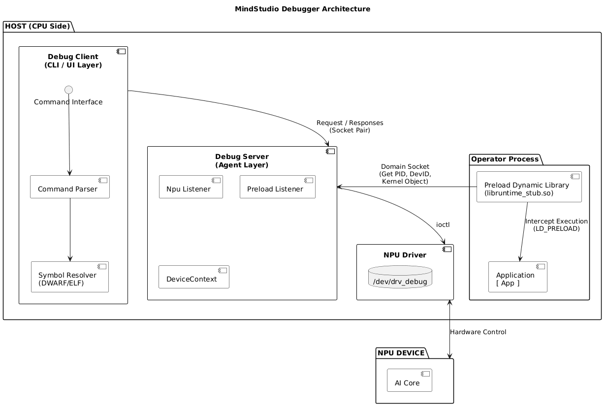

# MindStudio Debugger 功能设计说明书

状态 (Status): Approved  
作者 (Authors): @msot  
创建日期 (Created): 2025-05-08  
更新日期 (Updated): 2025-05-08  
相关 Issue/PR: 78

---

# 1. 概述

## 1.1 简介

本提案旨在设计并实现一款专为 NPU (Neural-network Processing Unit) 算子开发打造的调试工具。该工具类比 CPU 领域的 GDB/LLDB，旨在解决当前 NPU 算子开发过程中“黑盒化”、调试手段匮乏的痛点。它将提供断点设置、单步执行、变量实时查看、Core 文件解析及多核状态可视化等核心能力，将算子开发从“猜错”转变为“查错”，大幅提升开发效率与易用性。

## 1.2 动机

背景与痛点：

目前 NPU 算子开发主要依赖 printf 风格的日志输出或基于仿真器的有限调试。而在真实上板调试上，开发者面临以下问题：  

1. AI Core 分析缺失：​ 无法获知程序具体崩溃在哪一行代码，只能看到 AI Core Error, 无法回溯调用栈
2. 部分内存不可见：​ 当前printf不支持L0内存和寄存器值的打印
3. printf风格打印易用性低：每次需要修改代码重新编译才能打印想看的变量，且printf容易影响算子同步逻辑，多核多线程场景下查看变量也不方便，需要精细化控制打印逻辑

通过引入该工具，开发者可以：

- 精确定位代码行导致的内存越界或计算错误。
- 直观查看每个 NPU Core的执行位置。
- 像调试 C++ 程序一样调试算子，提升算子开发的易用性。

不做此提案的影响：
NPU 算子开发将继续维持低效的“修改-编译-运行-看日志”循环，阻碍新算子的快速落地和业务迭代。

## 1.3 目标

本提案针对NPU算子上板调试功能进行开发，当前目标:

1. AI Core 算子调试，只涉及910B, 950，310P芯片；
2. AI Core Error生成的core文件的解析
3. 每次只能对单张卡做调试

非目标：

1. AI CPU以及cpu程序的调试。
2. core文件的生成

# 2. 用例分析

| 场景描述  | 功能清单    | 功能描述                                                                                                                           | 限制    |
| --------------------------------------------- | ----------------------- | ------------------------------------------------------------------------------------------------------------------------------------ | ------------------- |
| 程序控制  | 断点设置  | 软、硬断点增删管理，其中硬断点只用于simt vf/simd vf| 硬断点只用于simt vf/simd vf, 个数不超过4个; |
| 程序控制  | 单步调试  | step over: 代码行级别单行往下运行; step in: 进入函数 ; step out: 跳出函数 | NA |
| 程序控制  | 恢复运行  | 用于命中断点后的恢复运行，让程序继续运行下去 | NA |
| 程序控制  | 中断运行 | 用于程序卡死在device侧时, 中断运行后查看卡死的代码行位置 | 中断后只支持查看调用栈和上下文切换功能 |
| 信息打印  | 打印变量 | 打印变量的内容，会根据变量类型展示对应的结构体成员, 支持在host代码上打印申请的GM变量内容 | 不支持表达式计算的打印 |
| 信息打印  | 打印寄存器 | 打印寄存器的内容| NA |
| 信息打印  | 打印内存 | 打印不同类型的内存数据，包括UB,GM,L0A,L0B,L0C等 | NA |
| 信息打印  | 上下文切换 | AI Core之间切换，或者Simt vf 里的线程切换，与配合状态信息展示功能或程序控制类功能配合使用 | NA |
| 信息打印  | 状态信息展示 | 展示当前算子使用到的AI Core、Block、Device、Task、Stream、Thread等信息；展示当前AI Core停住位置的代码行信息 | NA |
| 信息打印  | 调用栈回溯 | 展示当前AI Core所在代码行的调用栈 | simt_vf, simd_vf下断点的调用栈不会展示main scalar上；main scalar上的调用栈不会展示出host侧代码 |
| core文件解析 | 信息打印场景所有功能 | 包含上述所有信息打印场景下的所有功能 | NA | 

# 3.方案设计

## 3.1 总体方案

本工具基于LLDB源码进行二次开发，基于代码仓本身的Client-Server结构。

系统由3个核心部分组成：调试客户端 (Client)、调试服务端 (Server)​以及用于劫持用户进程的动态库(Preload Dynamic Library):

Client: 负责解析用户输入的命令，解析ELF里的调试信息，把简化后的命令通过socket-pair方式进行进程间通信发送给Server侧
Server: 负责与驱动通信，通过ioctl把控制消息发送到驱动，获取或控制NPU设备上AI Core的执行状态；接收劫持库发送的pid, device_id， kernel object等信息
Preload Dynamic Library: 实现runtime的桩函数，通过劫持SetDevice，Register Kernel Object，Launch Kernel Object等函数，获取相应的信息，并发送给工具侧。

## 3.2 技术选型（可选）

考虑到GDB的开源协议不适合商用，这里选择lldb代码仓进行二次开发

## 3.3 安全隐私与DFX设计

1. 安全：使用调试功能时，需要root用户打开驱动的通道开关。
2. 可维护性：DeviceContext类可派生出不同芯片类型下的子类，屏蔽底层硬件感知
3. 可靠性：调试工具的劫持库不改变用户算子行为，只做信息收取
4. 可测试性：交互式测试用例以及UT

## 3.4 编程与调用设计

### 3.4.1 编程模型基本设计

环境：​ Linux Host, NPU Driver v26.0+.  
语言：​ C++ (核心引擎).  
约束：​ 被调试的算子二进制必须带有 -g(DWARF) -O0 调试信息。  

### 3.4.2 接口定义与设计

控制AI Core执行状态的结构体定义设计参考arch文档(https://gitcode.com/Ascend/msdebug/blob/master/docs/zh/development_guide/architecture.md)

Coredump文件的结构体定义设置参考[architecture.md](https://gitcode.com/Ascend/msdebug/blob/master/docs/zh/development_guide/architecture.md#4312-%E5%85%B3%E9%94%AE%E5%AD%97%E6%AE%B5%E8%AF%B4%E6%98%8E)

### 3.4.3 使用说明

编译算子: 确保编译时加入 -g -O0选项保留调试符号。
打开驱动通道: `echo 1 > /proc/debug_switch`
启动调试: 执行 `msdebug <app>`，进入交互界面后输入 `b <file_name>:<line_no>`设置断点，然后 `run`.

# 4.测试设计

*介绍该功能的测试方法以及测试用例设计，包括单元测试（unit test），集成测试（integration test），端到端测试（e2e test）等。*

| 测试类型 | 算子场景 |  描述 | 示例 | 
| ------- | ------- | ---- | ---- |
| 单元测试​ | NA |  测试Server测功能函数 | HandleStubDevice测试能否处理收到的device_id信息
| E2E测试 | Simt算子 | 测试上述所有功能是否成功 |  断点设置在simt算子里，能否恢复运行，变量打印等功能
| E2E测试 | Simd算子 | 测试上述所有功能是否成功 |  断点设置在simd算子里，能否恢复运行，变量打印等功能
| E2E测试 | cube算子 | 测试上述所有功能是否成功 |  断点设置在simd算子里，能否恢复运行，变量打印等功能

# 5.缺点和风险（可选）

缺点：当前需要Simt/Simd VF函数，无法做到O0优化，可能部分代码行无法断住

# 6.现有技术（可选）

lldb本身仓库对gpu的支持

# 7.未解决问题（可选）

无

---

附录

* **参考资料链接**
* **术语表**
* **文档更新计划**
