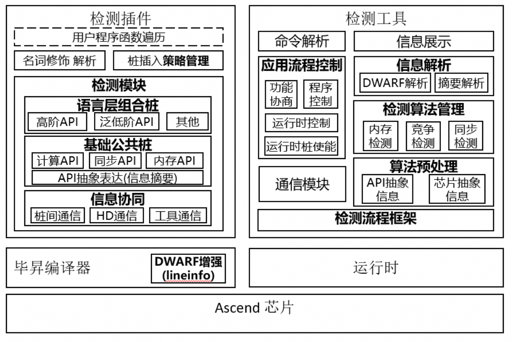
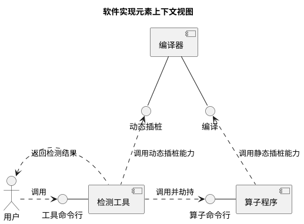
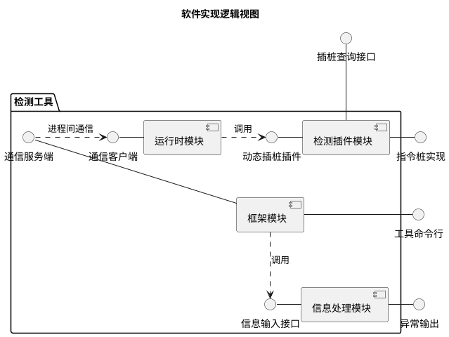
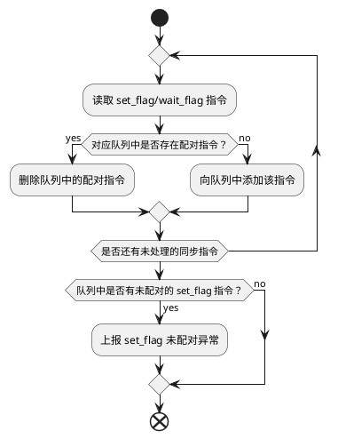

**算子检测工具功能设计文档**

<table>
    <tr>
        <td>所属SIG组:</td>
        <td>msOT</td>
    </tr>
    <tr>
        <td>落入版本:</td>
        <td>MindStudio 26.0.0</td>
    </tr>
    <tr>
        <td>设计人员:</td>
        <td>gong-siwei</td>
    </tr>
    <tr>
        <td>日期:</td>
        <td>2026.01.23</td>
    </tr>
</table>

**Copyright © 2022 openGauss Community**

您对&quot;本文档&quot;的复制，使用，修改及分发受知识共享(Creative Commons)署名—相同方式共享4.0国际公共许可协议(以下简称&quot;CC BY-SA 4.0&quot;)的约束。
为了方便用户理解，您可以通过访问<https://creativecommons.org/licenses/by-sa/4.0/>了解CC BY-SA 4.0的概要 (但不是替代)。
CC BY-SA 4.0的完整协议内容您可以访问如下网址获取：<https://creativecommons.org/licenses/by-sa/4.0/legalcode>。

**改版记录**

<table>
    <tr>
        <th>日期</th>
        <th>修订版本</th>
        <th>修订描述</th>
        <th>作者</th>
        <th>审核</th>
    </tr>
    <tr>
        <td>2026.01.23</td>
        <td>1.0.0</td>
        <td>初版</td>
        <td>gong-siwei</td>
        <td>gong-siwei</td>
    </tr>
</table>


**目录**

1.特性概述

1.1范围

1.2特性需求列表

2.需求场景分析

2.1特性需求来源与价值概述

2.2特性场景分析

2.3特性影响分析

2.3.1硬件限制

2.3.2技术限制

2.3.3对License的影响分析

2.3.4对系统性能规格的影响分析

2.3.5对系统可靠性规格的影响分析

2.3.6对系统兼容性的影响分析

2.3.7与其他重大特性的交互性，冲突性的影响分析

2.4同类社区/商用软件实现方案分析

3.特性/功能实现原理(可分解出来多个Use Case)

3.1目标

3.2总体方案

4.Use Case一实现

4.1设计思路

4.2约束条件

4.3详细实现(从用户入口的模块级别或进程级别消息序列图)

4.4子系统间接口(主要覆盖模块接口定义)

4.5子系统详细设计

4.6DFX属性设计

4.6.1性能设计

4.6.2升级与扩容设计

4.6.3异常处理设计

4.6.4资源管理相关设计

4.6.5小型化设计

4.6.6可测性设计

4.6.7安全设计

4.7系统外部接口

4.8自测用例设计

5.Use Case二实现

6.可靠性&amp;可用性设计

6.1冗余设计

6.2故障管理

6.3过载控制设计

6.4升级不中断业务

6.5人因差错设计

6.6故障预测预防设计

7.安全设计

7.1Low Level威胁分析

7.1.1 2层数据流图

7.1.2业务场景及信任边界说明

7.1.3外部交互方分析

7.1.4数据流分析

7.1.5处理过程分析

7.1.6数据存储分析

7.1.7缺陷列表

7.2敏感数据分析

7.2.1敏感数据清单

7.2.2敏感操作检查

7.3 Use Case实现

7.3.1设计思路

7.3.2详细实现

8.特性非功能性质量属性相关设计

8.1可测试性

8.2可服务性

8.3可演进性

8.4开放性

8.5兼容性

8.6可伸缩性/可扩展性

8.7 可维护性

8.8 资料

9.数据结构设计（可选）

10.参考资料清单


# 1.特性概述

本文档是算子检测工具的功能域设计文档。

## 1.1范围

本文档包含算子检测工具各功能特性设计。

## 1.2特性需求列表

特性需求列表。

<table>
    <tr>
        <th>需求编号</th>
        <th>需求名称</th>
        <th>特性描述</th>
        <th>备注</th>
    </tr>
    <tr>
        <td>1</td>
        <td>mssanitizer支持算子同步检测</td>
        <td>mssanitizer支持算子同步检测</td>
        <td></td>  
    </tr>
</table>


# 2.需求场景分析

## 2.1特性需求来源与价值概述

昇腾芯片本身内部有多个核心，基于昇腾芯片的开发需要小心地处理各个核心负责的内存块，同时，片上内存有对齐的要求，容易产生内存踩踏、内存对齐、内存初始化、流水竞争等问题。本工具提供内存检测、竞争检测等检测功能，帮助用户快速识别并定位此类问题。

本文的目的是对异常检测功能进行设计，明确主要数据结构和主要处理过程，作为今后的编码阶段的输入和编码人员、测试人员的指导。

## 2.2特性场景分析

支持 AscendC 单算子场景的内存检测，包含非法访问、访问对齐错误、多核踩踏（仅 GM）、内存泄漏、内存重复释放检测功能；
支持 AscendC 单算子场景的竞争和同步检测；
支持算子直调、AclNN 单算子调用、PyTorch 接入等常用算子接入方式的检测；
支持 CANN 软件栈的内存检测

## 2.3特性影响分析

见2.2。

### 2.3.1硬件限制

支持A2、A3、310P、A5。

### 2.3.2技术限制

上板调试能力受限于编译器能够提供的插桩能力。

### 2.3.3对License的影响分析

不涉及。

### 2.3.4对系统性能规格的影响分析

检测耗时：检测耗时应尽可能短，保障大算子、整网检测、多卡检测场景下的可用性，整体耗时应压缩到一小时内。

### 2.3.5对系统可靠性规格的影响分析

算子异常退出时，应保证可检出退出前的异常指令。

### 2.3.6对系统兼容性的影响分析

不涉及。

### 2.3.7与其他重大特性的交互性，冲突性的影响分析

设计上暂无与其他工具配合使用的场景。

# 3.特性/功能实现原理

## 3.1目标

本软件主要向用户提供了一个命令行工具 mssanitizer，用户可使用工具启动待检测的程序，并得到检测结果。

## 3.2总体方案

异常检测工具的整体架构设计图如下：



根据架构设计，本工具可分为以下四个功能模块进行模块设计：

- 框架模块
- 运行时模块
- 信息处理模块
- 检测插件模块

##### 框架模块

该模块提供了从命令行入口开始到异常检测结束整个流程的控制。提供的具体功能如下：

1. 支持解析用户命令行参数，并根据用户指定的参数生成对应的检测配置和流程控制参数
2. 支持用户待检测程序的拉起，并使能正确的运行时模块进行劫持
3. 提供进程间通信能力，支持接收运行时模块上报的程序运行信息

接口和数据描述：

1. 框架模块作为工具的入口，对用户提供命令行接口，接口的详细描述见[工具命令行选项表](#command-line-interface-desc)
2. 提供进程间通信中的服务端能力，接口的详细描述见[进程间通信接口](#process-communication-interface-desc)

##### 运行时模块

该模块主要用于收集用户进程在运行期间的操作信息，并回传给框架模块。提供的具体功能如下：

1. 支持上报 device 设备上下文信息
2. 支持针对 CANN 软件栈中 HAL、RT、ACL 模块的内存操作信息分层级上报
3. 支持上报 kernel 上下文信息，如算子二进制、kernel name 等
4. 支持扩展 rtKernelLaunch 系列接口参数，使能 device 侧桩信息记录，并上报至框架模块

接口和数据描述：

1. 运行时模块需要劫持一些感兴趣的运行时接口，劫持接口的列表和功能见[运行时模块接口清单](#runtime-injection-interface-list)
2. 运行时模块向框架模块上报信息时，需要对信息进行表达，描述见[运行时模块接口信息模型](#process-communication-protocol-desc)

##### 信息处理模块

该模块主要用于分析收集到的信息，根据用户选择的模式进行异常检测，并向用户报告检测结果。提供的具体功能如下：

1. 提供检测算法的管理功能，需要对检测算法进行合适的抽象以方便扩展
2. 提供运行时模块上报的桩记录预处理功能，将原始指令记录处理为统一的描述，作为检测算法的输入
3. 提供内存检测算法，支持内存非法读写、非对齐访问、内存泄漏、非法释放等异常的检测
4. 提供竞争检测算法，支持核间检测、流水间检测、流水内检测功能
5. 提供未初始化检测算法

接口和数据描述：

1. 信息处理模块需要向框架模块提供数据输入接口，以及输入数据的格式，具体描述见[信息处理模块接口信息模型](#sanitizer-interface-data-desc)
2. 模块检测完成后将结果报告给用户，对异常信息格式进行了设计

##### 检测插件模块

该模块主要用于协同编译器完成检测桩插入，从而实现内存和同步事件的记录和上报。提供的具体功能如下：

1. 向编译器提供桩插入策略查询接口，协同编译器在正确位置插入正确的桩函数
2. 向编译器提供各桩函数的实现

接口和数据描述：

1. 检测插件提供策略查询接口，与编译器约定的协议格式见[检测插件插桩策略查询](#sanitizer-plugin-strategy-query)
2. 检测插件提供桩函数的实现，桩函数的设计描述见[检测插件指令桩接口描述](#sanitizer-plugin-intrinsics-interface-desc)

#### 上下文视图

下图展示了检测工具在使用场景中的上下文视图：



#### 逻辑视图

检测工具内部模块之间的逻辑视图如下：




# 4.支持同步检测

## 4.1设计思路

同步检测通过 synccheck 子工具提供，当前场景仅需要支持同步指令配对检测。

昇腾硬件上由多条流水并行执行不同任务，流水间同步使用 set_flag/wait_flag 指令实现，原型为：`set_flag/wait_flag(src, dst, eventId);`
 
理论上相同 src、dst、eventId 的 set 和 wait 指令应配对出现。如果 wait_flag 没有配对的 set_flag，会导致程序阻塞，该问题相对容易发现。如果 set_flag 没有配对的 wait_flag，从当前程序来看并不会出现什么问题。但由于流水间的同步由计数器来实现，就会导致当前程序结束后计数器未归零，后续程序的同步指令配对会不符合预算，造成精度问题。
 
msSanitizer 侧提供流水间同步指令配对检测，设计如下：
1.  src、dst、eventId 作为同步事件的唯一 id，用于索引同步事件以及判定配对关系；
2. 历史同步事件保存在队列中，当接收到新的同步事件时，在队列中查找配对的事件进行消除；没有配对的事件则将当前事件保存到队列中；
3. 所有事件处理完毕后，检查队列中是否有未配对的 set_flag 事件，有则报告异常

同步指令未配对异常需要包含以下信息：
1. 同步指令流水信息，包含源流水和目的流水；
2. 异常定位信息，包含 kernel name、block 信息、device 信息、代码调用栈等；
显示格式示例如下：

```
====== WARNING: Unpaired set_flag instructions detected 
======    from PIPE_MTE2 to PIPE_MTE3 in hardware_sync_mix_mix_aic 
======    in block aiv(0) on device 1 
======    code in pc current 0x1b280 (serialNo:8) 
======    #0 kernel.cpp:28:5
```

## 4.2约束条件

需要编译器实现同步指令插桩能力。

## 4.3详细实现

同步检测用于检查算子程序中是否正确使用了同步原语，广义上包括 kernel 上的核间和流水间同步以及 host 侧的流同步等概念。当前检测工具支持的同步检测类型如下：

set_flag/wait_flag配对检测：用于检测 SIMD 架构上流水间同步指令的配对情况，如果 set_flag 或 wait_flag 缺少对应的配对指令，则报告异常。

set_flag/wait_flag 配对检测需要记录 kernel 执行时所有的 set_flag/wait_flag 指令。指令的原型如下：

```
void set_flag(pipe_t pipe, pipe_t tpipe, event_t eventID);
void wait_flag(pipe_t pipe, pipe_t tpipe, event_t eventID);
```

配对检测算法中，针对不同的源流水、目的流水、事件 ID 生成一条 set_flag/wait_flag 队列用于保存当前已出现的同步指令信息，具体算法流程如下：



## 4.4子系统间接口(主要覆盖模块接口定义)

NA。

## 4.5子系统详细设计

NA。

## 4.6DFX属性设计

### 4.6.1性能设计

NA。

### 4.6.2升级与扩容设计

不涉及。

### 4.6.3异常处理设计

算子运行异常退出时，依然可以检出退出前出现的异常指令。

### 4.6.4资源管理相关设计

不涉及。

### 4.6.5小型化设计

不涉及。

### 4.6.6可测性设计

不涉及。

### 4.6.7 安全设计

#### 4.6.7.1 安全设计确认

*参考安全设计checklist进行确认*

| 安全属性     | 检查项                                                       | 检查项详细说明                                               | 是否涉及 | 是否满足 |
| ------------ | ------------------------------------------------------------ | ------------------------------------------------------------ | -------- | -------- |
| 访问通道控制 | 是否新增侦听端口                                             | 新增侦听端口需刷新通信矩阵                                   | 不涉及   |          |
| 访问通道控制 | 是否新增进程或组件间通信                                     | 新增进程或组件间通信刷新通信矩阵                             | 不涉及   |          |
| 访问通道控制 | 是否新增认证方式                                             | 新增认证方式需刷新通信矩阵及产品文档                         | 不涉及   |          |
| 权限控制     | 是否涉及创建文件或目录                                       | 创建文件或目录须显式指定文件或目录的访问权限                 | 不涉及   |          |
| 权限控制     | 账号权限是否满足"权限最小化原则"                             | 系统中各账号应赋予最小权限                                   | Y        | Y        |
| 权限控制     | 是否存在用户权限提升                                         | 禁止出现用户非法权限提升                                     | Y        | Y        |
| 未公开接口   | 是否新增GUC参数                                              | 新增GUC参数需刷新产品文档                                    | 不涉及   |          |
| 未公开接口   | 是否新增或修改函数、视图、系统表                             | 新增或修改函数、视图、系统表需刷新产品文档，考虑权限控制     | Y        | Y        |
| 未公开接口   | 是否新增SQL语法                                              | 新增SQL语法需刷新产品文档，支持记录审计日志                  | 不涉及   |          |
| 未公开接口   | 是否新增内部工具                                             | 新增内部工具需刷新产品文档                                   | 不涉及   |          |
| 未公开接口   | 脚本中是否存在注释代码                                       | Shell/Python等解释性语言禁止注释代码，注释代码需要删除       | 不涉及   |          |
| 未公开接口   | 是否存在隐藏命令、参数、端口等接入方式                       | 对于现网维护期间不会使用的命令/参数、端口等接入方式（包括但不限于产品的生产、调测、维护用途），必须删除（如通过编译宏） | 不涉及   |          |
| 未公开接口   | 系统是否存在隐藏后门                                         | 禁止系统预留任何的未公开账号，所有账号必须可被系统管理，并在资料中予以说明 | 不涉及   |          |
| 未公开接口   | 禁止在产品对外部用户发布的软件（包含软件包/补丁包）中提供破解类、网络嗅探类工具。 | 1、禁止在产品对外部用户发布的软件（包含软件包/补丁包）中提供可修改任意用户口令、具有“口令破解能力”（指口令暴力破解、利用系统/算法漏洞恶意破解口令）、对包含敏感数据的文件（如包含密钥的配置文件、数据库）进行解密的功能或工具。2、禁止在系统中保留第三方的网络嗅探工具tcpdump、gdb、strace、readelf网络、进程检测工具，cpp、gcc、dexdump、mirror、JDK开发/编译工具和仅在调测阶段使用的自研检测工具/脚本（例如：仅在调试阶段使用的加解密脚本、调测功能、可以提权的命令），由于业务需要必须保留的，需要进行严格的访问控制。同时在资料中说明保留的原因、使用的场景、风险。 | 不涉及   |          |
| 敏感数据保护 | 认证凭据不允许明文存储在系统中，应该加密保护。               | 认证凭据（如口令/私钥等）不允许明文存储在系统中，应该加密保护。 | 不涉及   |          |
| 敏感数据保护 | 用于敏感数据传输加密的密钥，不能硬编码在代码中。             | 禁止口令和密钥硬编码。                                       | 不涉及   |          |
| 敏感数据保护 | 是否明文打印口令或密钥等敏感信息                             | 禁止在系统中存储的日志、调试信息、错误提示及ps命令等信息打印明文敏感信息（口令/私钥/预共享密钥）。 | 不涉及   |          |
| 敏感数据保护 | 是否明文回显口令                                             | 禁止明文回显口令。                                           | 不涉及   |          |
| 敏感数据保护 | 是否使用第三方和开源软件的缺省口令                           | 禁止使用第三方和开源软件的缺省口令，参考安全设计指南第1.5章节。 | 不涉及   |          |
| 敏感数据保护 | 是否将密码明文存储在配置文件中                               | 明文密码不允许写入配置文件（命令行工具安装部署及使用时必需配置密码的场景除外）。 | 不涉及   |          |
| 敏感数据保护 | 是否使用不安全的加密算法                                     | 禁止使用私有的或业界已知不安全的加密算法。推荐加密算法安全设计指南6.2章节。 | 不涉及   |          |
| 敏感数据保护 | 口令等敏感信息是否使用安全的传输通道                         | 在非信任网络之间进行敏感信息传输须采用安全传输通道或者加密后传输。参考安全设计指南第10章。 | 不涉及   |          |
| 敏感数据保护 | 内存中口令或密钥等敏感信息使用后是否销毁                     | 内存中的口令或密钥等信息使用完毕后立即清0。                  | 不涉及   |          |
| 敏感数据保护 | 密码算法中使用到的随机数必须是密码学意义上的安全随机数。     | 密码算法中使用到的随机数必须是密码学意义上的安全随机数，参考安全设计指南6.3章节。 | 不涉及   |          |
| 敏感数据保护 | 资料中是否存在不安全的示例                                   | 资料中的示例需要是安全的，对用户进行正确的引导，若示例中存在潜在的风险，要在资料中进行说明。 | 不涉及   |          |
| 认证         | 是否提供认证机制                                             | 新系统需要提供认证机制并缺省开启。                           | 不涉及   |          |
| 认证         | 认证是否在服务端进行                                         | 认证处理过程需要在服务端进行。                               | 不涉及   |          |
| 认证         | 认证失败后服务端是否返回有效信息                             | 认证失败后，服务端返回信息不能提供详细的、可用于判断具体错误原因的提示。 | 不涉及   |          |
| 外部参数校验 | 是否对外部输入进行合法性校验                                 | 1、使用外部输入数据作为循环终止条件、数组下标、内存分配大小参数等，可能导致系统出现死循环、缓冲区溢出、内存越界、拒绝服务等一系列行为。2、文件路径等外部输入应进行合法性校验，防止注入风险 | Y        | Y        |
| 三方件引入   | 是否新引入三方组件                                           | 1.新增三方组件需要通过安全编译选项、病毒、漏洞、开源片段引用、license合规、开源组件扫描，参考版本发布网络安全质量要求。2.新增三方组件需保证来源可信。 | 不涉及   |          |

#### 4.6.7.2 敏感数据分析

##### 1. 敏感数据清单

不涉及。

##### 2. 敏感操作检查

不涉及。

#### 4.6.7.3 设计实现

不涉及。

## 4.7系统外部接口

###### 工具命令行选项表

| 命令              | 功能描述                                                     |
| ----------------- | ------------------------------------------------------------ |
| -t, --tool <name> | synccheck 同步检测模块 |

## 4.8自测用例设计

NA。

# 6.可靠性&amp;可用性设计

## 6.1冗余设计

不涉及。

## 6.2故障管理

不涉及。

## 6.3过载控制设计

不涉及。

## 6.4升级不中断业务

不涉及。

## 6.5人因差错设计

不涉及。

## 6.6故障预测预防设计

不涉及。

# 7.特性非功能性质量属性相关设计

## 7.1可测试性

基于mssanitizer的UT测试框架实现。

## 7.2可服务性

开发态工具，不涉及。

## 7.3可演进性

不涉及。

## 7.4开放性

不涉及。

## 7.5兼容性

新特性与旧特性全量兼容。

## 7.6可伸缩性/可扩展性

不涉及。

## 7.7可维护性

不涉及。

## 7.8资料

资料新增同步检测接口介绍。

# 8.数据结构设计（可选）

不涉及。

# 9.参考资料清单