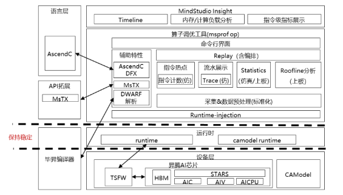
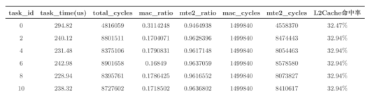
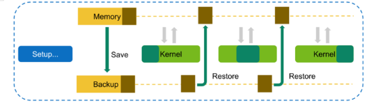
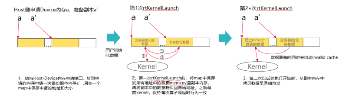
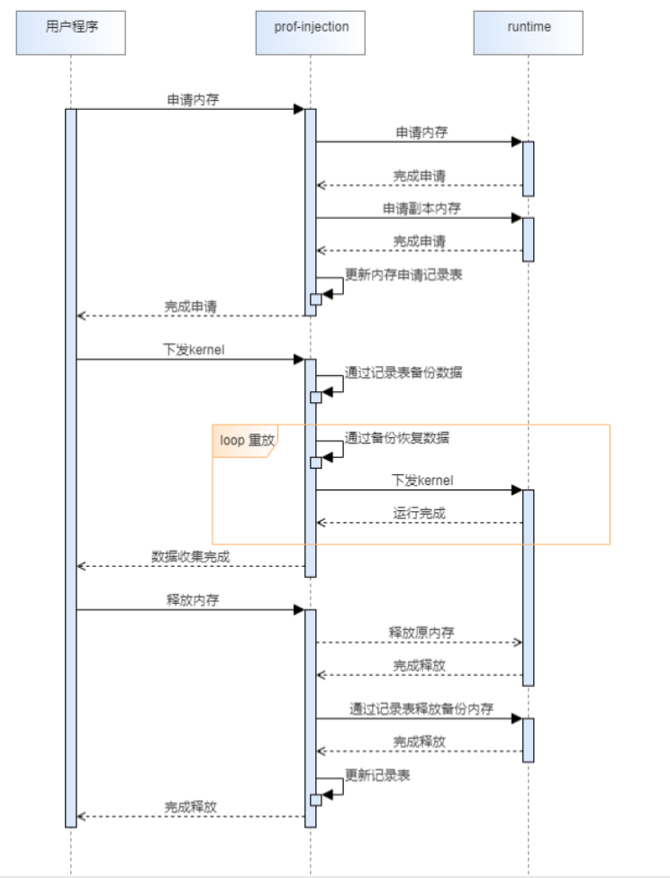
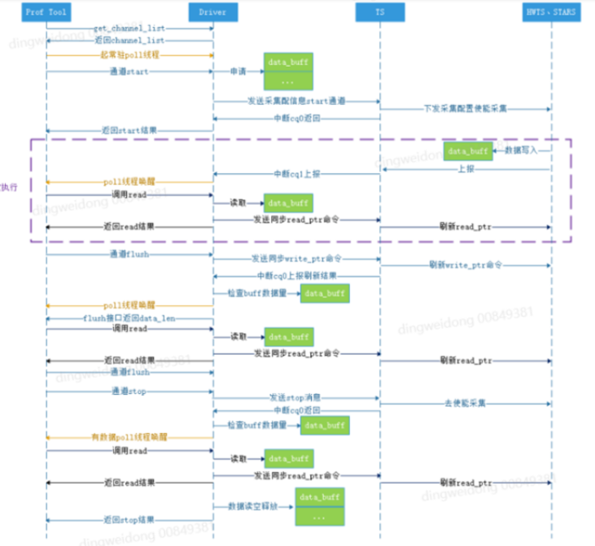
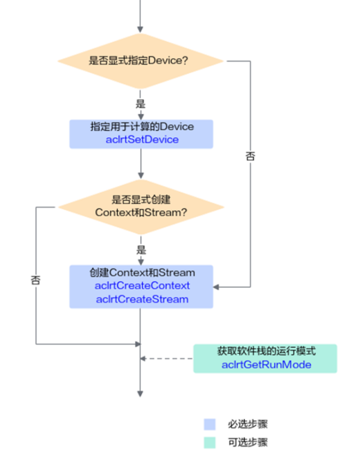
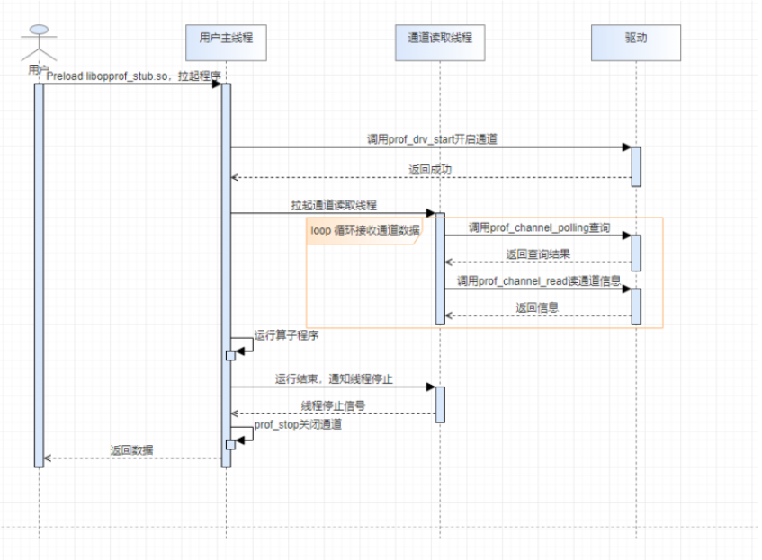

**MindStudio-Ops-Profiler特性设计说明书**

<table>
    <tr>
        <td>所属SIG组:</td>
        <td>msot</td>
    </tr>
    <tr>
        <td>落入版本:</td>
        <td>MindStudio 26.0.0</td>
    </tr>
    <tr>
        <td>设计人员:</td>
        <td>陈泽仁</td>
    </tr>
    <tr>
        <td>日期:</td>
        <td>2026.1.23</td>
    </tr>
</table>

**Copyright © 2022 openGauss Community**

您对&quot;本文档&quot;的复制，使用，修改及分发受知识共享(Creative Commons)署名—相同方式共享4.0国际公共许可协议(以下简称&quot;CC BY-SA 4.0&quot;)的约束。
为了方便用户理解，您可以通过访问<https://creativecommons.org/licenses/by-sa/4.0/>了解CC BY-SA 4.0的概要 (但不是替代)。
CC BY-SA 4.0的完整协议内容您可以访问如下网址获取：<https://creativecommons.org/licenses/by-sa/4.0/legalcode>。

**改版记录**

<table>
    <tr>
        <th>日期</th>
        <th>修订版本</th>
        <th>修订描述</th>
        <th>作者</th>
        <th>审核</th>
    </tr>
    <tr>
        <td>2026.1.23</td>
        <td>初版</td>
        <td>开源仓首次修订的新版本，针对26.0.0</td>
        <td>陈泽仁</td>
        <td>陈泽仁</td>
    </tr>
</table>

**目录**

1.特性概述

1.1范围
昇腾A2/A3/A5/310P系列芯片

1.2特性需求列表
A2/A3:
a.支持Scalar细粒度性能数据分析
b.支持算子自定义打点性能数据展示

2.需求场景分析

2.1特性需求来源与价值概述
NA

2.2特性场景分析
主要针对开发者的算子提供硬件/仿真运行性能数据报告，帮助开发者识别算子性能瓶颈，指导代码性能优化

2.3特性影响分析
NA

2.3.1硬件限制
昇腾A2/A3/A5/310P系列芯片

2.3.2技术限制
NA

2.3.3对License的影响分析
NA

2.3.4对系统性能规格的影响分析
NA

2.3.5对系统可靠性规格的影响分析
NA

2.3.6对系统兼容性的影响分析
NA

2.3.7与其他重大特性的交互性，冲突性的影响分析
NA

2.4同类社区/商用软件实现方案分析
NA

3.特性/功能实现原理(可分解出来多个Use Case)

3.1目标
提供工具辅助用户进行自定义算子的性能分析，帮助用户开发高性能算子

3.2总体方案

4.Use Case一上板数据采集

4.1设计思路
上板运行过程主要收集以下三类数据：
1、芯片通过驱动通道上报数据
2、基于软件实现的Kernel运行时数据dump（包含AscendC打点、动态插桩数据收集）
3、通过Profiling/Mstx接口收集的各外部组件上报数据

算子重放
其中由于芯片单次能够通过PMU采集的数据有限，需要引入重放机制。
友商目前支持三种重放逻辑，分别是：
1、基于kernel的重放
2、基于application的重放
3、使用接口自定义范围的重放
其次，算子运行有warm-up的时间，如下图所示：

六组数据中，第一次运行的task_time耗时比第二组耗时高出50+us,第二次运行之后数据趋于稳定。算子调优工具需要具备排除warm-up时间，给用户呈现算子真实的上板数据。
实验证明，通过反复拉起Application的方式并不能解决warm-up问题，需要在同一个Application中反复对kernel的调用才能进行warm-up，因此针对该功能，优先实现kernel重放。
kernel重放的整体实现思路参照友商：

通过对用户的所有内存数据进行backup，在调度kernel时进行restore，以保证每次调度时用户使用的内存数据都能恢复原状。
Profiling数据收集
由于当前存在一些通算融合形式的算子，部分数据需要依赖host侧组件进行上报。该部分数据可以通过Profling接口进行收集，但是工具本身不希望强依赖libprofapi.so，因此主要通过劫持接口的方式进行
1、使能收集：劫持Profiling的开关回调接口，根据moduleId配置开关
2、数据收集：劫持host数据上报接口，获取数据
 
动态插桩数据收集
重放过程中使能动态插桩后，编译器会在最后新增一个入参，算子执行结束后，将该入参拷贝回Host侧，以完成数据收集

4.2约束条件
kernel重放过程中，硬件上申请的内存空间不能超过总空间的一半，不然没有足够的资源进行内存备份

4.3详细实现
Kernel重放功能实现设计
一、普通算子重放实现设计（包含一般aiv/aic/mix算子）
Kernel重放实现流程如下：

该功能需要新增对runtime接口的打桩。实现内存申请接口的劫持，用于进行备份
重放时序图

在上述的流程中，通过预加载prof-injection的方式对以下的接口进行打桩：
<table>
   <tr>
       <th>runtime接口</th>	
       <th>接口作用</th>	
       <th>插桩内容</th>
   </tr>
   <tr> 
   <tr>   
<td>rtMalloc</td>	<td>Device侧GM内存申请</td>	<td>记录申请的大小、地址，创建副本内存</td></tr>
<tr>
<td>rtFree</td>	<td>Device侧GM内存释放</td>	<td>释放副本内存</td></tr>
<tr>
<td>rtKernelLaunch</td>	<td><<<>>>拉起算子</td>	<td>第一次跑的时候将原内存更新至副本内存
后续重放时从副本内存获取值
需要针对每一次的重放逻辑增加同步，确保每次采集到的数据是完整的</td></tr>
<tr><td>rtKernelLaunchWithHandle</td>	<td>ACLNN拉起动态算子</td>	<td>同上</td></tr>
<tr><td>rtKernelLaunchWithFlag</td>	<td>ACLNN拉起静态算子</td>	<td>同上</td></tr>
</table>

注意，在副本内存拷贝时需要使用rtMemcpyAsync，通过SDMA的机制搬运内存，之后还需要rtSynchronizeStream阻塞完成。rtMemcpy走的是CPU路线，会出现一些Cache异常。

Kernel重放进行数据采集
一、重放顺序
每次重放都要执行不同的采集任务，由于PMU一次性最多只能采集8个event，这里需要针对用户配置的采集项，尽可能减少重放的次数。
针对用户的输入，可以按如下逻辑分析：
1、将所有用户输入的采集项对应的Event ID拆解，根据AIV/AIC组合成两个队列
2、调优工具将队列发送到用户进程，用户进程采集时，每次从两个队列中按顺序取8个Event ID，作为重放时采集的数据
3、最终所有数据合并成一个二进制落盘，调优工具在解析落盘数据时，也按队列顺序来逐个提取数据
4、提取的数据再重新根据用户配置的采集项进行重组分析
 
当前重放采集的顺序如下：
第1次采集：不做任何工作，用于解决warm-up问题
第2-n次采集：根据用户配置进行数据收集
 
二、通过驱动采集profiling数据
驱动提供的数据上报流程如下：

上述流程主要通过dlopen驱动提供的libascend_hal.so，调用其中的接口来完成。
主要涉及如下几个接口：
    
int prof_drv_start(unsigned int, unsigned int, struct prof_start_para *)
该接口用于开启profiling通道。
入参：
1.device_id：设备id
2.channel_id:  通道id
3.prof_start_para：通道配置结构体
返回值：0成功、非0失败
注意:该接口需要在待调优应用同一进程中开启才能生效
 
int prof_stop(unsigned int, unsigned int)
该接口用于关闭profiling通道。
入参：
1.device_id
2.channel_id
返回值：0成功、非0失败
 
int prof_channel_read(unsigned int, unsigned int, char *, unsigned int)
该接口用于读取通道内的数据，为非阻塞式的接口。
入参：
1.device_id
2.channel_id
3.buffer :用于接收数据的buffer，最大收到的消息量为1024*1024*2
4.size: buffer的大小
返回值：正数：读到的数据大小负数：失败错误码
 
int prof_channel_poll(struct prof_poll_info *, int, int)
该接口用于读取通道内的数据，为非阻塞式的接口。
入参：
1.polling信息上报的数组，用于存储polling到的通道，最大为6
2.polling的通道数
3.timeout，单位为s
返回值：polling到的通道数
该接口为阻塞式接口，每次最多polling到6个有数据上报的通道，与prof_channel_read配合使用。
 
上面已经说明了如何在程序中开启性能数据上报，接下来我们需要关注如何将打开通道的逻辑以及通道读取线程挂接到用户程序上。根据ACL的接口使用方式，用户在调度算子时必须按以下流程来配置Context和Device信息

在工具拉起调优程序时，可以使用LD_PRELOAD的方式劫持rtSetDevice/rtSetDeviceEx/rtCtxCreate接口，在劫持的接口中去获取Device_id，以及完成通道开启等相关操作。但是要注意的是，这里用户也可以同时调用多个接口，到时候用于运行算子的Device_id会由后调用的接口决定。所以通道相关的逻辑需要设计为可重入的，即当用户调用多个接口时，可以确保把原来的通道关闭、线程停止，并重新开启新的通道与线程。
主线程需要创建一个thread_local变量，并在析构函数中去修改全局标志位，通过这种方式通知读取上报数据的子线程退出，并关闭通道。
整体流程如下：

4.4子系统间接口(主要覆盖模块接口定义)
NA
4.5子系统详细设计
NA
4.6DFX属性设计
NA
4.6.1性能设计
NA
4.6.2升级与扩容设计
NA
4.6.3异常处理设计
NA
4.6.4资源管理相关设计
NA
4.6.5小型化设计
NA
4.6.6可测性设计
NA
4.6.7安全设计
NA
4.7系统外部接口
<table>
<tr><th>接口</th>	<th>说明</th>	<th>参数样例</th></tr>
<tr><td>--replay-mode</td>	<td>
指令重放模式 
kernel:kernel级重放 
application:应用级重放 
range:范围级重放</td>	<td>--replay-mode=kernel</td></tr>
</table>

4.8自测用例设计

5.Use Case二实现

6.可靠性&amp;可用性设计

6.1冗余设计

6.2故障管理

6.3过载控制设计

6.4升级不中断业务

6.5人因差错设计

6.6故障预测预防设计

7.安全设计

7.1Low Level威胁分析

7.1.1 2层数据流图

7.1.2业务场景及信任边界说明

7.1.3外部交互方分析

7.1.4数据流分析

7.1.5处理过程分析

7.1.6数据存储分析

7.1.7缺陷列表

7.2敏感数据分析

7.2.1敏感数据清单

7.2.2敏感操作检查

7.3 Use Case实现

7.3.1设计思路

7.3.2详细实现

8.特性非功能性质量属性相关设计

8.1可测试性

8.2可服务性

8.3可演进性

8.4开放性

8.5兼容性

8.6可伸缩性/可扩展性

8.7 可维护性

8.8 资料

9.数据结构设计（可选）